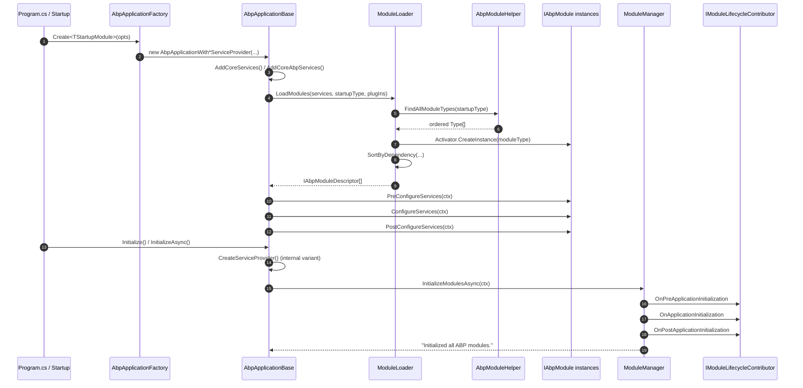

This page traces the **ABP Framework** application bootstrap sequence end-to-end: from the very first call into `AbpApplicationFactory.Create` (or `CreateAsync`), through module discovery and dependency sorting, the three service-configuration phases (`PreConfigureServices` → `ConfigureServices` → `PostConfigureServices`), service-provider construction, and the four module-lifecycle contributor phases that fire during `Initialize`. Every hop names the concrete file and method that runs it, so you can step through bootstrap with a debugger in hand.

<Info>
The "application" referenced throughout this page is `IAbpApplication` — the singleton object that owns the `IServiceCollection`, the resolved `Modules`, the `ServiceProvider`, and the `Shutdown` callbacks. Two concrete implementations exist: `AbpApplicationWithInternalServiceProvider` (used by console hosts that have ABP build the container) and `AbpApplicationWithExternalServiceProvider` (used by ASP.NET Core hosts where the generic-host builder already owns the container).
</Info>

## 1. Sequence overview



## 2. Entry points: `AbpApplicationFactory`

Every ABP host starts in `framework/src/Volo.Abp.Core/Volo/Abp/AbpApplicationFactory.cs`. The class exposes eight static overloads (sync/async × internal/external service-provider × generic/non-generic). They all funnel into either `AbpApplicationWithInternalServiceProvider` or `AbpApplicationWithExternalServiceProvider`.

```csharp
public static IAbpApplicationWithInternalServiceProvider Create(
    [NotNull] Type startupModuleType,
    Action<AbpApplicationCreationOptions>? optionsAction = null)
{
    return new AbpApplicationWithInternalServiceProvider(startupModuleType, optionsAction);
}
```

The async overloads set `options.SkipConfigureServices = true` on the way in and then `await app.ConfigureServicesAsync()` once the constructor returns, so that async `PreConfigureServicesAsync` methods on modules can actually be awaited.

| File | Symbol | Role |
| --- | --- | --- |
| `Volo.Abp.Core/Volo/Abp/AbpApplicationFactory.cs` | `Create<TStartupModule>` | Public sync entry, internal SP |
| `Volo.Abp.Core/Volo/Abp/AbpApplicationFactory.cs` | `CreateAsync<TStartupModule>` | Public async entry, internal SP |
| `Volo.Abp.Core/Volo/Abp/AbpApplicationFactory.cs` | `Create(Type, IServiceCollection, ...)` | External SP entry used by ASP.NET hosts |

## 3. `AbpApplicationBase` constructor — wiring the core

`framework/src/Volo.Abp.Core/Volo/Abp/AbpApplicationBase.cs` is where ABP itself is installed into your `IServiceCollection`. The internal constructor runs in this order:

```csharp
internal AbpApplicationBase(Type startupModuleType, IServiceCollection services, ...)
{
    StartupModuleType = startupModuleType;
    Services = services;
    services.TryAddObjectAccessor<IServiceProvider>();

    var options = new AbpApplicationCreationOptions(services);
    optionsAction?.Invoke(options);

    ApplicationName = GetApplicationName(options);

    services.AddSingleton<IAbpApplication>(this);
    services.AddSingleton<IApplicationInfoAccessor>(this);
    services.AddSingleton<IModuleContainer>(this);
    services.AddSingleton<IAbpHostEnvironment>(new AbpHostEnvironment() { EnvironmentName = options.Environment });

    services.AddCoreServices();
    services.AddCoreAbpServices(this, options);

    Modules = LoadModules(services, options);

    if (!options.SkipConfigureServices) { ConfigureServices(); }
}
```

<Steps>
  <Step title="Register self as singleton">
    The `AbpApplicationBase` instance is added as `IAbpApplication`, `IApplicationInfoAccessor`, and `IModuleContainer`. The same object is the module list, so `IModuleContainer.Modules` is what other services later iterate.
  </Step>
  <Step title="AddCoreServices() / AddCoreAbpServices()">
    These extension methods live in `Volo.Abp.Core/Volo/Abp/Internal/InternalServiceCollectionExtensions.cs`. They register the `IModuleLoader`, the `ITypeFinder`, the `IInitLoggerFactory`, and — critically for step 7 below — the four default `IModuleLifecycleContributor` types via `AbpModuleLifecycleOptions`.
  </Step>
  <Step title="LoadModules(...)">
    Hands off to `ModuleLoader.LoadModules` (see §4).
  </Step>
  <Step title="ConfigureServices()">
    Runs the three-phase service configuration unless the caller asked to defer it.
  </Step>
</Steps>

## 4. Module discovery: `ModuleLoader.LoadModules`

`framework/src/Volo.Abp.Core/Volo/Abp/Modularity/ModuleLoader.cs` is responsible for turning a single startup-module `Type` into a fully ordered `IAbpModuleDescriptor[]`.

```csharp
public IAbpModuleDescriptor[] LoadModules(
    IServiceCollection services,
    Type startupModuleType,
    PlugInSourceList plugInSources)
{
    var modules = GetDescriptors(services, startupModuleType, plugInSources);
    modules = SortByDependency(modules, startupModuleType);
    return modules.ToArray();
}
```

The discovery pass walks `[DependsOn]` attributes recursively from the startup module. The recursive walk is in `AbpModuleHelper.FindAllModuleTypes`:

```csharp
foreach (var moduleType in AbpModuleHelper.FindAllModuleTypes(startupModuleType, logger))
{
    modules.Add(CreateModuleDescriptor(services, moduleType));
}
```

`CreateModuleDescriptor` calls `CreateAndRegisterModule`, which is the place where an `IAbpModule` instance physically exists for the first time:

```csharp
protected virtual IAbpModule CreateAndRegisterModule(IServiceCollection services, Type moduleType)
{
    var module = (IAbpModule)Activator.CreateInstance(moduleType)!;
    services.AddSingleton(moduleType, module);
    return module;
}
```

After all descriptors are constructed, `SetDependencies` re-walks `[DependsOn]` to wire `AbpModuleDescriptor.Dependencies`, and `SortByDependency` calls `SortByDependencies(m => m.Dependencies)` from `Volo.Abp.Collections`. Finally `MoveItem(m => m.Type == startupModuleType, modules.Count - 1)` ensures the startup module always runs **last** in `ConfigureServices` and `Initialize` (so application-level overrides win), but **first** in `Shutdown` (because `ModuleManager.ShutdownModules` reverses the list).

| File | Symbol | What it does |
| --- | --- | --- |
| `Volo.Abp.Core/Volo/Abp/Modularity/ModuleLoader.cs` | `FillModules` | Enumerates startup + plug-in modules |
| `Volo.Abp.Core/Volo/Abp/Modularity/AbpModuleHelper.cs` | `FindAllModuleTypes` | Recursive `[DependsOn]` walk |
| `Volo.Abp.Core/Volo/Abp/Modularity/ModuleLoader.cs` | `CreateAndRegisterModule` | `Activator.CreateInstance` + DI registration |
| `Volo.Abp.Core/Volo/Abp/Modularity/ModuleLoader.cs` | `SortByDependency` | Topological sort, startup last |

## 5. Three-phase service configuration

`AbpApplicationBase.ConfigureServices` (and its async twin `ConfigureServicesAsync`) iterates the sorted module list three times. The same `ServiceConfigurationContext` instance is reused across all phases so options registered in `PreConfigureServices` are visible in later phases.

### 5.1 `PreConfigureServices`

```csharp
foreach (var module in Modules.Where(m => m.Instance is IPreConfigureServices))
{
    try { ((IPreConfigureServices)module.Instance).PreConfigureServices(context); }
    catch (Exception ex) { throw new AbpInitializationException(...); }
}
```

The contract lives in `Volo.Abp.Core/Volo/Abp/Modularity/IPreConfigureServices.cs`:

```csharp
public interface IPreConfigureServices
{
    Task PreConfigureServicesAsync(ServiceConfigurationContext context);
    void PreConfigureServices(ServiceConfigurationContext context);
}
```

This phase is where modules expose `IOptions` configuration types that **other** modules will need to mutate in the next phase. Typical use: `AbpAspNetCoreModule.PreConfigureServices` (in `framework/src/Volo.Abp.AspNetCore/Volo/Abp/AspNetCore/AbpAspNetCoreModule.cs`) seeds `IAbpHostEnvironment.EnvironmentName` from `IWebHostEnvironment` before any other module reads it.

### 5.2 `ConfigureServices`

The middle phase walks **every** module (not just `IPreConfigureServices` implementers) and does two things per module:

1. If `!abpModule.SkipAutoServiceRegistration`, it calls `Services.AddAssembly(assembly)` for each assembly the module declares via `IDependedTypesProvider.AllAssemblies`. This is what triggers the convention-based registration of `ITransientDependency`, `IScopedDependency`, `ISingletonDependency`, and `[ExposeServices]`/`[Dependency]` (resolved by `Volo.Abp.DependencyInjection.ConventionalRegistrar` and friends).
2. Calls `module.Instance.ConfigureServices(context)` (or the async variant).

```csharp
foreach (var module in Modules)
{
    if (module.Instance is AbpModule abpModule && !abpModule.SkipAutoServiceRegistration)
    {
        foreach (var assembly in module.AllAssemblies)
        {
            if (assemblies.Add(assembly)) { Services.AddAssembly(assembly); }
        }
    }
    module.Instance.ConfigureServices(context);
}
```

### 5.3 `PostConfigureServices`

Mirror of step 5.1, after `ConfigureServices`. Used for last-minute service replacements (`Dependency(ReplaceServices = true)`) that depend on the final shape of `IServiceCollection`.

```csharp
foreach (var module in Modules.Where(m => m.Instance is IPostConfigureServices))
{
    ((IPostConfigureServices)module.Instance).PostConfigureServices(context);
}
```

After all three phases finish, `_configuredServices = true` flips so that calling `ConfigureServices` twice raises `AbpInitializationException` from `CheckMultipleConfigureServices`.

| Phase | Interface | Purpose |
| --- | --- | --- |
| Pre | `IPreConfigureServices` | Define options/contracts other modules will mutate |
| Configure | (`IAbpModule.ConfigureServices`) | Default registration + assembly scan |
| Post | `IPostConfigureServices` | Final overrides after the full graph is visible |

## 6. Service-provider construction

For the **internal** variant (console apps, generic-host bootstrapping without ASP.NET integration), `AbpApplicationWithInternalServiceProvider.CreateServiceProvider` builds the container:

```csharp
public IServiceProvider CreateServiceProvider()
{
    if (ServiceProvider != null) { return ServiceProvider; }
    ServiceScope = Services.BuildServiceProviderFromFactory().CreateScope();
    SetServiceProvider(ServiceScope.ServiceProvider);
    return ServiceProvider!;
}
```

`BuildServiceProviderFromFactory()` honors any `IServiceProviderFactory` registered on the collection (Autofac, Castle, etc.). `SetServiceProvider` then publishes the resolved `IServiceProvider` to the `ObjectAccessor<IServiceProvider>` so transient services can pick it up later.

For the **external** variant (ASP.NET Core), the ASP.NET host calls `application.Initialize(app.ApplicationServices)` from `framework/src/Volo.Abp.AspNetCore/Microsoft/AspNetCore/Builder/AbpApplicationBuilderExtensions.cs:InitializeApplication`, supplying the already-built `IServiceProvider`. There is no `CreateServiceProvider` call in that path.

## 7. `Initialize` → `ModuleManager.InitializeModulesAsync`

`AbpApplicationBase.InitializeModulesAsync` opens a fresh DI scope, flushes any deferred init logs, and delegates to `IModuleManager`:

```csharp
protected virtual async Task InitializeModulesAsync()
{
    using (var scope = ServiceProvider.CreateScope())
    {
        WriteInitLogs(scope.ServiceProvider);
        await scope.ServiceProvider
            .GetRequiredService<IModuleManager>()
            .InitializeModulesAsync(new ApplicationInitializationContext(scope.ServiceProvider));
    }
}
```

`ModuleManager` (`framework/src/Volo.Abp.Core/Volo/Abp/Modularity/ModuleManager.cs`) is the loop that drives the four lifecycle contributors:

```csharp
public virtual async Task InitializeModulesAsync(ApplicationInitializationContext context)
{
    foreach (var contributor in _lifecycleContributors)
    {
        foreach (var module in _moduleContainer.Modules)
        {
            try { await contributor.InitializeAsync(context, module.Instance); }
            catch (Exception ex) { throw new AbpInitializationException(...); }
        }
    }
    _logger.LogInformation("Initialized all ABP modules.");
}
```

The loop order is **outer = contributor, inner = module**. That means `OnPreApplicationInitializationAsync` runs across **all** modules before any `OnApplicationInitializationAsync` runs anywhere.

### 7.1 The four default contributors

Registered in `Volo.Abp.Core/Volo/Abp/Internal/InternalServiceCollectionExtensions.cs`:

```csharp
services.Configure<AbpModuleLifecycleOptions>(options =>
{
    options.Contributors.Add<OnPreApplicationInitializationModuleLifecycleContributor>();
    options.Contributors.Add<OnApplicationInitializationModuleLifecycleContributor>();
    options.Contributors.Add<OnPostApplicationInitializationModuleLifecycleContributor>();
    options.Contributors.Add<OnApplicationShutdownModuleLifecycleContributor>();
});
```

All four are defined in `framework/src/Volo.Abp.Core/Volo/Abp/Modularity/DefaultModuleLifecycleContributor.cs`. Each one calls the matching interface on the module if (and only if) the module implements it:

```csharp
public class OnApplicationInitializationModuleLifecycleContributor : ModuleLifecycleContributorBase
{
    public async override Task InitializeAsync(ApplicationInitializationContext context, IAbpModule module)
    {
        if (module is IOnApplicationInitialization onApplicationInitialization)
            await onApplicationInitialization.OnApplicationInitializationAsync(context);
    }
}
```

| Contributor | Module interface invoked | When it runs |
| --- | --- | --- |
| `OnPreApplicationInitializationModuleLifecycleContributor` | `IOnPreApplicationInitialization` | First pass over all modules |
| `OnApplicationInitializationModuleLifecycleContributor` | `IOnApplicationInitialization` | Second pass — the "normal" `OnApplicationInitialization` |
| `OnPostApplicationInitializationModuleLifecycleContributor` | `IOnPostApplicationInitialization` | Third pass — after everything else is initialized |
| `OnApplicationShutdownModuleLifecycleContributor` | `IOnApplicationShutdown` | Only fires from `ShutdownModulesAsync` |

## 8. Step-by-step trace

| # | File | Symbol | Notes |
| --- | --- | --- | --- |
| 1 | `AbpApplicationFactory.cs` | `Create<TStartupModule>` | Entry from `Program.cs` |
| 2 | `AbpApplicationWithInternalServiceProvider.cs` | `.ctor` → base | Forwards to `AbpApplicationBase` |
| 3 | `AbpApplicationBase.cs` | `.ctor` | Registers `IAbpApplication`, host env, core services |
| 4 | `InternalServiceCollectionExtensions.cs` | `AddCoreAbpServices` | Configures `AbpModuleLifecycleOptions` |
| 5 | `AbpApplicationBase.cs` | `LoadModules` | Calls `IModuleLoader.LoadModules` |
| 6 | `ModuleLoader.cs` | `LoadModules` | `GetDescriptors` + `SortByDependency` |
| 7 | `AbpModuleHelper.cs` | `FindAllModuleTypes` | Recursive `[DependsOn]` traversal |
| 8 | `ModuleLoader.cs` | `CreateAndRegisterModule` | `Activator.CreateInstance(moduleType)` |
| 9 | `AbpApplicationBase.cs` | `ConfigureServices` | Three-phase loop |
| 10 | `IPreConfigureServices.cs` | `PreConfigureServices` | Phase 1 across implementing modules |
| 11 | `IAbpModule.cs` | `ConfigureServices` | Phase 2 across all modules |
| 12 | `IPostConfigureServices.cs` | `PostConfigureServices` | Phase 3 across implementing modules |
| 13 | `AbpApplicationWithInternalServiceProvider.cs` | `CreateServiceProvider` | `BuildServiceProviderFromFactory().CreateScope()` |
| 14 | `AbpApplicationBase.cs` | `InitializeModulesAsync` | Creates scope, calls `IModuleManager` |
| 15 | `ModuleManager.cs` | `InitializeModulesAsync` | Outer loop on contributors |
| 16 | `DefaultModuleLifecycleContributor.cs` | `OnPreApplicationInitialization*` | Pass 1 |
| 17 | `DefaultModuleLifecycleContributor.cs` | `OnApplicationInitialization*` | Pass 2 |
| 18 | `DefaultModuleLifecycleContributor.cs` | `OnPostApplicationInitialization*` | Pass 3 |
| 19 | `AbpApplicationBase.cs` | `SetupTelemetryTrackingAsync` | Optional dev-only telemetry |

## 9. ASP.NET Core integration shortcut

When you bootstrap with `WebApplicationBuilder`, you do not call `AbpApplicationFactory` yourself; you call `builder.Services.AddApplication<MyWebModule>()` and then `app.InitializeApplication()`. The latter lives in `framework/src/Volo.Abp.AspNetCore/Microsoft/AspNetCore/Builder/AbpApplicationBuilderExtensions.cs`:

```csharp
public static void InitializeApplication([NotNull] this IApplicationBuilder app)
{
    app.ApplicationServices.GetRequiredService<ObjectAccessor<IApplicationBuilder>>().Value = app;
    ...
    var application = app.ApplicationServices.GetRequiredService<IAbpApplicationWithExternalServiceProvider>();
    var applicationLifetime = app.ApplicationServices.GetRequiredService<IHostApplicationLifetime>();
    applicationLifetime.ApplicationStopping.Register(() => application.Shutdown());
    applicationLifetime.ApplicationStopped.Register(() => application.Dispose());
    application.Initialize(app.ApplicationServices);
}
```

The hook into `IHostApplicationLifetime` is what guarantees `IOnApplicationShutdown.OnApplicationShutdownAsync` fires when the process receives SIGTERM.

## 10. Shutdown — the mirror image

`AbpApplicationBase.ShutdownAsync` calls `ModuleManager.ShutdownModulesAsync`, which reverses the module list and runs each `IModuleLifecycleContributor.ShutdownAsync`:

```csharp
public virtual async Task ShutdownModulesAsync(ApplicationShutdownContext context)
{
    var modules = _moduleContainer.Modules.Reverse().ToList();
    foreach (var contributor in _lifecycleContributors)
    {
        foreach (var module in modules)
        {
            await contributor.ShutdownAsync(context, module.Instance);
        }
    }
}
```

In practice only `OnApplicationShutdownModuleLifecycleContributor` does anything during shutdown — the three init contributors have no `ShutdownAsync` body — but the loop runs them all.

## 11. Related pages

- [Modularity Model](/overview/modularity-model) for the conceptual `[DependsOn]` graph
- [ABP Application and Bootstrap](/core/abp-application-and-bootstrap) for `AbpModule` patterns
- [HTTP Request Lifecycle](/flows/http-request-lifecycle) — what the application does **after** `Initialize` returns
- [Modularity and Modules](/core/modularity-and-modules) for `[DependsOn]` and plug-in sources

<Tip>
If you need to insert a lifecycle phase between `OnApplicationInitialization` and `OnPostApplicationInitialization` — for example to wait on a long-running migration — implement your own `IModuleLifecycleContributor` and add it via `Configure<AbpModuleLifecycleOptions>(o => o.Contributors.Add<MyContributor>())` in `PreConfigureServices`. The contributor order in `Contributors` is the execution order, so positioning matters.
</Tip>
