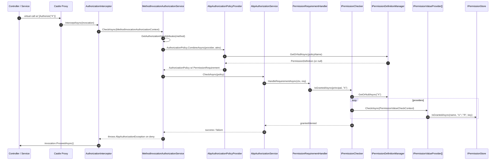

This page traces the **ABP Framework** authorization flow end-to-end. The same flow is reused by ASP.NET Core `AuthorizationMiddleware` for incoming HTTP requests and by `AuthorizationInterceptor` for direct application-service calls (from background jobs, hosted services, gRPC, or unit tests). Both paths converge on `IAbpAuthorizationService` → `AbpAuthorizationPolicyProvider` → `IPermissionChecker` → the registered `IPermissionValueProvider` chain.

<Info>
ABP overlays a permission system on top of ASP.NET Core's policy system. Any `[Authorize("MyPermission")]` whose policy name is not pre-registered with `AuthorizationOptions` is **synthesised** at runtime into a `PermissionRequirement` policy by `AbpAuthorizationPolicyProvider`. The handler then runs through `IPermissionChecker.IsGrantedAsync`, which consults `IPermissionValueProvider`s such as `UserPermissionValueProvider`, `RolePermissionValueProvider`, and `ClientPermissionValueProvider`.
</Info>

## 1. Sequence overview



## 2. Triggering: `[Authorize]`, `[AllowAnonymous]`, and policy strings

Standard ASP.NET attributes are reused as-is. ABP discovers them by reflection on the **method** being invoked (and the declaring type, except when `[AllowAnonymous]` is present). The attribute detection lives in `MethodInvocationAuthorizationService.GetAuthorizationDataAttributes`:

```csharp
protected virtual IEnumerable<IAuthorizeData> GetAuthorizationDataAttributes(MethodInfo methodInfo)
{
    var attributes = methodInfo.GetCustomAttributes(true).OfType<IAuthorizeData>();

    if (methodInfo.IsPublic && methodInfo.DeclaringType != null)
    {
        attributes = attributes.Union(
            methodInfo.DeclaringType.GetCustomAttributes(true).OfType<IAuthorizeData>());
    }

    return attributes;
}
```

Source: `framework/src/Volo.Abp.Authorization/Volo/Abp/Authorization/MethodInvocationAuthorizationService.cs`.

Only **public** methods inherit class-level `[Authorize]` — internal helpers on the same class are not auto-protected. Setting `[AllowAnonymous]` on the method short-circuits the entire check.

## 3. Two entry points: middleware vs interceptor

### 3.1 ASP.NET Core middleware path

`UseAuthorization()` is the stock middleware. It calls `IAuthorizationPolicyProvider.GetPolicyAsync(policyName)` for every `IAuthorizeData` attached to the matched endpoint. ABP replaces the default policy provider with `AbpAuthorizationPolicyProvider` in `AbpAuthorizationModule`. That replacement is what allows arbitrary permission names to be used as policy strings.

### 3.2 DI interceptor path

For app-service calls that are **not** behind an HTTP endpoint (e.g. a background job calling `IIdentityUserAppService`), ABP attaches `AuthorizationInterceptor` to any class whose type or method carries `[AuthorizeAttribute]`. Registration happens in `framework/src/Volo.Abp.Authorization/Volo/Abp/Authorization/AuthorizationInterceptorRegistrar.cs`:

```csharp
public static void RegisterIfNeeded(IOnServiceRegistredContext context)
{
    if (ShouldIntercept(context.ImplementationType))
    {
        context.Interceptors.TryAdd<AuthorizationInterceptor>();
    }
}

private static bool ShouldIntercept(Type type)
{
    return !DynamicProxyIgnoreTypes.Contains(type) &&
           (type.IsDefined(typeof(AuthorizeAttribute), true) || AnyMethodHasAuthorizeAttribute(type));
}
```

## 4. `AuthorizationInterceptor`

Source: `framework/src/Volo.Abp.Authorization/Volo/Abp/Authorization/AuthorizationInterceptor.cs`.

```csharp
public override async Task InterceptAsync(IAbpMethodInvocation invocation)
{
    await AuthorizeAsync(invocation);
    await invocation.ProceedAsync();
}

protected virtual async Task AuthorizeAsync(IAbpMethodInvocation invocation)
{
    await _methodInvocationAuthorizationService.CheckAsync(
        new MethodInvocationAuthorizationContext(invocation.Method)
    );
}
```

Two interesting properties:

1. The check happens **before** `ProceedAsync`, so a denied call never reaches its body.
2. It only inspects `invocation.Method` — the method being invoked, not the proxy type. That keeps the check identical to what the MVC pipeline does for the same controller action.

If `CheckAsync` throws `AbpAuthorizationException`, the call short-circuits with the exception bubbling up to either `AbpExceptionFilter` (HTTP) or the caller (non-HTTP). In ASP.NET Core, `DefaultAbpAuthorizationExceptionHandler` then maps it to HTTP 401 (no principal) or 403 (principal present but unauthorized).

## 5. `MethodInvocationAuthorizationService.CheckAsync`

```csharp
public virtual async Task CheckAsync(MethodInvocationAuthorizationContext context)
{
    if (AllowAnonymous(context)) { return; }

    var authorizationPolicy = await AuthorizationPolicy.CombineAsync(
        _abpAuthorizationPolicyProvider,
        GetAuthorizationDataAttributes(context.Method)
    );

    if (authorizationPolicy == null) { return; }

    await _abpAuthorizationService.CheckAsync(authorizationPolicy);
}
```

`AuthorizationPolicy.CombineAsync` is the stock ASP.NET combinator — it calls `GetPolicyAsync(policyName)` for each `IAuthorizeData.Policy` and merges the resulting policies. The ABP-specific work happens inside `AbpAuthorizationPolicyProvider.GetPolicyAsync`.

## 6. `AbpAuthorizationPolicyProvider.GetPolicyAsync`

Source: `framework/src/Volo.Abp.Authorization/Volo/Abp/Authorization/AbpAuthorizationPolicyProvider.cs`.

```csharp
public override async Task<AuthorizationPolicy?> GetPolicyAsync(string policyName)
{
    var policy = await base.GetPolicyAsync(policyName);
    if (policy != null) { return policy; }

    var permission = await _permissionDefinitionManager.GetOrNullAsync(policyName);
    if (permission != null)
    {
        var policyBuilder = new AuthorizationPolicyBuilder(Array.Empty<string>());
        policyBuilder.Requirements.Add(new PermissionRequirement(policyName));
        return policyBuilder.Build();
    }

    if ((await _permissionDefinitionManager.GetResourcePermissionsAsync()).Any(x => x.Name == policyName))
    {
        var policyBuilder = new AuthorizationPolicyBuilder(Array.Empty<string>());
        policyBuilder.Requirements.Add(new ResourcePermissionRequirement(policyName));
        return policyBuilder.Build();
    }

    return null;
}
```

Order of resolution:

1. Try the explicitly-registered `AuthorizationOptions` policies (via the base class).
2. Look up `policyName` in `IPermissionDefinitionManager`. If a `PermissionDefinition` exists, build a one-requirement policy of type `PermissionRequirement`.
3. Try resource permissions — these carry an additional resource key and are handled by `ResourcePermissionRequirement`.
4. Otherwise return `null`, which ASP.NET treats as "policy not found" → 500.

`IPermissionDefinitionManager` is the central registry for permissions; its definitions come from `IPermissionDefinitionProvider` implementations declared at module config time.

## 7. `AbpAuthorizationService.CheckAsync`

`framework/src/Volo.Abp.Authorization/Volo/Abp/Authorization/AbpAuthorizationService.cs` extends ASP.NET's `DefaultAuthorizationService`. The `CheckAsync(AuthorizationPolicy)` overload is provided by an extension method on `IAbpAuthorizationService` (in `Volo.Abp.Authorization.Abstractions`); it calls `AuthorizeAsync(user, policy)` and throws `AbpAuthorizationException` if the result is not `Succeeded`.

The handler that satisfies `PermissionRequirement` is `PermissionRequirementHandler` (in `Volo.Abp.Authorization.Permissions/`):

```csharp
protected override async Task HandleRequirementAsync(
    AuthorizationHandlerContext context,
    PermissionRequirement requirement)
{
    if (await _permissionChecker.IsGrantedAsync(context.User, requirement.PermissionName))
        context.Succeed(requirement);
}
```

This is the bridge between the ASP.NET policy world and ABP's permission world.

## 8. `IPermissionChecker.IsGrantedAsync`

Source: `framework/src/Volo.Abp.Authorization/Volo/Abp/Authorization/Permissions/PermissionChecker.cs`.

```csharp
public virtual async Task<bool> IsGrantedAsync(ClaimsPrincipal? claimsPrincipal, string name)
{
    var permission = await PermissionDefinitionManager.GetOrNullAsync(name);
    if (permission == null) { return false; }
    if (!permission.IsEnabled) { return false; }
    if (!await StateCheckerManager.IsEnabledAsync(permission)) { return false; }

    var multiTenancySide = claimsPrincipal?.GetMultiTenancySide() ?? CurrentTenant.GetMultiTenancySide();
    if (!permission.MultiTenancySide.HasFlag(multiTenancySide)) { return false; }

    var isGranted = false;
    var context = new PermissionValueCheckContext(permission, claimsPrincipal);
    foreach (var provider in PermissionValueProviderManager.ValueProviders)
    {
        if (context.Permission.Providers.Any() && !context.Permission.Providers.Contains(provider.Name))
            continue;

        var result = await provider.CheckAsync(context);

        if      (result == PermissionGrantResult.Granted)    { isGranted = true; }
        else if (result == PermissionGrantResult.Prohibited) { return false; }
    }

    return isGranted;
}
```

The four-stage gate before consulting providers:

| Check | Source | Failure → |
| --- | --- | --- |
| Permission exists | `PermissionDefinitionManager.GetOrNullAsync` | `false` |
| Permission enabled | `PermissionDefinition.IsEnabled` | `false` |
| Conditional state checks | `ISimpleStateCheckerManager<PermissionDefinition>` | `false` |
| Tenancy side | `MultiTenancySides` flag vs `ClaimsPrincipal.GetMultiTenancySide()` | `false` |

Then the **provider chain** runs in declared order. A single `Prohibited` short-circuits to deny; a single `Granted` is held but does not short-circuit (so a later provider can still prohibit); `Undefined` means "no opinion".

## 9. Permission value providers

`PermissionValueProviderManager` (`framework/src/Volo.Abp.Authorization/Volo/Abp/Authorization/Permissions/PermissionValueProviderManager.cs`) materialises providers from `AbpPermissionOptions.ValueProviders`:

```csharp
protected virtual List<IPermissionValueProvider> GetProviders()
{
    var providers = Options
        .ValueProviders
        .Select(type => (ServiceProvider.GetRequiredService(type) as IPermissionValueProvider)!)
        .ToList();
    ...
    return providers;
}
```

The four built-in providers all live in `framework/src/Volo.Abp.Authorization/Volo/Abp/Authorization/Permissions/` and consult `IPermissionStore`.

### 9.1 `UserPermissionValueProvider` (`"U"`)

```csharp
public override async Task<PermissionGrantResult> CheckAsync(PermissionValueCheckContext context)
{
    var userId = context.Principal?.FindFirst(AbpClaimTypes.UserId)?.Value;
    if (userId == null) { return PermissionGrantResult.Undefined; }

    return await PermissionStore.IsGrantedAsync(context.Permission.Name, Name, userId)
        ? PermissionGrantResult.Granted
        : PermissionGrantResult.Undefined;
}
```

### 9.2 `RolePermissionValueProvider` (`"R"`)

Iterates `AbpClaimTypes.Role` claims and calls `PermissionStore.IsGrantedAsync(name, "R", roleName)` for each.

### 9.3 `ClientPermissionValueProvider` (`"C"`)

Reads `AbpClaimTypes.ClientId` (set by JWT/OAuth tokens issued to machine clients) and calls the store with `"C"`.

### 9.4 Replacing or extending providers

Register your own implementation in `PreConfigureServices`:

```csharp
Configure<AbpPermissionOptions>(options =>
{
    options.ValueProviders.Add<MyDeptPermissionValueProvider>();
});
```

The order in `ValueProviders` is the evaluation order; insert before/after a known provider with `InsertBefore` / `InsertAfter`.

## 10. `IPermissionStore` and the Permission Management module

The default `IPermissionStore` is `NullPermissionStore` — it returns `false` for everything. The real implementation lives in the `Volo.Abp.PermissionManagement.Domain` module: `PermissionStore` (which caches results via `IDistributedCache<PermissionGrantCacheItem>`). The store ultimately reads from `IPermissionGrantRepository`, which maps to a `PermissionGrants` table.

This means ABP authorization is **idempotent and tenant-isolated**: a grant to user `A` for permission `MyPerm` is stored as `(name="MyPerm", providerName="U", providerKey="A", tenantId=<current>)`, and only the current tenant's grants are read.

## 11. Step-by-step trace

| # | File | Symbol | Notes |
| --- | --- | --- | --- |
| 1 | (User code) | `[Authorize("Books.Create")]` | Attribute on app service method |
| 2 | `AuthorizationInterceptorRegistrar.cs` | `RegisterIfNeeded` | DI-time |
| 3 | `AuthorizationInterceptor.cs` | `InterceptAsync` | Calls `AuthorizeAsync` |
| 4 | `MethodInvocationAuthorizationService.cs` | `CheckAsync` | Combines attributes into policy |
| 5 | `MethodInvocationAuthorizationService.cs` | `GetAuthorizationDataAttributes` | Method + (public) class attributes |
| 6 | `AuthorizationPolicy.CombineAsync` (ASP.NET) | — | Calls `GetPolicyAsync("Books.Create")` |
| 7 | `AbpAuthorizationPolicyProvider.cs` | `GetPolicyAsync` | Synthesises `PermissionRequirement` |
| 8 | `IPermissionDefinitionManager` | `GetOrNullAsync` | Looks up the registered definition |
| 9 | `AbpAuthorizationService.cs` | `AuthorizeAsync` | ASP.NET default eval against handlers |
| 10 | `PermissionRequirementHandler` | `HandleRequirementAsync` | Calls `IPermissionChecker.IsGrantedAsync` |
| 11 | `PermissionChecker.cs` | `IsGrantedAsync` | 4-stage gate + provider loop |
| 12 | `PermissionValueProviderManager.cs` | `GetProviders` (lazy) | Materialises providers |
| 13 | `UserPermissionValueProvider.cs` | `CheckAsync` | Reads `AbpClaimTypes.UserId` |
| 14 | `RolePermissionValueProvider.cs` | `CheckAsync` | Iterates `Role` claims |
| 15 | `ClientPermissionValueProvider.cs` | `CheckAsync` | Reads `ClientId` claim |
| 16 | `PermissionStore` (module) | `IsGrantedAsync` | DB / cache lookup |
| 17 | `AbpAuthorizationService.cs` | (extension) | Throws `AbpAuthorizationException` if not granted |
| 18 | `AuthorizationInterceptor.cs` | `ProceedAsync` | Only runs on success |

## 12. Cross-cutting checks: `[RequiresFeature]`

ABP also exposes a parallel "features" gate (`AbpFeatureActionFilter` + `RequiresFeatureAttribute`) for SaaS feature gating. That goes through `IMethodInvocationFeatureCheckerService` → `IFeatureChecker`, which is structurally identical but consults `IFeatureValueProvider` / `IFeatureStore` instead. It's covered in [HTTP Request Lifecycle](/flows/http-request-lifecycle).

## 13. Tips for debugging denials

<Tip>
**Always inspect `IPermissionChecker.IsGrantedAsync` directly in a test.** If a `[Authorize("X")]` keeps failing, call `await _permissionChecker.IsGrantedAsync("X")` from a fixture. It bypasses ASP.NET's policy machinery and tells you immediately whether the definition exists, whether the principal carries the right claims, and which provider returned `Undefined`.
</Tip>

<Warning>
The order of `AbpPermissionOptions.ValueProviders` matters when **prohibition** is involved. Because a single `Prohibited` short-circuits, putting a strict prohibition provider (e.g. `OrganizationalUnit`) **before** the granting providers will block all permissions even if the role explicitly grants them. Use `InsertAfter` rather than `Insert(0)` unless you intend that.
</Warning>

## 14. Related pages

- [HTTP Request Lifecycle](/flows/http-request-lifecycle) — the ASP.NET side of the same flow
- [Unit of Work Lifecycle](/flows/unit-of-work-lifecycle) — UoW wraps every authorized call
- [Dynamic Proxy and Interceptors](/core/dynamic-proxy-and-interceptors) — how `AuthorizationInterceptor` is attached
- [Multi-Tenancy Resolution](/flows/multi-tenancy-resolution) — `MultiTenancySides` gating in the checker
