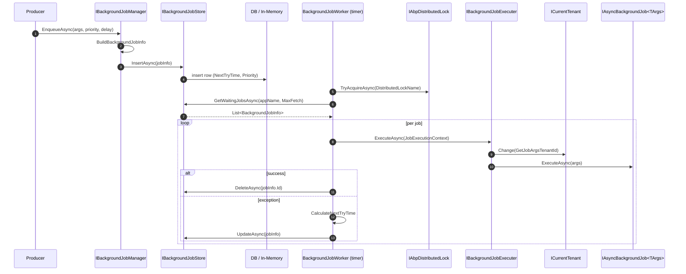

This page traces the **ABP Framework** background-job flow end-to-end: the producer call to `IBackgroundJobManager.EnqueueAsync`, persistence into `IBackgroundJobStore`, the timer-driven poll inside `BackgroundJobWorker`, dispatch through `BackgroundJobExecuter`, the tenant-aware invocation of `IAsyncBackgroundJob<TArgs>.ExecuteAsync`, and the exponential-backoff retry / dead-letter loop.

<Info>
ABP's built-in background-job implementation (`Volo.Abp.BackgroundJobs`) is the **default** scheduler used by every starter template. It is a small, polling, single-application-name queue persisted via `IBackgroundJobStore`. Modules such as `Volo.Abp.BackgroundJobs.Hangfire`, `Volo.Abp.BackgroundJobs.Quartz`, and `Volo.Abp.BackgroundJobs.RabbitMQ` replace `IBackgroundJobManager` / `IBackgroundJobStore` with provider-specific implementations but use the same `IAsyncBackgroundJob<TArgs>` user contract.
</Info>

## 1. Sequence overview



## 2. Producer: `IBackgroundJobManager.EnqueueAsync`

Source: `framework/src/Volo.Abp.BackgroundJobs/Volo/Abp/BackgroundJobs/DefaultBackgroundJobManager.cs`.

```csharp
public virtual async Task<string> EnqueueAsync<TArgs>(TArgs args, BackgroundJobPriority priority = BackgroundJobPriority.Normal, TimeSpan? delay = null)
{
    var jobName = BackgroundJobOptions.Value.GetBackgroundJobName(typeof(TArgs));
    var jobId = await EnqueueAsync(jobName, args!, priority, delay);
    return jobId.ToString();
}

protected virtual async Task<Guid> EnqueueAsync(string jobName, object args, BackgroundJobPriority priority = BackgroundJobPriority.Normal, TimeSpan? delay = null)
{
    var jobInfo = new BackgroundJobInfo
    {
        Id = GuidGenerator.Create(),
        ApplicationName = BackgroundJobWorkerOptions.Value.ApplicationName,
        JobName = jobName,
        JobArgs = Serializer.Serialize(args),
        Priority = priority,
        CreationTime = Clock.Now,
        NextTryTime = Clock.Now
    };

    if (delay.HasValue) { jobInfo.NextTryTime = Clock.Now.Add(delay.Value); }

    await Store.InsertAsync(jobInfo);
    return jobInfo.Id;
}
```

Key fields written into the store:

| Field | Source | Notes |
| --- | --- | --- |
| `Id` | `IGuidGenerator.Create()` | Sequential GUID — clusters write nicely |
| `ApplicationName` | `AbpBackgroundJobWorkerOptions.ApplicationName` | Worker filter — multi-app DBs share the table |
| `JobName` | `AbpBackgroundJobOptions.GetBackgroundJobName(argsType)` | Looked up from `AbpBackgroundJobOptions.Configurations` |
| `JobArgs` | `IBackgroundJobSerializer.Serialize(args)` | Default = System.Text.Json |
| `NextTryTime` | `Clock.Now (+delay)` | The worker only fetches rows where `NextTryTime <= now` |
| `Priority` | `BackgroundJobPriority` | Workers ORDER BY Priority DESC, NextTryTime |

The job/args binding is registered at module-config time:

```csharp
Configure<AbpBackgroundJobOptions>(options =>
{
    options.AddJob<SendEmailJob>();
});
```

`AddJob<TJob>()` introspects the `IAsyncBackgroundJob<TArgs>` interface and registers `JobConfiguration { JobType = typeof(TJob), ArgsType = typeof(TArgs), JobName = "..." }` keyed by both `TArgs` and the job name.

## 3. Persistence: `IBackgroundJobStore`

The abstract contract is in `Volo.Abp.BackgroundJobs.Abstractions`. The default implementation is `InMemoryBackgroundJobStore` (`framework/src/Volo.Abp.BackgroundJobs/Volo/Abp/BackgroundJobs/InMemoryBackgroundJobStore.cs`) — useful in tests but **not** durable across restarts. The production implementation comes from the `Volo.Abp.BackgroundJobs.EntityFrameworkCore` or `Volo.Abp.BackgroundJobs.MongoDB` modules; both store `BackgroundJobInfo` rows in a `AbpBackgroundJobs` table.

`BackgroundJobInfo` (`framework/src/Volo.Abp.BackgroundJobs/Volo/Abp/BackgroundJobs/BackgroundJobInfo.cs`) is the persisted record:

| Property | Mutated by |
| --- | --- |
| `TryCount` | Incremented by worker on each attempt |
| `LastTryTime` | Stamped by worker before invoking executer |
| `NextTryTime` | Updated by `CalculateNextTryTime` on failure |
| `IsAbandoned` | Set when backoff exceeds `DefaultTimeout` |

## 4. The worker: `BackgroundJobWorker`

Source: `framework/src/Volo.Abp.BackgroundJobs/Volo/Abp/BackgroundJobs/BackgroundJobWorker.cs`. It inherits `AsyncPeriodicBackgroundWorkerBase` (from `Volo.Abp.BackgroundWorkers`), so its `DoWorkAsync` is invoked on the cadence configured by `Timer.Period = WorkerOptions.JobPollPeriod` (default 5000 ms).

It is enrolled into the background-worker manager during module init by `AbpBackgroundJobsModule.OnApplicationInitializationAsync`:

```csharp
if (context.ServiceProvider.GetRequiredService<IOptions<AbpBackgroundJobOptions>>().Value.IsJobExecutionEnabled)
{
    await context.AddBackgroundWorkerAsync<IBackgroundJobWorker>();
}
```

Setting `IsJobExecutionEnabled = false` (e.g. in an HTTP-only host that should not consume jobs) keeps the producer half active while disabling the consumer half — handy for splitting producers and workers across processes.

### 4.1 `DoWorkAsync`

```csharp
protected override async Task DoWorkAsync(PeriodicBackgroundWorkerContext workerContext)
{
    await using (var handler = await DistributedLock.TryAcquireAsync(WorkerOptions.DistributedLockName, cancellationToken: StoppingToken))
    {
        if (handler != null)
        {
            var store = workerContext.ServiceProvider.GetRequiredService<IBackgroundJobStore>();
            var waitingJobs = await store.GetWaitingJobsAsync(WorkerOptions.ApplicationName, WorkerOptions.MaxJobFetchCount);
            if (!waitingJobs.Any()) { return; }

            var jobExecuter = workerContext.ServiceProvider.GetRequiredService<IBackgroundJobExecuter>();
            var clock = workerContext.ServiceProvider.GetRequiredService<IClock>();
            var serializer = workerContext.ServiceProvider.GetRequiredService<IBackgroundJobSerializer>();

            foreach (var jobInfo in waitingJobs)
            {
                jobInfo.TryCount++;
                jobInfo.LastTryTime = clock.Now;

                try
                {
                    var jobConfiguration = JobOptions.GetJob(jobInfo.JobName);
                    var jobArgs = serializer.Deserialize(jobInfo.JobArgs, jobConfiguration.ArgsType);
                    var context = new JobExecutionContext(
                        workerContext.ServiceProvider,
                        jobConfiguration.JobType,
                        jobArgs,
                        workerContext.CancellationToken);

                    try
                    {
                        await jobExecuter.ExecuteAsync(context);
                        await store.DeleteAsync(jobInfo.Id);
                    }
                    catch (BackgroundJobExecutionException)
                    {
                        var nextTryTime = CalculateNextTryTime(jobInfo, clock);
                        if (nextTryTime.HasValue) { jobInfo.NextTryTime = nextTryTime.Value; }
                        else { jobInfo.IsAbandoned = true; }
                        await TryUpdateAsync(store, jobInfo);
                    }
                }
                catch (Exception ex)
                {
                    Logger.LogException(ex);
                    jobInfo.IsAbandoned = true;
                    await TryUpdateAsync(store, jobInfo);
                }
            }
        }
        else
        {
            try { await Task.Delay(WorkerOptions.JobPollPeriod * 12, StoppingToken); }
            catch (TaskCanceledException) { }
        }
    }
}
```

Five points worth noting:

1. **Distributed lock** ensures only one worker — across the entire cluster — drains the queue per tick. `WorkerOptions.DistributedLockName` defaults to `AbpBackgroundJobWorker`.
2. **`MaxJobFetchCount`** caps the page size (default 1000). The store query is also typically ordered by `Priority DESC, NextTryTime ASC, TryCount ASC`.
3. **`TryCount++` happens before execution** so even a JSON-deserialise failure on `jobInfo.JobArgs` counts as an attempt.
4. **`BackgroundJobExecutionException`** is the only exception type that triggers retry/backoff. Any other exception → immediate abandon.
5. **No lock back-off**: if the distributed lock is held by another node, this node sleeps for `JobPollPeriod * 12` to avoid hammering the lock provider.

### 4.2 `CalculateNextTryTime`

```csharp
protected virtual DateTime? CalculateNextTryTime(BackgroundJobInfo jobInfo, IClock clock)
{
    var nextWaitDuration = WorkerOptions.DefaultFirstWaitDuration *
                           (Math.Pow(WorkerOptions.DefaultWaitFactor, jobInfo.TryCount - 1));
    var nextTryDate = jobInfo.LastTryTime?.AddSeconds(nextWaitDuration) ??
                      clock.Now.AddSeconds(nextWaitDuration);

    if (nextTryDate.Subtract(jobInfo.CreationTime).TotalSeconds > WorkerOptions.DefaultTimeout)
    {
        return null; // abandon
    }

    return nextTryDate;
}
```

Defaults (from `AbpBackgroundJobWorkerOptions`):

| Option | Default | Meaning |
| --- | --- | --- |
| `DefaultFirstWaitDuration` | 60 seconds | First retry delay |
| `DefaultWaitFactor` | 2.0 | Exponential backoff factor |
| `DefaultTimeout` | 60 × 60 × 24 × 2 (= 2 days) | Total time budget per job |
| `JobPollPeriod` | 5000 ms | Worker tick |
| `MaxJobFetchCount` | 1000 | Per-tick batch |

With those defaults, a failing job retries roughly at t+60s, t+120s, t+240s, ... until t+2d, then gets `IsAbandoned = true`. Abandoned jobs stay in the store but are filtered out of `GetWaitingJobsAsync`.

## 5. The executer: `BackgroundJobExecuter`

Source: `framework/src/Volo.Abp.BackgroundJobs.Abstractions/Volo/Abp/BackgroundJobs/BackgroundJobExecuter.cs`.

```csharp
public virtual async Task ExecuteAsync(JobExecutionContext context)
{
    var job = context.ServiceProvider.GetService(context.JobType);
    if (job == null) { throw new AbpException("The job type is not registered to DI: " + context.JobType); }

    var jobExecuteMethod = context.JobType.GetMethod(nameof(IBackgroundJob<object>.Execute)) ??
                           context.JobType.GetMethod(nameof(IAsyncBackgroundJob<object>.ExecuteAsync));
    if (jobExecuteMethod == null)
    {
        throw new AbpException($"Given job type does not implement {typeof(IBackgroundJob<>).Name} or {typeof(IAsyncBackgroundJob<>).Name}. The job type was: " + context.JobType);
    }

    try
    {
        using (CurrentTenant.Change(GetJobArgsTenantId(context.JobArgs)))
        {
            var cancellationTokenProvider = context.ServiceProvider.GetRequiredService<ICancellationTokenProvider>();
            using (cancellationTokenProvider.Use(context.CancellationToken))
            {
                if (jobExecuteMethod.Name == nameof(IAsyncBackgroundJob<object>.ExecuteAsync))
                    await ((Task)jobExecuteMethod.Invoke(job, new[] { context.JobArgs })!);
                else
                    jobExecuteMethod.Invoke(job, new[] { context.JobArgs });
            }
        }
    }
    catch (Exception ex)
    {
        Logger.LogException(ex);
        await context.ServiceProvider.GetRequiredService<IExceptionNotifier>()
            .NotifyAsync(new ExceptionNotificationContext(ex));

        throw new BackgroundJobExecutionException("A background job execution is failed. See inner exception for details.", ex)
        {
            JobType = context.JobType.AssemblyQualifiedName!,
            JobArgs = context.JobArgs
        };
    }
}
```

Three notable design choices:

1. **Tenant impersonation** — if the args implement `IMultiTenant`, `CurrentTenant.Change(tenantId)` opens a scope so the entire job body runs in that tenant. This is the mechanism that lets a tenant's queued email actually be sent with the correct tenant connection string.
2. **CancellationToken plumbing** — `ICancellationTokenProvider` (an `AsyncLocal`-backed accessor) is set to the worker's stopping token so `_currentToken.Token` inside the job ties to host shutdown.
3. **Exception wrapping** — anything thrown becomes `BackgroundJobExecutionException`. That is the **only** exception type the worker treats as "retry" vs "abandon".

`GetJobArgsTenantId`:

```csharp
protected virtual Guid? GetJobArgsTenantId(object jobArgs)
{
    return jobArgs switch
    {
        IMultiTenant multiTenantJobArgs => multiTenantJobArgs.TenantId,
        _ => CurrentTenant.Id
    };
}
```

If your args type does **not** implement `IMultiTenant`, the job inherits the **producer's** `CurrentTenant.Id` at enqueue time (because `EnqueueAsync` ran inside a request scope). If your args type does implement `IMultiTenant`, the tenant id is read from the args.

## 6. Authoring a job

The user-facing contract (from `Volo.Abp.BackgroundJobs.Abstractions`):

```csharp
public interface IAsyncBackgroundJob<TArgs>
{
    Task ExecuteAsync(TArgs args);
}
```

A typical implementation:

```csharp
public class SendEmailJob : AsyncBackgroundJob<SendEmailArgs>, ITransientDependency
{
    private readonly IEmailSender _emailSender;
    public SendEmailJob(IEmailSender emailSender) => _emailSender = emailSender;

    public override async Task ExecuteAsync(SendEmailArgs args)
    {
        await _emailSender.SendAsync(args.To, args.Subject, args.Body);
    }
}
```

Producer:

```csharp
await _backgroundJobManager.EnqueueAsync(new SendEmailArgs { ... });
```

The implicit `JobName` is `args.GetType().Name` unless overridden via `[BackgroundJobName("foo")]` on `SendEmailArgs`. The `AbpBackgroundJobOptions.GetBackgroundJobName(Type)` helper performs the lookup.

## 7. Step-by-step trace

| # | File | Symbol | Notes |
| --- | --- | --- | --- |
| 1 | (User code) | `_backgroundJobManager.EnqueueAsync(args)` | Producer |
| 2 | `DefaultBackgroundJobManager.cs` | `EnqueueAsync<TArgs>` | Resolves job name from args type |
| 3 | `DefaultBackgroundJobManager.cs` | `EnqueueAsync(string, object, ...)` | Builds `BackgroundJobInfo` |
| 4 | `IBackgroundJobSerializer` (default JSON) | `Serialize(args)` | Persists payload string |
| 5 | `IBackgroundJobStore` | `InsertAsync` | Persists row |
| 6 | `BackgroundJobWorker.cs` | `DoWorkAsync` (timer) | Periodic poll |
| 7 | `IAbpDistributedLock` | `TryAcquireAsync` | Cluster-wide singleton-execution |
| 8 | `IBackgroundJobStore` | `GetWaitingJobsAsync` | Page filtered by `ApplicationName`, `NextTryTime <= now`, not abandoned |
| 9 | `BackgroundJobWorker.cs` | (per job) `TryCount++; LastTryTime=now` | Optimistic attempt tracking |
| 10 | `IBackgroundJobSerializer` | `Deserialize` | Reconstruct args |
| 11 | `BackgroundJobExecuter.cs` | `ExecuteAsync` | Resolves job from DI |
| 12 | `ICurrentTenant.Change` | (using scope) | Tenant impersonation |
| 13 | (User code) | `IAsyncBackgroundJob<TArgs>.ExecuteAsync` | Job body |
| 14 | `IBackgroundJobStore.DeleteAsync` | (on success) | Row removed |
| 15 | `BackgroundJobExecuter.cs` | `BackgroundJobExecutionException` (on fail) | Wrapped |
| 16 | `BackgroundJobWorker.cs` | `CalculateNextTryTime` | Exponential backoff |
| 17 | `IBackgroundJobStore.UpdateAsync` | (on fail) | Row updated with NextTryTime or `IsAbandoned` |

## 8. Variants and integrations

### 8.1 Hangfire

`Volo.Abp.BackgroundJobs.Hangfire` replaces `IBackgroundJobManager` with `HangfireBackgroundJobManager` that calls `BackgroundJob.Enqueue(...)`. The poll loop and retry logic in §4 are replaced by Hangfire's own server. `BackgroundJobExecuter` is still used as the per-job adapter (so tenant impersonation continues to work).

### 8.2 Quartz

`Volo.Abp.BackgroundJobs.Quartz` similarly delegates to Quartz schedulers. The user contract `IAsyncBackgroundJob<TArgs>` stays identical.

### 8.3 RabbitMQ

`Volo.Abp.BackgroundJobs.RabbitMQ` swaps `IBackgroundJobStore` for a queue. The producer publishes, a consumer listens, and `BackgroundJobExecuter` runs on the receiver. Retry/abandon semantics depend on the broker's redelivery model — `BackgroundJobExecutionException` triggers nack-with-requeue.

## 9. Failure semantics and operational tips

<Warning>
Because jobs are picked up with a **distributed lock** per worker name, scaling out workers does **not** parallelise execution by default — only one node holds the lock at a time and drains the page. To parallelise, increase `MaxJobFetchCount` and run jobs concurrently inside `DoWorkAsync` (or switch to Hangfire/RabbitMQ).
</Warning>

<Warning>
`IsJobExecutionEnabled = false` only disables the worker, not the manager. Producers continue to insert rows. If you intend to run a separate worker process, make sure that process has `IsJobExecutionEnabled = true` and shares the same `IBackgroundJobStore` connection.
</Warning>

<Tip>
Treat job args as immutable serialisable contracts. If you rename a property between deploys, deserialisation may fail mid-flight on rows queued by the old version. Add new properties as nullable and never repurpose old ones.
</Tip>

## 10. Related pages

- [Application Startup](/flows/application-startup) — `AbpBackgroundJobsModule.OnApplicationInitializationAsync` is what enrols the worker
- [Multi-Tenancy Resolution](/flows/multi-tenancy-resolution) — `ICurrentTenant.Change` semantics used by `BackgroundJobExecuter`
- [Unit of Work Lifecycle](/flows/unit-of-work-lifecycle) — jobs that touch the DB will typically start their own UoW
- [Event Publish and Handle](/flows/event-publish-and-handle) — outbox/inbox processors are themselves `IBackgroundWorker`s following the same pattern
