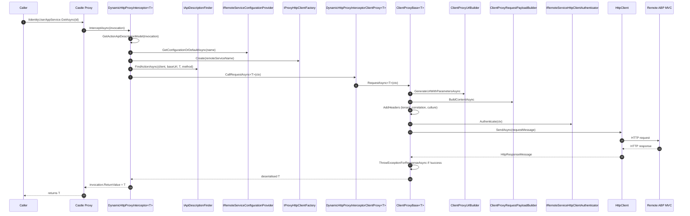

This page traces a single dynamic HTTP-client-proxy call in the **ABP Framework** end-to-end: a caller invokes an application-service interface (say `IIdentityUserAppService`), Castle DynamicProxy routes the call into `DynamicHttpProxyInterceptor<TService>`, which discovers the API contract, builds a `HttpRequestMessage`, attaches headers (tenant, correlation, culture), authenticates via `IRemoteServiceHttpClientAuthenticator`, dispatches through the named `HttpClient`, and finally translates the response back into a strongly-typed return value or wrapped `AbpRemoteCallException`.

<Info>
ABP's dynamic HTTP proxy is the **client half** of its "auto-generated REST API" pattern. The server side exposes app services as MVC controllers via the conventional API explorer and `AbpServiceConvention`. The client side resolves the same interface (`IIdentityUserAppService`) but the implementation is a Castle proxy that turns each method call into the matching HTTP request — no hand-written DTO mapping required.
</Info>

## 1. Sequence overview



## 2. Registration: `AddHttpClientProxy<TService>`

Source: `framework/src/Volo.Abp.Http.Client/Microsoft/Extensions/DependencyInjection/ServiceCollectionHttpClientProxyExtensions.cs`.

```csharp
public static IServiceCollection AddHttpClientProxy(
    [NotNull] this IServiceCollection services,
    [NotNull] Type type,
    [NotNull] string remoteServiceConfigurationName = RemoteServiceConfigurationDictionary.DefaultName,
    bool asDefaultService = true)
{
    AddHttpClientFactory(services, remoteServiceConfigurationName);

    services.Configure<AbpHttpClientOptions>(options =>
    {
        options.HttpClientProxies[type] = new HttpClientProxyConfig(type, remoteServiceConfigurationName);
    });

    var interceptorType = typeof(DynamicHttpProxyInterceptor<>).MakeGenericType(type);
    services.AddTransient(interceptorType);

    var interceptorAdapterType = typeof(AbpAsyncDeterminationInterceptor<>).MakeGenericType(interceptorType);
    var validationInterceptorAdapterType = typeof(AbpAsyncDeterminationInterceptor<>).MakeGenericType(typeof(ValidationInterceptor));

    if (asDefaultService)
    {
        services.AddTransient(
            type,
            serviceProvider => ProxyGeneratorInstance
                .CreateInterfaceProxyWithoutTarget(
                    type,
                    (IInterceptor)serviceProvider.GetRequiredService(validationInterceptorAdapterType),
                    (IInterceptor)serviceProvider.GetRequiredService(interceptorAdapterType)
                )
        );
    }
    ...
}
```

Critical decisions made here:

1. **`HttpClientProxies[type]`** records the (service type → remote-service name) mapping, consulted later by the interceptor and by `ClientProxyBase`.
2. **`CreateInterfaceProxyWithoutTarget`** — there is **no** concrete implementation behind the proxy. Every method call is dispatched to the interceptor chain.
3. **Two interceptors** are wired: `ValidationInterceptor` first (to validate DTO arguments before they hit the network), then `DynamicHttpProxyInterceptor<T>`.
4. The named `HttpClient` is registered via `services.AddHttpClient(remoteServiceConfigurationName, ...)` so all proxies sharing the same `remoteServiceName` share configuration (timeouts, default headers, message handlers).

## 3. The interceptor: `DynamicHttpProxyInterceptor<TService>`

Source: `framework/src/Volo.Abp.Http.Client/Volo/Abp/Http/Client/DynamicProxying/DynamicHttpProxyInterceptor.cs`.

```csharp
public override async Task InterceptAsync(IAbpMethodInvocation invocation)
{
    var context = new ClientProxyRequestContext(
        await GetActionApiDescriptionModel(invocation),
        invocation.ArgumentsDictionary,
        typeof(TService));

    if (invocation.Method.ReturnType.GenericTypeArguments.IsNullOrEmpty())
    {
        await InterceptorClientProxy.CallRequestAsync(context);
    }
    else
    {
        var returnType = invocation.Method.ReturnType.GenericTypeArguments[0];
        var result = (Task)CallRequestAsyncMethod
            .MakeGenericMethod(returnType)
            .Invoke(this, new object[] { context })!;

        invocation.ReturnValue = await GetResultAsync(result, returnType);
    }
}
```

The interceptor handles two cases:

- **`Task`** (no result) → call non-generic `CallRequestAsync`.
- **`Task<T>`** → invoke `CallRequestAsync<T>(ctx)` via reflection-cached `MethodInfo` (`CallRequestAsyncMethod` is captured in the static ctor).

The reflection cost is amortised — the `MethodInfo` is captured once per `TService` because the generic class has its own static field.

## 4. `GetActionApiDescriptionModel`

```csharp
protected virtual async Task<ActionApiDescriptionModel> GetActionApiDescriptionModel(IAbpMethodInvocation invocation)
{
    var clientConfig = ClientOptions.HttpClientProxies.GetOrDefault(typeof(TService)) ??
                       throw new AbpException($"Could not get DynamicHttpClientProxyConfig for {typeof(TService).FullName}.");
    var remoteServiceConfig = await RemoteServiceConfigurationProvider.GetConfigurationOrDefaultAsync(clientConfig.RemoteServiceName);
    var client = HttpClientFactory.Create(clientConfig.RemoteServiceName);

    return await ApiDescriptionFinder.FindActionAsync(
        client,
        remoteServiceConfig.BaseUrl,
        typeof(TService),
        invocation.Method
    );
}
```

Three lookups in one go:

1. **`AbpHttpClientOptions.HttpClientProxies[TService]`** — registered in §2.
2. **`IRemoteServiceConfigurationProvider.GetConfigurationOrDefaultAsync(name)`** — see §5. Resolves the base URL, possibly per-tenant.
3. **`IApiDescriptionFinder.FindActionAsync(...)`** — discovers the `ActionApiDescriptionModel` for the called method. The default `ApiDescriptionFinder` (`framework/src/Volo.Abp.Http.Client/Volo/Abp/Http/Client/DynamicProxying/ApiDescriptionFinder.cs`) hits the remote `/api/abp/api-definition` endpoint **once** and caches the result via `IApiDescriptionCache` — subsequent calls reuse the model.

## 5. `IRemoteServiceConfigurationProvider`

Source: `framework/src/Volo.Abp.RemoteServices/Volo/Abp/Http/Client/RemoteServiceConfigurationProvider.cs`.

```csharp
public virtual async Task<RemoteServiceConfiguration> GetConfigurationOrDefaultAsync(string name)
{
    return (await GetMultiTenantConfigurationAsync(Options.RemoteServices.GetConfigurationOrDefault(name)))!;
}

protected virtual async Task<RemoteServiceConfiguration?> GetMultiTenantConfigurationAsync(RemoteServiceConfiguration? configuration)
{
    if (configuration == null) { return configuration; }

    var baseUrl = await MultiTenantUrlProvider.GetUrlAsync(configuration.BaseUrl);
    if (baseUrl == configuration.BaseUrl) { return configuration; }

    var multiTenantConfiguration = new RemoteServiceConfiguration(configuration) { BaseUrl = baseUrl };
    return multiTenantConfiguration;
}
```

Two things happen:

1. Read the static configuration from `AbpRemoteServiceOptions.RemoteServices` (populated from `appsettings.json` `"RemoteServices": { "Default": { "BaseUrl": "..." } }`).
2. Run the URL through `IMultiTenantUrlProvider`. The default implementation is a pass-through; tenant-aware deployments register a provider that substitutes `{0}` placeholders in the URL with the resolved tenant name — useful for per-tenant subdomains.

## 6. `IProxyHttpClientFactory.Create(name)`

Source: `framework/src/Volo.Abp.Http.Client/Volo/Abp/Http/Client/Proxying/DefaultProxyHttpClientFactory.cs`.

```csharp
public HttpClient Create(string name)
{
    return _httpClientFactory.CreateClient(name);
}
```

A one-line wrapper around `Microsoft.Extensions.Http.IHttpClientFactory`. The "name" is the `RemoteServiceConfiguration` key — that's the same string passed to `services.AddHttpClient(name, ...)` in §2, so the resolved client picks up the right message handlers, timeouts, etc.

## 7. The request build: `ClientProxyBase<TService>.RequestAsync`

Source: `framework/src/Volo.Abp.Http.Client/Volo/Abp/Http/Client/ClientProxying/ClientProxyBase.cs`. The interceptor dispatches into `DynamicHttpProxyInterceptorClientProxy<TService>` (a thin shim) which calls `base.RequestAsync<T>(requestContext)`:

```csharp
protected virtual async Task<HttpContent> RequestAsync(ClientProxyRequestContext requestContext)
{
    var clientConfig = ClientOptions.Value.HttpClientProxies.GetOrDefault(requestContext.ServiceType)
                       ?? throw new AbpException($"Could not get HttpClientProxyConfig for {requestContext.ServiceType.FullName}.");
    var remoteServiceConfig = await RemoteServiceConfigurationProvider.GetConfigurationOrDefaultAsync(clientConfig.RemoteServiceName);

    var client = HttpClientFactory.Create(clientConfig.RemoteServiceName);
    var apiVersion = await GetApiVersionInfoAsync(requestContext);
    var url = remoteServiceConfig.BaseUrl.EnsureEndsWith('/') + await GetUrlWithParametersAsync(requestContext, apiVersion);

    var requestMessage = new HttpRequestMessage(requestContext.Action.GetHttpMethod(), url)
    {
        Content = await ClientProxyRequestPayloadBuilder.BuildContentAsync(
            requestContext.Action, requestContext.Arguments, JsonSerializer, apiVersion)
    };

    AddHeaders(requestContext.Arguments, requestContext.Action, requestMessage, apiVersion);

    if (requestContext.Action.AllowAnonymous != true)
    {
        await ClientAuthenticator.Authenticate(
            new RemoteServiceHttpClientAuthenticateContext(client, requestMessage, remoteServiceConfig, clientConfig.RemoteServiceName));
    }

    HttpResponseMessage response;
    try
    {
        foreach (var preSendAction in ClientOptions.Value.ProxyHttpClientPreSendActions
            .Where(x => x.Key == clientConfig.RemoteServiceName).SelectMany(x => x.Value))
        {
            preSendAction(clientConfig, requestContext, client);
        }

        response = await client.SendAsync(
            requestMessage,
            HttpCompletionOption.ResponseHeadersRead,
            GetCancellationToken(requestContext.Arguments));
    }
    catch (Exception ex)
    {
        throw new AbpRemoteCallException($"An error occurred during the ABP remote HTTP request. ({ex.Message}) See the inner exception for details.", ex);
    }

    if (!response.IsSuccessStatusCode) { await ThrowExceptionForResponseAsync(response); }

    return response.Content;
}
```

### 7.1 URL construction: `ClientProxyUrlBuilder`

Builds the path from `ActionApiDescriptionModel.Url` (e.g. `api/identity/users/{id}`), substituting `{id}` and appending query-string parameters whose `BindingSourceId == ParameterBindingSources.Query`. Path parameters with complex types are turned into multiple query-string entries by `IObjectToQueryString`.

### 7.2 Payload: `ClientProxyRequestPayloadBuilder.BuildContentAsync`

Picks the parameter whose `BindingSourceId == ParameterBindingSources.Body` and JSON-serialises it via `IJsonSerializer`. If the action declares an `IRemoteStreamContent` body it switches to multipart/form-data via `IObjectToFormData`.

### 7.3 Headers: `AddHeaders`

```csharp
//API Version
if (!apiVersion.Version.IsNullOrEmpty())
{
    requestMessage.Headers.Add("accept", $"{MimeTypes.Application.Json}; v={apiVersion.Version}");
    requestMessage.Headers.Add("api-version", apiVersion.Version);
}

//Header parameters declared in the action
var headers = action.Parameters.Where(p => p.BindingSourceId == ParameterBindingSources.Header).ToArray();
foreach (var headerParameter in headers) { ... requestMessage.Headers.Add(headerParameter.Name, value.ToString()); }

//CorrelationId
var correlationId = CorrelationIdProvider.Get();
if (correlationId != null) { requestMessage.Headers.Add(AbpCorrelationIdOptions.Value.HttpHeaderName, correlationId); }

//TenantId
if (CurrentTenant.Id.HasValue)
{
    requestMessage.Headers.Add(TenantResolverConsts.DefaultTenantKey, CurrentTenant.Id.Value.ToString());
}

//Culture
...
```

Three ambient values automatically ride every request: correlation id, current tenant id, and current culture. This is the mechanism that makes a remote ABP service "feel local" — tenant resolution on the other side (`HeaderTenantResolveContributor`, see [Multi-Tenancy Resolution](/flows/multi-tenancy-resolution)) picks up the tenant header.

## 8. Authentication: `IRemoteServiceHttpClientAuthenticator`

Source contract: `framework/src/Volo.Abp.Http.Client/Volo/Abp/Http/Client/Authentication/IRemoteServiceHttpClientAuthenticator.cs`.

```csharp
public interface IRemoteServiceHttpClientAuthenticator
{
    Task Authenticate(RemoteServiceHttpClientAuthenticateContext context);
}
```

`RemoteServiceHttpClientAuthenticateContext` carries the `HttpClient`, the `HttpRequestMessage` being built, the resolved `RemoteServiceConfiguration`, and the remote-service name.

The default registration is `NullRemoteServiceHttpClientAuthenticator` — it does nothing. Real applications drop in:

| Module | Implementation | Token source |
| --- | --- | --- |
| `Volo.Abp.Http.Client.IdentityModel` | `IdentityModelRemoteServiceHttpClientAuthenticator` | OpenID `client_credentials` |
| `Volo.Abp.Http.Client.Web` | `WebRemoteServiceHttpClientAuthenticator` | OIDC cookie's saved access token |
| `Volo.Abp.AspNetCore.Mvc.Client` | (configured at runtime) | `IAbpAccessTokenProvider` |

The authenticator typically adds an `Authorization: Bearer …` header to `context.Request`. It runs **only** when `action.AllowAnonymous != true` — i.e. an `[AllowAnonymous]` server-side action is reachable without a token.

## 9. Sending and error mapping

`HttpClient.SendAsync` runs the request through `IHttpClientFactory`'s configured handler chain (delegating handlers, primary handler, telemetry, etc.).

On non-2xx, `ThrowExceptionForResponseAsync` parses the WWW-Authenticate header for OAuth error details, publishes a `ClientProxyExceptionEventData` local event, and constructs an `AbpRemoteCallException`. When the response carries the ABP error format (`X-Abp-Error-Format` header), the JSON body is deserialised into `RemoteServiceErrorResponse`:

```csharp
if (response.Headers.Contains(AbpHttpConsts.AbpErrorFormat))
{
    errorResponse = JsonSerializer.Deserialize<RemoteServiceErrorResponse>(await response.Content.ReadAsStringAsync());
    throw new AbpRemoteCallException(errorResponse.Error) { HttpStatusCode = (int)response.StatusCode };
}
else
{
    throw new AbpRemoteCallException(
        new RemoteServiceErrorInfo { Message = response.ReasonPhrase, Code = response.StatusCode.ToString(), Details = errorDescription })
    { HttpStatusCode = (int)response.StatusCode };
}
```

This is what makes the **remote** `BusinessException` look like a **local** `BusinessException` to the caller — the error code, message, and details survive the round-trip.

## 10. Deserialisation back into the caller's return type

`ClientProxyBase.RequestAsync<T>` calls the body-returning variant (above) and then:

```csharp
var stringContent = await responseContent.ReadAsStringAsync();
if (typeof(T) == typeof(string)) { return (T)(object)stringContent; }
if (stringContent.IsNullOrWhiteSpace()) { return default!; }
return JsonSerializer.Deserialize<T>(stringContent);
```

Special-cases:

- **`string`** is returned raw (no JSON parse).
- **`Task<IRemoteStreamContent>`** returns a `RemoteStreamContent` that holds a reference to the response so GC does not dispose the stream prematurely.
- **`Task<>`** (no result) skips deserialisation entirely.

The deserialised value is finally assigned to `invocation.ReturnValue`, which Castle DynamicProxy returns to the caller as if it had been a normal method invocation.

## 11. Server-side: ABP MVC reception

On the **server**, the request lands in the ABP MVC pipeline described in [HTTP Request Lifecycle](/flows/http-request-lifecycle):

1. `MultiTenancyMiddleware` reads the `__tenant` header.
2. `UseAuthentication` validates the `Authorization` bearer token.
3. The endpoint matches a dynamically-generated controller (the same `IIdentityUserAppService` exposed via `ConventionalControllerOptions.Create(typeof(...))`).
4. `AbpValidationActionFilter`, `AbpUowActionFilter`, `AbpAuditActionFilter`, `AbpFeatureActionFilter` run.
5. The app-service method body executes.
6. The result is JSON-serialised and returned.

Round-trip therefore looks like: client `await _userService.GetAsync(id)` → HTTP → server MVC → app-service method → JSON → client deserialise → `IdentityUserDto`.

## 12. Step-by-step trace

| # | File | Symbol | Notes |
| --- | --- | --- | --- |
| 1 | `ServiceCollectionHttpClientProxyExtensions.cs` | `AddHttpClientProxy` | DI-time registration |
| 2 | (Caller code) | `await _userService.GetAsync(id)` | Virtual call into Castle proxy |
| 3 | Castle DynamicProxy | (generated proxy) | Forwards to `AbpAsyncDeterminationInterceptor<DynamicHttpProxyInterceptor<T>>` |
| 4 | `ValidationInterceptor` | `InterceptAsync` | Validates DTO arguments |
| 5 | `DynamicHttpProxyInterceptor.cs` | `InterceptAsync` | Builds `ClientProxyRequestContext` |
| 6 | `DynamicHttpProxyInterceptor.cs` | `GetActionApiDescriptionModel` | Resolves config, HttpClient, action model |
| 7 | `RemoteServiceConfigurationProvider.cs` | `GetConfigurationOrDefaultAsync` | Reads `AbpRemoteServiceOptions` + `IMultiTenantUrlProvider` |
| 8 | `DefaultProxyHttpClientFactory.cs` | `Create(name)` | `IHttpClientFactory.CreateClient(name)` |
| 9 | `IApiDescriptionFinder` | `FindActionAsync` | Cached lookup; first call hits `/api/abp/api-definition` |
| 10 | `DynamicHttpProxyInterceptorClientProxy.cs` | `CallRequestAsync<T>` | Shim to `ClientProxyBase` |
| 11 | `ClientProxyBase.cs` | `RequestAsync<T>` | Reads response and deserialises |
| 12 | `ClientProxyBase.cs` | `RequestAsync(ctx)` | Builds request, sends, error-checks |
| 13 | `ClientProxyUrlBuilder.cs` | `GenerateUrlWithParametersAsync` | Path + query string |
| 14 | `ClientProxyRequestPayloadBuilder.cs` | `BuildContentAsync` | JSON body or multipart |
| 15 | `ClientProxyBase.cs` | `AddHeaders` | Correlation, Tenant, Culture, api-version |
| 16 | `IRemoteServiceHttpClientAuthenticator` impl | `Authenticate(ctx)` | Adds Bearer token |
| 17 | `HttpClient` | `SendAsync` | Through `IHttpClientFactory` handler chain |
| 18 | Remote ABP MVC | — | See [HTTP Request Lifecycle](/flows/http-request-lifecycle) |
| 19 | `ClientProxyBase.cs` | `ThrowExceptionForResponseAsync` | Parses error format if non-2xx |
| 20 | `IJsonSerializer.Deserialize<T>` | — | Strongly-typed return |
| 21 | `DynamicHttpProxyInterceptor.cs` | `GetResultAsync` | Awaits and unwraps `Task<T>` via cached `MethodInfo` |

## 13. Static proxies vs dynamic proxies

ABP also supports **static** proxies (generated at build time via `abp generate-proxy`). They derive from the same `ClientProxyBase<TService>` but skip the runtime `/api/abp/api-definition` lookup — the action descriptors are baked into the source code. The HTTP flow from §7 onward is **identical**; only the descriptor-discovery step changes. See `Volo.Abp.Http.Client.StaticProxying` and the registration in `services.AddStaticHttpClientProxies(...)`.

<Tip>
For new projects, ABP recommends static proxies because they eliminate the cold-start round-trip and the deploy-time dependency between client and server. The trade-off is that you must regenerate the proxy after every server-side API change.
</Tip>

## 14. Common gotchas

<Warning>
The `Authorization` bearer header is **not** automatically forwarded from an inbound HTTP request to a downstream HTTP-client-proxy call. Wire `IAbpAccessTokenProvider` to read the current request's token (see `Volo.Abp.AspNetCore.Mvc.Client.HttpClientProxyAccessTokenProvider`), otherwise the authenticator falls back to `client_credentials` (machine-to-machine), which is a different principal.
</Warning>

<Warning>
The first call into any proxy triggers a remote `GET /api/abp/api-definition` request. In test environments where the remote service is not yet warm, this can throw at startup. Disable cache misses in tests by pre-seeding `IApiDescriptionCache` or by using static proxies.
</Warning>

## 15. Related pages

- [HTTP Request Lifecycle](/flows/http-request-lifecycle) — the receiving side of the round-trip
- [Multi-Tenancy Resolution](/flows/multi-tenancy-resolution) — explains the `__tenant` header that `AddHeaders` writes
- [Authorization Pipeline](/flows/authorization-pipeline) — server-side check after `AddHeaders` provides the bearer token
- [Dynamic Proxy and Interceptors](/core/dynamic-proxy-and-interceptors) — Castle DynamicProxy mechanics
- [Application Startup](/flows/application-startup) — `AbpHttpClientModule` registers `IHttpClientFactory`, `IRemoteServiceConfigurationProvider`, etc. during init
