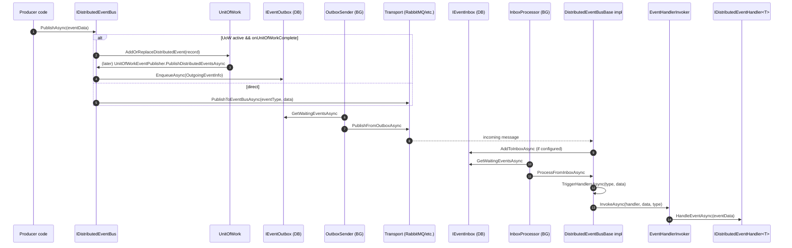

This page traces the **ABP Framework** event-bus flow end-to-end. It covers both `ILocalEventBus.PublishAsync` (in-process, in-AppDomain) and `IDistributedEventBus.PublishAsync` (cross-process, transactional with outbox + inbox), from the call site through the unit-of-work queue, transport-specific dispatch, and finally `EventHandlerInvoker.InvokeAsync` on the receiving side.

<Info>
ABP gives you **the same publish API** whether you are inside or outside a unit of work, and whether the bus is local or distributed. The class hierarchy `EventBusBase` → `LocalEventBus` / `DistributedEventBusBase` → concrete transports (`RabbitMqDistributedEventBus`, `KafkaDistributedEventBus`, `LocalDistributedEventBus`, ...) factors the cross-cutting behaviour — UoW deferral, tenant impersonation, generic-argument inheritance — into the base class.
</Info>

## 1. Sequence overview



## 2. The shared base: `EventBusBase`

Source: `framework/src/Volo.Abp.EventBus/Volo/Abp/EventBus/EventBusBase.cs`. Both `LocalEventBus` and every distributed implementation derive from it.

### 2.1 `PublishAsync` and the UoW shortcut

```csharp
public virtual async Task PublishAsync(Type eventType, object eventData, bool onUnitOfWorkComplete = true)
{
    if (onUnitOfWorkComplete && UnitOfWorkManager.Current != null)
    {
        AddToUnitOfWork(
            UnitOfWorkManager.Current,
            new UnitOfWorkEventRecord(eventType, eventData, EventOrderGenerator.GetNext())
        );
        return;
    }

    await PublishToEventBusAsync(eventType, eventData);
}
```

The UoW path is the **default**. As long as an ambient UoW exists and the caller did not pass `onUnitOfWorkComplete: false`, the event is queued onto `UnitOfWork.LocalEventWithPredicates` / `DistributedEventWithPredicates` via the overridden `AddToUnitOfWork`. The actual publish happens later from `UnitOfWork.CompleteAsync` → `UnitOfWorkEventPublisher.PublishLocalEventsAsync` / `PublishDistributedEventsAsync` (see [Unit of Work Lifecycle](/flows/unit-of-work-lifecycle)).

When the queue is flushed by `UnitOfWorkEventPublisher`, it passes `onUnitOfWorkComplete: false`, which causes this method to fall through to `PublishToEventBusAsync` — that is the only way out of the deferral.

### 2.2 `TriggerHandlersAsync`

```csharp
public virtual async Task TriggerHandlersAsync(Type eventType, object eventData)
{
    var exceptions = new List<Exception>();
    await TriggerHandlersAsync(eventType, eventData, exceptions);
    if (exceptions.Any()) { ThrowOriginalExceptions(eventType, exceptions); }
}
```

This is the dispatch entry point. Local subscribers call it directly; distributed transports call it after deserialising the incoming message.

### 2.3 Tenant impersonation inside `TriggerHandlerAsync`

```csharp
protected virtual async Task TriggerHandlerAsync(IEventHandlerFactory asyncHandlerFactory, Type eventType,
    object eventData, List<Exception> exceptions, InboxConfig? inboxConfig = null)
{
    using (var eventHandlerWrapper = asyncHandlerFactory.GetHandler())
    {
        try
        {
            var handlerType = ProxyHelper.GetUnProxiedType(eventHandlerWrapper.EventHandler);
            if (inboxConfig?.HandlerSelector != null && !inboxConfig.HandlerSelector(handlerType)) { return; }

            using (CurrentTenant.Change(GetEventDataTenantId(eventData)))
            {
                await InvokeEventHandlerAsync(eventHandlerWrapper.EventHandler, eventData, eventType);
            }
        }
        catch (TargetInvocationException ex) { exceptions.Add(ex.InnerException!); }
        catch (Exception ex) { exceptions.Add(ex); }
    }
}
```

`GetEventDataTenantId` consults `IMultiTenant.TenantId` or `IEventDataMayHaveTenantId.IsMultiTenant`, else falls back to `CurrentTenant.Id`. Every handler thus runs in the originating tenant's scope, which is essential for distributed events that cross AppDomain boundaries — the receiver has no HTTP context to derive a tenant from.

### 2.4 Generic inheritance

If the event type is generic and implements `IEventDataWithInheritableGenericArgument`, the base also publishes the **parent** event type (replacing the generic arg with its base). This is how `EntityCreatedEto<DerivedEntity>` also fires handlers registered for `EntityCreatedEto<BaseEntity>`.

## 3. Local path: `LocalEventBus`

Source: `framework/src/Volo.Abp.EventBus/Volo/Abp/EventBus/Local/LocalEventBus.cs`. Singleton, holds `ConcurrentDictionary<Type, List<IEventHandlerFactory>> HandlerFactories`. Handler types registered via `AbpLocalEventBusOptions.Handlers` are subscribed in the constructor by `SubscribeHandlers`.

`PublishToEventBusAsync` calls `TriggerHandlersAsync` directly — there is no transport hop. `AddToUnitOfWork` for local events:

```csharp
protected override void AddToUnitOfWork(IUnitOfWork unitOfWork, UnitOfWorkEventRecord eventRecord)
{
    unitOfWork.AddOrReplaceLocalEvent(eventRecord);
}
```

`AddOrReplaceLocalEvent` lets handlers deduplicate by predicate — useful for "I only need the last update" semantics inside a single transaction.

## 4. Distributed path: `DistributedEventBusBase`

Source: `framework/src/Volo.Abp.EventBus/Volo/Abp/EventBus/Distributed/DistributedEventBusBase.cs`.

### 4.1 `PublishAsync(useOutbox: true)`

```csharp
public virtual async Task PublishAsync(Type eventType, object eventData,
    bool onUnitOfWorkComplete = true, bool useOutbox = true)
{
    if (onUnitOfWorkComplete && UnitOfWorkManager.Current != null)
    {
        AddToUnitOfWork(UnitOfWorkManager.Current,
            new UnitOfWorkEventRecord(eventType, eventData, EventOrderGenerator.GetNext(), useOutbox));
        return;
    }

    if (useOutbox)
    {
        if (await AddToOutboxAsync(eventType, eventData)) { return; }
    }

    await PublishToEventBusAsync(eventType, eventData);
    await TriggerDistributedEventSentAsync(new DistributedEventSent
    {
        Source = DistributedEventSource.Direct,
        EventName = EventNameAttribute.GetNameOrDefault(eventType),
        EventData = eventData
    });
}
```

Three stages of escalation:

1. **Queued onto UoW** if one is active and `onUnitOfWorkComplete: true`.
2. **Outbox** — if any `AbpDistributedEventBusOptions.Outboxes` is configured **and** its `Selector` accepts this event type, the event is persisted to `IEventOutbox` and a background `OutboxSender` will later transmit it. The outbox row goes into the **same** DB transaction as the producer's changes, so atomicity is preserved.
3. **Direct** — finally, `PublishToEventBusAsync` (transport-specific) sends to RabbitMQ/Kafka/etc.

### 4.2 `AddToOutboxAsync`

```csharp
protected virtual async Task<bool> AddToOutboxAsync(Type eventType, object eventData)
{
    var unitOfWork = UnitOfWorkManager.Current;
    if (unitOfWork == null) { return false; }

    var addedToOutbox = false;
    foreach (var outboxConfig in AbpDistributedEventBusOptions.Outboxes.Values.OrderBy(x => x.Selector is null))
    {
        if (outboxConfig.Selector == null || outboxConfig.Selector(eventType))
        {
            var eventOutbox = (IEventOutbox)unitOfWork.ServiceProvider.GetRequiredService(outboxConfig.ImplementationType);
            var eventName = EventNameAttribute.GetNameOrDefault(eventType);
            await OnAddToOutboxAsync(eventName, eventType, eventData);

            var outgoingEventInfo = new OutgoingEventInfo(
                GuidGenerator.Create(), eventName, Serialize(eventData), Clock.Now);

            var correlationId = CorrelationIdProvider.Get();
            if (correlationId != null) { outgoingEventInfo.SetCorrelationId(correlationId); }
            await eventOutbox.EnqueueAsync(outgoingEventInfo);
            addedToOutbox = true;
        }
    }

    return addedToOutbox;
}
```

Note that the outbox path **requires** an active UoW — it resolves `IEventOutbox` from `unitOfWork.ServiceProvider` so it participates in the same scope/transaction as the producer's DB writes. Selectors let you route different event types to different outbox tables (e.g. per-microservice databases).

## 5. The outbox sender

Source: `framework/src/Volo.Abp.EventBus/Volo/Abp/EventBus/Distributed/OutboxSender.cs`. Started once per `OutboxConfig` by `OutboxSenderManager` during `OnApplicationInitialization`.

```csharp
protected virtual async Task RunAsync()
{
    await using (var handle = await DistributedLock.TryAcquireAsync(DistributedLockName, cancellationToken: StoppingToken))
    {
        if (handle != null)
        {
            while (true)
            {
                var waitingEvents = await GetWaitingEventsAsync();
                if (waitingEvents.Count <= 0) { break; }

                if (EventBusBoxesOptions.BatchPublishOutboxEvents)
                    await PublishOutgoingMessagesInBatchAsync(waitingEvents);
                else
                    await PublishOutgoingMessagesAsync(waitingEvents);
            }
        }
        else
        {
            Logger.LogDebug("Could not obtain the distributed lock: " + DistributedLockName);
        }
    }
}
```

Key design points:

- **Distributed lock** ensures only one node sends a given outbox at a time (otherwise duplicate publishes are possible).
- **Polling** is timer-driven (`AbpAsyncTimer`); the period is `EventBusBoxesOptions.PeriodTimeSpan`.
- Batched mode passes the whole `IEnumerable<OutgoingEventInfo>` to `IDistributedEventBus.PublishManyFromOutboxAsync`. Non-batched mode loops and calls `PublishFromOutboxAsync` per event.

`PublishFromOutboxAsync` is `abstract` on `DistributedEventBusBase`; the concrete transport (RabbitMQ, Kafka, AzureServiceBus, Local) implements the actual transmission.

## 6. The inbox processor

Source: `framework/src/Volo.Abp.EventBus/Volo/Abp/EventBus/Distributed/InboxProcessor.cs`. Started per `InboxConfig` by `InboxProcessManager`. Architecture mirrors the outbox: timer + distributed lock + page through `IEventInbox`.

```csharp
await DistributedEventBus
    .AsSupportsEventBoxes()
    .ProcessFromInboxAsync(waitingEvent, InboxConfig);
```

Failure policy is configurable:

```csharp
if (EventBusBoxesOptions.InboxProcessorFailurePolicy == InboxProcessorFailurePolicy.Retry) { ... }
if (EventBusBoxesOptions.InboxProcessorFailurePolicy == InboxProcessorFailurePolicy.RetryLater) { ... }
if (EventBusBoxesOptions.InboxProcessorFailurePolicy == InboxProcessorFailurePolicy.Discard) { ... }
```

`RetryLater` sets `NextRetryTime` with an exponential backoff up to `InboxProcessorMaxRetryCount`; events that exceed the limit are marked failed and skipped on subsequent polls.

## 7. Handler resolution

`EventBusBase.GetHandlerFactories(Type eventType)` is the abstract member that the concrete bus overrides. `LocalEventBus` returns matching entries from `HandlerFactories` plus parent-type matches. `DistributedEventBusBase` keeps a parallel dictionary populated by `Subscribe(Type, IEventHandlerFactory)` during module initialization (`AbpDistributedEventBusOptions.Handlers`).

Two concrete `IEventHandlerFactory` implementations dominate:

| File | Implementation | Lifetime |
| --- | --- | --- |
| `Volo.Abp.EventBus/Volo/Abp/EventBus/IocEventHandlerFactory.cs` | `IocEventHandlerFactory` | Resolves a fresh handler from a per-event scope |
| `Volo.Abp.EventBus/Volo/Abp/EventBus/TransientEventHandlerFactory.cs` | `TransientEventHandlerFactory<THandler>` | `new THandler()` per event |

`SingleInstanceHandlerFactory` wraps an already-constructed handler — used by the `Func<TEvent, Task>`-based `Subscribe` overload.

## 8. `EventHandlerInvoker.InvokeAsync`

Source: `framework/src/Volo.Abp.EventBus/Volo/Abp/EventBus/EventHandlerInvoker.cs`.

```csharp
public async Task InvokeAsync(IEventHandler eventHandler, object eventData, Type eventType)
{
    var cacheItem = _cache.GetOrAdd($"{eventHandler.GetType().FullName}-{eventType.FullName}", _ =>
    {
        var item = new EventHandlerInvokerCacheItem();

        if (typeof(ILocalEventHandler<>).MakeGenericType(eventType).IsInstanceOfType(eventHandler))
            item.Local = (IEventHandlerMethodExecutor?)Activator.CreateInstance(
                typeof(LocalEventHandlerMethodExecutor<>).MakeGenericType(eventType));

        if (typeof(IDistributedEventHandler<>).MakeGenericType(eventType).IsInstanceOfType(eventHandler))
            item.Distributed = (IEventHandlerMethodExecutor?)Activator.CreateInstance(
                typeof(DistributedEventHandlerMethodExecutor<>).MakeGenericType(eventType));

        return item;
    });

    if (cacheItem.Local != null)       { await cacheItem.Local.ExecutorAsync(eventHandler, eventData); }
    if (cacheItem.Distributed != null) { await cacheItem.Distributed.ExecutorAsync(eventHandler, eventData); }

    if (cacheItem.Local == null && cacheItem.Distributed == null)
        throw new AbpException("The object instance is not an event handler. Object type: "
            + eventHandler.GetType().AssemblyQualifiedName);
}
```

Two important consequences:

1. **Cached delegate** — reflection happens once per `(handlerType, eventType)` pair. The cached `IEventHandlerMethodExecutor` calls `HandleEventAsync(TEvent)` via a typed delegate, not reflection.
2. **Dual interfaces** — a handler that implements **both** `ILocalEventHandler<T>` and `IDistributedEventHandler<T>` for the same `T` will have **both** methods invoked. Useful when you want the same logic in both deployment modes but rare in practice.

## 9. The transactional bridge: `UnitOfWorkEventPublisher`

Source: `framework/src/Volo.Abp.EventBus/Volo/Abp/EventBus/UnitOfWorkEventPublisher.cs`. This is the bridge between `UnitOfWork.CompleteAsync` and the event buses:

```csharp
public async Task PublishLocalEventsAsync(IEnumerable<UnitOfWorkEventRecord> localEvents)
{
    foreach (var localEvent in localEvents)
    {
        await _localEventBus.PublishAsync(localEvent.EventType, localEvent.EventData, onUnitOfWorkComplete: false);
    }
}

public async Task PublishDistributedEventsAsync(IEnumerable<UnitOfWorkEventRecord> distributedEvents)
{
    foreach (var distributedEvent in distributedEvents)
    {
        await _distributedEventBus.PublishAsync(distributedEvent.EventType, distributedEvent.EventData,
            onUnitOfWorkComplete: false, useOutbox: distributedEvent.UseOutbox);
    }
}
```

The events ride the `UseOutbox` flag the producer originally set: an event published with `useOutbox: false` directly inside a UoW will, when the UoW completes, also reach the bus directly (bypassing the outbox even though the bus is configured with one).

## 10. Step-by-step trace (distributed, with outbox + inbox)

| # | File | Symbol | Notes |
| --- | --- | --- | --- |
| 1 | (User code) | `_distributedEventBus.PublishAsync(evt)` | Producer call inside a UoW |
| 2 | `DistributedEventBusBase.cs` | `PublishAsync` | Detects UoW, defers |
| 3 | `EventBusBase.cs` | `AddToUnitOfWork` (impl by `DistributedEventBusBase`) | Calls `AddOrReplaceDistributedEvent` |
| 4 | `UnitOfWork.cs` | `AddOrReplaceDistributedEvent` | Adds to `DistributedEventWithPredicates` |
| 5 | `UnitOfWork.cs` | `CompleteAsync` | Drains queue |
| 6 | `UnitOfWorkEventPublisher.cs` | `PublishDistributedEventsAsync` | Calls back into bus with `onUnitOfWorkComplete: false` |
| 7 | `DistributedEventBusBase.cs` | `PublishAsync` (re-entered) | Falls into outbox branch |
| 8 | `DistributedEventBusBase.cs` | `AddToOutboxAsync` | Persists `OutgoingEventInfo` |
| 9 | `IEventOutbox` (impl) | `EnqueueAsync` | Same DB scope as UoW |
| 10 | `UnitOfWork.cs` | `CommitTransactionsAsync` | DB commit; row visible |
| 11 | `OutboxSender.cs` | `RunAsync` (timer) | Acquires distributed lock |
| 12 | `OutboxSender.cs` | `GetWaitingEventsAsync` | Page of outgoing events |
| 13 | concrete bus | `PublishFromOutboxAsync` | Pushes onto RabbitMQ/Kafka/etc. |
| 14 | (Wire) | — | Cross-process transport |
| 15 | concrete bus consumer | (transport callback) | Calls `AddToInboxAsync` if inbox configured |
| 16 | `DistributedEventBusBase.cs` | `AddToInboxAsync` | Persists `IncomingEventInfo` |
| 17 | `InboxProcessor.cs` | `RunAsync` (timer) | Distributed lock + page |
| 18 | concrete bus | `ProcessFromInboxAsync` | Deserialises, calls `TriggerHandlersAsync` |
| 19 | `EventBusBase.cs` | `TriggerHandlersAsync` → `TriggerHandlerAsync` | Tenant scope + handler resolve |
| 20 | `IocEventHandlerFactory.cs` | `GetHandler` | Resolves handler in fresh scope |
| 21 | `EventHandlerInvoker.cs` | `InvokeAsync` | Cached executor invocation |
| 22 | (User code) | `IDistributedEventHandler<T>.HandleEventAsync` | Subscriber logic |

## 11. Local path: shorter trace

| # | File | Symbol | Notes |
| --- | --- | --- | --- |
| 1 | (User code) | `_localEventBus.PublishAsync(evt)` | Producer |
| 2 | `EventBusBase.cs` | `PublishAsync` | Defers to UoW if active |
| 3 | `UnitOfWork.cs` | `AddOrReplaceLocalEvent` | Queue |
| 4 | `UnitOfWorkEventPublisher.cs` | `PublishLocalEventsAsync` | After `SaveChangesAsync` |
| 5 | `EventBusBase.cs` | `PublishToEventBusAsync` | Calls `TriggerHandlersAsync` directly |
| 6 | `LocalEventBus.cs` | `GetHandlerFactories` | Lookup |
| 7 | `EventHandlerInvoker.cs` | `InvokeAsync` | Dispatch |
| 8 | (User code) | `ILocalEventHandler<T>.HandleEventAsync` | Subscriber |

## 12. Failure semantics

<Warning>
Direct `PublishAsync` (no UoW, no outbox) is **at-most-once**: if the transport fails mid-send the event is lost. Always wrap distributed publishes in a UoW with an outbox if you need durable delivery.
</Warning>

<Warning>
Inbox processing is **at-least-once**: a handler may run more than once for the same event if a node crashes between handler completion and the inbox row being marked processed. Make handlers idempotent — use the `MessageId` on `IncomingEventInfo` as a dedup key.
</Warning>

## 13. Related pages

- [Unit of Work Lifecycle](/flows/unit-of-work-lifecycle) — where queued events live until `CompleteAsync`
- [Multi-Tenancy Resolution](/flows/multi-tenancy-resolution) — `CurrentTenant.Change` inside `TriggerHandlerAsync`
- [Background Job Execution](/flows/background-job-execution) — outbox/inbox processors are themselves background workers
- [HTTP Request Lifecycle](/flows/http-request-lifecycle) — most distributed publishes originate inside an HTTP request
