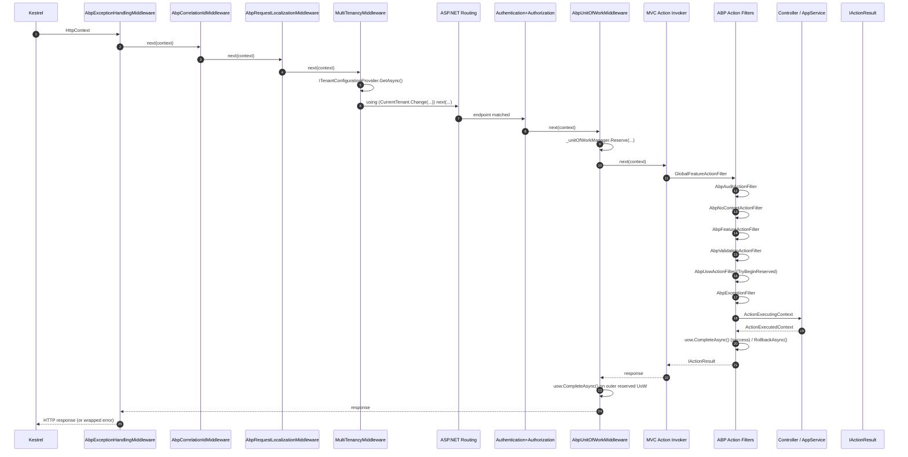

This page traces a single inbound HTTP request through the **ABP Framework** pipeline as it is composed on top of ASP.NET Core. It follows the request from `Kestrel` → ABP middlewares → MVC routing → ABP action filters → controller method → result, naming every file and symbol along the way. The pipeline shown here is the one produced by the standard `app.UseAbpExceptionHandling()` / `app.UseMultiTenancy()` / `app.UseUnitOfWork()` ordering that ABP startup templates emit.

<Info>
ABP does not replace the ASP.NET Core pipeline; it composes it. Each `UseAbp*` extension lives in `framework/src/Volo.Abp.AspNetCore/Microsoft/AspNetCore/Builder/AbpApplicationBuilderExtensions.cs` and adds a single `AbpMiddlewareBase`-derived middleware. ABP-specific cross-cutting work that is per-action (audit, validation, UoW commit, feature check, policy check) is implemented as MVC `IAsyncActionFilter`s registered in `AbpAspNetCoreMvcModule`.
</Info>

## 1. Sequence overview



## 2. Pipeline composition

The ABP startup template emits a `Configure` method like this (simplified, from any host's `*HttpApiHostModule`):

```csharp
app.UseAbpRequestLocalization();
app.UseCorrelationId();
app.UseAbpExceptionHandling();
app.UseRouting();
app.UseAbpSecurityHeaders();
app.UseAuthentication();
app.UseMultiTenancy();
app.UseAbpOpenIddictValidation();
app.UseAuthorization();
app.UseAuditing();
app.UseAbpSerilogEnrichers();
app.UseUnitOfWork();
app.UseConfiguredEndpoints();
```

Every `UseAbp*` call resolves to a `UseMiddleware<...>` invocation inside `framework/src/Volo.Abp.AspNetCore/Microsoft/AspNetCore/Builder/AbpApplicationBuilderExtensions.cs`. For example:

```csharp
public static IApplicationBuilder UseUnitOfWork(this IApplicationBuilder app)
{
    return app
        .UseAbpExceptionHandling()
        .UseMiddleware<AbpUnitOfWorkMiddleware>();
}

public static IApplicationBuilder UseAbpExceptionHandling(this IApplicationBuilder app)
{
    if (app.Properties.ContainsKey(ExceptionHandlingMiddlewareMarker)) { return app; }
    app.Properties[ExceptionHandlingMiddlewareMarker] = true;
    return app.UseMiddleware<AbpExceptionHandlingMiddleware>();
}
```

Note the marker on `UseAbpExceptionHandling`: calling it twice (which `UseUnitOfWork` does implicitly) is a no-op.

## 3. `AbpExceptionHandlingMiddleware` — the outer net

Source: `framework/src/Volo.Abp.AspNetCore/Volo/Abp/AspNetCore/ExceptionHandling/AbpExceptionHandlingMiddleware.cs`.

```csharp
public async override Task InvokeAsync(HttpContext context, RequestDelegate next)
{
    try { await next(context); }
    catch (Exception ex)
    {
        if (context.Response.HasStarted) { _logger.LogWarning(...); throw; }
        if (context.Items["_AbpActionInfo"] is AbpActionInfoInHttpContext actionInfo)
        {
            if (actionInfo.IsObjectResult) { await HandleAndWrapException(context, ex); return; }
        }
        throw;
    }
}
```

The middleware only **wraps** exceptions for endpoints that produced a JSON `IActionResult` (`_AbpActionInfo.IsObjectResult` is set by `AbpUowActionFilter` early in MVC). Razor Pages exceptions bubble up to ASP.NET's developer / status-code middleware. The actual JSON shaping is done by `HandleAndWrapException`, which calls into `IExceptionToErrorInfoConverter`.

## 4. Correlation ID + request culture

`AbpCorrelationIdMiddleware` (under `Volo.Abp.AspNetCore/Volo/Abp/AspNetCore/Tracing/`) reads/issues the configured correlation header and stamps `ICorrelationIdProvider`. `AbpRequestLocalizationMiddleware` (under `Volo.Abp.AspNetCore/Microsoft/AspNetCore/RequestLocalization/`) is a thin override of ASP.NET's `RequestLocalizationMiddleware` that respects ABP `LanguageInfo` settings.

These two middlewares are pure pass-throughs in the happy path; they only mutate `HttpContext.Items` and headers.

## 5. `MultiTenancyMiddleware`

Source: `framework/src/Volo.Abp.AspNetCore.MultiTenancy/Volo/Abp/AspNetCore/MultiTenancy/MultiTenancyMiddleware.cs`. This middleware turns request data (route, header, cookie, query string) into an `ICurrentTenant.Change(...)` scope that wraps the rest of the pipeline:

```csharp
public async override Task InvokeAsync(HttpContext context, RequestDelegate next)
{
    TenantConfiguration? tenant = null;
    try { tenant = await _tenantConfigurationProvider.GetAsync(saveResolveResult: true); }
    catch (Exception e) { ... }

    if (tenant?.Id != _currentTenant.Id)
    {
        using (_currentTenant.Change(tenant?.Id, tenant?.Name))
        {
            if (_tenantResolveResultAccessor.Result?.AppliedResolvers
                .Contains(QueryStringTenantResolveContributor.ContributorName) == true)
            {
                AbpMultiTenancyCookieHelper.SetTenantCookie(context, _currentTenant.Id, _options.TenantKey);
            }
            ...
            await next(context);
        }
    }
    else { await next(context); }
}
```

The resolver chain that actually does the work is described in detail on the [Multi-Tenancy Resolution](/flows/multi-tenancy-resolution) page.

## 6. Authentication / Authorization middlewares

These are stock ASP.NET Core middlewares (`UseAuthentication`, `UseAuthorization`) — ABP does not replace them at the HTTP-pipeline level. What ABP **does** replace is the policy provider that `UseAuthorization` consults: `AbpAuthorizationPolicyProvider` (in `Volo.Abp.Authorization`) extends `DefaultAuthorizationPolicyProvider` to synthesise a `PermissionRequirement` for any unknown policy name that matches a registered ABP permission. That code path is fully covered in [Authorization Pipeline](/flows/authorization-pipeline).

## 7. `AbpUnitOfWorkMiddleware`

Source: `framework/src/Volo.Abp.AspNetCore/Volo/Abp/AspNetCore/Uow/AbpUnitOfWorkMiddleware.cs`. Its job is to **reserve** an outer unit of work that the MVC action filter (`AbpUowActionFilter`) can later attach to.

```csharp
public async override Task InvokeAsync(HttpContext context, RequestDelegate next)
{
    if (await ShouldSkipAsync(context, next) || IsIgnoredUrl(context)) { await next(context); return; }

    using (var uow = _unitOfWorkManager.Reserve(UnitOfWork.UnitOfWorkReservationName))
    {
        await next(context);
        await uow.CompleteAsync(_cancellationTokenProvider.Token);
    }
}
```

Two important details:

1. The reservation name `_AbpActionUnitOfWork` is the const `UnitOfWork.UnitOfWorkReservationName` defined in `Volo.Abp.Uow/Volo/Abp/Uow/UnitOfWork.cs`. The action filter looks for **exactly** this name when it calls `TryBeginReserved`.
2. The middleware completes the UoW **after** `next(context)` returns. If the action filter already called `CompleteAsync` on the child UoW it associated with, the outer reservation completes are no-ops (it is already `IsCompleted`).

`ShouldSkipAsync` (inherited from `AbpMiddlewareBase`) also bails out for Blazor server endpoints to avoid the "second operation on the same DbContext" race.

## 8. Routing + MVC invoker

`app.UseConfiguredEndpoints()` calls `endpoints.MapControllers()`, `MapHubs()`, `MapHealthChecks()` etc. — see `Volo.Abp.AspNetCore.Mvc/Microsoft/AspNetCore/Builder/AbpEndpointRouteBuilderExtensions.cs`. From here ASP.NET's `EndpointMiddleware` dispatches to the `ControllerActionInvoker`, which runs the MVC filter pipeline in the order described in §9 below.

The filter ordering is set in `framework/src/Volo.Abp.AspNetCore.Mvc/Volo/Abp/AspNetCore/Mvc/AbpMvcOptionsExtensions.cs`, in the private `AddActionFilters` helper called from `AddAbp(MvcOptions)`:

```csharp
private static void AddActionFilters(MvcOptions options)
{
    options.Filters.AddService(typeof(GlobalFeatureActionFilter));
    options.Filters.AddService(typeof(AbpAuditActionFilter));
    options.Filters.AddService(typeof(AbpNoContentActionFilter));
    options.Filters.AddService(typeof(AbpFeatureActionFilter));
    options.Filters.AddService(typeof(AbpValidationActionFilter));
    options.Filters.AddService(typeof(AbpUowActionFilter));
    options.Filters.AddService(typeof(AbpExceptionFilter));
}
```

## 9. ABP MVC action filters in detail

### 9.1 `AbpValidationActionFilter`

Source: `framework/src/Volo.Abp.AspNetCore.Mvc/Volo/Abp/AspNetCore/Mvc/Validation/AbpValidationActionFilter.cs`.

```csharp
public async Task OnActionExecutionAsync(ActionExecutingContext context, ActionExecutionDelegate next)
{
    if (!context.ActionDescriptor.IsControllerAction() ||
        !context.ActionDescriptor.HasObjectResult()) { await next(); return; }

    if (!context.GetRequiredService<IOptions<AbpAspNetCoreMvcOptions>>().Value.AutoModelValidation) { await next(); return; }
    if (ReflectionHelper.GetSingleAttributeOfMemberOrDeclaringTypeOrDefault<DisableValidationAttribute>(...) != null) { ... }

    context.GetRequiredService<IModelStateValidator>().Validate(context.ModelState);
    if (context.Controller is IValidationEnabled) { await ValidateActionArgumentsAsync(context, effectiveMethod); }
    await next();
}
```

It runs `IModelStateValidator.Validate` first (basic `ModelState` check), then `IMethodInvocationValidator.ValidateAsync` for app services / controllers that opt in by implementing `IValidationEnabled` (which `AbpController` does).

### 9.2 `AbpUowActionFilter`

Source: `framework/src/Volo.Abp.AspNetCore.Mvc/Volo/Abp/AspNetCore/Mvc/Uow/AbpUowActionFilter.cs`. This is the bridge between the middleware-level reservation and the per-action UoW.

```csharp
if (unitOfWorkManager.TryBeginReserved(UnitOfWork.UnitOfWorkReservationName, options))
{
    var result = await next();
    if (Succeed(result)) { await SaveChangesAsync(context, unitOfWorkManager, ct); }
    else                 { await RollbackAsync (context, unitOfWorkManager, ct); }
    return;
}

using (var uow = unitOfWorkManager.Begin(options))
{
    var result = await next();
    if (Succeed(result)) { await uow.CompleteAsync(ct); }
    else                 { await uow.RollbackAsync(ct); }
}
```

`TryBeginReserved` returns true because `AbpUnitOfWorkMiddleware` already called `Reserve`. The filter also stashes `_AbpActionInfo` on `HttpContext.Items` for the exception middleware:

```csharp
context.HttpContext.Items["_AbpActionInfo"] = new AbpActionInfoInHttpContext
{
    IsObjectResult = context.ActionDescriptor.HasObjectResult()
};
```

The full UoW state machine is documented in [Unit of Work Lifecycle](/flows/unit-of-work-lifecycle).

### 9.3 `AbpFeatureActionFilter`

Source: `framework/src/Volo.Abp.AspNetCore.Mvc/Volo/Abp/AspNetCore/Mvc/Features/AbpFeatureActionFilter.cs`.

```csharp
using (AbpCrossCuttingConcerns.Applying(context.Controller, AbpCrossCuttingConcerns.FeatureChecking))
{
    var methodInvocationFeatureCheckerService = context.GetRequiredService<IMethodInvocationFeatureCheckerService>();
    await methodInvocationFeatureCheckerService.CheckAsync(new MethodInvocationFeatureCheckerContext(methodInfo));
    await next();
}
```

It enforces `[RequiresFeature("MyFeature")]` attributes via `IMethodInvocationFeatureCheckerService`, which in turn consults `IFeatureChecker`. If a required feature is disabled for the current tenant, it throws `AbpAuthorizationException` which the exception middleware (or `AbpExceptionFilter`) converts to HTTP 403.

### 9.4 `AbpAuditActionFilter`

Source: `framework/src/Volo.Abp.AspNetCore.Mvc/Volo/Abp/AspNetCore/Mvc/Auditing/AbpAuditActionFilter.cs`.

```csharp
using (AbpCrossCuttingConcerns.Applying(context.Controller, AbpCrossCuttingConcerns.Auditing))
{
    var stopwatch = Stopwatch.StartNew();
    try
    {
        var result = await next();
        if (result.Exception != null && !auditLog!.Exceptions.Contains(result.Exception))
            auditLog!.Exceptions.Add(result.Exception);
    }
    catch (Exception ex) { auditLog!.Exceptions.Add(ex); throw; }
    finally
    {
        stopwatch.Stop();
        auditLogAction.ExecutionDuration = Convert.ToInt32(stopwatch.Elapsed.TotalMilliseconds);
        auditLog!.Actions.Add(auditLogAction);
    }
}
```

Records duration, exception, and the action descriptor against the per-request `AuditLogInfo` produced by `AbpAuditingMiddleware`.

### 9.5 Authorization filter

`AbpAuthorizationFilter`/`AuthorizationInterceptor` does the role/permission check. For MVC controllers that path is normally entered by ASP.NET's built-in `AuthorizeFilter` consulting `AbpAuthorizationPolicyProvider`. For app services called outside the MVC pipeline (e.g. via dependency injection from a background job), the same check is performed by `AuthorizationInterceptor` — see [Authorization Pipeline](/flows/authorization-pipeline).

## 10. Controller / app service execution

The action method finally runs. ABP's `AbpController` (in `Volo.Abp.AspNetCore.Mvc/Volo/Abp/AspNetCore/Mvc/AbpController.cs`) is an opinionated base that:

- Exposes `LazyServiceProvider` for property-injected services
- Implements `IValidationEnabled` so the validation filter inspects arguments
- Implements `IAuditingEnabled`
- Adds `L`, `LazyServiceProvider`, `CurrentUser`, `CurrentTenant` accessors

App services exposed through dynamic MVC controllers (via `ConventionalControllerOptions`) inherit `ApplicationService`, which has similar plumbing but is **not** a controller; it is wrapped by ABP's dynamic controller generation in `AbpServiceConvention`.

## 11. Result conversion

After the action returns, `AbpNoContentActionFilter` checks whether an action that declares `Task<X?>` returned `null`, and if so swaps the result for `NoContentResult` (HTTP 204) instead of an empty 200 with `null` body. Source: `framework/src/Volo.Abp.AspNetCore.Mvc/Volo/Abp/AspNetCore/Mvc/Response/AbpNoContentActionFilter.cs`.

`AbpExceptionFilter` (`framework/src/Volo.Abp.AspNetCore.Mvc/Volo/Abp/AspNetCore/Mvc/ExceptionHandling/AbpExceptionFilter.cs`) catches any exception that escaped the action and, for object-result actions, converts it via `IHttpExceptionStatusCodeFinder` and `IExceptionToErrorInfoConverter` into a `RemoteServiceErrorResponse` JSON body.

## 12. Step-by-step trace

| # | File | Symbol | Notes |
| --- | --- | --- | --- |
| 1 | `AbpExceptionHandlingMiddleware.cs` | `InvokeAsync` | Outer try/catch |
| 2 | `AbpCorrelationIdMiddleware.cs` | `InvokeAsync` | Reads/writes `X-Correlation-Id` |
| 3 | `AbpRequestLocalizationMiddleware.cs` | `InvokeAsync` | Sets `CurrentCulture` |
| 4 | `MultiTenancyMiddleware.cs` | `InvokeAsync` | `ICurrentTenant.Change(...)` wrapper |
| 5 | `EndpointRoutingMiddleware` | (ASP.NET) | Matches endpoint |
| 6 | `AuthenticationMiddleware` | `Invoke` | Populates `HttpContext.User` |
| 7 | `AuthorizationMiddleware` | `Invoke` | Calls `AbpAuthorizationPolicyProvider.GetPolicyAsync` |
| 8 | `AbpUnitOfWorkMiddleware.cs` | `InvokeAsync` | `_unitOfWorkManager.Reserve(...)` |
| 9 | `ControllerActionInvoker` | (ASP.NET) | Runs filter pipeline |
| 10 | `AbpValidationActionFilter.cs` | `OnActionExecutionAsync` | `IModelStateValidator` + `IMethodInvocationValidator` |
| 11 | `AbpUowActionFilter.cs` | `OnActionExecutionAsync` | `TryBeginReserved` / `Begin` |
| 12 | `AbpFeatureActionFilter.cs` | `OnActionExecutionAsync` | `[RequiresFeature]` check |
| 13 | `AbpAuditActionFilter.cs` | `OnActionExecutionAsync` | `AuditLogActionInfo` capture |
| 14 | `Your controller` | `[HttpPost] CreateAsync` | Domain logic |
| 15 | `AbpAuditActionFilter.cs` | `finally` | `stopwatch.Stop()` + add action |
| 16 | `AbpUowActionFilter.cs` | `SaveChangesAsync` | `currentUow.SaveChangesAsync(ct)` |
| 17 | `AbpUnitOfWorkMiddleware.cs` | `uow.CompleteAsync` | Outer commit |
| 18 | `AbpExceptionHandlingMiddleware.cs` | `HandleAndWrapException` | If exception propagated |

## 13. Skipping ABP middlewares

`AbpMiddlewareBase` (`framework/src/Volo.Abp.AspNetCore/Volo/Abp/AspNetCore/Middleware/AbpMiddlewareBase.cs`) exposes `ShouldSkipAsync(HttpContext, RequestDelegate)`, which every ABP middleware honors. Modules can register an `IAbpMiddlewareSkipper<TMiddleware>` to short-circuit specific middlewares for specific endpoints (used by Blazor and SignalR integration).

## 14. Cross-references

- [Application Startup](/flows/application-startup) — where the pipeline is **assembled** during `OnApplicationInitialization`
- [Unit of Work Lifecycle](/flows/unit-of-work-lifecycle) — the `Reserve` / `TryBeginReserved` dance
- [Multi-Tenancy Resolution](/flows/multi-tenancy-resolution) — what `_tenantConfigurationProvider.GetAsync` actually does
- [Authorization Pipeline](/flows/authorization-pipeline) — what `AuthorizationMiddleware` ends up calling
- [Event Publish and Handle](/flows/event-publish-and-handle) — events queued from inside the action are dispatched during `CompleteAsync`

<Tip>
The classic source of "my events never fire" bugs is calling `IDistributedEventBus.PublishAsync` from a controller while there is **no** ambient UoW (because the URL is on `AbpAspNetCoreUnitOfWorkOptions.IgnoredUrls`). The event is queued onto `UnitOfWorkManager.Current` which is `null`, so it falls through to the direct path. Always check `_unitOfWorkManager.Current` if you're debugging an event that should have been transactional.
</Tip>
