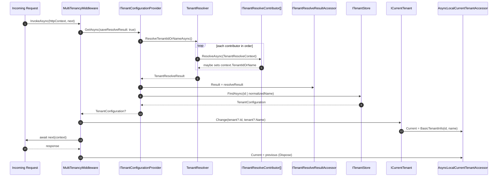

This page traces how a single HTTP request acquires a tenant identity in the **ABP Framework**. The flow runs through `MultiTenancyMiddleware` → `ITenantConfigurationProvider.GetAsync` → `ITenantResolver.ResolveTenantIdOrNameAsync` → the ordered resolver chain → `ITenantStore.FindAsync` → `ICurrentTenant.Change`. The page also covers the downstream effects of having a current tenant set: per-tenant connection strings, data filters, settings, and feature checks.

<Info>
ABP's multi-tenancy resolution is **best-effort, then validate**: the middleware tries every configured `ITenantResolveContributor` until one yields a value, then validates that value through `ITenantStore`. If validation fails (tenant missing or inactive), an `AbpException` is raised and the configured error-page builder is invoked. If no contributor resolves anything, the request runs as **host** (no current tenant).
</Info>

## 1. Sequence overview



## 2. The middleware: `MultiTenancyMiddleware`

Source: `framework/src/Volo.Abp.AspNetCore.MultiTenancy/Volo/Abp/AspNetCore/MultiTenancy/MultiTenancyMiddleware.cs`.

```csharp
public async override Task InvokeAsync(HttpContext context, RequestDelegate next)
{
    TenantConfiguration? tenant = null;
    try { tenant = await _tenantConfigurationProvider.GetAsync(saveResolveResult: true); }
    catch (Exception e)
    {
        Logger.LogException(e);
        if (await _options.MultiTenancyMiddlewareErrorPageBuilder(context, e)) { return; }
    }

    if (tenant?.Id != _currentTenant.Id)
    {
        using (_currentTenant.Change(tenant?.Id, tenant?.Name))
        {
            if (_tenantResolveResultAccessor.Result != null &&
                _tenantResolveResultAccessor.Result.AppliedResolvers
                    .Contains(QueryStringTenantResolveContributor.ContributorName))
            {
                AbpMultiTenancyCookieHelper.SetTenantCookie(context, _currentTenant.Id, _options.TenantKey);
            }

            var requestCulture = await TryGetRequestCultureAsync(context);
            if (requestCulture != null)
            {
                CultureInfo.CurrentCulture = requestCulture.Culture;
                CultureInfo.CurrentUICulture = requestCulture.UICulture;
                AbpRequestCultureCookieHelper.SetCultureCookie(context, requestCulture);
                context.Items[AbpRequestLocalizationMiddleware.HttpContextItemName] = true;
            }

            await next(context);
        }
    }
    else
    {
        await next(context);
    }
}
```

Three nuances worth highlighting:

1. **Error suppression** — Tenant lookup failures (missing/inactive tenant) are caught here. `AbpAspNetCoreMultiTenancyOptions.MultiTenancyMiddlewareErrorPageBuilder` is a delegate that gets a chance to short-circuit the request (return `true`) instead of letting the exception propagate.
2. **Cookie pinning** — If the query-string resolver wins, the resolved tenant id is written back to a cookie via `AbpMultiTenancyCookieHelper.SetTenantCookie`, so the next request from the same browser doesn't have to keep the query string.
3. **Per-tenant culture** — If a tenant has its own `Localization.DefaultLanguage` setting, the middleware will lift it into `CultureInfo.CurrentCulture` / `CurrentUICulture` and persist it in the culture cookie. This only fires when no other resolver (e.g. `RequestLocalizationMiddleware`) has already picked a culture.

## 3. Provider: `TenantConfigurationProvider.GetAsync`

Source: `framework/src/Volo.Abp.MultiTenancy/Volo/Abp/MultiTenancy/TenantConfigurationProvider.cs`.

```csharp
public virtual async Task<TenantConfiguration?> GetAsync(bool saveResolveResult = false)
{
    var resolveResult = await TenantResolver.ResolveTenantIdOrNameAsync();
    if (saveResolveResult) { TenantResolveResultAccessor.Result = resolveResult; }

    TenantConfiguration? tenant = null;
    if (resolveResult.TenantIdOrName != null)
    {
        tenant = await FindTenantAsync(resolveResult.TenantIdOrName);

        if (tenant == null)
        {
            throw new BusinessException(
                code: "Volo.AbpIo.MultiTenancy:010001",
                message: StringLocalizer["TenantNotFoundMessage"],
                details: StringLocalizer["TenantNotFoundDetails", resolveResult.TenantIdOrName]
            );
        }

        if (!tenant.IsActive)
        {
            throw new BusinessException(
                code: "Volo.AbpIo.MultiTenancy:010002",
                message: StringLocalizer["TenantNotActiveMessage"],
                details: StringLocalizer["TenantNotActiveDetails", resolveResult.TenantIdOrName]
            );
        }
    }

    return tenant;
}

protected virtual async Task<TenantConfiguration?> FindTenantAsync(string tenantIdOrName)
{
    if (Guid.TryParse(tenantIdOrName, out var parsedTenantId))
        return await TenantStore.FindAsync(parsedTenantId);
    else
        return await TenantStore.FindAsync(TenantNormalizer.NormalizeName(tenantIdOrName)!);
}
```

`FindTenantAsync` accepts either a Guid or a name; names are normalised (uppercased) by `ITenantNormalizer`. Two well-defined business exception codes (`010001`, `010002`) make catch-blocks predictable.

## 4. The resolver loop: `TenantResolver`

Source: `framework/src/Volo.Abp.MultiTenancy/Volo/Abp/MultiTenancy/TenantResolver.cs`.

```csharp
public virtual async Task<TenantResolveResult> ResolveTenantIdOrNameAsync()
{
    var result = new TenantResolveResult();

    using (var serviceScope = ServiceProvider.CreateScope())
    {
        var context = new TenantResolveContext(serviceScope.ServiceProvider);

        foreach (var tenantResolver in Options.TenantResolvers)
        {
            Logger.LogDebug("Trying to resolve tenant through '{TenantResolverName}'...", tenantResolver.Name);
            await tenantResolver.ResolveAsync(context);
            result.AppliedResolvers.Add(tenantResolver.Name);

            if (context.HasResolvedTenantOrHost())
            {
                result.TenantIdOrName = context.TenantIdOrName;
                break;
            }
        }
    }

    if (result.TenantIdOrName.IsNullOrEmpty() && !string.IsNullOrWhiteSpace(Options.FallbackTenant))
    {
        result.TenantIdOrName = Options.FallbackTenant;
        result.AppliedResolvers.Add(TenantResolverNames.FallbackTenant);
    }

    return result;
}
```

Key properties:

1. **Resolvers are walked in order.** The list is `AbpTenantResolveOptions.TenantResolvers`.
2. **First-wins** via `context.HasResolvedTenantOrHost()` — which is `true` if `TenantIdOrName` is set **or** `context.Handled` is true (a resolver can explicitly signal "I handled this as host" even without setting a tenant id).
3. **Fallback** — `AbpTenantResolveOptions.FallbackTenant` is consulted only if no contributor handled anything; useful for dev setups.
4. **`AppliedResolvers`** is the full list of contributors that were tried, in order. The middleware later checks this to decide whether to pin a cookie.

## 5. The default resolver chain

`AbpMultiTenancyModule.ConfigureServices` (`framework/src/Volo.Abp.MultiTenancy/Volo/Abp/MultiTenancy/AbpMultiTenancyModule.cs`) seeds the chain with `CurrentUserTenantResolveContributor` at position 0:

```csharp
Configure<AbpTenantResolveOptions>(options =>
{
    options.TenantResolvers.Insert(0, new CurrentUserTenantResolveContributor());
});
```

`AbpAspNetCoreMultiTenancyModule.ConfigureServices` appends HTTP-specific contributors:

```csharp
Configure<AbpTenantResolveOptions>(options =>
{
    options.TenantResolvers.Add(new QueryStringTenantResolveContributor());
    options.TenantResolvers.Add(new RouteTenantResolveContributor());
    options.TenantResolvers.Add(new HeaderTenantResolveContributor());
    options.TenantResolvers.Add(new CookieTenantResolveContributor());
});
```

The default order (after both modules load) is therefore:

| Position | Contributor | Source |
| --- | --- | --- |
| 0 | `CurrentUserTenantResolveContributor` | `tid` claim from authenticated principal |
| 1 | `QueryStringTenantResolveContributor` | `?__tenant=...` |
| 2 | `RouteTenantResolveContributor` | `{__tenant}` route token |
| 3 | `HeaderTenantResolveContributor` | `__tenant` HTTP header |
| 4 | `CookieTenantResolveContributor` | `__tenant` cookie |

`DomainTenantResolveContributor` is **not** included by default; you wire it explicitly with `options.AddDomainTenantResolver(...)` when your tenants live on per-tenant subdomains.

### 5.1 `CurrentUserTenantResolveContributor`

`framework/src/Volo.Abp.MultiTenancy/Volo/Abp/MultiTenancy/CurrentUserTenantResolveContributor.cs`:

```csharp
public override Task ResolveAsync(ITenantResolveContext context)
{
    var currentUser = context.ServiceProvider.GetRequiredService<ICurrentUser>();
    if (currentUser.IsAuthenticated)
    {
        context.Handled = true;
        context.TenantIdOrName = currentUser.TenantId?.ToString();
    }
    return Task.CompletedTask;
}
```

If the principal has a `tenantid` claim, **that wins** — preventing impersonation attacks where a user from tenant A passes `?__tenant=B`. Note that `Handled = true` is set even if the user is a host user (no `TenantId`), so the loop short-circuits without falling through to QueryString.

### 5.2 `QueryStringTenantResolveContributor` & friends

All four HTTP-based contributors inherit `HttpTenantResolveContributorBase` and override `GetTenantIdOrNameFromHttpContextOrNullAsync`. Example, from `HeaderTenantResolveContributor`:

```csharp
protected override Task<string?> GetTenantIdOrNameFromHttpContextOrNullAsync(ITenantResolveContext context, HttpContext httpContext)
{
    var tenantIdKey = context.GetAbpAspNetCoreMultiTenancyOptions().TenantKey;
    var tenantIdHeader = httpContext.Request.Headers[tenantIdKey];
    if (tenantIdHeader == string.Empty || tenantIdHeader.Count < 1)
        return Task.FromResult((string?)null);
    if (tenantIdHeader.Count > 1) { Log(context, ...); }
    return Task.FromResult(tenantIdHeader.First());
}
```

The header/cookie/query-string key is configurable via `AbpAspNetCoreMultiTenancyOptions.TenantKey` (default `__tenant`).

### 5.3 `DomainTenantResolveContributor`

`framework/src/Volo.Abp.AspNetCore.MultiTenancy/Volo/Abp/AspNetCore/MultiTenancy/DomainTenantResolveContributor.cs` extracts the tenant from `Host` using `FormattedStringValueExtracter`:

```csharp
var hostName = httpContext.Request.Host.Value.RemovePreFix(ProtocolPrefixes);
var extractResult = FormattedStringValueExtracter.Extract(hostName, _domainFormat, ignoreCase: true);
context.Handled = true;
return Task.FromResult(extractResult.IsMatch ? extractResult.Matches[0].Value : null);
```

You wire it with `options.AddDomainTenantResolver("{0}.mydomain.com")`. Critically, it sets `Handled = true` even if the host doesn't match — i.e. "I am authoritative about host-based resolution; if no match, the request is for host (no tenant)."

## 6. The store: `ITenantStore`

The default implementation is `DefaultTenantStore` (`framework/src/Volo.Abp.MultiTenancy/Volo/Abp/MultiTenancy/ConfigurationStore/DefaultTenantStore.cs`), which reads from `AbpDefaultTenantStoreOptions.Tenants` (i.e. `appsettings.json`):

```csharp
public TenantConfiguration? Find(Guid id)
{
    return _options.Tenants?.FirstOrDefault(t => t.Id == id);
}

public TenantConfiguration? Find(string normalizedName)
{
    return _options.Tenants?.FirstOrDefault(t => t.NormalizedName == normalizedName);
}
```

Real installations swap this for `TenantStore` from the `Volo.Abp.TenantManagement.Domain` module, which reads from the `AbpTenants` table and caches via `IDistributedCache<TenantConfigurationCacheItem>`. Both implementations return `TenantConfiguration` objects carrying the tenant's `Id`, `Name`, `NormalizedName`, `IsActive`, and `ConnectionStrings`.

## 7. `ICurrentTenant.Change` and the ambient scope

Source: `framework/src/Volo.Abp.MultiTenancy/Volo/Abp/MultiTenancy/CurrentTenant.cs`.

```csharp
public IDisposable Change(Guid? id, string? name = null) => SetCurrent(id, name);

private IDisposable SetCurrent(Guid? tenantId, string? name = null)
{
    var parentScope = _currentTenantAccessor.Current;
    _currentTenantAccessor.Current = new BasicTenantInfo(tenantId, name);

    return new DisposeAction<ValueTuple<ICurrentTenantAccessor, BasicTenantInfo?>>(static (state) =>
    {
        var (currentTenantAccessor, parentScope) = state;
        currentTenantAccessor.Current = parentScope;
    }, (_currentTenantAccessor, parentScope));
}
```

The accessor itself (`AsyncLocalCurrentTenantAccessor`, `framework/src/Volo.Abp.MultiTenancy/Volo/Abp/MultiTenancy/AsyncLocalCurrentTenantAccessor.cs`) is a `Singleton` over `AsyncLocal<BasicTenantInfo?>`:

```csharp
public class AsyncLocalCurrentTenantAccessor : ICurrentTenantAccessor
{
    public static AsyncLocalCurrentTenantAccessor Instance { get; } = new();
    public BasicTenantInfo? Current { get => _currentScope.Value; set => _currentScope.Value = value; }
    private readonly AsyncLocal<BasicTenantInfo?> _currentScope;
}
```

Registered in `AbpMultiTenancyModule`:

```csharp
context.Services.AddSingleton<ICurrentTenantAccessor>(AsyncLocalCurrentTenantAccessor.Instance);
```

So the *one* accessor instance is shared across the entire app; `AsyncLocal` is what gives per-request, async-flow-aware tenancy.

## 8. Downstream effects of `ICurrentTenant.Id`

Once the middleware has set the current tenant, four subsystems consult `ICurrentTenant` automatically:

### 8.1 Connection strings: `MultiTenantConnectionStringResolver`

Source: `framework/src/Volo.Abp.MultiTenancy/Volo/Abp/MultiTenancy/MultiTenantConnectionStringResolver.cs`.

```csharp
public override async Task<string> ResolveAsync(string? connectionStringName = null)
{
    if (_currentTenant.Id == null) { return await base.ResolveAsync(connectionStringName); }

    var tenant = await FindTenantConfigurationAsync(_currentTenant.Id.Value);
    if (tenant == null || tenant.ConnectionStrings.IsNullOrEmpty()) { return await base.ResolveAsync(connectionStringName); }

    var tenantDefaultConnectionString = tenant.ConnectionStrings?.Default;
    if (connectionStringName == null || connectionStringName == ConnectionStrings.DefaultConnectionStringName)
    {
        return !tenantDefaultConnectionString.IsNullOrWhiteSpace()
            ? tenantDefaultConnectionString!
            : Options.ConnectionStrings.Default!;
    }
    ...
}
```

Per-tenant connection strings stored in `TenantConfiguration.ConnectionStrings` override the host-level default. This is the single biggest mechanism for **database-per-tenant** isolation.

### 8.2 Data filter: `IMultiTenant` query filter

EF Core and MongoDB integrations register an `IDataFilter<IMultiTenant>` that automatically appends `WHERE TenantId = @currentTenantId` to every query. Disabling temporarily uses `using (_dataFilter.Disable<IMultiTenant>()) { ... }` — e.g. inside the host admin UI.

### 8.3 Settings: `TenantSettingValueProvider`

`AbpMultiTenancyModule` inserts `TenantSettingValueProvider` after `GlobalSettingValueProvider` in `AbpSettingOptions.ValueProviders`. A `ISettingProvider.GetOrNullAsync("Foo")` call thus resolves in order: User → Tenant → Global → Default. Tenant-scoped settings live in `AbpTenantSettings` and are looked up by `ICurrentTenant.Id`.

### 8.4 Permission checks

`PermissionChecker.IsGrantedAsync` (see [Authorization Pipeline](/flows/authorization-pipeline)) consults `permission.MultiTenancySide.HasFlag(CurrentTenant.GetMultiTenancySide())` — permissions can be defined as Host-only, Tenant-only, or both, and ABP automatically enforces this gate.

## 9. Step-by-step trace

| # | File | Symbol | Notes |
| --- | --- | --- | --- |
| 1 | (Producer) | HTTP request hits `Kestrel` | — |
| 2 | `MultiTenancyMiddleware.cs` | `InvokeAsync` | Outer entry |
| 3 | `TenantConfigurationProvider.cs` | `GetAsync(saveResolveResult: true)` | Calls resolver and store |
| 4 | `TenantResolver.cs` | `ResolveTenantIdOrNameAsync` | Iterates `TenantResolvers` |
| 5 | `CurrentUserTenantResolveContributor.cs` | `ResolveAsync` | Reads `ICurrentUser.TenantId` |
| 6 | `QueryStringTenantResolveContributor.cs` | (via base) `GetTenantIdOrNameFromHttpContextOrNullAsync` | `?__tenant=...` |
| 7 | `RouteTenantResolveContributor.cs` | (via base) | `{__tenant}` |
| 8 | `HeaderTenantResolveContributor.cs` | (via base) | `__tenant` header |
| 9 | `CookieTenantResolveContributor.cs` | (via base) | `__tenant` cookie |
| 10 | `TenantResolveResultAccessor.cs` | `Result = ...` | Saved on httpContext-scoped service |
| 11 | `TenantConfigurationProvider.cs` | `FindTenantAsync` | Guid.TryParse / `ITenantNormalizer.NormalizeName` |
| 12 | `DefaultTenantStore.cs` (or `TenantStore` from module) | `FindAsync(Guid)` / `FindAsync(string)` | Configuration / DB lookup |
| 13 | `TenantConfigurationProvider.cs` | Validates `IsActive` | Throws `BusinessException 010002` if not |
| 14 | `MultiTenancyMiddleware.cs` | `_currentTenant.Change(tenant?.Id, tenant?.Name)` | Push onto AsyncLocal |
| 15 | `CurrentTenant.cs` | `SetCurrent` | Saves parent, returns `DisposeAction` |
| 16 | `AsyncLocalCurrentTenantAccessor.cs` | `Current = ...` | `_currentScope.Value = ...` |
| 17 | `MultiTenancyMiddleware.cs` | `AbpMultiTenancyCookieHelper.SetTenantCookie` | If `QueryString` won |
| 18 | (Downstream) `MultiTenantConnectionStringResolver.cs` | `ResolveAsync` | Reads `_currentTenant.Id` for DB |
| 19 | `MultiTenancyMiddleware.cs` | `await next(context)` | Inside `using` scope |
| 20 | (Downstream) `using (_currentTenant.Change(...))` | (Dispose) | Pops scope back to parent |

## 10. Cross-component flow examples

### 10.1 Distributed event handler

When a handler runs in `EventBusBase.TriggerHandlerAsync`, it wraps execution in `using (CurrentTenant.Change(GetEventDataTenantId(eventData)))`. So a handler invoked from RabbitMQ inherits the originator's tenant id via the event payload — without any HTTP context.

### 10.2 Background job

`BackgroundJobExecuter.ExecuteAsync` (see [Background Job Execution](/flows/background-job-execution)) does the same `CurrentTenant.Change(GetJobArgsTenantId(args))`. A job enqueued by tenant A executes against tenant A's DB even when picked up hours later by a worker process that never saw the original HTTP request.

### 10.3 Explicit override in code

```csharp
using (_currentTenant.Change(tenantId))
{
    await _someAppService.DoWorkAsync();
}
```

This is the supported pattern for host-side code that needs to act as a specific tenant.

## 11. Variants and tips

<Tip>
**Host mode** (no current tenant) is the default for unauthenticated requests on a host endpoint. Permissions tagged `MultiTenancySides.Tenant` will be denied for host users; permissions tagged `MultiTenancySides.Host` will be denied for tenant users. Use `MultiTenancySides.Both` for shared admin permissions.
</Tip>

<Warning>
Inserting your own resolver at position 0 (or `Insert(0, ...)`) means it runs **before** `CurrentUserTenantResolveContributor`. A custom resolver that reads from an unsigned header can be used to **impersonate** any tenant if you're not careful — always validate or short-circuit when the user is already authenticated.
</Warning>

<Warning>
`AbpTenantResolveOptions.FallbackTenant` is intended for **development**. Leaving it set in production will quietly mask "I forgot to send `__tenant`" bugs.
</Warning>

## 12. Related pages

- [HTTP Request Lifecycle](/flows/http-request-lifecycle) — `MultiTenancyMiddleware` is the third middleware in the pipeline
- [Authorization Pipeline](/flows/authorization-pipeline) — `MultiTenancySides` gating in `PermissionChecker`
- [Background Job Execution](/flows/background-job-execution) — `BackgroundJobExecuter.GetJobArgsTenantId` reuses this
- [Event Publish and Handle](/flows/event-publish-and-handle) — `TriggerHandlerAsync` uses `GetEventDataTenantId`
- [Multi-Tenancy](/multi-tenancy/overview) — conceptual overview of the module
