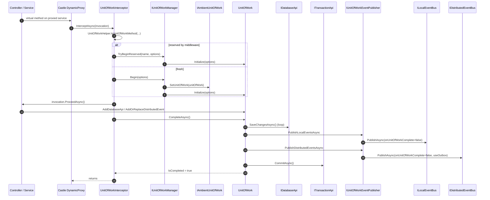

This page traces an ABP **unit of work** (UoW) from the `[UnitOfWork]` attribute (or convention) on an application-service method down through `UnitOfWorkInterceptor`, `IUnitOfWorkManager.Begin` / `Reserve` / `TryBeginReserved`, the `UnitOfWork.CompleteAsync` state machine, and the local + distributed event flush that happens on commit. The **ABP Framework** UoW system is what gives ambient transactions, deferred event publishing, and outbox queuing to every code path that goes through a registered application service.

<Info>
The same UoW class — `UnitOfWork` in `framework/src/Volo.Abp.Uow/Volo/Abp/Uow/UnitOfWork.cs` — drives every transactional boundary in ABP. The two entry points (HTTP `AbpUowActionFilter` and DI `UnitOfWorkInterceptor`) both end up calling `IUnitOfWorkManager.Begin` or `TryBeginReserved`, so once the UoW exists the lifecycle is identical regardless of how you arrived.
</Info>

## 1. Sequence overview



## 2. Triggering: `[UnitOfWork]` attribute & convention

`framework/src/Volo.Abp.Uow/Volo/Abp/Uow/UnitOfWorkAttribute.cs` is the explicit marker. ABP also recognises **conventional** UoW types via `UnitOfWorkHelper.IsUnitOfWorkType` — that is, classes implementing `IUnitOfWorkEnabled` (which `ApplicationService` and `DomainService` both do).

Registration is done at startup by `UnitOfWorkInterceptorRegistrar`:

```csharp
public static void RegisterIfNeeded(IOnServiceRegistredContext context)
{
    if (ShouldIntercept(context.ImplementationType))
    {
        context.Interceptors.TryAdd<UnitOfWorkInterceptor>();
    }
}

private static bool ShouldIntercept(Type type)
{
    return !DynamicProxyIgnoreTypes.Contains(type) &&
           UnitOfWorkHelper.IsUnitOfWorkType(type.GetTypeInfo());
}
```

This hook fires from `AbpServiceConvention` during the conventional-registration pass (covered in *Dependency Injection*). The result is that every `ApplicationService` and every class decorated with `[UnitOfWork]` is registered as a Castle DynamicProxy with `UnitOfWorkInterceptor` attached.

## 3. `UnitOfWorkInterceptor.InterceptAsync`

Source: `framework/src/Volo.Abp.Uow/Volo/Abp/Uow/UnitOfWorkInterceptor.cs`.

```csharp
public override async Task InterceptAsync(IAbpMethodInvocation invocation)
{
    if (!UnitOfWorkHelper.IsUnitOfWorkMethod(invocation.Method, out var unitOfWorkAttribute))
    {
        await invocation.ProceedAsync();
        return;
    }

    using (var scope = _serviceScopeFactory.CreateScope())
    {
        var options = CreateOptions(scope.ServiceProvider, invocation, unitOfWorkAttribute);
        var unitOfWorkManager = scope.ServiceProvider.GetRequiredService<IUnitOfWorkManager>();

        if (unitOfWorkManager.TryBeginReserved(UnitOfWork.UnitOfWorkReservationName, options))
        {
            await invocation.ProceedAsync();
            if (unitOfWorkManager.Current != null) { await unitOfWorkManager.Current.SaveChangesAsync(); }
            return;
        }

        using (var uow = unitOfWorkManager.Begin(options))
        {
            await invocation.ProceedAsync();
            await uow.CompleteAsync();
        }
    }
}
```

Key observations:

1. **Per-call scope** — a new `IServiceScope` is created for **every** intercepted call. This is what isolates per-UoW services like `IUnitOfWork` itself, which is registered as `ITransientDependency` but scoped to that nested scope.
2. **Reservation-first** — if `AbpUnitOfWorkMiddleware` already called `Reserve("_AbpActionUnitOfWork")`, the interceptor wires the options into the **outer** reservation instead of starting a new one; only `SaveChangesAsync` is called, not `CompleteAsync`, because the middleware will commit the outer UoW.
3. **Options resolution** — see §3.1.

### 3.1 `CreateOptions`

```csharp
private AbpUnitOfWorkOptions CreateOptions(IServiceProvider serviceProvider, IAbpMethodInvocation invocation, UnitOfWorkAttribute? unitOfWorkAttribute)
{
    var options = new AbpUnitOfWorkOptions();
    unitOfWorkAttribute?.SetOptions(options);

    if (unitOfWorkAttribute?.IsTransactional == null)
    {
        var defaultOptions = serviceProvider.GetRequiredService<IOptions<AbpUnitOfWorkDefaultOptions>>().Value;
        options.IsTransactional = defaultOptions.CalculateIsTransactional(
            autoValue: serviceProvider.GetRequiredService<IUnitOfWorkTransactionBehaviourProvider>().IsTransactional
                       ?? !invocation.Method.Name.StartsWith("Get", StringComparison.InvariantCultureIgnoreCase)
        );
    }

    return options;
}
```

When `[UnitOfWork]` does not set `IsTransactional` explicitly, ABP falls back to:

1. `IUnitOfWorkTransactionBehaviourProvider.IsTransactional` (for ASP.NET Core requests this is `AspNetCoreUnitOfWorkTransactionBehaviourProvider`, which inspects the HTTP method — `GET` is non-transactional);
2. otherwise the heuristic "method names starting with `Get` are non-transactional".

`AbpUnitOfWorkDefaultOptions.CalculateIsTransactional` (`Volo.Abp.Uow/Volo/Abp/Uow/AbpUnitOfWorkDefaultOptions.cs`) then applies the `TransactionBehavior` (Auto/Enabled/Disabled) configured in the module.

## 4. `IUnitOfWorkManager` — Begin / Reserve / TryBeginReserved

Source: `framework/src/Volo.Abp.Uow/Volo/Abp/Uow/UnitOfWorkManager.cs`.

### 4.1 `Begin`

```csharp
public IUnitOfWork Begin(AbpUnitOfWorkOptions options, bool requiresNew = false)
{
    var currentUow = Current;
    if (currentUow != null && !requiresNew) { return new ChildUnitOfWork(currentUow); }

    var unitOfWork = CreateNewUnitOfWork();
    unitOfWork.Initialize(options);
    return unitOfWork;
}
```

If an ambient UoW already exists and the caller did **not** demand `requiresNew`, a `ChildUnitOfWork` wrapper is returned. The child UoW intercepts `CompleteAsync` and turns it into a no-op (real commit happens when the outer one completes), but it still forwards `SaveChangesAsync` so callers see expected EF behaviour.

### 4.2 `Reserve`

```csharp
public IUnitOfWork Reserve(string reservationName, bool requiresNew = false)
{
    if (!requiresNew && _ambientUnitOfWork.UnitOfWork != null &&
        _ambientUnitOfWork.UnitOfWork.IsReservedFor(reservationName))
    {
        return new ChildUnitOfWork(_ambientUnitOfWork.UnitOfWork);
    }

    var unitOfWork = CreateNewUnitOfWork();
    unitOfWork.Reserve(reservationName);
    return unitOfWork;
}
```

`Reserve` creates a UoW whose `Options` is still `null` — it is "reserved" but not yet initialized. Calling `SaveChangesAsync` or `CompleteAsync` on a reserved-but-uninitialized UoW throws.

### 4.3 `TryBeginReserved`

```csharp
public bool TryBeginReserved(string reservationName, AbpUnitOfWorkOptions options)
{
    var uow = _ambientUnitOfWork.UnitOfWork;
    while (uow != null && !uow.IsReservedFor(reservationName)) { uow = uow.Outer; }
    if (uow == null) { return false; }
    uow.Initialize(options);
    return true;
}
```

Walks the ambient UoW chain and initializes the first one matching the reservation name. The combination of (middleware reserves) + (action filter / interceptor initializes) is what gives ABP the rare guarantee that **all** services touched by a single HTTP request share one transaction *unless* one of them explicitly opted out with `requiresNew`.

### 4.4 `CreateNewUnitOfWork`

```csharp
private IUnitOfWork CreateNewUnitOfWork()
{
    var scope = _serviceScopeFactory.CreateScope();
    try
    {
        var outerUow = _ambientUnitOfWork.UnitOfWork;
        var unitOfWork = scope.ServiceProvider.GetRequiredService<IUnitOfWork>();
        unitOfWork.SetOuter(outerUow);
        _ambientUnitOfWork.SetUnitOfWork(unitOfWork);
        unitOfWork.Disposed += (sender, args) =>
        {
            _ambientUnitOfWork.SetUnitOfWork(outerUow);
            scope.Dispose();
        };
        return unitOfWork;
    }
    catch { scope.Dispose(); throw; }
}
```

The ambient `IAmbientUnitOfWork` is `AsyncLocalCurrentTenantAccessor`-like — backed by `AsyncLocal<T>` so it flows across `await` boundaries.

## 5. `UnitOfWork.CompleteAsync` state machine

Source: `framework/src/Volo.Abp.Uow/Volo/Abp/Uow/UnitOfWork.cs`. The interesting body of `CompleteAsync` is the **event publish loop**:

```csharp
public virtual async Task CompleteAsync(CancellationToken cancellationToken = default)
{
    if (_isRolledback) { return; }
    PreventMultipleComplete();
    try
    {
        _isCompleting = true;
        await SaveChangesAsync(cancellationToken);

        LocalEvents.AddRange(GetEventsRecords(LocalEventWithPredicates));
        LocalEventWithPredicates.Clear();
        DistributedEvents.AddRange(GetEventsRecords(DistributedEventWithPredicates));
        DistributedEventWithPredicates.Clear();

        while (LocalEvents.Any() || DistributedEvents.Any())
        {
            if (LocalEvents.Any())
            {
                var localEventsToBePublished = LocalEvents.OrderBy(e => e.EventOrder).ToArray();
                LocalEvents.Clear();
                await UnitOfWorkEventPublisher.PublishLocalEventsAsync(localEventsToBePublished);
            }

            if (DistributedEvents.Any())
            {
                var distributedEventsToBePublished = DistributedEvents.OrderBy(e => e.EventOrder).ToArray();
                DistributedEvents.Clear();
                await UnitOfWorkEventPublisher.PublishDistributedEventsAsync(distributedEventsToBePublished);
            }

            await SaveChangesAsync(cancellationToken);

            LocalEvents.AddRange(GetEventsRecords(LocalEventWithPredicates));
            DistributedEvents.AddRange(GetEventsRecords(DistributedEventWithPredicates));
            LocalEventWithPredicates.Clear();
            DistributedEventWithPredicates.Clear();
        }

        await CommitTransactionsAsync(cancellationToken);
        IsCompleted = true;
        await OnCompletedAsync();
    }
    catch (Exception ex) { _exception = ex; throw; }
}
```

The loop is critical: handlers of a local event might enqueue **more** events while the UoW is completing, and those new events must also be flushed before the transaction commits. The implementation drains both queues until both are empty, calling `SaveChangesAsync` between rounds so the events see consistent data.

`SaveChangesAsync` walks every registered `IDatabaseApi` and forwards to those implementing `ISupportsSavingChanges`:

```csharp
public virtual async Task SaveChangesAsync(CancellationToken cancellationToken = default)
{
    if (_isRolledback) { return; }
    foreach (var databaseApi in GetAllActiveDatabaseApis())
    {
        if (databaseApi is ISupportsSavingChanges supports)
            await supports.SaveChangesAsync(cancellationToken);
    }
}
```

For EF Core, that translates to `EfCoreDatabaseApi.SaveChangesAsync` which calls `DbContext.SaveChangesAsync`. For MongoDB, the `MongoDbDatabaseApi` saves through the session.

`CommitTransactionsAsync` iterates `_transactionApis.Values` and commits — one per database participating in the UoW.

## 6. Event integration: `UnitOfWorkEventPublisher`

Source: `framework/src/Volo.Abp.EventBus/Volo/Abp/EventBus/UnitOfWorkEventPublisher.cs`.

```csharp
public async Task PublishLocalEventsAsync(IEnumerable<UnitOfWorkEventRecord> localEvents)
{
    foreach (var localEvent in localEvents)
    {
        await _localEventBus.PublishAsync(localEvent.EventType, localEvent.EventData, onUnitOfWorkComplete: false);
    }
}

public async Task PublishDistributedEventsAsync(IEnumerable<UnitOfWorkEventRecord> distributedEvents)
{
    foreach (var distributedEvent in distributedEvents)
    {
        await _distributedEventBus.PublishAsync(
            distributedEvent.EventType,
            distributedEvent.EventData,
            onUnitOfWorkComplete: false,
            useOutbox: distributedEvent.UseOutbox);
    }
}
```

`onUnitOfWorkComplete: false` is critical — if the flag were left true, the event bus would try to re-enqueue back to the same UoW (which is currently in the middle of `CompleteAsync`), causing an infinite loop.

Events arrive into the UoW via `EventBusBase.PublishAsync`:

```csharp
public virtual async Task PublishAsync(Type eventType, object eventData, bool onUnitOfWorkComplete = true)
{
    if (onUnitOfWorkComplete && UnitOfWorkManager.Current != null)
    {
        AddToUnitOfWork(UnitOfWorkManager.Current, new UnitOfWorkEventRecord(eventType, eventData, EventOrderGenerator.GetNext()));
        return;
    }
    await PublishToEventBusAsync(eventType, eventData);
}
```

So inside a UoW, every `IDistributedEventBus.PublishAsync` is **queued** into `UnitOfWork.DistributedEventWithPredicates` and only sent out when `CompleteAsync` succeeds. This is what gives ABP "transactional event publish".

## 7. Rollback path

```csharp
public virtual async Task RollbackAsync(CancellationToken cancellationToken = default)
{
    if (_isRolledback) { return; }
    _isRolledback = true;
    await RollbackAllAsync(cancellationToken);
}
```

`RollbackAllAsync` calls `RollbackAsync` on every `ITransactionApi` that implements `ISupportsRollback`. Pending local and distributed events are **dropped** — they never reach the bus because the queues are only flushed inside `CompleteAsync`.

The `Failed` event is raised by the disposer if `_exception != null`, allowing subscribers to react to failed UoWs.

## 8. Disposal

`UnitOfWork.Dispose()` calls `DisposeTransactions`, fires `Disposed`, and the `IAmbientUnitOfWork` registration installed in `CreateNewUnitOfWork` restores the previous ambient UoW + disposes the per-UoW scope. Importantly, if `CompleteAsync` was never called, the destructor does **not** auto-commit — pending writes are lost. The two filter / middleware integrations make sure either `CompleteAsync` or `RollbackAsync` runs before disposal.

## 9. Step-by-step trace

| # | File | Symbol | Notes |
| --- | --- | --- | --- |
| 1 | `UnitOfWorkInterceptorRegistrar.cs` | `RegisterIfNeeded` | DI-time: attaches interceptor |
| 2 | (Generated proxy) | `MyAppService.CreateAsync` | Castle DynamicProxy invocation |
| 3 | `UnitOfWorkInterceptor.cs` | `InterceptAsync` | Detects `[UnitOfWork]` / `IUnitOfWorkEnabled` |
| 4 | `UnitOfWorkInterceptor.cs` | `CreateOptions` | Resolves `IsTransactional` |
| 5 | `UnitOfWorkManager.cs` | `TryBeginReserved` | Or `Begin` |
| 6 | `UnitOfWorkManager.cs` | `CreateNewUnitOfWork` | Creates scope, resolves `IUnitOfWork` |
| 7 | `UnitOfWork.cs` | `Initialize` | Sets `Options` |
| 8 | `AmbientUnitOfWork.cs` | `SetUnitOfWork` | Pushes onto `AsyncLocal` stack |
| 9 | (User code) | `_repository.InsertAsync(...)` | Triggers `AddDatabaseApi` |
| 10 | (User code) | `_distributedEventBus.PublishAsync(evt)` | Queues into `DistributedEventWithPredicates` |
| 11 | `UnitOfWork.cs` | `CompleteAsync` | Drains events + commits |
| 12 | `UnitOfWork.cs` | `SaveChangesAsync` | Per `IDatabaseApi` SaveChanges |
| 13 | `UnitOfWorkEventPublisher.cs` | `PublishLocalEventsAsync` | Drains `LocalEvents` |
| 14 | `UnitOfWorkEventPublisher.cs` | `PublishDistributedEventsAsync` | Drains `DistributedEvents` (uses outbox if configured) |
| 15 | `UnitOfWork.cs` | `CommitTransactionsAsync` | DB-level commit |
| 16 | `UnitOfWork.cs` | `OnCompletedAsync` | Runs `CompletedHandlers` |
| 17 | `UnitOfWork.cs` | `Dispose` | Restores outer ambient, disposes scope |

## 10. Common gotchas

<Warning>
**Calling `await Task.Yield()` inside a UoW callback** may switch threads in a way that drops the `AsyncLocal<IUnitOfWork>` if you spawn detached tasks with `Task.Run`. `IUnitOfWorkManager.Current` will be `null` inside the spawned task. Use `unitOfWork.OnCompleted(() => ...)` instead of fire-and-forget.
</Warning>

<Warning>
The reservation pattern (`Reserve` + `TryBeginReserved`) is **only** wired in the ASP.NET Core middleware and in the interceptor. If you create a UoW manually with `IUnitOfWorkManager.Begin(...)` from a hosted-service / background-job, you own its full lifecycle — call `CompleteAsync` or `RollbackAsync` explicitly.
</Warning>

## 11. Related pages

- [HTTP Request Lifecycle](/flows/http-request-lifecycle) — the `AbpUnitOfWorkMiddleware` reservation
- [Event Publish and Handle](/flows/event-publish-and-handle) — what happens after `PublishLocalEventsAsync` / `PublishDistributedEventsAsync`
- [Dependency Injection](/core/dependency-injection) — how `UnitOfWorkInterceptor` is attached to your service
- [Dynamic Proxy and Interceptors](/core/dynamic-proxy-and-interceptors) — the Castle DynamicProxy mechanics
- [Background Job Execution](/flows/background-job-execution) — UoW is also wrapped around job execution
