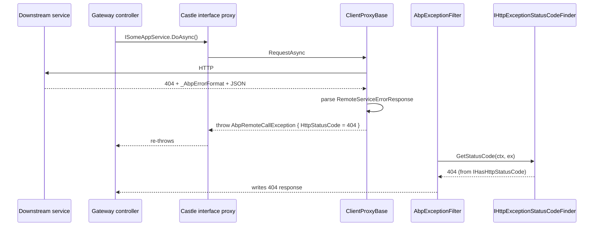

In ABP Framework, `Volo.Abp.Http.Abstractions` is a deliberately tiny package: it carries only the contracts that both server-side ASP.NET Core modules and client-side proxy modules need to share without pulling in transports or controllers. This page walks every file in that project, then follows the references outward to the closely related error types in `Volo.Abp.ExceptionHandling/Volo/Abp/Http/` and the status-code finder in `Volo.Abp.AspNetCore/Volo/Abp/AspNetCore/ExceptionHandling/`, because those types form the wire-level error contract that the entire HTTP family is built around.

## File inventory

There are only three source files in `framework/src/Volo.Abp.Http.Abstractions/Volo/Abp/Http/`. The rest of the project is metadata.

| File | Type | Purpose |
| --- | --- | --- |
| `AbpHttpAbstractionsModule.cs` | `AbpModule` | Empty marker module — present only so consumers can `DependsOn` it. |
| `ClientProxyExceptionEventData.cs` | DTO | Local-event-bus payload published by the dynamic proxy when a request fails. |
| `Modeling/AbpApiDescriptionModelOptions.cs` | options class | Controls which framework interfaces are *excluded* from the generated API description. |

The leanness is intentional. The richer types — `RemoteServiceErrorInfo`, `RemoteServiceErrorResponse`, `AbpRemoteCallException` — live in `framework/src/Volo.Abp.ExceptionHandling/` so that pure exception-handling consumers can depend on them without taking an HTTP dependency, and the HTTP modules pull them transitively through `AbpExceptionHandlingModule`.

## `AbpHttpAbstractionsModule`

The module class is a no-op:

```csharp
// Volo.Abp.Http.Abstractions/Volo/Abp/Http/AbpHttpAbstractionsModule.cs
using Volo.Abp.Modularity;

namespace Volo.Abp.Http;

public class AbpHttpAbstractionsModule : AbpModule
{
}
```

It exists only to give downstream packages a stable `[DependsOn(typeof(AbpHttpAbstractionsModule))]` target. `AbpHttpModule` (one level up) declares this dependency so that when the ABP runtime walks the module graph it always processes the abstractions assembly first.

## `ClientProxyExceptionEventData`

This DTO is the wire-level event published on the local event bus by `ClientProxyBase<TService>` whenever an HTTP call fails. It is intentionally string-shaped (no `Exception` reference) so subscribers in *different* assemblies can react to remote 401s without coupling to the exception type.

```csharp
// Volo.Abp.Http.Abstractions/Volo/Abp/Http/ClientProxyExceptionEventData.cs
namespace Volo.Abp.Http;

public class ClientProxyExceptionEventData
{
    public int? StatusCode { get; set; }
    public string? ReasonPhrase { get; set; }
    public string? Error { get; set; }
    public string? ErrorDescription { get; set; }
    public string? ErrorUri { get; set; }
}
```

The `Error`, `ErrorDescription` and `ErrorUri` strings are parsed out of the `WWW-Authenticate` header by `ClientProxyBase.ThrowExceptionForResponseAsync` — see the regular expressions for `error="..."`, `error_description="..."`, `error_uri="..."` in `Volo.Abp.Http.Client/Volo/Abp/Http/Client/ClientProxying/ClientProxyBase.cs`. A typical subscriber is the silent re-login handler in the Blazor host, which listens for `StatusCode == 401` and triggers a token refresh.

<Tip>
Because `ClientProxyExceptionEventData` is published on `ILocalEventBus` (not the distributed bus), only handlers inside the same process receive it. This is the right scope — the event is about *one* outbound HTTP call.
</Tip>

## `AbpApiDescriptionModelOptions`

The third file controls which framework interfaces never appear in the generated API description model. It is consumed on the server side by the description-model providers and on the client side by the description-cache lookup.

```csharp
// Volo.Abp.Http.Abstractions/Volo/Abp/Http/Modeling/AbpApiDescriptionModelOptions.cs
public class AbpApiDescriptionModelOptions
{
    public HashSet<Type> IgnoredInterfaces { get; }

    public AbpApiDescriptionModelOptions()
    {
        IgnoredInterfaces = new HashSet<Type>
        {
            typeof(ITransientDependency),
            typeof(ISingletonDependency),
            typeof(IDisposable),
            typeof(IAvoidDuplicateCrossCuttingConcerns)
        };
    }
}
```

This stops base-class housekeeping interfaces from polluting the description JSON returned by the `/api/abp/api-definition` endpoint. Adding your own marker interface to `IgnoredInterfaces` from your host module's `ConfigureServices` is the supported escape hatch.

## The error shape — `RemoteServiceErrorInfo`

Although `RemoteServiceErrorInfo` does not live in the abstractions project, it is the canonical wire-level error format that every ABP HTTP module emits and parses. It is in `framework/src/Volo.Abp.ExceptionHandling/Volo/Abp/Http/RemoteServiceErrorInfo.cs`:

```csharp
[Serializable]
public class RemoteServiceErrorInfo
{
    public string? Code { get; set; }
    public string? Message { get; set; }
    public string? Details { get; set; }
    public IDictionary? Data { get; set; }
    public RemoteServiceValidationErrorInfo[]? ValidationErrors { get; set; }

    public RemoteServiceErrorInfo() { }

    public RemoteServiceErrorInfo(string message, string? details = null,
        string? code = null, IDictionary? data = null)
    {
        Message = message;
        Details = details;
        Code = code;
        Data = data;
    }
}
```

A companion class wraps it in the JSON envelope:

```csharp
// Volo.Abp.ExceptionHandling/Volo/Abp/Http/RemoteServiceErrorResponse.cs
public class RemoteServiceErrorResponse
{
    public RemoteServiceErrorInfo Error { get; set; }
    public RemoteServiceErrorResponse(RemoteServiceErrorInfo error) { Error = error; }
}
```

So an ABP error body always looks like:

```json
{
  "error": {
    "code": "Volo.Identity:010001",
    "message": "Email already exists.",
    "details": "...",
    "data": { "Email": "test@x.com" },
    "validationErrors": null
  }
}
```

## Detecting an ABP error body

How does the client know whether to deserialize the body as `RemoteServiceErrorResponse` or treat it as opaque text? The contract is a single header constant defined in `Volo.Abp.Http/Volo/Abp/Http/AbpHttpConsts.cs`:

```csharp
public static class AbpHttpConsts
{
    public const string AbpErrorFormat   = "_AbpErrorFormat";
    public const string AbpTenantResolveError = "Abp-Tenant-Resolve-Error";
}
```

The server adds an `_AbpErrorFormat` header to error responses; the client (in `ClientProxyBase.ThrowExceptionForResponseAsync`) checks for it:

```csharp
if (response.Headers.Contains(AbpHttpConsts.AbpErrorFormat))
{
    errorResponse = JsonSerializer.Deserialize<RemoteServiceErrorResponse>(...);
    throw new AbpRemoteCallException(errorResponse.Error) { HttpStatusCode = (int)response.StatusCode };
}
```

Absent the header, the client falls back to constructing a minimal `RemoteServiceErrorInfo` from `response.ReasonPhrase`. This means **any** non-ABP server (a CDN error page, a reverse-proxy timeout) still produces a typed `AbpRemoteCallException`, just with less detail.

## `AbpRemoteCallException`

The strongly-typed exception thrown by the client proxy lives at `framework/src/Volo.Abp.ExceptionHandling/Volo/Abp/Http/Client/AbpRemoteCallException.cs`:

```csharp
public class AbpRemoteCallException
    : AbpException, IHasErrorCode, IHasErrorDetails, IHasHttpStatusCode
{
    public int HttpStatusCode { get; set; }
    public string? Code => Error?.Code;
    public string? Details => Error?.Details;
    public RemoteServiceErrorInfo? Error { get; set; }

    public AbpRemoteCallException(RemoteServiceErrorInfo error, Exception? innerException = null)
        : base(error.Message, innerException)
    {
        Error = error;
        if (error.Data != null)
        {
            foreach (var dataKey in error.Data.Keys)
            {
                Data[dataKey] = error.Data[dataKey];
            }
        }
    }
}
```

Three things to notice:

1. It implements `IHasHttpStatusCode`, so the *same* status code can be re-thrown by another tier of microservices (the second-hop server) and the inner-most response code is preserved.
2. It copies `error.Data` entries into the `Exception.Data` dictionary so log enrichment middleware can pick them up.
3. The `Code` and `Details` properties delegate to `Error?` — the exception is null-safe even when constructed without an info object.

## `IHttpExceptionStatusCodeFinder`

The mirror image on the server side is `IHttpExceptionStatusCodeFinder`, declared in `framework/src/Volo.Abp.AspNetCore/Volo/Abp/AspNetCore/ExceptionHandling/IHttpExceptionStatusCodeFinder.cs`:

```csharp
public interface IHttpExceptionStatusCodeFinder
{
    HttpStatusCode GetStatusCode(HttpContext httpContext, Exception exception);
}
```

Its default implementation `DefaultHttpExceptionStatusCodeFinder` is what turns a thrown `AbpAuthorizationException`, `AbpValidationException`, `EntityNotFoundException` or `IBusinessException` into the matching HTTP status code on the way out. The mapping table is:

| Exception type / interface | HTTP status |
| --- | --- |
| `IHasHttpStatusCode` with `HttpStatusCode > 0` | uses that value |
| `IHasErrorCode` mapped via `AbpExceptionHttpStatusCodeOptions.ErrorCodeToHttpStatusCodeMappings` | mapped value |
| `AbpAuthorizationException` (authenticated user) | `403 Forbidden` |
| `AbpAuthorizationException` (anonymous) | `401 Unauthorized` |
| `AbpValidationException` | `400 BadRequest` |
| `EntityNotFoundException` | `404 NotFound` |
| `AbpDbConcurrencyException` | `409 Conflict` |
| `NotImplementedException` | `501 NotImplemented` |
| `IBusinessException` | `403 Forbidden` |
| anything else | `500 InternalServerError` |

Because `AbpRemoteCallException` implements both `IHasHttpStatusCode` and `IHasErrorCode`, an exception that bubbled up from a downstream microservice keeps its original status when re-thrown by the gateway. The code path goes:



## The HTTP-method convention table

`HttpMethodHelper` in `framework/src/Volo.Abp.Http/Volo/Abp/Http/HttpMethodHelper.cs` is technically in the non-abstractions assembly, but it expresses a contract that the abstractions imply — namely the prefix→verb mapping used to derive REST verbs from C# method names. The full table:

| HTTP verb | Method-name prefixes |
| --- | --- |
| `GET` | `GetList`, `GetAll`, `Get` |
| `PUT` | `Put`, `Update` |
| `DELETE` | `Delete`, `Remove` |
| `POST` | `Create`, `Add`, `Insert`, `Post` |
| `PATCH` | `Patch` |
| *default* | `POST` |

The relevant code:

```csharp
public static string GetConventionalVerbForMethodName(string methodName)
{
    foreach (var conventionalPrefix in ConventionalPrefixes)
    {
        if (conventionalPrefix.Value.Any(p =>
                methodName.StartsWith(p, StringComparison.OrdinalIgnoreCase)))
        {
            return conventionalPrefix.Key;
        }
    }
    return DefaultHttpVerb; // "POST"
}
```

Both the server-side `ApplicationApiDescriptionModelProvider` and the client-side `ApiDescriptionFinder` rely on this so a method named `GetListAsync` is GET, `CreateAsync` is POST, and a freshly-named `DoSomethingAsync` falls through to POST.

## Where these contracts are consumed

| Type | Server-side consumer | Client-side consumer |
| --- | --- | --- |
| `ClientProxyExceptionEventData` | — | `ClientProxyBase.ThrowExceptionForResponseAsync` publishes it |
| `RemoteServiceErrorInfo` | `AbpExceptionFilter` writes it on the response | `ClientProxyBase.ThrowExceptionForResponseAsync` parses it |
| `RemoteServiceErrorResponse` | same | same |
| `AbpRemoteCallException` | re-caught by upstream `AbpExceptionFilter`, status preserved | thrown by `ClientProxyBase` |
| `IHttpExceptionStatusCodeFinder` | `AbpExceptionHandlingMiddleware`, `AbpExceptionFilter` | — |
| `AbpApiDescriptionModelOptions.IgnoredInterfaces` | `ApplicationApiDescriptionModelProvider` | `ApiDescriptionFinder` (transitive) |

## Why abstractions are small

ABP keeps `Volo.Abp.Http.Abstractions` deliberately thin so that:

- A controller-free library (a class library shipping integration-event handlers, say) can depend on `AbpHttpAbstractionsModule` without pulling in `Microsoft.AspNetCore.Mvc` or `IHttpClientFactory`.
- A tool like `abp generate-proxy` can reference just the abstractions to know which interfaces to skip via `IgnoredInterfaces`.
- The error contract (`RemoteServiceErrorInfo`) is reachable through `AbpExceptionHandlingModule` instead, which is a *required* dependency for any ABP host anyway — so no extra surface area is needed at the HTTP layer.

The result is that the abstractions assembly compiles to fewer than two kilobytes of IL but anchors a contract that all the rest of the HTTP family — server filters, client proxies, IdentityModel, Dapr — agrees on.

## Related pages

<CardGroup cols={2}>
  <Card title="HTTP Overview" icon="map" href="/http/overview">
    Package map and dependency graph.
  </Card>
  <Card title="HTTP Client" icon="bolt" href="/http/http-client">
    How `ClientProxyBase.ThrowExceptionForResponseAsync` uses these contracts.
  </Card>
  <Card title="ASP.NET Core MVC" icon="server" href="/aspnetcore/mvc">
    `AbpExceptionFilter` and the server side of the error contract.
  </Card>
  <Card title="Exception Handling" icon="triangle-exclamation" href="/core/exception-handling">
    Where `RemoteServiceErrorInfo` and `AbpRemoteCallException` are defined.
  </Card>
</CardGroup>
