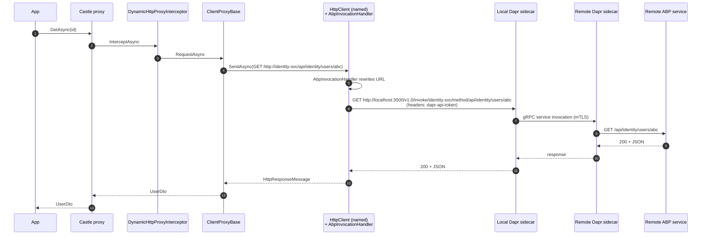
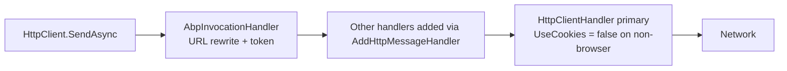

The ABP Framework `Volo.Abp.Http.Client.Dapr` package is a 60-line bridge that lets the dynamic HTTP client proxy travel through a Dapr sidecar instead of speaking directly to a remote URL. By inserting a single `DelegatingHandler` into every named `HttpClient` the proxy uses, the package converts an outgoing request like `GET https://identity.svc/api/identity/users/{id}` into a sidecar-mediated call such as `GET http://localhost:3500/v1.0/invoke/identity-svc/method/api/identity/users/{id}`, complete with the Dapr API token. This page walks the two source files, the module wiring, the underlying Dapr `InvocationHandler` it extends, and the configuration surface in `AbpDaprOptions`.

## Files in the package

| File | Role |
| --- | --- |
| `Volo/Abp/Http/Client/Dapr/AbpHttpClientDaprModule.cs` | Module — registers the handler with every proxy `HttpClient`. |
| `Volo/Abp/Http/Client/Dapr/AbpInvocationHandler.cs` | The `DelegatingHandler`. Inherits from `Dapr.Client.InvocationHandler`. |

That is the entire package. All the heavy lifting — the actual URL rewriting, the `dapr-api-token` header injection, the gRPC vs HTTP endpoint selection — comes from the Dapr SDK's `InvocationHandler`. ABP's contribution is the integration into the existing proxy machinery.

## The module

```csharp
// AbpHttpClientDaprModule.cs
[DependsOn(
    typeof(AbpHttpClientModule),
    typeof(AbpDaprModule)
)]
public class AbpHttpClientDaprModule : AbpModule
{
    public override void PreConfigureServices(ServiceConfigurationContext context)
    {
        PreConfigure<AbpHttpClientBuilderOptions>(options =>
        {
            options.ProxyClientBuildActions.Add((_, clientBuilder) =>
            {
                clientBuilder.AddHttpMessageHandler<AbpInvocationHandler>();
            });
        });
    }
}
```

Three details:

1. The configuration runs in `PreConfigureServices`. That phase fires *before* `AbpHttpClientModule.ConfigureServices`, so when `AddHttpClientProxy(type)` eventually calls `AddHttpClientFactory(...)` and replays the `ProxyClientBuildActions` for each remote-service name, the Dapr handler is already in the list.
2. The closure ignores the first argument (the remote-service name). So **every** named proxy client gets the Dapr handler — there is no per-name opt-out at the module level. If you need partial Dapr coverage you have to register the handler manually for the names you want.
3. `AddHttpMessageHandler<AbpInvocationHandler>()` is the standard `IHttpClientBuilder` extension. The handler is resolved through DI per request (it's `ITransientDependency`), so its `IOptions<AbpDaprOptions>` snapshot is current.

## The handler

```csharp
// AbpInvocationHandler.cs
public class AbpInvocationHandler : InvocationHandler, ITransientDependency
{
    public AbpInvocationHandler(IOptions<AbpDaprOptions> daprOptions)
    {
        if (!daprOptions.Value.HttpEndpoint.IsNullOrWhiteSpace())
        {
            DaprEndpoint = daprOptions.Value.HttpEndpoint!;
        }
    }
}
```

This is the whole file. The base class `Dapr.Client.InvocationHandler` does the URL surgery — it takes a request whose `RequestUri.Authority` is the *Dapr application ID* (rather than a real hostname) and rewrites the URL to point at the local sidecar's HTTP listener. ABP's subclass simply overrides `DaprEndpoint` if the consumer explicitly configured one (otherwise the SDK auto-discovers from the `DAPR_HTTP_PORT` environment variable populated by `dapr run`).

### What the base `InvocationHandler` does

For a request `GET http://identity-svc/api/identity/users/abc`, the SDK handler:

1. Captures `identity-svc` as the **Dapr app ID**.
2. Rewrites the URI to `http://localhost:3500/v1.0/invoke/identity-svc/method/api/identity/users/abc`.
3. Adds the `dapr-api-token` header if `DAPR_API_TOKEN` is set (which `AbpDaprModule` populates from environment or configuration — see below).

Once the rewritten request reaches the sidecar, Dapr handles service discovery, mTLS between sidecars, retries, traces, etc. The ABP application is unaware: it still sees the same `HttpResponseMessage`.

## How `AbpDaprOptions` is populated

The Dapr module itself does substantial work to wire up the configuration so that the handler has the values it needs:

```csharp
// Volo.Abp.Dapr/Volo/Abp/Dapr/AbpDaprOptions.cs
public class AbpDaprOptions
{
    public string? HttpEndpoint { get; set; }
    public string? GrpcEndpoint { get; set; }
    public string? DaprApiToken { get; set; }
    public string? AppApiToken  { get; set; }
}
```

`AbpDaprModule.ConfigureServices`:

```csharp
Configure<AbpDaprOptions>(configuration.GetSection("Dapr"));
Configure<AbpDaprOptions>(options =>
{
    if (options.DaprApiToken.IsNullOrWhiteSpace())
    {
        var confEnv = configuration["DAPR_API_TOKEN"];
        if (!confEnv.IsNullOrWhiteSpace()) options.DaprApiToken = confEnv!;
        else
        {
            var env = Environment.GetEnvironmentVariable("DAPR_API_TOKEN");
            if (!env.IsNullOrWhiteSpace()) options.DaprApiToken = env!;
        }
    }
    // same fallback chain for AppApiToken
});
```

So the lookup order for the Dapr API token is:

| Order | Source |
| --- | --- |
| 1 | `appsettings.json` → `Dapr:DaprApiToken` |
| 2 | `appsettings.json` (top-level) → `DAPR_API_TOKEN` |
| 3 | environment variable → `DAPR_API_TOKEN` |

The same order applies for the app API token, used to authenticate sidecar-to-app calls in the opposite direction.

## Configuring base URLs as Dapr app IDs

For the handler to work, the `RemoteServiceConfiguration.BaseUrl` values in `appsettings.json` must use the Dapr app ID as the hostname:

```json
{
  "RemoteServices": {
    "Default": {
      "BaseUrl": "http://identity-svc/",
      "IdentityClient": "Default",
      "UseCurrentAccessToken": "true"
    },
    "Billing": {
      "BaseUrl": "http://billing-svc/"
    }
  },
  "Dapr": {
    "HttpEndpoint": "http://localhost:3500"
  }
}
```

Here `identity-svc` and `billing-svc` are Dapr app IDs registered on the mesh — they are *not* DNS-resolvable hostnames. The Dapr sidecar performs name resolution. This is the central point of the integration: by going through the sidecar, the application code (and `ClientProxyBase`) need *zero* knowledge of mTLS, service discovery, retries, or circuit breakers.

## Request flow with Dapr



## The handler pipeline

ASP.NET Core's `HttpClientFactory` arranges delegating handlers in a chain. With the Dapr module loaded, the chain for a proxy `HttpClient` looks like:



If you add more handlers (e.g. a custom telemetry handler), they go *between* the Dapr handler and the primary handler, since `AbpHttpClientDaprModule.PreConfigureServices` runs first.

## When NOT to use this package

Because the registration is unconditional, this module is the wrong choice for hosts that talk to a mix of Dapr-managed and non-Dapr endpoints. For mixed workloads you have two options:

<CardGroup cols={2}>
  <Card title="Manual per-name registration" icon="wrench">
    Don't depend on `AbpHttpClientDaprModule`. Instead, in your own module's `PreConfigureServices`, add to `AbpHttpClientBuilderOptions.ProxyClientBuildActions` a closure that inspects the remote-service name and only calls `AddHttpMessageHandler<AbpInvocationHandler>()` for the names you want over Dapr.
  </Card>
  <Card title="Multiple consumer hosts" icon="server">
    Split the consumer into two processes — one for Dapr-routed services, one for direct HTTP. Each loads only the modules it needs. This costs more deployment overhead but keeps the configuration simple.
  </Card>
</CardGroup>

## Verifying it's working

Three quick checks confirm the integration is live:

1. Resolve `IRemoteServiceConfigurationProvider` and call `GetConfigurationOrDefaultAsync("Default")` — `BaseUrl` should be the Dapr app ID URL.
2. Resolve `IOptions<AbpHttpClientBuilderOptions>` and inspect `ProxyClientBuildActions.Count` — it should be at least 1 (the Dapr action).
3. Hit any endpoint and check the request headers reaching your downstream service — there should be a `Dapr-Caller-App-Id` header populated by the sidecar.

In the absence of a running sidecar, the rewritten URL `http://localhost:3500/...` will fail with a connection-refused error. The `AbpRemoteCallException` thrown by `ClientProxyBase.ThrowExceptionForResponseAsync` will carry this as its `InnerException`.

## Configuration matrix

| Setting | Source | Required | Effect |
| --- | --- | --- | --- |
| `Dapr:HttpEndpoint` | `appsettings.json` | No (auto from `DAPR_HTTP_PORT`) | Overrides `InvocationHandler.DaprEndpoint`. |
| `Dapr:GrpcEndpoint` | `appsettings.json` | No | Used by the Dapr `DaprClient` registered in `AbpDaprModule`, not by the HTTP handler. |
| `Dapr:DaprApiToken` | json / env | Sidecar token enforcement enabled | Sent as `dapr-api-token` to the sidecar. |
| `Dapr:AppApiToken` | json / env | App enforces sidecar identity | Validated by your app's `app-token` validation if enabled. |
| `RemoteServices:X:BaseUrl` | `appsettings.json` | Yes | Host part = Dapr app ID. |

## How this differs from manual `DaprClient` usage

The Dapr SDK also offers `DaprClient.InvokeMethodAsync<TRequest, TResponse>(...)`. That API requires you to know the wire shape (URLs, verbs, types) and writes them out for each call. The ABP integration is strictly better when the downstream is an ABP application service:

| Aspect | `DaprClient.InvokeMethodAsync` | ABP dynamic proxy + Dapr |
| --- | --- | --- |
| Method discovery | Manual; the caller writes URLs | Automatic from `/api/abp/api-definition` |
| Argument binding | Manual JSON | `ClientProxyRequestPayloadBuilder` handles path / query / form / body |
| Multi-tenancy header | Manual | `ICurrentTenant` flows into `__tenant` automatically |
| Correlation IDs | Manual | `ICorrelationIdProvider` flows automatically |
| Bearer token | Manual | IdentityModel chain (see [`/http/http-client-identitymodel`](/http/http-client-identitymodel)) |
| Error shape | Manual JSON parse | `AbpRemoteCallException` with `RemoteServiceErrorInfo` |

The trade-off is that you now *must* be talking to an ABP application service. For non-ABP Dapr targets the SDK's lower-level API remains the right tool.

## A complete consumer module

```csharp
[DependsOn(
    typeof(AbpHttpClientDaprModule),
    typeof(AbpHttpClientIdentityModelWebModule),
    typeof(MyContractsModule)
)]
public class MyDaprConsumerModule : AbpModule
{
    public override void ConfigureServices(ServiceConfigurationContext context)
    {
        var configuration = context.Services.GetConfiguration();

        Configure<AbpRemoteServiceOptions>(opt =>
        {
            opt.RemoteServices.Default = new RemoteServiceConfiguration(
                baseUrl: "http://identity-svc/");
        });

        context.Services.AddHttpClientProxies(
            typeof(MyContractsModule).Assembly,
            RemoteServiceConfigurationDictionary.DefaultName);
    }
}
```

After this, an injected `IUserAppService` reaches `identity-svc` over the Dapr sidecar with bearer-token auth forwarded from the current MVC HttpContext.

## Interaction with multi-tenancy

The Dapr handler runs *after* `RemoteServiceConfigurationProvider` has already produced a URL — so multi-tenant placeholders in `BaseUrl` (see [`/http/remote-services`](/http/remote-services)) are resolved before the handler ever sees the request. The substitution result becomes the URI authority that Dapr uses as the app ID. In practice this means a template like `http://{{tenantId}}.identity-svc/` would yield app IDs such as `http://abc-123.identity-svc/`, which Dapr will *not* resolve because the app ID has additional segments. The supported pattern is to keep tenant routing in HTTP headers (the framework's `__tenant` header is added automatically by `ClientProxyBase.AddHeaders`) and to use a single Dapr app ID per microservice. The downstream service then dispatches per tenant internally.

## Interaction with the authenticator chain

`IRemoteServiceHttpClientAuthenticator.Authenticate` runs *before* the delegating-handler chain — `ClientProxyBase` calls it explicitly on the original `HttpRequestMessage` before the `SendAsync` invocation. The Dapr handler then rewrites the URI but leaves the `Authorization` header untouched, so the bearer token added by the IdentityModel-Web/WebAssembly/MauiBlazor authenticator flows through unchanged. Conversely, if you switch the Dapr app to require its *own* token (the `dapr-api-token`), that header is added by the base `InvocationHandler` and lives alongside the OAuth `Authorization` header — two tokens for two distinct trust boundaries.

## Health and diagnostics

A common operational concern is detecting when the sidecar is unavailable. Two signals are useful:

| Signal | Meaning |
| --- | --- |
| `HttpRequestException` wrapped in `AbpRemoteCallException` with `HttpStatusCode == 0` | The sidecar isn't running on `HttpEndpoint`. |
| `503 Service Unavailable` from sidecar with `dapr-error-code: ERR_DIRECT_INVOKE` | The target app ID is registered but no instances are healthy. |
| `404 Not Found` from sidecar | The target app ID doesn't exist on the Dapr control plane. |

All three end up as `AbpRemoteCallException` with the appropriate `HttpStatusCode`, and the `ClientProxyExceptionEventData` published on the local event bus carries the matching `StatusCode`. A simple `ILocalEventHandler<ClientProxyExceptionEventData>` registered in the application module can therefore detect and emit health metrics with zero touching of the Dapr SDK.

## Cross-references

<CardGroup cols={2}>
  <Card title="HTTP Client" icon="bolt" href="/http/http-client">
    `AbpHttpClientBuilderOptions.ProxyClientBuildActions` and the registration pipeline.
  </Card>
  <Card title="IdentityModel Client" icon="key" href="/http/http-client-identitymodel">
    Bearer-token chain that runs *before* the Dapr handler in the pipeline.
  </Card>
  <Card title="Remote Services" icon="globe" href="/http/remote-services">
    `RemoteServiceConfiguration.BaseUrl` semantics — what value to put there.
  </Card>
  <Card title="HTTP Overview" icon="map" href="/http/overview">
    Where Dapr fits in the package family.
  </Card>
</CardGroup>
