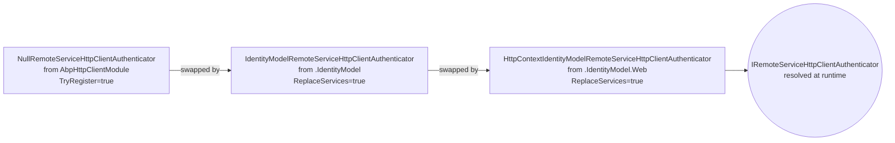
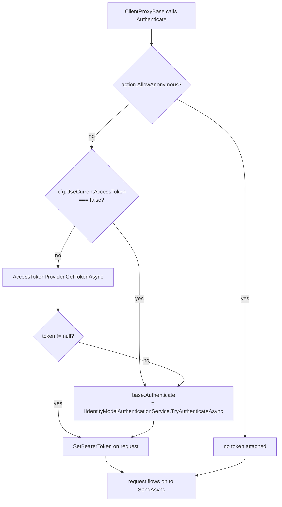

The ABP Framework `Volo.Abp.Http.Client.IdentityModel` family of packages plugs Duende IdentityModel (formerly `IdentityModel.OidcClient`) into the dynamic-HTTP-client pipeline so that outbound proxy calls carry an OAuth2 Bearer token. The base package handles the headless client-credentials case; three siblings — `.Web`, `.WebAssembly`, and `.MauiBlazor` — each adapt the base authenticator to a different UI stack's notion of "the current user's access token". This page walks every file in those four projects, the `RemoteServiceConfiguration` extension methods that drive their behaviour, and how the `[Dependency(ReplaceServices = true)]` chain selects the right authenticator at runtime.

## Package family

| Project | Module | Authenticator | Token source |
| --- | --- | --- | --- |
| `Volo.Abp.Http.Client.IdentityModel` | `AbpHttpClientIdentityModelModule` | `IdentityModelRemoteServiceHttpClientAuthenticator` | Client-credentials flow via `IIdentityModelAuthenticationService` |
| `Volo.Abp.Http.Client.IdentityModel.Web` | `AbpHttpClientIdentityModelWebModule` | `HttpContextIdentityModelRemoteServiceHttpClientAuthenticator` | `HttpContext.GetTokenAsync("access_token")` first, then client-credentials |
| `Volo.Abp.Http.Client.IdentityModel.WebAssembly` | `AbpHttpClientIdentityModelWebAssemblyModule` | `AccessTokenProviderIdentityModelRemoteServiceHttpClientAuthenticator` | Blazor WASM `IAccessTokenProvider`, then client-credentials |
| `Volo.Abp.Http.Client.IdentityModel.MauiBlazor` | `AbpHttpClientIdentityModelMauiBlazorModule` | `MauiBlazorIdentityModelRemoteServiceHttpClientAuthenticator` | Stub `MauiBlazorAbpAccessTokenProvider` (returns `null`), then client-credentials |

Each "...Web…" authenticator inherits from the base `IdentityModelRemoteServiceHttpClientAuthenticator`, so the *fallback* always remains a confidential-client token request when no user-scoped token is available.

## The base module

```csharp
// Volo.Abp.Http.Client.IdentityModel/Volo/Abp/Http/Client/IdentityModel/
// AbpHttpClientIdentityModelModule.cs
[DependsOn(
    typeof(AbpHttpClientModule),
    typeof(AbpIdentityModelModule)
)]
public class AbpHttpClientIdentityModelModule : AbpModule { }
```

It only declares the dependency — the work is done by the authenticator class registered via attribute. See [`/security/identity-model-token-client`](/security/identity-model-token-client) for the inner workings of `AbpIdentityModelModule`, `IIdentityModelAuthenticationService`, and the `IdentityClients` configuration shape.

## The base authenticator

```csharp
// Volo.Abp.Http.Client.IdentityModel/Volo/Abp/Http/Client/IdentityModel/
// IdentityModelRemoteServiceHttpClientAuthenticator.cs
[Dependency(ReplaceServices = true)]
public class IdentityModelRemoteServiceHttpClientAuthenticator
    : IRemoteServiceHttpClientAuthenticator, ITransientDependency
{
    protected IIdentityModelAuthenticationService IdentityModelAuthenticationService { get; }

    public IdentityModelRemoteServiceHttpClientAuthenticator(
        IIdentityModelAuthenticationService identityModelAuthenticationService)
    {
        IdentityModelAuthenticationService = identityModelAuthenticationService;
    }

    public virtual async Task Authenticate(RemoteServiceHttpClientAuthenticateContext context)
    {
        await IdentityModelAuthenticationService.TryAuthenticateAsync(
            context.Client,
            context.RemoteService.GetIdentityClient() ?? context.RemoteServiceName
        );
    }
}
```

Two pieces of behaviour to notice:

1. `[Dependency(ReplaceServices = true)]` tells the ABP DI conventions to *replace* the previously registered `IRemoteServiceHttpClientAuthenticator`. The default is `NullRemoteServiceHttpClientAuthenticator` (registered in the base HTTP-client module with `[Dependency(TryRegister = true)]`); loading the IdentityModel module swaps in this one.
2. The IdentityModel "client" name resolution falls back from `context.RemoteService.GetIdentityClient()` to `context.RemoteServiceName`. So if your `RemoteServices:Default` configuration sets `IdentityClient = "Default"`, that wins; otherwise the remote service's own name is used as the IdentityModel client key.

## `RemoteServiceConfigurationExtensions`

This file is the bridge between the loose key/value `RemoteServiceConfiguration` dictionary and the IdentityModel-specific properties:

```csharp
// Volo.Abp.Http.Client.IdentityModel/Volo/Abp/Http/Client/
// RemoteServiceConfigurationExtensions.cs
public static class RemoteServiceConfigurationExtensions
{
    public const string IdentityClientName       = "IdentityClient";
    public const string UseCurrentAccessTokenName = "UseCurrentAccessToken";

    public static string? GetIdentityClient(this RemoteServiceConfiguration configuration)
        => configuration.GetOrDefault(IdentityClientName);

    public static RemoteServiceConfiguration SetIdentityClient(
        this RemoteServiceConfiguration configuration, string value)
    {
        configuration[IdentityClientName] = value;
        return configuration;
    }

    public static bool? GetUseCurrentAccessToken(this RemoteServiceConfiguration configuration)
    {
        var value = configuration.GetOrDefault(UseCurrentAccessTokenName);
        return value == null ? null : bool.Parse(value);
    }

    public static RemoteServiceConfiguration SetUseCurrentAccessToken(
        this RemoteServiceConfiguration configuration, bool? value)
    {
        if (value == null) configuration.Remove(UseCurrentAccessTokenName);
        else configuration[UseCurrentAccessTokenName] = value.Value.ToString().ToLowerInvariant();
        return configuration;
    }
}
```

The two extension methods expose two flags via JSON keys:

| `appsettings.json` key | Meaning |
| --- | --- |
| `IdentityClient` | Name of the `IdentityClients` entry to use for client-credentials. If omitted, the *remote-service name* is used. |
| `UseCurrentAccessToken` | If `"true"` (the default in Web/WebAssembly/MauiBlazor variants), the current user's token is forwarded; if `"false"`, the variant always falls back to client-credentials. |

A common configuration:

```json
{
  "RemoteServices": {
    "Default": {
      "BaseUrl": "https://api.mycompany.com/",
      "IdentityClient": "Default",
      "UseCurrentAccessToken": "true"
    },
    "BackgroundJobs": {
      "BaseUrl": "https://jobs.mycompany.com/",
      "IdentityClient": "BackgroundClient",
      "UseCurrentAccessToken": "false"
    }
  }
}
```

`BackgroundJobs` always uses client-credentials — useful for fire-and-forget calls executed by a hosted service where there is no current user.

## `IAbpAccessTokenProvider`

The three variants share a common abstraction:

```csharp
// Volo.Abp.Http.Client/Volo/Abp/Http/Client/Authentication/IAbpAccessTokenProvider.cs
public interface IAbpAccessTokenProvider
{
    Task<string?> GetTokenAsync();
}
```

The base `Volo.Abp.Http.Client` package registers `NullAbpAccessTokenProvider` (returns `null`); each UI-stack variant replaces it with its own implementation. Authenticators inject `IAbpAccessTokenProvider`, call `GetTokenAsync()`, and either forward the returned token or fall back to the client-credentials path.

## The Web variant

`framework/src/Volo.Abp.Http.Client.IdentityModel.Web/` ships two replacements:

### Token provider

```csharp
// HttpContextAbpAccessTokenProvider.cs
[Dependency(ReplaceServices = true)]
public class HttpContextAbpAccessTokenProvider : IAbpAccessTokenProvider, ITransientDependency
{
    protected IHttpContextAccessor HttpContextAccessor { get; }

    public HttpContextAbpAccessTokenProvider(IHttpContextAccessor httpContextAccessor)
        => HttpContextAccessor = httpContextAccessor;

    public virtual async Task<string?> GetTokenAsync()
    {
        var httpContext = HttpContextAccessor?.HttpContext;
        if (httpContext == null) return null;

        if (!httpContext.RequestServices.GetRequiredService<ICurrentUser>().IsAuthenticated)
            return null;

        return await httpContext.GetTokenAsync("access_token");
    }
}
```

This relies on the MVC OpenID Connect handler having stored the access token in the authentication ticket via `SaveTokens = true`. The `GetTokenAsync("access_token")` call comes from `Microsoft.AspNetCore.Authentication.AuthenticationHttpContextExtensions`.

### Authenticator

```csharp
// HttpContextIdentityModelRemoteServiceHttpClientAuthenticator.cs
[Dependency(ReplaceServices = true)]
public class HttpContextIdentityModelRemoteServiceHttpClientAuthenticator
    : IdentityModelRemoteServiceHttpClientAuthenticator
{
    protected IAbpAccessTokenProvider AccessTokenProvider { get; }

    public override async Task Authenticate(RemoteServiceHttpClientAuthenticateContext context)
    {
        if (context.RemoteService.GetUseCurrentAccessToken() != false)
        {
            var accessToken = await AccessTokenProvider.GetTokenAsync();
            if (accessToken != null)
            {
                context.Request.SetBearerToken(accessToken);
                return;
            }
        }
        await base.Authenticate(context);
    }
}
```

The boolean test is `!= false` — so the default (null/unset) is treated as "yes, forward the user's token". Setting `"UseCurrentAccessToken": "false"` in the configuration is what forces the client-credentials path.

The `SetBearerToken` extension comes from `Duende.IdentityModel.Client` and writes `Authorization: Bearer {token}`.

### The web module

```csharp
[DependsOn(typeof(AbpHttpClientIdentityModelModule))]
public class AbpHttpClientIdentityModelWebModule : AbpModule
{
    public override void ConfigureServices(ServiceConfigurationContext context)
    {
        context.Services.AddHttpContextAccessor();
    }
}
```

The only non-trivial work is calling `AddHttpContextAccessor()`. ASP.NET Core's `HttpContextAccessor` is opt-in for performance reasons; the IdentityModel-Web module forces it on because the token provider above cannot function without it.

## The WebAssembly variant

WebAssembly is special because Blazor handles OAuth internally via `IAccessTokenProvider` from `Microsoft.AspNetCore.Components.WebAssembly.Authentication`.

### Token provider

```csharp
// WebAssemblyAbpAccessTokenProvider.cs
[Dependency(ReplaceServices = true)]
public class WebAssemblyAbpAccessTokenProvider : IAbpAccessTokenProvider, ITransientDependency
{
    protected IAccessTokenProvider? AccessTokenProvider { get; }

    public virtual async Task<string?> GetTokenAsync()
    {
        if (AccessTokenProvider == null) return null;
        var result = await AccessTokenProvider.RequestAccessToken();
        if (result.Status != AccessTokenResultStatus.Success) return null;
        result.TryGetToken(out var token);
        return token?.Value;
    }
}
```

The wrapper hides the `AccessTokenResult.Status` enumeration behind a string-or-null contract, which is what the base authenticator's caller expects.

### Authenticator

`AccessTokenProviderIdentityModelRemoteServiceHttpClientAuthenticator` has the exact same shape as the Web variant — token-first, fall back to base. It's a separate type only because the inheritance hierarchy doesn't allow two `[Dependency(ReplaceServices = true)]` on the same name.

### The WASM module

```csharp
[DependsOn(
    typeof(AbpHttpClientIdentityModelModule),
    typeof(AbpAspNetCoreComponentsWebAssemblyModule)
)]
public class AbpHttpClientIdentityModelWebAssemblyModule : AbpModule
{
    public override void ConfigureServices(ServiceConfigurationContext context)
    {
        AbpClaimTypes.UserName = JwtClaimTypes.PreferredUserName;
        AbpClaimTypes.Name     = JwtClaimTypes.GivenName;
        AbpClaimTypes.SurName  = JwtClaimTypes.FamilyName;
        AbpClaimTypes.UserId   = JwtClaimTypes.Subject;
        AbpClaimTypes.Role     = JwtClaimTypes.Role;
        AbpClaimTypes.Email    = JwtClaimTypes.Email;
    }
}
```

The crucial side effect is *remapping* `AbpClaimTypes` to JWT-standard names. Blazor WASM verifies a JWT directly (no cookie pipeline), and the JWT issued by an OIDC server uses claims like `sub`, `preferred_username`, `given_name` rather than the longer `http://schemas.xmlsoap.org/...` URIs that MVC uses by default. Reassigning `AbpClaimTypes.UserId = JwtClaimTypes.Subject` etc. teaches `ICurrentUser` to read the right claim names.

## The MauiBlazor variant

MAUI Blazor does *not* surface an OIDC token through a single framework abstraction the way ASP.NET Core or Blazor WASM do — token storage is application-specific (Keychain, Keystore, SecureStorage). So the shipped provider is a stub:

```csharp
// MauiBlazorAbpAccessTokenProvider.cs
[Dependency(ReplaceServices = true)]
public class MauiBlazorAbpAccessTokenProvider : IAbpAccessTokenProvider, ITransientDependency
{
    public virtual Task<string?> GetTokenAsync()
        => Task.FromResult(null as string);
}
```

You override `MauiBlazorAbpAccessTokenProvider` in the host project, hook it into `Microsoft.Maui.Storage.SecureStorage`, and the rest of the chain works unchanged. The matching authenticator is identical to the Web/WebAssembly ones structurally:

```csharp
// MauiIBlazorIdentityModelRemoteServiceHttpClientAuthenticator.cs
[Dependency(ReplaceServices = true)]
public class MauiBlazorIdentityModelRemoteServiceHttpClientAuthenticator
    : IdentityModelRemoteServiceHttpClientAuthenticator
{
    // ...
    public override async Task Authenticate(RemoteServiceHttpClientAuthenticateContext context)
    {
        if (context.RemoteService.GetUseCurrentAccessToken() != false)
        {
            var accessToken = await AccessTokenProvider.GetTokenAsync();
            if (accessToken != null)
            {
                context.Request.SetBearerToken(accessToken);
                return;
            }
        }
        await base.Authenticate(context);
    }
}
```

And the module repeats the claim-type remap:

```csharp
[DependsOn(
    typeof(AbpHttpClientIdentityModelModule),
    typeof(AbpAspNetCoreComponentsMauiBlazorModule)
)]
public class AbpHttpClientIdentityModelMauiBlazorModule : AbpModule
{
    public override void ConfigureServices(ServiceConfigurationContext context)
    {
        AbpClaimTypes.UserName = JwtClaimTypes.PreferredUserName;
        // ...
    }
}
```

## Service-replacement chain

Each variant is registered with `[Dependency(ReplaceServices = true)]`. Because ABP processes modules in dependency order, the *latest* loaded module wins. The resolution chain for a typical MVC-host app:



The same pattern holds for the Blazor WASM and MAUI Blazor hosts — the last module loaded supplies the authenticator. If two leaves (e.g. someone manually adds both Web and WebAssembly) coexist, ABP throws at startup because the `IRemoteServiceHttpClientAuthenticator` registration is ambiguous.

## Token-resolution flow

The full per-request decision tree once the IdentityModel-Web variant is active:



For Blazor WASM the same diagram applies with `AccessTokenProvider.RequestAccessToken()` substituted. For MauiBlazor with the default stub provider the `Q` branch is always "no", so the entire flow degenerates to client-credentials — overriding `MauiBlazorAbpAccessTokenProvider` re-introduces the user-token branch.

## Test recipe — overriding the authenticator

If you need a third behaviour (e.g. mTLS instead of bearer), replace just the authenticator:

```csharp
[Dependency(ReplaceServices = true)]
public class MtlsAuthenticator : IRemoteServiceHttpClientAuthenticator, ITransientDependency
{
    public Task Authenticate(RemoteServiceHttpClientAuthenticateContext context)
    {
        // primary handler already attached the client cert; nothing to add here
        return Task.CompletedTask;
    }
}
```

Because `[Dependency(ReplaceServices = true)]` wins over the IdentityModel chain *if* your module is processed after it, just ensure `[DependsOn(typeof(AbpHttpClientIdentityModelWebModule))]` is *not* declared by a deeper module that you load later.

## Per-remote-service overrides

The `AbpHttpClientBuilderOptions` hook list (configured in `PreConfigureServices`) is the right place to attach per-name client behaviour. Example: skipping the authenticator for one remote service entirely by adding a primary handler:

```csharp
public override void PreConfigureServices(ServiceConfigurationContext context)
{
    PreConfigure<AbpHttpClientBuilderOptions>(opt =>
    {
        opt.ProxyClientBuildActions.Add((name, builder) =>
        {
            if (name == "Public") builder.AddHttpMessageHandler<NoAuthHandler>();
        });
    });
}
```

The action runs once per registered remote-service name in `ServiceCollectionHttpClientProxyExtensions.AddHttpClientFactory`.

## Cross-references

<CardGroup cols={2}>
  <Card title="IdentityModel Token Client" icon="key" href="/security/identity-model-token-client">
    `IIdentityModelAuthenticationService`, `IdentityClientConfiguration`, caching.
  </Card>
  <Card title="HTTP Client" icon="bolt" href="/http/http-client">
    Where `IRemoteServiceHttpClientAuthenticator` plugs into `ClientProxyBase`.
  </Card>
  <Card title="Web (cookie / proxy republish)" icon="server" href="/http/http-client-web">
    The MVC-side of static client proxies.
  </Card>
  <Card title="HTTP Overview" icon="map" href="/http/overview">
    The package family map.
  </Card>
</CardGroup>
