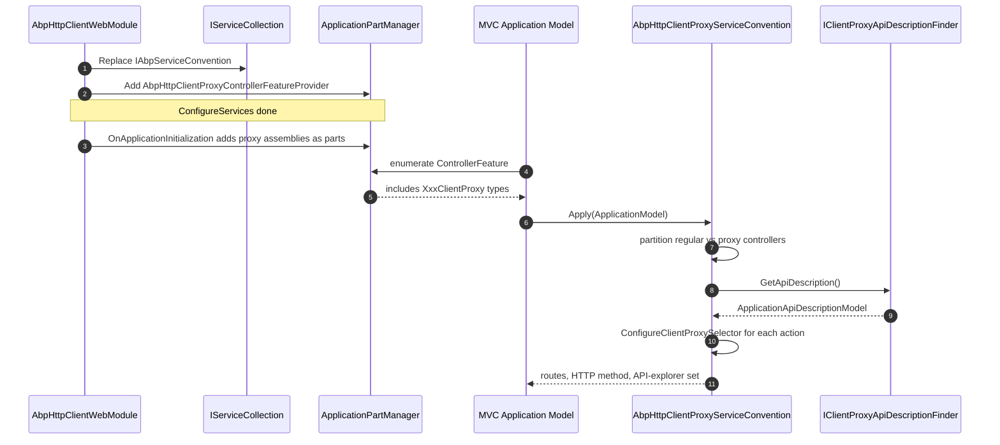
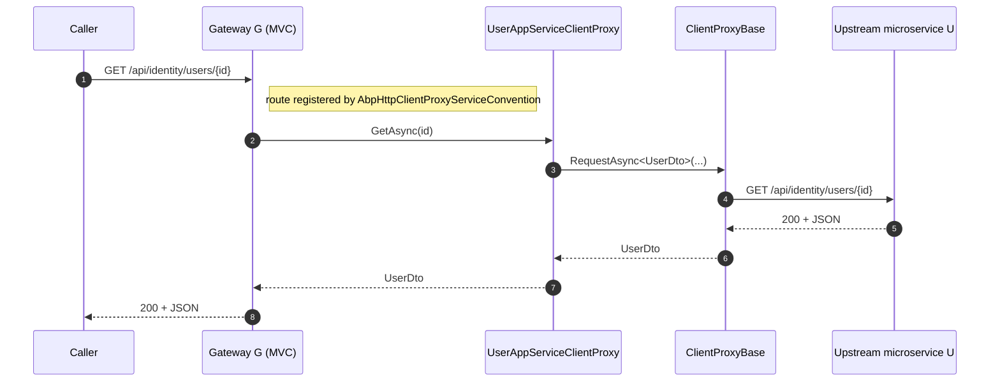

The ABP Framework `Volo.Abp.Http.Client.Web` package solves a specific microservice problem: a BFF or gateway host that *consumes* a downstream application service via a static HTTP client proxy and wants to *re-expose* the very same endpoints to its own callers without writing forwarding controllers by hand. This page documents every file in `framework/src/Volo.Abp.Http.Client.Web/`: the module, the controller-feature provider that lights up generated proxy classes, the conventional helper that decides which types are eligible, and the long `AbpHttpClientProxyServiceConvention` that rewrites their MVC routes and selectors from the bundled API description.

<Note>
This package does **not** add a cookie-based authenticator (despite its name). Cookie-based identity for HTTP-client proxies is provided by `Volo.Abp.Http.Client.IdentityModel.Web` and is covered on [`/http/http-client-identitymodel`](/http/http-client-identitymodel). The "Web" part of this package refers to running the proxy *inside* a web-host that re-publishes the proxies as ASP.NET Core MVC controllers.
</Note>

## File inventory

| File | Role |
| --- | --- |
| `Volo/Abp/Http/Client/Web/AbpHttpClientWebModule.cs` | Module — registers the convention and feature provider, adds proxy assemblies to MVC application parts. |
| `Volo/Abp/Http/Client/Web/Conventions/AbpHttpClientProxyHelper.cs` | `IsClientProxyService(Type)` predicate. |
| `Volo/Abp/Http/Client/Web/Conventions/AbpHttpClientProxyControllerFeatureProvider.cs` | `ControllerFeatureProvider` override so MVC discovers proxy classes. |
| `Volo/Abp/Http/Client/Web/Conventions/AbpHttpClientProxyServiceConvention.cs` | The bulk of the module — applies routes, selectors, API-explorer settings, and parameter binding. |

The package depends on both `AbpAspNetCoreMvcModule` and `AbpHttpClientModule`. Without the MVC module there is no `IAbpServiceConvention` to replace; without the HTTP-client module there is no `ClientProxyBase<>` to detect.

## The module

```csharp
// AbpHttpClientWebModule.cs
[DependsOn(
    typeof(AbpAspNetCoreMvcModule),
    typeof(AbpHttpClientModule)
)]
public class AbpHttpClientWebModule : AbpModule
{
    public override void ConfigureServices(ServiceConfigurationContext context)
    {
        context.Services.Replace(ServiceDescriptor.Transient<IAbpServiceConvention,
            AbpHttpClientProxyServiceConvention>());
        context.Services.AddTransient<AbpHttpClientProxyServiceConvention>();

        var partManager = context.Services.GetSingletonInstance<ApplicationPartManager>();
        partManager.FeatureProviders.Add(new AbpHttpClientProxyControllerFeatureProvider());
    }

    public override void OnApplicationInitialization(ApplicationInitializationContext context)
    {
        var partManager = context.ServiceProvider.GetRequiredService<ApplicationPartManager>();
        foreach (var moduleAssembly in context.ServiceProvider
            .GetRequiredService<IModuleContainer>()
            .Modules.SelectMany(m => m.AllAssemblies)
            .Where(a => a.GetTypes().Any(AbpHttpClientProxyHelper.IsClientProxyService))
            .Distinct())
        {
            partManager.ApplicationParts.AddIfNotContains(moduleAssembly);
        }
    }
}
```

Two notable lines:

- `services.Replace(...IAbpServiceConvention, AbpHttpClientProxyServiceConvention)` swaps the default `AbpServiceConvention` (in `Volo.Abp.AspNetCore.Mvc`) so the rewritten convention runs for every controller — both real ones and proxy ones.
- The `OnApplicationInitialization` block scans loaded module assemblies for any type passing `IsClientProxyService`, and adds those assemblies as `ApplicationPart`s. Without this, MVC's default discovery would skip them because they are not in entry assembly's compilation closure.

## `AbpHttpClientProxyHelper`

The predicate is small but precise:

```csharp
// AbpHttpClientProxyHelper.cs
public static class AbpHttpClientProxyHelper
{
    public static bool IsClientProxyService(Type type)
    {
        return typeof(IApplicationService).IsAssignableFrom(type) &&
            type.GetBaseClasses().Any(x => x.IsGenericType
                && x.GetGenericTypeDefinition() == typeof(ClientProxyBase<>));
    }
}
```

A type is a "client proxy service" if and only if it (a) implements `IApplicationService` and (b) inherits from the open generic `ClientProxyBase<TService>`. Generated static proxies satisfy both — the `abp generate-proxy` tool emits classes like:

```csharp
public class UserAppServiceClientProxy
    : ClientProxyBase<IUserAppService>, IUserAppService
{
    // ... RequestAsync calls
}
```

The base class chain is `UserAppServiceClientProxy → ClientProxyBase<IUserAppService> → object`, so `GetBaseClasses()` finds the generic match.

## `AbpHttpClientProxyControllerFeatureProvider`

ASP.NET Core MVC's default `ControllerFeatureProvider` only recognises types that end in `Controller` or carry `[Controller]`. The override widens the net:

```csharp
public class AbpHttpClientProxyControllerFeatureProvider : ControllerFeatureProvider
{
    protected override bool IsController(TypeInfo typeInfo)
    {
        return AbpHttpClientProxyHelper.IsClientProxyService(typeInfo);
    }
}
```

Notice this provider is **added**, not replaced. So both the default convention (real controllers ending in `Controller`) and this one (proxy classes ending in `ClientProxy`) detect distinct sets of types and union them.

## `AbpHttpClientProxyServiceConvention`

This is the workhorse: 250+ lines that take a `Microsoft.AspNetCore.Mvc.ApplicationModels.ApplicationModel`, partition it into "regular controllers" and "client-proxy controllers", and apply the conventional route / verb / API-explorer logic to the proxy set using the bundled `ApplicationApiDescriptionModel`.

### Partition

```csharp
protected override IList<ControllerModel> GetControllers(ApplicationModel application)
{
    return application.Controllers
        .Where(c => !AbpHttpClientProxyHelper.IsClientProxyService(c.ControllerType))
        .ToList();
}

protected virtual IList<ControllerModel> GetClientProxyControllers(ApplicationModel application)
{
    return application.Controllers
        .Where(c => AbpHttpClientProxyHelper.IsClientProxyService(c.ControllerType))
        .ToList();
}
```

The base class's `ApplyForControllers` is called with just the non-proxy controllers (the regular ABP convention); the override extends it for the proxy set.

### Per-controller pipeline

```csharp
protected override void ApplyForControllers(ApplicationModel application)
{
    base.ApplyForControllers(application);

    foreach (var controller in GetClientProxyControllers(application))
    {
        if (ShouldBeRemove(application, controller))
        {
            application.Controllers.Remove(controller);
            continue;
        }

        controller.ControllerName = controller.ControllerName.RemovePostFix("ClientProxy");

        var controllerApiDescription = FindControllerApiDescriptionModel(controller);
        if (controllerApiDescription != null
            && !controllerApiDescription.ControllerGroupName.IsNullOrWhiteSpace())
        {
            controller.ControllerName = controllerApiDescription.ControllerGroupName!;
        }

        ConfigureClientProxySelector(controller);
        ConfigureClientProxyApiExplorer(controller);
        ConfigureParameters(controller);
    }
}
```

Reading top-to-bottom:

1. `ShouldBeRemove` — drops the proxy controller if *another* controller in the same app already implements the same application-service interface. This is the conflict-resolution rule: a host that *both* implements `IUserAppService` natively *and* references the generated `UserAppServiceClientProxy` keeps the native one.
2. `RemovePostFix("ClientProxy")` — the convention strips the `ClientProxy` suffix so routes look like `/api/identity/users` instead of `/api/identity/usersClientProxy`.
3. If the bundled API description carries a `ControllerGroupName`, use it (this matches the upstream's URL even when the proxy class lives in a different namespace).

### Selector resolution

The interesting piece is `ConfigureClientProxySelector(ControllerModel, ActionModel)`. It looks up the matching `ActionApiDescriptionModel` from the cached `IClientProxyApiDescriptionFinder` and either creates a fresh `SelectorModel` or fills in the missing pieces of an existing one:

```csharp
if (!action.Selectors.Any())
{
    var abpServiceSelectorModel = new SelectorModel
    {
        AttributeRouteModel = new AttributeRouteModel(
            new RouteAttribute(template: actionApiDescriptionModel.Url)),
        ActionConstraints =
        {
            new HttpMethodActionConstraint(new[] { actionApiDescriptionModel.HttpMethod! })
        }
    };
    action.Selectors.Add(abpServiceSelectorModel);
}
else
{
    foreach (var selector in action.Selectors)
    {
        var httpMethod = selector.ActionConstraints
            .OfType<HttpMethodActionConstraint>()
            .FirstOrDefault()?.HttpMethods?.FirstOrDefault()
            ?? actionApiDescriptionModel.HttpMethod;

        if (selector.AttributeRouteModel == null)
            selector.AttributeRouteModel = new AttributeRouteModel(
                new RouteAttribute(template: actionApiDescriptionModel.Url));

        if (!selector.ActionConstraints.OfType<HttpMethodActionConstraint>().Any())
            selector.ActionConstraints.Add(
                new HttpMethodActionConstraint(new[] { httpMethod! }));
    }
}
```

So the URL template and HTTP method are *copied verbatim from the upstream's API description*. That means the gateway exposes the same routes downstream services exposed — no surprises for the client.

### Parameter binding from query

```csharp
protected override void ConfigureParameters(ControllerModel controller)
{
    foreach (var action in controller.Actions)
    {
        foreach (var prm in action.Parameters)
        {
            if (prm.BindingInfo != null) continue;
            if (StaticProxyingOptions.BindingFromQueryTypes.Contains(prm.ParameterInfo.ParameterType))
                prm.BindingInfo = BindingInfo.GetBindingInfo(new[] { new FromQueryAttribute() });
        }
    }
    base.ConfigureParameters(controller);
}
```

`AbpHttpClientStaticProxyingOptions.BindingFromQueryTypes` is a registry of "complex types we want bound from the query string rather than the body". A typical entry is a paged-and-sorted-input DTO whose properties all map cleanly to query parameters.

### Module / controller / action lookup

The convention uses `IClientProxyApiDescriptionFinder.GetApiDescription()` to obtain the cached `ApplicationApiDescriptionModel`, then walks `Modules → Controllers → Actions` to find the matching descriptor. The lookup key for actions is:

```csharp
var key =
    $"{appServiceType.FullName}." +
    $"{action.ActionMethod.Name}." +
    $"{string.Join("-", action.Parameters.Select(x =>
        TypeHelper.GetFullNameHandlingNullableAndGenerics(x.ParameterType)))}";

var actionApiDescriptionModel = ClientProxyApiDescriptionFinder.FindAction(key);
```

That key shape — `Namespace.IInterface.Method.Param1Type-Param2Type` — is the exact format produced by the `abp generate-proxy` CLI when it serializes `generate-proxy.json`, so client and convention agree by construction.

A subtle filter follows:

```csharp
if (actionApiDescriptionModel.ImplementFrom!.StartsWith("Volo.Abp.Application.Services"))
    return actionApiDescriptionModel;

if (appServiceType.FullName != null
    && actionApiDescriptionModel.ImplementFrom.StartsWith(appServiceType.FullName))
    return actionApiDescriptionModel;

return null;
```

This rejects methods *inherited* from a different application-service base when there is ambiguity — only methods defined on the appropriate interface (or on the ABP base class) are republished. The rule prevents accidental double-publishing of base CRUD methods.

## Sequence — host startup



## End-to-end gateway flow

What does this look like at request time? Suppose Gateway host G has the generated `UserAppServiceClientProxy` from microservice U installed. A consumer hits `GET /api/identity/users/{id}` on G:



From the caller's perspective G *is* the API. Internally G is a thin re-emitter. Both hops pass through `ClientProxyBase`, the same authenticator chain, the same correlation IDs — so logs across both tiers have matching `X-Correlation-Id` values.

## Why this matters for BFF architectures

The BFF / API gateway pattern in ABP rests on three facts:

| Concern | Mechanism |
| --- | --- |
| Discover generated proxies | `AbpHttpClientProxyHelper.IsClientProxyService` + `AbpHttpClientProxyControllerFeatureProvider`. |
| Route them on identical URLs | `AbpHttpClientProxyServiceConvention` reading bundled `ApplicationApiDescriptionModel`. |
| Avoid double-publishing | `ShouldBeRemove` removes proxy controllers when a native controller covers the same interface. |
| Preserve `_AbpErrorFormat` errors | `ClientProxyBase.ThrowExceptionForResponseAsync` re-throws `AbpRemoteCallException` whose `HttpStatusCode` is honoured by the gateway's `AbpExceptionFilter`. See [`/aspnetcore/mvc`](/aspnetcore/mvc). |

Together these let one process expose the union of N microservices' endpoints with effectively zero forwarding code.

## Common pitfalls

<AccordionGroup>
  <Accordion title="Static vs dynamic proxies in the same module">
    `AbpHttpClientWebModule` republishes only static proxies (subclasses of `ClientProxyBase<>`). Dynamic Castle proxies built by `AddHttpClientProxies` are not detected by `IsClientProxyService` because they are runtime-synthesized — they have no static base-class hierarchy.
  </Accordion>
  <Accordion title="Forgetting to generate proxies">
    The convention silently logs a warning if `FindActionApiDescriptionModel` returns null: `"Could not find ApiDescriptionModel for action ... May be the generate-proxy.json is not up to date."`. Re-run `abp generate-proxy -t csharp` from the consumer host whenever the upstream's API changes.
  </Accordion>
  <Accordion title="Group name overrides">
    If `controllerApiDescription.ControllerGroupName` is set in the upstream's `[ControllerName(...)]` attribute, the gateway *uses that name*, not the proxy class name. This is by design — URLs must match upstream — but can be surprising when reading the gateway's route table.
  </Accordion>
</AccordionGroup>

## Configuration entry

A single options class is exposed for tuning:

```csharp
// Volo.Abp.Http.Client/Volo/Abp/Http/Client/StaticProxying/
// AbpHttpClientStaticProxyingOptions.cs
public class AbpHttpClientStaticProxyingOptions
{
    public List<Type> BindingFromQueryTypes { get; }
    public AbpHttpClientStaticProxyingOptions()
        => BindingFromQueryTypes = new List<Type>();
}
```

Configure in your host module:

```csharp
public override void ConfigureServices(ServiceConfigurationContext context)
{
    Configure<AbpHttpClientStaticProxyingOptions>(opt =>
    {
        opt.BindingFromQueryTypes.Add(typeof(PagedAndSortedResultRequestDto));
        opt.BindingFromQueryTypes.Add(typeof(MyCustomFilterDto));
    });
}
```

## Cross-references

<CardGroup cols={2}>
  <Card title="HTTP Client" icon="bolt" href="/http/http-client">
    `ClientProxyBase`, `AddStaticHttpClientProxies`, the engine the convention republishes.
  </Card>
  <Card title="ASP.NET Core MVC" icon="server" href="/aspnetcore/mvc">
    The MVC application-model conventions this class extends.
  </Card>
  <Card title="HTTP IdentityModel" icon="key" href="/http/http-client-identitymodel">
    Cookie / Bearer token chain — what actually authenticates each hop.
  </Card>
  <Card title="HTTP Overview" icon="map" href="/http/overview">
    Where the Web variant fits in the package map.
  </Card>
</CardGroup>
