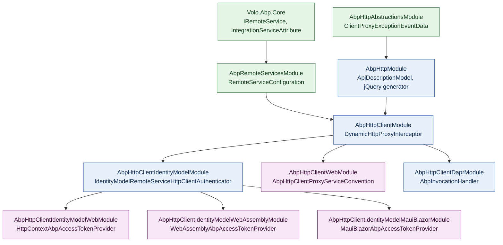

ABP Framework ships a layered family of NuGet packages that turn a plain C# application-service interface into a fully featured HTTP REST endpoint on the server and into an auto-generated `HttpClient` proxy on the consumer. This overview page introduces every package under `framework/src/Volo.Abp.Http*` and `framework/src/Volo.Abp.RemoteServices/`, lays out their dependency direction, and shows where the dynamic-proxy machinery from `core/dynamic-proxy-and-interceptors` plugs into the request pipeline.

## Package map

Eight projects under `framework/src/` make up the HTTP stack. The table lists their root namespace, the module class registered with the ABP module system, and the role each plays.

| Project folder | Root module | Role |
| --- | --- | --- |
| `Volo.Abp.RemoteServices/` | `AbpRemoteServicesModule` | Reads `RemoteServices` config section into `AbpRemoteServiceOptions`; multi-tenant URL resolution. |
| `Volo.Abp.Http.Abstractions/` | `AbpHttpAbstractionsModule` | Cross-cutting types shared by server + client (`ClientProxyExceptionEventData`, `AbpApiDescriptionModelOptions`). |
| `Volo.Abp.Http/` | `AbpHttpModule` | API description models, proxy-script generation (jQuery), `HttpMethodHelper`. |
| `Volo.Abp.Http.Client/` | `AbpHttpClientModule` | The dynamic HTTP client proxy engine — `DynamicHttpProxyInterceptor<TService>`, `AddHttpClientProxies`, `IHttpClientProxy<T>`. |
| `Volo.Abp.Http.Client.IdentityModel/` | `AbpHttpClientIdentityModelModule` | OAuth2 client-credentials authenticator built on Duende IdentityModel. |
| `Volo.Abp.Http.Client.IdentityModel.Web/` | `AbpHttpClientIdentityModelWebModule` | MVC/Razor-Pages variant that prefers the access token stored in `HttpContext`. |
| `Volo.Abp.Http.Client.IdentityModel.WebAssembly/` | `AbpHttpClientIdentityModelWebAssemblyModule` | Blazor WebAssembly variant on top of `IAccessTokenProvider`. |
| `Volo.Abp.Http.Client.IdentityModel.MauiBlazor/` | `AbpHttpClientIdentityModelMauiBlazorModule` | .NET MAUI Blazor variant. |
| `Volo.Abp.Http.Client.Web/` | `AbpHttpClientWebModule` | Re-publishes statically generated client proxies as MVC controllers (proxy server scenario). |
| `Volo.Abp.Http.Client.Dapr/` | `AbpHttpClientDaprModule` | Routes outgoing proxy traffic through the Dapr sidecar via `InvocationHandler`. |

Every consumer module ultimately depends on `AbpHttpClientModule`, which itself depends on `AbpHttpModule`, `AbpRemoteServicesModule`, `AbpExceptionHandlingModule`, `AbpEventBusModule`, `AbpMultiTenancyModule`, and `AbpValidationModule` as declared in `Volo.Abp.Http.Client/Volo/Abp/Http/Client/AbpHttpClientModule.cs`.

## Dependency graph

The Mermaid graph below mirrors the `[DependsOn(...)]` declarations on each `AbpModule`. Boxes shaded green are pure abstractions; blue boxes carry executable code; purple boxes are UI-stack-specific.



## Two proxying paths

ABP supports two distinct flavours of client proxy. Both end up calling an HTTP endpoint, but they are generated differently and registered through different APIs in `Volo.Abp.Http.Client/Microsoft/Extensions/DependencyInjection/ServiceCollectionHttpClientProxyExtensions.cs`.

<CardGroup cols={2}>
  <Card title="Dynamic proxy" icon="bolt">
    `AddHttpClientProxies(assembly)` runs at startup. Castle.DynamicProxy synthesises an interface proxy whose interceptor is `DynamicHttpProxyInterceptor<TService>`. Method calls are translated into HTTP requests at runtime using `ApiDescriptionFinder` against the server's `/api/abp/api-definition` endpoint.
  </Card>
  <Card title="Static proxy" icon="file-code">
    `AddStaticHttpClientProxies(assembly)` registers classes generated by the `abp generate-proxy` CLI. Those generated classes inherit `ClientProxyBase<TService>` (in `Volo.Abp.Http.Client/Volo/Abp/Http/Client/ClientProxying/`) and call `RequestAsync` directly, with no runtime API description lookup.
  </Card>
</CardGroup>

The dynamic flavour reuses every piece of the Castle adapter described in [`/core/dynamic-proxy-and-interceptors`](/core/dynamic-proxy-and-interceptors). Specifically, `ServiceCollectionHttpClientProxyExtensions.AddHttpClientProxy` registers an `AbpAsyncDeterminationInterceptor<DynamicHttpProxyInterceptor<TService>>` and an `AbpAsyncDeterminationInterceptor<ValidationInterceptor>` and asks `ProxyGenerator.CreateInterfaceProxyWithoutTarget` to weave them around an empty target.

## End-to-end request flow

When `IUserAppService.GetAsync(id)` is called on the consumer side, control passes through ten components before bytes hit the wire. The sequence below traces the most common path — dynamic proxy + IdentityModel client-credentials authenticator + multi-tenant base URL.

```mermaid
sequenceDiagram
    autonumber
    participant Caller as Application code
    participant Proxy as Castle interface proxy
    participant Inter as DynamicHttpProxyInterceptor&lt;TService&gt;
    participant Client as DynamicHttpProxyInterceptorClientProxy
    participant Cfg as IRemoteServiceConfigurationProvider
    participant Auth as IRemoteServiceHttpClientAuthenticator
    participant Idsvr as IdentityModel token endpoint
    participant Http as HttpClient (named, IHttpClientFactory)
    participant API as Remote ABP API

    Caller->>Proxy: GetAsync(id)
    Proxy->>Inter: InterceptAsync(invocation)
    Inter->>Inter: ApiDescriptionFinder.FindActionAsync
    Inter->>Client: CallRequestAsync<UserDto>(context)
    Client->>Cfg: GetConfigurationOrDefaultAsync("Default")
    Cfg-->>Client: RemoteServiceConfiguration { BaseUrl }
    Client->>Auth: Authenticate(ctx)
    Auth->>Idsvr: POST /connect/token
    Idsvr-->>Auth: access_token
    Auth->>Http: SetBearerToken
    Client->>Http: SendAsync(GET /api/identity/users/{id})
    Http->>API: HTTP/1.1
    API-->>Http: 200 + JSON
    Http-->>Client: HttpResponseMessage
    Client-->>Inter: UserDto
    Inter-->>Proxy: invocation.ReturnValue
    Proxy-->>Caller: UserDto
```

## What lives where

Two files in `Volo.Abp.Http.Client/` provide the bulk of the runtime. `DynamicHttpProxyInterceptor.cs` is a thin entry point — it delegates to `DynamicHttpProxyInterceptorClientProxy<TService>`, which inherits from `ClientProxyBase<TService>`. That base class (almost 400 lines, `Volo.Abp.Http.Client/Volo/Abp/Http/Client/ClientProxying/ClientProxyBase.cs`) is the actual HTTP request builder — it resolves the URL, builds payloads, attaches correlation IDs, tenant IDs, the `X-Requested-With` header, time-zone, culture, and turns non-2xx responses into `AbpRemoteCallException`.

The matching server-side runtime — `AbpRemoteServiceAttribute`, the `AbpApiExplorer`, `ApplicationApiDescriptionModelProvider` — lives in `framework/src/Volo.Abp.AspNetCore.Mvc/` and is documented at [`/aspnetcore/mvc`](/aspnetcore/mvc).

## Configuration surface

A single section in `appsettings.json` configures the bulk of the stack. The shape is enforced by `RemoteServiceConfigurationDictionary` and `RemoteServiceConfiguration`.

```json
{
  "RemoteServices": {
    "Default": {
      "BaseUrl": "https://api.mycompany.com/",
      "Version": "1.0",
      "IdentityClient": "Default"
    },
    "Identity": {
      "BaseUrl": "https://identity.mycompany.com/",
      "UseCurrentAccessToken": "true"
    }
  }
}
```

The key `Default` is special: `RemoteServiceConfigurationDictionary.GetConfigurationOrDefault(name)` falls back to it whenever the named configuration is missing — see the `Default` property in `Volo.Abp.RemoteServices/Volo/Abp/Http/Client/RemoteServiceConfigurationDictionary.cs`. The constant `DefaultName = "Default"` is the same string referenced by `AddHttpClientProxies` as its default `remoteServiceConfigurationName` argument.

## Cross-references

<CardGroup cols={2}>
  <Card title="HTTP Abstractions" icon="layer-group" href="/http/http-abstractions">
    `RemoteServiceErrorInfo`, `AbpRemoteCallException`, `ClientProxyExceptionEventData`, and where they actually live.
  </Card>
  <Card title="HTTP Client" icon="bolt" href="/http/http-client">
    `AbpHttpClientModule`, `DynamicHttpProxyInterceptor<TService>`, `AddHttpClientProxies`, `IHttpClientProxy<T>`.
  </Card>
  <Card title="IdentityModel client" icon="key" href="/http/http-client-identitymodel">
    Token-based authenticator with Web, WebAssembly and MauiBlazor variants.
  </Card>
  <Card title="Web proxy republisher" icon="server" href="/http/http-client-web">
    Hosting static client proxies as MVC controllers via `AbpHttpClientProxyServiceConvention`.
  </Card>
  <Card title="Dapr client" icon="network-wired" href="/http/http-client-dapr">
    Routing proxy calls through the Dapr sidecar with `AbpInvocationHandler`.
  </Card>
  <Card title="Remote services" icon="globe" href="/http/remote-services">
    `IRemoteService`, `IntegrationServiceAttribute`, `RemoteServiceConfigurationProvider`.
  </Card>
</CardGroup>

## How the pieces wire up at startup

The order of operations is important to understand because it determines which authenticator gets installed and which named `HttpClient` is configured. The startup steps below trace what happens when an ABP host module lists `[DependsOn(typeof(AbpHttpClientIdentityModelWebModule))]` and calls `services.AddHttpClientProxies(typeof(MyApplicationContractsModule).Assembly)` from its `ConfigureServices`.

<Steps>
  <Step title="Module dependency resolution">
    `AbpApplicationBase` orders modules so `AbpRemoteServicesModule` → `AbpHttpModule` → `AbpHttpClientModule` → `AbpHttpClientIdentityModelModule` → `AbpHttpClientIdentityModelWebModule` all run their `PreConfigureServices` and `ConfigureServices` before the host module.
  </Step>
  <Step title="Options binding">
    `AbpRemoteServicesModule.ConfigureServices` binds the entire `RemoteServices` configuration section to `AbpRemoteServiceOptions.RemoteServices`.
  </Step>
  <Step title="Authenticator replacement">
    The `[Dependency(ReplaceServices = true)]` attribute on `HttpContextIdentityModelRemoteServiceHttpClientAuthenticator` swaps the default `NullRemoteServiceHttpClientAuthenticator` registration.
  </Step>
  <Step title="Proxy registration">
    `AddHttpClientProxies(assembly)` reflects every interface that implements `IRemoteService`, calls `AddHttpClientProxy(type)`, and (a) configures `AbpHttpClientOptions.HttpClientProxies[type]`, (b) registers a Castle interface proxy as the interface implementation, (c) registers a typed `IHttpClientProxy<T>`, (d) registers a named `HttpClient` keyed by `RemoteServiceConfigurationName`.
  </Step>
  <Step title="Application initialization">
    `OnApplicationInitialization` of each module runs — for `AbpHttpClientWebModule` this is when generated proxy classes are added to the MVC `ApplicationPartManager`.
  </Step>
</Steps>

## Mental model

Think of the HTTP stack as three thin layers stacked on top of `IHttpClientFactory`:

1. **Description layer** — `ActionApiDescriptionModel`, `ControllerApiDescriptionModel`, `ApplicationApiDescriptionModel` (`Volo.Abp.Http/Volo/Abp/Http/Modeling/`) capture *what* the server exposes.
2. **Transport layer** — `ClientProxyBase<TService>` and `DynamicHttpProxyInterceptor<TService>` translate method calls into `HttpRequestMessage` using the description, send via `HttpClient`, and parse the response.
3. **Cross-cutting layer** — `IRemoteServiceHttpClientAuthenticator`, `ICorrelationIdProvider`, `ICurrentTenant`, `ICurrentTimezoneProvider` inject the right headers and tokens *as the request is being built*, without the application service interface having to know about HTTP at all.

The result is that an application contract like `IUserAppService` can be used identically whether the implementation runs in-process (typical monolith), through Castle-proxied HTTP (microservice client), or through Dapr (sidecar mesh). The interface stays a plain C# contract.

## Why this layout

A natural question is *why does ABP need eight packages instead of one or two?* The answer comes from the way ABP modules compose. Every host application picks a UI stack (MVC, Blazor Server, Blazor WASM, MAUI), an identity strategy (cookies, JWT, IdentityServer), and a transport (direct HTTP, Dapr, gRPC). Mixing all those concerns into one HTTP package would force every consumer to take a `Microsoft.AspNetCore.Mvc` dependency just to reach an `HttpClient` proxy. The split keeps the abstractions tiny and the UI-stack-specific adapters opt-in.

A second reason is *runtime substitution*. `IRemoteServiceHttpClientAuthenticator` has one default null implementation in `Volo.Abp.Http.Client/Volo/Abp/Http/Client/Authentication/NullRemoteServiceHttpClientAuthenticator.cs` and several different replacements across the IdentityModel siblings, each declared with `[Dependency(ReplaceServices = true)]`. The host picks one by declaring `[DependsOn(typeof(...))]` on the matching module — the rest of the chain stays the same.

## Where common types live

A quick cheat sheet for "this name rings a bell — which file?":

| Symbol | File |
| --- | --- |
| `IRemoteService` (marker) | `Volo.Abp.Core/Volo/Abp/IRemoteService.cs` |
| `IntegrationServiceAttribute` | `Volo.Abp.Core/Volo/Abp/IntegrationServiceAttribute.cs` |
| `ApplicationServiceTypes` | `Volo.Abp.Core/Volo/Abp/ApplicationServiceTypes.cs` |
| `RemoteServiceConfiguration`, `Dictionary` | `Volo.Abp.RemoteServices/Volo/Abp/Http/Client/` |
| `IRemoteServiceConfigurationProvider` | `Volo.Abp.RemoteServices/Volo/Abp/Http/Client/` |
| `AbpRemoteServiceOptions` | same |
| `RemoteServiceErrorInfo`, `RemoteServiceErrorResponse` | `Volo.Abp.ExceptionHandling/Volo/Abp/Http/` |
| `AbpRemoteCallException` | `Volo.Abp.ExceptionHandling/Volo/Abp/Http/Client/` |
| `IHttpExceptionStatusCodeFinder` | `Volo.Abp.AspNetCore/Volo/Abp/AspNetCore/ExceptionHandling/` |
| `ClientProxyExceptionEventData` | `Volo.Abp.Http.Abstractions/Volo/Abp/Http/` |
| `AbpApiDescriptionModelOptions` | same |
| `AbpHttpModule`, `HttpMethodHelper`, `AbpHttpConsts` | `Volo.Abp.Http/Volo/Abp/Http/` |
| `AbpHttpClientModule`, `AbpHttpClientOptions` | `Volo.Abp.Http.Client/Volo/Abp/Http/Client/` |
| `AddHttpClientProxies` extension | `Volo.Abp.Http.Client/Microsoft/Extensions/DependencyInjection/` |
| `DynamicHttpProxyInterceptor<TService>` | `Volo.Abp.Http.Client/Volo/Abp/Http/Client/DynamicProxying/` |
| `ClientProxyBase<TService>` | `Volo.Abp.Http.Client/Volo/Abp/Http/Client/ClientProxying/` |
| `IRemoteServiceHttpClientAuthenticator` | `Volo.Abp.Http.Client/Volo/Abp/Http/Client/Authentication/` |
| `IAbpAccessTokenProvider` | same |
| `IdentityModelRemoteServiceHttpClientAuthenticator` | `Volo.Abp.Http.Client.IdentityModel/Volo/Abp/Http/Client/IdentityModel/` |
| `AbpInvocationHandler` (Dapr) | `Volo.Abp.Http.Client.Dapr/Volo/Abp/Http/Client/Dapr/` |
| `AbpHttpClientProxyServiceConvention` | `Volo.Abp.Http.Client.Web/Volo/Abp/Http/Client/Web/Conventions/` |

The remainder of the section pages on this site walk through each row in detail.

## Cross-cutting headers

The HTTP-client side does not stop at sending the URL and a body — every outbound request is decorated with cross-cutting headers that downstream ABP servers expect. The full list is added inside `ClientProxyBase.AddHeaders` and reproduces in the table below. Knowing the list is useful when writing API gateways or third-party servers that consume ABP traffic.

| Header | Source value | Purpose |
| --- | --- | --- |
| `accept: application/json; v={ver}` | `Version` config or action descriptor | Content negotiation. |
| `api-version: {ver}` | same | URL-segment-independent version routing. |
| `RequestId` (configurable) | `ICorrelationIdProvider.Get()` | Multi-hop tracing. |
| `__tenant` | `ICurrentTenant.Id` | Multi-tenant routing on the server. |
| `Accept-Language` | `CultureInfo.CurrentUICulture` | Localized server responses. |
| `X-Requested-With: XMLHttpRequest` | constant | Marks AJAX / programmatic traffic. |
| `__timezone` | `ICurrentTimezoneProvider.TimeZone` | Server-side time conversion. |
| `Authorization: Bearer {token}` | `IRemoteServiceHttpClientAuthenticator` | OAuth2 access token. |

Together these turn the proxy into a fully ABP-aware client — server-side controllers see exactly what they would see from another ABP host or from the framework's MVC UI.

## Layered request pipeline

Once an outgoing call reaches `ClientProxyBase.RequestAsync` the work proceeds in a strict order regardless of which UI module is in play. The pipeline below summarises that order so it is easy to see where each module plugs in.

| Stage | Responsibility | Module that adds the behaviour |
| --- | --- | --- |
| 1. Resolve `HttpClient` | `IProxyHttpClientFactory.Create(remoteServiceName)` | `Volo.Abp.Http.Client` |
| 2. Resolve base URL | `IRemoteServiceConfigurationProvider` runs `IMultiTenantUrlProvider.GetUrlAsync` | `Volo.Abp.RemoteServices` + `Volo.Abp.MultiTenancy` |
| 3. Build URL | `ClientProxyUrlBuilder.GenerateUrlWithParametersAsync` reads `ActionApiDescriptionModel` | `Volo.Abp.Http.Client` |
| 4. Build body | `ClientProxyRequestPayloadBuilder.BuildContentAsync` | same |
| 5. Add headers | `AddHeaders` (tenant, correlation, locale, time-zone) | same |
| 6. Authenticate | `IRemoteServiceHttpClientAuthenticator.Authenticate` | one of the `*.IdentityModel.*` packages |
| 7. Pre-send actions | `AbpHttpClientOptions.ProxyHttpClientPreSendActions` | application module |
| 8. Send | `HttpClient.SendAsync` (with `DelegatingHandler` chain — e.g. `AbpInvocationHandler`) | `IHttpClientFactory` + `Volo.Abp.Http.Client.Dapr` |
| 9. Parse response | success → `JsonSerializer.Deserialize<T>`; failure → `ThrowExceptionForResponseAsync` | `Volo.Abp.Http.Client` |
| 10. Publish event | `ILocalEventBus.PublishAsync(new ClientProxyExceptionEventData {...})` on failure | `Volo.Abp.EventBus` |

Each stage is small and replaceable. To plug in mTLS, override stage 6. To switch transports, override stage 1 (`IProxyHttpClientFactory`) or insert a delegating handler at stage 8. To carry custom tenant data, replace stage 5's `AddHeaders` by overriding `ClientProxyBase`. The pipeline never *combines* these concerns into a single hard-coded class.

## Static vs dynamic — when to choose which

Both flavours of proxy reach the same end-point with the same headers; the difference is when the API description is consumed. The decision usually comes down to deployment topology and tooling preferences. Dynamic proxies are best when consumer and server are deployed together — no build-time step; the first call lazily downloads `/api/abp/api-definition` and caches it. The cost is an extra round-trip on cold start plus a Castle interface proxy per type. Static proxies are best for Blazor WASM (smaller download, no reflection on hot path), MAUI (AOT compilation), and microservice clients shipped on a different cadence than the server. The cost is a build-time `abp generate-proxy -t csharp` step. A single host can register dynamic proxies for one assembly and static proxies for another — both flavours coexist in `AbpHttpClientOptions.HttpClientProxies`. The Web variant in [`/http/http-client-web`](/http/http-client-web) republishes only static proxies because they exist as physical types MVC can discover.

## Diagnostics tips

When something goes wrong, the symptoms usually correlate with which stage of the pipeline failed. The table below maps common errors to their most likely cause.

| Symptom | Likely cause | Where to look |
| --- | --- | --- |
| `AbpException: Could not get DynamicHttpClientProxyConfig for X` | Interface not registered via `AddHttpClientProxy(X)` | `ServiceCollectionHttpClientProxyExtensions` |
| `AbpException: Remote service 'X' was not found and there is no default configuration.` | Missing `RemoteServices:Default` in `appsettings.json` | `RemoteServiceConfigurationDictionary` |
| `AbpRemoteCallException` with status `0` and inner `HttpRequestException` | Sidecar / DNS / firewall failure | Underlying `HttpClientHandler` |
| `AbpRemoteCallException` with status `401`, body says `invalid_token` | Token expired or `IdentityClient` misconfigured | `IIdentityModelAuthenticationService` cache |
| `AbpException: The API description of X.Y was not found!` | Server out of date or `generate-proxy.json` stale | `ApiDescriptionFinder` / `IClientProxyApiDescriptionFinder` |
| Headers missing `__tenant` | `ICurrentTenant.Id` was null in the calling scope | upstream tenant resolution |
| Response not parsed as `RemoteServiceErrorResponse` | Server did not set `_AbpErrorFormat` header (non-ABP server or middleware order) | `AbpExceptionFilter` on the server |

The local-event-bus subscription pattern is the best place to surface 401 events to a token refresh handler — see [`/http/http-abstractions`](/http/http-abstractions) for the `ClientProxyExceptionEventData` schema.

## Failure semantics in one sentence

Any non-2xx response is turned into an `AbpRemoteCallException` carrying the original `HttpStatusCode`. If the server set the `_AbpErrorFormat` header, the body is deserialized as `RemoteServiceErrorResponse` and exposed via the exception's `Error` property; otherwise, the exception falls back to `response.ReasonPhrase`. Either way, an `IHasHttpStatusCode` is in the exception so any upstream `AbpExceptionFilter` in a gateway preserves the original 404 / 409 / 422 etc. when re-throwing. See [`/http/http-abstractions`](/http/http-abstractions) for the wire format.

## Where the boundaries land

A useful rule when reading the code: every type whose namespace ends in `.Modeling` belongs to the description layer; every type under `.ClientProxying` or `.DynamicProxying` belongs to the transport layer; every type under `.Authentication` belongs to the cross-cutting layer. The three layers communicate via three plain immutable data structures — `ActionApiDescriptionModel`, `ClientProxyRequestContext`, and `RemoteServiceHttpClientAuthenticateContext` — none of which carry framework dependencies beyond what their constructors require. This makes the code straightforward to step through under a debugger when an unusual case arises.

## Module bootstrap timing

`AbpHttpClientModule.ConfigureServices` runs `services.AddHttpClient()` exactly once, which means every named `HttpClient` registered later — whether by the dynamic proxy machinery or by your own `services.AddHttpClient("custom")` calls — shares the same `IHttpClientFactory` infrastructure with its message-handler lifetime tracking, socket pooling, and DNS refresh behaviour. The 2-minute default handler lifetime is preserved; raise it via the standard `IHttpClientBuilder.SetHandlerLifetime(...)` extension inside `AbpHttpClientBuilderOptions.ProxyClientBuildActions` when you need longer-lived sockets (typical for low-latency intra-mesh traffic).

## A note on naming

The phrase **"remote service"** in ABP nomenclature has a precise meaning: any application-service interface that implements `IRemoteService` and is exposed through HTTP. It is distinct from a Dapr "service" (a registered app ID) and from a generic "service" in the DI sense. Throughout the source tree, `RemoteService*` types and `RemoteServices` configuration sections refer specifically to the *contract surface* an ABP application exposes over HTTP, irrespective of transport. That uniform vocabulary is what makes the dynamic-proxy / static-proxy / Dapr / direct distinctions opt-in details rather than top-level architectural decisions.
