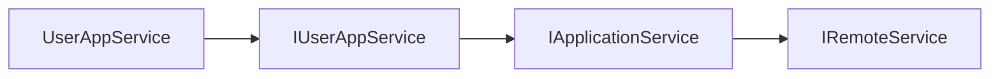

In the ABP Framework, the `Volo.Abp.RemoteServices` package holds the small set of abstractions every other HTTP module agrees on: what counts as "remotable", how a remote service is configured, and how its base URL is resolved at runtime with multi-tenant placeholders. The actual `IRemoteService` marker interface and the `IntegrationServiceAttribute` live one level deeper in `Volo.Abp.Core`, but the configuration types, the runtime provider, and the module that binds the `RemoteServices` section all live in `framework/src/Volo.Abp.RemoteServices/`. This page walks every file in those two places and ties the abstractions back to how the HTTP-client proxies use them at request time.

## File inventory

`framework/src/Volo.Abp.RemoteServices/Volo/Abp/Http/Client/`:

| File | Role |
| --- | --- |
| `AbpRemoteServiceOptions.cs` | Strongly-typed options bound from the `RemoteServices` config section. |
| `RemoteServiceConfiguration.cs` | One entry — `BaseUrl`, `Version`, plus any extension keys. |
| `RemoteServiceConfigurationDictionary.cs` | The keyed dictionary of `RemoteServiceConfiguration`. Holds `DefaultName = "Default"`. |
| `IRemoteServiceConfigurationProvider.cs` | Async lookup interface. |
| `RemoteServiceConfigurationProvider.cs` | Default scoped implementation. Replaces multi-tenant URL placeholders. |
| `RemoteServiceConfigurationProviderExtensions.cs` | Sugar overloads that default to `"Default"`. |
| `AbpRemoteServicesModule.cs` (in `Volo/Abp/RemoteServices/`) | Module entry point — only binds the options. |

The marker types in `framework/src/Volo.Abp.Core/`:

| File | Role |
| --- | --- |
| `Volo/Abp/IRemoteService.cs` | Empty marker — every remotable application-service interface implements this. |
| `Volo/Abp/IntegrationServiceAttribute.cs` | Marks a service (or contract interface) as an internal "integration service". |
| `Volo/Abp/ApplicationServiceTypes.cs` | `[Flags]` enum — `ApplicationServices = 1`, `IntegrationServices = 2`, `All = 3`. |

## `IRemoteService` — the marker

```csharp
// Volo.Abp.Core/Volo/Abp/IRemoteService.cs
namespace Volo.Abp;

public interface IRemoteService
{
}
```

That's the entire definition. It carries no methods, no metadata; it exists purely to make reflective scans efficient. The chain is:



`IApplicationService` extends `IRemoteService`, so every application-service interface inherits it automatically. When `ServiceCollectionHttpClientProxyExtensions.AddHttpClientProxies(assembly)` scans an assembly looking for interfaces to proxy, the test is simply:

```csharp
if (!type.IsInterface || !type.IsPublic || type.IsGenericType ||
    !typeof(IRemoteService).IsAssignableFrom(type))
    return false;
```

So if you want to expose something *that isn't* an application service over HTTP — a domain integration handler, say — you implement `IRemoteService` directly and it becomes proxyable.

## `IntegrationServiceAttribute`

A service is an **integration service** when it is intended for *machine-to-machine* consumption rather than public client traffic. The attribute is used to tighten authorization, skip OpenAPI publishing, and (on the proxy side) to filter which interfaces get registered:

```csharp
// Volo.Abp.Core/Volo/Abp/IntegrationServiceAttribute.cs
[AttributeUsage(AttributeTargets.Class | AttributeTargets.Interface)]
public class IntegrationServiceAttribute : Attribute
{
    public static bool IsDefinedOrInherited<T>() => IsDefinedOrInherited(typeof(T));

    public static bool IsDefinedOrInherited(Type type)
    {
        if (type.IsDefined(typeof(IntegrationServiceAttribute), true)) return true;
        foreach (var @interface in type.GetInterfaces())
            if (@interface.IsDefined(typeof(IntegrationServiceAttribute), true))
                return true;
        return false;
    }
}
```

`IsDefinedOrInherited` walks declared *and* interface-inherited attribute applications, so if `IInternalUserSyncAppService : IRemoteService` is tagged, every implementation is treated as an integration service too.

### `ApplicationServiceTypes` flags

The `[Flags]` enum lets `AddHttpClientProxies` filter by category:

```csharp
[Flags]
public enum ApplicationServiceTypes : byte
{
    ApplicationServices = 1,
    IntegrationServices = 2,
    All                 = ApplicationServices | IntegrationServices
}
```

| Value | Filter applied in `IsSuitableForClientProxying` |
| --- | --- |
| `ApplicationServices` | `!IntegrationServiceAttribute.IsDefinedOrInherited(type)` |
| `IntegrationServices` | `IntegrationServiceAttribute.IsDefinedOrInherited(type)` |
| `All` | no extra filter |

A gateway BFF would typically register only `ApplicationServices` (no internal services exposed to end users), while a microservice talking to a peer might register only `IntegrationServices`.

## `RemoteServiceConfiguration`

Each remote service is described by a string-keyed dictionary with two well-known keys:

```csharp
public class RemoteServiceConfiguration : Dictionary<string, string?>
{
    public string BaseUrl
    {
        get => this.GetOrDefault(nameof(BaseUrl))!;
        set => this[nameof(BaseUrl)] = value;
    }

    public string? Version
    {
        get => this.GetOrDefault(nameof(Version));
        set => this[nameof(Version)] = value;
    }

    public RemoteServiceConfiguration() { }
    public RemoteServiceConfiguration(string baseUrl, string? version = null)
    {
        this[nameof(BaseUrl)] = baseUrl;
        this[nameof(Version)] = version;
    }

    public RemoteServiceConfiguration(RemoteServiceConfiguration configuration)
    {
        foreach (var keyValuePair in configuration)
            this.Add(keyValuePair.Key, keyValuePair.Value);
    }
}
```

The dictionary inheritance is what lets other modules add their own keys without changing the type. Examples seen elsewhere in the codebase:

| Key | Defined in | Read by |
| --- | --- | --- |
| `BaseUrl` | this file | `ClientProxyBase` URL builder |
| `Version` | this file | `ClientProxyBase.GetConfiguredApiVersionAsync` |
| `IdentityClient` | `Volo.Abp.Http.Client.IdentityModel/RemoteServiceConfigurationExtensions.cs` | base IdentityModel authenticator |
| `UseCurrentAccessToken` | same | Web / WebAssembly / MauiBlazor authenticators |

Adding your own extension is a matter of writing extension methods on `RemoteServiceConfiguration` that read/write a new key — see [`/http/http-client-identitymodel`](/http/http-client-identitymodel) for the pattern.

## `RemoteServiceConfigurationDictionary`

The container keyed by *remote-service name*:

```csharp
public class RemoteServiceConfigurationDictionary : Dictionary<string, RemoteServiceConfiguration?>
{
    public const string DefaultName = "Default";

    public RemoteServiceConfiguration? Default
    {
        get => this.GetOrDefault(DefaultName);
        set => this[DefaultName] = value;
    }

    [NotNull]
    public RemoteServiceConfiguration GetConfigurationOrDefault(string name)
    {
        return this.GetOrDefault(name)
               ?? Default
               ?? throw new AbpException($"Remote service '{name}' was not found and there is no default configuration.");
    }

    public RemoteServiceConfiguration? GetConfigurationOrDefaultOrNull(string name)
    {
        return this.GetOrDefault(name) ?? Default;
    }
}
```

Three rules to remember:

1. The constant `DefaultName = "Default"` is the magic string used everywhere else (`AddHttpClientProxies`, the dictionary lookups, etc.). Never hard-code `"Default"` in your own code — reference the constant.
2. `GetConfigurationOrDefault` falls back to the `Default` entry. So if you only declare one entry in JSON named `Default`, every call to `AddHttpClientProxy(asDefaultService: true)` works against it.
3. The not-null version *throws*. If you depend on a configuration being present, this is the safe call. The "or null" variant is what `RemoteServiceConfigurationProvider.GetConfigurationOrDefaultOrNullAsync` uses internally.

## `AbpRemoteServiceOptions`

A thin wrapper that exists solely so the options pattern can bind the JSON section:

```csharp
public class AbpRemoteServiceOptions
{
    public RemoteServiceConfigurationDictionary RemoteServices { get; set; }

    public AbpRemoteServiceOptions()
        => RemoteServices = new RemoteServiceConfigurationDictionary();
}
```

The module binds it with one line:

```csharp
// Volo.Abp.RemoteServices/Volo/Abp/RemoteServices/AbpRemoteServicesModule.cs
[DependsOn(typeof(AbpMultiTenancyAbstractionsModule))]
public class AbpRemoteServicesModule : AbpModule
{
    public override void ConfigureServices(ServiceConfigurationContext context)
    {
        var configuration = context.Services.GetConfiguration();
        Configure<AbpRemoteServiceOptions>(configuration);
    }
}
```

The bound JSON shape:

```json
{
  "RemoteServices": {
    "Default":  { "BaseUrl": "https://api.acme.com/", "Version": "1.0" },
    "Identity": { "BaseUrl": "https://id.acme.com/" },
    "Billing":  { "BaseUrl": "https://billing.acme.com/" }
  }
}
```

Notice: there is no `RemoteServices` *subsection key*. The options binder reads the root, picks `RemoteServices` as a property name on `AbpRemoteServiceOptions`, and recursively binds it as a `Dictionary<string, RemoteServiceConfiguration>`. The dictionary entries themselves bind via the `Dictionary<string, string?>` mechanism.

## `IRemoteServiceConfigurationProvider`

The async interface that *every* consumer uses (no one reads `IOptions<AbpRemoteServiceOptions>` directly except this provider):

```csharp
public interface IRemoteServiceConfigurationProvider
{
    [ItemNotNull]
    Task<RemoteServiceConfiguration> GetConfigurationOrDefaultAsync(string name);

    Task<RemoteServiceConfiguration?> GetConfigurationOrDefaultOrNullAsync(string name);
}
```

Why async? Because the default implementation runs URL placeholders through `IMultiTenantUrlProvider`, which can be I/O-bound in implementations that fetch tenant data from a database.

### Convenience overloads

```csharp
// RemoteServiceConfigurationProviderExtensions.cs
public static class RemoteServiceConfigurationProviderExtensions
{
    [ItemNotNull]
    public static Task<RemoteServiceConfiguration> GetConfigurationOrDefaultAsync(
        this IRemoteServiceConfigurationProvider provider)
        => provider.GetConfigurationOrDefaultAsync(RemoteServiceConfigurationDictionary.DefaultName);

    public static Task<RemoteServiceConfiguration?> GetConfigurationOrDefaultOrNullAsync(
        this IRemoteServiceConfigurationProvider provider)
        => provider.GetConfigurationOrDefaultOrNullAsync(RemoteServiceConfigurationDictionary.DefaultName);
}
```

Call `await provider.GetConfigurationOrDefaultAsync()` (no arg) when you just want the `Default` block.

## `RemoteServiceConfigurationProvider` — the implementation

```csharp
public class RemoteServiceConfigurationProvider
    : IRemoteServiceConfigurationProvider, IScopedDependency
{
    protected AbpRemoteServiceOptions Options { get; }
    protected IMultiTenantUrlProvider MultiTenantUrlProvider { get; }
    protected ICurrentTenant CurrentTenant { get; }

    public RemoteServiceConfigurationProvider(
        IOptionsMonitor<AbpRemoteServiceOptions> options,
        IMultiTenantUrlProvider multiTenantUrlProvider,
        ICurrentTenant currentTenant)
    {
        MultiTenantUrlProvider = multiTenantUrlProvider;
        CurrentTenant = currentTenant;
        Options = options.CurrentValue;
    }

    public virtual async Task<RemoteServiceConfiguration> GetConfigurationOrDefaultAsync(string name)
        => (await GetMultiTenantConfigurationAsync(
                Options.RemoteServices.GetConfigurationOrDefault(name)))!;

    public virtual async Task<RemoteServiceConfiguration?> GetConfigurationOrDefaultOrNullAsync(string name)
        => await GetMultiTenantConfigurationAsync(
            Options.RemoteServices.GetConfigurationOrDefaultOrNull(name));

    protected virtual async Task<RemoteServiceConfiguration?> GetMultiTenantConfigurationAsync(
        RemoteServiceConfiguration? configuration)
    {
        if (configuration == null) return configuration;

        var baseUrl = await MultiTenantUrlProvider.GetUrlAsync(configuration.BaseUrl);
        if (baseUrl == configuration.BaseUrl) return configuration;

        var multiTenantConfiguration = new RemoteServiceConfiguration(configuration)
        {
            BaseUrl = baseUrl
        };
        return multiTenantConfiguration;
    }
}
```

The class is registered as `IScopedDependency` so it captures a *consistent* `ICurrentTenant` snapshot for the duration of a request. Three things to note:

1. `IOptionsMonitor` is used, and `Options.CurrentValue` is captured at construction. This means runtime updates to the underlying configuration would require constructing a new scope (which a per-request lifecycle gives you naturally).
2. The configuration is *cloned* before mutation via the copy constructor. This protects the in-memory `RemoteServiceConfiguration` from being mutated by per-request URL substitution.
3. If the multi-tenant URL provider doesn't change the URL (no placeholders, or no tenant available), the original instance is returned unchanged — no allocation cost in the non-multi-tenant case.

## Multi-tenant URL placeholders

The `MultiTenantUrlProvider` default implementation (in `framework/src/Volo.Abp.MultiTenancy/`) recognises three placeholder shapes:

| Placeholder | Substituted with |
| --- | --- |
| `{0}` | `tenantName.` if tenant available, else empty |
| `{{tenantId}}` | `tenantId.` |
| `{{tenantName}}` | `tenantName.` |

A typical URL template:

```json
{ "BaseUrl": "https://{{tenantName}}.api.acme.com/" }
```

With tenant `acme-corp` resolves to `https://acme-corp.api.acme.com/`. Anonymous calls (no tenant) collapse the placeholder so the URL becomes `https://api.acme.com/`. The substitution algorithm strips a trailing `.` after the placeholder when the value is empty:

```csharp
if (templateUrl.Contains(placeHolder + '.')) placeHolder += '.';
templateUrl = templateUrl.Replace(placeHolder, placeHolderValue);
```

That dot-handling is what lets the same template degrade gracefully for anonymous traffic and host-style tenant routing.

## Lifecycle diagram

```mermaid
sequenceDiagram
    autonumber
    participant Caller as DynamicHttpProxyInterceptor
    participant Prov as RemoteServiceConfigurationProvider (scoped)
    participant Opts as IOptionsMonitor&lt;AbpRemoteServiceOptions&gt;
    participant Dict as RemoteServiceConfigurationDictionary
    participant URL as IMultiTenantUrlProvider
    participant CT as ICurrentTenant

    Caller->>Prov: GetConfigurationOrDefaultAsync("Identity")
    Prov->>Opts: CurrentValue
    Opts-->>Prov: AbpRemoteServiceOptions snapshot
    Prov->>Dict: GetConfigurationOrDefault("Identity")
    Dict-->>Prov: RemoteServiceConfiguration (Identity ?? Default)
    Prov->>URL: GetUrlAsync(cfg.BaseUrl)
    URL->>CT: Read tenant
    CT-->>URL: TenantId / TenantName
    URL-->>Prov: substituted URL
    Prov->>Prov: Clone cfg with new BaseUrl
    Prov-->>Caller: per-tenant RemoteServiceConfiguration
```

## How `IRemoteService` and `RemoteServiceConfiguration` connect

The link is made at registration time inside `ServiceCollectionHttpClientProxyExtensions.AddHttpClientProxy`:

```csharp
services.Configure<AbpHttpClientOptions>(options =>
{
    options.HttpClientProxies[type] = new HttpClientProxyConfig(type, remoteServiceConfigurationName);
});
```

Then at call time, `ClientProxyBase.RequestAsync` looks the type up:

```csharp
var clientConfig = ClientOptions.Value.HttpClientProxies.GetOrDefault(requestContext.ServiceType)
    ?? throw new AbpException(...);
var remoteServiceConfig = await RemoteServiceConfigurationProvider
    .GetConfigurationOrDefaultAsync(clientConfig.RemoteServiceName);
```

So the *contract type* → *remote-service name* → *runtime base URL* mapping is two hops. That extra indirection is what lets `IUserAppService` simultaneously target different remote services in different processes — the contract doesn't change, only the configuration does.

## Where `RemoteServiceConfiguration` lookups happen

| Component | Reads which key |
| --- | --- |
| `ClientProxyBase.RequestAsync` | `BaseUrl` |
| `ClientProxyBase.GetConfiguredApiVersionAsync` | `Version` |
| `IdentityModelRemoteServiceHttpClientAuthenticator` | `IdentityClient` |
| `HttpContextIdentityModelRemoteServiceHttpClientAuthenticator` | `UseCurrentAccessToken` + `IdentityClient` |
| `AccessTokenProviderIdentityModelRemoteServiceHttpClientAuthenticator` | same |
| `MauiBlazorIdentityModelRemoteServiceHttpClientAuthenticator` | same |
| `RemoteServiceConfigurationProvider.GetMultiTenantConfigurationAsync` | `BaseUrl` (replaces placeholders) |

Every other key in a `RemoteServiceConfiguration` is opaque — the framework reads only `BaseUrl` and `Version` directly; everything else is read by *extensions* registered by satellite modules.

## Configuration recipes

<AccordionGroup>
  <Accordion title="Single endpoint, no tenant routing">
    ```json
    { "RemoteServices": { "Default": { "BaseUrl": "https://api.acme.com/" } } }
    ```
    Every proxy resolves to the same URL.
  </Accordion>
  <Accordion title="Per-tenant subdomain">
    ```json
    { "RemoteServices": { "Default": { "BaseUrl": "https://{{tenantName}}.api.acme.com/" } } }
    ```
    Substituted by `MultiTenantUrlProvider` per request.
  </Accordion>
  <Accordion title="Different services per microservice">
    ```json
    {
      "RemoteServices": {
        "Default":  { "BaseUrl": "https://api.acme.com/" },
        "Identity": { "BaseUrl": "https://id.acme.com/" },
        "Billing":  { "BaseUrl": "https://billing.acme.com/" }
      }
    }
    ```
    Call `services.AddHttpClientProxies(typeof(BillingContractsModule).Assembly, "Billing")` for the billing module — interfaces in that assembly route via the `Billing` config; others fall back to `Default`.
  </Accordion>
  <Accordion title="Per-call API version negotiation">
    ```json
    { "RemoteServices": { "Default": { "BaseUrl": "https://api.acme.com/", "Version": "2.0" } } }
    ```
    `ClientProxyBase.GetConfiguredApiVersionAsync` returns `"2.0"`. If the action descriptor lists supported versions and includes `"2.0"`, that wins; otherwise the *last* declared version is used.
  </Accordion>
</AccordionGroup>

## Why the module is so small

`AbpRemoteServicesModule` is one file with three lines of logic. It does only the bare minimum so it can be safely depended on by any package that needs to read remote-service configuration — including pure non-HTTP packages such as event-bus modules that might want to call out for tenant resolution. By keeping `AbpRemoteServicesModule` free of HTTP, ABP allows tests and lightweight tools to load it without an `HttpClient` factory in DI.

The HTTP-client packages then layer on top: `AbpHttpClientModule.ConfigureServices` calls `services.AddHttpClient()` and registers `IProxyHttpClientFactory`, and `RemoteServiceConfigurationProvider` becomes the single source of truth that links the configuration dictionary to per-request URL resolution.

## Cross-references

<CardGroup cols={2}>
  <Card title="HTTP Overview" icon="map" href="/http/overview">
    The full package map.
  </Card>
  <Card title="HTTP Client" icon="bolt" href="/http/http-client">
    How `AddHttpClientProxies` uses `IRemoteService` and `RemoteServiceConfigurationDictionary`.
  </Card>
  <Card title="IdentityModel Client" icon="key" href="/http/http-client-identitymodel">
    `RemoteServiceConfiguration` extension keys for token clients.
  </Card>
  <Card title="Dynamic HTTP Client Proxy flow" icon="diagram-project" href="/flows/dynamic-http-client-proxy">
    End-to-end request walk-through that resolves a configuration per call.
  </Card>
</CardGroup>
