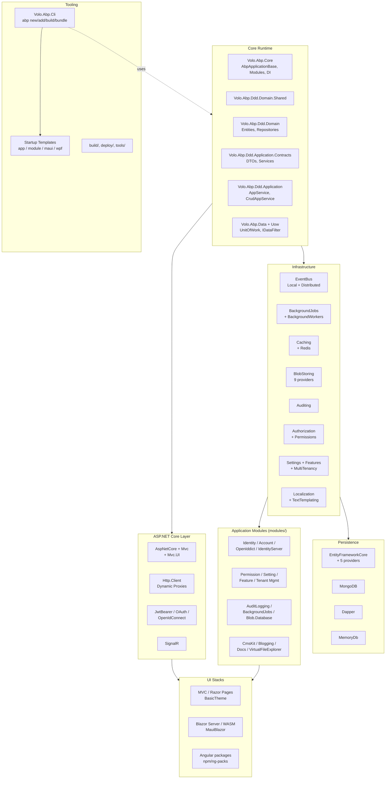

This wiki is an internal engineering reference for the [abpframework/abp](https://github.com/abpframework/abp) monorepo. It documents the runtime, layered packages, application modules, UI stacks, CLI, templates, and tooling exactly as they exist in the source tree. Every page is grounded in concrete file paths so coding agents and human engineers can navigate or modify the codebase without grepping.

The ABP Framework is an opinionated, modular **ASP.NET Core** application framework. It bundles a runtime (`Volo.Abp.Core`), a DDD layered model (`Volo.Abp.Ddd.*`), infrastructure packages (event bus, background jobs, caching, blob storing, etc.), pre-built business modules (Identity, Account, CmsKit, OpenIddict, …), three UI stacks (Razor/MVC, Blazor, Angular), a CLI (`Volo.Abp.Cli`), and startup templates. The repo is a multi-project .NET solution composed of **169 framework packages**, **19 application modules**, **15 Angular packages**, and dozens of build and tooling scripts.

## Architecture overview

## Repository map

The repo is organised by *role* rather than by feature. Most C# code lives under `framework/` and `modules/`; UI assets live under `npm/`; CLI lives under `framework/src/Volo.Abp.Cli*`.

| Path | Contains | Wiki page |
| ---- | -------- | --------- |
| `framework/src/` | 169 .NET packages — runtime, DDD layers, infrastructure, ASP.NET Core integration, CLI | [Repository layout](/overview/repository-layout) |
| `framework/test/` | xUnit test projects for every package in `framework/src/` | [Framework tests](/testing/framework-tests) |
| `modules/` | 19 pre-built business modules (Identity, Account, CmsKit, …) | [Application modules](/modules/overview) |
| `templates/` | Startup templates: `app`, `app-nolayers`, `module`, `console`, `maui`, `wpf` | [Startup templates](/templates/overview) |
| `npm/ng-packs/` | Angular packages (`@abp/ng.core`, `@abp/ng.theme.basic`, …) | [Angular packages](/angular/overview) |
| `npm/packs/` | JS/TS packs and vendor wrappers (jQuery, Bootstrap, DataTables, …) | [JS / TS packs](/js-packs/overview) |
| `studio/source-codes/` & `source-code/` | Source-code mirror SLNs used by ABP Studio's "get source" feature | [Repository layout](/overview/repository-layout) |
| `build/` | PowerShell scripts: `build-all.ps1`, `build-all-release.ps1`, `test-all.ps1` | [Build scripts](/build-deploy/build-scripts) |
| `deploy/` | Numbered PowerShell scripts: fetch/build, NuGet pack/push, NPM publish, GitHub release | [Deploy scripts](/build-deploy/deploy-scripts) |
| `tools/` | Auxiliary tools: changelog generator, localization key synchroniser, NuGet tooling | [Tools](/build-deploy/tools) |
| `ai-rules/` | `.mdc` rules consumed by coding agents (Cursor/Claude/etc.) | [AI rules](/build-deploy/ai-rules) |
| `docs/en/` | Markdown public documentation (not the wiki — published to abp.io/docs) | n/a |
| `apiSpec/` | Public-API surface specs (currently `Microsoft_AspNetCore_Routing_AbpEndpointRouterOptions.md`) | n/a |
| `test/` | Cross-cutting perf and distributed-event integration tests | [Framework tests](/testing/framework-tests) |
| `nupkg/` | Auxiliary NuGet outputs | [NuGet packaging](/build-deploy/nuget-packaging) |
| `lowcode/` | JSON schema for ABP Suite low-code generation | [Tech stack](/overview/tech-stack-and-dependencies) |
| `abp_io/` | Source for the abp.io marketing site (not part of the framework) | n/a |
| `Directory.Build.props`, `Directory.Packages.props`, `common.props`, `common.test.props` | Central MSBuild + NuGet central-package-management | [Directory.Build & Packages](/build-deploy/directory-build-and-packages) |

## Subsystem map

<CardGroup cols={2}>
  <Card title="Overview & layout" icon="map" href="/overview/architecture">
    Architecture, repository layout, modularity model, solution structure.
  </Card>
  <Card title="Core runtime" icon="microchip" href="/core/overview">
    `Volo.Abp.Core` — `AbpApplicationBase`, modules, DI, dynamic proxy, options.
  </Card>
  <Card title="DDD layers" icon="layer-group" href="/ddd/overview">
    `Domain.Shared`, `Domain`, `Application.Contracts`, `Application`, CRUD app services.
  </Card>
  <Card title="Data & persistence" icon="database" href="/data/overview">
    `Volo.Abp.Data`, UoW, EF Core, MongoDB, Dapper, MemoryDb, providers.
  </Card>
  <Card title="Infrastructure" icon="gears" href="/infrastructure/overview">
    Event bus, jobs, caching, blob storing, emailing, SMS, templating, Dapr, imaging.
  </Card>
  <Card title="Security & identity" icon="shield-halved" href="/security/overview">
    Authorization, permissions, features, settings, LDAP, GDPR, dynamic claims.
  </Card>
  <Card title="Cross-cutting" icon="screwdriver-wrench" href="/crosscutting/validation">
    Validation, localization, auditing contracts, object extending, serialization.
  </Card>
  <Card title="Multi-tenancy" icon="building" href="/multi-tenancy/overview">
    `ICurrentTenant`, tenant resolvers, configuration store, AspNetCore middleware.
  </Card>
  <Card title="ASP.NET Core integration" icon="globe" href="/aspnetcore/overview">
    MVC, Swashbuckle, API versioning, JWT/OAuth/OpenIdConnect, SignalR, Serilog.
  </Card>
  <Card title="HTTP client & proxies" icon="diagram-project" href="/http/overview">
    Dynamic remote-service proxies, IdentityModel, Dapr, Web client packages.
  </Card>
  <Card title="MVC / Razor Pages UI" icon="window-maximize" href="/ui-mvc/overview">
    Mvc.UI, Bootstrap tag helpers, Theme Shared, Widgets, Bundling, Minify.
  </Card>
  <Card title="Blazor UI" icon="bolt" href="/blazor/overview">
    Components Web/Server/WebAssembly/MauiBlazor + Theming + BlazoriseUI.
  </Card>
  <Card title="Application modules" icon="cubes" href="/modules/overview">
    Identity, Account, Permission/Setting/Feature/Tenant management, CmsKit, …
  </Card>
  <Card title="Angular packages" icon="angular" href="/angular/overview">
    `@abp/ng.core`, components, theme-shared/basic, oauth, identity, generators, schematics.
  </Card>
  <Card title="JS / TS packs" icon="js" href="/js-packs/overview">
    `npm/packs/*` — vendor wrappers for jQuery, Bootstrap, DataTables, Luxon, …
  </Card>
  <Card title="CLI tooling" icon="terminal" href="/cli/overview">
    `Volo.Abp.Cli` — `new`, `update`, `add-module`, `generate-proxy`, `bundle`, `install-libs`.
  </Card>
  <Card title="Startup templates" icon="folder-tree" href="/templates/overview">
    `app`, `app-nolayers`, `module`, `console`, `maui`, `wpf`.
  </Card>
  <Card title="Testing" icon="vial" href="/testing/overview">
    `AbpTestBase`, AspNetCore.TestBase, conventions across hundreds of test projects.
  </Card>
  <Card title="Build & deploy" icon="hammer" href="/build-deploy/overview">
    Central MSBuild, build scripts, NuGet/NPM publishing, GitHub release flow, AI rules.
  </Card>
  <Card title="Key flows" icon="route" href="/flows/application-startup">
    End-to-end traces: startup, request lifecycle, UoW, authz, events, jobs, multi-tenancy.
  </Card>
</CardGroup>

## Where to start

<Tip>
  If you are reading this cold, start with [Architecture](/overview/architecture) (the high-level model and module dependency rules), then [Repository layout](/overview/repository-layout) (a file-by-file tour of the source tree), then [Modularity model](/overview/modularity-model) (how `AbpModule` and `[DependsOn]` compose the runtime).
</Tip>

Key entry points to open first when navigating the code:

- **Bootstrap** — `framework/src/Volo.Abp.Core/Volo/Abp/AbpApplicationBase.cs` and `framework/src/Volo.Abp.Core/Volo/Abp/AbpApplicationFactory.cs`. Documented on [AbpApplication and bootstrap](/core/abp-application-and-bootstrap).
- **Module system** — `framework/src/Volo.Abp.Core/Volo/Abp/Modularity/AbpModule.cs`, `IAbpModule.cs`, `DependsOnAttribute.cs`. Documented on [Modularity and modules](/core/modularity-and-modules).
- **DDD root contracts** — `framework/src/Volo.Abp.Ddd.Domain/Volo/Abp/Domain/Entities/Entity.cs` and `IRepository.cs`. Documented on [Entities and aggregates](/ddd/domain-entities-and-aggregates) and [Repositories](/ddd/domain-repositories).
- **CLI** — `framework/src/Volo.Abp.Cli/Volo/Abp/Cli/Program.cs` and `AbpCliModule.cs`. Commands live in `framework/src/Volo.Abp.Cli.Core/Volo/Abp/Cli/Commands/`. Documented on [CLI overview](/cli/overview).
- **EF Core integration** — `framework/src/Volo.Abp.EntityFrameworkCore/Volo/Abp/EntityFrameworkCore/AbpDbContext.cs` and the per-provider packages. Documented on [Entity Framework Core](/data/entity-framework-core).
- **Application module reference** — `modules/identity/src/Volo.Abp.Identity.Domain/Volo/Abp/Identity/IdentityUser.cs` is a canonical example aggregate root. Documented on [Identity module](/modules/identity).

<Note>
  Pages in this wiki link to files using paths relative to the repo root (e.g. `framework/src/Volo.Abp.Core/Volo/Abp/AbpApplicationBase.cs`). Concatenate with `https://github.com/abpframework/abp/blob/dev/` to open in the browser.
</Note>
