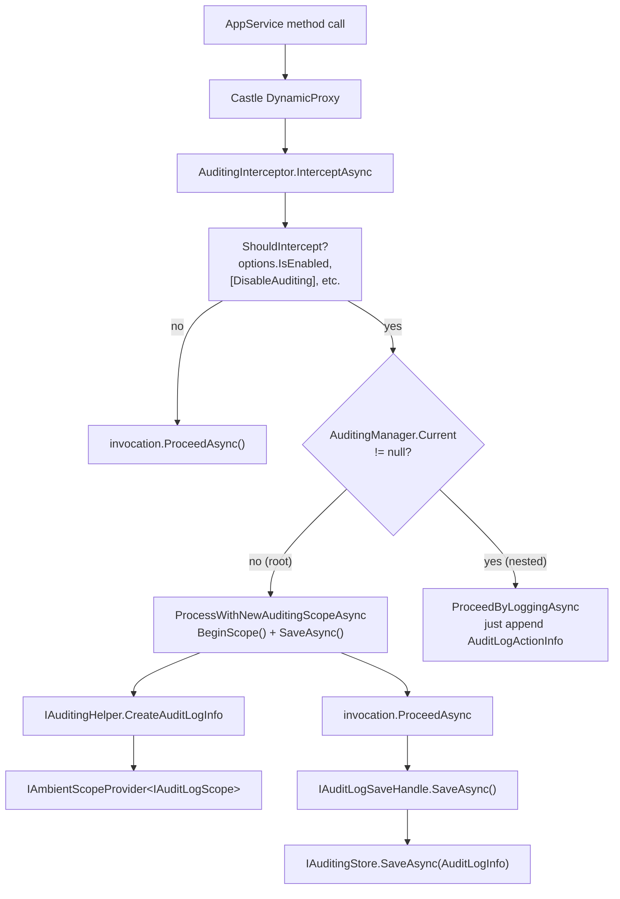
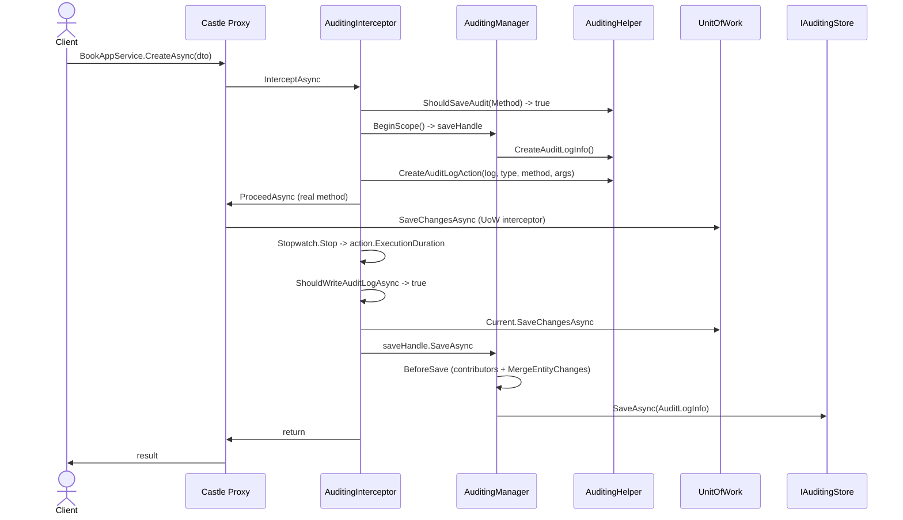

This page walks the **ABP Framework auditing pipeline** end‑to‑end: how `[Audited]` on a class or `IAuditingEnabled` marker causes `AuditingInterceptor` to wrap the call, how `IAuditingHelper` builds an `AuditLogInfo` per request and an `AuditLogActionInfo` per method, how `IAuditingManager.BeginScope()` stores the result in an ambient scope, and how `IAuditingStore.SaveAsync` ultimately persists it. All file paths are relative to `framework/src/Volo.Abp.Auditing/Volo/Abp/Auditing/` unless noted; attribute definitions live in the sibling `Volo.Abp.Auditing.Contracts` assembly.

## The contracts

Three small interfaces define the entire auditing surface, all in `framework/src/Volo.Abp.Auditing/Volo/Abp/Auditing/`:

```csharp
// IAuditingHelper.cs
public interface IAuditingHelper
{
    bool ShouldSaveAudit(MethodInfo? methodInfo, bool defaultValue = false, bool ignoreIntegrationServiceAttribute = false);
    bool IsEntityHistoryEnabled(Type entityType, bool defaultValue = false);
    AuditLogInfo CreateAuditLogInfo();
    AuditLogActionInfo CreateAuditLogAction(AuditLogInfo auditLog, Type? type, MethodInfo method, object?[] arguments);
    AuditLogActionInfo CreateAuditLogAction(AuditLogInfo auditLog, Type? type, MethodInfo method, IDictionary<string, object?> arguments);
    IDisposable DisableAuditing();
    bool IsAuditingEnabled();
}

// IAuditingManager.cs
public interface IAuditingManager
{
    IAuditLogScope? Current { get; }
    IAuditLogSaveHandle BeginScope();
}

// IAuditingStore.cs
public interface IAuditingStore
{
    Task SaveAsync(AuditLogInfo auditInfo);
}
```

The helper builds the data, the manager owns the ambient scope (and the `IAuditLogSaveHandle` returned by `BeginScope()` is what actually triggers `SaveAsync`), and the store is the persistence sink. `SimpleLogAuditingStore.cs` is the default sink and just calls `Logger.LogInformation(auditInfo.ToString())`; production deployments swap in the EF/Mongo store from the [Audit Logging module](/modules/audit-logging).

## Component diagram



The root‑scope/nested‑scope distinction (the `SCOPE` branch above) is what makes nested `[Audited]` services share a single audit log row: only the outermost call performs `BeginScope()` and the persistence callback.

## `AuditingInterceptor` in detail

`AuditingInterceptor.cs` is registered for every type matched by `AuditingInterceptorRegistrar.RegisterIfNeeded` (the registrar is in `AuditingInterceptorRegistrar.cs`). It derives from `Volo.Abp.DynamicProxy.AbpInterceptor` and overrides `InterceptAsync(IAbpMethodInvocation invocation)`:

```csharp
public override async Task InterceptAsync(IAbpMethodInvocation invocation)
{
    using (var serviceScope = _serviceScopeFactory.CreateScope())
    {
        var auditingHelper = serviceScope.ServiceProvider.GetRequiredService<IAuditingHelper>();
        var auditingOptions = serviceScope.ServiceProvider.GetRequiredService<IOptions<AbpAuditingOptions>>().Value;

        if (!ShouldIntercept(invocation, auditingOptions, auditingHelper))
        {
            await invocation.ProceedAsync();
            return;
        }

        var auditingManager = serviceScope.ServiceProvider.GetRequiredService<IAuditingManager>();
        if (auditingManager.Current != null)
        {
            await ProceedByLoggingAsync(invocation, auditingOptions, auditingHelper, auditingManager.Current);
        }
        else
        {
            var currentUser = serviceScope.ServiceProvider.GetRequiredService<ICurrentUser>();
            var unitOfWorkManager = serviceScope.ServiceProvider.GetRequiredService<IUnitOfWorkManager>();
            await ProcessWithNewAuditingScopeAsync(invocation, auditingOptions, currentUser, auditingManager, auditingHelper, unitOfWorkManager);
        }
    }
}
```

A few things stand out:

1. The interceptor **creates its own DI scope** (`_serviceScopeFactory.CreateScope()`), so the helper, options, and manager resolve from a fresh scope — this is important when the call originates from a background worker that has no ambient request scope.
2. `ShouldIntercept` short‑circuits when `options.IsEnabled == false`, when `AbpCrossCuttingConcerns.IsApplied(target, Auditing)` was set somewhere up the call stack, or when `IAuditingHelper.ShouldSaveAudit` returns false for the method.
3. `auditingManager.Current` — the ambient `IAuditLogScope` — distinguishes root from nested calls.

For the nested case, `ProceedByLoggingAsync` only adds a method-level row:

```csharp
auditLogAction = auditingHelper.CreateAuditLogAction(
    auditLog, invocation.TargetObject?.GetType(), invocation.Method, invocation.Arguments);
var stopwatch = Stopwatch.StartNew();
try { await invocation.ProceedAsync(); }
catch (Exception ex) { auditLog.Exceptions.Add(ex); throw; }
finally
{
    stopwatch.Stop();
    if (auditLogAction != null)
    {
        auditLogAction.ExecutionDuration = Convert.ToInt32(stopwatch.Elapsed.TotalMilliseconds);
        auditLog.Actions.Add(auditLogAction);
    }
}
```

`AuditLogActionInfo.ExecutionDuration` ends up as the per‑method timing in the persisted log; `auditLog.Exceptions` accumulates anything thrown anywhere in the call chain so the outer scope can decide whether to mark the log as a failure.

## Root scope: `ProcessWithNewAuditingScopeAsync`

The root‑call branch is more interesting because it owns the persistence decision:

```csharp
using (var saveHandle = auditingManager.BeginScope())
{
    try
    {
        await ProceedByLoggingAsync(invocation, options, auditingHelper, auditingManager.Current!);
        if (auditingManager.Current!.Log.Exceptions.Any()) hasError = true;
    }
    catch (Exception) { hasError = true; throw; }
    finally
    {
        if (await ShouldWriteAuditLogAsync(invocation, auditingManager.Current!.Log, options, currentUser, hasError))
        {
            if (unitOfWorkManager.Current != null)
            {
                try { await unitOfWorkManager.Current.SaveChangesAsync(); }
                catch (Exception ex)
                {
                    if (!auditingManager.Current.Log.Exceptions.Contains(ex))
                        auditingManager.Current.Log.Exceptions.Add(ex);
                }
            }
            await saveHandle.SaveAsync();
        }
    }
}
```

Two important behaviors live in this `finally`:

- **UoW flush before audit save.** The interceptor calls `unitOfWorkManager.Current.SaveChangesAsync()` first so that the audit log captures the post‑save state and so that any DbContext exception is recorded in `Log.Exceptions` before persistence. This is the cross‑link with [Unit of Work](/data/unit-of-work).
- **`ShouldWriteAuditLogAsync` is the policy gate.** It walks `options.AlwaysLogSelectors`, honors `AlwaysLogOnException` when an error occurred, suppresses anonymous calls when `IsEnabledForAnonymousUsers == false`, and skips GET requests unless `IsEnabledForGetRequests` is true. The full check from `AuditingInterceptor.cs`:

```csharp
if (!options.IsEnabledForGetRequests &&
    (string.Equals(auditLogInfo.HttpMethod, "Get", StringComparison.OrdinalIgnoreCase) ||
     string.Equals(auditLogInfo.HttpMethod, "Head", StringComparison.OrdinalIgnoreCase) ||
     invocation.Method.Name.StartsWith("Get", StringComparison.OrdinalIgnoreCase)))
{
    return false;
}
```

## Registration: who gets intercepted?

`AuditingInterceptorRegistrar.RegisterIfNeeded(IOnServiceRegistredContext)` runs during DI registration and decides which services receive the interceptor:

```csharp
private static bool ShouldIntercept(Type type)
{
    if (DynamicProxyIgnoreTypes.Contains(type)) return false;
    if (ShouldAuditTypeByDefaultOrNull(type, ignoreIntegrationServiceAttribute: true) == true) return true;
    if (type.GetMethods().Any(m => m.IsDefined(typeof(AuditedAttribute), true))) return true;
    return false;
}

public static bool? ShouldAuditTypeByDefaultOrNull(Type type, bool ignoreIntegrationServiceAttribute)
{
    if (type.IsDefined(typeof(AuditedAttribute), true)) return true;
    if (type.IsDefined(typeof(DisableAuditingAttribute), true)) return false;
    if (typeof(IAuditingEnabled).IsAssignableFrom(type))
    {
        if (ignoreIntegrationServiceAttribute || !IntegrationServiceAttribute.IsDefinedOrInherited(type))
            return true;
    }
    return null;
}
```

In practice three things trigger interception:

1. The class (or a base) is decorated with `[Audited]` from `Volo.Abp.Auditing.Contracts/Volo/Abp/Auditing/AuditedAttribute.cs`.
2. The class implements `IAuditingEnabled` (the marker interface every `ApplicationService` does).
3. Any individual method carries `[Audited]`.

A class decorated with `[DisableAuditing]` is explicitly excluded. The same attribute can also be applied to a property to suppress entity change logging — its `UpdateModificationProps` and `PublishEntityEvent` flags control whether changes to that property still touch `LastModificationTime` and trigger `EntityUpdatedEvent`:

```csharp
[AttributeUsage(AttributeTargets.Class | AttributeTargets.Method | AttributeTargets.Property)]
public class DisableAuditingAttribute : Attribute
{
    public bool UpdateModificationProps { get; set; } = true;
    public bool PublishEntityEvent { get; set; } = true;
}
```

The registrar plugs the interceptor in through `context.Interceptors.TryAdd<AuditingInterceptor>()`, which is the same mechanism described under [Dynamic proxy and interceptors](/core/dynamic-proxy-and-interceptors).

## `IAuditingHelper.ShouldSaveAudit`

`AuditingHelper.cs` (the default `IAuditingHelper` implementation) is registered as `ITransientDependency` and aggregates a lot of context:

```csharp
public AuditingHelper(
    IAuditSerializer auditSerializer,
    IOptions<AbpAuditingOptions> options,
    ICurrentUser currentUser,
    ICurrentTenant currentTenant,
    ICurrentClient currentClient,
    IClock clock,
    IAuditingStore auditingStore,
    ILogger<AuditingHelper> logger,
    IServiceProvider serviceProvider,
    ICorrelationIdProvider correlationIdProvider,
    IAmbientScopeProvider<AuditingDisabledState> auditingDisabledState)
```

`ShouldSaveAudit(MethodInfo? methodInfo, …)` filters on method visibility, `[Audited]` / `[DisableAuditing]` attributes, the global toggle in `AbpAuditingOptions`, and the runtime "disabled" flag held in `AuditingDisabledState` (set by `DisableAuditing()`). The disabled state is an `AmbientScopeProvider` so it can be opened around a specific block: `using (auditingHelper.DisableAuditing()) { … }` skips audit emission inside that scope.

`CreateAuditLogInfo()` snapshots the request context: `ApplicationName` (`AbpAuditingOptions.ApplicationName`), `UserId`/`UserName`/`TenantId`/`TenantName` from `ICurrentUser`/`ICurrentTenant`, `ClientId` from `ICurrentClient`, `CorrelationId` from `ICorrelationIdProvider`, `ExecutionTime` from `IClock.Now`, plus empty `Actions`, `EntityChanges`, `Exceptions`, and `Comments` collections.

`CreateAuditLogAction(AuditLogInfo, Type?, MethodInfo, object?[])` serializes the arguments — skipping anything in `AbpAuditingOptions.IgnoredTypes` (defaults to `Stream`, `Expression`, `CancellationToken`) — using `IAuditSerializer`. The default serializer `JsonAuditSerializer.cs` uses `System.Text.Json`.

## `AuditingManager` and the ambient scope

`AuditingManager.cs` is the second core class. It uses `IAmbientScopeProvider<IAuditLogScope>` to push/pop the scope:

```csharp
private const string AmbientContextKey = "Volo.Abp.Auditing.IAuditLogScope";

public IAuditLogScope? Current => _ambientScopeProvider.GetValue(AmbientContextKey);

public IAuditLogSaveHandle BeginScope()
{
    var ambientScope = _ambientScopeProvider.BeginScope(
        AmbientContextKey,
        new AuditLogScope(_auditingHelper.CreateAuditLogInfo())
    );
    return new DisposableSaveHandle(this, ambientScope, Current!.Log, Stopwatch.StartNew());
}
```

`DisposableSaveHandle` implements `IAuditLogSaveHandle`. Its `SaveAsync()` calls back into the manager's `SaveAsync(this)`, which runs:

```csharp
protected virtual async Task SaveAsync(DisposableSaveHandle saveHandle)
{
    BeforeSave(saveHandle);              // stop stopwatch, run contributors, merge entity changes
    await _auditingStore.SaveAsync(saveHandle.AuditLog);
}
```

`BeforeSave` invokes every registered `AuditLogContributor.PostContribute` (from `AbpAuditingOptions.Contributors`) — that is the extension point where, for example, the ASP.NET Core layer attaches `HttpMethod`, `Url`, and remote address. After contributors run, `MergeEntityChanges` collapses multiple `Updated` rows for the same `(EntityTypeFullName, EntityId)` pair into a single row by calling `EntityChangeInfo.Merge`.

The handle is `IDisposable`; disposing it pops the ambient scope. The interceptor's `using (var saveHandle = auditingManager.BeginScope())` therefore guarantees scope cleanup even if `SaveAsync` is never called (for example when `ShouldWriteAuditLogAsync` returns false).

## `AbpAuditingOptions`

Every knob lives on `AbpAuditingOptions.cs`:

| Property | Default | Purpose |
| --- | --- | --- |
| `IsEnabled` | `true` | Master switch. When false, `AuditingInterceptor.ShouldIntercept` returns false and nothing fires. |
| `HideErrors` | `true` | Catch and log exceptions thrown by `IAuditingStore.SaveAsync` rather than propagating. |
| `ApplicationName` | `null` | Stamped onto every `AuditLogInfo.ApplicationName`. |
| `IsEnabledForAnonymousUsers` | `true` | If false, audit logs are skipped when `ICurrentUser.IsAuthenticated == false`. |
| `AlwaysLogOnException` | `true` | Force a write when `auditLog.Exceptions.Any()` is true. |
| `IsEnabledForIntegrationServices` | `false` | When false (default), `[IntegrationService]` types are not audited; the registrar already skips them via `ignoreIntegrationServiceAttribute`. |
| `IsEnabledForGetRequests` | `false` | When false, GETs / HEADs / methods named `Get*` are skipped. |
| `DisableLogActionInfo` | `false` | When true, only the outer scope is logged; method‑level `AuditLogActionInfo` rows are suppressed. |
| `SaveEntityHistoryWhenNavigationChanges` | `true` | Forwarded to EF Core change tracking. |
| `AlwaysLogSelectors` | `List<Func<AuditLogInfo, Task<bool>>>` | Custom predicates that force a write. |
| `Contributors` | `List<AuditLogContributor>` | Post‑process hooks (HTTP, browser info, etc.). |
| `IgnoredTypes` | `Stream`, `Expression`, `CancellationToken` | Argument types excluded from serialization. |
| `EntityHistorySelectors` | `IEntityHistorySelectorList` | Predicates that enable per‑entity change tracking. |

A typical application configures this in its module:

```csharp
Configure<AbpAuditingOptions>(options =>
{
    options.ApplicationName = "Acme.Bookstore";
    options.IsEnabledForGetRequests = true;
    options.EntityHistorySelectors.AddAllEntities();
});
```

## `[Audited]` and `[DisableAuditing]`

Both attributes live in `framework/src/Volo.Abp.Auditing.Contracts/Volo/Abp/Auditing/`:

```csharp
// AuditedAttribute.cs
[AttributeUsage(AttributeTargets.Class | AttributeTargets.Method | AttributeTargets.Property)]
public class AuditedAttribute : Attribute { }

// DisableAuditingAttribute.cs (excerpt)
[AttributeUsage(AttributeTargets.Class | AttributeTargets.Method | AttributeTargets.Property)]
public class DisableAuditingAttribute : Attribute
{
    public bool UpdateModificationProps { get; set; } = true;
    public bool PublishEntityEvent { get; set; } = true;
}
```

| Attribute | On a class | On a method | On a property |
| --- | --- | --- | --- |
| `[Audited]` | Opt the class in (overrides everything except `[DisableAuditing]` at the same level). | Opt one method in on a non‑audited class. | Marker for entity change tracking. |
| `[DisableAuditing]` | Exclude the class even if it implements `IAuditingEnabled`. | Exclude one method. | Skip the property in entity history; `UpdateModificationProps` and `PublishEntityEvent` give finer control. |

The decision logic — including the resolution order between `[Audited]` and `[DisableAuditing]` — is in `AuditingInterceptorRegistrar.ShouldAuditTypeByDefaultOrNull` quoted above, and the corresponding runtime check is `AuditingHelper.ShouldSaveAudit`.

## Disabling auditing programmatically

For ad‑hoc suppression (for example inside a data seeder that does not want audit log noise), call `IAuditingHelper.DisableAuditing()`:

```csharp
using (_auditingHelper.DisableAuditing())
{
    await SeedDemoDataAsync();
}
```

The implementation is an `IAmbientScopeProvider<AuditingDisabledState>` push (`AuditingDisabledState.cs`); both `ShouldSaveAudit` and `IsAuditingEnabled` consult it. Because it is ambient/async‑local, the disable propagates across `await` boundaries within the same logical context.

## Persistence

`IAuditingStore.SaveAsync(AuditLogInfo)` is the only method an alternative store must implement. The framework default is intentionally minimal:

```csharp
[Dependency(TryRegister = true)]
public class SimpleLogAuditingStore : IAuditingStore, ISingletonDependency
{
    public ILogger<SimpleLogAuditingStore> Logger { get; set; } = NullLogger<SimpleLogAuditingStore>.Instance;
    public Task SaveAsync(AuditLogInfo auditInfo)
    {
        Logger.LogInformation(auditInfo.ToString());
        return Task.FromResult(0);
    }
}
```

`TryRegister = true` means another module can register `IAuditingStore` without colliding. That is exactly how the [Audit Logging module](/modules/audit-logging) substitutes its EF Core / MongoDB implementation; the framework package itself never touches a database.

## Worked example

The end‑to‑end pipeline for a single application service call:



Notice that the audit save happens **after** the unit of work flushes its changes. Entity changes therefore reach `AuditLogInfo.EntityChanges` (populated by the EF Core / Mongo provider hooks) before persistence; `MergeEntityChanges` then collapses duplicates. If `IAuditingStore.SaveAsync` throws and `HideErrors == true`, the failure is logged and the original method result still propagates.

## Cross‑references

| Concern | See |
| --- | --- |
| Interceptor registration plumbing | [Dynamic proxy and interceptors](/core/dynamic-proxy-and-interceptors) |
| `UnitOfWorkManager.Current.SaveChangesAsync` semantics | [Unit of Work](/data/unit-of-work) |
| EF / Mongo audit store implementations | [Audit Logging module](/modules/audit-logging) |
| `ICurrentTenant` capture in `CreateAuditLogInfo` | [Multi‑tenancy](/multi-tenancy/overview) |
| Distributed events fired alongside entity changes | [Event publish and handle](/flows/event-publish-and-handle) |
