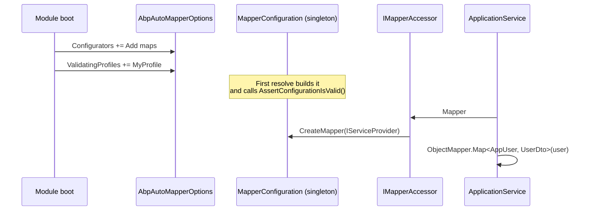

`Volo.Abp.AutoMapper` plugs the [AutoMapper](https://automapper.org/) library into ABP's `IObjectMapper` abstraction so application code keeps using `_mapper.Map<TSource, TDest>(source)` while profiles, value resolvers and type converters compose normally. This page covers `AbpAutoMapperOptions`, the `IAbpAutoMapperConfigurationContext`, profile registration and validation, the singleton `IConfigurationProvider` build, `IMapperAccessor`, and the per-context `IObjectMapper<TContext>` registration used by ABP modules to isolate their profiles.

## Module wiring at a glance

`framework/src/Volo.Abp.AutoMapper/Volo/Abp/AutoMapper/AbpAutoMapperModule.cs` is the entry point. It registers a conventional registrar for AutoMapper's open generics (resolvers, converters, mapping actions), builds the singleton `IConfigurationProvider`, exposes `IMapper`, and wires `IMapperAccessor`:

```csharp AbpAutoMapperModule.cs
[DependsOn(
    typeof(AbpObjectMappingModule),
    typeof(AbpObjectExtendingModule),
    typeof(AbpAuditingModule)
)]
public class AbpAutoMapperModule : AbpModule
{
    public override void PreConfigureServices(ServiceConfigurationContext context)
    {
        context.Services.AddConventionalRegistrar(new AbpAutoMapperConventionalRegistrar());
    }

    public override void ConfigureServices(ServiceConfigurationContext context)
    {
        context.Services.AddAutoMapperObjectMapper();

        context.Services.AddSingleton<IConfigurationProvider>(sp =>
        {
            using (var scope = sp.CreateScope())
            {
                var options = scope.ServiceProvider
                    .GetRequiredService<IOptions<AbpAutoMapperOptions>>().Value;

                var expression = sp.GetRequiredService<IOptions<MapperConfigurationExpression>>().Value;
                var ctx = new AbpAutoMapperConfigurationContext(expression, scope.ServiceProvider);

                foreach (var configurator in options.Configurators)
                    configurator(ctx);

                var mapperConfiguration = new MapperConfiguration(expression);

                foreach (var profileType in options.ValidatingProfiles)
                {
                    mapperConfiguration.Internal().AssertConfigurationIsValid(
                        ((Profile)Activator.CreateInstance(profileType)!).ProfileName);
                }

                return mapperConfiguration;
            }
        });

        context.Services.AddTransient<IMapper>(sp =>
            sp.GetRequiredService<IConfigurationProvider>().CreateMapper(sp.GetService));

        context.Services.AddTransient<MapperAccessor>(sp => new MapperAccessor() { Mapper = sp.GetRequiredService<IMapper>() });
        context.Services.AddTransient<IMapperAccessor>(provider => provider.GetRequiredService<MapperAccessor>());
    }
}
```

Three takeaways:

1. `IConfigurationProvider` is a **singleton** built lazily from `AbpAutoMapperOptions.Configurators` — every module appends a configurator there, and the framework runs them all once at boot.
2. `IMapper` and `IMapperAccessor` are transient — but they share the singleton configuration, so allocating one per request is cheap.
3. `services.AddAutoMapperObjectMapper()` replaces `IAutoObjectMappingProvider` with `AutoMapperAutoObjectMappingProvider`, so `IObjectMapper.Map<TS,TD>(source)` now flows through AutoMapper for unmatched pairs.

## AbpAutoMapperOptions

`framework/src/Volo.Abp.AutoMapper/Volo/Abp/AutoMapper/AbpAutoMapperOptions.cs` is where every module adds its profiles:

```csharp AbpAutoMapperOptions.cs
public class AbpAutoMapperOptions
{
    public List<Action<IAbpAutoMapperConfigurationContext>> Configurators { get; }
    public ITypeList<Profile> ValidatingProfiles { get; set; }

    public void AddMaps<TModule>(bool validate = false)
    {
        var assembly = typeof(TModule).Assembly;
        Configurators.Add(context => context.MapperConfiguration.AddMaps(assembly));

        if (validate)
        {
            var profileTypes = assembly.DefinedTypes
                .Where(t => typeof(Profile).IsAssignableFrom(t) && !t.IsAbstract && !t.IsGenericType);
            foreach (var profileType in profileTypes)
                ValidatingProfiles.Add(profileType);
        }
    }

    public void AddProfile<TProfile>(bool validate = false) where TProfile : Profile, new()
    {
        Configurators.Add(context => context.MapperConfiguration.AddProfile<TProfile>());
        if (validate) ValidateProfile(typeof(TProfile));
    }

    public void ValidateProfile<TProfile>(bool validate = true) where TProfile : Profile { ... }
}
```

| API | Purpose |
| --- | --- |
| `AddMaps<TModule>()` | Scan the module's assembly for any `Profile` and register them all at once. |
| `AddProfile<TProfile>()` | Register a single profile. |
| `validate: true` | Add the profile(s) to `ValidatingProfiles` so `IConfigurationProvider` calls `AssertConfigurationIsValid` for them at boot. |
| `Configurators` | Free-form `Action<IAbpAutoMapperConfigurationContext>` — add it directly when you need to call `CreateMap` outside a profile. |

A typical module:

```csharp
public override void ConfigureServices(ServiceConfigurationContext context)
{
    Configure<AbpAutoMapperOptions>(options =>
    {
        options.AddMaps<MyAppApplicationModule>(validate: true);
    });
}
```

## AbpAutoMapperConfigurationContext

`AbpAutoMapperConfigurationContext` carries the AutoMapper expression and the scoped service provider so configurators can resolve services (e.g. `IOptions<MyMappingOptions>`) while they configure profiles:

```csharp AbpAutoMapperConfigurationContext.cs
public class AbpAutoMapperConfigurationContext : IAbpAutoMapperConfigurationContext
{
    public IMapperConfigurationExpression MapperConfiguration { get; }
    public IServiceProvider ServiceProvider { get; }
}
```

```csharp IAbpAutoMapperConfigurationContext.cs
public interface IAbpAutoMapperConfigurationContext
{
    IMapperConfigurationExpression MapperConfiguration { get; }
    IServiceProvider ServiceProvider { get; }
}
```

The `IServiceProvider` is a **scoped** one — created inside the singleton factory and disposed after configuration. Use it for read-only setup data; do not capture it.

## AutoMapperAutoObjectMappingProvider

The replacement for `IAutoObjectMappingProvider` is in `AutoMapperAutoObjectMappingProvider.cs`:

```csharp AutoMapperAutoObjectMappingProvider.cs
public class AutoMapperAutoObjectMappingProvider : IAutoObjectMappingProvider
{
    public IMapperAccessor MapperAccessor { get; }

    public AutoMapperAutoObjectMappingProvider(IMapperAccessor mapperAccessor)
    {
        MapperAccessor = mapperAccessor;
    }

    public virtual TDestination Map<TSource, TDestination>(object source)
        => MapperAccessor.Mapper.Map<TDestination>(source);

    public virtual TDestination Map<TSource, TDestination>(TSource source, TDestination destination)
        => MapperAccessor.Mapper.Map(source, destination);
}
```

There is a generic variant `AutoMapperAutoObjectMappingProvider<TContext>` for module-scoped mappers — see below.

## IMapperAccessor

`IMapperAccessor` is the seam between `AutoMapperAutoObjectMappingProvider` and the concrete `IMapper`. Module-context-aware mappers replace the accessor's `Mapper` with a context-specific `IMapper` so the same provider class can serve multiple modules:

```csharp IMapperAccessor.cs
public interface IMapperAccessor
{
    IMapper Mapper { get; }
}
```

`MapperAccessor` is the mutable default; the typical pattern is to inject `IMapperAccessor` if you need raw `IMapper` access outside of `IObjectMapper`:

```csharp AbpAutoMapperObjectMapperExtensions.cs
public static IMapper GetMapper(this IObjectMapper objectMapper)
    => objectMapper.AutoObjectMappingProvider.GetMapper();

public static IMapper GetMapper(this IAutoObjectMappingProvider autoObjectMappingProvider)
{
    if (autoObjectMappingProvider is AutoMapperAutoObjectMappingProvider p)
        return p.MapperAccessor.Mapper;
    throw new AbpException($"Given object is not an instance of {typeof(AutoMapperAutoObjectMappingProvider)}");
}
```

Use `_objectMapper.GetMapper()` when you need AutoMapper-specific APIs (`Project()` for LINQ, `ResolveUsing` with services).

## Conventional registrar for AutoMapper services

`AbpAutoMapperConventionalRegistrar` extends `DefaultConventionalRegistrar` so AutoMapper's resolver / converter / mapping-action implementations are registered as transients automatically:

```csharp AbpAutoMapperConventionalRegistrar.cs
public class AbpAutoMapperConventionalRegistrar : DefaultConventionalRegistrar
{
    protected readonly Type[] OpenTypes = {
        typeof(IValueResolver<,,>),
        typeof(IMemberValueResolver<,,,>),
        typeof(ITypeConverter<,>),
        typeof(IValueConverter<,>),
        typeof(IMappingAction<,>)
    };

    protected override bool IsConventionalRegistrationDisabled(Type type)
        => !type.GetInterfaces().Any(x => x.IsGenericType && OpenTypes.Contains(x.GetGenericTypeDefinition()))
           || base.IsConventionalRegistrationDisabled(type);

    protected override ServiceLifetime? GetDefaultLifeTimeOrNull(Type type) => ServiceLifetime.Transient;
}
```

So if you write `class TenantNameResolver : IValueResolver<AppUser, UserDto, string>`, ABP auto-registers it — AutoMapper's `MapFrom<TenantNameResolver>()` resolves the instance through DI.

## Module-context mappers

`AbpAutoMapperServiceCollectionExtensions.AddAutoMapperObjectMapper<TContext>` registers a context-specific provider so a module can have its own AutoMapper configuration without leaking into the host:

```csharp AbpAutoMapperServiceCollectionExtensions.cs
public static IServiceCollection AddAutoMapperObjectMapper<TContext>(this IServiceCollection services)
{
    return services.Replace(
        ServiceDescriptor.Transient<IAutoObjectMappingProvider<TContext>,
                                    AutoMapperAutoObjectMappingProvider<TContext>>());
}
```

Combine with the `IObjectMapper<TContext>` registration in `AbpObjectMappingModule` to get per-module mapping isolation:

```csharp
context.Services.AddAutoMapperObjectMapper<IdentityModule>();
```

Inject `IObjectMapper<IdentityModule>` and you get a context-bound mapper that uses only the AutoMapper configuration the Identity module added.

## Profile example

```csharp
public class MyAppProfile : Profile
{
    public MyAppProfile()
    {
        CreateMap<AppUser, UserDto>()
            .ForMember(d => d.Email, opt => opt.MapFrom(s => s.Email.ToLower()));

        CreateMap<CreateUserDto, AppUser>();
    }
}

[DependsOn(typeof(AbpAutoMapperModule))]
public class MyAppApplicationModule : AbpModule
{
    public override void ConfigureServices(ServiceConfigurationContext context)
    {
        Configure<AbpAutoMapperOptions>(o => o.AddMaps<MyAppApplicationModule>(validate: true));
    }
}
```

`validate: true` runs `AssertConfigurationIsValid` for every profile in the assembly — boot fails fast if a member is unmapped.

## Lifecycle picture



`CreateMapper(sp.GetService)` is how AutoMapper resolves value resolvers/type converters from DI — `sp` is the request-scope provider, so resolvers participate in the unit-of-work scope.

## Patterns and pitfalls

| Pattern | What to do |
| --- | --- |
| Validate at boot | `options.AddMaps<MyModule>(validate: true);` |
| Map LINQ projections | `_objectMapper.GetMapper().ProjectTo<UserDto>(query)` |
| Custom resolver with services | Implement `IValueResolver<,,>` — auto-registered. |
| Different mapper per module | `services.AddAutoMapperObjectMapper<MyModule>()` + inject `IObjectMapper<MyModule>`. |
| Map into existing entity | `_objectMapper.Map(input, entity);` — preserves the entity reference. |
| Avoid re-running configurators | Only `IConfigurationProvider` is singleton — never new up a `MapperConfiguration` manually outside the module. |

## See also

- [/infrastructure/overview](/infrastructure/overview)
- [/infrastructure/object-mapping](/infrastructure/object-mapping) — abstraction this module plugs into.
- [/infrastructure/mapperly-integration](/infrastructure/mapperly-integration) — alternative auto provider.
- [/ddd/object-extending](/ddd/object-extending) — `AbpObjectExtendingModule` (a dependency) wires extra-property mapping after AutoMapper passes.
- [/ddd/application-services](/ddd/application-services) — `ApplicationService.ObjectMapper` consumer.
