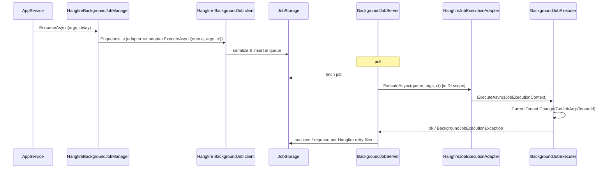

`Volo.Abp.BackgroundJobs.HangFire` is the **Hangfire adapter** for ABP's `IBackgroundJobManager`. When the module is loaded, `HangfireBackgroundJobManager` replaces `DefaultBackgroundJobManager`, the in‑memory `IBackgroundJobStore` is bypassed entirely, and `Hangfire.BackgroundJob.Enqueue` / `BackgroundJob.Schedule` is called instead. This page covers the manager, the `HangfireJobExecutionAdapter<TArgs>` that lets Hangfire invoke ABP jobs, the queue resolution rules, and the `AbpHangfireOptions` knobs that affect the bus.

## Files

```text
framework/src/Volo.Abp.BackgroundJobs.HangFire/Volo/Abp/BackgroundJobs/Hangfire/
  AbpBackgroundJobsHangfireModule.cs
  AbpDashboardOptionsProvider.cs
  HangfireBackgroundJobManager.cs
  HangfireJobExecutionAdapter.cs

framework/src/Volo.Abp.HangFire/Volo/Abp/Hangfire/
  AbpHangfireModule.cs
  AbpHangfireOptions.cs
  AbpHangfireOptionsConfiguration.cs
  AbpHangfireBackgroundJobServer.cs
  AbpHangfireAuthorizationFilter.cs
```

The `BackgroundJobs.HangFire` package depends on `Volo.Abp.HangFire`, which owns the `BackgroundJobServer` lifecycle.

## `HangfireBackgroundJobManager`

```csharp
[Dependency(ReplaceServices = true)]
public class HangfireBackgroundJobManager : IBackgroundJobManager, ITransientDependency
{
    protected IOptions<AbpBackgroundJobOptions> BackgroundJobOptions { get; }
    protected IOptions<AbpHangfireOptions> HangfireOptions { get; }

    public HangfireBackgroundJobManager(
        IOptions<AbpBackgroundJobOptions> backgroundJobOptions,
        IOptions<AbpHangfireOptions> hangfireOptions)
    {
        BackgroundJobOptions = backgroundJobOptions;
        HangfireOptions = hangfireOptions;
    }

    public virtual Task<string> EnqueueAsync<TArgs>(TArgs args,
        BackgroundJobPriority priority = BackgroundJobPriority.Normal, TimeSpan? delay = null)
    {
        return Task.FromResult(delay.HasValue
            ? BackgroundJob.Schedule<HangfireJobExecutionAdapter<TArgs>>(
                adapter => adapter.ExecuteAsync(GetQueueName(typeof(TArgs)), args, default),
                delay.Value)
            : BackgroundJob.Enqueue<HangfireJobExecutionAdapter<TArgs>>(
                adapter => adapter.ExecuteAsync(GetQueueName(typeof(TArgs)), args, default)));
    }

    protected virtual string GetQueueName(Type argsType)
    {
        var queueAttribute = BackgroundJobOptions.Value.GetJob(argsType).JobType
            .GetCustomAttribute<QueueAttribute>();
        return queueAttribute != null
            ? HangfireOptions.Value.DefaultQueuePrefix + queueAttribute.Queue
            : HangfireOptions.Value.DefaultQueue;
    }
}
```

Three observations:

- **Manager state is none.** Every call creates a Hangfire `Job` object by capturing the lambda `adapter => adapter.ExecuteAsync(queue, args, token)`. Hangfire records this as the method to invoke and serializes the args.
- **Queue selection is by attribute.** `BackgroundJobOptions.GetJob(argsType).JobType.GetCustomAttribute<QueueAttribute>()` — the `QueueAttribute` Hangfire ships with — is what routes jobs to specific queues. With no attribute, `AbpHangfireOptions.DefaultQueue` wins (Hangfire's `"default"` by default).
- **`BackgroundJobPriority` is ignored** because Hangfire has no built‑in priority. To approximate priority, use named queues (`Critical`, `Normal`, `Low`) plus an `AbpHangfireOptions.ServerOptions.Queues` array that lists them in priority order.

`Task.FromResult` on the return value is a synchronous facade — Hangfire's `Enqueue` is synchronous, but the ABP API is async, so the result is wrapped.

## `HangfireJobExecutionAdapter<TArgs>`

```csharp
public class HangfireJobExecutionAdapter<TArgs>
{
    protected AbpBackgroundJobOptions Options { get; }
    protected IServiceScopeFactory ServiceScopeFactory { get; }
    protected IBackgroundJobExecuter JobExecuter { get; }

    [Queue("{0}")]
    public async Task ExecuteAsync(string queue, TArgs args, CancellationToken cancellationToken = default)
    {
        if (!Options.IsJobExecutionEnabled)
        {
            throw new AbpException("Background job execution is disabled. " +
                $"This method should not be called! If you want to enable the background job execution, " +
                $"set {nameof(AbpBackgroundJobOptions)}.{nameof(AbpBackgroundJobOptions.IsJobExecutionEnabled)} to true!");
        }

        using (var scope = ServiceScopeFactory.CreateScope())
        {
            var jobType = Options.GetJob(typeof(TArgs)).JobType;
            var context = new JobExecutionContext(scope.ServiceProvider, jobType, args!, cancellationToken: cancellationToken);
            await JobExecuter.ExecuteAsync(context);
        }
    }
}
```

The class is generic on `TArgs` so Hangfire serializes one args object per job. Three details matter:

- **`[Queue("{0}")]`** — Hangfire's `[Queue]` attribute supports a format placeholder over method arguments; `{0}` resolves to the first argument value, which is the queue name produced by `HangfireBackgroundJobManager.GetQueueName`. This is how *per‑args‑type* queue routing is communicated to Hangfire without needing a distinct `HangfireJobExecutionAdapter` per queue.
- **Fresh DI scope per invocation.** `ServiceScopeFactory.CreateScope()` gives every job a clean scope — same isolation guarantee as the default `BackgroundJobWorker`.
- **The adapter forwards to `IBackgroundJobExecuter`**, so the same code path (multi‑tenant entry, exception wrapping in `BackgroundJobExecutionException`) runs as in the default provider.

## `AbpHangfireOptions`

`AbpHangfireOptions.cs` is the bridge between ABP and Hangfire's `BackgroundJobServer`:

```csharp
public class AbpHangfireOptions
{
    public string DefaultQueuePrefix { get; set; } = string.Empty;
    public int MaxQueueNameLength { get; set; } = 50;
    public string DefaultQueue { get; set; } = EnqueuedState.DefaultQueue;
    public BackgroundJobServerOptions? ServerOptions { get; set; }
    public IEnumerable<IBackgroundProcess>? AdditionalProcesses { get; set; }
    public JobStorage? Storage { get; set; }
    public Func<IServiceProvider, BackgroundJobServer?> BackgroundJobServerFactory { get; set; }
    /* … */
}
```

| Property | Default | Effect |
| --- | --- | --- |
| `DefaultQueuePrefix` | `""` | Prepended to every `[Queue]` value. Lets multiple deployments share storage. |
| `MaxQueueNameLength` | `50` | Validation cap. |
| `DefaultQueue` | Hangfire's `default` | Used when the job type has no `[Queue]`. |
| `ServerOptions` | `null` (defaults) | `BackgroundJobServerOptions` — workers count, polling interval, queues array. |
| `AdditionalProcesses` | `null` | Extra `IBackgroundProcess` instances bolted onto the server. |
| `Storage` | `null` (DI resolves `JobStorage`) | Override storage explicitly. |
| `BackgroundJobServerFactory` | `CreateJobServer` (see below) | Replaceable factory. Setting it to `_ => null` disables the server. |

The default factory:

```csharp
private BackgroundJobServer CreateJobServer(IServiceProvider serviceProvider)
{
    Storage = Storage ?? serviceProvider.GetRequiredService<JobStorage>();
    ServerOptions = ServerOptions ?? serviceProvider.GetService<BackgroundJobServerOptions>() ?? new BackgroundJobServerOptions();
    AdditionalProcesses = AdditionalProcesses ?? serviceProvider.GetServices<IBackgroundProcess>();

    return new BackgroundJobServer(ServerOptions, Storage, AdditionalProcesses,
        ServerOptions.FilterProvider ?? serviceProvider.GetRequiredService<IJobFilterProvider>(),
        ServerOptions.Activator ?? serviceProvider.GetRequiredService<JobActivator>(),
        serviceProvider.GetService<IBackgroundJobFactory>(),
        serviceProvider.GetService<IBackgroundJobPerformer>(),
        serviceProvider.GetService<IBackgroundJobStateChanger>());
}
```

This is where the Hangfire server is *constructed* but not started — `AbpHangfireBackgroundJobServer` is what starts it as an `IHostedService`.

## Module wiring

`AbpBackgroundJobsHangfireModule.cs`:

```csharp
[DependsOn(typeof(AbpBackgroundJobsAbstractionsModule), typeof(AbpHangfireModule))]
public class AbpBackgroundJobsHangfireModule : AbpModule
{
    public override void ConfigureServices(ServiceConfigurationContext context)
    {
        context.Services.AddTransient(sp =>
            sp.GetRequiredService<AbpDashboardOptionsProvider>().Get());
    }

    public override void OnPreApplicationInitialization(ApplicationInitializationContext context)
    {
        var options = context.ServiceProvider.GetRequiredService<IOptions<AbpBackgroundJobOptions>>().Value;
        if (!options.IsJobExecutionEnabled)
        {
            var hangfireOptions = context.ServiceProvider.GetRequiredService<IOptions<AbpHangfireOptions>>().Value;
            context.ServiceProvider.GetRequiredService<JobStorage>();
            hangfireOptions.BackgroundJobServerFactory = _ => null;
        }
    }
}
```

The dashboard options come from `AbpDashboardOptionsProvider` (a wrapper around `Hangfire.Dashboard.DashboardOptions`). The pre‑init step nulls the `BackgroundJobServerFactory` when `IsJobExecutionEnabled == false`, which is the standard ABP pattern for "this process only enqueues; another process executes." `JobStorage` is still resolved so the manager can read/write the storage.

## Lifecycle



Hangfire's own retry behavior (configured through `AutomaticRetryAttribute` on `BackgroundJobServerOptions.FilterProvider` or globally) is what controls retries, **not** the ABP `AbpBackgroundJobWorkerOptions` math — that math only applies to the default in‑process worker.

## Queue routing example

```csharp
[Queue("emails")]
public class SendEmailJob : AsyncBackgroundJob<SendEmailJobArgs>, ITransientDependency
{
    /* … */
}
```

Two effects:

1. `GetQueueName(typeof(SendEmailJobArgs))` returns `HangfireOptions.DefaultQueuePrefix + "emails"`.
2. The `[Queue("{0}")]` attribute on `HangfireJobExecutionAdapter.ExecuteAsync` ensures Hangfire routes the job's `Job` row to the `emails` queue at enqueue time.

The Hangfire server must list `emails` in its `BackgroundJobServerOptions.Queues` array for any worker to pick it up. The default options list only `["default"]`, so adding a queue requires:

```csharp
Configure<AbpHangfireOptions>(options =>
{
    options.ServerOptions = new BackgroundJobServerOptions
    {
        Queues = new[] { "critical", "emails", "default" }  // priority order
    };
});
```

Hangfire workers process queues in array order, which is the closest equivalent to `BackgroundJobPriority`.

## Disabling execution

```csharp
Configure<AbpBackgroundJobOptions>(options => options.IsJobExecutionEnabled = false);
```

This single flag causes:

1. `HangfireJobExecutionAdapter.ExecuteAsync` to throw immediately if Hangfire ever invokes it (defense in depth).
2. `AbpBackgroundJobsHangfireModule.OnPreApplicationInitialization` to null out `BackgroundJobServerFactory`, so the server never starts.

Enqueue continues to work — useful for the enqueue/execute split deployment pattern.

## Schedule vs Enqueue

```csharp
return Task.FromResult(delay.HasValue
    ? BackgroundJob.Schedule<HangfireJobExecutionAdapter<TArgs>>(/* … */, delay.Value)
    : BackgroundJob.Enqueue<HangfireJobExecutionAdapter<TArgs>>(/* … */));
```

| `delay` argument | Hangfire call | Resulting state |
| --- | --- | --- |
| `null` | `BackgroundJob.Enqueue` | `Enqueued` immediately, queue picks it up. |
| `TimeSpan.FromMinutes(5)` | `BackgroundJob.Schedule` | `Scheduled` until `Now + delay`, then moves to `Enqueued`. |

Both return Hangfire's string job id, which `HangfireBackgroundJobManager` returns to the caller.

## Cross‑references

| Topic | See |
| --- | --- |
| Default in‑process runtime | [Background jobs](/infrastructure/background-jobs) |
| Other providers | [Quartz](/infrastructure/background-jobs-quartz) · [RabbitMQ](/infrastructure/background-jobs-rabbitmq) · [TickerQ](/infrastructure/background-jobs-tickerq) |
| EF / Mongo job storage tables | [Background Jobs module](/modules/background-jobs-module) |
| Tenant entry during job execution | [Multi‑tenancy](/multi-tenancy/overview) |
| End‑to‑end execution lifecycle | [Background job execution flow](/flows/background-job-execution) |
