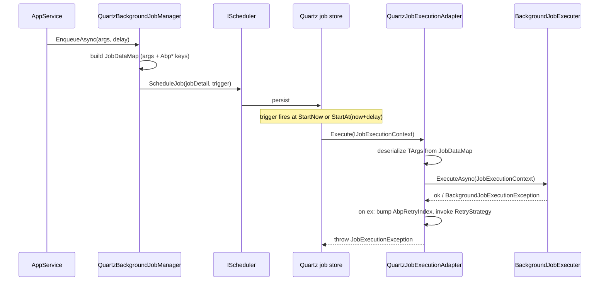

`Volo.Abp.BackgroundJobs.Quartz` is the **Quartz.NET adapter** for ABP's `IBackgroundJobManager`. It replaces the default manager with `QuartzBackgroundJobManager`, schedules jobs through Quartz's `IScheduler`, and uses `QuartzJobExecutionAdapter<TArgs>` (a Quartz `IJob`) to bridge back into `IBackgroundJobExecuter`. This page covers the manager, the adapter, the `JobDataMap` conventions, and the `AbpBackgroundJobQuartzOptions.RetryStrategy` delegate that implements the retry/back‑off math.

## Files

```
framework/src/Volo.Abp.BackgroundJobs.Quartz/Volo/Abp/BackgroundJobs/Quartz/
  AbpBackgroundJobQuartzOptions.cs
  AbpBackgroundJobsQuartzModule.cs
  QuartzBackgroundJobManageExtensions.cs
  QuartzBackgroundJobManager.cs
  QuartzJobExecutionAdapter.cs
```

The `IScheduler` itself is owned by `Volo.Abp.Quartz` (`AbpQuartzOptions`, `AbpQuartzModule`).

## `QuartzBackgroundJobManager`

```csharp
[Dependency(ReplaceServices = true)]
public class QuartzBackgroundJobManager : IBackgroundJobManager, ITransientDependency
{
    public const string JobDataPrefix = "Abp";
    public const string RetryIndex = "RetryIndex";

    protected IScheduler Scheduler { get; }
    protected AbpBackgroundJobQuartzOptions Options { get; }
    protected IJsonSerializer JsonSerializer { get; }

    public virtual async Task<string> EnqueueAsync<TArgs>(TArgs args,
        BackgroundJobPriority priority = BackgroundJobPriority.Normal, TimeSpan? delay = null)
    {
        return await ReEnqueueAsync(args, Options.RetryCount, Options.RetryIntervalMillisecond, priority, delay);
    }

    public virtual async Task<string> ReEnqueueAsync<TArgs>(TArgs args, int retryCount, int retryIntervalMillisecond,
        BackgroundJobPriority priority = BackgroundJobPriority.Normal, TimeSpan? delay = null)
    {
        var jobDataMap = new JobDataMap
        {
            { nameof(TArgs), JsonSerializer.Serialize(args!) },
            { JobDataPrefix + nameof(Options.RetryCount), retryCount.ToString() },
            { JobDataPrefix + nameof(Options.RetryIntervalMillisecond), retryIntervalMillisecond.ToString() },
            { JobDataPrefix + RetryIndex, "0" }
        };

        var jobDetail = JobBuilder.Create<QuartzJobExecutionAdapter<TArgs>>()
            .RequestRecovery()
            .SetJobData(jobDataMap)
            .Build();

        var trigger = !delay.HasValue
            ? TriggerBuilder.Create().StartNow().Build()
            : TriggerBuilder.Create().StartAt(new DateTimeOffset(DateTime.Now.Add(delay.Value))).Build();

        await Scheduler.ScheduleJob(jobDetail, trigger);
        return jobDetail.Key.ToString();
    }
}
```

The key design decisions:

| Decision | Detail |
| --- | --- |
| **Job class** | Always `QuartzJobExecutionAdapter<TArgs>` — Quartz instantiates the adapter, ABP forwards to the real job. |
| **Args storage** | Serialized JSON in the Quartz `JobDataMap` under the key `"TArgs"`. |
| **Retry budget** | Per‑job — three slots in the data map (`AbpRetryCount`, `AbpRetryIntervalMillisecond`, `AbpRetryIndex`). |
| **Recovery** | `RequestRecovery()` tells Quartz to re‑execute the job after a scheduler restart if it was running mid‑execution. |
| **Trigger** | `StartNow` for immediate, `StartAt(offset)` for delayed. Cron triggers are not used — ABP enqueues one‑shot jobs only. |
| **Return value** | Quartz `JobKey.ToString()` (group + name) so callers have a handle for cancellation. |
| **Priority is ignored.** | Same caveat as Hangfire — Quartz has no first‑class priority queue. Use `JobBuilder.UsingJobData(...)` and a custom listener if you need priority. |

The `ReEnqueueAsync` overload is exposed via `QuartzBackgroundJobManageExtensions.cs`:

```csharp
public static async Task<string?> EnqueueAsync<TArgs>(this IBackgroundJobManager backgroundJobManager,
    TArgs args, int retryCount, int retryIntervalMillisecond,
    BackgroundJobPriority priority = BackgroundJobPriority.Normal, TimeSpan? delay = null)
{
    if (backgroundJobManager is QuartzBackgroundJobManager quartzBackgroundJobManager)
    {
        return await quartzBackgroundJobManager.ReEnqueueAsync(args, retryCount, retryIntervalMillisecond, priority, delay);
    }
    return null;
}
```

Casting to the concrete class is the way to override retry parameters per call (the base `IBackgroundJobManager` interface only accepts priority and delay).

## `QuartzJobExecutionAdapter<TArgs>`

```csharp
public class QuartzJobExecutionAdapter<TArgs> : IJob
{
    public async Task Execute(IJobExecutionContext context)
    {
        using (var scope = ServiceScopeFactory.CreateScope())
        {
            var args = JsonSerializer.Deserialize<TArgs>(context.JobDetail.JobDataMap.GetString(nameof(TArgs))!);
            var jobType = Options.GetJob(typeof(TArgs)).JobType;
            var jobContext = new JobExecutionContext(scope.ServiceProvider, jobType, args!,
                cancellationToken: context.CancellationToken);
            try
            {
                await JobExecuter.ExecuteAsync(jobContext);
            }
            catch (Exception exception)
            {
                var jobExecutionException = new JobExecutionException(exception);

                var retryIndex = context.JobDetail.JobDataMap
                    .GetString(QuartzBackgroundJobManager.JobDataPrefix + QuartzBackgroundJobManager.RetryIndex)!
                    .To<int>();
                retryIndex++;
                context.JobDetail.JobDataMap.Put(
                    QuartzBackgroundJobManager.JobDataPrefix + QuartzBackgroundJobManager.RetryIndex,
                    retryIndex.ToString());

                await BackgroundJobQuartzOptions.RetryStrategy.Invoke(retryIndex, context, jobExecutionException);

                throw jobExecutionException;
            }
        }
    }
}
```

Walk through the flow:

1. **Open a DI scope.** Same isolation as the default `BackgroundJobWorker`.
2. **Deserialize args** from the data map slot `nameof(TArgs)` (which is the literal string `"TArgs"`).
3. **Resolve the job type** from `AbpBackgroundJobOptions.GetJob(typeof(TArgs)).JobType`.
4. **Invoke `IBackgroundJobExecuter.ExecuteAsync(JobExecutionContext)`** — the same executer used everywhere, so multi‑tenant entry and exception wrapping behave identically.
5. **On exception**, wrap in `JobExecutionException`, bump `AbpRetryIndex`, and call `Options.RetryStrategy(retryIndex, ctx, ex)`. The strategy decides whether to `RefireImmediately = true`, `UnscheduleAllTriggers = true`, or sleep.

The `IJob` contract is what makes Quartz instantiate the adapter through its own job factory; the ABP module registers the open generic so any `TArgs` works:

```csharp
context.Services.AddTransient(typeof(QuartzJobExecutionAdapter<>));
```

## `AbpBackgroundJobQuartzOptions.RetryStrategy`

```csharp
public class AbpBackgroundJobQuartzOptions
{
    public int RetryCount { get; set; }
    public int RetryIntervalMillisecond { get; set; }

    [NotNull]
    public Func<int, IJobExecutionContext, JobExecutionException, Task> RetryStrategy
    {
        get => _retryStrategy;
        set => _retryStrategy = Check.NotNull(value, nameof(value));
    }
    private Func<int, IJobExecutionContext, JobExecutionException, Task> _retryStrategy;

    public AbpBackgroundJobQuartzOptions()
    {
        RetryCount = 3;
        RetryIntervalMillisecond = 3000;
        _retryStrategy = DefaultRetryStrategy;
    }

    private async Task DefaultRetryStrategy(int retryIndex, IJobExecutionContext executionContext,
        JobExecutionException exception)
    {
        exception.RefireImmediately = true;

        var retryCount = executionContext.JobDetail.JobDataMap
            .GetString(QuartzBackgroundJobManager.JobDataPrefix + nameof(RetryCount))!.To<int>();
        if (retryIndex > retryCount)
        {
            exception.RefireImmediately = false;
            exception.UnscheduleAllTriggers = true;
            return;
        }

        var retryInterval = executionContext.JobDetail.JobDataMap
            .GetString(QuartzBackgroundJobManager.JobDataPrefix + nameof(RetryIntervalMillisecond))!.To<int>();
        await Task.Delay(retryInterval);
    }
}
```

| Default | Value | Effect |
| --- | --- | --- |
| `RetryCount` | `3` | Max tries before unschedule. |
| `RetryIntervalMillisecond` | `3000` | Sleep before refire (fixed, not exponential). |

The strategy is delegate‑based so applications can swap in exponential back‑off, jitter, or a Polly policy without subclassing.

## Module wiring

```csharp
[DependsOn(typeof(AbpBackgroundJobsAbstractionsModule), typeof(AbpQuartzModule))]
public class AbpBackgroundJobsQuartzModule : AbpModule
{
    public override void ConfigureServices(ServiceConfigurationContext context)
    {
        context.Services.AddTransient(typeof(QuartzJobExecutionAdapter<>));
    }

    public override void OnPreApplicationInitialization(ApplicationInitializationContext context)
    {
        var options = context.ServiceProvider.GetRequiredService<IOptions<AbpBackgroundJobOptions>>().Value;
        if (!options.IsJobExecutionEnabled)
        {
            var quartzOptions = context.ServiceProvider.GetRequiredService<IOptions<AbpQuartzOptions>>().Value;
            quartzOptions.StartSchedulerFactory = scheduler => Task.CompletedTask;
        }
    }
}
```

`StartSchedulerFactory` is the `AbpQuartzOptions` callback that normally calls `scheduler.Start()`. Replacing it with `_ => Task.CompletedTask` keeps Quartz registered (so `IScheduler` is injectable for enqueue) but never starts the worker loop.

## Sequence



The `RefireImmediately` flag on `JobExecutionException` is the Quartz mechanism that triggers a retry after the strategy returns; `UnscheduleAllTriggers` is the abort path.

## Data map keys

| Key | Type (in map) | Set by | Read by |
| --- | --- | --- | --- |
| `"TArgs"` (literal) | JSON string | `QuartzBackgroundJobManager.ReEnqueueAsync` | `QuartzJobExecutionAdapter.Execute` |
| `AbpRetryCount` | string | `QuartzBackgroundJobManager.ReEnqueueAsync` | `DefaultRetryStrategy` |
| `AbpRetryIntervalMillisecond` | string | `QuartzBackgroundJobManager.ReEnqueueAsync` | `DefaultRetryStrategy` |
| `AbpRetryIndex` | string (mutable) | `QuartzBackgroundJobManager.ReEnqueueAsync` (initial 0), incremented by adapter | `DefaultRetryStrategy` |

All values are stored as strings because Quartz serializes the map across restarts and string is the safest portable format.

## Comparison

| Concern | Default | Hangfire | Quartz |
| --- | --- | --- | --- |
| Backing store | EF/Mongo via `IBackgroundJobStore` | Hangfire `JobStorage` | Quartz `IJobStore` |
| Retry policy | `AbpBackgroundJobWorkerOptions` exponential | `AutomaticRetryAttribute` | `AbpBackgroundJobQuartzOptions.RetryStrategy` delegate |
| Delay support | `BackgroundJobInfo.NextTryTime` | `BackgroundJob.Schedule(delay)` | `TriggerBuilder.StartAt(...)` |
| Recovery on crash | Worker re‑polls store | Hangfire fetches on next iteration | `RequestRecovery()` flag |
| Args type registration | Required (`AbpBackgroundJobOptions.AddJob`) | Required | Required |
| Priority enum support | Yes | No (use queues) | No (use trigger priority manually) |

## When to pick Quartz

| Scenario | Verdict |
| --- | --- |
| You already use Quartz cron triggers for cyclic work | ✓ Share the scheduler |
| You need a delegate‑based custom retry policy | ✓ `RetryStrategy` |
| You need crash recovery semantics built into the scheduler | ✓ `RequestRecovery` |
| You need first‑class priority queues | Prefer Hangfire with named queues |
| You need a horizontally scalable worker pool with leader election | Either, but Quartz cluster mode is built in |

## Cross‑references

| Topic | See |
| --- | --- |
| Default in‑process runtime | [Background jobs](/infrastructure/background-jobs) |
| Other providers | [Hangfire](/infrastructure/background-jobs-hangfire) · [RabbitMQ](/infrastructure/background-jobs-rabbitmq) · [TickerQ](/infrastructure/background-jobs-tickerq) |
| `IBackgroundJobExecuter` and `JobExecutionContext` | [Background jobs](/infrastructure/background-jobs) |
| Tenant entry during job execution | [Multi‑tenancy](/multi-tenancy/overview) |
| End‑to‑end execution lifecycle | [Background job execution flow](/flows/background-job-execution) |
