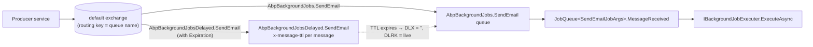

`Volo.Abp.BackgroundJobs.RabbitMQ` is the **RabbitMQ adapter** for ABP's `IBackgroundJobManager`. Unlike Hangfire or Quartz, this provider does not need a separate scheduler — each job args type gets its own AMQP queue, the producer publishes directly, and a per‑queue consumer drains it. Delays are implemented with a second queue that uses `x-message-ttl` and dead‑letter routing to forward expired messages onto the main queue. This page covers `RabbitMqBackgroundJobManager`, `IJobQueueManager`, `JobQueue<TArgs>`, `JobQueueConfiguration`, and the queue declaration / consume code.

## Files

```text
framework/src/Volo.Abp.BackgroundJobs.RabbitMQ/Volo/Abp/BackgroundJobs/RabbitMQ/
  AbpBackgroundJobsRabbitMqModule.cs
  AbpRabbitMqBackgroundJobOptions.cs
  IJobQueue.cs / IJobQueueManager.cs
  JobQueue.cs
  JobQueueConfiguration.cs
  JobQueueManager.cs
  RabbitMqBackgroundJobManager.cs
```

The `Volo.Abp.RabbitMQ` package owns the connection/channel pools (`IConnectionPool`, `IChannelPool`).

## `RabbitMqBackgroundJobManager`

```csharp
[Dependency(ReplaceServices = true)]
public class RabbitMqBackgroundJobManager : IBackgroundJobManager, ITransientDependency
{
    private readonly IJobQueueManager _jobQueueManager;

    public RabbitMqBackgroundJobManager(IJobQueueManager jobQueueManager)
    {
        _jobQueueManager = jobQueueManager;
    }

    public async Task<string> EnqueueAsync<TArgs>(TArgs args,
        BackgroundJobPriority priority = BackgroundJobPriority.Normal, TimeSpan? delay = null)
    {
        var jobQueue = await _jobQueueManager.GetAsync<TArgs>();
        return (await jobQueue.EnqueueAsync(args, priority, delay))!;
    }
}
```

The manager is a thin shim — it asks `IJobQueueManager` for the `IJobQueue<TArgs>` and forwards. Priority is plumbed through but not honored (a `//TODO: How to handle priority` comment marks the gap in `JobQueue.PublishAsync`).

`EnqueueAsync` returns `null!` from the queue (RabbitMQ has no global job id), so callers should treat the string as opaque.

## `AbpRabbitMqBackgroundJobOptions`

```csharp
public class AbpRabbitMqBackgroundJobOptions
{
    public Dictionary<Type, JobQueueConfiguration> JobQueues { get; }
    public string DefaultQueueNamePrefix { get; set; }
    public string DefaultDelayedQueueNamePrefix { get; set; }
    public ushort? PrefetchCount { get; set; }

    public AbpRabbitMqBackgroundJobOptions()
    {
        JobQueues = new Dictionary<Type, JobQueueConfiguration>();
        DefaultQueueNamePrefix = "AbpBackgroundJobs.";
        DefaultDelayedQueueNamePrefix = "AbpBackgroundJobsDelayed.";
    }
}
```

| Property | Default | Effect |
| --- | --- | --- |
| `JobQueues` | `{}` | Explicit per‑args overrides; key is the args type. |
| `DefaultQueueNamePrefix` | `"AbpBackgroundJobs."` | Prepended to `JobName` for the live queue. |
| `DefaultDelayedQueueNamePrefix` | `"AbpBackgroundJobsDelayed."` | Prepended to `JobName` for the delayed companion. |
| `PrefetchCount` | `null` | Applied via `BasicQosAsync` for backpressure. |

A typical app does not need to set anything: the default per‑type queue naming convention gives one live queue + one delayed queue per job args type.

## `JobQueueConfiguration`

```csharp
public class JobQueueConfiguration : QueueDeclareConfiguration
{
    public Type JobArgsType { get; }
    public string? ConnectionName { get; set; }
    public string DelayedQueueName { get; set; }

    public virtual async Task<QueueDeclareOk> DeclareDelayedAsync(IChannel channel)
    {
        var delayedArguments = new Dictionary<string, object?>(Arguments)
        {
            ["x-dead-letter-routing-key"] = QueueName,
            ["x-dead-letter-exchange"] = string.Empty
        };

        return await channel.QueueDeclareAsync(
            queue: DelayedQueueName,
            durable: Durable,
            exclusive: Exclusive,
            autoDelete: AutoDelete,
            arguments: delayedArguments);
    }
}
```

`DeclareDelayedAsync` is the heart of the delay mechanism. The delayed queue is declared with:

- `x-dead-letter-exchange = ""` — the default AMQP exchange.
- `x-dead-letter-routing-key = QueueName` — the live queue name.

So messages published to the delayed queue with a per‑message `Expiration` (in milliseconds) sit there until TTL expires, then dead‑letter back to the default exchange routed at the live queue. This is the standard "RabbitMQ delay queue without the rabbitmq-delayed-message-exchange plugin" trick.

## `JobQueue<TArgs>` declaration

Inside `JobQueue.cs`, `EnsureInitializedAsync` declares both queues on first use:

```csharp
ChannelAccessor = await ChannelPool.AcquireAsync(
    ChannelPrefix + QueueConfiguration.QueueName,
    QueueConfiguration.ConnectionName);

var result = await QueueConfiguration.DeclareAsync(ChannelAccessor.Channel);
await QueueConfiguration.DeclareDelayedAsync(ChannelAccessor.Channel);

if (AbpBackgroundJobOptions.IsJobExecutionEnabled)
{
    if (QueueConfiguration.PrefetchCount.HasValue)
        await ChannelAccessor.Channel.BasicQosAsync(0, QueueConfiguration.PrefetchCount.Value, false);

    Consumer = new AsyncEventingBasicConsumer(ChannelAccessor.Channel);
    Consumer.ReceivedAsync += MessageReceived;

    await ChannelAccessor.Channel.BasicConsumeAsync(
        queue: QueueConfiguration.QueueName,
        autoAck: false,
        consumer: Consumer);
}
```

Notable details:

- **One channel per queue.** `ChannelPrefix + QueueName` namespaces the channel pool key so different args types do not share a channel.
- **Consumer only when execution is enabled.** A process that only enqueues skips `BasicConsumeAsync` so it has zero workers, even though the queue is declared.
- **`autoAck: false`.** Manual acks ensure the message is only removed after `IBackgroundJobExecuter.ExecuteAsync` succeeds.

If no per‑type override exists, the queue config is built in `JobQueue.GetOrCreateJobQueueConfiguration()`:

```csharp
return AbpRabbitMqBackgroundJobOptions.JobQueues.GetOrDefault(typeof(TArgs)) ??
       new JobQueueConfiguration(
           typeof(TArgs),
           AbpRabbitMqBackgroundJobOptions.DefaultQueueNamePrefix + JobConfiguration.JobName,
           AbpRabbitMqBackgroundJobOptions.DefaultDelayedQueueNamePrefix + JobConfiguration.JobName,
           prefetchCount: AbpRabbitMqBackgroundJobOptions.PrefetchCount);
```

## Publish path

```csharp
protected virtual async Task PublishAsync(TArgs args,
    BackgroundJobPriority priority = BackgroundJobPriority.Normal, TimeSpan? delay = null)
{
    var routingKey = QueueConfiguration.QueueName;
    var basicProperties = new BasicProperties
    {
        Persistent = true,
        CorrelationId = CorrelationIdProvider.Get()
    };

    if (delay.HasValue)
    {
        routingKey = QueueConfiguration.DelayedQueueName;
        basicProperties.Expiration = delay.Value.TotalMilliseconds.ToString(CultureInfo.InvariantCulture);
    }

    if (ChannelAccessor != null)
    {
        await ChannelAccessor.Channel.BasicPublishAsync(
            exchange: "", routingKey: routingKey, mandatory: false,
            basicProperties: basicProperties, body: Serializer.Serialize(args!));
    }
}
```

- **Persistent messages** survive broker restarts.
- **Delay path** sends to the delayed queue with a per‑message `Expiration`. TTL elapses → dead‑letter → live queue → consumed.
- **Empty exchange** is the AMQP default exchange where routing key equals queue name. No exchange declaration is needed.

## Consume path

```csharp
protected virtual async Task MessageReceived(object sender, BasicDeliverEventArgs ea)
{
    using (var scope = ServiceScopeFactory.CreateScope())
    {
        var context = new JobExecutionContext(
            scope.ServiceProvider,
            JobConfiguration.JobType,
            Serializer.Deserialize(ea.Body.ToArray(), typeof(TArgs)));

        try
        {
            using (CorrelationIdProvider.Change(ea.BasicProperties.CorrelationId))
            {
                await JobExecuter.ExecuteAsync(context);
            }
            await ChannelAccessor!.Channel.BasicAckAsync(deliveryTag: ea.DeliveryTag, multiple: false);
        }
        catch (BackgroundJobExecutionException)
        {
            await ChannelAccessor!.Channel.BasicRejectAsync(deliveryTag: ea.DeliveryTag, requeue: true);
        }
        catch (Exception)
        {
            await ChannelAccessor!.Channel.BasicRejectAsync(deliveryTag: ea.DeliveryTag, requeue: false);
        }
    }
}
```

Outcome matrix:

| Result | Action | Effect on RabbitMQ |
| --- | --- | --- |
| Success | `BasicAck` | Message removed from queue. |
| `BackgroundJobExecutionException` | `BasicReject(requeue: true)` | Message goes back on the queue for retry. |
| Other exception | `BasicReject(requeue: false)` | Message discarded (or routed to a DLX if configured). |

The "infinite requeue" of `BackgroundJobExecutionException` is one of two notable departures from the default worker. There is no built‑in cap; protection is delegated to either Rabbit's quorum queue `x-delivery-limit` or the job's own logic (an idempotency check inside `ExecuteAsync` that detects "this has tried 10 times" via inspection of a sidecar table).

## `IJobQueueManager`

```csharp
public class JobQueueManager : IJobQueueManager, ISingletonDependency
{
    protected ConcurrentDictionary<string, IRunnable> JobQueues { get; }

    public async Task StartAsync(CancellationToken cancellationToken = default)
    {
        if (!Options.IsJobExecutionEnabled) return;

        foreach (var jobConfiguration in Options.GetJobs())
        {
            var jobQueue = (IRunnable)ServiceProvider.GetRequiredService(
                typeof(IJobQueue<>).MakeGenericType(jobConfiguration.ArgsType));
            await jobQueue.StartAsync(cancellationToken);
            JobQueues[jobConfiguration.JobName] = jobQueue;
        }
    }

    public async Task<IJobQueue<TArgs>> GetAsync<TArgs>()
    {
        var jobConfiguration = Options.GetJob(typeof(TArgs));
        if (JobQueues.TryGetValue(jobConfiguration.JobName, out var jobQueue))
            return (IJobQueue<TArgs>)jobQueue;

        using (await SyncSemaphore.LockAsync())
        {
            if (JobQueues.TryGetValue(jobConfiguration.JobName, out jobQueue))
                return (IJobQueue<TArgs>)jobQueue;

            jobQueue = (IJobQueue<TArgs>)ServiceProvider
                .GetRequiredService(typeof(IJobQueue<>).MakeGenericType(typeof(TArgs)));
            await jobQueue.StartAsync();
            JobQueues.TryAdd(jobConfiguration.JobName, jobQueue);
            return (IJobQueue<TArgs>)jobQueue;
        }
    }
}
```

Two responsibilities:

- **At startup**, instantiate one `IJobQueue<TArgs>` per registered job (`AbpBackgroundJobOptions.GetJobs()`) and call `StartAsync`. This pre‑declares queues so producers do not race with consumers.
- **At enqueue**, resolve‑and‑cache‑on‑demand. The `SyncSemaphore.LockAsync()` ensures one creation per type even under concurrent first‑use.

## Topology



One pair of queues per job type. Different worker replicas connect to the same live queue → RabbitMQ load‑balances across them. Different services have different `JobName`s and therefore different queue names → no interference.

## Module wiring

`AbpBackgroundJobsRabbitMqModule.cs` (start of file shown above) registers the open generic `IJobQueue<>` → `JobQueue<>` and arranges `JobQueueManager.StartAsync` as part of the app boot. When `AbpBackgroundJobOptions.IsJobExecutionEnabled == false`, the manager's `StartAsync` returns early — queues are not declared on consumers, but the manager methods on producers (`GetAsync<TArgs>`) still work because they declare on demand.

## When to pick the RabbitMQ adapter

| Scenario | Verdict |
| --- | --- |
| You already publish events through RabbitMQ | ✓ Reuse `IConnectionPool` / `IChannelPool` |
| You want messages to outlive the process (durable queues) | ✓ Default `durable: true` |
| You want fine control over consumer prefetch | ✓ `PrefetchCount` |
| You need a Hangfire‑style dashboard | Pick Hangfire instead |
| You need per‑type cron schedules | Pick Quartz instead |
| You need first‑class priority queues | Pick TickerQ or use Hangfire named queues |

## Cross‑references

| Topic | See |
| --- | --- |
| Default in‑process runtime | [Background jobs](/infrastructure/background-jobs) |
| Distributed events over the same broker | [RabbitMQ event bus](/infrastructure/event-bus-rabbitmq) |
| Other job providers | [Hangfire](/infrastructure/background-jobs-hangfire) · [Quartz](/infrastructure/background-jobs-quartz) · [TickerQ](/infrastructure/background-jobs-tickerq) |
| Tenant entry during execution | [Multi‑tenancy](/multi-tenancy/overview) |
| Lifecycle including DI scope | [Background job execution flow](/flows/background-job-execution) |
