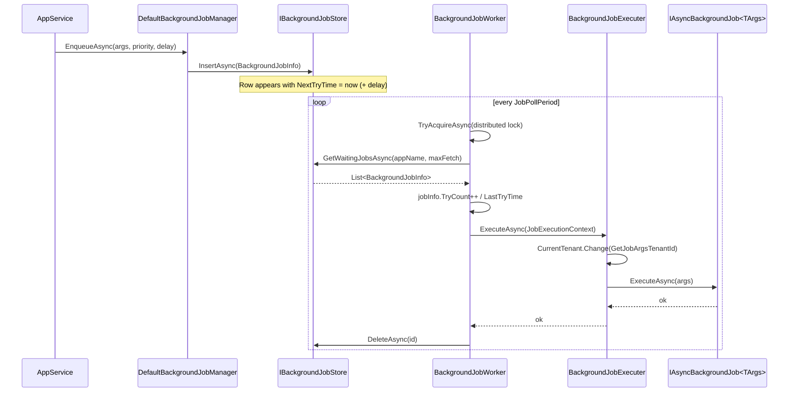

`Volo.Abp.BackgroundJobs` is the **default in‑process job runtime** for the ABP Framework. It pairs an `IBackgroundJobManager` (the producer API) with an `IBackgroundJobStore` (where jobs wait), a `BackgroundJobWorker` (a periodic poller under a distributed lock), and a `BackgroundJobExecuter` (the per‑job runner that resolves the job class and invokes `Execute`/`ExecuteAsync`). This page covers all four moving parts, the `BackgroundJobInfo` row, the retry/timeout/back‑off math, `BackgroundJobPriority`, and the `IBackgroundJob<TArgs>` / `IAsyncBackgroundJob<TArgs>` job contracts.

## Files

```
framework/src/Volo.Abp.BackgroundJobs.Abstractions/Volo/Abp/BackgroundJobs/
  AbpBackgroundJobOptions.cs
  AsyncBackgroundJob.cs / BackgroundJob.cs
  BackgroundJobArgsHelper.cs
  BackgroundJobConfiguration.cs
  BackgroundJobExecuter.cs / IBackgroundJobExecuter.cs
  BackgroundJobExecutionException.cs
  BackgroundJobManagerExtensions.cs
  BackgroundJobNameAttribute.cs / IBackgroundJobNameProvider.cs
  BackgroundJobPriority.cs
  IAsyncBackgroundJob.cs / IBackgroundJob.cs
  IBackgroundJobManager.cs
  JobExecutionContext.cs
  JobExecutionResult.cs
  NullBackgroundJobManager.cs

framework/src/Volo.Abp.BackgroundJobs/Volo/Abp/BackgroundJobs/
  AbpBackgroundJobsModule.cs
  AbpBackgroundJobWorkerOptions.cs
  BackgroundJobInfo.cs
  BackgroundJobWorker.cs
  DefaultBackgroundJobManager.cs
  IBackgroundJobSerializer.cs
  IBackgroundJobStore.cs
  IBackgroundJobWorker.cs
  InMemoryBackgroundJobStore.cs
  JsonBackgroundJobSerializer.cs
```

## Contracts

```csharp
// IBackgroundJobManager.cs
public interface IBackgroundJobManager
{
    Task<string> EnqueueAsync<TArgs>(
        TArgs args,
        BackgroundJobPriority priority = BackgroundJobPriority.Normal,
        TimeSpan? delay = null);
}

// IBackgroundJob.cs
public interface IBackgroundJob<in TArgs> { void Execute(TArgs args); }

// IAsyncBackgroundJob.cs
public interface IAsyncBackgroundJob<in TArgs> { Task ExecuteAsync(TArgs args); }
```

The single‑method `EnqueueAsync` is intentionally minimal so every provider — Hangfire, Quartz, RabbitMQ, TickerQ — can implement it on top of its native scheduler. The returned `string` is the provider‑specific job id.

## `BackgroundJobPriority`

```csharp
public enum BackgroundJobPriority : byte
{
    Low = 5,
    BelowNormal = 10,
    Normal = 15,
    AboveNormal = 20,
    High = 25
}
```

Stored on `BackgroundJobInfo.Priority`. The default `InMemoryBackgroundJobStore.GetWaitingJobsAsync` orders by `Priority DESC, TryCount ASC, NextTryTime ASC` so higher priority jobs always lead.

## `AbpBackgroundJobOptions`

`AbpBackgroundJobOptions.cs` keeps a registry of `BackgroundJobConfiguration` rows keyed by both args type and job name:

```csharp
public class AbpBackgroundJobOptions
{
    public bool IsJobExecutionEnabled { get; set; } = true;
    public Func<Type, string> GetBackgroundJobName { get; set; }

    public BackgroundJobConfiguration GetJob<TArgs>() => GetJob(typeof(TArgs));
    public BackgroundJobConfiguration GetJob(Type argsType) { /* throws if missing */ }
    public BackgroundJobConfiguration GetJob(string name) { /* throws if missing */ }

    public void AddJob<TJob>() => AddJob(typeof(TJob));
    public void AddJob(Type jobType) => AddJob(new BackgroundJobConfiguration(jobType, GetBackgroundJobName(BackgroundJobArgsHelper.GetJobArgsType(jobType))));
}
```

`BackgroundJobConfiguration.cs` is the row:

```csharp
public class BackgroundJobConfiguration
{
    public Type ArgsType { get; }
    public Type JobType { get; }
    public string JobName { get; }
    public BackgroundJobConfiguration(Type jobType, string jobName)
    {
        JobType = jobType;
        ArgsType = BackgroundJobArgsHelper.GetJobArgsType(jobType);
        JobName = jobName;
    }
}
```

The job name is resolved by `BackgroundJobNameAttribute.GetName`:

```csharp
public static string GetName(Type jobArgsType)
{
    return (jobArgsType.GetCustomAttributes(true).OfType<IBackgroundJobNameProvider>().FirstOrDefault()?.Name
            ?? jobArgsType.FullName)!;
}
```

So either `[BackgroundJobName("send-email")]` on the args class or the full type name. The name is the cross‑provider identifier — Hangfire's queue is derived from it, Quartz's `JobKey` uses it, RabbitMQ's queue prefix is appended to it.

## `AbpBackgroundJobWorkerOptions`

`AbpBackgroundJobWorkerOptions.cs` controls the poller:

| Property | Default | Effect |
| --- | --- | --- |
| `ApplicationName` | `null` | Stamped on `BackgroundJobInfo.ApplicationName`; the worker only polls rows matching this. |
| `JobPollPeriod` | `5000` (5 s) | Polling interval. |
| `MaxJobFetchCount` | `1000` | Page size for `GetWaitingJobsAsync`. |
| `DefaultFirstWaitDuration` | `60` (s) | First back‑off after a failure. |
| `DefaultWaitFactor` | `2.0` | Exponential factor. |
| `DefaultTimeout` | `172800` (2 days) | Maximum age before a job is abandoned. |
| `DistributedLockName` | `"AbpBackgroundJobWorker"` | Single lock that ensures one active worker across replicas. |

The retry math (from `BackgroundJobWorker.CalculateNextTryTime`) is:

```csharp
var nextWaitDuration = WorkerOptions.DefaultFirstWaitDuration *
                       Math.Pow(WorkerOptions.DefaultWaitFactor, jobInfo.TryCount - 1);
var nextTryDate = jobInfo.LastTryTime?.AddSeconds(nextWaitDuration) ?? clock.Now.AddSeconds(nextWaitDuration);

if (nextTryDate.Subtract(jobInfo.CreationTime).TotalSeconds > WorkerOptions.DefaultTimeout) return null; // abandon
return nextTryDate;
```

With defaults: try 1 fails → retry after 60 s, try 2 → 120 s, try 3 → 240 s, … up to two days, then `IsAbandoned = true`.

## `BackgroundJobInfo`

`BackgroundJobInfo.cs` is the persisted row:

```csharp
public class BackgroundJobInfo
{
    public Guid Id { get; set; }
    public virtual string? ApplicationName { get; set; }
    public virtual string JobName { get; set; }
    public virtual string JobArgs { get; set; }
    public virtual short TryCount { get; set; }
    public virtual DateTime CreationTime { get; set; }
    public virtual DateTime NextTryTime { get; set; }
    public virtual DateTime? LastTryTime { get; set; }
    public virtual bool IsAbandoned { get; set; }
    public virtual BackgroundJobPriority Priority { get; set; }
}
```

| Column | Set by | Read by |
| --- | --- | --- |
| `Id` | `DefaultBackgroundJobManager.EnqueueAsync` via `GuidGenerator` | Worker for deletes/updates |
| `JobName` | `AbpBackgroundJobOptions.GetBackgroundJobName(typeof(TArgs))` | Worker → `Options.GetJob(jobName)` |
| `JobArgs` | `IBackgroundJobSerializer.Serialize(args)` | Worker → `Serializer.Deserialize` |
| `Priority` | `EnqueueAsync` argument | `GetWaitingJobsAsync` order |
| `CreationTime` | `IClock.Now` at enqueue | Timeout check |
| `NextTryTime` | Initially `Clock.Now + delay`; later by `CalculateNextTryTime` | `GetWaitingJobsAsync` filter |
| `LastTryTime` | Worker before invoking the executer | Retry math |
| `TryCount` | Incremented by worker before each invocation | Retry math, ordering |
| `IsAbandoned` | Worker on timeout / unrecoverable error | `GetWaitingJobsAsync` filter |

## `DefaultBackgroundJobManager`

`DefaultBackgroundJobManager.cs` is the enqueue side:

```csharp
[Dependency(ReplaceServices = true)]
public class DefaultBackgroundJobManager : IBackgroundJobManager, ITransientDependency
{
    public virtual async Task<string> EnqueueAsync<TArgs>(TArgs args,
        BackgroundJobPriority priority = BackgroundJobPriority.Normal, TimeSpan? delay = null)
    {
        var jobName = BackgroundJobOptions.Value.GetBackgroundJobName(typeof(TArgs));
        var jobId = await EnqueueAsync(jobName, args!, priority, delay);
        return jobId.ToString();
    }

    protected virtual async Task<Guid> EnqueueAsync(string jobName, object args,
        BackgroundJobPriority priority = BackgroundJobPriority.Normal, TimeSpan? delay = null)
    {
        var jobInfo = new BackgroundJobInfo
        {
            Id = GuidGenerator.Create(),
            ApplicationName = BackgroundJobWorkerOptions.Value.ApplicationName,
            JobName = jobName,
            JobArgs = Serializer.Serialize(args),
            Priority = priority,
            CreationTime = Clock.Now,
            NextTryTime = Clock.Now
        };

        if (delay.HasValue) jobInfo.NextTryTime = Clock.Now.Add(delay.Value);

        await Store.InsertAsync(jobInfo);
        return jobInfo.Id;
    }
}
```

The flow:

1. Resolve the job name from the args type via `AbpBackgroundJobOptions`.
2. Build a `BackgroundJobInfo` with `CreationTime = NextTryTime = Clock.Now` (or `+ delay`).
3. Serialize the args (`JsonBackgroundJobSerializer` by default).
4. Insert through `IBackgroundJobStore`.

## `IBackgroundJobStore`

```csharp
public interface IBackgroundJobStore
{
    Task<BackgroundJobInfo> FindAsync(Guid jobId);
    Task InsertAsync(BackgroundJobInfo jobInfo);
    Task<List<BackgroundJobInfo>> GetWaitingJobsAsync(string? applicationName, int maxResultCount);
    Task DeleteAsync(Guid jobId);
    Task UpdateAsync(BackgroundJobInfo jobInfo);
}
```

`InMemoryBackgroundJobStore.cs` is the in‑memory default — singleton, `ConcurrentDictionary<Guid, BackgroundJobInfo>`. It is intentionally simple so the EF/Mongo implementations in the [Background Jobs module](/modules/background-jobs-module) can override it. Its `GetWaitingJobsAsync` is the canonical query:

```csharp
return _jobs.Values
    .Where(t => t.ApplicationName == applicationName)
    .Where(t => !t.IsAbandoned && t.NextTryTime <= Clock.Now)
    .OrderByDescending(t => t.Priority)
    .ThenBy(t => t.TryCount)
    .ThenBy(t => t.NextTryTime)
    .Take(maxResultCount)
    .ToList();
```

The EF Core / Mongo stores translate the same expression to SQL / Mongo aggregation.

## `BackgroundJobWorker`

`BackgroundJobWorker.cs` is the polling worker (an `AsyncPeriodicBackgroundWorkerBase` from `Volo.Abp.BackgroundWorkers`). The crucial loop:

```csharp
protected override async Task DoWorkAsync(PeriodicBackgroundWorkerContext workerContext)
{
    await using (var handler = await DistributedLock.TryAcquireAsync(
        WorkerOptions.DistributedLockName, cancellationToken: StoppingToken))
    {
        if (handler != null)
        {
            var store = workerContext.ServiceProvider.GetRequiredService<IBackgroundJobStore>();
            var waitingJobs = await store.GetWaitingJobsAsync(
                WorkerOptions.ApplicationName, WorkerOptions.MaxJobFetchCount);
            if (!waitingJobs.Any()) return;

            var jobExecuter = workerContext.ServiceProvider.GetRequiredService<IBackgroundJobExecuter>();
            var clock = workerContext.ServiceProvider.GetRequiredService<IClock>();
            var serializer = workerContext.ServiceProvider.GetRequiredService<IBackgroundJobSerializer>();

            foreach (var jobInfo in waitingJobs)
            {
                jobInfo.TryCount++;
                jobInfo.LastTryTime = clock.Now;

                try
                {
                    var jobConfiguration = JobOptions.GetJob(jobInfo.JobName);
                    var jobArgs = serializer.Deserialize(jobInfo.JobArgs, jobConfiguration.ArgsType);
                    var context = new JobExecutionContext(
                        workerContext.ServiceProvider, jobConfiguration.JobType, jobArgs,
                        workerContext.CancellationToken);

                    try
                    {
                        await jobExecuter.ExecuteAsync(context);
                        await store.DeleteAsync(jobInfo.Id);
                    }
                    catch (BackgroundJobExecutionException)
                    {
                        var nextTryTime = CalculateNextTryTime(jobInfo, clock);
                        if (nextTryTime.HasValue) jobInfo.NextTryTime = nextTryTime.Value;
                        else jobInfo.IsAbandoned = true;
                        await TryUpdateAsync(store, jobInfo);
                    }
                }
                catch (Exception ex)
                {
                    Logger.LogException(ex);
                    jobInfo.IsAbandoned = true;
                    await TryUpdateAsync(store, jobInfo);
                }
            }
        }
        else
        {
            try { await Task.Delay(WorkerOptions.JobPollPeriod * 12, StoppingToken); }
            catch (TaskCanceledException) { }
        }
    }
}
```

Three crucial behaviors:

- **Distributed lock.** Only one replica polls at a time. `TryAcquireAsync` is non‑blocking — replicas that lose the race sleep for `12 × JobPollPeriod` (one minute by default).
- **Increment before invoking.** `TryCount++` and `LastTryTime = Clock.Now` are stamped *before* the executer runs, so a process crash mid‑run still counts as a try.
- **Two failure tiers.** A `BackgroundJobExecutionException` triggers retry; any other exception immediately abandons the job (a misconfiguration almost certainly).

## `BackgroundJobExecuter`

`BackgroundJobExecuter.cs` runs the actual job class:

```csharp
public virtual async Task ExecuteAsync(JobExecutionContext context)
{
    var job = context.ServiceProvider.GetService(context.JobType);
    if (job == null) throw new AbpException("The job type is not registered to DI: " + context.JobType);

    var jobExecuteMethod = context.JobType.GetMethod(nameof(IBackgroundJob<object>.Execute)) ??
                           context.JobType.GetMethod(nameof(IAsyncBackgroundJob<object>.ExecuteAsync));
    if (jobExecuteMethod == null)
        throw new AbpException($"Given job type does not implement {typeof(IBackgroundJob<>).Name} or {typeof(IAsyncBackgroundJob<>).Name}. " +
                               "The job type was: " + context.JobType);

    try
    {
        using (CurrentTenant.Change(GetJobArgsTenantId(context.JobArgs)))
        {
            var cancellationTokenProvider = context.ServiceProvider.GetRequiredService<ICancellationTokenProvider>();
            using (cancellationTokenProvider.Use(context.CancellationToken))
            {
                if (jobExecuteMethod.Name == nameof(IAsyncBackgroundJob<object>.ExecuteAsync))
                    await ((Task)jobExecuteMethod.Invoke(job, new[] { context.JobArgs })!);
                else
                    jobExecuteMethod.Invoke(job, new[] { context.JobArgs });
            }
        }
    }
    catch (Exception ex)
    {
        Logger.LogException(ex);
        await context.ServiceProvider.GetRequiredService<IExceptionNotifier>()
            .NotifyAsync(new ExceptionNotificationContext(ex));
        throw new BackgroundJobExecutionException("…", ex) { JobType = context.JobType.AssemblyQualifiedName!, JobArgs = context.JobArgs };
    }
}
```

`GetJobArgsTenantId` enables transparent multi‑tenant resolution:

```csharp
protected virtual Guid? GetJobArgsTenantId(object jobArgs)
{
    return jobArgs switch
    {
        IMultiTenant multiTenantJobArgs => multiTenantJobArgs.TenantId,
        _ => CurrentTenant.Id
    };
}
```

If the args class implements `IMultiTenant`, the executer enters that tenant's scope before invoking the job — so repository queries see only that tenant's data. See [Multi‑tenancy](/multi-tenancy/overview).

The executer always wraps exceptions in `BackgroundJobExecutionException` so the worker can distinguish "job ran and failed" from "infrastructure failed" (rare).

## `JobExecutionContext`

```csharp
public class JobExecutionContext : IServiceProviderAccessor
{
    public IServiceProvider ServiceProvider { get; }
    public Type JobType { get; }
    public object JobArgs { get; }
    public CancellationToken CancellationToken { get; }
}
```

The `ServiceProvider` is the worker's per‑iteration scope (`PeriodicBackgroundWorkerContext.ServiceProvider`). The job class is resolved from this scope, which means each job runs in a **fresh DI scope** — no leaked DbContext, no cross‑job state.

## End‑to‑end flow



On failure, replace `DeleteAsync` with `UpdateAsync` carrying the new `NextTryTime` and `TryCount` — same loop the next iteration.

## Job base classes

`AsyncBackgroundJob.cs` and `BackgroundJob.cs` are no‑op base classes that just wire `ILogger` and implement `IAsyncBackgroundJob<TArgs>` / `IBackgroundJob<TArgs>` respectively. The convention in application code is:

```csharp
public class SendEmailJobArgs : IMultiTenant
{
    public Guid? TenantId { get; set; }
    public string To { get; set; }
    public string Subject { get; set; }
}

public class SendEmailJob : AsyncBackgroundJob<SendEmailJobArgs>, ITransientDependency
{
    private readonly IEmailSender _email;
    public SendEmailJob(IEmailSender email) { _email = email; }
    public override async Task ExecuteAsync(SendEmailJobArgs args)
    {
        await _email.SendAsync(args.To, args.Subject, /* body */);
    }
}
```

The args type implements `IMultiTenant`; when a tenant 1 admin enqueues an email, the worker will run `SendEmailJob` inside the tenant 1 scope, so any repository call sees tenant 1's data.

## Module bootstrap

`AbpBackgroundJobsModule.cs`:

```csharp
public override async Task OnApplicationInitializationAsync(ApplicationInitializationContext context)
{
    if (context.ServiceProvider.GetRequiredService<IOptions<AbpBackgroundJobOptions>>().Value.IsJobExecutionEnabled)
    {
        await context.AddBackgroundWorkerAsync<IBackgroundJobWorker>();
    }
}
```

When `IsJobExecutionEnabled == false`, the worker is never started — useful when one process should enqueue jobs and another should execute them.

## Comparison with providers

| Concern | Default | Hangfire / Quartz / RabbitMQ / TickerQ |
| --- | --- | --- |
| Store | `IBackgroundJobStore` (in‑memory or EF / Mongo) | Provider's own store |
| Worker | `BackgroundJobWorker` (periodic, distributed‑locked) | Provider's worker |
| Retry/back‑off | Computed by `BackgroundJobWorker.CalculateNextTryTime` | Provider's policy |
| Priority | `BackgroundJobPriority` ordering in `GetWaitingJobsAsync` | May or may not map to provider concepts |
| Multi‑tenancy | `BackgroundJobExecuter.GetJobArgsTenantId` via `IMultiTenant` | Same executer or provider‑specific |
| `EnqueueAsync` return | Guid string of `BackgroundJobInfo.Id` | Hangfire job id / Quartz job key / queue ack |

## Cross‑references

| Topic | See |
| --- | --- |
| EF / Mongo `IBackgroundJobStore` implementations | [Background Jobs module](/modules/background-jobs-module) |
| Hangfire adapter | [Background jobs over Hangfire](/infrastructure/background-jobs-hangfire) |
| Quartz adapter | [Background jobs over Quartz](/infrastructure/background-jobs-quartz) |
| RabbitMQ adapter | [Background jobs over RabbitMQ](/infrastructure/background-jobs-rabbitmq) |
| TickerQ adapter | [Background jobs over TickerQ](/infrastructure/background-jobs-tickerq) |
| Full lifecycle including DI scope | [Background job execution flow](/flows/background-job-execution) |
| Tenant entry on job execution | [Multi‑tenancy](/multi-tenancy/overview) |
