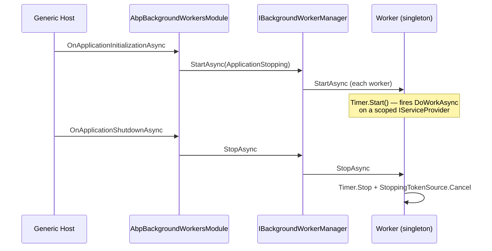

ABP Framework ships a small "background worker" abstraction that sits next to your hosted application and runs long-lived loops — telemetry pollers, queue drainers, daily reports, cache warmers. This page covers the `IBackgroundWorker` contract, the in-memory `BackgroundWorkerManager`, the periodic base classes, and the three pluggable backends (Hangfire, Quartz, TickerQ) that turn periodic workers into durable, schedule-driven jobs without changing your worker code.

<Note>
Background workers differ from [background jobs](/infrastructure/background-jobs): workers are long-running singletons that the host owns, while jobs are one-shot units of work enqueued through `IBackgroundJobManager`.
</Note>

## The IBackgroundWorker contract

The root abstraction in `framework/src/Volo.Abp.BackgroundWorkers/Volo/Abp/BackgroundWorkers/IBackgroundWorker.cs` is intentionally tiny — it inherits the framework `IRunnable` interface from `Volo.Abp.Threading` and is registered as `ISingletonDependency` so every worker is created once for the application lifetime.

```csharp IBackgroundWorker.cs
public interface IBackgroundWorker : IRunnable, ISingletonDependency
{
}
```

`IRunnable` itself exposes `StartAsync(CancellationToken)` and `StopAsync(CancellationToken)`. That gives the manager a uniform way to drive every worker through the host lifecycle without imposing any threading model on the worker itself.

## BackgroundWorkerBase

`BackgroundWorkerBase` in `framework/src/Volo.Abp.BackgroundWorkers/Volo/Abp/BackgroundWorkers/BackgroundWorkerBase.cs` is the convenience base class. It injects `IAbpLazyServiceProvider`, exposes a lazy `Logger`, and owns a `CancellationTokenSource` named `StoppingTokenSource` that derived classes can use to bail out of their loops when the host signals shutdown.

```csharp BackgroundWorkerBase.cs
public abstract class BackgroundWorkerBase : IBackgroundWorker
{
    public IAbpLazyServiceProvider LazyServiceProvider { get; set; } = default!;
    public IServiceProvider ServiceProvider { get; set; } = default!;

    protected ILoggerFactory LoggerFactory => LazyServiceProvider.LazyGetRequiredService<ILoggerFactory>();
    protected ILogger Logger => LazyServiceProvider.LazyGetService<ILogger>(provider =>
        LoggerFactory?.CreateLogger(GetType().FullName!) ?? NullLogger.Instance);

    protected CancellationTokenSource StoppingTokenSource { get; set; }
    protected CancellationToken StoppingToken { get; set; }

    public BackgroundWorkerBase()
    {
        StoppingTokenSource = new CancellationTokenSource();
        StoppingToken = StoppingTokenSource.Token;
    }

    public virtual Task StartAsync(CancellationToken cancellationToken = default) { ... }
    public virtual Task StopAsync(CancellationToken cancellationToken = default) { ... }
}
```

Subclasses override `StartAsync`/`StopAsync` to launch their own loop, hook into `StoppingToken`, and clean up resources on shutdown. Logging uses the runtime type's `FullName` as the category so you can filter worker output per class.

## Periodic worker bases

Most workers do not need to run a custom loop — they wake up on an interval and do something. ABP provides two base classes for that pattern in `framework/src/Volo.Abp.BackgroundWorkers/Volo/Abp/BackgroundWorkers/`:

| Base class | Timer type | Work signature |
| --- | --- | --- |
| `PeriodicBackgroundWorkerBase` | `AbpTimer` (synchronous) | `void DoWork(PeriodicBackgroundWorkerContext)` |
| `AsyncPeriodicBackgroundWorkerBase` | `AbpAsyncTimer` (awaitable) | `Task DoWorkAsync(PeriodicBackgroundWorkerContext)` |

Both classes create a scoped `IServiceProvider` per tick via `IServiceScopeFactory` and wrap your work in an `IExceptionNotifier` handler so unhandled exceptions are surfaced through the standard ABP exception pipeline.

```csharp AsyncPeriodicBackgroundWorkerBase.cs
public abstract class AsyncPeriodicBackgroundWorkerBase : BackgroundWorkerBase
{
    protected IServiceScopeFactory ServiceScopeFactory { get; }
    protected AbpAsyncTimer Timer { get; }
    public int Period => Timer.Period;
    public string? CronExpression { get; protected set; }

    protected AsyncPeriodicBackgroundWorkerBase(
        AbpAsyncTimer timer,
        IServiceScopeFactory serviceScopeFactory)
    {
        ServiceScopeFactory = serviceScopeFactory;
        Timer = timer;
        Timer.Elapsed = Timer_Elapsed;
    }

    private async Task DoWorkAsync(CancellationToken cancellationToken = default)
    {
        using (var scope = ServiceScopeFactory.CreateScope())
        {
            try
            {
                await DoWorkAsync(new PeriodicBackgroundWorkerContext(scope.ServiceProvider, cancellationToken));
            }
            catch (Exception ex)
            {
                await scope.ServiceProvider
                    .GetRequiredService<IExceptionNotifier>()
                    .NotifyAsync(new ExceptionNotificationContext(ex));
                Logger.LogException(ex);
            }
        }
    }

    protected abstract Task DoWorkAsync(PeriodicBackgroundWorkerContext workerContext);
}
```

The optional `CronExpression` property is read by the Hangfire and TickerQ managers — when set, it overrides the millisecond `Period` and yields a true cron-driven schedule instead of a fixed timer.

### PeriodicBackgroundWorkerContext

`PeriodicBackgroundWorkerContext` in `framework/src/Volo.Abp.BackgroundWorkers/Volo/Abp/BackgroundWorkers/PeriodicBackgroundWorkerContext.cs` is the per-tick container handed to `DoWorkAsync`. It carries a scoped `ServiceProvider` and a `CancellationToken` so your work resolves transient services from the right scope and respects host shutdown.

```csharp
public class PeriodicBackgroundWorkerContext
{
    public IServiceProvider ServiceProvider { get; }
    public CancellationToken CancellationToken { get; }
}
```

## Writing a worker

A typical worker derives from `AsyncPeriodicBackgroundWorkerBase`, sets `Timer.Period` in its constructor, and resolves the services it needs from `workerContext.ServiceProvider`.

```csharp
public class PassiveUserCheckerWorker : AsyncPeriodicBackgroundWorkerBase
{
    public PassiveUserCheckerWorker(
        AbpAsyncTimer timer,
        IServiceScopeFactory serviceScopeFactory)
        : base(timer, serviceScopeFactory)
    {
        Timer.Period = 600_000; // 10 minutes
    }

    protected override async Task DoWorkAsync(PeriodicBackgroundWorkerContext workerContext)
    {
        var userRepo = workerContext.ServiceProvider.GetRequiredService<IRepository<AppUser, Guid>>();
        var cutoff = DateTime.UtcNow.AddDays(-30);
        var passive = await userRepo.GetListAsync(u => u.LastLoginTime < cutoff);
        Logger.LogInformation("Marked {Count} users as passive", passive.Count);
    }
}
```

Because the worker is registered as a singleton via `IBackgroundWorker`, **never inject scoped services** (like repositories or `IUnitOfWorkManager`) into the constructor — always resolve them per tick from the supplied scope.

## IBackgroundWorkerManager and registration

`IBackgroundWorkerManager` in `framework/src/Volo.Abp.BackgroundWorkers/Volo/Abp/BackgroundWorkers/IBackgroundWorkerManager.cs` owns the set of workers and forwards lifecycle calls.

```csharp IBackgroundWorkerManager.cs
public interface IBackgroundWorkerManager : IRunnable
{
    Task AddAsync(IBackgroundWorker worker, CancellationToken cancellationToken = default);
}
```

The default `BackgroundWorkerManager` keeps a `List<IBackgroundWorker>`, starts each worker on `StartAsync`, and stops them on `StopAsync`. If `AddAsync` is called after the manager is already running, the newly added worker is started immediately — that is how late-registered workers (e.g. from a background module init) still come up.

Workers are added during module initialization with the extension methods in `BackgroundWorkersApplicationInitializationContextExtensions`:

```csharp
public override async Task OnApplicationInitializationAsync(ApplicationInitializationContext context)
{
    await context.AddBackgroundWorkerAsync<PassiveUserCheckerWorker>();
}
```

The extension validates that `TWorker` implements `IBackgroundWorker`, resolves it from DI, falls back to `IHostApplicationLifetime.ApplicationStopping` for the cancellation token, and delegates to `IBackgroundWorkerManager.AddAsync`.

## Module lifecycle

`AbpBackgroundWorkersModule` ties the manager to the application lifecycle. It reads `AbpBackgroundWorkerOptions.IsEnabled` and disables itself automatically in data-migration mode so seeders and migrators do not accidentally spin up scheduled work.

```csharp AbpBackgroundWorkersModule.cs
public override async Task OnApplicationInitializationAsync(ApplicationInitializationContext context)
{
    var options = context.ServiceProvider.GetRequiredService<IOptions<AbpBackgroundWorkerOptions>>().Value;
    if (options.IsEnabled)
    {
        var hostLifetime = context.ServiceProvider.GetService<IHostApplicationLifetime>();
        var cancellationToken = hostLifetime?.ApplicationStopping ?? CancellationToken.None;
        await context.ServiceProvider
            .GetRequiredService<IBackgroundWorkerManager>()
            .StartAsync(cancellationToken);
    }
}
```

You can flip `IsEnabled` off in tests or in API host processes that should not run workers:

```csharp
Configure<AbpBackgroundWorkerOptions>(o => o.IsEnabled = false);
```

## Lifecycle diagram



## BackgroundWorkerNameAttribute

`BackgroundWorkerNameAttribute` (and the matching `IBackgroundWorkerNameProvider` interface) lets you pin a stable, human-readable name on a worker class. Hangfire and TickerQ managers use the name as the recurring-job id so that renaming a class does not orphan its schedule entry.

```csharp
[BackgroundWorkerName("PassiveUserChecker")]
public class PassiveUserCheckerWorker : AsyncPeriodicBackgroundWorkerBase { ... }
```

`BackgroundWorkerNameAttribute.GetNameOrNull(workerType)` is what each backend reads — when the attribute is missing, the manager falls back to the type's `FullName`.

## Hangfire backend

`Volo.Abp.BackgroundWorkers.Hangfire` swaps `IBackgroundWorkerManager` for `HangfireBackgroundWorkerManager` via `[Dependency(ReplaceServices = true)]`. Workers are now registered as Hangfire **recurring jobs** so the schedule survives restarts and runs only on one node in a multi-instance deployment.

`HangfireBackgroundWorkerManager.AddAsync` in `framework/src/Volo.Abp.BackgroundWorkers.Hangfire/Volo/Abp/BackgroundWorkers/Hangfire/HangfireBackgroundWorkerManager.cs` dispatches on the worker type:

| Worker type | Behaviour |
| --- | --- |
| `IHangfireBackgroundWorker` | `RecurringJob.AddOrUpdate` with the worker's `CronExpression`, `TimeZone`, and `Queue`. |
| `AsyncPeriodicBackgroundWorkerBase` / `PeriodicBackgroundWorkerBase` | Wrapped by `HangfirePeriodicBackgroundWorkerAdapter<TWorker>` — its `Period` is converted to a cron expression via `GetCron(period)` unless `CronExpression` is set. |
| Anything else | Falls back to the base `BackgroundWorkerManager` behaviour. |

```csharp
public interface IHangfireBackgroundWorker : IBackgroundWorker
{
    string? RecurringJobId { get; set; }
    string CronExpression { get; set; }
    TimeZoneInfo? TimeZone  { get; set; }
    string Queue  { get; set; }
    Task DoWorkAsync(CancellationToken cancellationToken = default);
}
```

`HangfireBackgroundWorkerBase` provides a ready-made base class implementing the interface — set `CronExpression`, optionally `TimeZone`/`Queue`/`RecurringJobId`, override `DoWorkAsync`, and you're done.

### Cron generation

For periodic workers without an explicit cron, `GetCron` in the manager converts the millisecond period into a Hangfire-friendly cron:

| Period range | Generated cron |
| --- | --- |
| ≤ 59 seconds | `*/{n} * * * * *` |
| ≤ 59 minutes | `*/{n} * * * *` |
| ≤ 23 hours | `0 */{n} * * *` |
| ≤ 31 days | `0 0 0 1/{n} * *` |
| Larger | Throws — use `HangfireBackgroundWorkerBase` directly. |

The adapter also honours `AbpHangfirePeriodicBackgroundWorkerAdapterOptions.TimeZone` and `Queue` so an entire app can default to UTC and a "background" queue without touching each worker.

## Quartz backend

`Volo.Abp.BackgroundWorkers.Quartz` registers `QuartzBackgroundWorkerManager`. Workers there can implement `IQuartzBackgroundWorker` to drive the full Quartz scheduler model (triggers, job details, calendars) or fall back to the periodic adapter for simple cases.

```csharp IQuartzBackgroundWorker.cs
public interface IQuartzBackgroundWorker : IBackgroundWorker, IJob
{
    ITrigger Trigger { get; set; }
    IJobDetail JobDetail { get; set; }
    bool AutoRegister { get; set; }
    Func<IScheduler, Task>? ScheduleJob { get; set; }
}
```

`AbpQuartzConventionalRegistrar` auto-registers every `IQuartzBackgroundWorker` when `AbpBackgroundWorkerQuartzOptions.IsAutoRegisterEnabled` is `true` (the default). `QuartzBackgroundWorkerManager.StartAsync` brings the scheduler out of standby, and `StopAsync` puts it back into standby:

```csharp QuartzBackgroundWorkerManager.cs
public override async Task StartAsync(CancellationToken cancellationToken = default)
{
    if (Scheduler.IsStarted && Scheduler.InStandbyMode)
        await Scheduler.Start(cancellationToken);
    await base.StartAsync(cancellationToken);
}
```

For periodic workers, `QuartzPeriodicBackgroundWorkerAdapter<TWorker>` builds an `IJobDetail`/`ITrigger` pair using the same `Period`/`CronExpression` convention, then either schedules a fresh job or reschedules an existing one.

## TickerQ backend

`Volo.Abp.BackgroundWorkers.TickerQ` is the newest backend and uses the [TickerQ](https://tickerq.dev) library for in-process cron scheduling backed by a database. `AbpTickerQBackgroundWorkerManager` registers each periodic worker as a TickerQ function and a cron ticker:

```csharp AbpTickerQBackgroundWorkerManager.cs
AbpTickerQFunctionProvider.Functions.TryAdd(name!,
    (string.Empty, config?.Priority ?? TickerTaskPriority.LongRunning,
        async (ct, sp, ctx) => {
            var invoker = new AbpTickerQPeriodicBackgroundWorkerInvoker(worker, sp);
            await invoker.DoWorkAsync(ctx, ct);
        }));

AbpTickerQBackgroundWorkersProvider.BackgroundWorkers.Add(name!,
    new AbpTickerQCronBackgroundWorker
    {
        Function = name!,
        CronExpression = cronExpression,
        WorkerType = ProxyHelper.GetUnProxiedType(worker)
    });
```

`AbpBackgroundWorkersTickerQOptions.AddConfiguration<TWorker>` is the hook for per-worker tuning — for example, raising a worker's `TickerTaskPriority` to `Realtime`.

## Picking a backend

| Backend | When to use |
| --- | --- |
| Default `BackgroundWorkerManager` | Single-instance hosts, simple in-memory periodic work. |
| Hangfire | You already use Hangfire for background jobs and want one schedule store + dashboard. |
| Quartz | You need full cron + calendar + misfire semantics, or you have an existing Quartz scheduler. |
| TickerQ | You want a lightweight EF Core-backed scheduler with priorities and no separate dashboard. |

## See also

- [/infrastructure/overview](/infrastructure/overview) — where workers sit in the infrastructure layer.
- [/infrastructure/background-jobs](/infrastructure/background-jobs) — sibling abstraction for one-shot work.
- [/infrastructure/background-jobs-hangfire](/infrastructure/background-jobs-hangfire) — Hangfire setup shared with this module.
- [/core/threading-and-async](/core/threading-and-async) — `AbpTimer`/`AbpAsyncTimer` internals used by the periodic bases.
- [/data/unit-of-work](/data/unit-of-work) — how to wrap per-tick work in a unit-of-work scope.
