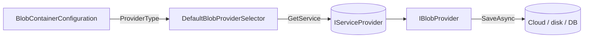

ABP Framework ships eight first-party `IBlobProvider` packages plus an EF Core/Mongo-backed database provider in a separate module. This page is the reference table for each provider — the assembly, the `IBlobProvider` implementation, the strongly typed configuration class, the `Use*` extension that wires it to a container, the naming normalizer, and the small differences that matter (credentials, container auto-creation, multi-tenant naming). Read it after [/infrastructure/blob-storing](/infrastructure/blob-storing) so the abstractions are familiar.

## Provider matrix

| Package | Provider class | Configuration | Naming normalizer | `Use*` extension |
| --- | --- | --- | --- | --- |
| `Volo.Abp.BlobStoring.FileSystem` | `FileSystemBlobProvider` | `FileSystemBlobProviderConfiguration` | `FileSystemBlobNamingNormalizer` | `UseFileSystem` |
| `Volo.Abp.BlobStoring.Memory` | `MemoryBlobProvider` | (none — in-process) | (none) | `UseMemory` |
| `Volo.Abp.BlobStoring.Azure` | `AzureBlobProvider` | `AzureBlobProviderConfiguration` | `AzureBlobNamingNormalizer` | `UseAzure` |
| `Volo.Abp.BlobStoring.Aws` | `AwsBlobProvider` | `AwsBlobProviderConfiguration` | `AwsBlobNamingNormalizer` | `UseAws` |
| `Volo.Abp.BlobStoring.Google` | `GoogleBlobProvider` | `GoogleBlobProviderConfiguration` | `GoogleBlobNamingNormalizer` | `UseGoogle` |
| `Volo.Abp.BlobStoring.Aliyun` | `AliyunBlobProvider` | `AliyunBlobProviderConfiguration` | `AliyunBlobNamingNormalizer` | `UseAliyun` |
| `Volo.Abp.BlobStoring.Minio` | `MinioBlobProvider` | `MinioBlobProviderConfiguration` | `MinioBlobNamingNormalizer` | `UseMinio` |
| `Volo.Abp.BlobStoring.Bunny` | `BunnyBlobProvider` | `BunnyBlobProviderConfiguration` | `BunnyBlobNamingNormalizer` | `UseBunny` |
| `Volo.Abp.BlobStoring.Database.*` | `DatabaseBlobProvider` | n/a — uses module DB | (none) | `UseDatabase` |

Each `Use*` extension follows the same three-step pattern: set `containerConfiguration.ProviderType`, register the naming normalizer, then run the user-supplied configuration action on a strongly typed wrapper around the property bag. Azure is representative:

```csharp AzureBlobContainerConfigurationExtensions.cs
public static BlobContainerConfiguration UseAzure(
    this BlobContainerConfiguration containerConfiguration,
    Action<AzureBlobProviderConfiguration> azureConfigureAction)
{
    containerConfiguration.ProviderType = typeof(AzureBlobProvider);
    containerConfiguration.NamingNormalizers.TryAdd<AzureBlobNamingNormalizer>();
    azureConfigureAction(new AzureBlobProviderConfiguration(containerConfiguration));
    return containerConfiguration;
}
```

## FileSystem

`Volo.Abp.BlobStoring.FileSystem` stores blobs on the local disk. Two settings:

| Property | Default | Meaning |
| --- | --- | --- |
| `BasePath` | required | Root directory under which container folders are created. |
| `AppendContainerNameToBasePath` | `true` | When `true`, blobs go into `{BasePath}/{ContainerName}/...`; useful when one base path is shared by many containers. |

```csharp FileSystemBlobProviderConfiguration.cs
public string BasePath {
    get => _containerConfiguration.GetConfiguration<string>(FileSystemBlobProviderConfigurationNames.BasePath);
    set => _containerConfiguration.SetConfiguration(FileSystemBlobProviderConfigurationNames.BasePath,
        Check.NotNullOrWhiteSpace(value, nameof(value)));
}
public bool AppendContainerNameToBasePath {
    get => _containerConfiguration.GetConfigurationOrDefault(
        FileSystemBlobProviderConfigurationNames.AppendContainerNameToBasePath, true);
    set => _containerConfiguration.SetConfiguration(
        FileSystemBlobProviderConfigurationNames.AppendContainerNameToBasePath, value);
}
```

Wiring:

```csharp
options.Containers.ConfigureDefault(c =>
    c.UseFileSystem(fs => fs.BasePath = "/var/myapp/blobs"));
```

`IBlobFilePathCalculator` is the per-container hook that computes the final path; `DefaultBlobFilePathCalculator` includes the tenant id when `IsMultiTenant` is true. Override it to embed a date partition (`2024/05/...`) or a hash bucket.

## Memory

`MemoryBlobProvider` in `framework/src/Volo.Abp.BlobStoring.Memory/Volo/Abp/BlobStoring/Memory/MemoryBlobProvider.cs` is a `ConcurrentDictionary<string, byte[]>` keyed by `$"{tenantId}_{blobName}_{containerName}"`. Use it for tests and demos — there is no `Configuration` class, only `UseMemory()`:

```csharp MemoryBlobContainerConfigurationExtensions.cs
public static BlobContainerConfiguration UseMemory(this BlobContainerConfiguration containerConfiguration)
{
    containerConfiguration.ProviderType = typeof(MemoryBlobProvider);
    return containerConfiguration;
}
```

Memory blobs are lost on process restart and are not shared between processes.

## Azure Blob Storage

`AzureBlobProviderConfiguration` carries a connection string plus a few container knobs:

| Property | Notes |
| --- | --- |
| `ConnectionString` | Standard Azure Storage connection string (required). |
| `ContainerName` | Optional override of the physical Azure container name. Must follow Azure rules — lowercase, hyphens, 3–63 chars. |
| `CreateContainerIfNotExists` | Default `false`; when `true`, the provider calls `CreateIfNotExistsAsync` lazily. |

```csharp AzureBlobProviderConfiguration.cs
public string ConnectionString { get; set; }
public string? ContainerName { get; set; }
public bool CreateContainerIfNotExists { get; set; }
```

`IAzureBlobNameCalculator` (default `DefaultAzureBlobNameCalculator`) computes the in-container blob path including the tenant id; replace it for custom layouts.

## AWS S3

`AwsBlobProviderConfiguration` is the richest one because S3 supports static keys, profiles, and STS temporary credentials. Key fields:

| Field | Purpose |
| --- | --- |
| `AccessKeyId` / `SecretAccessKey` | Static credentials. |
| `UseCredentials` | When `true`, use the static credentials above. |
| `UseTemporaryCredentials` | Mint short-lived STS credentials per call. |
| `UseTemporaryFederatedCredentials` | Federated identity flow. |
| `ProfileName` / `ProfilesLocation` | Local credential profile from the AWS SDK. |
| `Region` / `ContainerName` | Required region; optional explicit S3 bucket. |
| `CreateContainerIfNotExists` | Auto-create bucket. |
| `DurationSeconds` | TTL for STS credentials (900–129600). |
| `TemporaryCredentialsCacheKey` | Cache key for the `IDistributedCache<AwsTemporaryCredentialsCacheItem>` lookup. |

```csharp
options.Containers.Configure<InvoiceContainer>(c =>
    c.UseAws(aws =>
    {
        aws.AccessKeyId = "...";
        aws.SecretAccessKey = "...";
        aws.Region = "eu-west-1";
        aws.ContainerName = "myapp-invoices";
        aws.CreateContainerIfNotExists = true;
    }));
```

Override `IAmazonS3ClientFactory` for custom endpoint handling (MinIO-compatible S3, LocalStack, etc.).

## Google Cloud Storage

`GoogleBlobProviderConfiguration` accepts either explicit service-account credentials or Application Default Credentials:

```csharp GoogleBlobProviderConfiguration.cs (excerpt)
public string? ProjectId { get; set; }
public string? ClientEmail { get; set; }
public string? PrivateKey { get; set; }
public List<string>? Scopes { get; set; }
public bool UseApplicationDefaultCredentials { get; set; }
public string? ContainerName { get; set; }
public bool CreateContainerIfNotExists { get; set; }
```

Use `UseApplicationDefaultCredentials = true` when running on GCP (Cloud Run, GKE) and set the service-account fields when running outside.

## Aliyun OSS

`AliyunBlobProviderConfiguration` supports both static AccessKey pairs and STS-style role assumption (when `UseSecurityTokenService = true`):

| Field | Purpose |
| --- | --- |
| `AccessKeyId` / `AccessKeySecret` | Static credentials (always required for bootstrap). |
| `Endpoint` / `RegionId` | OSS region. |
| `UseSecurityTokenService` | Switch to STS short-lived credentials. |
| `RoleArn` / `RoleSessionName` | Role assumption parameters under STS mode. |
| `DurationSeconds` | STS credential TTL (900–3600). |
| `Policy` | Optional restrictive policy. |
| `ContainerName` | OSS bucket name override (lowercase, hyphens, 3–63 chars). |
| `CreateContainerIfNotExists` | Auto-create bucket. |

```csharp
options.Containers.Configure<PublicAssetsContainer>(c =>
    c.UseAliyun(oss =>
    {
        oss.AccessKeyId = "..."; oss.AccessKeySecret = "...";
        oss.Endpoint = "https://oss-cn-shanghai.aliyuncs.com";
        oss.RegionId = "cn-shanghai";
        oss.UseSecurityTokenService = true;
        oss.RoleArn = "acs:ram::1234567890:role/myAppRole";
        oss.RoleSessionName = "myapp";
    }));
```

`IOssClientFactory` / `DefaultOssClientFactory` cache the OSS client per credentials cache item.

## MinIO

`MinioBlobProviderConfiguration` is straightforward — endpoint + access key + bucket. It additionally exposes a presigned-URL helper that defaults to a 7-day expiry.

| Field | Purpose |
| --- | --- |
| `EndPoint` | URL, host or IP of the MinIO server. |
| `AccessKey` / `SecretKey` | Required for non-anonymous access. |
| `BucketName` | Optional explicit bucket override. |
| `WithSSL` | Use HTTPS instead of HTTP. |
| `CreateBucketIfNotExists` | Auto-create bucket. |
| `PresignedGetExpirySeconds` | TTL for presigned GET URLs (default `7 * 24 * 3600`). |

## Bunny.net Edge Storage

`BunnyBlobProviderConfiguration` is the smallest one:

| Field | Purpose |
| --- | --- |
| `Region` | Bunny region code, defaults to `"de"`. |
| `AccessKey` | Bunny storage zone API key. |
| `ContainerName` | Storage zone name; must be globally unique. |
| `CreateContainerIfNotExists` | Auto-create the storage zone. |

```csharp BunnyBlobProviderConfiguration.cs
public string? Region {
    get => _containerConfiguration.GetConfigurationOrDefault(BunnyBlobProviderConfigurationNames.Region, "de");
    set => _containerConfiguration.SetConfiguration(BunnyBlobProviderConfigurationNames.Region, value);
}
```

`DefaultBunnyClientFactory` builds an `HttpClient` against `https://{region}.storage.bunnycdn.com`.

## Database provider

`Volo.Abp.BlobStoring.Database` (in `modules/blob-storing-database/`) is a separate module — see [/modules/blob-storing-database](/modules/blob-storing-database). It registers a `DatabaseBlobProvider` that stores blob bytes in `AbpBlobs` table via EF Core or MongoDB, with `BlobContainer` rows linking back to the named containers you configure.

Pick it when you want blob persistence to live in the same backup/restore cycle as your domain data. Pick a cloud provider when offload, CDN access, or per-object pricing matters.

## How a provider is selected



`DefaultBlobProviderSelector.Get(containerName)` reads `ProviderType` from the resolved configuration, looks the type up in DI, and throws an `AbpException` if no provider has been configured for that container — that is the "no provider configured" message you see when you forget to call `UseAzure`/`UseFileSystem`.

## Configuration patterns

```csharp
// One backend for everything
Configure<AbpBlobStoringOptions>(o =>
    o.Containers.ConfigureDefault(c =>
        c.UseAzure(az => az.ConnectionString = ConnString)));

// Different backend per container
Configure<AbpBlobStoringOptions>(o =>
{
    o.Containers.ConfigureDefault(c =>
        c.UseFileSystem(fs => fs.BasePath = "/var/myapp/blobs"));

    o.Containers.Configure<PublicCdnContainer>(c =>
    {
        c.IsMultiTenant = false;
        c.UseBunny(bn =>
        {
            bn.Region = "ny";
            bn.AccessKey = "...";
            bn.ContainerName = "myapp-public";
        });
    });
});
```

`AppendContainerNameToBasePath`, `CreateContainerIfNotExists`, and explicit `ContainerName` overrides are the three patterns you reach for most often when you need to coexist with existing buckets.

## See also

- [/infrastructure/blob-storing](/infrastructure/blob-storing) — `IBlobContainer`, factory, multi-tenancy.
- [/modules/blob-storing-database](/modules/blob-storing-database) — EF Core/Mongo provider.
- [/infrastructure/caching](/infrastructure/caching) — `IDistributedCache` used by AWS/Aliyun temporary credential caching.
- [/multi-tenancy/data-isolation](/multi-tenancy/data-isolation) — how `IsMultiTenant` interacts with tenant context.
