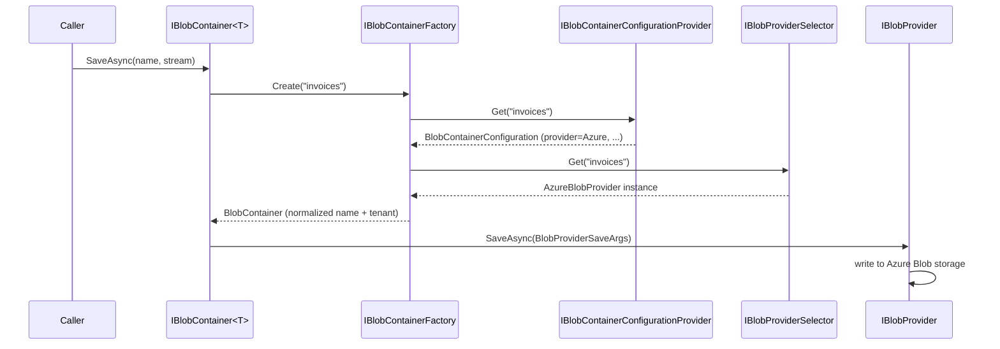

ABP Framework decouples your application from the file-storage backend through `Volo.Abp.BlobStoring` — a small abstraction where containers (logical buckets) are bound to providers (physical stores) at startup. This page covers the `IBlobContainer`/`IBlobContainer<T>` API, the `IBlobProvider` contract, the `BlobContainerConfiguration` model, the multi-tenant container resolution flow and how `AbpBlobStoringOptions` ties everything together. For the concrete providers see [/infrastructure/blob-providers](/infrastructure/blob-providers), and for the EF Core-backed `DatabaseBlobProvider` see [/modules/blob-storing-database](/modules/blob-storing-database).

## The IBlobContainer API

`framework/src/Volo.Abp.BlobStoring/Volo/Abp/BlobStoring/IBlobContainer.cs` is the consumer-facing surface. Every method is async and stream-oriented:

```csharp IBlobContainer.cs
public interface IBlobContainer
{
    Task SaveAsync(string name, Stream stream, bool overrideExisting = false, CancellationToken ct = default);
    Task<bool> DeleteAsync(string name, CancellationToken ct = default);
    Task<bool> ExistsAsync(string name, CancellationToken ct = default);
    Task<Stream> GetAsync(string name, CancellationToken ct = default);
    Task<Stream?> GetOrNullAsync(string name, CancellationToken ct = default);
}

public interface IBlobContainer<TContainer> : IBlobContainer where TContainer : class { }
```

`GetAsync` throws when the blob is missing; `GetOrNullAsync` returns `null`. `SaveAsync` throws `BlobAlreadyExistsException` unless `overrideExisting: true`. The blob name is opaque to the API — providers normalize it before talking to storage.

`BlobContainerExtensions` (same folder) adds the obvious convenience overloads — `GetAllBytesAsync`, `SaveAsync(byte[])`, `SaveAsync(IRemoteStreamContent)`, etc.

## Default vs typed containers

Resolve the default container by injecting `IBlobContainer`:

```csharp
public class FileAppService : ApplicationService
{
    private readonly IBlobContainer _blobs;
    public FileAppService(IBlobContainer blobs) => _blobs = blobs;

    public Task SaveAvatarAsync(Guid userId, Stream s) =>
        _blobs.SaveAsync($"avatars/{userId}", s, overrideExisting: true);
}
```

For a **named** container, declare a marker class and inject `IBlobContainer<TContainer>`. `BlobContainer<T>` (defined in `BlobContainer.cs`) wraps an `IBlobContainerFactory` and delegates every call to the underlying container resolved by the marker type:

```csharp
[BlobContainerName("invoices")]
public class InvoiceContainer { }

public class InvoiceAppService
{
    private readonly IBlobContainer<InvoiceContainer> _invoices;
    public InvoiceAppService(IBlobContainer<InvoiceContainer> invoices) => _invoices = invoices;
}
```

`BlobContainerNameAttribute.GetContainerName<T>()` returns the explicit attribute name when present, or the type's full name otherwise. The marker class is never instantiated — it only carries the name.

## IBlobProvider — the backend contract

Every backend implements `framework/src/Volo.Abp.BlobStoring/Volo/Abp/BlobStoring/IBlobProvider.cs`:

```csharp IBlobProvider.cs
public interface IBlobProvider
{
    Task SaveAsync(BlobProviderSaveArgs args);
    Task<bool> DeleteAsync(BlobProviderDeleteArgs args);
    Task<bool> ExistsAsync(BlobProviderExistsArgs args);
    Task<Stream?> GetOrNullAsync(BlobProviderGetArgs args);
}
```

The four `BlobProvider*Args` records all derive from `BlobProviderArgs` and carry the container name, the `BlobContainerConfiguration` resolved for that container, the (already normalised) blob name and a cancellation token. `BlobProviderSaveArgs` additionally carries the `Stream` and the `OverrideExisting` flag.

```csharp BlobProviderArgs.cs
public abstract class BlobProviderArgs
{
    public string ContainerName { get; }
    public BlobContainerConfiguration Configuration { get; }
    public string BlobName { get; }
    public CancellationToken CancellationToken { get; }
}
```

`BlobProviderBase` is a thin base class that maps `SaveAsync`/`DeleteAsync`/`ExistsAsync`/`GetOrNullAsync` onto abstract overloads — every concrete provider (`FileSystemBlobProvider`, `AzureBlobProvider`, etc.) derives from it.

## Container configuration

`BlobContainerConfiguration` carries per-container state — which provider to use, multi-tenancy flag, naming normalizers and a free-form property bag:

```csharp BlobContainerConfiguration.cs
public class BlobContainerConfiguration
{
    public Type? ProviderType { get; set; }
    public bool IsMultiTenant { get; set; } = true;
    public ITypeList<IBlobNamingNormalizer> NamingNormalizers { get; }

    public T? GetConfigurationOrDefault<T>(string name, T? defaultValue = default);
    public BlobContainerConfiguration SetConfiguration(string name, object? value);
    // ...
}
```

Provider packages expose strongly typed wrappers on top of this dictionary — e.g. `containerConfiguration.UseFileSystem(fs => fs.BasePath = "/var/blobs")` stores `BasePath` under a known key and sets `ProviderType = typeof(FileSystemBlobProvider)` in one call. See [/infrastructure/blob-providers](/infrastructure/blob-providers) for the full list.

## AbpBlobStoringOptions and BlobContainerConfigurations

The top-level options object is `framework/src/Volo.Abp.BlobStoring/Volo/Abp/BlobStoring/AbpBlobStoringOptions.cs`:

```csharp AbpBlobStoringOptions.cs
public class AbpBlobStoringOptions
{
    public BlobContainerConfigurations Containers { get; }
}
```

`BlobContainerConfigurations` is a fluent builder around a `Dictionary<string, BlobContainerConfiguration>`. A `DefaultContainer` entry is added automatically and used as the **fallback** for every other container — that is the magic that lets you set `UseFileSystem(...)` once and have every typed container inherit it:

```csharp BlobContainerConfigurations.cs
public BlobContainerConfigurations()
{
    _containers = new Dictionary<string, BlobContainerConfiguration>
    {
        [BlobContainerNameAttribute.GetContainerName<DefaultContainer>()] =
            new BlobContainerConfiguration()
    };
}

public BlobContainerConfigurations Configure<TContainer>(
    Action<BlobContainerConfiguration> configureAction)
{
    return Configure(BlobContainerNameAttribute.GetContainerName<TContainer>(), configureAction);
}

public BlobContainerConfigurations ConfigureDefault(Action<BlobContainerConfiguration> configureAction) { ... }
public BlobContainerConfigurations ConfigureAll(Action<string, BlobContainerConfiguration> configureAction) { ... }
```

Each non-default container is created with the default as its `fallbackConfiguration`, so `GetConfigurationOrNull(name)` walks up to the default before returning `null`.

Typical wiring in your `ConfigureServices`:

```csharp
Configure<AbpBlobStoringOptions>(options =>
{
    options.Containers.ConfigureDefault(c =>
    {
        c.UseFileSystem(fs => fs.BasePath = "/var/myapp/blobs");
    });

    options.Containers.Configure<InvoiceContainer>(c =>
    {
        c.UseAzure(az => az.ConnectionString = "<conn>");
        c.IsMultiTenant = false;
    });
});
```

## Container resolution flow



`BlobContainerFactory` in `framework/src/Volo.Abp.BlobStoring/Volo/Abp/BlobStoring/BlobContainerFactory.cs` is the construction site:

```csharp BlobContainerFactory.cs
public virtual IBlobContainer Create(string name)
{
    var configuration = ConfigurationProvider.Get(name);

    return new BlobContainer(
        name,
        configuration,
        ProviderSelector.Get(name),
        CurrentTenant,
        CancellationTokenProvider,
        BlobNormalizeNamingService,
        ServiceProvider
    );
}
```

`DefaultBlobContainerConfigurationProvider` returns the configuration stored in `AbpBlobStoringOptions.Containers`. `DefaultBlobProviderSelector` (`DefaultBlobProviderSelector.cs`) inspects `configuration.ProviderType`, locates the matching `IBlobProvider` from DI, and throws if no provider has been configured — that is the error message you see when you forget to call `UseAzure`/`UseFileSystem`.

## Multi-tenancy

`BlobContainer.GetTenantIdOrNull` reads `BlobContainerConfiguration.IsMultiTenant`. When it is `true` (the default), every read/write changes `ICurrentTenant` to the current tenant before delegating, so providers can scope blobs per tenant transparently:

```csharp BlobContainer.cs (excerpt)
public virtual async Task SaveAsync(string name, Stream stream,
    bool overrideExisting = false, CancellationToken ct = default)
{
    using (CurrentTenant.Change(GetTenantIdOrNull()))
    {
        var normalized = BlobNormalizeNamingService.NormalizeNaming(Configuration, ContainerName, name);
        await Provider.SaveAsync(new BlobProviderSaveArgs(
            normalized.ContainerName!, Configuration, normalized.BlobName!,
            stream, overrideExisting,
            CancellationTokenProvider.FallbackToProvider(ct)));
    }
}
```

For a **host-shared** bucket (logos, license blobs), flip `IsMultiTenant = false` on that container's config — every tenant then sees the same blobs.

## Blob naming normalization

Different stores have different rules: Azure container names must be lowercase, AWS S3 keys cannot contain certain characters, file-system paths must not escape the base directory. ABP solves this with `IBlobNamingNormalizer` (registered per container via `BlobContainerConfiguration.NamingNormalizers`). `BlobNormalizeNamingService` walks the list and returns a `(ContainerName, BlobName)` pair both safe for the chosen provider.

Provider packages register their own normalizers automatically when you call `UseXxx(...)` — for example `AzureBlobNamingNormalizer` enforces the Azure rules. You rarely need to add your own.

## BlobAlreadyExistsException

`BlobAlreadyExistsException` (in `BlobAlreadyExistsException.cs`) is the typed error thrown by providers when `overrideExisting: false` collides with an existing blob. It derives from `AbpException` so the global [exception handling](/core/exception-handling) pipeline turns it into a 409 response in HTTP APIs.

## Module setup

`AbpBlobStoringModule` only registers the abstractions — it does **not** pick a provider. You must add a provider module (or the EF Core `BlobStoringDatabaseModule`) and configure at least one container before the first `SaveAsync` runs.

```csharp
[DependsOn(
    typeof(AbpBlobStoringModule),
    typeof(AbpBlobStoringFileSystemModule)
)]
public class MyAppModule : AbpModule
{
    public override void ConfigureServices(ServiceConfigurationContext context)
    {
        Configure<AbpBlobStoringOptions>(o =>
        {
            o.Containers.ConfigureDefault(c =>
                c.UseFileSystem(fs => fs.BasePath = Path.Combine(Path.GetTempPath(), "myapp")));
        });
    }
}
```

## Cheat sheet

| Task | API |
| --- | --- |
| Save with overwrite | `await container.SaveAsync(name, stream, overrideExisting: true);` |
| Read or null | `var s = await container.GetOrNullAsync(name);` |
| Read all bytes | `var bytes = await container.GetAllBytesAsync(name);` (extension) |
| Delete | `var deleted = await container.DeleteAsync(name);` |
| Configure default provider | `options.Containers.ConfigureDefault(c => c.UseFileSystem(...));` |
| Disable multi-tenancy on a bucket | `options.Containers.Configure<MyContainer>(c => c.IsMultiTenant = false);` |
| Get a named container at runtime | `IBlobContainerFactory.Create("my-container")` |

## See also

- [/infrastructure/overview](/infrastructure/overview) — where BLOB storing sits among the infrastructure modules.
- [/infrastructure/blob-providers](/infrastructure/blob-providers) — concrete provider packages and their options.
- [/modules/blob-storing-database](/modules/blob-storing-database) — EF Core/Mongo-backed `DatabaseBlobProvider`.
- [/multi-tenancy/volo-abp-multitenancy](/multi-tenancy/volo-abp-multitenancy) — how `ICurrentTenant` scopes container access.
- [/core/exception-handling](/core/exception-handling) — `BlobAlreadyExistsException` propagation.
