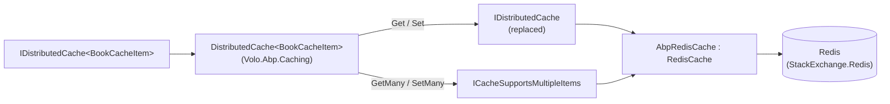
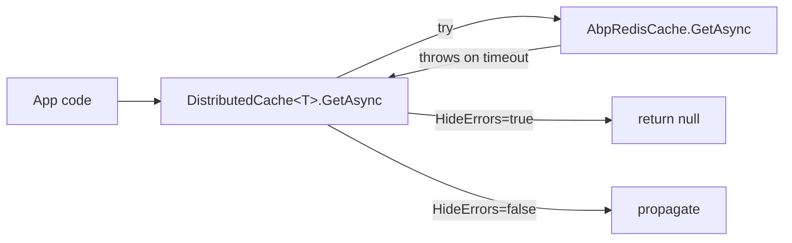

`Volo.Abp.Caching.StackExchangeRedis` is the **ABP Framework's Redis adapter** for the typed `IDistributedCache<T>` stack. It does two things: (1) it registers `AbpRedisCache` — a derivative of `Microsoft.Extensions.Caching.StackExchangeRedis.RedisCache` — that implements `ICacheSupportsMultipleItems` so bulk operations can pipeline; (2) it reads `Redis:IsEnabled` and `Redis:Configuration` from `IConfiguration` to wire `AddStackExchangeRedisCache`. This page covers the module, the cache class, the extension helpers it relies on, and what gets replaced versus reused from the base BCL `RedisCache`.

## Package layout

Everything is under `framework/src/Volo.Abp.Caching.StackExchangeRedis/Volo/Abp/Caching/StackExchangeRedis/`:

```
AbpCachingStackExchangeRedisModule.cs
AbpRedisCache.cs
AbpRedisExtensions.cs
```

Three files only — the package depends on `AbpCachingModule` for everything else (typed wrappers, key normalization, serialization, UoW staging).

## `AbpCachingStackExchangeRedisModule`

`AbpCachingStackExchangeRedisModule.cs` is small and entirely declarative:

```csharp
[DependsOn(typeof(AbpCachingModule))]
public class AbpCachingStackExchangeRedisModule : AbpModule
{
    public override void ConfigureServices(ServiceConfigurationContext context)
    {
        var configuration = context.Services.GetConfiguration();

        var redisEnabled = configuration["Redis:IsEnabled"];
        if (string.IsNullOrEmpty(redisEnabled) || bool.Parse(redisEnabled))
        {
            context.Services.AddStackExchangeRedisCache(options =>
            {
                var redisConfiguration = configuration["Redis:Configuration"];
                if (!redisConfiguration.IsNullOrEmpty())
                {
                    options.Configuration = redisConfiguration;
                }
            });

            context.Services.Replace(ServiceDescriptor.Singleton<IDistributedCache, AbpRedisCache>());
        }
    }
}
```

The behavior:

1. The module is **opt‑out** — Redis is enabled unless `Redis:IsEnabled` is explicitly `false`.
2. When enabled, it calls `AddStackExchangeRedisCache(...)` (the official MS adapter) with `options.Configuration = configuration["Redis:Configuration"]`. Anything else on `RedisCacheOptions` (`InstanceName`, `ConfigurationOptions`, …) can still be set via a later `Configure<RedisCacheOptions>(...)` in your module.
3. Then it **replaces** the default `IDistributedCache` (in‑memory) with `AbpRedisCache` via `ServiceDescriptor.Singleton`.

The typed wrappers from `Volo.Abp.Caching` are unaware of the swap — they keep resolving `IDistributedCache` and now get a Redis implementation that also exposes `ICacheSupportsMultipleItems`.

A typical `appsettings.json` looks like:

```json
{
  "Redis": {
    "IsEnabled": "true",
    "Configuration": "localhost:6379,abortConnect=false"
  }
}
```

## `AbpRedisCache`

`AbpRedisCache.cs` extends the BCL `Microsoft.Extensions.Caching.StackExchangeRedis.RedisCache`:

```csharp
[DisableConventionalRegistration]
public class AbpRedisCache : RedisCache, ICacheSupportsMultipleItems
{
    protected RedisKey InstancePrefix { get; }

    public AbpRedisCache(IOptions<RedisCacheOptions> optionsAccessor) : base(optionsAccessor)
    {
        var instanceName = optionsAccessor.Value.InstanceName;
        if (!string.IsNullOrEmpty(instanceName))
        {
            InstancePrefix = (RedisKey)Encoding.UTF8.GetBytes(instanceName);
        }
    }
```

`[DisableConventionalRegistration]` tells `AddAssembly`/auto‑registration to skip this class — only the explicit `services.Replace(...)` in the module call is the registration site.

`InstancePrefix` mirrors how the base `RedisCache` prepends `options.InstanceName` to every key. ABP's `AbpRedisCache` re‑implements the prefixing on the bulk‑operation path because the base class's prefix logic is not exposed through public methods.

### Reaching private members of `RedisCache`

Most of the file is reflection setup. Because `Microsoft.Extensions.Caching.StackExchangeRedis.RedisCache` is sealed‑in‑practice (private methods, internal constants), `AbpRedisCache` opens them through `FieldInfo` / `MethodInfo` cached in a static constructor:

```csharp
static AbpRedisCache()
{
    var type = typeof(RedisCache);
    RedisDatabaseField = Check.NotNull(type.GetField("_cache", BindingFlags.Instance | BindingFlags.NonPublic), nameof(RedisDatabaseField));
    ConnectMethod = Check.NotNull(type.GetMethod("Connect", BindingFlags.Instance | BindingFlags.NonPublic), nameof(ConnectMethod));
    ConnectAsyncMethod = Check.NotNull(type.GetMethod("ConnectAsync", BindingFlags.Instance | BindingFlags.NonPublic), nameof(ConnectAsyncMethod));
    MapMetadataMethod = Check.NotNull(type.GetMethod("MapMetadata", BindingFlags.Instance | BindingFlags.NonPublic | BindingFlags.Static), nameof(MapMetadataMethod));
    GetAbsoluteExpirationMethod = Check.NotNull(type.GetMethod("GetAbsoluteExpiration", BindingFlags.Static | BindingFlags.NonPublic), nameof(GetAbsoluteExpirationMethod));
    GetExpirationInSecondsMethod = Check.NotNull(type.GetMethod("GetExpirationInSeconds", BindingFlags.Static | BindingFlags.NonPublic), nameof(GetExpirationInSecondsMethod));
    OnRedisErrorMethod = Check.NotNull(type.GetMethod("OnRedisError", BindingFlags.Instance | BindingFlags.NonPublic), nameof(OnRedisErrorMethod));
    RecycleMethodInfo = Check.NotNull(type.GetMethod("Recycle", BindingFlags.Instance | BindingFlags.NonPublic | BindingFlags.Static), nameof(RecycleMethodInfo));

    AbsoluteExpirationKey = type.GetField("AbsoluteExpirationKey", BindingFlags.Static | BindingFlags.NonPublic)!.GetValue(null)!.ToString()!;
    SlidingExpirationKey  = type.GetField("SlidingExpirationKey",  BindingFlags.Static | BindingFlags.NonPublic)!.GetValue(null)!.ToString()!;
    DataKey               = type.GetField("DataKey",               BindingFlags.Static | BindingFlags.NonPublic)!.GetValue(null)!.ToString()!;
    NotPresent            = type.GetField("NotPresent",            BindingFlags.Static | BindingFlags.NonPublic)!.GetValue(null)!.To<int>();

    HashMembersAbsoluteExpirationSlidingExpirationData = [AbsoluteExpirationKey, SlidingExpirationKey, DataKey];
    HashMembersAbsoluteExpirationSlidingExpiration     = [AbsoluteExpirationKey, SlidingExpirationKey];
}
```

This pattern means `AbpRedisCache` reuses the BCL's wire format (a Redis hash with absolute‑expiration / sliding‑expiration / data fields) but issues the I/O itself for bulk operations. Single‑item operations (`Get`, `Set`, `Remove`, `Refresh`) still inherit the base implementation untouched.

### The bulk surface — `ICacheSupportsMultipleItems`

Eight methods make up the bulk path. The pattern is identical for sync and async:

```csharp
public virtual byte[]?[] GetMany(IEnumerable<string> keys)
{
    keys = Check.NotNull(keys, nameof(keys));
    return GetAndRefreshMany(keys, true);
}

public virtual async Task<byte[]?[]> GetManyAsync(IEnumerable<string> keys, CancellationToken token = default)
{
    keys = Check.NotNull(keys, nameof(keys));
    return await GetAndRefreshManyAsync(keys, true, token);
}

public virtual void SetMany(IEnumerable<KeyValuePair<string, byte[]>> items, DistributedCacheEntryOptions options)
{
    var cache = Connect();
    try
    {
        Task.WaitAll(PipelineSetMany(cache, items, options, out var leases));
        foreach (var lease in leases) Recycle(lease);
    }
    catch (Exception ex) { OnRedisError(ex, cache); throw; }
}
```

`GetAndRefreshMany` is the workhorse:

```csharp
protected virtual byte[]?[] GetAndRefreshMany(IEnumerable<string> keys, bool getData)
{
    var cache = Connect();
    var keyArray = keys.Select(key => InstancePrefix.Append(key)).ToArray();
    byte[]?[] bytes;
    try
    {
        var results = cache.HashMemberGetMany(keyArray, GetHashFields(getData));
        Task.WaitAll(PipelineRefreshManyAndOutData(cache, keyArray, results, out bytes));
    }
    catch (Exception ex) { OnRedisError(ex, cache); throw; }
    return bytes;
}
```

The two important details:

- `InstancePrefix.Append(key)` re‑applies the `RedisCacheOptions.InstanceName` prefix to each key so wire keys are identical to the single‑op path. This is essential because `Volo.Abp.Caching.DistributedCacheKeyNormalizer` already produced an ABP‑style normalized key (`t:<tid>,c:<cache>,k:<KeyPrefix><key>`), and now Redis layers its own `InstanceName` on top.
- `HashMemberGetMany` is an extension method from `AbpRedisExtensions.cs` (covered below) that does parallel `HashGetAsync` over all keys.

`PipelineRefreshManyAndOutData` reads the `AbsoluteExpirationKey`/`SlidingExpirationKey` hash fields and, if `sldExpr.HasValue`, re‑issues `KeyExpireAsync` to slide the TTL — matching exactly the behavior of the base `RedisCache.Refresh`. The `out byte[]?[] bytes` array carries the `DataKey` payload when `getData == true`, and `null` for each missing entry.

`SetMany` uses `PipelineSetMany` to call `cache.HashSetAsync` plus a `KeyExpireAsync` per key in a parallel fan‑out. `RemoveMany` is the simplest:

```csharp
protected virtual Task[] PipelineRemoveManyAsync(IDatabase cache, IEnumerable<string> keys)
{
    return keys.Select(key => cache.KeyDeleteAsync(InstancePrefix.Append(key))).ToArray<Task>();
}
```

All bulk paths exit through the same error funnel:

```csharp
catch (Exception ex) { OnRedisError(ex, cache); throw; }
```

`OnRedisError` is the base class's connection‑recycling hook (resolved by reflection in the static constructor). When a connection dies mid‑pipeline, Redis subscribers in `RedisCache` get torn down and recreated on the next `Connect()`.

## `AbpRedisExtensions`

`AbpRedisExtensions.cs` adds two helpers used by `AbpRedisCache`:

```csharp
public static class AbpRedisExtensions
{
    public static RedisValue[][] HashMemberGetMany(this IDatabase cache, RedisKey[] keys, RedisValue[] fields)
    {
        var tasks = new Task<RedisValue[]>[keys.Length];
        var results = new RedisValue[keys.Length][];
        for (var i = 0; i < keys.Length; i++)
            tasks[i] = cache.HashGetAsync(keys[i], fields);
        for (var i = 0; i < tasks.Length; i++)
            results[i] = cache.Wait(tasks[i]);
        return results;
    }

    public async static Task<RedisValue[][]> HashMemberGetManyAsync(this IDatabase cache, RedisKey[] keys, RedisValue[] fields)
    {
        var tasks = new Task<RedisValue[]>[keys.Length];
        for (var i = 0; i < keys.Length; i++)
            tasks[i] = cache.HashGetAsync(keys[i], fields);
        return await Task.WhenAll(tasks);
    }
}
```

The sync overload uses `cache.Wait(task)` — StackExchange.Redis's blocking wait that preserves the exception type — rather than `.Result` so callers see the real Redis exception in the stack trace.

## Replacement diagram



The typed wrapper still goes through its key normalizer, serializer, and UoW staging logic. The Redis‑specific code only handles the wire format and the bulk fan‑out.

## Options surface

| Source | Key | Effect |
| --- | --- | --- |
| `appsettings.json` | `Redis:IsEnabled` | Master toggle. Default: `true` if unset. |
| `appsettings.json` | `Redis:Configuration` | Passed verbatim to `RedisCacheOptions.Configuration`. Anything StackExchange.Redis accepts works. |
| `Configure<RedisCacheOptions>` | `InstanceName` | Per‑Redis key prefix; layered on top of `AbpDistributedCacheOptions.KeyPrefix`. |
| `Configure<RedisCacheOptions>` | `ConfigurationOptions` | Fine‑grained alternative to the string form. |
| `Configure<AbpDistributedCacheOptions>` | `KeyPrefix`, `GlobalCacheEntryOptions`, `CacheConfigurators`, `HideErrors` | See [Distributed caching](/infrastructure/caching). |

## Key composition end‑to‑end

A `Set` on `IDistributedCache<BookCacheItem, Guid>` with key `42` under tenant `b6b…` and `Redis:InstanceName = "Acme:"` produces this wire key:

```
Acme:t:b6b…,c:Acme.Books.Book,k:42
```

…where the breakdown is:

| Segment | Source |
| --- | --- |
| `Acme:` | `RedisCacheOptions.InstanceName` (`InstancePrefix.Append(...)` in `AbpRedisCache`) |
| `t:b6b…` | `DistributedCacheKeyNormalizer` reading `ICurrentTenant.Id` |
| `c:Acme.Books.Book` | `CacheNameAttribute.GetCacheName(typeof(BookCacheItem))` |
| `k:42` | `AbpDistributedCacheOptions.KeyPrefix + key.ToString()` |

The Redis hash that lives at that key contains the three fields defined by the base `RedisCache`:

| Field | Content |
| --- | --- |
| `absexp` (`AbsoluteExpirationKey`) | Absolute expiration as a Unix timestamp, or `NotPresent`. |
| `sldexp` (`SlidingExpirationKey`) | Sliding expiration as ticks, or `NotPresent`. |
| `data` (`DataKey`) | The serialized payload from `IDistributedCacheSerializer`. |

`AbpRedisCache.HashMembersAbsoluteExpirationSlidingExpirationData = [AbsoluteExpirationKey, SlidingExpirationKey, DataKey]` is the field‑array used by `GetMany`. When the caller only refreshes TTL, the data column is skipped via `HashMembersAbsoluteExpirationSlidingExpiration`.

## Failure modes

`AbpDistributedCacheOptions.HideErrors` (typed wrapper layer) decides whether the cache miss path is taken on Redis exceptions. The Redis adapter itself always rethrows after `OnRedisError`; it is `DistributedCache<T>` that decides to swallow.



In development, `AbpCachingModule` automatically sets `HideErrors = false`; in production it is `true` so Redis flaps degrade to cold reads instead of 500s.

## Comparison: in‑memory vs Redis

| Capability | In‑memory (default) | `AbpRedisCache` |
| --- | --- | --- |
| Cross‑process sharing | No | Yes |
| `ICacheSupportsMultipleItems` | Not implemented (loop fallback) | Implemented (pipelined) |
| Hash‑based storage | No | Yes (BCL `RedisCache` layout) |
| TTL semantics | `MemoryCache` | Redis `EXPIRE` + sliding refresh |
| `InstanceName` prefix | n/a | Applied via `InstancePrefix.Append` |
| Configuration source | None required | `Redis:Configuration` in `IConfiguration` |

## Cross‑references

| Topic | See |
| --- | --- |
| Typed wrapper, normalization, UoW staging | [Distributed caching](/infrastructure/caching) |
| `[CacheName]` / `[IgnoreMultiTenancy]` semantics | [Distributed caching](/infrastructure/caching) |
| Tenant id resolution behind `ICurrentTenant` | [Multi‑tenancy](/multi-tenancy/overview) |
| Distributed event bus over Redis (Rebus transport) | [Rebus event bus](/infrastructure/event-bus-rebus) |
| Interceptor that may run cached calls | [Auditing](/infrastructure/auditing) and [Dynamic proxy and interceptors](/core/dynamic-proxy-and-interceptors) |
