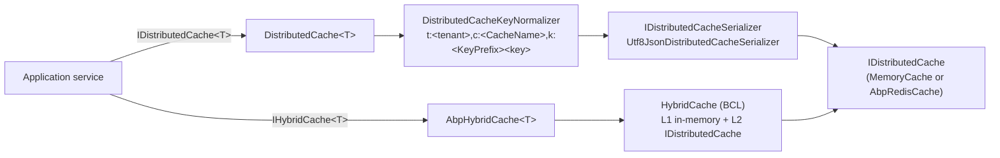

`Volo.Abp.Caching` is the **ABP Framework's typed wrapper** over `Microsoft.Extensions.Caching.Distributed.IDistributedCache`. It adds three things the BCL primitive does not: strong typing per cache item, a tenant‑aware key normalizer, and unit‑of‑work–scoped reads so a cache write inside a transaction does not become visible until the UoW commits. This page covers the contract `IDistributedCache<TCacheItem>` and `IDistributedCache<TCacheItem, TCacheKey>`, the default `DistributedCache<T>` implementation, the `AbpDistributedCacheOptions` knobs (including `KeyPrefix`), and the parallel hybrid stack under the `Hybrid/` directory.

## Where the code lives

Everything in this page is under `framework/src/Volo.Abp.Caching/Volo/Abp/Caching/`:

```text
AbpCachingModule.cs
AbpDistributedCacheOptions.cs
CacheNameAttribute.cs
DistributedCache.cs
DistributedCacheKeyNormalizeArgs.cs
DistributedCacheKeyNormalizer.cs
Hybrid/
  AbpHybridCache.cs
  AbpHybridCacheOptions.cs
  IHybridCache.cs
ICacheSupportsMultipleItems.cs
IDistributedCache.cs
IDistributedCacheKeyNormalizer.cs
IDistributedCacheSerializer.cs
UnitOfWorkCacheItem.cs
Utf8JsonDistributedCacheSerializer.cs
```

The Redis backend that replaces `IDistributedCache` itself lives in `framework/src/Volo.Abp.Caching.StackExchangeRedis/` and is described separately on [Redis caching](/infrastructure/caching-redis).

## The two interfaces

`IDistributedCache.cs` declares the typed wrapper:

```csharp
public interface IDistributedCache<TCacheItem> : IDistributedCache<TCacheItem, string>
    where TCacheItem : class
{
    IDistributedCache<TCacheItem, string> InternalCache { get; }
}

public interface IDistributedCache<TCacheItem, TCacheKey>
    where TCacheItem : class
{
    TCacheItem? Get(TCacheKey key, bool? hideErrors = null, bool considerUow = false);
    Task<TCacheItem?> GetAsync(TCacheKey key, bool? hideErrors = null, bool considerUow = false, CancellationToken token = default);
    KeyValuePair<TCacheKey, TCacheItem?>[] GetMany(IEnumerable<TCacheKey> keys, bool? hideErrors = null, bool considerUow = false);
    TCacheItem? GetOrAdd(TCacheKey key, Func<TCacheItem> factory, Func<DistributedCacheEntryOptions>? optionsFactory = null, bool? hideErrors = null, bool considerUow = false);
    void Set(TCacheKey key, TCacheItem value, DistributedCacheEntryOptions? options = null, bool? hideErrors = null, bool considerUow = false);
    void SetMany(IEnumerable<KeyValuePair<TCacheKey, TCacheItem>> items, DistributedCacheEntryOptions? options = null, bool? hideErrors = null, bool considerUow = false);
    void Refresh(TCacheKey key, bool? hideErrors = null);
    void Remove(TCacheKey key, bool? hideErrors = null, bool considerUow = false);
    /* …async + many variants… */
}
```

Three flags appear on almost every method:

| Flag | Default | Meaning |
| --- | --- | --- |
| `hideErrors` | `null` (falls back to `AbpDistributedCacheOptions.HideErrors`, true by default) | Swallow exceptions thrown by the underlying `IDistributedCache`. |
| `considerUow` | `false` | Route the read/write through a per‑UoW dictionary so it only sees the current transaction's view. |
| `token` (async only) | `default` | Cancellation, wired through `ICancellationTokenProvider`. |

The one‑generic form `IDistributedCache<TCacheItem>` is the common case and is implemented by `DistributedCache<TCacheItem>` (a delegating wrapper) that forwards every call to `IDistributedCache<TCacheItem, string>`, which itself is implemented by `DistributedCache<TCacheItem, TCacheKey>` (the real worker). Both classes live in `DistributedCache.cs`.

## Registration

`AbpCachingModule.cs` wires the cache during DI configuration:

```csharp
public override void ConfigureServices(ServiceConfigurationContext context)
{
    context.Services.AddMemoryCache();
    context.Services.AddDistributedMemoryCache();

    context.Services.AddSingleton(typeof(IDistributedCache<>), typeof(DistributedCache<>));
    context.Services.AddSingleton(typeof(IDistributedCache<,>), typeof(DistributedCache<,>));

    context.Services.AddHybridCache().AddSerializerFactory<AbpHybridCacheJsonSerializerFactory>();
    context.Services.AddSingleton(typeof(IHybridCache<>), typeof(AbpHybridCache<>));
    context.Services.AddSingleton(typeof(IHybridCache<,>), typeof(AbpHybridCache<,>));

    Configure<AbpDistributedCacheOptions>(cacheOptions =>
    {
        cacheOptions.GlobalCacheEntryOptions.SlidingExpiration = TimeSpan.FromMinutes(20);
    });

    if (context.Services.GetAbpHostEnvironment().IsDevelopment())
    {
        Configure<AbpDistributedCacheOptions>(options =>
        {
            options.HideErrors = false;
        });
    }
}
```

Four things to take from this:

1. `AddDistributedMemoryCache()` gives an in‑process fallback so `IDistributedCache` is always resolvable, even without Redis.
2. Both open generics are registered as **singletons** — `DistributedCache<T>` is reusable across all requests.
3. The default sliding expiration is **20 minutes**, applied to every cache item that does not configure its own `DistributedCacheEntryOptions`.
4. `HideErrors` is automatically flipped off in development so cache misconfiguration surfaces as exceptions during testing.

## `DistributedCache<TCacheItem, TCacheKey>` internals

The worker class holds these protected fields (`DistributedCache.cs`):

```csharp
protected string CacheName { get; set; } = default!;
protected bool IgnoreMultiTenancy { get; set; }
protected IDistributedCache Cache { get; }
protected ICancellationTokenProvider CancellationTokenProvider { get; }
protected IDistributedCacheSerializer Serializer { get; }
protected IDistributedCacheKeyNormalizer KeyNormalizer { get; }
protected IServiceScopeFactory ServiceScopeFactory { get; }
protected IUnitOfWorkManager UnitOfWorkManager { get; }
protected DistributedCacheEntryOptions DefaultCacheOptions = default!;
```

`SetDefaultOptions()` runs in the constructor and resolves three things per cache type:

```csharp
protected virtual void SetDefaultOptions()
{
    CacheName = CacheNameAttribute.GetCacheName(typeof(TCacheItem));
    IgnoreMultiTenancy = typeof(TCacheItem).IsDefined(typeof(IgnoreMultiTenancyAttribute), true);
    DefaultCacheOptions = GetDefaultCacheEntryOptions();
}
```

- **Cache name** — `CacheNameAttribute.GetCacheName(typeof(TCacheItem))` either uses the attribute's value or strips the `CacheItem` suffix from the type name (see `CacheNameAttribute.cs`):

  ```csharp
  return cacheItemType.FullName!.RemovePostFix("CacheItem")!;
  ```

  So `Acme.Books.BookCacheItem` becomes the cache name `Acme.Books.Book`.

- **Tenant awareness** — opted out per type via `[IgnoreMultiTenancy]`.

- **Default entry options** — walk `AbpDistributedCacheOptions.CacheConfigurators`, taking the first non‑null result, then fall back to `GlobalCacheEntryOptions`.

`NormalizeKey(TCacheKey key)` builds the wire key by delegating to `IDistributedCacheKeyNormalizer`:

```csharp
protected virtual string NormalizeKey(TCacheKey key)
{
    return KeyNormalizer.NormalizeKey(
        new DistributedCacheKeyNormalizeArgs(
            key.ToString()!, CacheName, IgnoreMultiTenancy));
}
```

## Key normalization and the `KeyPrefix`

`DistributedCacheKeyNormalizer.cs` is short:

```csharp
public virtual string NormalizeKey(DistributedCacheKeyNormalizeArgs args)
{
    var normalizedKey = $"c:{args.CacheName},k:{DistributedCacheOptions.KeyPrefix}{args.Key}";

    if (!args.IgnoreMultiTenancy && CurrentTenant.Id.HasValue)
    {
        normalizedKey = $"t:{CurrentTenant.Id.Value},{normalizedKey}";
    }

    return normalizedKey;
}
```

A cached `Acme.Books.BookCacheItem` keyed by `42` for tenant `b6b…` becomes:

```text
t:b6b…,c:Acme.Books.Book,k:42
```

The `KeyPrefix` on `AbpDistributedCacheOptions` lets multiple apps share the same Redis instance without collision. Tenant isolation is automatic — there is no place in the typed API to pass a tenant, the normalizer reads `ICurrentTenant.Id` ambient state described in [Multi‑tenancy](/multi-tenancy/overview).

## `AbpDistributedCacheOptions`

`AbpDistributedCacheOptions.cs`:

```csharp
public class AbpDistributedCacheOptions
{
    public bool HideErrors { get; set; } = true;
    public string KeyPrefix { get; set; }
    public DistributedCacheEntryOptions GlobalCacheEntryOptions { get; set; }
    public List<Func<string, DistributedCacheEntryOptions?>> CacheConfigurators { get; set; }

    public void ConfigureCache<TCacheItem>(DistributedCacheEntryOptions? options)
        => ConfigureCache(typeof(TCacheItem), options);

    public void ConfigureCache(Type cacheItemType, DistributedCacheEntryOptions? options)
        => ConfigureCache(CacheNameAttribute.GetCacheName(cacheItemType), options);

    public void ConfigureCache(string cacheName, DistributedCacheEntryOptions? options)
        => CacheConfigurators.Add(name => cacheName != name ? null : options);
}
```

A typical application overrides expiration per type:

```csharp
Configure<AbpDistributedCacheOptions>(opt =>
{
    opt.KeyPrefix = "acme-prod:";
    opt.GlobalCacheEntryOptions = new DistributedCacheEntryOptions
    {
        SlidingExpiration = TimeSpan.FromMinutes(5)
    };
    opt.ConfigureCache<BookCacheItem>(new DistributedCacheEntryOptions
    {
        AbsoluteExpirationRelativeToNow = TimeSpan.FromHours(1)
    });
});
```

`CacheConfigurators` is a list of name→options selectors, which is how the module can layer multiple modules' overrides without mutual interference.

## Unit‑of‑work scoped caching (`considerUow`)

Each method takes a `considerUow` flag. When true and there is an active `IUnitOfWork`, reads and writes go through an in‑memory dictionary on the UoW rather than the real cache:

```csharp
public const string UowCacheName = "AbpDistributedCache";

if (ShouldConsiderUow(considerUow))
{
    var value = GetUnitOfWorkCache().GetOrDefault(key)?.GetUnRemovedValueOrNull();
    if (value != null) return value;
}
```

The dictionary stores `UnitOfWorkCacheItem<TValue>` instances (`UnitOfWorkCacheItem.cs`) which track `IsRemoved` to distinguish a real cache value from a tombstone:

```csharp
public class UnitOfWorkCacheItem<TValue> where TValue : class
{
    public bool IsRemoved { get; set; }
    public TValue? Value { get; set; }
    public UnitOfWorkCacheItem<TValue> SetValue(TValue value) { Value = value; IsRemoved = false; return this; }
    public UnitOfWorkCacheItem<TValue> RemoveValue() { Value = null; IsRemoved = true; return this; }
}
```

`UnitOfWorkCacheItemExtensions.GetUnRemovedValueOrNull()` returns `Value` only when `IsRemoved == false`. This means:

- A `Set` with `considerUow: true` inside a transaction stages the value on the UoW; other concurrent transactions see the prior value.
- A `Remove` with `considerUow: true` tombstones the entry locally without nuking the shared cache.
- On UoW completion the staged changes flush to the real `IDistributedCache`.

This is exactly the pattern explained in [Unit of Work](/data/unit-of-work) — every distributed write that should be transactionally consistent with the database opts in via `considerUow: true`.

## Bulk operations: `ICacheSupportsMultipleItems`

Many backends (Redis especially) can move many items in one round trip. `ICacheSupportsMultipleItems.cs` is the bulk hook:

```csharp
public interface ICacheSupportsMultipleItems
{
    byte[]?[] GetMany(IEnumerable<string> keys);
    Task<byte[]?[]> GetManyAsync(IEnumerable<string> keys, CancellationToken token = default);
    void SetMany(IEnumerable<KeyValuePair<string, byte[]>> items, DistributedCacheEntryOptions options);
    void RefreshMany(IEnumerable<string> keys);
    void RemoveMany(IEnumerable<string> keys);
    /* …async variants… */
}
```

When the registered `IDistributedCache` implements this interface, `DistributedCache<T>.GetMany`/`SetMany` use the bulk path; otherwise they fall back to a loop of single operations. `AbpRedisCache` in the Redis package implements it; the in‑memory fallback does not.

## Serialization

`IDistributedCacheSerializer.cs` is a two‑method contract — `byte[] Serialize<TCacheItem>(TCacheItem object)` and the inverse — that decouples the cache from JSON specifics. `Utf8JsonDistributedCacheSerializer.cs` is the default implementation, registered as a singleton in `AbpCachingModule`. Swapping in a different serializer (MessagePack, Protobuf, etc.) is a single `Replace<IDistributedCacheSerializer, …>()`.

## The hybrid stack (`Hybrid/`)

ABP also wraps `Microsoft.Extensions.Caching.Hybrid` (a built‑in L1+L2 cache). The interface is parallel:

```csharp
// IHybridCache.cs
public interface IHybridCache<TCacheItem> : IHybridCache<TCacheItem, string>
    where TCacheItem : class
{
    IHybridCache<TCacheItem, string> InternalCache { get; }
}

public interface IHybridCache<TCacheItem, TCacheKey> where TCacheItem : class
{
    Task<TCacheItem?> GetOrCreateAsync(TCacheKey key, Func<Task<TCacheItem>> factory,
        Func<HybridCacheEntryOptions>? optionsFactory = null,
        bool? hideErrors = null, bool considerUow = false, CancellationToken token = default);
    Task SetAsync(TCacheKey key, TCacheItem value, HybridCacheEntryOptions? options = null,
        bool? hideErrors = null, bool considerUow = false, CancellationToken token = default);
    Task RemoveAsync(TCacheKey key, bool? hideErrors = null, bool considerUow = false, CancellationToken token = default);
    Task RemoveManyAsync(IEnumerable<TCacheKey> keys, bool? hideErrors = null, bool considerUow = false, CancellationToken token = default);
}
```

`AbpHybridCacheOptions.cs` mirrors `AbpDistributedCacheOptions` but stores `HybridCacheEntryOptions`:

```csharp
public class AbpHybridCacheOptions
{
    public bool HideErrors { get; set; } = true;
    public string KeyPrefix { get; set; }
    public HybridCacheEntryOptions GlobalHybridCacheEntryOptions { get; set; }
    public List<Func<string, HybridCacheEntryOptions?>> CacheConfigurators { get; set; }
    public void ConfigureCache<TCacheItem>(HybridCacheEntryOptions? options) { /* … */ }
}
```

Hybrid caching is **opt‑in per call site** — `IDistributedCache<T>` and `IHybridCache<T>` are independently resolvable; the same `KeyPrefix` is used by both so they can coexist on one Redis instance.



## A worked example

A typical application service caching a single book:

```csharp
public class BookAppService : ApplicationService
{
    private readonly IDistributedCache<BookCacheItem, Guid> _cache;
    private readonly IBookRepository _books;

    public BookAppService(IDistributedCache<BookCacheItem, Guid> cache, IBookRepository books)
    {
        _cache = cache;
        _books = books;
    }

    public async Task<BookDto> GetAsync(Guid id)
    {
        var cached = await _cache.GetOrAddAsync(id,
            async () => ObjectMapper.Map<Book, BookCacheItem>(await _books.GetAsync(id)),
            () => new DistributedCacheEntryOptions { SlidingExpiration = TimeSpan.FromMinutes(10) });
        return ObjectMapper.Map<BookCacheItem, BookDto>(cached!);
    }
}
```

What `GetOrAddAsync` does inside `DistributedCache.cs`:

1. Build the wire key via `NormalizeKey(id)`.
2. `await Cache.GetAsync(wireKey)` — possibly `null`.
3. If found, deserialize via `Serializer.Deserialize<BookCacheItem>(bytes)` and return.
4. Otherwise call the factory, serialize via `Serializer.Serialize`, then `Cache.SetAsync` with the resolved options (factory's `optionsFactory` → per‑type configurator → `GlobalCacheEntryOptions`).
5. If `considerUow: true` were passed, steps 2–4 would consult `GetUnitOfWorkCache()` first.

## Error behavior

Every method catches exceptions from the underlying `IDistributedCache`:

```csharp
catch (Exception ex)
{
    if (hideErrors == true)
    {
        await HandleExceptionAsync(ex);
        return null;
    }
    throw;
}
```

`HandleExceptionAsync` resolves an `IExceptionNotifier` from a child scope and logs. Production code typically leaves `HideErrors = true` so a Redis outage degrades to "always miss" instead of a hard failure; development flips it to `false` so misconfiguration surfaces.

## When to use what

| You want… | Use |
| --- | --- |
| Typed, tenant‑aware cache with string keys | `IDistributedCache<BookCacheItem>` |
| Typed cache with Guid / int / composite keys | `IDistributedCache<BookCacheItem, Guid>` |
| Bulk read/write of many keys in one round trip | `GetMany` / `SetMany` (works best with `Volo.Abp.Caching.StackExchangeRedis`) |
| L1 in‑process + L2 distributed | `IHybridCache<BookCacheItem>` |
| Transactionally consistent reads inside a UoW | Pass `considerUow: true` |
| Cache name that is not the type's name | `[CacheName("books")] class BookCacheItem` |
| Skip tenant prefix on a global lookup table | `[IgnoreMultiTenancy] class CurrencyCacheItem` |

## Cross‑references

| Topic | See |
| --- | --- |
| Tenant id resolution behind `ICurrentTenant` | [Multi‑tenancy](/multi-tenancy/overview) |
| UoW transactional staging used by `considerUow` | [Unit of Work](/data/unit-of-work) |
| Redis‑specific options and connection management | [Redis caching](/infrastructure/caching-redis) |
| Cache invalidation via distributed events | [Distributed event bus](/infrastructure/event-bus-distributed) |
| `AuditingInterceptor` chain that wraps cached calls | [Auditing](/infrastructure/auditing) |
