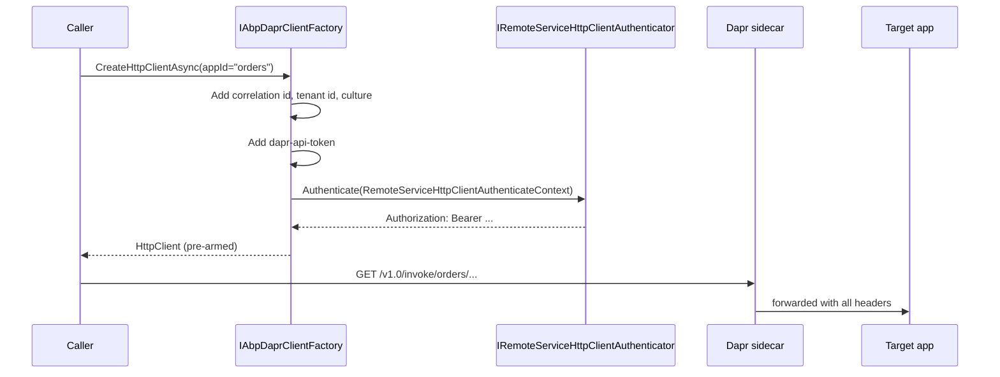

`Volo.Abp.Dapr` is the foundation that every other Dapr-backed ABP module — distributed lock, event bus, HTTP client, MVC app-id forwarding — depends on. It centralises Dapr endpoint configuration, API tokens, JSON serialization, and `DaprClient`/`HttpClient` construction so consumers never new-up Dapr SDK objects directly. This page covers `IAbpDaprClientFactory`, `AbpDaprOptions`, `IDaprApiTokenProvider`, `IDaprSerializer`, and how `AbpDaprModule` integrates with the rest of the framework.

## Why an extra layer?

The Dapr .NET SDK ships `DaprClient` and a builder. Two operational concerns convince ABP to wrap them:

1. **Tokens and headers** — Dapr enforces both an API token (sidecar-only auth) and an optional app token (per-app auth). ABP also needs to add correlation id, tenant id, current culture, and bearer auth headers on every `HttpClient`.
2. **JSON contract** — Dapr serialises payloads with `System.Text.Json` by default. ABP routes the same payloads through `IJsonSerializer` so the converters configured in [/infrastructure/json-serialization](/infrastructure/json-serialization) (date formats, extra properties, enum-as-string) apply.

## AbpDaprOptions

`framework/src/Volo.Abp.Dapr/Volo/Abp/Dapr/AbpDaprOptions.cs` is the configuration object:

```csharp AbpDaprOptions.cs
public class AbpDaprOptions
{
    public string? HttpEndpoint { get; set; }
    public string? GrpcEndpoint { get; set; }
    public string? DaprApiToken { get; set; }
    public string? AppApiToken { get; set; }
}
```

`AbpDaprModule` binds the `Dapr` configuration section and falls back to environment variables, so the same code runs in a dev container and a fully tokenised production sidecar:

```csharp AbpDaprModule.cs (excerpt)
public override void ConfigureServices(ServiceConfigurationContext context)
{
    var configuration = context.Services.GetConfiguration();
    Configure<AbpDaprOptions>(configuration.GetSection("Dapr"));
    Configure<AbpDaprOptions>(options =>
    {
        if (options.DaprApiToken.IsNullOrWhiteSpace())
        {
            var confEnv = configuration["DAPR_API_TOKEN"];
            if (!confEnv.IsNullOrWhiteSpace()) options.DaprApiToken = confEnv!;
            else
            {
                var env = Environment.GetEnvironmentVariable("DAPR_API_TOKEN");
                if (!env.IsNullOrWhiteSpace()) options.DaprApiToken = env!;
            }
        }
        if (options.AppApiToken.IsNullOrWhiteSpace())
        {
            // same logic for APP_API_TOKEN
        }
    });
}
```

| Option | Source priority |
| --- | --- |
| `HttpEndpoint` | `Dapr:HttpEndpoint` configuration section. |
| `GrpcEndpoint` | `Dapr:GrpcEndpoint`. |
| `DaprApiToken` | `Dapr:DaprApiToken` → `DAPR_API_TOKEN` config key → `DAPR_API_TOKEN` env var. |
| `AppApiToken` | `Dapr:AppApiToken` → `APP_API_TOKEN` config key → `APP_API_TOKEN` env var. |

A typical `appsettings.json` snippet:

```json
{
  "Dapr": {
    "HttpEndpoint": "http://localhost:3500",
    "GrpcEndpoint": "http://localhost:50001"
  }
}
```

Leaving endpoints blank tells the Dapr SDK to use its own defaults (`DAPR_HTTP_PORT`/`DAPR_GRPC_PORT` env vars set by the sidecar).

## IAbpDaprClientFactory

`framework/src/Volo.Abp.Dapr/Volo/Abp/Dapr/IAbpDaprClientFactory.cs`:

```csharp IAbpDaprClientFactory.cs
public interface IAbpDaprClientFactory
{
    Task<DaprClient> CreateAsync(Action<DaprClientBuilder>? builderAction = null);

    Task<HttpClient> CreateHttpClientAsync(
        string? appId = null,
        string? daprEndpoint = null,
        string? daprApiToken = null
    );
}
```

The default `AbpDaprClientFactory` is a singleton — but the returned `DaprClient`/`HttpClient` instances are not cached. The wins are deterministic construction and a single place to attach tokens.

### Building a DaprClient

```csharp AbpDaprClientFactory.cs (excerpt)
public virtual Task<DaprClient> CreateAsync(Action<DaprClientBuilder>? builderAction = null)
{
    var builder = new DaprClientBuilder()
        .UseJsonSerializationOptions(JsonSerializerOptions);

    if (!DaprOptions.HttpEndpoint.IsNullOrWhiteSpace())
        builder.UseHttpEndpoint(DaprOptions.HttpEndpoint);

    if (!DaprOptions.GrpcEndpoint.IsNullOrWhiteSpace())
        builder.UseGrpcEndpoint(DaprOptions.GrpcEndpoint);

    var apiToken = DaprApiTokenProvider.GetDaprApiToken();
    if (!apiToken.IsNullOrWhiteSpace())
        builder.UseDaprApiToken(apiToken);

    builderAction?.Invoke(builder);
    return Task.FromResult(builder.Build());
}
```

The `JsonSerializerOptions` come from `AbpSystemTextJsonSerializerOptions` so every Dapr state-store value, pub/sub envelope, and binding payload round-trips through the same converters. Pass a `builderAction` callback when a specific call needs a custom timeout or HTTP handler.

### Building an HttpClient

`CreateHttpClientAsync` is the unique value-add of this module — it wraps Dapr's `DaprClient.CreateInvokeHttpClient` and then attaches ABP cross-cutting headers and an outgoing bearer token:

```csharp AbpDaprClientFactory.cs (excerpt)
public virtual async Task<HttpClient> CreateHttpClientAsync(
    string? appId = null, string? daprEndpoint = null, string? daprApiToken = null)
{
    if (daprEndpoint.IsNullOrWhiteSpace() && !DaprOptions.HttpEndpoint.IsNullOrWhiteSpace())
        daprEndpoint = DaprOptions.HttpEndpoint;

    var httpClient = DaprClient.CreateInvokeHttpClient(
        appId, daprEndpoint, daprApiToken ?? DaprApiTokenProvider.GetDaprApiToken());

    AddHeaders(httpClient);

    var request = new HttpRequestMessage();
    await RemoteServiceHttpClientAuthenticator.Authenticate(
        new RemoteServiceHttpClientAuthenticateContext(
            httpClient, request, new RemoteServiceConfiguration("/"), string.Empty));

    var bearerToken = request.Headers.Authorization?.Parameter;
    if (!bearerToken.IsNullOrWhiteSpace())
        httpClient.SetBearerToken(bearerToken);

    return httpClient;
}

protected virtual void AddHeaders(HttpClient httpClient)
{
    httpClient.DefaultRequestHeaders.Add(
        AbpCorrelationIdOptions.Value.HttpHeaderName, CorrelationIdProvider.Get());

    if (CurrentTenant.Id.HasValue)
        httpClient.DefaultRequestHeaders.Add(
            TenantResolverConsts.DefaultTenantKey, CurrentTenant.Id.Value.ToString());

    var currentCulture = CultureInfo.CurrentUICulture.Name ?? CultureInfo.CurrentCulture.Name;
    if (!currentCulture.IsNullOrEmpty())
        httpClient.DefaultRequestHeaders.AcceptLanguage.Add(
            new StringWithQualityHeaderValue(currentCulture));

    httpClient.DefaultRequestHeaders.Add("X-Requested-With", "XMLHttpRequest");
}
```

That single method gives any caller:

| Header | Source |
| --- | --- |
| Correlation id | `ICorrelationIdProvider.Get()` |
| Tenant id (`__tenant`) | `ICurrentTenant.Id` |
| `Accept-Language` | `CultureInfo.CurrentUICulture` |
| `X-Requested-With` | hard-coded |
| `Authorization: Bearer` | `IRemoteServiceHttpClientAuthenticator` (typically IdentityServer/OpenIddict) |
| `dapr-api-token` | `IDaprApiTokenProvider.GetDaprApiToken()` |

The result is a fully-armed `HttpClient` that calls another app through `invoke/{appId}` with auth + correlation propagated.

## IDaprApiTokenProvider

`IDaprApiTokenProvider` and the default `DaprApiTokenProvider` give ABP a seam to swap tokens at runtime (for tenant-specific tokens, or to rotate from a secret store):

```csharp IDaprApiTokenProvider.cs
public interface IDaprApiTokenProvider
{
    string? GetDaprApiToken();
    string? GetAppApiToken();
}
```

```csharp DaprApiTokenProvider.cs
public class DaprApiTokenProvider : IDaprApiTokenProvider, ISingletonDependency
{
    public virtual string? GetDaprApiToken() => Options.DaprApiToken;
    public virtual string? GetAppApiToken() => Options.AppApiToken;
}
```

`AppApiToken` is the **incoming** token an ABP app accepts from a Dapr sidecar — used by `Volo.Abp.AspNetCore.Mvc.Dapr` to filter inbound requests. `DaprApiToken` is the **outgoing** token the factory attaches.

## IDaprSerializer

`IDaprSerializer` and `Utf8JsonDaprSerializer` are the small bridge from Dapr's raw `byte[]` payloads to `IJsonSerializer`:

```csharp Utf8JsonDaprSerializer.cs
public class Utf8JsonDaprSerializer : IDaprSerializer, ITransientDependency
{
    public byte[] Serialize(object obj)
        => Encoding.UTF8.GetBytes(_jsonSerializer.Serialize(obj));

    public string SerializeToString(object obj)
        => _jsonSerializer.Serialize(obj);

    public object Deserialize(byte[] value, Type type)
        => _jsonSerializer.Deserialize(type, Encoding.UTF8.GetString(value));

    public object Deserialize(string value, Type type)
        => _jsonSerializer.Deserialize(type, value);
}
```

`Volo.Abp.EventBus.Dapr` and `Volo.Abp.DistributedLocking.Dapr` consume `IDaprSerializer` when shaping payloads, so a custom `IJsonSerializer` (Newtonsoft, your own) propagates automatically.

## AbpDaprModule

The module's dependencies surface what the factory leans on:

```csharp AbpDaprModule.cs
[DependsOn(
    typeof(AbpJsonModule),
    typeof(AbpMultiTenancyAbstractionsModule),
    typeof(AbpHttpClientModule)
)]
public class AbpDaprModule : AbpModule { ... }
```

- `AbpJsonModule` brings `IJsonSerializer` for `Utf8JsonDaprSerializer`.
- `AbpMultiTenancyAbstractionsModule` brings `ICurrentTenant` for header propagation.
- `AbpHttpClientModule` brings `IRemoteServiceHttpClientAuthenticator` and `AbpCorrelationIdOptions`.

## Where to use the factory

```csharp
public class WeatherForwarder
{
    private readonly IAbpDaprClientFactory _factory;

    public WeatherForwarder(IAbpDaprClientFactory factory) => _factory = factory;

    public async Task<Forecast> CallAsync(string city)
    {
        // Service invocation through Dapr
        var http = await _factory.CreateHttpClientAsync(appId: "weather-service");
        return await http.GetFromJsonAsync<Forecast>($"/api/forecast/{city}");
    }

    public async Task SaveAsync(string key, ForecastState state)
    {
        // State store
        var client = await _factory.CreateAsync();
        await client.SaveStateAsync("statestore", key, state);
    }
}
```

For inbound side concerns — receiving pub/sub messages, accepting service-invocation calls — depend on `Volo.Abp.EventBus.Dapr` and `Volo.Abp.AspNetCore.Mvc.Dapr` respectively; they both consume `IAbpDaprClientFactory` and `IDaprApiTokenProvider` from this module.

## Token + header propagation diagram



## Cheat sheet

| Need | Code |
| --- | --- |
| Get a DaprClient | `var c = await _factory.CreateAsync();` |
| Customise builder | `await _factory.CreateAsync(b => b.UseHttpClientHandler(...));` |
| Invoke another app | `var http = await _factory.CreateHttpClientAsync(appId: "billing");` |
| Read inbound app token | `_daprApiTokenProvider.GetAppApiToken()` |
| Override JSON serializer for Dapr | Replace `IDaprSerializer` (e.g. for protobuf bridging). |

## Sibling modules

| Module | Purpose |
| --- | --- |
| `Volo.Abp.EventBus.Dapr` | Pub/sub distributed events. See [/infrastructure/event-bus-dapr](/infrastructure/event-bus-dapr). |
| `Volo.Abp.DistributedLocking.Dapr` | Distributed lock store. See [/infrastructure/distributed-locking](/infrastructure/distributed-locking). |
| `Volo.Abp.Http.Client.Dapr` | Use Dapr service invocation as the transport for dynamic HTTP clients. |
| `Volo.Abp.AspNetCore.Mvc.Dapr` | Inbound app-id and app-token filtering for MVC. |
| `Volo.Abp.AspNetCore.Mvc.Dapr.EventBus` | Pub/sub topics expressed as MVC routes. |

All of them depend on this module — configuring `AbpDaprOptions` once is enough to feed them.

## See also

- [/infrastructure/overview](/infrastructure/overview)
- [/infrastructure/json-serialization](/infrastructure/json-serialization) — converters that flow into Dapr payloads.
- [/infrastructure/distributed-locking](/infrastructure/distributed-locking) — Dapr lock store provider.
- [/infrastructure/event-bus-dapr](/infrastructure/event-bus-dapr) — Dapr pub/sub.
- [/core/tracing-and-correlation](/core/tracing-and-correlation) — `ICorrelationIdProvider` used by the factory.
- [/multi-tenancy/volo-abp-multitenancy](/multi-tenancy/volo-abp-multitenancy) — tenant header propagation.
