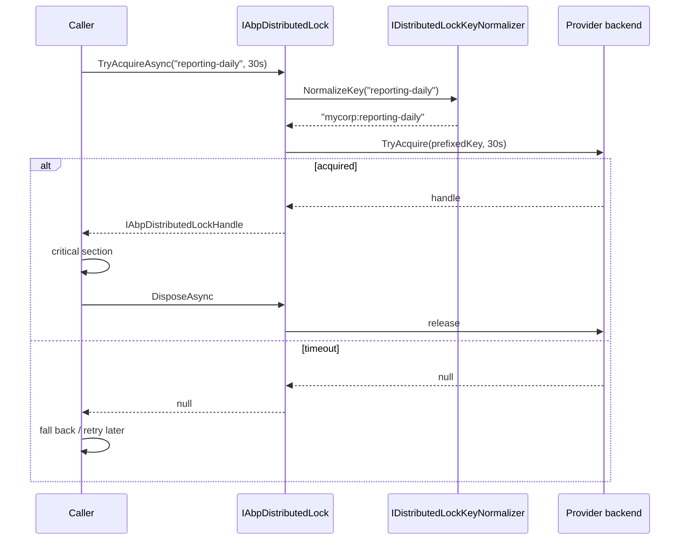

ABP Framework abstracts named distributed locks behind a single tiny interface, `IAbpDistributedLock`, so the same code that prevents a periodic worker from running twice across pods also runs in unit tests with a pure in-memory implementation. This page walks through the abstraction, the local default, the key prefix model, the Medallion-based pluggable provider, and the Dapr lock store binding shipped in `Volo.Abp.DistributedLocking.Dapr`.

<Tip>
ABP's distributed lock is **try-and-fail**, not "block forever" — the API returns `null` when the lock cannot be acquired within the timeout. This forces you to write explicit fallbacks instead of deadlocking.
</Tip>

## The IAbpDistributedLock contract

`framework/src/Volo.Abp.DistributedLocking.Abstractions/Volo/Abp/DistributedLocking/IAbpDistributedLock.cs` defines the only method you need to learn:

```csharp IAbpDistributedLock.cs
public interface IAbpDistributedLock
{
    Task<IAbpDistributedLockHandle?> TryAcquireAsync(
        [NotNull] string name,
        TimeSpan timeout = default,
        CancellationToken cancellationToken = default
    );
}
```

The return type is `IAbpDistributedLockHandle?` — an `IAsyncDisposable` handle, or `null` if the timeout elapses. Disposal releases the lock. The companion `IAbpDistributedLockHandle` in the same folder is just a marker:

```csharp
public interface IAbpDistributedLockHandle : IAsyncDisposable { }
```

## Acquire-and-release pattern

The recommended usage is `await using` with an explicit null check:

```csharp
public class ReportingService : ITransientDependency
{
    private readonly IAbpDistributedLock _distributedLock;

    public async Task RunDailyAsync()
    {
        await using var handle = await _distributedLock.TryAcquireAsync(
            name: "reporting-daily",
            timeout: TimeSpan.FromSeconds(30));

        if (handle == null)
        {
            // Another node owns the lock. Skip or retry later.
            return;
        }

        // Critical section — exclusive across the cluster.
        await GenerateReportAsync();
    }
}
```

Use small, descriptive names. Two callers asking for the same lock name compete; different names do not. The `timeout` is the **maximum wait** to acquire — `default` (zero) means "fail immediately".

## Key normalization

Multiple ABP applications can share a Redis or SQL instance, so the framework prefixes every lock name. `IDistributedLockKeyNormalizer` in `framework/src/Volo.Abp.DistributedLocking.Abstractions/Volo/Abp/DistributedLocking/IDistributedLockKeyNormalizer.cs` is the seam:

```csharp
public interface IDistributedLockKeyNormalizer
{
    string NormalizeKey(string name);
}
```

The default `DistributedLockKeyNormalizer` simply prepends `AbpDistributedLockOptions.KeyPrefix`:

```csharp DistributedLockKeyNormalizer.cs
public virtual string NormalizeKey(string name)
{
    return $"{Options.KeyPrefix}{name}";
}
```

Configure the prefix once per application, typically per environment:

```csharp
Configure<AbpDistributedLockOptions>(o => o.KeyPrefix = "mycorp-billing:");
```

Every provider — local, Medallion, Dapr — calls `NormalizeKey` before talking to its backend, so prefixes apply uniformly.

## The local default

If no other provider is registered, `LocalAbpDistributedLock` (in the abstractions module) takes over. It delegates to `Volo.Abp.Threading.KeyedLock` — a pure in-process keyed semaphore — so the same code "just works" in a single-instance dev host or in unit tests:

```csharp LocalAbpDistributedLock.cs
public async Task<IAbpDistributedLockHandle?> TryAcquireAsync(
    string name, TimeSpan timeout = default, CancellationToken cancellationToken = default)
{
    Check.NotNullOrWhiteSpace(name, nameof(name));
    var key = DistributedLockKeyNormalizer.NormalizeKey(name);
    var disposable = await KeyedLock.TryLockAsync(key, timeout, cancellationToken);
    if (disposable == null) return null;
    return new LocalAbpDistributedLockHandle(disposable);
}
```

There is also `NullAbpDistributedLock` for tests that want every acquire to succeed unconditionally — it returns a no-op handle.

## The Medallion provider

`Volo.Abp.DistributedLocking` brings real distributed locking by bridging ABP onto [DistributedLock](https://github.com/madelson/DistributedLock) (Medallion). The package registers `MedallionAbpDistributedLock` with `[Dependency(ReplaceServices = true)]` so it transparently replaces the local default:

```csharp MedallionAbpDistributedLock.cs
[Dependency(ReplaceServices = true)]
public class MedallionAbpDistributedLock : IAbpDistributedLock, ITransientDependency
{
    protected IDistributedLockProvider DistributedLockProvider { get; }
    protected ICancellationTokenProvider CancellationTokenProvider { get; }
    protected IDistributedLockKeyNormalizer DistributedLockKeyNormalizer { get; }

    public async Task<IAbpDistributedLockHandle?> TryAcquireAsync(
        string name, TimeSpan timeout = default, CancellationToken cancellationToken = default)
    {
        var key = DistributedLockKeyNormalizer.NormalizeKey(name);
        CancellationTokenProvider.FallbackToProvider(cancellationToken);

        var handle = await DistributedLockProvider.TryAcquireLockAsync(
            key, timeout, CancellationTokenProvider.FallbackToProvider(cancellationToken));

        return handle == null ? null : new MedallionAbpDistributedLockHandle(handle);
    }
}
```

You wire the actual backend (Redis, SQL Server, Postgres, ZooKeeper, etc.) by registering an `IDistributedLockProvider` from one of the Medallion adapter packages — for example with Redis:

```csharp
context.Services.AddSingleton<IDistributedLockProvider>(sp =>
{
    var multiplexer = ConnectionMultiplexer.Connect("localhost:6379");
    return new RedisDistributedSynchronizationProvider(multiplexer.GetDatabase());
});
```

`AbpDistributedLockHandleExtensions.ToDistributedSynchronizationHandle` unwraps the ABP handle back to the underlying Medallion `IDistributedSynchronizationHandle` when you need provider-specific features.

## The Dapr provider

`Volo.Abp.DistributedLocking.Dapr` routes lock requests through Dapr's [Distributed Lock building block](https://docs.dapr.io/developing-applications/building-blocks/distributed-lock/distributed-lock-api-overview/) so the lock store can be Redis, ZooKeeper, Consul, or any other Dapr-supported component without changing application code:

```csharp DaprAbpDistributedLock.cs
[Dependency(ReplaceServices = true)]
public class DaprAbpDistributedLock : IAbpDistributedLock, ITransientDependency
{
    public async Task<IAbpDistributedLockHandle?> TryAcquireAsync(
        string name, TimeSpan timeout = default, CancellationToken cancellationToken = default)
    {
        name = DistributedLockKeyNormalizer.NormalizeKey(name);
        var daprClient = await DaprClientFactory.CreateAsync();
        var lockResponse = await daprClient.Lock(
            DistributedLockDaprOptions.StoreName,
            name,
            DistributedLockDaprOptions.Owner ?? Guid.NewGuid().ToString(),
            (int)DistributedLockDaprOptions.DefaultExpirationTimeout.TotalSeconds,
            cancellationToken);

        if (lockResponse == null || !lockResponse.Success) return null;
        return new DaprAbpDistributedLockHandle(lockResponse);
    }
}
```

`AbpDistributedLockDaprOptions` is the configuration knob:

```csharp AbpDistributedLockDaprOptions.cs
public class AbpDistributedLockDaprOptions
{
    public string StoreName { get; set; } = default!;
    public string? Owner { get; set; }
    public TimeSpan DefaultExpirationTimeout { get; set; }

    public AbpDistributedLockDaprOptions()
    {
        DefaultExpirationTimeout = TimeSpan.FromMinutes(2);
    }
}
```

| Property | Purpose |
| --- | --- |
| `StoreName` | Name of the Dapr lock store component (matches its YAML `metadata.name`). |
| `Owner` | Optional stable owner identifier; defaults to a new GUID per acquire. |
| `DefaultExpirationTimeout` | TTL Dapr applies — the lock auto-releases after this even if the handle is never disposed (protects against crashed holders). |

Set the store name in `appsettings.json` and rely on the `AbpDaprModule` integration:

```csharp
Configure<AbpDistributedLockDaprOptions>(o =>
{
    o.StoreName = "redislock";
    o.DefaultExpirationTimeout = TimeSpan.FromMinutes(5);
});
```

## Provider matrix

| Package | Class registered | Backend | Notes |
| --- | --- | --- | --- |
| `Volo.Abp.DistributedLocking.Abstractions` | `LocalAbpDistributedLock` | In-process `KeyedLock` | Default; pure async semaphore. |
| `Volo.Abp.DistributedLocking.Abstractions` | `NullAbpDistributedLock` | No-op | Always succeeds; useful in tests. |
| `Volo.Abp.DistributedLocking` | `MedallionAbpDistributedLock` | Any `IDistributedLockProvider` (Redis, SQL, etc.) | Replaces local; choose Medallion adapter for backend. |
| `Volo.Abp.DistributedLocking.Dapr` | `DaprAbpDistributedLock` | Dapr lock store component | Replaces local; depends on `Volo.Abp.Dapr`. |

## Acquire flow



## When to use a distributed lock

- **Periodic background workers** that must run on exactly one node — wrap `DoWorkAsync` body. See [/infrastructure/background-workers](/infrastructure/background-workers).
- **One-shot bootstrap tasks** (data seeding, schema upgrades) where the [data seeding](/data/data-seeding) pipeline races between pods.
- **Coordinating writes** to an external resource (file share, API quota) when no local DB lock is available.

Do **not** use it as a substitute for [unit-of-work](/data/unit-of-work) transactions inside a single database — the DB transaction is faster and stronger.

## Diagnostics

When the lock fails to acquire, `TryAcquireAsync` returns `null` — there is no exception. Wrap the check in your own logging:

```csharp
await using var handle = await _lock.TryAcquireAsync(name, TimeSpan.FromSeconds(15));
if (handle == null)
{
    _logger.LogInformation("Skipping {Job}; another instance holds the lock", name);
    return;
}
```

Keep critical sections short — Medallion's Redis adapter and Dapr's lock store both enforce TTLs, so a hung holder eventually loses the lock and a sibling can proceed.

## See also

- [/infrastructure/overview](/infrastructure/overview) — full infrastructure map.
- [/infrastructure/background-workers](/infrastructure/background-workers) — the most common consumer of distributed locks.
- [/infrastructure/caching-redis](/infrastructure/caching-redis) — share the same Redis multiplexer between cache and lock provider.
- [/infrastructure/dapr-integration](/infrastructure/dapr-integration) — `IAbpDaprClientFactory` that the Dapr lock provider uses.
