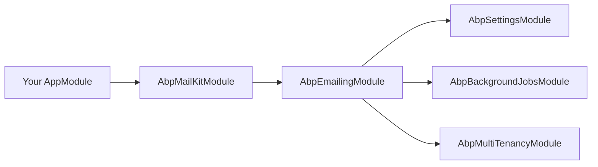
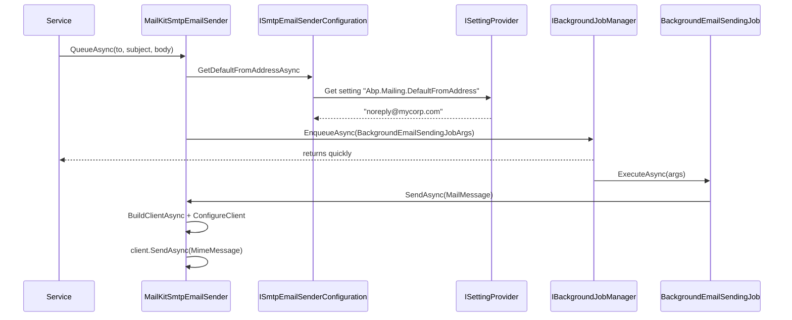

ABP Framework abstracts email sending behind `IEmailSender` so application code does not depend on `System.Net.Mail` or any specific SMTP library. This page covers the `IEmailSender` contract, `EmailSenderBase` (with its background-queue integration), `NullEmailSender` for development, settings-driven SMTP configuration, and the recommended `MailKitSmtpEmailSender` in `Volo.Abp.MailKit` that replaces the legacy `System.Net.Mail.SmtpClient`.

## IEmailSender

`framework/src/Volo.Abp.Emailing/Volo/Abp/Emailing/IEmailSender.cs` defines the application-facing API. Three send overloads, two queue overloads:

```csharp IEmailSender.cs
public interface IEmailSender
{
    Task SendAsync(string to, string? subject, string? body,
        bool isBodyHtml = true, AdditionalEmailSendingArgs? args = null);

    Task SendAsync(string from, string to, string? subject, string? body,
        bool isBodyHtml = true, AdditionalEmailSendingArgs? args = null);

    Task SendAsync(MailMessage mail, bool normalize = true);

    Task QueueAsync(string to, string subject, string body,
        bool isBodyHtml = true, AdditionalEmailSendingArgs? args = null);

    Task QueueAsync(string from, string to, string subject, string body,
        bool isBodyHtml = true, AdditionalEmailSendingArgs? args = null);
}
```

`SendAsync` sends immediately and awaits completion. `QueueAsync` enqueues a `BackgroundEmailSendingJobArgs` through `IBackgroundJobManager` so the request returns quickly and the SMTP roundtrip happens out of band. If background jobs are unavailable (`IBackgroundJobManager.IsAvailable()` returns false), `QueueAsync` falls back to a direct synchronous send.

`AdditionalEmailSendingArgs` (same folder) carries CC recipients and `EmailAttachment` byte streams — the base class iterates them and adds them to the `MailMessage`.

## EmailSenderBase

`framework/src/Volo.Abp.Emailing/Volo/Abp/Emailing/EmailSenderBase.cs` is the abstract base that every concrete sender inherits. It handles three orthogonal concerns:

1. **Building** a `MailMessage` from the simple-args overloads.
2. **Normalising** the message — populating the `From` header from `IEmailSenderConfiguration.GetDefaultFromAddressAsync` and forcing UTF-8 encodings.
3. **Queueing** via `IBackgroundJobManager` with multi-tenancy preserved.

```csharp EmailSenderBase.cs (excerpt)
public virtual async Task QueueAsync(string to, string subject, string body,
    bool isBodyHtml = true, AdditionalEmailSendingArgs? args = null)
{
    await ValidateEmailAddressAsync(to);

    if (!BackgroundJobManager.IsAvailable())
    {
        await SendAsync(to, subject, body, isBodyHtml, args);
        return;
    }

    await BackgroundJobManager.EnqueueAsync(new BackgroundEmailSendingJobArgs
    {
        TenantId = CurrentTenant.Id,
        To = to, Subject = subject, Body = body,
        IsBodyHtml = isBodyHtml,
        AdditionalEmailSendingArgs = args
    });
}

protected abstract Task SendEmailAsync(MailMessage mail);
```

Derived classes only implement `SendEmailAsync(MailMessage)` — the rest is shared.

### Normalisation

`NormalizeMailAsync` fills missing fields and sets encodings:

```csharp
protected virtual async Task NormalizeMailAsync(MailMessage mail)
{
    if (mail.From == null || mail.From.Address.IsNullOrEmpty())
    {
        mail.From = new MailAddress(
            await Configuration.GetDefaultFromAddressAsync(),
            await Configuration.GetDefaultFromDisplayNameAsync(),
            Encoding.UTF8);
    }
    if (mail.HeadersEncoding == null) mail.HeadersEncoding = Encoding.UTF8;
    if (mail.SubjectEncoding == null) mail.SubjectEncoding = Encoding.UTF8;
    if (mail.BodyEncoding == null) mail.BodyEncoding = Encoding.UTF8;
}
```

That is why you can call `SendAsync("user@x.com", "Hi", "...")` without ever setting `From` — the default from-address comes from settings.

## NullEmailSender

`NullEmailSender` is the development-time implementation. It logs the message instead of sending it, which is invaluable when running tests or local services without an SMTP server:

```csharp NullEmailSender.cs
protected override Task SendEmailAsync(MailMessage mail)
{
    Logger.LogWarning("USING NullEmailSender!");
    Logger.LogDebug(mail.To.ToString());
    Logger.LogDebug(mail.Subject);
    Logger.LogDebug(mail.Body);
    return Task.FromResult(0);
}
```

Wire it explicitly only when you need to ignore email entirely — for instance in test runners:

```csharp
context.Services.AddSingleton<IEmailSender, NullEmailSender>();
```

## Background email job

`BackgroundEmailSendingJob` is what `QueueAsync` dispatches to. The job resolves the configured `IEmailSender` from DI inside the worker scope, switches to the saved `TenantId`, and calls `SendAsync(MailMessage)`. Because the job uses `BackgroundEmailSendingJobArgs` (a plain POCO), it is serializable by every background-job storage backend (in-memory, Hangfire, Quartz, RabbitMQ).

| Field | Purpose |
| --- | --- |
| `TenantId` | Restores `ICurrentTenant` before resolving settings. |
| `From` / `To` / `Subject` / `Body` | Message body. |
| `IsBodyHtml` | Toggles `MailMessage.IsBodyHtml`. |
| `AdditionalEmailSendingArgs` | Forwards CC and attachments. |

See [/infrastructure/background-jobs](/infrastructure/background-jobs) for the worker model.

## SMTP configuration via settings

`ISmtpEmailSenderConfiguration` (in `framework/src/Volo.Abp.Emailing/Volo/Abp/Emailing/Smtp/`) projects SMTP options out of the ABP settings system rather than `IOptions`. The default `SmtpEmailSenderConfiguration` reads each setting through `ISettingProvider`:

```csharp SmtpEmailSenderConfiguration.cs
public Task<string> GetHostAsync()
    => GetNotEmptySettingValueAsync(EmailSettingNames.Smtp.Host);

public async Task<int> GetPortAsync()
    => (await GetNotEmptySettingValueAsync(EmailSettingNames.Smtp.Port)).To<int>();

public async Task<bool> GetEnableSslAsync()
    => (await GetNotEmptySettingValueAsync(EmailSettingNames.Smtp.EnableSsl)).To<bool>();
```

Settings are global by default but can be overridden per-tenant — letting each tenant supply its own SMTP server without rebuilding the app.

`EmailSettingNames.Smtp` defines:

| Setting | Purpose |
| --- | --- |
| `Smtp.Host` | SMTP server hostname or IP. |
| `Smtp.Port` | SMTP port. |
| `Smtp.UserName` / `Smtp.Password` | Optional credentials. |
| `Smtp.Domain` | Optional NTLM domain. |
| `Smtp.EnableSsl` | TLS toggle. |
| `Smtp.UseDefaultCredentials` | Skip user/password, use Windows auth. |

`EmailSettingNames.DefaultFromAddress` and `EmailSettingNames.DefaultFromDisplayName` populate the default `From` header.

## Built-in SMTP sender

`SmtpEmailSender` builds a stock `System.Net.Mail.SmtpClient` and sends the message. It is registered as a transient `ISmtpEmailSender` and as the default `IEmailSender` — but it **logs a warning** because Microsoft has officially discouraged `SmtpClient` for new development:

```csharp SmtpEmailSender.cs (excerpt)
protected async override Task SendEmailAsync(MailMessage mail)
{
    using (var smtpClient = await BuildClientAsync())
    {
        Logger.LogWarning(
            "We don't recommend that you use the SmtpClient class for new development ... "
            + "Use MailKit or other libraries instead.");
        await smtpClient.SendMailAsync(mail);
    }
}
```

Add the `Volo.Abp.MailKit` module to silence the warning and pick up better TLS handling.

## MailKit provider

`Volo.Abp.MailKit` registers `MailKitSmtpEmailSender` with `[Dependency(ServiceLifetime.Transient, ReplaceServices = true)]` so it transparently takes over from `SmtpEmailSender`. It uses `MailKit.Net.Smtp.SmtpClient`, which speaks modern TLS, OAuth2, DSN, and IDN out of the box.

```csharp MailKitSmtpEmailSender.cs (excerpt)
protected async override Task SendEmailAsync(MailMessage mail)
{
    using (var client = await BuildClientAsync())
    {
        var message = MimeMessage.CreateFromMailMessage(mail);
        message.MessageId = MimeUtils.GenerateMessageId();
        await client.SendAsync(message);
        await client.DisconnectAsync(true);
    }
}

public async Task<SmtpClient> BuildClientAsync()
{
    var client = new SmtpClient();
    await ConfigureClient(client);
    return client;
}

protected virtual async Task ConfigureClient(SmtpClient client)
{
    await client.ConnectAsync(
        await SmtpConfiguration.GetHostAsync(),
        await SmtpConfiguration.GetPortAsync(),
        await GetSecureSocketOption());

    if (await SmtpConfiguration.GetUseDefaultCredentialsAsync()) return;

    await client.AuthenticateAsync(
        await SmtpConfiguration.GetUserNameAsync(),
        await SmtpConfiguration.GetPasswordAsync());
}
```

`AbpMailKitOptions` lets you pin the `SecureSocketOptions`:

```csharp AbpMailKitOptions.cs
public class AbpMailKitOptions
{
    public SecureSocketOptions? SecureSocketOption { get; set; }
}
```

When unset, `GetSecureSocketOption()` picks `SslOnConnect` or `StartTlsWhenAvailable` based on the `Smtp.EnableSsl` setting:

```csharp
protected virtual async Task<SecureSocketOptions> GetSecureSocketOption()
{
    if (AbpMailKitOptions.SecureSocketOption.HasValue)
        return AbpMailKitOptions.SecureSocketOption.Value;
    return await SmtpConfiguration.GetEnableSslAsync()
        ? SecureSocketOptions.SslOnConnect
        : SecureSocketOptions.StartTlsWhenAvailable;
}
```

For example, to force STARTTLS regardless of the setting:

```csharp
Configure<AbpMailKitOptions>(o => o.SecureSocketOption = SecureSocketOptions.StartTls);
```

## Module dependencies



`AbpMailKitModule` simply `[DependsOn(typeof(AbpEmailingModule))]` — the rest of the wiring is handled by ABP's conventional registrar.

## End-to-end flow



## Choosing the right call

| Scenario | API |
| --- | --- |
| Best-effort marketing email | `QueueAsync` — let the background worker retry. |
| Password reset where the user is staring at a spinner | `SendAsync` — synchronous, surfaces errors. |
| Templated body | Compose with `ITemplateRenderer` (see [/infrastructure/text-templating](/infrastructure/text-templating)) and pass the rendered string. |
| Adding attachments | Pass `AdditionalEmailSendingArgs.Attachments`. |

## See also

- [/infrastructure/overview](/infrastructure/overview)
- [/infrastructure/background-jobs](/infrastructure/background-jobs) — required for `QueueAsync`.
- [/infrastructure/text-templating](/infrastructure/text-templating) — render Razor/Scriban bodies.
- [/infrastructure/sms-sending](/infrastructure/sms-sending) — sibling channel.
- [/multi-tenancy/current-tenant](/multi-tenancy/current-tenant) — per-tenant SMTP settings.
