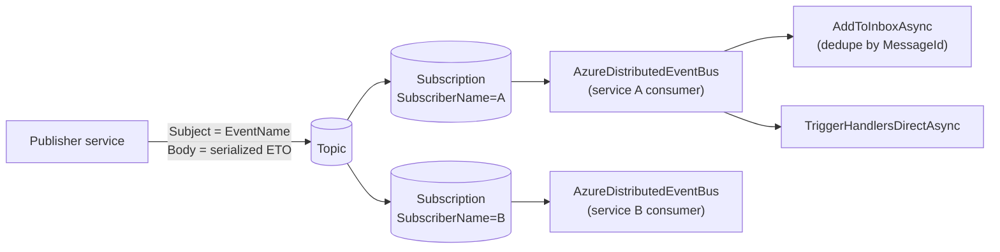

`Volo.Abp.EventBus.Azure` adapts ABP's `IDistributedEventBus` to **Azure Service Bus**. It uses a single topic for every event, a per‑service subscription, and rides the Service Bus `Subject` slot as the event name. This page walks `AzureDistributedEventBus`, its options, how it pools publishers, and the way `IsServiceBusDisabled` is used to short‑circuit module initialization in offline tests.

## Files

```text
framework/src/Volo.Abp.EventBus.Azure/Volo/Abp/EventBus/Azure/
  AbpAzureEventBusOptions.cs
  AbpEventBusAzureModule.cs
  AzureDistributedEventBus.cs
```

Transport pieces — `IAzureServiceBusMessageConsumerFactory`, `IPublisherPool`, `IAzureServiceBusSerializer` — live in `framework/src/Volo.Abp.AzureServiceBus/` and are reused by other Azure integrations.

## `AbpAzureEventBusOptions`

```csharp
public class AbpAzureEventBusOptions
{
    public string? ConnectionName { get; set; }
    public string SubscriberName { get; set; } = default!;
    public string TopicName { get; set; } = default!;
    public bool IsServiceBusDisabled { get; set; }
}
```

| Property | Default | Notes |
| --- | --- | --- |
| `ConnectionName` | `null` (default conn) | Selects named connection from `AbpAzureServiceBusOptions.Connections`. |
| `SubscriberName` | required | Service Bus topic subscription name; per service deployment. |
| `TopicName` | required | One topic per environment/deployment. |
| `IsServiceBusDisabled` | `false` | Stops `Initialize()` from running — useful for tests that should not spin up consumers. |

## Module wiring

`AbpEventBusAzureModule.cs`:

```csharp
[DependsOn(typeof(AbpEventBusModule), typeof(AbpAzureServiceBusModule))]
public class AbpEventBusAzureModule : AbpModule
{
    public override void ConfigureServices(ServiceConfigurationContext context)
    {
        var configuration = context.Services.GetConfiguration();
        Configure<AbpAzureEventBusOptions>(configuration.GetSection("Azure:EventBus"));
    }

    public override void OnApplicationInitialization(ApplicationInitializationContext context)
    {
        var options = context.ServiceProvider.GetRequiredService<IOptions<AbpAzureEventBusOptions>>().Value;
        if (!options.IsServiceBusDisabled)
        {
            context.ServiceProvider
                .GetRequiredService<AzureDistributedEventBus>()
                .Initialize();
        }
    }
}
```

The `IsServiceBusDisabled` toggle is an explicit "don't even try" switch — when set, the module loads, the bus is still in DI, but no message consumer starts. A typical use is the integration‑test harness that wants the publish API to noop instead of failing.

## `AzureDistributedEventBus`

```csharp
[Dependency(ReplaceServices = true)]
[ExposeServices(typeof(IDistributedEventBus), typeof(AzureDistributedEventBus))]
public class AzureDistributedEventBus : DistributedEventBusBase, ISingletonDependency
{
    protected AbpAzureEventBusOptions Options { get; }
    protected IAzureServiceBusMessageConsumerFactory MessageConsumerFactory { get; }
    protected IPublisherPool PublisherPool { get; }
    protected IAzureServiceBusSerializer Serializer { get; }
    protected ConcurrentDictionary<Type, List<IEventHandlerFactory>> HandlerFactories { get; }
    protected ConcurrentDictionary<string, Type> EventTypes { get; }
    protected IAzureServiceBusMessageConsumer Consumer { get; private set; } = default!;
```

The constructor takes the standard `DistributedEventBusBase` dependencies plus the three Azure transport singletons.

## `Initialize()`

```csharp
public void Initialize()
{
    Consumer = MessageConsumerFactory.CreateMessageConsumer(
        Options.TopicName,
        Options.SubscriberName,
        Options.ConnectionName);

    Consumer.OnMessageReceived(ProcessEventAsync);
    SubscribeHandlers(AbpDistributedEventBusOptions.Handlers);
}
```

The factory ensures the topic and subscription exist (creating them on first use when permissions allow). One consumer per `(topic, subscription, connection)`; replicas of the same service share the subscription so Service Bus load‑balances across them — the same pattern as Kafka consumer groups and RabbitMQ shared queues.

## Wire format

| Service Bus slot | ABP semantics |
| --- | --- |
| `ServiceBusMessage.Body` | `Serializer.Serialize(eventData)` payload. |
| `ServiceBusMessage.Subject` | Event name from `EventNameAttribute.GetNameOrDefault(eventType)`. Subscribers filter on this. |
| `ServiceBusMessage.MessageId` | `OutgoingEventInfo.Id` (or new `Guid`) — drives inbox dedupe. |
| `ServiceBusMessage.CorrelationId` | `ICorrelationIdProvider.Get()`. |

## Consume path

```csharp
private async Task ProcessEventAsync(ServiceBusReceivedMessage message)
{
    var eventName = message.Subject;
    if (eventName == null) return;
    var eventType = EventTypes.GetOrDefault(eventName);
    if (eventType == null) return;

    var eventData = Serializer.Deserialize(message.Body.ToArray(), eventType);

    if (await AddToInboxAsync(message.MessageId, eventName, eventType, eventData, message.CorrelationId))
        return;

    using (CorrelationIdProvider.Change(message.CorrelationId))
    {
        await TriggerHandlersDirectAsync(eventType, eventData);
    }
}
```

The flow mirrors the RabbitMQ and Kafka adapters: subject‑based event type lookup, optional inbox handoff, otherwise direct handler dispatch with the correlation id restored.

## Batched outbox publish

The Service Bus client supports batched sends through `CreateMessageBatchAsync`. `PublishManyFromOutboxAsync` uses it:

```csharp
public async override Task PublishManyFromOutboxAsync(IEnumerable<OutgoingEventInfo> outgoingEvents, OutboxConfig outboxConfig)
{
    var outgoingEventArray = outgoingEvents.ToArray();

    var publisher = await PublisherPool.GetAsync(Options.TopicName, Options.ConnectionName);

    using var messageBatch = await publisher.CreateMessageBatchAsync();

    foreach (var outgoingEvent in outgoingEventArray)
    {
        var message = new ServiceBusMessage(outgoingEvent.EventData) { Subject = outgoingEvent.EventName };

        if (message.MessageId.IsNullOrWhiteSpace())
            message.MessageId = outgoingEvent.Id.ToString();
        message.CorrelationId = outgoingEvent.GetCorrelationId();

        if (!messageBatch.TryAddMessage(message))
        {
            throw new AbpException(
                "The message is too large to fit in the batch. Set AbpEventBusBoxesOptions.OutboxWaitingEventMaxCount to reduce the number");
        }
    }

    await publisher.SendMessagesAsync(messageBatch);

    foreach (var outgoingEvent in outgoingEventArray)
    {
        using (CorrelationIdProvider.Change(outgoingEvent.GetCorrelationId()))
        {
            await TriggerDistributedEventSentAsync(new DistributedEventSent
            {
                Source = DistributedEventSource.Outbox,
                EventName = outgoingEvent.EventName,
                EventData = outgoingEvent.EventData
            });
        }
    }
}
```

The implementation surfaces a useful failure mode: when an `OutboxWaitingEventMaxCount` page is too large for the Service Bus batch limit (1MB / 4.5MB depending on SKU), `TryAddMessage` returns false and the bus throws with an explicit hint to lower the page size in [boxes options](/infrastructure/event-bus-distributed).

## Inbox path

```csharp
public async override Task ProcessFromInboxAsync(IncomingEventInfo incomingEvent, InboxConfig inboxConfig)
{
    var eventType = EventTypes.GetOrDefault(incomingEvent.EventName);
    if (eventType == null) return;

    var eventData = Serializer.Deserialize(incomingEvent.EventData, eventType);
    var exceptions = new List<Exception>();
    using (CorrelationIdProvider.Change(incomingEvent.GetCorrelationId()))
    {
        await TriggerHandlersFromInboxAsync(eventType, eventData, exceptions, inboxConfig);
    }
    if (exceptions.Any())
    {
        ThrowOriginalExceptions(eventType, exceptions);
    }
}
```

The `InboxProcessor` calls this on each row. Exceptions are collected and rethrown so the processor's failure policy (`Retry`, `RetryLater`, …) can take over.

## Diagram



## Configuration

```json
{
  "Azure": {
    "ServiceBus": {
      "Connections": {
        "Default": { "ConnectionString": "Endpoint=sb://acme.servicebus.windows.net/;..." }
      }
    },
    "EventBus": {
      "SubscriberName": "AcmeBookStore.Catalog",
      "TopicName": "acme-events",
      "IsServiceBusDisabled": "false"
    }
  }
}
```

When using managed identity, `Volo.Abp.AzureServiceBus` accepts `TokenCredential` injection via `AbpAzureServiceBusOptions.Connections.AddAzureCredential(...)` instead of a connection string.

## Subscribing handlers

`AzureDistributedEventBus.Subscribe` does not perform any topic‑side filter installation — all subscribers receive all messages on their subscription, and `ProcessEventAsync` filters by `EventTypes`. If you need server‑side filtering (e.g., a SQL filter on `Subject`), provision the subscription out of band with `azd`/Bicep/Terraform; the bus consumes whatever the subscription is configured to deliver.

## Outbox processor + Service Bus together

When both an outbox and Service Bus are configured, the flow is the standard `DistributedEventBusBase` pipeline with one Azure‑specific wrinkle: `OutboxSender` runs the publish in batched mode (`PublishManyFromOutboxAsync`), so each iteration sends a `ServiceBusMessageBatch`. The batch has a fixed size cap (1MB on the Standard tier, 4.5MB on Premium). If you receive

> The message is too large to fit in the batch.

…it means the rolling page size — `AbpEventBusBoxesOptions.OutboxWaitingEventMaxCount`, default 1000 — produced events whose total size exceeded the batch cap. Drop the count (or switch off batching by setting `AbpEventBusBoxesOptions.BatchPublishOutboxEvents = false`, falling back to single‑message `PublishFromOutboxAsync` per row).

## Comparison

| Concern | RabbitMQ | Kafka | Azure Service Bus | Rebus | Dapr |
| --- | --- | --- | --- | --- | --- |
| Subscription identity | `ClientName` queue | `GroupId` consumer group | `SubscriberName` subscription | `InputQueueName` queue | per topic, declarative endpoint |
| Routing identity | exchange + routing key | topic + Kafka key | topic + `Subject` | topic | topic |
| Event name source | AMQP routing key | `Message.Key` | `Message.Subject` | typed dispatch | `Topic` field |
| Batched outbox | yes (publisher confirms) | yes (producer pool) | yes (`MessageBatch`) | depends on transport | no |
| Module init flag to skip transport | n/a | n/a | `IsServiceBusDisabled` | `Configurer = default` | n/a |
| Default options binding | `RabbitMQ:EventBus` | `Kafka:EventBus` | `Azure:EventBus` | none (Configurer delegate) | none |

The `IsServiceBusDisabled` flag is the unique escape hatch that lets the Azure module load fully while keeping the bus offline — useful when an integration test boots the application with module dependencies intact but should not consume any messages.

## Cross‑references

| Topic | See |
| --- | --- |
| Base class, outbox/inbox semantics | [Distributed event bus](/infrastructure/event-bus-distributed) |
| Other broker providers | [RabbitMQ](/infrastructure/event-bus-rabbitmq) · [Kafka](/infrastructure/event-bus-kafka) |
| Publish/handle flow | [Event publish and handle](/flows/event-publish-and-handle) |
| Correlation id | [Tracing and correlation](/core/tracing-and-correlation) |
| Tenant id on the ETO | [Multi‑tenancy](/multi-tenancy/overview) |
