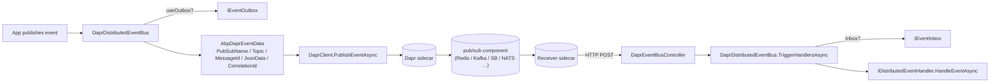

`Volo.Abp.EventBus.Dapr` adapts ABP's `IDistributedEventBus` to the **Dapr pub/sub building block**. The Dapr sidecar handles the transport (Redis Streams, Azure Service Bus, Kafka, NATS, …); ABP only constructs `AbpDaprEventData` envelopes and calls `DaprClient.PublishEventAsync`. This page covers `DaprDistributedEventBus`, the `AbpDaprEventBusOptions.PubSubName` knob, the topic conventions, and how subscribers receive messages through `Volo.Abp.AspNetCore.Mvc.Dapr.EventBus`.

## Files

```text
framework/src/Volo.Abp.EventBus.Dapr/Volo/Abp/EventBus/Dapr/
  AbpDaprEventBusOptions.cs
  AbpDaprEventData.cs
  AbpEventBusDaprModule.cs
  DaprDistributedEventBus.cs
```

The ASP.NET integration that exposes subscribe endpoints to the sidecar lives in `framework/src/Volo.Abp.AspNetCore.Mvc.Dapr.EventBus/`.

## `AbpDaprEventBusOptions`

```csharp
public class AbpDaprEventBusOptions
{
    public string PubSubName { get; set; }
    public AbpDaprEventBusOptions() { PubSubName = "pubsub"; }
}
```

The only knob is `PubSubName` — the name of the Dapr pub/sub component registered with the sidecar (the value in `metadata.name` of the YAML component spec). The default `"pubsub"` matches Dapr's quickstart sample component.

## `AbpDaprEventData`

The envelope sent to the sidecar:

```csharp
public class AbpDaprEventData
{
    public string PubSubName { get; set; }
    public string Topic { get; set; }
    public string MessageId { get; set; }
    public string JsonData { get; set; }
    public string? CorrelationId { get; set; }
}
```

| Field | Source |
| --- | --- |
| `PubSubName` | `AbpDaprEventBusOptions.PubSubName` |
| `Topic` | `EventNameAttribute.GetNameOrDefault(eventType)` |
| `MessageId` | `OutgoingEventInfo.Id` if from outbox, else `GuidGenerator.Create().ToString("N")` |
| `JsonData` | `IDaprSerializer.SerializeToString(eventData)` |
| `CorrelationId` | `ICorrelationIdProvider.Get()` (or the value from the outbox row) |

Note that the body is **a JSON string**, not raw bytes. This is because Dapr's CloudEvents wrapper carries the payload in a `data` field, and storing JSON-as-string avoids double‑escaping.

## Module wiring

`AbpEventBusDaprModule.cs`:

```csharp
[DependsOn(typeof(AbpEventBusModule), typeof(AbpDaprModule))]
public class AbpEventBusDaprModule : AbpModule
{
    public override void OnApplicationInitialization(ApplicationInitializationContext context)
    {
        context.ServiceProvider.GetRequiredService<DaprDistributedEventBus>().Initialize();
    }
}
```

No options binding is necessary at this level — `AbpDaprEventBusOptions` is configured by the host (or left at the default). `Initialize()` only subscribes ABP handlers; the actual HTTP endpoint for Dapr to push messages to is added by the MVC integration.

## `DaprDistributedEventBus`

```csharp
[Dependency(ReplaceServices = true)]
[ExposeServices(typeof(IDistributedEventBus), typeof(DaprDistributedEventBus))]
public class DaprDistributedEventBus : DistributedEventBusBase, ISingletonDependency
{
    protected IDaprSerializer Serializer { get; }
    protected AbpDaprEventBusOptions DaprEventBusOptions { get; }
    protected IAbpDaprClientFactory DaprClientFactory { get; }
    protected ConcurrentDictionary<Type, List<IEventHandlerFactory>> HandlerFactories { get; }
    protected ConcurrentDictionary<string, Type> EventTypes { get; }
}
```

`IAbpDaprClientFactory` (in `Volo.Abp.Dapr`) is the only dependency that touches the Dapr SDK — it returns a configured `DaprClient` per call so settings can change at runtime.

## Publish path

```csharp
protected async override Task PublishToEventBusAsync(Type eventType, object eventData)
{
    await PublishToDaprAsync(eventType, eventData, null, CorrelationIdProvider.Get());
}

protected virtual async Task PublishToDaprAsync(string eventName, object eventData,
    Guid? messageId = null, string? correlationId = null)
{
    var client = await DaprClientFactory.CreateAsync();
    var data = new AbpDaprEventData(
        DaprEventBusOptions.PubSubName,
        eventName,
        (messageId ?? GuidGenerator.Create()).ToString("N"),
        Serializer.SerializeToString(eventData),
        correlationId);

    await client.PublishEventAsync(
        pubsubName: DaprEventBusOptions.PubSubName,
        topicName: eventName,
        data: data);
}
```

Three things to take away:

- **Topic = event name.** Every distinct event type gets its own topic. There is no per‑service "queue" because Dapr fans out at the sidecar based on subscription metadata.
- **No transport configuration.** All transport choices (Redis, NATS, Service Bus) live in the Dapr component YAML, not in ABP.
- **The `data` parameter is the `AbpDaprEventData` envelope itself.** Dapr wraps that into a CloudEvent and adds its own `id`, `traceparent`, etc.

## Outbox path

```csharp
public async override Task PublishFromOutboxAsync(OutgoingEventInfo outgoingEvent, OutboxConfig outboxConfig)
{
    var eventType = GetEventType(outgoingEvent.EventName);
    if (eventType == null) return;

    await PublishToDaprAsync(
        outgoingEvent.EventName,
        Serializer.Deserialize(outgoingEvent.EventData, eventType),
        outgoingEvent.Id,
        outgoingEvent.GetCorrelationId());

    using (CorrelationIdProvider.Change(outgoingEvent.GetCorrelationId()))
    {
        await TriggerDistributedEventSentAsync(new DistributedEventSent
        {
            Source = DistributedEventSource.Outbox,
            EventName = outgoingEvent.EventName,
            EventData = outgoingEvent.EventData
        });
    }
}

public async override Task PublishManyFromOutboxAsync(IEnumerable<OutgoingEventInfo> outgoingEvents, OutboxConfig outboxConfig)
{
    foreach (var outgoingEvent in outgoingEvents)
    {
        await PublishFromOutboxAsync(outgoingEvent, outboxConfig);
    }
}
```

Unlike the Service Bus adapter, the Dapr bus does not batch — there is no batch API in `DaprClient.PublishEventAsync`. Each row is published independently. The `OutgoingEventInfo.EventData` is deserialized first because `AbpDaprEventData.JsonData` expects the original object so the serializer can choose its string format (CloudEvent compliance).

## Consume path

Incoming messages arrive at a controller endpoint registered by `Volo.Abp.AspNetCore.Mvc.Dapr.EventBus`. That controller calls back into the bus:

```csharp
public virtual async Task TriggerHandlersAsync(Type eventType, object eventData,
    string? messageId = null, string? correlationId = null)
{
    if (await AddToInboxAsync(messageId, EventNameAttribute.GetNameOrDefault(eventType),
            eventType, eventData, correlationId))
        return;

    using (CorrelationIdProvider.Change(correlationId))
    {
        await TriggerHandlersDirectAsync(eventType, eventData);
    }
}
```

The inbox path is identical to the other providers — `AddToInboxAsync` dedupes by `messageId`, otherwise handlers are dispatched immediately.

`ProcessFromInboxAsync` is also standard:

```csharp
public async override Task ProcessFromInboxAsync(IncomingEventInfo incomingEvent, InboxConfig inboxConfig)
{
    var eventType = GetEventType(incomingEvent.EventName);
    if (eventType == null) return;

    var eventData = Serializer.Deserialize(incomingEvent.EventData, eventType);
    var exceptions = new List<Exception>();
    using (CorrelationIdProvider.Change(incomingEvent.GetCorrelationId()))
    {
        await TriggerHandlersFromInboxAsync(eventType, eventData, exceptions, inboxConfig);
    }
    if (exceptions.Any()) ThrowOriginalExceptions(eventType, exceptions);
}
```

## Event type registry

Because Dapr's subscription is declarative (registered on the controller endpoint), `DaprDistributedEventBus` keeps a separate `EventTypes` map updated whenever a handler is registered:

```csharp
private List<IEventHandlerFactory> GetOrCreateHandlerFactories(Type eventType)
{
    return HandlerFactories.GetOrAdd(eventType, type =>
    {
        var eventName = EventNameAttribute.GetNameOrDefault(type);
        EventTypes.GetOrAdd(eventName, eventType);
        return new List<IEventHandlerFactory>();
    });
}

protected override Task OnAddToOutboxAsync(string eventName, Type eventType, object eventData)
{
    EventTypes.GetOrAdd(eventName, eventType);
    return base.OnAddToOutboxAsync(eventName, eventType, eventData);
}

public Type? GetEventType(string eventName) => EventTypes.GetOrDefault(eventName);
```

`OnAddToOutboxAsync` is called from `DistributedEventBusBase.AddToOutboxAsync` — this is how a publisher that never has a handler still ensures the topic→type mapping exists for outbox replay.

## Handler matching

`DaprDistributedEventBus` overrides `GetHandlerFactories` to be order‑agnostic (no `[LocalEventHandlerOrder]` support, unlike `LocalEventBus`):

```csharp
protected override IEnumerable<EventTypeWithEventHandlerFactories> GetHandlerFactories(Type eventType)
{
    var handlerFactoryList = new List<EventTypeWithEventHandlerFactories>();
    foreach (var handlerFactory in HandlerFactories.Where(hf => ShouldTriggerEventForHandler(eventType, hf.Key)))
    {
        handlerFactoryList.Add(new EventTypeWithEventHandlerFactories(handlerFactory.Key, handlerFactory.Value));
    }
    return handlerFactoryList.ToArray();
}

private static bool ShouldTriggerEventForHandler(Type targetEventType, Type handlerEventType)
{
    if (handlerEventType == targetEventType) return true;
    if (handlerEventType.IsAssignableFrom(targetEventType)) return true;
    return false;
}
```

Inheritance matching is still supported — handlers for a base event class fire for derived types — but without ordering. A `//TODO` comment in the source notes the inconsistency with the RabbitMQ subscription model.

## Diagram



## Configuration

The ABP options are short:

```csharp
Configure<AbpDaprEventBusOptions>(options =>
{
    options.PubSubName = "acme-pubsub";
});
```

The bulk of the configuration is in the Dapr component spec — a YAML similar to:

```yaml
apiVersion: dapr.io/v1alpha1
kind: Component
metadata:
  name: acme-pubsub
spec:
  type: pubsub.redis
  version: v1
  metadata:
    - name: redisHost
      value: redis:6379
```

When the sidecar comes up, it loads this component and registers a subscription endpoint for each topic the application declared via `[Topic("acme-pubsub", "BookCreated")]` attributes generated by `Volo.Abp.AspNetCore.Mvc.Dapr.EventBus`.

## Comparison

| Concern | RabbitMQ / Kafka / SB / Rebus | Dapr |
| --- | --- | --- |
| Transport configured in | ABP options + connection string | Dapr component YAML |
| Topic identity | Routing key / topic + key / Subject | One topic per event name |
| Subscription registration | In‑code (`Consumer.BindAsync` / `Rebus.Subscribe`) | Controller endpoint, declared by attribute |
| Message envelope | Provider‑native | `AbpDaprEventData` JSON + CloudEvent wrapper |
| Outbox batch send | Yes (RabbitMQ, SB) | No |
| Dependencies | Broker client library | Dapr SDK + sidecar |

## Cross‑references

| Topic | See |
| --- | --- |
| Base class, outbox/inbox semantics | [Distributed event bus](/infrastructure/event-bus-distributed) |
| End‑to‑end publish flow | [Event publish and handle](/flows/event-publish-and-handle) |
| Other providers | [RabbitMQ](/infrastructure/event-bus-rabbitmq) · [Kafka](/infrastructure/event-bus-kafka) · [Azure Service Bus](/infrastructure/event-bus-azure) · [Rebus](/infrastructure/event-bus-rebus) |
| Correlation id propagation | [Tracing and correlation](/core/tracing-and-correlation) |
| Tenant id on the ETO | [Multi‑tenancy](/multi-tenancy/overview) |
