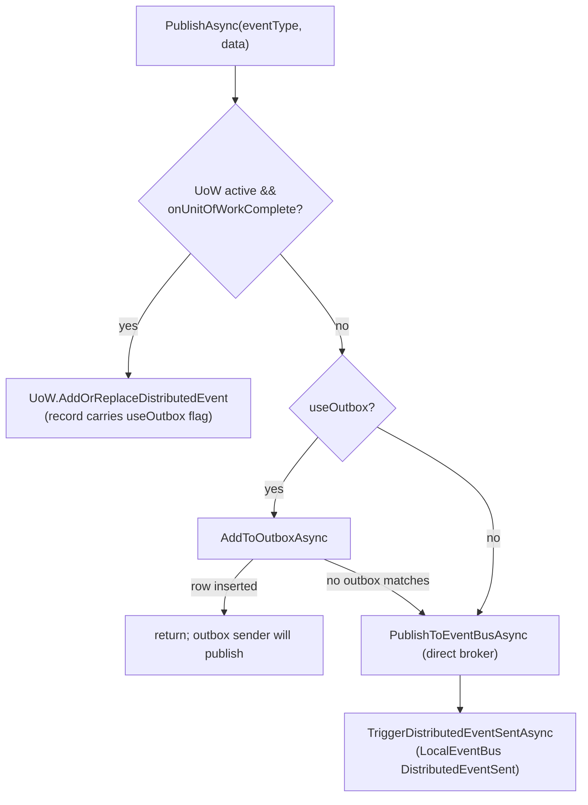
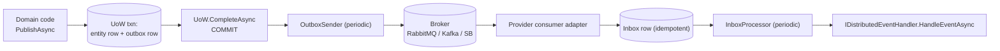

`IDistributedEventBus` is the **cross‑process event contract** of the ABP Framework. Compared to the in‑process `ILocalEventBus` it adds two flags — `onUnitOfWorkComplete` and `useOutbox` — and a whole supporting cast of outbox/inbox processors so an event published inside a database transaction is delivered exactly once, even when the broker is temporarily unreachable. This page covers the contract, the `DistributedEventBusBase` template that every provider extends, the `OutboxConfig`/`InboxConfig` registration model, the `LocalDistributedEventBus` fallback, and the ETO conventions used by domain entity events.

## Contract

`framework/src/Volo.Abp.EventBus.Abstractions/Volo/Abp/EventBus/Distributed/IDistributedEventBus.cs`:

```csharp
public interface IDistributedEventBus : IEventBus
{
    IDisposable Subscribe<TEvent>(IDistributedEventHandler<TEvent> handler) where TEvent : class;

    Task PublishAsync<TEvent>(
        TEvent eventData,
        bool onUnitOfWorkComplete = true,
        bool useOutbox = true) where TEvent : class;

    Task PublishAsync(
        Type eventType,
        object eventData,
        bool onUnitOfWorkComplete = true,
        bool useOutbox = true);
}
```

The handler side (`IDistributedEventHandler.cs`) mirrors the local handler:

```csharp
public interface IDistributedEventHandler<in TEvent> : IEventHandler
{
    Task HandleEventAsync(TEvent eventData);
}
```

Two flags shape every publish decision:

| Flag | Meaning |
| --- | --- |
| `onUnitOfWorkComplete` (default `true`) | If a UoW is active, defer the publish until `CompleteAsync` succeeds; otherwise publish immediately. |
| `useOutbox` (default `true`) | When the calling module configures an outbox, store the event row first and let the outbox processor publish it later. Bypasses the broker connection on the request thread. |

## File map

```text
framework/src/Volo.Abp.EventBus.Abstractions/Volo/Abp/EventBus/Distributed/
  IDistributedEventBus.cs
  IDistributedEventHandler.cs
  IEventInbox.cs / IEventOutbox.cs
  OutboxConfig.cs / OutboxConfigDictionary.cs
  InboxConfig.cs / InboxConfigDictionary.cs
  IncomingEventInfo.cs / OutgoingEventInfo.cs
  IncomingEventStatus.cs
  ISupportsEventBoxes.cs
  DistributedEventReceived.cs / DistributedEventSent.cs

framework/src/Volo.Abp.EventBus/Volo/Abp/EventBus/Distributed/
  AbpDistributedEventBusOptions.cs
  AbpEventBusBoxesOptions.cs
  DistributedEventBusBase.cs
  InboxProcessor.cs / InboxProcessManager.cs
  LocalDistributedEventBus.cs
  NullDistributedEventBus.cs
  OutboxSender.cs / OutboxSenderManager.cs
```

The abstractions assembly is referenced by domain code (handlers, options) — the implementation assembly is only referenced by the host. This separation keeps domain modules portable across broker providers (RabbitMQ, Kafka, …).

## `DistributedEventBusBase`

`DistributedEventBusBase.cs` is the template every concrete bus extends. It implements both `IDistributedEventBus` and `ISupportsEventBoxes`:

```csharp
public abstract class DistributedEventBusBase : EventBusBase, IDistributedEventBus, ISupportsEventBoxes
{
    protected IGuidGenerator GuidGenerator { get; }
    protected IClock Clock { get; }
    protected AbpDistributedEventBusOptions AbpDistributedEventBusOptions { get; }
    protected ILocalEventBus LocalEventBus { get; }
    protected ICorrelationIdProvider CorrelationIdProvider { get; }

    public virtual async Task PublishAsync(
        Type eventType, object eventData,
        bool onUnitOfWorkComplete = true, bool useOutbox = true)
    {
        if (onUnitOfWorkComplete && UnitOfWorkManager.Current != null)
        {
            AddToUnitOfWork(
                UnitOfWorkManager.Current,
                new UnitOfWorkEventRecord(eventType, eventData, EventOrderGenerator.GetNext(), useOutbox)
            );
            return;
        }

        if (useOutbox)
        {
            if (await AddToOutboxAsync(eventType, eventData))
                return;
        }

        await PublishToEventBusAsync(eventType, eventData);

        await TriggerDistributedEventSentAsync(new DistributedEventSent
        {
            Source = DistributedEventSource.Direct,
            EventName = EventNameAttribute.GetNameOrDefault(eventType),
            EventData = eventData
        });
    }
}
```

The decision tree the base class enforces:



Three abstract members force every provider to plug in its own wire format:

```csharp
public abstract Task PublishFromOutboxAsync(OutgoingEventInfo outgoingEvent, OutboxConfig outboxConfig);
public abstract Task PublishManyFromOutboxAsync(IEnumerable<OutgoingEventInfo> outgoingEvents, OutboxConfig outboxConfig);
public abstract Task ProcessFromInboxAsync(IncomingEventInfo incomingEvent, InboxConfig inboxConfig);
protected abstract byte[] Serialize(object eventData);
```

`PublishFromOutboxAsync` is called by `OutboxSender`; `ProcessFromInboxAsync` is called by `InboxProcessor`. The serializer abstraction lets each provider pick the wire format (UTF‑8 JSON for RabbitMQ, the broker's binary form for Kafka, etc.).

## Outbox path

`AddToOutboxAsync` walks every registered outbox and lets the selector decide:

```csharp
protected virtual async Task<bool> AddToOutboxAsync(Type eventType, object eventData)
{
    var unitOfWork = UnitOfWorkManager.Current;
    if (unitOfWork == null) return false;

    var addedToOutbox = false;
    foreach (var outboxConfig in AbpDistributedEventBusOptions.Outboxes.Values.OrderBy(x => x.Selector is null))
    {
        if (outboxConfig.Selector == null || outboxConfig.Selector(eventType))
        {
            var eventOutbox = (IEventOutbox)unitOfWork.ServiceProvider
                .GetRequiredService(outboxConfig.ImplementationType);
            var eventName = EventNameAttribute.GetNameOrDefault(eventType);

            var outgoingEventInfo = new OutgoingEventInfo(
                GuidGenerator.Create(), eventName, Serialize(eventData), Clock.Now);

            var correlationId = CorrelationIdProvider.Get();
            if (correlationId != null) outgoingEventInfo.SetCorrelationId(correlationId);

            await eventOutbox.EnqueueAsync(outgoingEventInfo);
            addedToOutbox = true;
        }
    }
    return addedToOutbox;
}
```

Three properties of this loop matter:

- **Order** — outboxes with explicit `Selector` win; the "catch‑all" outbox (no selector) is processed last so it only accepts events that did not match a more specific outbox.
- **Service provider scope** — `unitOfWork.ServiceProvider.GetRequiredService(outboxConfig.ImplementationType)` resolves the outbox from the UoW's scope, which is the same scope the EF/Mongo context lives in. This is how the outbox write joins the same database transaction.
- **Correlation id** — `ICorrelationIdProvider.Get()` is attached to `OutgoingEventInfo.ExtraProperties[EventBusConsts.CorrelationIdHeaderName]` so downstream consumers can stitch traces ([tracing and correlation](/core/tracing-and-correlation)).

## Inbox path

`AddToInboxAsync` is the symmetric receiver‑side write — called from each provider's consumer adapter:

```csharp
protected virtual async Task<bool> AddToInboxAsync(string? messageId, string eventName, Type eventType, object eventData, string? correlationId)
{
    if (AbpDistributedEventBusOptions.Inboxes.Count <= 0) return false;

    var addToInbox = false;
    using (var scope = ServiceScopeFactory.CreateScope())
    {
        foreach (var inboxConfig in AbpDistributedEventBusOptions.Inboxes.Values.OrderBy(x => x.EventSelector is null))
        {
            if (inboxConfig.EventSelector == null || inboxConfig.EventSelector(eventType))
            {
                var eventInbox = (IEventInbox)scope.ServiceProvider.GetRequiredService(inboxConfig.ImplementationType);

                if (!messageId.IsNullOrEmpty() && await eventInbox.ExistsByMessageIdAsync(messageId!))
                {
                    addToInbox = true; continue;  // dedupe
                }

                var incomingEventInfo = new IncomingEventInfo(
                    GuidGenerator.Create(), messageId!, eventName, Serialize(eventData), Clock.Now);
                incomingEventInfo.SetCorrelationId(correlationId!);
                await eventInbox.EnqueueAsync(incomingEventInfo);
                addToInbox = true;
            }
        }
    }
    return addToInbox;
}
```

The `ExistsByMessageIdAsync` short‑circuit is the deduplication step that makes the inbox **idempotent** under broker redeliveries. Once a row exists for `MessageId`, the consumer simply acknowledges and moves on.

## `OutboxConfig` and `InboxConfig`

Configuration is keyed by **name** so a module can register multiple boxes (one per DbContext for example). `OutboxConfig.cs`:

```csharp
public class OutboxConfig
{
    public string Name { get; }
    public string DatabaseName { get; set; }
    public Type ImplementationType { get; set; }
    public Func<Type, bool>? Selector { get; set; }
    public bool IsSendingEnabled { get; set; } = true;
    public OutboxConfig(string name) { Name = Check.NotNullOrWhiteSpace(name, nameof(name)); }
}
```

`InboxConfig.cs`:

```csharp
public class InboxConfig
{
    public string Name { get; }
    public string DatabaseName { get; set; }
    public Type ImplementationType { get; set; }
    public Func<Type, bool>? EventSelector { get; set; }
    public Func<Type, bool>? HandlerSelector { get; set; }
    public bool IsProcessingEnabled { get; set; } = true;
}
```

`HandlerSelector` is the extra knob on the inbox side — it filters which `IDistributedEventHandler<TEvent>` types get invoked when an inbox row is processed, useful when several services share a database but only a subset should consume a given event.

`AbpDistributedEventBusOptions.cs` aggregates the two dictionaries and the handler list:

```csharp
public class AbpDistributedEventBusOptions
{
    public ITypeList<IEventHandler> Handlers { get; }
    public OutboxConfigDictionary Outboxes { get; }
    public InboxConfigDictionary Inboxes { get; }
}
```

Typical registration in a host module:

```csharp
Configure<AbpDistributedEventBusOptions>(options =>
{
    options.Outboxes.Configure(config =>
    {
        config.UseDbContext<BookStoreDbContext>();
        // config.Selector = type => type.FullName!.StartsWith("Acme.BookStore");
    });
    options.Inboxes.Configure(config =>
    {
        config.UseDbContext<BookStoreDbContext>();
    });
});
```

The `UseDbContext<T>()` extension lives in `framework/src/Volo.Abp.EventBus.Abstractions/Volo/Abp/EventBus/Distributed/AbpDistributedEventBusExtensions.cs` and points `ImplementationType` at the EF Core outbox/inbox class shipped by `Volo.Abp.EntityFrameworkCore`.

## `AbpEventBusBoxesOptions`

`AbpEventBusBoxesOptions.cs` governs the outbox sender and inbox processor:

| Property | Default | Purpose |
| --- | --- | --- |
| `PeriodTimeSpan` | 2 seconds | Polling interval for both `OutboxSender` and `InboxProcessor`. |
| `OutboxWaitingEventMaxCount` | 1000 | Page size for `IEventOutbox.GetWaitingEventsAsync`. |
| `InboxWaitingEventMaxCount` | 1000 | Page size for `IEventInbox.GetWaitingEventsAsync`. |
| `OutboxProcessorFilter` / `InboxProcessorFilter` | `null` | Optional `Expression<Func<…, bool>>` pre‑filter applied at SQL level. |
| `BatchPublishOutboxEvents` | `true` | Use `PublishManyFromOutboxAsync` instead of one‑by‑one. |
| `DistributedLockWaitDuration` | 15 seconds | Lease length for the inbox/outbox processor lock. |
| `WaitTimeToDeleteProcessedInboxEvents` | 2 hours | Grace before deleting processed inbox rows (deduplication window). |
| `CleanOldEventTimeIntervalSpan` | 6 hours | Interval between cleanup runs of old inbox events. |
| `InboxProcessorFailurePolicy` | `InboxProcessorFailurePolicy.Retry` | What to do on handler exceptions. |
| `InboxProcessorMaxRetryCount` | 10 | Cap for the `RetryLater` policy. |
| `InboxProcessorRetryBackoffFactor` | 10 | Used in `delay = factor × 2^retryCount`. |

`InboxProcessorFailurePolicy.cs` enumerates the failure modes (`ThrowException`, `Retry`, `RetryLater`); the last two map to the `IEventInbox.RetryLaterAsync(id, retryCount, nextRetryTime)` method.

## `IEventOutbox` and `IEventInbox`

```csharp
public interface IEventOutbox
{
    Task EnqueueAsync(OutgoingEventInfo outgoingEvent);
    Task<List<OutgoingEventInfo>> GetWaitingEventsAsync(int maxCount,
        Expression<Func<IOutgoingEventInfo, bool>>? filter = null, CancellationToken cancellationToken = default);
    Task DeleteAsync(Guid id);
    Task DeleteManyAsync(IEnumerable<Guid> ids);
}

public interface IEventInbox
{
    Task EnqueueAsync(IncomingEventInfo incomingEvent);
    Task<List<IncomingEventInfo>> GetWaitingEventsAsync(int maxCount,
        Expression<Func<IIncomingEventInfo, bool>>? filter = null, CancellationToken cancellationToken = default);
    Task MarkAsProcessedAsync(Guid id);
    Task RetryLaterAsync(Guid id, int retryCount, DateTime? nextRetryTime);
    Task MarkAsDiscardAsync(Guid id);
    Task<bool> ExistsByMessageIdAsync(string messageId);
    Task DeleteOldEventsAsync();
}
```

The standard implementations are EF Core (`Volo.Abp.EntityFrameworkCore.DistributedEvents.EventOutbox`) and MongoDB (`Volo.Abp.MongoDB.DistributedEvents.EventOutbox`). Both write to a dedicated table/collection that lives in the same database as the domain entities — so the outbox row and the entity change are persisted in one transaction.

## Outbox sender and inbox processor

`OutboxSender.cs` is registered per outbox by `OutboxSenderManager`. Each sender is an `AsyncPeriodicBackgroundWorkerBase` that:

1. Acquires the distributed lock named for the outbox.
2. Calls `IEventOutbox.GetWaitingEventsAsync(maxCount, filter)`.
3. Calls `PublishManyFromOutboxAsync` (when `BatchPublishOutboxEvents == true`) or loops `PublishFromOutboxAsync` for each row.
4. On success, calls `IEventOutbox.DeleteManyAsync(ids)`.

`InboxProcessor.cs` does the symmetric work via `InboxProcessManager`:

1. Acquires the distributed lock named for the inbox.
2. Fetches up to `InboxWaitingEventMaxCount` rows.
3. For each, resolves the event CLR type from `EventTypes` (built from `[EventName]` attributes), deserializes, then runs handlers — limited by `InboxConfig.HandlerSelector`.
4. On success, `MarkAsProcessedAsync(id)`; on exception, the `InboxProcessorFailurePolicy` decides whether to `RetryLaterAsync` or `MarkAsDiscardAsync`.



## `LocalDistributedEventBus`

When no real broker is wired, `LocalDistributedEventBus.cs` provides the in‑process fallback that still respects the distributed contract:

```csharp
[Dependency(TryRegister = true)]
[ExposeServices(typeof(IDistributedEventBus), typeof(LocalDistributedEventBus))]
public class LocalDistributedEventBus : DistributedEventBusBase, ISingletonDependency
{
    public override IDisposable Subscribe(Type eventType, IEventHandlerFactory factory)
    {
        var eventName = EventNameAttribute.GetNameOrDefault(eventType);
        EventTypes.GetOrAdd(eventName, eventType);
        return LocalEventBus.Subscribe(eventType, factory);
    }
}
```

The implementation just forwards to `ILocalEventBus`. `[Dependency(TryRegister = true)]` means any provider package (RabbitMQ, Kafka, …) takes precedence — they register with `[Dependency(ReplaceServices = true)]`. The fallback is what lets you develop locally without standing up a broker.

## ETO conventions

For domain entity events, ABP wraps `Entity` instances in **ETO** types (Entity Transfer Object) so the wire format is decoupled from the EF Core entity. The base lives in `framework/src/Volo.Abp.EventBus.Abstractions/Volo/Abp/Domain/Entities/Events/Distributed/EtoBase.cs`:

```csharp
[Serializable]
public abstract class EtoBase
{
    public Dictionary<string, string> Properties { get; set; }
    protected EtoBase() { Properties = new Dictionary<string, string>(); }
}
```

ETO subclasses are usually annotated with `[EventName("acme.book.created")]` so the wire event name is stable across .NET assemblies. `EventNameAttribute.GetNameOrDefault(eventType)` walks the type for any `IEventNameProvider`:

```csharp
public static string GetNameOrDefault(Type eventType) =>
    (eventType.GetCustomAttributes(true).OfType<IEventNameProvider>().FirstOrDefault()?.GetName(eventType) ?? eventType.FullName)!;
```

If no attribute is present, the type's `FullName` is used — fine for in‑process buses but discouraged for cross‑service contracts.

## `DistributedEventSent` / `DistributedEventReceived`

After every successful publish or consume the base bus emits a **local** notification:

```csharp
public virtual async Task TriggerDistributedEventSentAsync(DistributedEventSent distributedEvent)
{
    try { await LocalEventBus.PublishAsync(distributedEvent, onUnitOfWorkComplete: false); }
    catch (Exception) { /* ignored */ }
}
```

`DistributedEventSent.cs` and `DistributedEventReceived.cs` are simple records with `Source` (`Direct` | `Outbox` | `Inbox`), `EventName`, and `EventData`. They give application code (telemetry, audit, observability dashboards) a uniform hook regardless of provider.

## Publish flag matrix

| `useOutbox` | `onUnitOfWorkComplete` | UoW present? | Effect |
| --- | --- | --- | --- |
| true | true | yes | Event sits on UoW; on commit, `UnitOfWorkEventPublisher` re‑publishes with `useOutbox: true`. |
| true | true | no | Outbox is bypassed (`AddToOutboxAsync` returns false without a UoW). Falls through to direct publish. |
| true | false | yes | Outbox row is written inside the current UoW (but processed only after commit because rows are visible after commit). |
| true | false | no | Same as above without a UoW context — the outbox impl typically opens its own. |
| false | true | yes | Event sits on UoW with `useOutbox=false`; on commit, published directly to the broker (no outbox row). |
| false | false | any | Immediate direct publish through `PublishToEventBusAsync`. |

The asymmetry is deliberate: outbox semantics require a transaction. Without a UoW, the bus has nothing to attach the row to.

## Cross‑references

| Topic | See |
| --- | --- |
| In‑process publishing and UoW deferral | [Local event bus](/infrastructure/event-bus-local) |
| Provider‑specific bus classes | [RabbitMQ](/infrastructure/event-bus-rabbitmq) · [Kafka](/infrastructure/event-bus-kafka) · [Azure Service Bus](/infrastructure/event-bus-azure) · [Rebus](/infrastructure/event-bus-rebus) · [Dapr](/infrastructure/event-bus-dapr) |
| End‑to‑end UoW + outbox + inbox flow | [Event publish and handle](/flows/event-publish-and-handle) |
| UoW completion hooks that drain the outbox queue | [Unit of Work](/data/unit-of-work) |
| Tenant capture across the wire | [Multi‑tenancy](/multi-tenancy/overview) |
