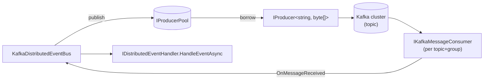

`Volo.Abp.EventBus.Kafka` is the **Apache Kafka adapter** for ABP's `IDistributedEventBus`. It uses a single topic for every event, the event name as the message key, and per‑process producer/consumer pools resolved from `Volo.Abp.Kafka`. This page walks `KafkaDistributedEventBus`, its options, the way `messageId`/`correlationId` ride in Kafka headers, and how the outbox interacts with `IProducerPool`.

## Files

```
framework/src/Volo.Abp.EventBus.Kafka/Volo/Abp/EventBus/Kafka/
  AbpEventBusKafkaModule.cs
  AbpKafkaEventBusOptions.cs
  KafkaDistributedEventBus.cs
  MessageExtensions.cs
```

Transport primitives — `IKafkaMessageConsumerFactory`, `IKafkaMessageConsumer`, `IProducerPool`, `IKafkaSerializer` — live in `framework/src/Volo.Abp.Kafka/`.

## Module

`AbpEventBusKafkaModule.cs`:

```csharp
[DependsOn(typeof(AbpEventBusModule), typeof(AbpKafkaModule))]
public class AbpEventBusKafkaModule : AbpModule
{
    public override void ConfigureServices(ServiceConfigurationContext context)
    {
        var configuration = context.Services.GetConfiguration();
        Configure<AbpKafkaEventBusOptions>(configuration.GetSection("Kafka:EventBus"));
    }

    public override void OnApplicationInitialization(ApplicationInitializationContext context)
    {
        context.ServiceProvider
            .GetRequiredService<KafkaDistributedEventBus>()
            .Initialize();
    }
}
```

Same shape as the RabbitMQ module — bind options, then `Initialize()` after all dependencies' `ConfigureServices` have completed.

## `AbpKafkaEventBusOptions`

```csharp
public class AbpKafkaEventBusOptions
{
    public string? ConnectionName { get; set; }
    public string TopicName { get; set; } = default!;
    public string GroupId { get; set; } = default!;
}
```

| Property | Default | Effect |
| --- | --- | --- |
| `ConnectionName` | `null` (default) | Selects named connection from `AbpKafkaOptions.Connections`. |
| `TopicName` | required | A single topic carries all events; partitioning happens on the event name (Kafka key). |
| `GroupId` | required | Consumer group id — replicas of the same service share `GroupId` so Kafka load‑balances partitions across them. |

The model is intentionally simpler than RabbitMQ's — Kafka has no per‑service queue, only consumer groups.

## `KafkaDistributedEventBus`

```csharp
[Dependency(ReplaceServices = true)]
[ExposeServices(typeof(IDistributedEventBus), typeof(KafkaDistributedEventBus))]
public class KafkaDistributedEventBus : DistributedEventBusBase, ISingletonDependency
{
    protected AbpKafkaEventBusOptions AbpKafkaEventBusOptions { get; }
    protected IKafkaMessageConsumerFactory MessageConsumerFactory { get; }
    protected IKafkaSerializer Serializer { get; }
    protected IProducerPool ProducerPool { get; }
    protected ConcurrentDictionary<Type, List<IEventHandlerFactory>> HandlerFactories { get; }
    protected ConcurrentDictionary<string, Type> EventTypes { get; }
    protected IKafkaMessageConsumer Consumer { get; private set; } = default!;
```

Like the RabbitMQ bus, it derives from `DistributedEventBusBase`, holds a per‑type subscription table, and registers with `[Dependency(ReplaceServices = true)]` so adding the module replaces `LocalDistributedEventBus`.

## `Initialize()`

```csharp
public void Initialize()
{
    Consumer = MessageConsumerFactory.Create(
        AbpKafkaEventBusOptions.TopicName,
        AbpKafkaEventBusOptions.GroupId,
        AbpKafkaEventBusOptions.ConnectionName);
    Consumer.OnMessageReceived(ProcessEventAsync);

    SubscribeHandlers(AbpDistributedEventBusOptions.Handlers);
}
```

`IKafkaMessageConsumer` is a long‑running consumer that polls Kafka in a background task. Only one consumer is created per `(TopicName, GroupId, ConnectionName)` — that is what gives the consumer‑group load balancing.

## Publishing

`PublishToEventBusAsync` constructs headers, then calls `PublishAsync(topic, eventType, eventData, headers)`:

```csharp
protected override async Task PublishToEventBusAsync(Type eventType, object eventData)
{
    var headers = new Headers
    {
        { "messageId", System.Text.Encoding.UTF8.GetBytes(Guid.NewGuid().ToString("N")) }
    };

    if (CorrelationIdProvider.Get() != null)
    {
        headers.Add(EventBusConsts.CorrelationIdHeaderName,
            System.Text.Encoding.UTF8.GetBytes(CorrelationIdProvider.Get()!));
    }

    await PublishAsync(AbpKafkaEventBusOptions.TopicName, eventType, eventData, headers);
}
```

Inside `PublishAsync` the message is constructed:

| Slot | Content |
| --- | --- |
| `Message.Key` | Event name from `EventNameAttribute.GetNameOrDefault(eventType)`. Kafka uses this for partitioning, so events of the same type land on the same partition and preserve order. |
| `Message.Value` | `Serializer.Serialize(eventData)` — UTF‑8 JSON by default. |
| `Headers["messageId"]` | New Guid (N format) per publish. Used by the inbox for dedupe. |
| `Headers["X-Correlation-Id"]` | `EventBusConsts.CorrelationIdHeaderName` constant. |

The actual produce call uses an `IProducer` borrowed from `IProducerPool` — that is what makes the publish path safe under high concurrency without creating a new producer per call.

`AddToUnitOfWork` is the standard wiring:

```csharp
protected override void AddToUnitOfWork(IUnitOfWork unitOfWork, UnitOfWorkEventRecord eventRecord)
{
    unitOfWork.AddOrReplaceDistributedEvent(eventRecord);
}
```

## Consume path

```csharp
private async Task ProcessEventAsync(Message<string, byte[]> message)
{
    var eventName = message.Key;
    var eventType = EventTypes.GetOrDefault(eventName);
    if (eventType == null) return;

    var messageId = message.GetMessageId();
    var eventData = Serializer.Deserialize(message.Value, eventType);
    var correlationId = message.GetCorrelationId();

    if (await AddToInboxAsync(messageId, eventName, eventType, eventData, correlationId))
        return;  // inbox takes over

    using (CorrelationIdProvider.Change(correlationId))
    {
        await TriggerHandlersDirectAsync(eventType, eventData);
    }
}
```

`MessageExtensions.cs` exposes the header helpers:

```csharp
public static string? GetMessageId<TKey, TValue>(this Message<TKey, TValue> message)
{
    if (message.Headers.TryGetLastBytes("messageId", out var bytes))
        return System.Text.Encoding.UTF8.GetString(bytes);
    return null;
}

public static string? GetCorrelationId<TKey, TValue>(this Message<TKey, TValue> message)
{
    if (message.Headers.TryGetLastBytes(EventBusConsts.CorrelationIdHeaderName, out var bytes))
        return System.Text.Encoding.UTF8.GetString(bytes);
    return null;
}
```

`TryGetLastBytes` picks the most recent header value if duplicates exist — useful when a chain of services re‑emits an event.

## Subscription

Kafka does not need per‑event‑type binding the way RabbitMQ does — the consumer reads every message from the topic and the bus filters by event name locally:

```csharp
public override IDisposable Subscribe(Type eventType, IEventHandlerFactory factory)
{
    var handlerFactories = GetOrCreateHandlerFactories(eventType);
    if (factory.IsInFactories(handlerFactories)) return NullDisposable.Instance;
    handlerFactories.Add(factory);
    return new EventHandlerFactoryUnregistrar(this, eventType, factory);
}
```

No `BindAsync` call as in the RabbitMQ bus. The trade‑off is that every replica receives every event regardless of whether it has handlers — `EventTypes.GetOrDefault(eventName)` returning null silently drops it.

## Pools

`IProducerPool` (publisher) and the singleton `IKafkaMessageConsumer` (subscriber) are the two long‑lived resources:



Producers are stateless once configured, so pooling avoids the cost of bootstrapping a new connection per publish. Consumers are stateful (partition assignment, offset commits) and there is exactly one per `(topic, group, connection)`.

## Outbox / inbox

The outbox path constructs the same headers and delegates to a producer from the pool — `PublishFromOutboxAsync` accepts an `OutgoingEventInfo` and sets `messageId = outgoingEvent.Id` and `correlationId = outgoingEvent.GetCorrelationId()` so the wire message carries the row's identity:

```csharp
public override async Task PublishFromOutboxAsync(OutgoingEventInfo outgoingEvent, OutboxConfig outboxConfig)
{
    var headers = new Headers
    {
        { "messageId", System.Text.Encoding.UTF8.GetBytes(outgoingEvent.Id.ToString("N")) }
    };
    /* + correlation header */
    /* produce */
}
```

On the inbox side, `IncomingEventInfo.MessageId` matches the wire header so a redelivery is caught by `ExistsByMessageIdAsync` before it spawns duplicate handler runs.

## Configuration

```json
{
  "Kafka": {
    "Connections": {
      "Default": { "BootstrapServers": "kafka:9092" }
    },
    "EventBus": {
      "GroupId": "AcmeBookStore.Catalog",
      "TopicName": "acme-events"
    }
  }
}
```

In real deployments you also tune `Confluent.Kafka` producer/consumer configs (acks, compression, auto offset reset) via the dedicated `AbpKafkaOptions.ConfigureProducer` / `ConfigureConsumer` hooks in `Volo.Abp.Kafka`.

## Comparison with RabbitMQ

| Concern | RabbitMQ bus | Kafka bus |
| --- | --- | --- |
| Routing identity | Exchange + routing key (event name) | Single topic + Kafka key (event name) |
| Service identity | One queue per `ClientName` | Consumer group via `GroupId` |
| Subscription dynamics | `Consumer.BindAsync(eventName)` per subscribe | All messages received; filter locally |
| Backpressure | `PrefetchCount` | Kafka commit cadence + max poll records |
| Ordering | Per‑queue FIFO | Per‑partition FIFO (= per event name) |
| Message id | AMQP `BasicProperties.MessageId` | Header `messageId` |
| Correlation id | AMQP `CorrelationId` | Header `X-Correlation-Id` |

## Cross‑references

| Topic | See |
| --- | --- |
| Base class, outbox/inbox plumbing | [Distributed event bus](/infrastructure/event-bus-distributed) |
| ETO naming and event identity | [Distributed event bus](/infrastructure/event-bus-distributed) |
| End‑to‑end publish flow with UoW | [Event publish and handle](/flows/event-publish-and-handle) |
| Correlation id propagation | [Tracing and correlation](/core/tracing-and-correlation) |
| Tenant id carried in the ETO | [Multi‑tenancy](/multi-tenancy/overview) |
