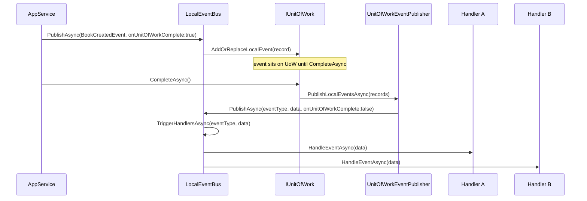

`Volo.Abp.EventBus.Local` is the **in‑process publish/subscribe** layer of the ABP Framework. It is what `EntityCreatedEventData<T>`, `EntityUpdatedEventData<T>`, and every hand‑rolled `*EventData` class flows through inside a single process. This page covers `ILocalEventBus`, the singleton `LocalEventBus` implementation, the shared `EventBusBase` it derives from, the unit‑of‑work integration via `UnitOfWorkEventPublisher`, and the difference between sync (`ILocalEventHandler<TEvent>.HandleEventAsync`) and asynchronous delivery.

## Contract

`framework/src/Volo.Abp.EventBus.Abstractions/Volo/Abp/EventBus/Local/ILocalEventBus.cs`:

```csharp
public interface ILocalEventBus : IEventBus
{
    IDisposable Subscribe<TEvent>(ILocalEventHandler<TEvent> handler) where TEvent : class;
    List<EventTypeWithEventHandlerFactories> GetEventHandlerFactories(Type eventType);
}
```

The handler interface is in the same assembly under `Volo/Abp/EventBus/Local/ILocalEventHandler.cs`:

```csharp
public interface ILocalEventHandler<in TEvent> : IEventHandler
{
    Task HandleEventAsync(TEvent eventData);
}
```

`ILocalEventBus` extends `IEventBus` (under `Volo/Abp/EventBus/IEventBus.cs`), which adds the publish surface inherited from `EventBusBase`:

```csharp
Task PublishAsync<TEvent>(TEvent eventData, bool onUnitOfWorkComplete = true) where TEvent : class;
Task PublishAsync(Type eventType, object eventData, bool onUnitOfWorkComplete = true);
```

The `onUnitOfWorkComplete` flag is the linchpin for transactional publishing — when true and there is an ambient UoW, the event is *queued on the UoW*, not dispatched immediately.

## Where the implementation lives

```
framework/src/Volo.Abp.EventBus/Volo/Abp/EventBus/
  EventBusBase.cs
  UnitOfWorkEventPublisher.cs
  Local/
    AbpLocalEventBusOptions.cs
    LocalEventBus.cs
    LocalEventMessage.cs
    NullLocalEventBus.cs
```

`LocalEventBus` is the only real implementation; `NullLocalEventBus` is a no‑op used in test harnesses.

## `LocalEventBus` registration

```csharp
[ExposeServices(typeof(ILocalEventBus), typeof(LocalEventBus))]
public class LocalEventBus : EventBusBase, ILocalEventBus, ISingletonDependency
{
    protected AbpLocalEventBusOptions Options { get; }
    protected ConcurrentDictionary<Type, List<IEventHandlerFactory>> HandlerFactories { get; }

    public LocalEventBus(
        IOptions<AbpLocalEventBusOptions> options,
        IServiceScopeFactory serviceScopeFactory,
        ICurrentTenant currentTenant,
        IUnitOfWorkManager unitOfWorkManager,
        IEventHandlerInvoker eventHandlerInvoker)
        : base(serviceScopeFactory, currentTenant, unitOfWorkManager, eventHandlerInvoker)
    {
        Options = options.Value;
        HandlerFactories = new ConcurrentDictionary<Type, List<IEventHandlerFactory>>();
        SubscribeHandlers(Options.Handlers);
    }
```

Three things to take away from the registration:

1. `LocalEventBus` is **a singleton** — `ISingletonDependency` plus `[ExposeServices]` means both `ILocalEventBus` and the concrete class resolve to the same instance.
2. The subscription table is a `ConcurrentDictionary<Type, List<IEventHandlerFactory>>`. Keys are event CLR types; values are handler factories that either create a fresh handler from the DI container (`IocEventHandlerFactory`) or hold a single shared instance (`SingleInstanceHandlerFactory`).
3. `SubscribeHandlers(Options.Handlers)` runs at construction. Every type registered with `Configure<AbpLocalEventBusOptions>(opt => opt.Handlers.Add<MyHandler>())` is wired as an `IocEventHandlerFactory` so handlers get a fresh DI scope per dispatch.

The conventional registration that drops handlers into this list happens earlier in the module — `AbpEventBusModule` scans assemblies for `ILocalEventHandler<>` implementations and adds them to `Options.Handlers` before the bus is constructed.

## `AbpLocalEventBusOptions`

`AbpLocalEventBusOptions.cs` is intentionally tiny:

```csharp
public class AbpLocalEventBusOptions
{
    public ITypeList<IEventHandler> Handlers { get; }
    public AbpLocalEventBusOptions() { Handlers = new TypeList<IEventHandler>(); }
}
```

The only configurable knob is the handler type list. There is no global on/off switch — to disable local events, swap in `NullLocalEventBus`.

## Publish path

The base `EventBusBase.PublishAsync` (`EventBusBase.cs`) implements the UoW deferral logic:

```csharp
public virtual async Task PublishAsync(Type eventType, object eventData, bool onUnitOfWorkComplete = true)
{
    if (onUnitOfWorkComplete && UnitOfWorkManager.Current != null)
    {
        AddToUnitOfWork(
            UnitOfWorkManager.Current,
            new UnitOfWorkEventRecord(eventType, eventData, EventOrderGenerator.GetNext())
        );
        return;
    }

    await PublishToEventBusAsync(eventType, eventData);
}
```

`LocalEventBus` provides both abstract overrides:

```csharp
protected override async Task PublishToEventBusAsync(Type eventType, object eventData)
{
    await PublishAsync(new LocalEventMessage(Guid.NewGuid(), eventData, eventType));
}

protected override void AddToUnitOfWork(IUnitOfWork unitOfWork, UnitOfWorkEventRecord eventRecord)
{
    unitOfWork.AddOrReplaceLocalEvent(eventRecord);
}
```

The deferred path calls `IUnitOfWork.AddOrReplaceLocalEvent(UnitOfWorkEventRecord)`. The UoW collects these records and, when it completes successfully, hands them to `IUnitOfWorkEventPublisher`. See [Unit of Work](/data/unit-of-work) for the UoW side of this exchange.

The immediate path wraps the data in a `LocalEventMessage` (a small record with `Guid Id`, `Type EventType`, `object EventData`) and calls `PublishAsync(LocalEventMessage)`, which delegates to `TriggerHandlersAsync(eventType, eventData)`.

## Dispatch path: `TriggerHandlersAsync`

`EventBusBase.TriggerHandlersAsync` (`EventBusBase.cs`) is the polymorphic dispatcher:

```csharp
protected virtual async Task TriggerHandlersAsync(Type eventType, object eventData, List<Exception> exceptions, InboxConfig? inboxConfig = null)
{
    await new SynchronizationContextRemover();

    foreach (var handlerFactories in GetHandlerFactories(eventType).ToList())
    {
        foreach (var handlerFactory in handlerFactories.EventHandlerFactories.ToList())
        {
            await TriggerHandlerAsync(handlerFactory, handlerFactories.EventType, eventData, exceptions, inboxConfig);
        }
    }

    // IEventDataWithInheritableGenericArgument support
    if (eventType.GetTypeInfo().IsGenericType &&
        eventType.GetGenericArguments().Length == 1 &&
        typeof(IEventDataWithInheritableGenericArgument).IsAssignableFrom(eventType))
    {
        var genericArg = eventType.GetGenericArguments()[0];
        var baseArg = genericArg.GetTypeInfo().BaseType;
        if (baseArg != null)
        {
            var baseEventType = eventType.GetGenericTypeDefinition().MakeGenericType(baseArg);
            var constructorArgs = ((IEventDataWithInheritableGenericArgument)eventData).GetConstructorArgs();
            var baseEventData = Activator.CreateInstance(baseEventType, constructorArgs)!;
            await PublishToEventBusAsync(baseEventType, baseEventData);
        }
    }
}
```

Two features worth highlighting:

- **`SynchronizationContextRemover`** ensures continuations run on the thread pool instead of an ASP.NET request context. This prevents one slow handler from blocking the request thread.
- **Inheritable generic events** — a handler for `EntityCreatedEventData<Book>` will also be invoked for `EntityCreatedEventData<NovelBook>` when `NovelBook : Book` and `IEventDataWithInheritableGenericArgument` is implemented, by walking up the base type chain and re‑publishing.

`LocalEventBus.GetHandlerFactories(Type eventType)` collects every factory whose registered type is the event type or an assignable supertype, then orders by `[LocalEventHandlerOrder]`:

```csharp
protected override IEnumerable<EventTypeWithEventHandlerFactories> GetHandlerFactories(Type eventType)
{
    var handlerFactoryList = new List<Tuple<IEventHandlerFactory, Type, int>>();
    foreach (var handlerFactory in HandlerFactories.Where(hf => ShouldTriggerEventForHandler(eventType, hf.Key)))
    {
        foreach (var factory in handlerFactory.Value)
        {
            handlerFactoryList.Add(new Tuple<IEventHandlerFactory, Type, int>(
                factory,
                handlerFactory.Key,
                ReflectionHelper.GetAttributesOfMemberOrDeclaringType<LocalEventHandlerOrderAttribute>(
                    factory.GetHandler().EventHandler.GetType()).FirstOrDefault()?.Order ?? 0));
        }
    }
    return handlerFactoryList.OrderBy(x => x.Item3).Select(/* … */).ToArray();
}

private static bool ShouldTriggerEventForHandler(Type targetEventType, Type handlerEventType)
{
    if (handlerEventType == targetEventType) return true;
    if (handlerEventType.IsAssignableFrom(targetEventType)) return true;
    return false;
}
```

So a handler subscribed to a base type or an interface will fire when a derived event is published, in deterministic order.

## Subscription forms

`EventBusBase` exposes four subscription overloads, all returning an `IDisposable` that unsubscribes on dispose:

| Signature | Use |
| --- | --- |
| `Subscribe<TEvent>(Func<TEvent, Task> action)` | Quick lambda handler, wrapped in `ActionEventHandler<TEvent>`. |
| `Subscribe<TEvent, THandler>()` | Transient handler created per dispatch via `TransientEventHandlerFactory<THandler>`. |
| `Subscribe(Type, IEventHandler)` | Singleton handler instance via `SingleInstanceHandlerFactory`. |
| `Subscribe<TEvent>(ILocalEventHandler<TEvent>)` | Same as above but typed. |

In application code the typical pattern is to declare a class implementing `ILocalEventHandler<TEvent>, ITransientDependency` — conventional registration plus auto‑subscription via `AbpLocalEventBusOptions.Handlers`.

## `UnitOfWorkEventPublisher`

`UnitOfWorkEventPublisher.cs` is the bridge from a completed UoW to both event buses:

```csharp
[Dependency(ReplaceServices = true)]
public class UnitOfWorkEventPublisher : IUnitOfWorkEventPublisher, ITransientDependency
{
    private readonly ILocalEventBus _localEventBus;
    private readonly IDistributedEventBus _distributedEventBus;

    public UnitOfWorkEventPublisher(ILocalEventBus localEventBus, IDistributedEventBus distributedEventBus)
    {
        _localEventBus = localEventBus;
        _distributedEventBus = distributedEventBus;
    }

    public async Task PublishLocalEventsAsync(IEnumerable<UnitOfWorkEventRecord> localEvents)
    {
        foreach (var localEvent in localEvents)
        {
            await _localEventBus.PublishAsync(
                localEvent.EventType,
                localEvent.EventData,
                onUnitOfWorkComplete: false  // important!
            );
        }
    }

    public async Task PublishDistributedEventsAsync(IEnumerable<UnitOfWorkEventRecord> distributedEvents)
    {
        foreach (var distributedEvent in distributedEvents)
        {
            await _distributedEventBus.PublishAsync(
                distributedEvent.EventType,
                distributedEvent.EventData,
                onUnitOfWorkComplete: false,
                useOutbox: distributedEvent.UseOutbox
            );
        }
    }
}
```

Why pass `onUnitOfWorkComplete: false`? Because this method is being called *by* the UoW's completion hook — passing `true` would create an infinite loop where the event re‑queues itself on the (already‑completing) UoW. Forcing `false` makes the bus dispatch immediately to handlers.

## End‑to‑end lifecycle



If `CompleteAsync` throws, the UoW invokes `RollbackAsync` and the recorded events **are never published** — this is the transactional guarantee. Conversely a handler that throws causes `TriggerHandlersAsync` to collect the exception and rethrow as an `AggregateException` (or the original if just one) via `ThrowOriginalExceptions`.

## Sync vs async semantics

Although the only handler shape is `Task HandleEventAsync(TEvent)`, several behaviors deserve attention:

| Scenario | Behavior |
| --- | --- |
| Handler awaits I/O | Other handlers in the same publish run after it returns (the loop is `foreach … await TriggerHandlerAsync`). |
| Handler throws | Exception is captured, processing continues for siblings, then aggregated and rethrown at the publish call site. |
| Publisher inside UoW with `onUnitOfWorkComplete: true` | Returns immediately; handlers run after `CompleteAsync`. |
| Publisher inside UoW with `onUnitOfWorkComplete: false` | Handlers run **inside the UoW**, so any DB writes happen in the same transaction. |
| `AddOrReplaceLocalEvent` called twice with same key | The UoW dedupes (`IUnitOfWork.AddOrReplaceLocalEvent` accepts a `replacementSelector`). |

The "run inside the UoW" mode is how `[UnitOfWork]`‑decorated event handlers can still write to the same transaction; the "run after" mode is how a notification handler can publish to RabbitMQ knowing the database write succeeded.

## Inheriting generic args

`Volo/Abp/EventBus/IEventDataWithInheritableGenericArgument.cs` is a small contract:

```csharp
public interface IEventDataWithInheritableGenericArgument
{
    object[] GetConstructorArgs();
}
```

It is implemented by `EntityChangeEventData<TEntity>` and lets a `EntityCreatedEventData<NovelBook>` cascade to handlers registered for `EntityCreatedEventData<Book>` because `TriggerHandlersAsync` re‑publishes the base‑arg version. The same cascading is described in [Event publish and handle flow](/flows/event-publish-and-handle).

## Multi‑tenant capture

`LocalEventBus` does not need to capture tenant id because handlers run in the same async‑local context that published the event — `ICurrentTenant` already has the publisher's tenant id. The distributed bus, where events cross process boundaries, must serialize the tenant; that is covered in [Distributed event bus](/infrastructure/event-bus-distributed).

## Sample code

```csharp
public class BookCreatedEvent
{
    public Guid BookId { get; set; }
    public string Title { get; set; } = default!;
}

[Dependency(ServiceLifetime.Transient)]
public class BookCreatedHandler : ILocalEventHandler<BookCreatedEvent>, ITransientDependency
{
    private readonly ISearchIndex _index;
    public BookCreatedHandler(ISearchIndex index) { _index = index; }
    public async Task HandleEventAsync(BookCreatedEvent eventData)
    {
        await _index.IndexAsync(eventData.BookId, eventData.Title);
    }
}

public class BookAppService : ApplicationService
{
    private readonly ILocalEventBus _bus;
    public BookAppService(ILocalEventBus bus) { _bus = bus; }

    [UnitOfWork]
    public async Task CreateAsync(CreateBookDto dto)
    {
        var book = await _bookRepository.InsertAsync(new Book(dto));
        await _bus.PublishAsync(new BookCreatedEvent { BookId = book.Id, Title = book.Title });
        // event is queued on the current UoW; handler runs after CompleteAsync
    }
}
```

Conventional registration sees `BookCreatedHandler : ILocalEventHandler<BookCreatedEvent>` and adds it to `AbpLocalEventBusOptions.Handlers`, so `LocalEventBus` wires it as an `IocEventHandlerFactory` at startup. No manual `Subscribe` call is required.

## Cross‑references

| Topic | See |
| --- | --- |
| Transactional event queueing on the UoW | [Unit of Work](/data/unit-of-work) |
| Outbox/inbox and broker integration | [Distributed event bus](/infrastructure/event-bus-distributed) |
| End‑to‑end publish, including ETO mapping | [Event publish and handle flow](/flows/event-publish-and-handle) |
| Tenant capture across processes | [Multi‑tenancy](/multi-tenancy/overview) |
| Interceptors that may publish from within a UoW boundary | [Auditing](/infrastructure/auditing) |
