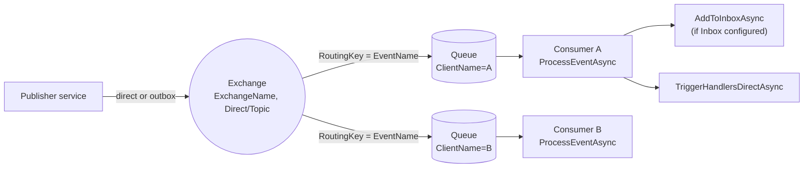

`Volo.Abp.EventBus.RabbitMQ` is the **default real broker** for ABP's distributed event bus. It plugs `RabbitMqDistributedEventBus` into the `IDistributedEventBus` contract, replaces `LocalDistributedEventBus`, and uses a single durable exchange + a per‑client queue bound by routing key. This page covers the bus class, its options, the post‑configurator that types queue arguments, exchange/queue conventions, and how messages map to `OutgoingEventInfo` / `IncomingEventInfo`.

## Package layout

```text
framework/src/Volo.Abp.EventBus.RabbitMQ/Volo/Abp/EventBus/RabbitMq/
  AbpEventBusRabbitMqModule.cs
  AbpRabbitMqEventBusOptions.cs
  IRabbitMqDistributedEventBus.cs
  PostConfigureAbpRabbitMqEventBusOptions.cs
  RabbitMqDistributedEventBus.cs
```

The transport plumbing (`IConnectionPool`, `IChannelPool`, `IRabbitMqMessageConsumer`, `IRabbitMqSerializer`) lives in `framework/src/Volo.Abp.RabbitMQ/` and is shared with the RabbitMQ background‑jobs adapter described in [background jobs over RabbitMQ](/infrastructure/background-jobs-rabbitmq).

## Module wiring

`AbpEventBusRabbitMqModule.cs`:

```csharp
[DependsOn(typeof(AbpEventBusModule), typeof(AbpRabbitMqModule))]
public class AbpEventBusRabbitMqModule : AbpModule
{
    public override void ConfigureServices(ServiceConfigurationContext context)
    {
        var configuration = context.Services.GetConfiguration();
        Configure<AbpRabbitMqEventBusOptions>(configuration.GetSection("RabbitMQ:EventBus"));
        context.Services.TryAddEnumerable(
            ServiceDescriptor.Singleton<IPostConfigureOptions<AbpRabbitMqEventBusOptions>,
                                       PostConfigureAbpRabbitMqEventBusOptions>());
    }

    public override void OnApplicationInitialization(ApplicationInitializationContext context)
    {
        context.ServiceProvider
            .GetRequiredService<IRabbitMqDistributedEventBus>()
            .Initialize();
    }
}
```

Two steps:

1. Bind `AbpRabbitMqEventBusOptions` to `RabbitMQ:EventBus` in `IConfiguration`.
2. After all modules' `ConfigureServices` have run, resolve the bus and call `Initialize()` to declare the exchange, queue, and consumer.

The bus itself registers via `[Dependency(ReplaceServices = true)] [ExposeServices(typeof(IDistributedEventBus), typeof(RabbitMqDistributedEventBus), typeof(IRabbitMqDistributedEventBus))]` so adding this module replaces `LocalDistributedEventBus`.

## `AbpRabbitMqEventBusOptions`

```csharp
public class AbpRabbitMqEventBusOptions
{
    public const string DefaultExchangeType = RabbitMqConsts.ExchangeTypes.Direct;

    public string? ConnectionName { get; set; }
    public string ClientName { get; set; } = default!;
    public string ExchangeName { get; set; } = default!;
    public string? ExchangeType { get; set; }
    public ushort? PrefetchCount { get; set; }
    public IDictionary<string, object?> QueueArguments { get; set; } = new Dictionary<string, object?>();
    public IDictionary<string, object?> ExchangeArguments { get; set; } = new Dictionary<string, object?>();

    public string GetExchangeTypeOrDefault()
        => string.IsNullOrEmpty(ExchangeType) ? DefaultExchangeType : ExchangeType!;
}
```

| Property | Default | Notes |
| --- | --- | --- |
| `ConnectionName` | `null` | Picks the named connection from `AbpRabbitMqOptions.Connections`. `null` uses the default connection. |
| `ClientName` | required | Becomes the queue name. Every replica that should share consumption uses the same name. |
| `ExchangeName` | required | Single shared exchange for the whole event bus. |
| `ExchangeType` | `Direct` | `Direct` routes by exact event name; switching to `Topic` enables wildcards. |
| `PrefetchCount` | `null` | Forwarded as `basic.qos`. |
| `QueueArguments` | `{}` | Standard AMQP queue arguments (`x-message-ttl`, `x-max-length`, …). |
| `ExchangeArguments` | `{}` | Standard exchange arguments. |

## `PostConfigureAbpRabbitMqEventBusOptions`

A subtle but important class. RabbitMQ's client library requires numeric and boolean queue arguments to have the right CLR type, but `IConfiguration` always returns strings. The post‑configurator coerces them:

```csharp
private readonly FrozenSet<string> _uint64QueueArguments = new HashSet<string>
{
    "x-delivery-limit", "x-expires", "x-message-ttl",
    "x-max-length", "x-max-length-bytes",
    "x-quorum-initial-group-size", "x-quorum-target-group-size",
    "x-stream-filter-size-bytes", "x-stream-max-segment-size-bytes",
}.ToFrozenSet();

private readonly FrozenSet<string> _boolQueueArguments = new HashSet<string> { "x-single-active-consumer" }.ToFrozenSet();

public virtual void PostConfigure(string? name, AbpRabbitMqEventBusOptions options)
{
    ParseBoolQueueArguments(options);
    ParseIntegerQueueArguments(options);
}
```

So an `appsettings.json` value like `"x-message-ttl": "60000"` is silently converted to an `int`. Without this, RabbitMQ would reject the queue declaration with a type mismatch.

## `Initialize()` — exchange and queue declaration

```csharp
public virtual void Initialize()
{
    Consumer = MessageConsumerFactory.Create(
        new ExchangeDeclareConfiguration(
            AbpRabbitMqEventBusOptions.ExchangeName,
            type: AbpRabbitMqEventBusOptions.GetExchangeTypeOrDefault(),
            durable: true,
            arguments: AbpRabbitMqEventBusOptions.ExchangeArguments
        ),
        new QueueDeclareConfiguration(
            AbpRabbitMqEventBusOptions.ClientName,
            durable: true,
            exclusive: false,
            autoDelete: false,
            prefetchCount: AbpRabbitMqEventBusOptions.PrefetchCount,
            arguments: AbpRabbitMqEventBusOptions.QueueArguments
        ),
        AbpRabbitMqEventBusOptions.ConnectionName
    );

    Consumer.OnMessageReceived(ProcessEventAsync);
    SubscribeHandlers(AbpDistributedEventBusOptions.Handlers);
}
```

The conventions:

- One **durable, non‑exclusive, non‑auto‑delete** queue per `ClientName`. Multiple replicas of the same service share the queue (competing consumer pattern); different services use different `ClientName`s.
- The exchange is shared across the deployment.
- After the consumer is up, every handler registered in `AbpDistributedEventBusOptions.Handlers` is subscribed.

## Routing: subscribe = bind, publish = routing key

`Subscribe(Type, IEventHandlerFactory)` binds the queue to the event name the first time the event type is encountered:

```csharp
public override IDisposable Subscribe(Type eventType, IEventHandlerFactory factory)
{
    var handlerFactories = GetOrCreateHandlerFactories(eventType);
    if (factory.IsInFactories(handlerFactories)) return NullDisposable.Instance;

    handlerFactories.Add(factory);
    if (handlerFactories.Count == 1)
    {
        Consumer.BindAsync(EventNameAttribute.GetNameOrDefault(eventType));
    }
    return new EventHandlerFactoryUnregistrar(this, eventType, factory);
}
```

So bindings are lazy: a service only receives events it has handlers for, even though the exchange may carry many event names.

## Publishing

`PublishToEventBusAsync` produces a message with routing key = event name, body = serialized ETO, and the correlation id propagated through the AMQP `CorrelationId` property:

```csharp
protected override async Task PublishToEventBusAsync(Type eventType, object eventData)
{
    await PublishAsync(eventType, eventData, correlationId: CorrelationIdProvider.Get());
}

protected override void AddToUnitOfWork(IUnitOfWork unitOfWork, UnitOfWorkEventRecord eventRecord)
{
    unitOfWork.AddOrReplaceDistributedEvent(eventRecord);
}
```

The outbox path uses publisher confirms for safe many‑at‑a‑time sends:

```csharp
public async override Task PublishManyFromOutboxAsync(
    IEnumerable<OutgoingEventInfo> outgoingEvents, OutboxConfig outboxConfig)
{
    using (var channel = await (await ConnectionPool.GetAsync(AbpRabbitMqEventBusOptions.ConnectionName))
        .CreateChannelAsync(new CreateChannelOptions(
            publisherConfirmationsEnabled: true,
            publisherConfirmationTrackingEnabled: true,
            new ThrottlingRateLimiter(256))))
    {
        foreach (var outgoingEvent in outgoingEvents)
        {
            await PublishAsync(channel, outgoingEvent.EventName, outgoingEvent.EventData,
                eventId: outgoingEvent.Id, correlationId: outgoingEvent.GetCorrelationId());

            using (CorrelationIdProvider.Change(outgoingEvent.GetCorrelationId()))
            {
                await TriggerDistributedEventSentAsync(new DistributedEventSent
                {
                    Source = DistributedEventSource.Outbox,
                    EventName = outgoingEvent.EventName,
                    EventData = outgoingEvent.EventData
                });
            }
        }
    }
}
```

The `ThrottlingRateLimiter(256)` caps in‑flight unconfirmed messages so the broker is not flooded.

## Consume path

```csharp
private async Task ProcessEventAsync(IChannel channel, BasicDeliverEventArgs ea)
{
    var eventName = ea.RoutingKey;
    var eventType = EventTypes.GetOrDefault(eventName);
    if (eventType == null) return;

    var eventData = Serializer.Deserialize(ea.Body.ToArray(), eventType);

    var correlationId = ea.BasicProperties.CorrelationId;
    if (await AddToInboxAsync(ea.BasicProperties.MessageId, eventName, eventType, eventData, correlationId))
        return;  // inbox took ownership; processor will fire handlers

    using (CorrelationIdProvider.Change(correlationId))
    {
        await TriggerHandlersDirectAsync(eventType, eventData);
    }
}
```

Notable details:

- `ea.BasicProperties.MessageId` becomes the inbox dedupe key (`ExistsByMessageIdAsync`).
- `ea.BasicProperties.CorrelationId` flows into the inbox row and is also restored for direct dispatch via `CorrelationIdProvider.Change`.
- Unknown routing keys are silently dropped — `EventTypes.GetOrDefault(eventName)` returns null and `ProcessEventAsync` returns.

## End‑to‑end picture



Two services, two queues, one exchange, one event name per binding. Adding replicas of service A just adds more consumers on the same queue, so RabbitMQ load‑balances across them.

## Configuration recipe

```json
{
  "RabbitMQ": {
    "Connections": {
      "Default": { "HostName": "rabbitmq", "Port": "5672", "UserName": "abp", "Password": "secret" }
    },
    "EventBus": {
      "ClientName": "AcmeBookStore.Catalog",
      "ExchangeName": "Acme",
      "ExchangeType": "Direct",
      "PrefetchCount": 50,
      "QueueArguments": {
        "x-message-ttl": "3600000",
        "x-max-length": "100000"
      }
    }
  }
}
```

The `x-message-ttl` / `x-max-length` strings are picked up by `PostConfigureAbpRabbitMqEventBusOptions` and converted to integers before queue declaration.

## Options matrix

| Concern | Option | Default | Effect |
| --- | --- | --- | --- |
| Connection | `ConnectionName` | `null` (default conn) | Selects from `AbpRabbitMqOptions.Connections`. |
| Queue identity | `ClientName` | required | One queue per service deployment. |
| Exchange | `ExchangeName` | required | Shared across deployment. |
| Routing | `ExchangeType` | `Direct` | `Topic` enables wildcards in event names. |
| Throughput | `PrefetchCount` | `null` | Caps unacked deliveries per consumer. |
| Inbox | `AbpDistributedEventBusOptions.Inboxes` | empty | When configured, `AddToInboxAsync` takes precedence over direct handler dispatch. |
| Outbox | `AbpDistributedEventBusOptions.Outboxes` | empty | When configured, `useOutbox: true` writes a row instead of publishing directly. |
| Bulk send | `AbpEventBusBoxesOptions.BatchPublishOutboxEvents` | `true` | Uses `PublishManyFromOutboxAsync` with publisher confirms. |

## Cross‑references

| Topic | See |
| --- | --- |
| Common publish/inbox/outbox semantics | [Distributed event bus](/infrastructure/event-bus-distributed) |
| ETO conventions and `[EventName]` resolution | [Distributed event bus](/infrastructure/event-bus-distributed) |
| Full publish/handle flow including UoW | [Event publish and handle](/flows/event-publish-and-handle) |
| RabbitMQ background‑job adapter sharing the same transport | [Background jobs over RabbitMQ](/infrastructure/background-jobs-rabbitmq) |
| Correlation id propagation | [Tracing and correlation](/core/tracing-and-correlation) |
