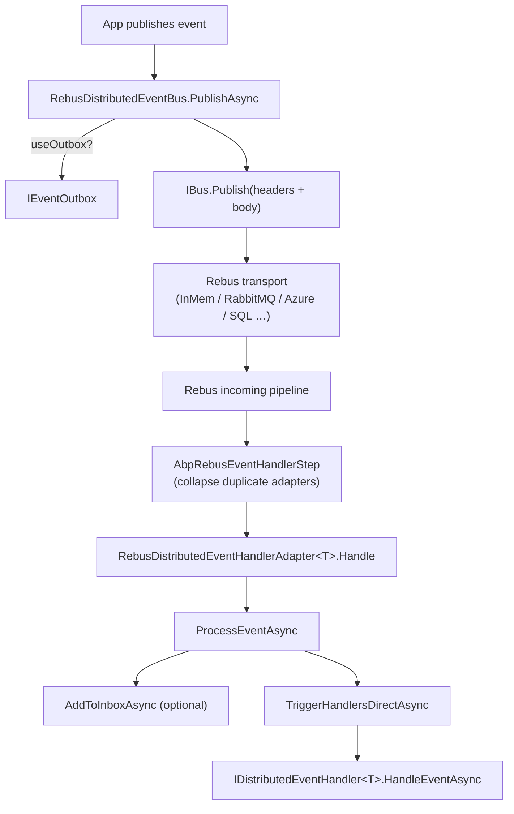

`Volo.Abp.EventBus.Rebus` integrates ABP's `IDistributedEventBus` with **Rebus**, an open‑source .NET service bus that ships pluggable transports (RabbitMQ, Azure Service Bus, Amazon SQS, SQL Server, in‑memory, …). Rebus owns the wire format, ABP owns the publish/subscribe contract and the outbox/inbox. This page covers `RebusDistributedEventBus`, the `Configurer` callback in `AbpRebusEventBusOptions`, the `RebusDistributedEventHandlerAdapter<T>` pipeline step, and how the bus integrates with Rebus's per‑instance hosting (`startAutomatically: false`).

## Files

```text
framework/src/Volo.Abp.EventBus.Rebus/Volo/Abp/EventBus/Rebus/
  AbpEventBusRebusModule.cs
  AbpRebusEventBusOptions.cs
  AbpRebusEventHandlerStep.cs
  IRebusDistributedEventHandlerAdapter.cs
  IRebusSerializer.cs
  RebusDistributedEventBus.cs
  RebusDistributedEventHandlerAdapter.cs
  Utf8JsonRabbitMqSerializer.cs
```

## `AbpRebusEventBusOptions`

```csharp
public class AbpRebusEventBusOptions
{
    public string InputQueueName { get; set; } = null!;
    public string RebusInstanceName { get; set; } = "default-instance";

    public Action<RebusConfigurer> Configurer
    {
        get => _configurer;
        set => _configurer = Check.NotNull(value, nameof(value));
    }
    private Action<RebusConfigurer> _configurer;

    public Func<IBus, Type, object, Task>? Publish { get; set; }

    public AbpRebusEventBusOptions()
    {
        _configurer = DefaultConfigure;
    }

    private void DefaultConfigure(RebusConfigurer configure)
    {
        configure.Transport(t => t.UseInMemoryTransport(new InMemNetwork(), InputQueueName));
    }
}
```

Three knobs matter:

| Property | Purpose |
| --- | --- |
| `InputQueueName` | The queue Rebus consumes from. Per service. |
| `RebusInstanceName` | Key used by `IBusRegistry` to start the bus. Lets multiple Rebus buses coexist in one process. |
| `Configurer` | Mandatory delegate that builds the transport. The default uses `InMemNetwork()` so the app at least boots; production sets RabbitMQ/Azure/SQL here. |
| `Publish` | Optional override that swaps in a custom publish lambda — useful for routing decisions Rebus does not natively support. |

A typical override:

```csharp
Configure<AbpRebusEventBusOptions>(options =>
{
    options.InputQueueName = "acme-bookstore-catalog";
    options.Configurer = configure => configure
        .Transport(t => t.UseRabbitMq("amqp://localhost", options.InputQueueName))
        .Routing(r => r.TypeBased().MapAssemblyOf<BookCreatedEto>(options.InputQueueName));
});
```

## Module wiring

`AbpEventBusRebusModule.cs` does a lot for a small file:

```csharp
[DependsOn(typeof(AbpEventBusModule))]
public class AbpEventBusRebusModule : AbpModule
{
    public override void ConfigureServices(ServiceConfigurationContext context)
    {
        context.Services.AddTransient(typeof(IHandleMessages<>), typeof(RebusDistributedEventHandlerAdapter<>));

        var preActions = context.Services.GetPreConfigureActions<AbpRebusEventBusOptions>();
        var rebusOptions = preActions.Configure();
        Configure<AbpRebusEventBusOptions>(options => { preActions.Configure(options); });

        context.Services.AddRebus(configure =>
        {
            configure.Options(options =>
            {
                options.Decorate<IPipeline>(d =>
                {
                    var step = new AbpRebusEventHandlerStep();
                    var pipeline = d.Get<IPipeline>();
                    return new PipelineStepInjector(pipeline).OnReceive(step,
                        PipelineRelativePosition.After, typeof(ActivateHandlersStep));
                });
            });

            rebusOptions.Configurer?.Invoke(configure);
            return configure;
        }, startAutomatically: false, key: rebusOptions.RebusInstanceName);
    }

    public override void OnApplicationInitialization(ApplicationInitializationContext context)
    {
        context.ServiceProvider.GetRequiredService<RebusDistributedEventBus>().Initialize();

        var rebusOptions = context.ServiceProvider.GetRequiredService<IOptions<AbpRebusEventBusOptions>>().Value;
        context.ServiceProvider.GetRequiredService<IBusRegistry>()
            .StartBus(rebusOptions.RebusInstanceName);
    }
}
```

Four interesting things:

1. **`IHandleMessages<>` adapter** — Rebus's handler interface is `IHandleMessages<TMessage>`. ABP registers `RebusDistributedEventHandlerAdapter<>` as the open generic so every Rebus message of type `T` is routed to an ABP adapter that forwards to `IDistributedEventHandler<T>` registered in the ABP DI container.
2. **Pre‑configure actions** — `GetPreConfigureActions<AbpRebusEventBusOptions>().Configure()` is what allows other modules to mutate the options *before* `AddRebus` is called. Without this the `Configurer` would be locked at the moment `AddRebus` reads it.
3. **Pipeline step injection** — `AbpRebusEventHandlerStep` is injected after `ActivateHandlersStep` to deduplicate handler invocations (see below).
4. **`startAutomatically: false`** — the bus is built during DI but not started until `OnApplicationInitialization`. This is what lets `RebusDistributedEventBus.Initialize()` subscribe handlers before any message is processed.

## `AbpRebusEventHandlerStep`

`AbpRebusEventHandlerStep.cs` solves a subtle problem: Rebus may locate multiple handlers for a single message type because the adapter is open‑generic. The ABP layer already knows it has one canonical adapter per message type, so the step collapses the list:

```csharp
public class AbpRebusEventHandlerStep : IIncomingStep
{
    public Task Process(IncomingStepContext context, Func<Task> next)
    {
        var message = context.Load<Message>();
        var handlerInvokers = context.Load<HandlerInvokers>().ToList();

        if (handlerInvokers.All(x => x.Handler is IRebusDistributedEventHandlerAdapter))
        {
            handlerInvokers = new List<HandlerInvoker> { handlerInvokers.Last() };
            context.Save(new HandlerInvokers(message, handlerInvokers));
        }

        return next();
    }
}
```

When every selected handler is an ABP adapter (`IRebusDistributedEventHandlerAdapter` marker interface in `IRebusDistributedEventHandlerAdapter.cs`), keep only the last one and discard the duplicates. The single retained adapter then fans out to all ABP `IDistributedEventHandler<TEvent>` instances itself.

## `RebusDistributedEventBus`

```csharp
[Dependency(ReplaceServices = true)]
[ExposeServices(typeof(IDistributedEventBus), typeof(RebusDistributedEventBus))]
public class RebusDistributedEventBus : DistributedEventBusBase, ISingletonDependency
{
    protected IBus Rebus { get; }
    protected IRebusSerializer Serializer { get; }
    protected ConcurrentDictionary<Type, List<IEventHandlerFactory>> HandlerFactories { get; }
    protected ConcurrentDictionary<string, Type> EventTypes { get; }
    protected AbpRebusEventBusOptions AbpRebusEventBusOptions { get; }
}
```

The crucial difference from the broker‑specific buses is that the publish path goes through `IBus.Publish(eventData, headers)`:

```csharp
protected async override Task PublishToEventBusAsync(Type eventType, object eventData)
{
    var headers = new Dictionary<string, string>();
    if (CorrelationIdProvider.Get() != null)
        headers.Add(EventBusConsts.CorrelationIdHeaderName, CorrelationIdProvider.Get()!);

    await PublishAsync(eventType, eventData, headersArguments: headers);
}

protected virtual async Task PublishAsync(Type eventType, object eventData,
    Guid? eventId = null, Dictionary<string, string>? headersArguments = null)
{
    if (AbpRebusEventBusOptions.Publish != null)
    {
        await AbpRebusEventBusOptions.Publish(Rebus, eventType, eventData);
        return;
    }

    headersArguments ??= new Dictionary<string, string>();
    if (!headersArguments.ContainsKey(Headers.MessageId))
        headersArguments[Headers.MessageId] = (eventId ?? GuidGenerator.Create()).ToString("N");

    await Rebus.Publish(eventData, headersArguments);
}
```

The `Publish` override on `AbpRebusEventBusOptions` short‑circuits everything — useful when Rebus's default topic‑based routing is not enough.

## Subscribe path

`Subscribe(Type, IEventHandlerFactory)` does the ABP bookkeeping and, when the first handler for a type is added, calls `Rebus.Subscribe(eventType)` so Rebus's transport sets up the binding (for transports that distinguish publish/subscribe like RabbitMQ topic exchanges or Azure topics):

```csharp
public override IDisposable Subscribe(Type eventType, IEventHandlerFactory factory)
{
    var handlerFactories = GetOrCreateHandlerFactories(eventType);
    if (factory.IsInFactories(handlerFactories)) return NullDisposable.Instance;

    handlerFactories.Add(factory);
    if (handlerFactories.Count == 1) Rebus.Subscribe(eventType);

    return new EventHandlerFactoryUnregistrar(this, eventType, factory);
}
```

`Unsubscribe(...)` similarly calls `Rebus.Unsubscribe(eventType)` after removing the last handler.

## Consume path

`ProcessEventAsync` is called by `RebusDistributedEventHandlerAdapter<T>.Handle`:

```csharp
public async Task ProcessEventAsync(Type eventType, object eventData)
{
    var messageId = MessageContext.Current.TransportMessage.GetMessageId();
    var eventName = EventNameAttribute.GetNameOrDefault(eventType);
    var correlationId = MessageContext.Current.Headers.GetOrDefault(EventBusConsts.CorrelationIdHeaderName);

    if (await AddToInboxAsync(messageId, eventName, eventType, eventData, correlationId))
        return;

    using (CorrelationIdProvider.Change(correlationId))
    {
        await TriggerHandlersDirectAsync(eventType, eventData);
    }
}
```

The header lookup uses `Rebus.Messages.Headers.MessageId` for dedupe; the correlation id rides on `EventBusConsts.CorrelationIdHeaderName` so it matches the wire format used by the other broker adapters.

## Diagram



## Initialization

`Initialize()` is a one‑liner:

```csharp
public void Initialize() { SubscribeHandlers(AbpDistributedEventBusOptions.Handlers); }
```

The transport subscription happens lazily on first `Subscribe`; the `IBusRegistry.StartBus(rebusInstanceName)` call in `OnApplicationInitialization` is what actually opens the connection and starts polling.

## Serializer

`IRebusSerializer.cs` is the same kind of byte‑level contract used elsewhere; `Utf8JsonRabbitMqSerializer.cs` is the default (despite the file name — it is a generic UTF‑8 JSON serializer reused from the RabbitMQ package).

## Comparison with the broker‑specific buses

| Concern | Broker bus (RabbitMQ/Kafka/Azure) | Rebus bus |
| --- | --- | --- |
| Transport choice | Hard‑coded per package | Anywhere `RebusConfigurer.Transport(...)` supports |
| Subscription mechanics | Direct AMQP/Kafka/SB calls | `Rebus.Subscribe(eventType)` |
| Pipeline customization | None (base class only) | Full Rebus pipeline (steps, behaviors, deferred messages, sagas) |
| Outbox/inbox | Yes (in `DistributedEventBusBase`) | Yes (in `DistributedEventBusBase`) |
| `Headers.MessageId` source | Provider‑native field | Rebus `Message.Headers["rbs2-msg-id"]` |
| Default transport | n/a | `UseInMemoryTransport(InMemNetwork)` for boot |

## When to pick Rebus

| Scenario | Verdict |
| --- | --- |
| You already use Rebus elsewhere | ✓ Reuse the same transport + sagas |
| You need a transport ABP does not provide directly (Amazon SQS, SQL Server) | ✓ Use Rebus |
| You want native RabbitMQ tunings (`PrefetchCount`, exchange type) | Prefer `Volo.Abp.EventBus.RabbitMQ` |
| You need cross‑service distributed sagas | ✓ Use Rebus (and write the sagas with Rebus directly) |

## Cross‑references

| Topic | See |
| --- | --- |
| Base class behavior | [Distributed event bus](/infrastructure/event-bus-distributed) |
| RabbitMQ direct adapter | [RabbitMQ event bus](/infrastructure/event-bus-rabbitmq) |
| End‑to‑end publish/handle flow | [Event publish and handle](/flows/event-publish-and-handle) |
| Correlation id propagation | [Tracing and correlation](/core/tracing-and-correlation) |
| Tenant id on the ETO | [Multi‑tenancy](/multi-tenancy/overview) |
