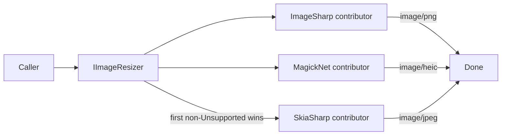

ABP Framework provides a tiny imaging abstraction (`Volo.Abp.Imaging.Abstractions`) that orchestrates a chain of contributors — ImageSharp, Magick.NET, SkiaSharp — to resize and compress images. The orchestrator is provider-agnostic, while contributors do the heavy work using their underlying libraries. This page covers `IImageResizer`/`IImageCompressor`, `ImageResizeArgs`/`ImageResizeMode`, the three first-party contributor packages, and the `ResizeImageAttribute`/`CompressImageAttribute` MVC filters shipped in `Volo.Abp.Imaging.AspNetCore`.

## IImageResizer and IImageCompressor

`framework/src/Volo.Abp.Imaging.Abstractions/Volo/Abp/Imaging/IImageResizer.cs` exposes two overloads (`Stream` and `byte[]`):

```csharp IImageResizer.cs
public interface IImageResizer
{
    Task<ImageResizeResult<Stream>> ResizeAsync(
        Stream stream, ImageResizeArgs resizeArgs,
        string? mimeType = null, CancellationToken cancellationToken = default);

    Task<ImageResizeResult<byte[]>> ResizeAsync(
        byte[] bytes, ImageResizeArgs resizeArgs,
        string? mimeType = null, CancellationToken cancellationToken = default);
}
```

`IImageCompressor` mirrors the shape without a `resizeArgs` parameter. Both return an `ImageResizeResult<T>`/`ImageCompressResult<T>` carrying the processed payload and a state enum:

```csharp ImageProcessState.cs
public enum ImageProcessState : byte
{
    Done = 1,
    Canceled = 2,
    Unsupported = 3,
}
```

`Unsupported` means the chain ran but no contributor knew how to handle the input (typically because of an unknown MIME type) — callers fall back to the original payload.

## ImageResizeArgs and ImageResizeMode

`ImageResizeArgs` carries a target width, height, and a mode:

```csharp ImageResizeArgs.cs
public class ImageResizeArgs
{
    public uint Width  { get; set; }
    public uint Height { get; set; }
    public ImageResizeMode Mode { get; set; } = ImageResizeMode.Default;

    public ImageResizeArgs(uint? width = null, uint? height = null, ImageResizeMode? mode = null)
    {
        if (mode.HasValue) Mode = mode.Value;
        Width  = width  ?? 0;
        Height = height ?? 0;
    }
}
```

`ImageResizeMode.cs` enumerates the resize strategies:

| Value | Semantic |
| --- | --- |
| `None` | Provider-default. |
| `Stretch` | Force exact `Width`×`Height` (may distort). |
| `BoxPad` | Fit into the box and pad with background. |
| `Min` | Shrink to fit, keep aspect, never enlarge. |
| `Max` | Same as `Min` but allows enlargement. |
| `Crop` | Fill the box, crop overflow. |
| `Pad` | Fit and pad inside the same aspect. |
| `Default` | Use `ImageResizeOptions.DefaultResizeMode`. |

`ImageResizeOptions.DefaultResizeMode` is what `Default` resolves to — `None` out of the box, configurable via `Configure<ImageResizeOptions>(o => o.DefaultResizeMode = ImageResizeMode.Crop)`.

## ImageResizer orchestrator

`ImageResizer` in `framework/src/Volo.Abp.Imaging.Abstractions/Volo/Abp/Imaging/ImageResizer.cs` iterates contributors in reverse registration order. The first non-`Unsupported` result wins:

```csharp ImageResizer.cs (excerpt)
public virtual async Task<ImageResizeResult<Stream>> ResizeAsync(
    Stream stream, ImageResizeArgs resizeArgs,
    string? mimeType = null, CancellationToken cancellationToken = default)
{
    ChangeDefaultResizeMode(resizeArgs);

    if (!stream.CanRead)
        return new ImageResizeResult<Stream>(stream, ImageProcessState.Unsupported);

    if (!stream.CanSeek)
    {
        var memoryStream = new MemoryStream();
        await stream.CopyToAsync(memoryStream, CancellationTokenProvider.FallbackToProvider(cancellationToken));
        SeekToBegin(memoryStream);
        stream = memoryStream;
    }

    foreach (var contributor in ImageResizerContributors.Reverse())
    {
        var result = await contributor.TryResizeAsync(stream, resizeArgs, mimeType,
            CancellationTokenProvider.FallbackToProvider(cancellationToken));

        SeekToBegin(stream);
        if (result.State == ImageProcessState.Unsupported) continue;
        return result;
    }

    return new ImageResizeResult<Stream>(stream, ImageProcessState.Unsupported);
}
```

Three orchestration concerns are handled here so contributors don't repeat them:

1. **Non-seekable streams** are copied into a `MemoryStream` once — every contributor gets a seekable input.
2. **Stream rewind** between contributors means a later contributor never sees a half-consumed stream.
3. **Reverse order** makes the latest-registered contributor win — the same pattern as the [virtual file system](/infrastructure/virtual-file-system).

`ImageCompressor` follows the same shape with `IImageCompressorContributor`s.

## IImageResizerContributor / IImageCompressorContributor

A contributor is the per-library adapter:

```csharp IImageResizerContributor.cs
public interface IImageResizerContributor
{
    Task<ImageResizeResult<Stream>> TryResizeAsync(Stream stream, ImageResizeArgs resizeArgs,
        string? mimeType = null, CancellationToken cancellationToken = default);
    Task<ImageResizeResult<byte[]>> TryResizeAsync(byte[] bytes, ImageResizeArgs resizeArgs,
        string? mimeType = null, CancellationToken cancellationToken = default);
}
```

Contributors must return `Unsupported` (without exceptions) when they can't process the MIME type so the orchestrator can try the next one.

## ImageSharp contributor

`Volo.Abp.Imaging.ImageSharp` plugs SixLabors ImageSharp via `ImageSharpImageResizerContributor`. It reads the stream, builds a `ResizeOptions` from a static `ImageResizeMode` → `SixLabors.ImageSharp.Processing.ResizeMode` map, and re-encodes using the original format:

```csharp ImageSharpImageResizerContributor.cs (excerpt)
using var image = await Image.LoadAsync(stream, cancellationToken);

if (!CanResize(image.Metadata.DecodedImageFormat!.DefaultMimeType))
    return new ImageResizeResult<Stream>(stream, ImageProcessState.Unsupported);

if (ResizeModeMap.TryGetValue(resizeArgs.Mode, out var resizeMode))
    image.Mutate(x => x.Resize(new ResizeOptions
    {
        Size = GetSize(resizeArgs),
        Mode = resizeMode
    }));
else throw new NotSupportedException("Resize mode " + resizeArgs.Mode + "is not supported!");

var memoryStream = new MemoryStream();
await image.SaveAsync(memoryStream, image.Metadata.DecodedImageFormat, cancellationToken: cancellationToken);
memoryStream.Position = 0;
return new ImageResizeResult<Stream>(memoryStream, ImageProcessState.Done);
```

ImageSharp supports JPEG/PNG/WebP/GIF/BMP/TGA. The corresponding compressor contributor (`ImageSharpImageCompressorContributor`) uses `ImageSharpCompressOptions` to control quality per format.

## MagickNet contributor

`Volo.Abp.Imaging.MagickNet` wraps `MagickImage` from ImageMagick.NET. It supports the widest range of formats (PSD, HEIC, TIFF, DDS, …) at the cost of native dependencies:

```csharp MagickImageResizerContributor.cs (excerpt)
using var image = new MagickImage(memoryStream);

if (mimeType.IsNullOrWhiteSpace() && !CanResize(image.Format))
    return new ImageResizeResult<Stream>(stream, ImageProcessState.Unsupported);

Resize(image, resizeArgs);
memoryStream.Position = 0;
await image.WriteAsync(memoryStream, cancellationToken);
memoryStream.SetLength(memoryStream.Position);
memoryStream.Position = 0;
```

`MagickNetCompressOptions` exposes Magick.NET's quality and chroma-subsampling knobs.

## SkiaSharp contributor

`Volo.Abp.Imaging.SkiaSharp` uses Google Skia via `SkiaSharp`. It is the lightest backend and the best-performing for JPEG/PNG resizing on Linux:

```csharp SkiaSharpImageResizerContributor.cs (excerpt — orientation only shown)
using var bitmap = SKBitmap.Decode(memoryStream);
var resized = bitmap.Resize(
    new SKImageInfo((int)resizeArgs.Width, (int)resizeArgs.Height),
    SkiaSharpResizerOptions.FilterQuality);
```

`SkiaSharpResizerOptions` controls `FilterQuality` (defaults to `High`). SkiaSharp does not implement a compressor contributor; pair it with ImageSharp or MagickNet for compression.

## Choosing contributors

| Package | Library | Supports | Notes |
| --- | --- | --- | --- |
| `Volo.Abp.Imaging.ImageSharp` | SixLabors.ImageSharp | JPEG, PNG, WebP, GIF, BMP, TGA | 100% managed, AOT-friendly. |
| `Volo.Abp.Imaging.MagickNet` | Magick.NET | Everything ImageMagick supports | Native deps; widest format coverage. |
| `Volo.Abp.Imaging.SkiaSharp` | SkiaSharp | JPEG, PNG, WebP | Resizer only; very fast. |

Because the orchestrator walks contributors in reverse order, registering MagickNet **after** ImageSharp makes MagickNet a fallback for formats ImageSharp can't decode — a great combo for user-uploaded photos.

## ASP.NET Core MVC filters

`Volo.Abp.Imaging.AspNetCore` ships two action filters that hook into the parameter pipeline so controllers don't need to call the imaging services directly.

### ResizeImageAttribute

```csharp ResizeImageAttribute.cs (excerpt)
public override async Task OnActionExecutionAsync(ActionExecutingContext context, ActionExecutionDelegate next)
{
    var parameters = Parameters.Any()
        ? context.ActionArguments.Where(x => Parameters.Contains(x.Key)).ToArray()
        : context.ActionArguments.ToArray();

    var imageResizer = context.HttpContext.RequestServices.GetRequiredService<IImageResizer>();

    foreach (var (key, value) in parameters)
    {
        object? resizedValue = value switch
        {
            IFormFile file => await ResizeImageAsync(file, imageResizer),
            IRemoteStreamContent rc => await ResizeImageAsync(rc, imageResizer),
            Stream stream => await ResizeImageAsync(stream, imageResizer),
            IEnumerable<byte> bytes => await ResizeImageAsync(bytes.ToArray(), imageResizer),
            _ => null
        };

        if (resizedValue != null)
            context.ActionArguments[key] = resizedValue;
    }

    await next();
}
```

Decorate an upload action to resize incoming images before the action runs:

```csharp
[HttpPost]
[ResizeImage(width: 1024, height: 1024, Mode = ImageResizeMode.Max, parameters: nameof(file))]
public Task UploadAsync(IFormFile file) { ... }
```

`Parameters` is optional — when omitted, every argument that matches one of the four shapes is processed. The filter also checks `ContentType.StartsWith("image/")` and returns the original payload when the file is not an image, so it is safe to apply to mixed-form actions.

### CompressImageAttribute

Same shape with `IImageCompressor`:

```csharp
[HttpPost]
[CompressImage(nameof(file))]
public Task UploadAsync(IFormFile file) { ... }
```

Compression and resizing compose nicely — apply both attributes to a single action to first scale down, then re-encode at a lower quality.

## Module setup

```csharp
[DependsOn(
    typeof(AbpImagingImageSharpModule),
    typeof(AbpImagingMagickNetModule),     // optional fallback
    typeof(AbpImagingAspNetCoreModule)     // for the MVC filters
)]
public class MyAppHostModule : AbpModule
{
    public override void ConfigureServices(ServiceConfigurationContext context)
    {
        Configure<ImageResizeOptions>(o => o.DefaultResizeMode = ImageResizeMode.Max);
        Configure<ImageSharpCompressOptions>(o => o.JpegQuality = 80);
    }
}
```

## Orchestration diagram



The MIME-type check inside each contributor is the cheap path; decoding only happens when the type is in scope.

## Cheat sheet

| Goal | Code |
| --- | --- |
| Resize a stream | `_resizer.ResizeAsync(stream, new ImageResizeArgs(800, 600, ImageResizeMode.Max))` |
| Compress bytes | `_compressor.CompressAsync(bytes, "image/jpeg")` |
| Set default mode | `Configure<ImageResizeOptions>(o => o.DefaultResizeMode = ImageResizeMode.Crop);` |
| Resize uploads | `[ResizeImage(1024, 1024)]` on the action. |
| Compress uploads | `[CompressImage]` on the action. |
| Add another library | Implement `IImageResizerContributor` as `ITransientDependency`. |

## See also

- [/infrastructure/overview](/infrastructure/overview)
- [/infrastructure/blob-storing](/infrastructure/blob-storing) — common destination for resized uploads.
- [/core/threading-and-async](/core/threading-and-async) — `ICancellationTokenProvider` used by the orchestrator.
- [/core/aspects-and-method-invocation](/core/aspects-and-method-invocation) — pattern shared with the MVC filter attributes.
