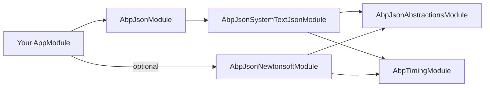

ABP Framework abstracts JSON serialization behind a tiny `IJsonSerializer` so application code, caching layers, distributed-event payloads and HTTP clients all converge on one configuration point. This page covers the abstraction, the global `AbpJsonOptions`, the System.Text.Json provider with its custom converters and type-info modifiers, and the optional Newtonsoft module that drops in via `[Dependency(ReplaceServices = true)]`.

## IJsonSerializer

The contract in `framework/src/Volo.Abp.Json.Abstractions/Volo/Abp/Json/IJsonSerializer.cs` is intentionally tiny:

```csharp IJsonSerializer.cs
public interface IJsonSerializer
{
    string Serialize(object obj, bool camelCase = true, bool indented = false);
    T Deserialize<T>(string jsonString, bool camelCase = true);
    object Deserialize(Type type, string jsonString, bool camelCase = true);
}
```

`camelCase` is the most-used parameter — System.Text.Json's web defaults are camelCase, but ABP keeps a per-call switch because internal payloads (distributed events, settings JSON) sometimes need PascalCase to match an external schema.

## AbpJsonOptions — provider-agnostic dial

`framework/src/Volo.Abp.Json.Abstractions/Volo/Abp/Json/AbpJsonOptions.cs` carries the small set of cross-cutting options every provider should respect:

```csharp AbpJsonOptions.cs
public class AbpJsonOptions
{
    public List<string> InputDateTimeFormats { get; set; }
    public string? OutputDateTimeFormat { get; set; }

    public AbpJsonOptions()
    {
        InputDateTimeFormats = new List<string>();
    }
}
```

`InputDateTimeFormats` is the list of accepted formats when **parsing** dates; `OutputDateTimeFormat` is the canonical format used when **writing**. Both feed into `AbpDateTimeConverter` so System.Text.Json and Newtonsoft round-trip dates identically.

`AbpJsonModule` in `framework/src/Volo.Abp.Json/Volo/Abp/Json/AbpJsonModule.cs` is just a façade that depends on `AbpJsonSystemTextJsonModule`:

```csharp AbpJsonModule.cs
[DependsOn(typeof(AbpJsonSystemTextJsonModule))]
public class AbpJsonModule : AbpModule { }
```

In other words: depend on `AbpJsonModule` to get the default System.Text.Json provider; depend additionally on `AbpJsonNewtonsoftModule` if you also need Newtonsoft.

## System.Text.Json provider

`AbpSystemTextJsonSerializer` (in `framework/src/Volo.Abp.Json.SystemTextJson/Volo/Abp/Json/SystemTextJson/AbpSystemTextJsonSerializer.cs`) wraps `System.Text.Json` with a cached options factory:

```csharp AbpSystemTextJsonSerializer.cs
public class AbpSystemTextJsonSerializer : IJsonSerializer, ITransientDependency
{
    protected AbpSystemTextJsonSerializerOptions Options { get; }

    public string Serialize(object obj, bool camelCase = true, bool indented = false)
        => JsonSerializer.Serialize(obj, CreateJsonSerializerOptions(camelCase, indented));

    public T Deserialize<T>(string jsonString, bool camelCase = true)
        => JsonSerializer.Deserialize<T>(jsonString, CreateJsonSerializerOptions(camelCase))!;

    public object Deserialize(Type type, string jsonString, bool camelCase = true)
        => JsonSerializer.Deserialize(jsonString, type, CreateJsonSerializerOptions(camelCase))!;

    private static readonly ConcurrentDictionary<object, JsonSerializerOptions> JsonSerializerOptionsCache = new();

    protected virtual JsonSerializerOptions CreateJsonSerializerOptions(bool camelCase = true, bool indented = false)
    {
        return JsonSerializerOptionsCache.GetOrAdd(new
        {
            camelCase, indented, Options.JsonSerializerOptions
        }, _ => new JsonSerializerOptions(Options.JsonSerializerOptions)
        {
            PropertyNamingPolicy = camelCase ? JsonNamingPolicy.CamelCase : null,
            WriteIndented = indented
        });
    }
}
```

The cache key includes the source options instance so a configuration reload busts the cache automatically.

### AbpSystemTextJsonSerializerOptions

Defaults are intentionally web-friendly but slightly more lenient than `JsonSerializerDefaults.Web`:

```csharp AbpSystemTextJsonSerializerOptions.cs
public class AbpSystemTextJsonSerializerOptions
{
    public JsonSerializerOptions JsonSerializerOptions { get; }

    public AbpSystemTextJsonSerializerOptions()
    {
        JsonSerializerOptions = new JsonSerializerOptions(JsonSerializerDefaults.Web)
        {
            ReadCommentHandling = JsonCommentHandling.Skip,
            AllowTrailingCommas = true
        };
    }
}
```

`AllowTrailingCommas` and `ReadCommentHandling = Skip` matter for human-edited settings/config files.

### Custom converters and modifiers

`AbpJsonSystemTextJsonModule.ConfigureServices` wires the framework's converters and the `AbpDefaultJsonTypeInfoResolver` once at boot:

```csharp AbpJsonSystemTextJsonModule.cs (excerpt)
options.JsonSerializerOptions.Encoder ??= JavaScriptEncoder.UnsafeRelaxedJsonEscaping;

options.JsonSerializerOptions.Converters.Add(new AbpStringToEnumFactory());
options.JsonSerializerOptions.Converters.Add(new AbpStringToBooleanConverter());
options.JsonSerializerOptions.Converters.Add(new AbpStringToGuidConverter());
options.JsonSerializerOptions.Converters.Add(new AbpNullableStringToGuidConverter());
options.JsonSerializerOptions.Converters.Add(new ObjectToInferredTypesConverter());

options.JsonSerializerOptions.TypeInfoResolver = new AbpDefaultJsonTypeInfoResolver(...);

var dateTimeConverter = ...AbpDateTimeConverter.SkipDateTimeNormalization();
options.JsonSerializerOptions.TypeInfoResolver.As<AbpDefaultJsonTypeInfoResolver>()
    .Modifiers.Add(new AbpDateTimeConverterModifier(dateTimeConverter, nullableDateTimeConverter)
        .CreateModifyAction());
```

| Converter | Purpose |
| --- | --- |
| `AbpStringToEnumFactory` | Allows enums to deserialize from either numeric or string name. |
| `AbpStringToBooleanConverter` | Accepts `"true"`/`"false"` strings for bool fields. |
| `AbpStringToGuidConverter` / `AbpNullableStringToGuidConverter` | Same idea for `Guid`. |
| `ObjectToInferredTypesConverter` | Restores numbers/bool when deserialising into `object`. |
| `AbpDateTimeConverter` (modifier) | Centralises date format via `AbpJsonOptions.OutputDateTimeFormat` / `InputDateTimeFormats`. |

`UnsafeRelaxedJsonEscaping` is set by default so non-ASCII characters survive a round trip instead of being escaped as `\uXXXX`.

### Type-info modifiers

`AbpSystemTextJsonSerializerModifiersOptions` (registered alongside) lets modules append `Action<JsonTypeInfo>` modifiers to the `AbpDefaultJsonTypeInfoResolver`. The framework ships three out of the box:

| Modifier | Effect |
| --- | --- |
| `AbpDateTimeConverterModifier` | Routes every `DateTime` property through the converter above. |
| `AbpIgnorePropertiesModifiers` | Honours `[JsonIgnore]`-style framework attributes (audit fields, etc.). |
| `AbpIncludeExtraPropertiesModifiers` | Flattens `IHasExtraProperties.ExtraProperties` into the top-level object. |
| `AbpIncludeNonPublicPropertiesModifiers` | Serializes non-public properties for entity scenarios. |

These run during type-info construction (once per type), so the per-call cost is zero.

## Newtonsoft provider

`Volo.Abp.Json.Newtonsoft` registers `AbpNewtonsoftJsonSerializer` with `[Dependency(ReplaceServices = true)]` so it transparently takes over `IJsonSerializer`:

```csharp AbpNewtonsoftJsonSerializer.cs (excerpt)
[Dependency(ReplaceServices = true)]
public class AbpNewtonsoftJsonSerializer : IJsonSerializer, ITransientDependency
{
    public string Serialize(object obj, bool camelCase = true, bool indented = false)
        => JsonConvert.SerializeObject(obj, CreateJsonSerializerOptions(camelCase, indented));

    public T Deserialize<T>(string jsonString, bool camelCase = true)
        => JsonConvert.DeserializeObject<T>(jsonString, CreateJsonSerializerOptions(camelCase))!;
}
```

`CreateJsonSerializerOptions` deep-copies `AbpNewtonsoftJsonSerializerOptions.JsonSerializerSettings` for every (camelCase × indented) combination and swaps the contract resolver to `AbpDefaultContractResolver` when `camelCase: false` so PascalCase serialization respects the framework's date-time converter:

```csharp
if (!camelCase)
{
    settings.ContractResolver = new AbpDefaultContractResolver(
        RootServiceProvider.GetRequiredService<AbpDateTimeConverter>()
            .SkipDateTimeNormalization());
}
if (indented)
    settings.Formatting = Formatting.Indented;
```

### When to use Newtonsoft

System.Text.Json is the default and matches ASP.NET Core's MVC defaults. Reach for Newtonsoft when you need:

- `[JsonConstructor]` / `JsonPath` / `LINQ to JSON` features that STJ does not (or did not historically) support.
- `Newtonsoft.Json.Schema` validation.
- Compatibility with an existing public schema serialised by `Newtonsoft.Json`.

Adding `[DependsOn(typeof(AbpJsonNewtonsoftModule))]` is enough — every consumer of `IJsonSerializer` automatically switches.

## Module dependencies



Both providers depend on `AbpTimingModule` because `AbpDateTimeConverter` needs the `IClock`/`AbpClockOptions` to honour `DateTimeKind` round-tripping.

## Coding patterns

```csharp
public class WebhookSender
{
    private readonly IJsonSerializer _json;
    public WebhookSender(IJsonSerializer json) => _json = json;

    public string ToPayload(EventDto evt)
        => _json.Serialize(evt, camelCase: true);

    public EventDto FromPayload(string body)
        => _json.Deserialize<EventDto>(body);
}
```

For storing JSON in caches:

```csharp
var json = _serializer.Serialize(value, camelCase: false);   // PascalCase for legacy schema
var cached = _serializer.Deserialize<MyCacheItem>(json, false);
```

## Configuring the System.Text.Json provider

You can add converters or change options without leaving ABP's options pipeline:

```csharp
Configure<AbpSystemTextJsonSerializerOptions>(options =>
{
    options.JsonSerializerOptions.WriteIndented = true;
    options.JsonSerializerOptions.Converters.Add(new MyDomainSpecificConverter());
});

Configure<AbpJsonOptions>(o =>
{
    o.OutputDateTimeFormat = "yyyy-MM-dd HH:mm:ssZ";
    o.InputDateTimeFormats.Add("yyyy-MM-ddTHH:mm:sszzz");
});
```

`AbpSystemTextJsonSerializerModifiersOptions` lets you add a custom modifier:

```csharp
Configure<AbpSystemTextJsonSerializerModifiersOptions>(o =>
{
    o.Modifiers.Add(typeInfo => { /* mutate JsonTypeInfo */ });
});
```

## Cheat sheet

| Concern | API |
| --- | --- |
| Get serializer | Inject `IJsonSerializer`. |
| Add a converter | `Configure<AbpSystemTextJsonSerializerOptions>(o => o.JsonSerializerOptions.Converters.Add(...));` |
| Force PascalCase per call | `_json.Serialize(obj, camelCase: false)` |
| Pretty print | `_json.Serialize(obj, indented: true)` |
| Use Newtonsoft globally | `[DependsOn(typeof(AbpJsonNewtonsoftModule))]` |
| Change date format | `Configure<AbpJsonOptions>(o => o.OutputDateTimeFormat = "...")` |

## See also

- [/infrastructure/overview](/infrastructure/overview)
- [/infrastructure/timing](/infrastructure/timing) — `AbpDateTimeConverter` reads `AbpClockOptions.Kind`.
- [/infrastructure/event-bus-distributed](/infrastructure/event-bus-distributed) — distributed events use `IJsonSerializer`.
- [/infrastructure/caching](/infrastructure/caching) — `IDistributedCache<T>` wraps `IJsonSerializer` to round-trip values.
- [/ddd/object-extending](/ddd/object-extending) — `AbpIncludeExtraPropertiesModifiers` exposes `ExtraProperties` in JSON.
