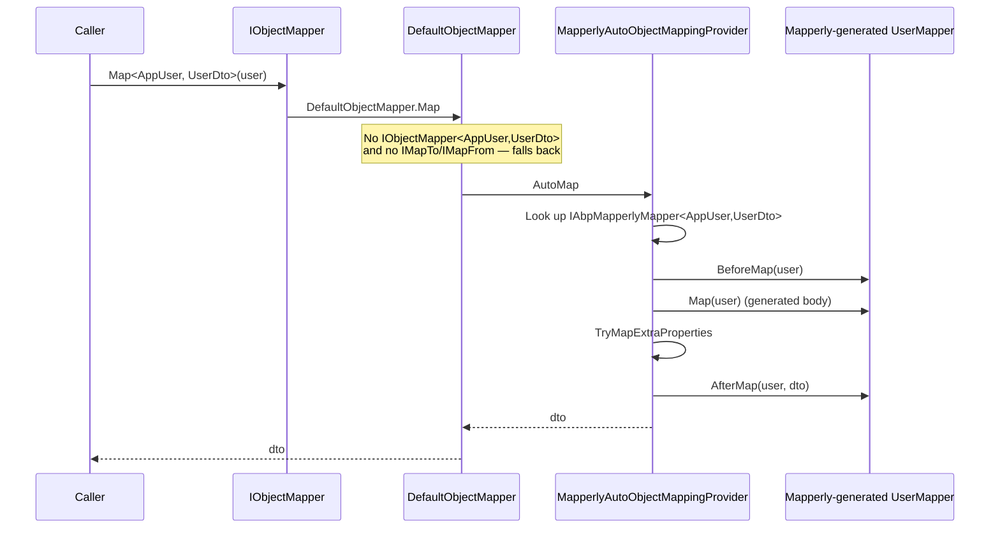

`Volo.Abp.Mapperly` plugs the source-generator-driven [Mapperly](https://mapperly.riok.app/) library into ABP's `IObjectMapper` abstraction. Instead of inferring maps at runtime like AutoMapper, Mapperly emits straight C# code at compile time — no reflection, no allocations per call, and AOT-safe. This page covers `IAbpMapperlyMapper<,>`, `MapperBase<TSource,TDestination>`, the reverse-mapper variants, conventional registration through `AbpMapperlyConventionalRegistrar`, the `MapExtraPropertiesAttribute`, and how `MapperlyAutoObjectMappingProvider` slots into ABP's existing `IAutoObjectMappingProvider` plug point.

## Why Mapperly?

| Property | AutoMapper | Mapperly |
| --- | --- | --- |
| Configuration | Runtime profiles | Compile-time partial classes |
| Performance | Reflection / `Expression.Compile` | Plain method calls |
| AOT | Limited | Fully AOT-safe |
| Validation | Optional at boot | Compiler errors in CI |
| Trade-off | Convention-heavy, flexible | Slightly more boilerplate |

Both engines plug into the same `IObjectMapper` — application code is identical. The difference is what happens inside `IAutoObjectMappingProvider.Map<TSource, TDestination>`.

## IAbpMapperlyMapper

The contract in `framework/src/Volo.Abp.Mapperly/Volo/Abp/Mapperly/IAbpMapperlyMapper.cs` is the Mapperly counterpart to `IObjectMapper<TSource, TDestination>`:

```csharp IAbpMapperlyMapper.cs
public interface IAbpMapperlyMapper<in TSource, TDestination>
{
    TDestination Map(TSource source);
    void Map(TSource source, TDestination destination);
    void BeforeMap(TSource source);
    void AfterMap(TSource source, TDestination destination);
}

public interface IAbpReverseMapperlyMapper<TSource, TDestination> : IAbpMapperlyMapper<TSource, TDestination>
{
    TSource ReverseMap(TDestination destination);
    void ReverseMap(TDestination destination, TSource source);
    void BeforeReverseMap(TDestination destination);
    void AfterReverseMap(TDestination destination, TSource source);
}
```

`BeforeMap` and `AfterMap` are hooks that wrap the (generated) `Map` call — ABP runs them around extra-property mapping so audit fields can be cleaned up there. `IAbpReverseMapperlyMapper` adds the same shape for destination→source maps.

## MapperBase

`framework/src/Volo.Abp.Mapperly/Volo/Abp/Mapperly/MapperBase.cs` is the abstract base you derive from. It is decorated with `ITransientDependency`, so any concrete derived class is automatically registered:

```csharp MapperBase.cs
public abstract class MapperBase<TSource, TDestination>
    : IAbpMapperlyMapper<TSource, TDestination>, ITransientDependency
{
    public abstract TDestination Map(TSource source);
    public abstract void Map(TSource source, TDestination destination);

    public virtual void BeforeMap(TSource source) { }
    public virtual void AfterMap(TSource source, TDestination destination) { }
}

public abstract class TwoWayMapperBase<TSource, TDestination>
    : MapperBase<TSource, TDestination>, IAbpReverseMapperlyMapper<TSource, TDestination>
{
    public abstract TSource ReverseMap(TDestination destination);
    public abstract void ReverseMap(TDestination destination, TSource source);

    public virtual void BeforeReverseMap(TDestination destination) { }
    public virtual void AfterReverseMap(TDestination destination, TSource source) { }
}
```

A real mapper combines `MapperBase` with Mapperly's `[Mapper]` attribute on a `partial class` so the source generator produces the actual map logic:

```csharp
[Mapper]
public partial class UserMapper : MapperBase<AppUser, UserDto>
{
    public override partial UserDto Map(AppUser source);
    public override partial void Map(AppUser source, UserDto destination);
}
```

The generator inspects the public properties of `AppUser` and `UserDto`, emits the assignments, and your `MapperBase` parent makes the class look like a normal ABP transient service.

For a two-way map:

```csharp
[Mapper]
public partial class UserMapper : TwoWayMapperBase<AppUser, UserDto>
{
    public override partial UserDto Map(AppUser source);
    public override partial void Map(AppUser source, UserDto destination);
    public override partial AppUser ReverseMap(UserDto destination);
    public override partial void ReverseMap(UserDto destination, AppUser source);
}
```

`ReverseMap` is registered against `IAbpReverseMapperlyMapper<AppUser, UserDto>` — the provider resolves the appropriate direction.

## AbpMapperlyConventionalRegistrar

The registrar in `framework/src/Volo.Abp.Mapperly/Volo/Abp/Mapperly/AbpMapperlyConventionalRegistrar.cs` exposes the `IAbpMapperlyMapper<,>` (and reverse) interfaces alongside the concrete type so DI lookups find them:

```csharp AbpMapperlyConventionalRegistrar.cs
public class AbpMapperlyConventionalRegistrar : DefaultConventionalRegistrar
{
    protected override bool IsConventionalRegistrationDisabled(Type type)
    {
        return !type.GetInterfaces().Any(x => x.IsGenericType
                    && typeof(IAbpMapperlyMapper<,>) == x.GetGenericTypeDefinition())
               || base.IsConventionalRegistrationDisabled(type);
    }

    protected override List<Type> GetExposedServiceTypes(Type type)
    {
        var exposedServiceTypes = base.GetExposedServiceTypes(type);
        var mapperlyInterfaces = type.GetInterfaces().Where(x =>
            x.IsGenericType
            && (typeof(IAbpMapperlyMapper<,>) == x.GetGenericTypeDefinition()
                || typeof(IAbpReverseMapperlyMapper<,>) == x.GetGenericTypeDefinition()));
        return exposedServiceTypes
            .Union(mapperlyInterfaces)
            .Distinct()
            .ToList();
    }
}
```

That is what makes the registration work without an explicit `AddTransient<IAbpMapperlyMapper<AppUser, UserDto>, UserMapper>()`.

## AbpMapperlyModule

`AbpMapperlyModule` in `AbpMapperlyModule.cs` wires the registrar and replaces `IAutoObjectMappingProvider` with `MapperlyAutoObjectMappingProvider`:

```csharp AbpMapperlyModule.cs
[DependsOn(
    typeof(AbpObjectMappingModule),
    typeof(AbpObjectExtendingModule),
    typeof(AbpAuditingModule)
)]
public class AbpMapperlyModule : AbpModule
{
    public override void PreConfigureServices(ServiceConfigurationContext context)
    {
        context.Services.AddConventionalRegistrar(new AbpMapperlyConventionalRegistrar());
    }

    public override void ConfigureServices(ServiceConfigurationContext context)
    {
        context.Services.AddMapperlyObjectMapper();
    }
}
```

`AddMapperlyObjectMapper` replaces the auto provider:

```csharp AbpAutoMapperServiceCollectionExtensions.cs
public static IServiceCollection AddMapperlyObjectMapper(this IServiceCollection services)
{
    return services.Replace(
        ServiceDescriptor.Transient<IAutoObjectMappingProvider, MapperlyAutoObjectMappingProvider>());
}

public static IServiceCollection AddMapperlyObjectMapper<TContext>(this IServiceCollection services)
{
    return services.Replace(
        ServiceDescriptor.Transient<IAutoObjectMappingProvider<TContext>,
                                    MapperlyAutoObjectMappingProvider<TContext>>());
}
```

So you can pick AutoMapper for one module and Mapperly for another by mixing the context overload.

## MapperlyAutoObjectMappingProvider

`framework/src/Volo.Abp.Mapperly/Volo/Abp/Mapperly/MapperlyAutoObjectMappingProvider.cs` looks up the right mapper, runs the `Before/After` hooks, and handles extra-property mapping:

```csharp MapperlyAutoObjectMappingProvider.cs (excerpt)
public virtual TDestination Map<TSource, TDestination>(object source)
{
    if (TryToMapCollection<TSource, TDestination>((TSource)source, default, out var collectionResult))
        return collectionResult;

    var mapper = ServiceProvider.GetService<IAbpMapperlyMapper<TSource, TDestination>>();
    if (mapper != null)
    {
        mapper.BeforeMap((TSource)source);
        var destination = mapper.Map((TSource)source);
        TryMapExtraProperties(
            mapper.GetType().GetSingleAttributeOrNull<MapExtraPropertiesAttribute>(),
            (TSource)source, destination, GetExtraProperties(destination));
        mapper.AfterMap((TSource)source, destination);
        return destination;
    }

    var reverseMapper = ServiceProvider.GetService<IAbpReverseMapperlyMapper<TDestination, TSource>>();
    if (reverseMapper != null) { /* same flow with ReverseMap */ }

    throw GetNoMapperFoundException<TSource, TDestination>();
}
```

When neither a direct nor a reverse mapper is found, the provider throws a developer-friendly exception with a "How to fix" section pointing back at `MapperBase` and `TwoWayMapperBase`:

```text
No object mapping was found for the specified source and destination types.

Mapping attempted:
AppUser -> UserDto
MyApp.Users.AppUser -> MyApp.Application.UserDto

How to fix:
Define a mapping class for these types:
   - Use MapperBase<TSource, TDestination> for one-way mapping.
   - Use TwoWayMapperBase<TDestination, TSource> for two-way mapping.
```

Collections are handled the same way as `DefaultObjectMapper` — `TryToMapCollection` looks up the element-pair mapper, rebuilds a `List<T>`/array, and skips the auto path.

## MapExtraPropertiesAttribute

ABP entities can carry an `IHasExtraProperties.ExtraProperties` dictionary. `MapExtraPropertiesAttribute` (in `MapExtraPropertiesAttribute.cs`) lets a Mapperly mapper opt into copying that dictionary alongside the strongly-typed properties:

```csharp MapExtraPropertiesAttribute.cs
[AttributeUsage(AttributeTargets.Class)]
public class MapExtraPropertiesAttribute : Attribute
{
    public MappingPropertyDefinitionChecks DefinitionChecks { get; set; } = MappingPropertyDefinitionChecks.Null;
    public string[]? IgnoredProperties { get; set; }
    public bool MapToRegularProperties { get; set; }
}
```

| Field | Meaning |
| --- | --- |
| `DefinitionChecks` | Which extension-definition checks apply when copying — `Null`, `Exists`, etc. |
| `IgnoredProperties` | Skip specific extra keys (e.g. internal flags). |
| `MapToRegularProperties` | When `true`, an extra-property whose key matches a strongly-typed destination property is written into that property instead of into `ExtraProperties`. |

Apply it to your `MapperBase` derived class:

```csharp
[Mapper]
[MapExtraProperties(MapToRegularProperties = true,
                    IgnoredProperties = new[] { "TempFlag" })]
public partial class UserMapper : MapperBase<AppUser, UserDto>
{
    public override partial UserDto Map(AppUser source);
    public override partial void Map(AppUser source, UserDto destination);
}
```

The provider reads the attribute and calls `TryMapExtraProperties` after the generated `Map` returns, so both layers stay separated and Mapperly's compile-time analysis is unaffected.

## End-to-end flow



## Picking between Mapperly and AutoMapper

| Choose Mapperly when… | Choose AutoMapper when… |
| --- | --- |
| You target AOT or trimming. | You want runtime profile flexibility. |
| You care about per-call allocations. | You depend on `ProjectTo`/LINQ projections. |
| You prefer compile-time errors over runtime ones. | You already have a large profile set and resolvers. |
| You build microservices with strict cold-start budgets. | You compose maps across many modules with `ResolveUsing`. |

Both modules can coexist; just pick which one wins via `AddAutoMapperObjectMapper<MyModule>()` vs `AddMapperlyObjectMapper<MyModule>()` per context.

## Cheat sheet

| Goal | Code |
| --- | --- |
| One-way mapper | `partial class M : MapperBase<TS, TD>` + Mapperly `[Mapper]` |
| Two-way mapper | `partial class M : TwoWayMapperBase<TS, TD>` |
| Per-module mapper | `services.AddMapperlyObjectMapper<MyModule>();` then inject `IObjectMapper<MyModule>`. |
| Extra-property copy | `[MapExtraProperties]` on the mapper class. |
| Hook before/after | Override `BeforeMap` / `AfterMap`. |
| Reverse direction | Use the reverse partial methods or `TwoWayMapperBase`. |

## See also

- [/infrastructure/overview](/infrastructure/overview)
- [/infrastructure/object-mapping](/infrastructure/object-mapping) — abstraction this module plugs into.
- [/infrastructure/automapper-integration](/infrastructure/automapper-integration) — sibling provider.
- [/ddd/object-extending](/ddd/object-extending) — `ExtraProperties` that `MapExtraPropertiesAttribute` copies.
- [/core/dependency-injection](/core/dependency-injection) — how `AbpMapperlyConventionalRegistrar` exposes services.
