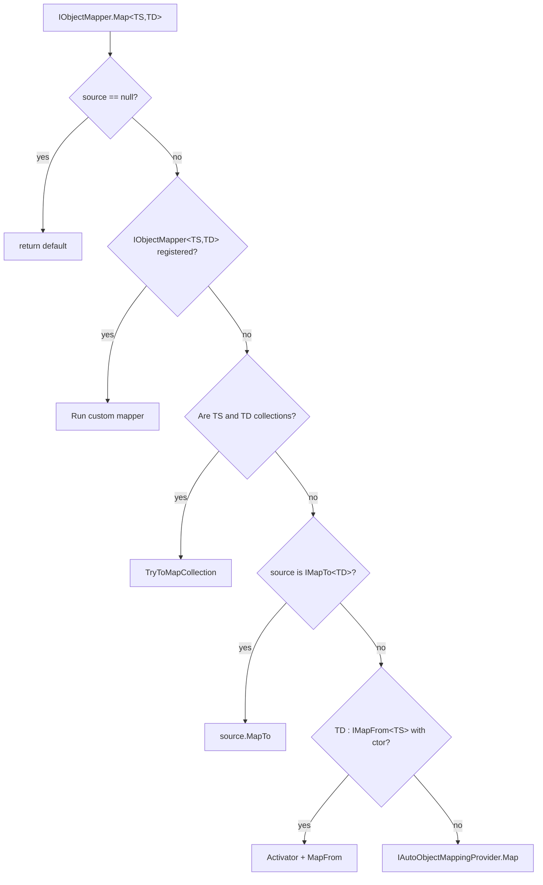

ABP Framework abstracts object-to-object mapping behind a single interface, `IObjectMapper`, so application code never depends on AutoMapper, Mapperly, or hand-written mappers directly. This page covers the abstractions in `Volo.Abp.ObjectMapping`, the `DefaultObjectMapper` orchestration class, the `IMapFrom`/`IMapTo`/`IObjectMapper<TSource,TDestination>` extension points, and how the auto-mapping provider is replaced by AutoMapper or Mapperly modules. For the concrete providers see [/infrastructure/automapper-integration](/infrastructure/automapper-integration) and [/infrastructure/mapperly-integration](/infrastructure/mapperly-integration).

## The IObjectMapper contract

`framework/src/Volo.Abp.ObjectMapping/Volo/Abp/ObjectMapping/IObjectMapper.cs` defines a tiny, lifecycle-friendly surface:

```csharp IObjectMapper.cs
public interface IObjectMapper
{
    IAutoObjectMappingProvider AutoObjectMappingProvider { get; }

    TDestination Map<TSource, TDestination>(TSource source);
    TDestination Map<TSource, TDestination>(TSource source, TDestination destination);
}

public interface IObjectMapper<TContext> : IObjectMapper { }
```

Two overloads, two generic parameters, no DI gymnastics. The generic interface `IObjectMapper<TContext>` is the seam for module-level mapper isolation — for instance, `IObjectMapper<IdentityModule>` resolves a different `IConfigurationProvider` than the host mapper, which keeps profile sets per module.

## Per-pair mappers — IObjectMapper\<TSource, TDestination\>

When the engine cannot do what you need, write a focused mapper:

```csharp IObjectMapper.cs (continued)
public interface IObjectMapper<in TSource, TDestination>
{
    TDestination Map(TSource source);
    TDestination Map(TSource source, TDestination destination);
}
```

Register it like any DI service. ABP's conventional registrar in `AbpObjectMappingModule` automatically exposes any class implementing `IObjectMapper<TSource, TDestination>` under that interface:

```csharp AbpObjectMappingModule.cs
public override void PreConfigureServices(ServiceConfigurationContext context)
{
    context.Services.OnExposing(onServiceExposingContext =>
    {
        onServiceExposingContext.ExposedTypes.AddRange(
            ReflectionHelper.GetImplementedGenericTypes(
                onServiceExposingContext.ImplementationType,
                typeof(IObjectMapper<,>)
            ).ConvertAll(t => new ServiceIdentifier(t)));
    });
}
```

So writing:

```csharp
public class UserToDtoMapper : IObjectMapper<AppUser, UserDto>, ITransientDependency
{
    public UserDto Map(AppUser source) => new() { Id = source.Id, Email = source.Email.ToLower() };
    public UserDto Map(AppUser source, UserDto destination) { destination.Id = source.Id; ...; return destination; }
}
```

is enough — `_objectMapper.Map<AppUser, UserDto>(user)` picks up `UserToDtoMapper` automatically.

## IMapFrom and IMapTo — source/destination knows how

The two convention interfaces in `IMapFrom.cs` / `IMapTo.cs` let a class describe its own mapping:

```csharp IMapTo.cs
public interface IMapTo<TDestination>
{
    TDestination MapTo();
    void MapTo(TDestination destination);
}
```

```csharp IMapFrom.cs
public interface IMapFrom<in TSource>
{
    void MapFrom(TSource source);
}
```

In `DefaultObjectMapper.Map<TSource,TDestination>(source)`, those checks run **after** any per-pair `IObjectMapper<TSource,TDestination>` lookup but **before** falling back to the auto provider:

```csharp DefaultObjectMapper.cs (excerpt)
if (source is IMapTo<TDestination> mapperSource)
    return mapperSource.MapTo();

if (typeof(IMapFrom<TSource>).IsAssignableFrom(typeof(TDestination)))
{
    try
    {
        return (TDestination)Activator.CreateInstance(typeof(TDestination), source)!;
    }
    catch
    {
        // Fall through to auto-map
    }
}

return AutoMap<TSource, TDestination>(source);
```

So a DTO can declare:

```csharp
public class UserDto : IMapFrom<AppUser>
{
    public Guid Id { get; set; }
    public string Email { get; set; } = "";
    public void MapFrom(AppUser source) { Id = source.Id; Email = source.Email; }
}
```

`DefaultObjectMapper` tries to call a one-arg constructor `(TSource source)` first; if that throws, it auto-maps and lets the destination's `MapFrom` override fields afterwards.

## DefaultObjectMapper

`framework/src/Volo.Abp.ObjectMapping/Volo/Abp/ObjectMapping/DefaultObjectMapper.cs` is the orchestrator. The first-line behaviour is:

1. **Null short-circuit** — `null` source returns `default(TDestination)`.
2. **Per-pair lookup** — try `IObjectMapper<TSource, TDestination>` from a fresh scope.
3. **Collection handling** — if `TSource` and `TDestination` are both collection types, map elements with `IObjectMapper<TSourceItem, TDestItem>` and rebuild the collection.
4. **`IMapTo`/`IMapFrom` conventions** — see above.
5. **Auto provider fallback** — call `IAutoObjectMappingProvider.Map<TSource, TDestination>(source)`.

```csharp DefaultObjectMapper.cs (excerpt)
public virtual TDestination Map<TSource, TDestination>(TSource source)
{
    if (source == null) return default!;

    using (var scope = ServiceProvider.CreateScope())
    {
        var specificMapper = scope.ServiceProvider.GetService<IObjectMapper<TSource, TDestination>>();
        if (specificMapper != null) return specificMapper.Map(source);

        if (TryToMapCollection<TSource, TDestination>(scope, source, default, out var collectionResult))
            return collectionResult;
    }

    if (source is IMapTo<TDestination> mapperSource) return mapperSource.MapTo();
    if (typeof(IMapFrom<TSource>).IsAssignableFrom(typeof(TDestination))) { /* ctor attempt */ }

    return AutoMap<TSource, TDestination>(source);
}
```

`TryToMapCollection` handles `List<T>`, `IEnumerable<T>` and arrays. It picks up the matching `IObjectMapper<TSourceItem, TDestItem>` and uses a cached compiled delegate per `(mapperType, withOrWithoutDestination)` so per-element dispatch is allocation-free after the first call.

## IAutoObjectMappingProvider

The fallback path goes through `IAutoObjectMappingProvider`:

```csharp IAutoObjectMappingProvider.cs
public interface IAutoObjectMappingProvider
{
    TDestination Map<TSource, TDestination>(object source);
    TDestination Map<TSource, TDestination>(TSource source, TDestination destination);
}

public interface IAutoObjectMappingProvider<TContext> : IAutoObjectMappingProvider { }
```

When you only depend on `AbpObjectMappingModule`, the registered implementation is `NotImplementedAutoObjectMappingProvider` — calling `Map` for an unknown pair throws a friendly exception that points you at AutoMapper/Mapperly. Adding `AbpAutoMapperModule` (or `AbpMapperlyModule`) replaces it via `IServiceCollection.Replace` so the same code path now works.

## Resolution order



The diagram makes the priority explicit — **named mappers beat conventions, conventions beat the auto provider**.

## Context-scoped mappers

`IObjectMapper<TContext>` lets a module own its own pair of mapper + auto provider so per-module profiles don't leak into the host. `AbpObjectMappingModule` registers the open generic:

```csharp AbpObjectMappingModule.cs
context.Services.AddTransient(
    typeof(IObjectMapper<>),
    typeof(DefaultObjectMapper<>)
);
```

`DefaultObjectMapper<TContext>` inherits from `DefaultObjectMapper` and takes `IAutoObjectMappingProvider<TContext>` so each `TContext` carries its own auto provider. Concrete modules typically pair this with `services.AddAutoMapperObjectMapper<MyModule>()`:

```csharp AbpAutoMapperServiceCollectionExtensions.cs
public static IServiceCollection AddAutoMapperObjectMapper<TContext>(this IServiceCollection services)
{
    return services.Replace(
        ServiceDescriptor.Transient<IAutoObjectMappingProvider<TContext>,
                                    AutoMapperAutoObjectMappingProvider<TContext>>());
}
```

## Calling pattern

```csharp
public class UserAppService : ApplicationService
{
    public async Task<UserDto> GetAsync(Guid id)
    {
        var user = await _repo.GetAsync(id);
        return ObjectMapper.Map<AppUser, UserDto>(user);
    }

    public async Task UpdateAsync(Guid id, UpdateUserDto input)
    {
        var user = await _repo.GetAsync(id);
        ObjectMapper.Map(input, user); // overload that mutates destination
        await _repo.UpdateAsync(user);
    }
}
```

`ApplicationService` (and `DomainService`) expose `ObjectMapper` as a lazy property so you don't have to inject it explicitly.

## Cheat sheet

| Need | API |
| --- | --- |
| Create new DTO | `_mapper.Map<TSource, TDest>(source)` |
| Update existing | `_mapper.Map(source, destination)` |
| Collections | Same call, pass `List<T>` / array. |
| Override one pair | Implement `IObjectMapper<TS, TD>`. |
| Source-side convention | `class TS : IMapTo<TD> { ... }` |
| Destination-side convention | `class TD : IMapFrom<TS> { ... }` |
| Module-local mapper | Inject `IObjectMapper<MyModule>`. |
| Reach raw AutoMapper | `_mapper.GetMapper()` (extension when AutoMapper installed). |

## Provider plug-in points

| Module | Provider class | Notes |
| --- | --- | --- |
| `Volo.Abp.ObjectMapping` (base) | `NotImplementedAutoObjectMappingProvider` | Throws on auto-map; conventions still work. |
| `Volo.Abp.AutoMapper` | `AutoMapperAutoObjectMappingProvider` | Uses `IMapper.Map<TDestination>(source)`. |
| `Volo.Abp.Mapperly` | `MapperlyAutoObjectMappingProvider` | Looks up `IAbpMapperlyMapper<TS,TD>` from DI. |

## See also

- [/infrastructure/overview](/infrastructure/overview)
- [/infrastructure/automapper-integration](/infrastructure/automapper-integration) — `AbpAutoMapperOptions`, profile registration.
- [/infrastructure/mapperly-integration](/infrastructure/mapperly-integration) — `IAbpMapperlyMapper<,>` convention.
- [/ddd/application-services](/ddd/application-services) — `ApplicationService.ObjectMapper` lazy property.
- [/ddd/object-extending](/ddd/object-extending) — extra-property mapping that runs after the auto pass.
