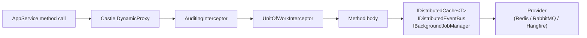
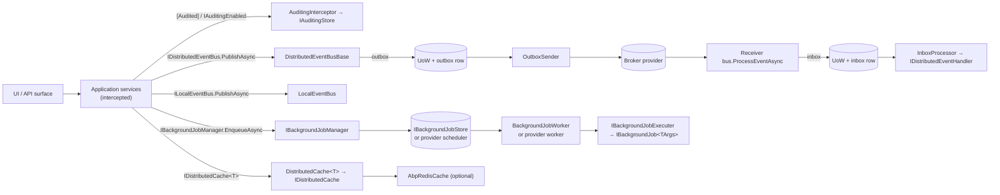

This page is a map of the **ABP Framework infrastructure layer**: the cross‑cutting packages that sit beneath every application service but above the persistence and module systems. The four families covered here — auditing, caching, event bus, and background jobs — are all wired through the same patterns (`AbpModule` boot, `IOptions<>` configuration, interceptor/interface contracts) but each ships several concrete provider packages so consuming applications can swap implementations without touching domain code. This overview lists those packages, the contract types they implement, and the swap‑points between abstractions and providers.

## Package families

The four infrastructure families live under `framework/src/` and each pairs an abstractions assembly (or `.Contracts` sibling) with a default implementation and one or more provider packages:

| Family | Abstractions | Default impl | Provider packages |
| --- | --- | --- | --- |
| Auditing | `Volo.Abp.Auditing.Contracts` | `Volo.Abp.Auditing` (`SimpleLogAuditingStore`) | EF Core / MongoDB stores ship with the **Audit Logging module** |
| Caching | `Volo.Abp.Caching` (`IDistributedCache<T>`) | `DistributedCache<T>` over `Microsoft.Extensions.Caching.Distributed` | `Volo.Abp.Caching.StackExchangeRedis` |
| Event bus | `Volo.Abp.EventBus.Abstractions` | `Volo.Abp.EventBus` (`LocalEventBus`, `LocalDistributedEventBus`) | RabbitMQ, Kafka, Azure Service Bus, Rebus, Dapr |
| Background jobs | `Volo.Abp.BackgroundJobs.Abstractions` | `Volo.Abp.BackgroundJobs` (`DefaultBackgroundJobManager` + `BackgroundJobWorker`) | Hangfire, Quartz, RabbitMQ, TickerQ |

Every provider is registered with `[Dependency(ReplaceServices = true)]` so adding the provider's `AbpModule` to your dependency graph atomically swaps the default. Auditing additionally requires a real `IAuditingStore` — the included `SimpleLogAuditingStore` only writes to `ILogger`.

## Module dependency diagram

```mermaid
flowchart TB
    subgraph ABS["Abstractions"]
        AUDIT_ABS["Volo.Abp.Auditing.Contracts<br/>[Audited] / [DisableAuditing]"]
        EB_ABS["Volo.Abp.EventBus.Abstractions<br/>IEventBus, IDistributedEventBus"]
        BJ_ABS["Volo.Abp.BackgroundJobs.Abstractions<br/>IBackgroundJobManager"]
        CACHE_ABS["Microsoft.Extensions.Caching.Distributed<br/>IDistributedCache"]
    end

    subgraph DEFAULT["Default in-process"]
        AUDIT["Volo.Abp.Auditing<br/>AuditingInterceptor, AuditingManager"]
        EB["Volo.Abp.EventBus<br/>LocalEventBus, LocalDistributedEventBus"]
        BJ["Volo.Abp.BackgroundJobs<br/>DefaultBackgroundJobManager, BackgroundJobWorker"]
        CACHE["Volo.Abp.Caching<br/>DistributedCache&lt;T&gt;, key normalization"]
    end

    subgraph PROVIDERS["Replaceable providers"]
        REDIS["Volo.Abp.Caching.StackExchangeRedis"]
        RABBIT_EB["Volo.Abp.EventBus.RabbitMQ"]
        KAFKA_EB["Volo.Abp.EventBus.Kafka"]
        AZURE_EB["Volo.Abp.EventBus.Azure"]
        REBUS_EB["Volo.Abp.EventBus.Rebus"]
        DAPR_EB["Volo.Abp.EventBus.Dapr"]
        HANG["Volo.Abp.BackgroundJobs.HangFire"]
        QUARTZ["Volo.Abp.BackgroundJobs.Quartz"]
        RABBIT_BJ["Volo.Abp.BackgroundJobs.RabbitMQ"]
        TICKER["Volo.Abp.BackgroundJobs.TickerQ"]
    end

    AUDIT_ABS --> AUDIT
    EB_ABS --> EB --> RABBIT_EB
    EB --> KAFKA_EB
    EB --> AZURE_EB
    EB --> REBUS_EB
    EB --> DAPR_EB
    BJ_ABS --> BJ --> HANG
    BJ --> QUARTZ
    BJ --> RABBIT_BJ
    BJ --> TICKER
    CACHE_ABS --> CACHE --> REDIS
```



The diagram shows the **two‑level replacement model**: abstractions sit at the top, default in‑process implementations sit in the middle, and provider modules replace the defaults at the bottom. The middle layer always remains referenceable — `LocalEventBus` is still injected even when RabbitMQ is the distributed bus — so the local fast path co‑exists with the remote provider.

## Auditing

The auditing package is described in detail on [Auditing pipeline](/infrastructure/auditing). It centers on three contracts found in `framework/src/Volo.Abp.Auditing/Volo/Abp/Auditing/`:

- `IAuditingHelper` — builds `AuditLogInfo` and `AuditLogActionInfo` objects from `MethodInfo` and arguments.
- `IAuditingManager` — opens an ambient `IAuditLogScope` per request via `BeginScope()`.
- `IAuditingStore` — persists the resulting `AuditLogInfo`; the default is `SimpleLogAuditingStore` which logs to `ILogger`.

The trigger is `AuditingInterceptor` (`AuditingInterceptor.cs`), an `AbpInterceptor` registered for every service whose type or methods declare `[Audited]` or implement `IAuditingEnabled`. The interceptor opens a scope, lets the wrapped method run, then calls `IAuditLogSaveHandle.SaveAsync()` in `finally`. The full attribute story lives in `Volo.Abp.Auditing.Contracts` (`AuditedAttribute.cs`, `DisableAuditingAttribute.cs`), and the EF/Mongo persistence layer lives in the [Audit Logging module](/modules/audit-logging).

## Caching

The caching subsystem covered in [Distributed caching](/infrastructure/caching) is a typed wrapper over the standard `Microsoft.Extensions.Caching.Distributed.IDistributedCache` interface. The key surface is `IDistributedCache<TCacheItem>` and the two‑generic variant `IDistributedCache<TCacheItem, TCacheKey>` in `framework/src/Volo.Abp.Caching/Volo/Abp/Caching/IDistributedCache.cs`. Implementations live alongside in `DistributedCache.cs`, key normalization in `DistributedCacheKeyNormalizer.cs`, and tenant‑aware prefixing in `DistributedCacheKeyNormalizeArgs.cs`.

The Redis provider in `Volo.Abp.Caching.StackExchangeRedis` replaces the default `IDistributedCache` with `AbpRedisCache` — see [Redis caching](/infrastructure/caching-redis) — and adds bulk `GetMany` / `SetMany` operations through `ICacheSupportsMultipleItems`. A separate **hybrid** wrapper (`Hybrid/AbpHybridCache.cs`) layers `Microsoft.Extensions.Caching.Hybrid` on top of the distributed store for L1/L2 caching.

## Event bus

The event bus has two contracts and many providers. Both contracts live in `framework/src/Volo.Abp.EventBus.Abstractions/`:

- `ILocalEventBus` (`Volo/Abp/EventBus/Local/ILocalEventBus.cs`) — in‑process pub/sub keyed by event CLR type.
- `IDistributedEventBus` (`Volo/Abp/EventBus/Distributed/IDistributedEventBus.cs`) — same shape, plus `useOutbox` and `onUnitOfWorkComplete` flags for transactional publishing.

The default implementations are in `framework/src/Volo.Abp.EventBus/`:

- `LocalEventBus` — singleton, holds a `ConcurrentDictionary<Type, List<IEventHandlerFactory>>`. See [Local event bus](/infrastructure/event-bus-local).
- `LocalDistributedEventBus` — when no real broker is registered, distributed events are routed in‑process. See [Distributed event bus](/infrastructure/event-bus-distributed).
- `DistributedEventBusBase` — common base for every broker provider, with outbox/inbox plumbing through `IEventOutbox`, `IEventInbox`, `OutboxConfig`, and `InboxConfig`.

The provider packages each ship one `DistributedEventBusBase` subclass and one options class:

| Package | Bus class | Options |
| --- | --- | --- |
| `Volo.Abp.EventBus.RabbitMQ` | `RabbitMqDistributedEventBus` | `AbpRabbitMqEventBusOptions` |
| `Volo.Abp.EventBus.Kafka` | `KafkaDistributedEventBus` | `AbpKafkaEventBusOptions` |
| `Volo.Abp.EventBus.Azure` | `AzureDistributedEventBus` | `AbpAzureEventBusOptions` |
| `Volo.Abp.EventBus.Rebus` | `RebusDistributedEventBus` | `AbpRebusEventBusOptions` |
| `Volo.Abp.EventBus.Dapr` | `DaprDistributedEventBus` | `AbpDaprEventBusOptions` |

The end‑to‑end publish/handle path including unit‑of‑work integration is documented in the [Event publish and handle flow](/flows/event-publish-and-handle).

## Background jobs

The background job stack has the simplest contract — `IBackgroundJobManager` with a single `EnqueueAsync<TArgs>` method — but the most provider variety. The contract and default implementation live in:

- `framework/src/Volo.Abp.BackgroundJobs.Abstractions/Volo/Abp/BackgroundJobs/IBackgroundJobManager.cs`
- `framework/src/Volo.Abp.BackgroundJobs/Volo/Abp/BackgroundJobs/DefaultBackgroundJobManager.cs`

The default writes a `BackgroundJobInfo` row through `IBackgroundJobStore`, and `BackgroundJobWorker` (an `AsyncPeriodicBackgroundWorkerBase`) polls that store under a distributed lock. The provider packages bypass this store entirely and delegate to the underlying scheduler:

| Package | Manager | Replaces store with |
| --- | --- | --- |
| `Volo.Abp.BackgroundJobs.HangFire` | `HangfireBackgroundJobManager` | Hangfire's `BackgroundJob.Enqueue` / `Schedule` |
| `Volo.Abp.BackgroundJobs.Quartz` | `QuartzBackgroundJobManager` | Quartz `IScheduler.ScheduleJob` |
| `Volo.Abp.BackgroundJobs.RabbitMQ` | `RabbitMqBackgroundJobManager` | `IJobQueue<TArgs>` over RabbitMQ exchanges |
| `Volo.Abp.BackgroundJobs.TickerQ` | `AbpTickerQBackgroundJobManager` | `ITimeTickerManager<TimeTickerEntity>` |

Job execution lifecycle, retry/back‑off, and worker semantics are covered in [Background job execution flow](/flows/background-job-execution); the persistent‑store EF/Mongo side of the default manager is the [Background Jobs module](/modules/background-jobs-module).

## Cross‑cutting wiring

All four infrastructure families plug into ABP's interception pipeline (`AuditingInterceptor`) or its module/options system (`AbpAuditingOptions`, `AbpDistributedCacheOptions`, `AbpDistributedEventBusOptions`, `AbpBackgroundJobOptions`). The interceptor mechanics are described under [Dynamic proxy and interceptors](/core/dynamic-proxy-and-interceptors), and the unit‑of‑work transactional events that the distributed bus relies on are detailed in [Unit of Work](/data/unit-of-work).



The same `IServiceScopeFactory` that gives the interceptor its dependencies also seeds the `JobExecutionContext` used by `BackgroundJobWorker` — every infrastructure component opens a child scope rather than depending on the ambient request scope, which keeps long‑running background work isolated from per‑request services.

## Module dependency cheat‑sheet

The `[DependsOn(...)]` declarations across the infrastructure families form the following graph (one row per `AbpModule`):

| Module | `DependsOn` |
| --- | --- |
| `AbpAuditingModule` | `AbpAuditingContractsModule`, `AbpDataModule`, `AbpJsonModule`, `AbpMultiTenancyModule` |
| `AbpCachingModule` | `AbpThreadingModule`, `AbpSerializationModule`, `AbpUnitOfWorkModule`, `AbpMultiTenancyModule`, `AbpJsonModule` |
| `AbpCachingStackExchangeRedisModule` | `AbpCachingModule` |
| `AbpEventBusModule` | `AbpEventBusAbstractionsModule`, `AbpMultiTenancyModule`, `AbpUnitOfWorkModule`, `AbpGuidsModule`, `AbpTimingModule`, `AbpTracingModule` |
| `AbpEventBusRabbitMqModule` | `AbpEventBusModule`, `AbpRabbitMqModule` |
| `AbpEventBusKafkaModule` | `AbpEventBusModule`, `AbpKafkaModule` |
| `AbpEventBusAzureModule` | `AbpEventBusModule`, `AbpAzureServiceBusModule` |
| `AbpEventBusRebusModule` | `AbpEventBusModule` |
| `AbpEventBusDaprModule` | `AbpEventBusModule`, `AbpDaprModule` |
| `AbpBackgroundJobsModule` | `AbpBackgroundJobsAbstractionsModule`, `AbpBackgroundWorkersModule`, `AbpTimingModule`, `AbpGuidsModule`, `AbpDistributedLockingAbstractionsModule`, `AbpMultiTenancyModule` |
| `AbpBackgroundJobsHangfireModule` | `AbpBackgroundJobsAbstractionsModule`, `AbpHangfireModule` |
| `AbpBackgroundJobsQuartzModule` | `AbpBackgroundJobsAbstractionsModule`, `AbpQuartzModule` |
| `AbpBackgroundJobsRabbitMqModule` | `AbpBackgroundJobsAbstractionsModule`, `AbpRabbitMqModule`, `AbpThreadingModule` |
| `AbpBackgroundJobsTickerQModule` | `AbpBackgroundJobsAbstractionsModule`, `AbpTickerQModule` |

The pattern is clear: every concrete provider depends on its family's abstractions plus the transport library's module (e.g., `AbpRabbitMqModule` for both RabbitMQ‑backed event bus and RabbitMQ‑backed jobs). The transport modules own connection / channel pools and serializer registration; the family modules own publish/handler dispatching.

## Tenancy

Every infrastructure component is tenant‑aware. `DistributedCacheKeyNormalizer` prefixes keys with `t:<TenantId>` when `ICurrentTenant.Id.HasValue`; `LocalEventBus` and `DistributedEventBusBase` capture the tenant through `IEventDataMayHaveTenantId` and re‑enter the tenant scope on the receiver side; `BackgroundJobInfo` carries no explicit tenant column but the job args type can implement the same interface. The tenant resolution mechanics behind these checks are documented in [Multi‑tenancy](/multi-tenancy/overview).

## Replacement model in detail

Every provider follows one of two registration shapes:

```csharp
// Pattern A: provider entirely replaces the abstraction implementation.
//   used by: AbpRedisCache, HangfireBackgroundJobManager, QuartzBackgroundJobManager,
//            RabbitMqBackgroundJobManager, AbpTickerQBackgroundJobManager,
//            RabbitMqDistributedEventBus, KafkaDistributedEventBus,
//            AzureDistributedEventBus, RebusDistributedEventBus, DaprDistributedEventBus.
[Dependency(ReplaceServices = true)]
[ExposeServices(typeof(IDistributedEventBus), typeof(RabbitMqDistributedEventBus))]
public class RabbitMqDistributedEventBus : DistributedEventBusBase { /* … */ }

// Pattern B: provider registers with TryRegister so a Pattern-A provider can supersede it.
//   used by: SimpleLogAuditingStore, LocalDistributedEventBus, NullBackgroundJobManager.
[Dependency(TryRegister = true)]
public class SimpleLogAuditingStore : IAuditingStore, ISingletonDependency { /* … */ }
```

Pattern A means "I am the answer." Pattern B means "I am the fallback unless someone else claims this contract." The combination is what makes the default in‑process stack work the moment a starter template is created, and graduate cleanly to broker‑backed or hosted services later without touching domain code.

## Configuration sources at a glance

| Family | Options class | Bound by default to | Where |
| --- | --- | --- | --- |
| Auditing | `AbpAuditingOptions` | none — set in code | [Auditing](/infrastructure/auditing) |
| Caching | `AbpDistributedCacheOptions`, `RedisCacheOptions` | `Redis:Configuration` (Redis) | [Caching](/infrastructure/caching) · [Redis caching](/infrastructure/caching-redis) |
| Caching (hybrid) | `AbpHybridCacheOptions` | none — set in code | [Caching](/infrastructure/caching) |
| Event bus local | `AbpLocalEventBusOptions` | none — set in code | [Local event bus](/infrastructure/event-bus-local) |
| Event bus base | `AbpDistributedEventBusOptions`, `AbpEventBusBoxesOptions` | none — set in code | [Distributed event bus](/infrastructure/event-bus-distributed) |
| Event bus RabbitMQ | `AbpRabbitMqEventBusOptions` | `RabbitMQ:EventBus` | [RabbitMQ](/infrastructure/event-bus-rabbitmq) |
| Event bus Kafka | `AbpKafkaEventBusOptions` | `Kafka:EventBus` | [Kafka](/infrastructure/event-bus-kafka) |
| Event bus Azure SB | `AbpAzureEventBusOptions` | `Azure:EventBus` | [Azure SB](/infrastructure/event-bus-azure) |
| Event bus Rebus | `AbpRebusEventBusOptions` | none (Configurer delegate) | [Rebus](/infrastructure/event-bus-rebus) |
| Event bus Dapr | `AbpDaprEventBusOptions` | none — set in code | [Dapr](/infrastructure/event-bus-dapr) |
| Background jobs core | `AbpBackgroundJobOptions`, `AbpBackgroundJobWorkerOptions` | none — set in code | [Background jobs](/infrastructure/background-jobs) |
| Background jobs Hangfire | `AbpHangfireOptions` | none — set in code | [Hangfire](/infrastructure/background-jobs-hangfire) |
| Background jobs Quartz | `AbpBackgroundJobQuartzOptions` | none — set in code | [Quartz](/infrastructure/background-jobs-quartz) |
| Background jobs RabbitMQ | `AbpRabbitMqBackgroundJobOptions` | none — set in code | [RabbitMQ jobs](/infrastructure/background-jobs-rabbitmq) |
| Background jobs TickerQ | `AbpBackgroundJobsTickerQOptions` | none — set in code | [TickerQ](/infrastructure/background-jobs-tickerq) |

`Configure<TOptions>(IConfiguration.GetSection(...))` is the standard way modules connect `appsettings.json` to these classes; the few "bound by default" rows above are wired by the provider module itself so the host does not need to repeat the call.

## Provider replacement table

The provider modules use a uniform recipe — implement a contract, decorate with `[Dependency(ReplaceServices = true)]`, optionally call `Initialize()` from `OnApplicationInitialization`. The table below maps abstraction → default → provider for the entire section:

| Abstraction | Default | Replaceable by |
| --- | --- | --- |
| `IDistributedCache` (BCL) | `MemoryDistributedCache` (via `AddDistributedMemoryCache`) | `AbpRedisCache` |
| `IDistributedCache<T>` | `DistributedCache<T>` | not replaced — wraps `IDistributedCache` |
| `IHybridCache<T>` | `AbpHybridCache<T>` | not replaced — wraps `HybridCache` |
| `IAuditingStore` | `SimpleLogAuditingStore` | `Volo.Abp.AuditLogging.EntityFrameworkCore.EfCoreAuditLogRepository`-backed store |
| `IAuditingHelper` | `AuditingHelper` | rarely replaced |
| `IAuditingManager` | `AuditingManager` | rarely replaced |
| `ILocalEventBus` | `LocalEventBus` | never replaced (always in‑process) |
| `IDistributedEventBus` | `LocalDistributedEventBus` (`TryRegister`) | `RabbitMqDistributedEventBus` · `KafkaDistributedEventBus` · `AzureDistributedEventBus` · `RebusDistributedEventBus` · `DaprDistributedEventBus` |
| `IEventOutbox` | not registered by default | EF / Mongo via `OutboxConfig.UseDbContext<T>()` |
| `IEventInbox` | not registered by default | EF / Mongo via `InboxConfig.UseDbContext<T>()` |
| `IBackgroundJobManager` | `DefaultBackgroundJobManager` | `HangfireBackgroundJobManager` · `QuartzBackgroundJobManager` · `RabbitMqBackgroundJobManager` · `AbpTickerQBackgroundJobManager` |
| `IBackgroundJobStore` | `InMemoryBackgroundJobStore` | EF / Mongo store (in [Background Jobs module](/modules/background-jobs-module)) |
| `IBackgroundJobExecuter` | `BackgroundJobExecuter` | rarely replaced |
| `IBackgroundJobSerializer` | `JsonBackgroundJobSerializer` | rarely replaced |
| `IBackgroundJobWorker` | `BackgroundJobWorker` | turned off when a non‑default manager replaces the manager |
| `IUnitOfWorkEventPublisher` | `UnitOfWorkEventPublisher` | rarely replaced |
| `IDistributedCacheSerializer` | `Utf8JsonDistributedCacheSerializer` | swap for MessagePack / Protobuf if needed |
| `IDistributedCacheKeyNormalizer` | `DistributedCacheKeyNormalizer` | override for custom multi‑tenant key schemes |

## Shared dependencies

The four infrastructure families share a small set of cross‑cutting services:

- **`IServiceScopeFactory`** — every interceptor, worker, and event consumer opens a fresh DI scope per unit of work. `AuditingInterceptor.InterceptAsync`, `BackgroundJobWorker.DoWorkAsync`, `HangfireJobExecutionAdapter.ExecuteAsync`, `QuartzJobExecutionAdapter.Execute`, `JobQueue<TArgs>.MessageReceived`, `AzureDistributedEventBus.ProcessEventAsync`, and `DistributedEventBusBase.AddToInboxAsync` all wrap their bodies in `using (var scope = _serviceScopeFactory.CreateScope()) { … }`.
- **`IUnitOfWorkManager`** — both event buses defer publish until `CompleteAsync`; the auditing interceptor flushes the UoW before persisting the log. See [Unit of Work](/data/unit-of-work).
- **`ICurrentTenant`** — caching keys, audit logs, and event bodies all carry tenant identity; `BackgroundJobExecuter` re‑enters tenant scope on the receive side.
- **`ICorrelationIdProvider`** — propagated as the AMQP `CorrelationId`, Kafka `X-Correlation-Id` header, Service Bus `CorrelationId`, Dapr `CorrelationId` slot, and the audit log row.
- **`IGuidGenerator`** + **`IClock`** — `OutgoingEventInfo.Id`, `BackgroundJobInfo.Id`, `TimeTickerEntity.Id`, `AuditLogInfo.ExecutionTime` all flow through these so tests can deterministically substitute them.

## End‑to‑end picture



That single picture captures every page in this section: the interceptor layer feeds auditing; the application code calls into caching, local events, distributed events, and job manager; the distributed event flow takes the outbox→broker→inbox→handler path; the background job flow takes the store→worker→executer path; the cache is a passive infrastructure.

## Failure semantics at a glance

Different infrastructure components have intentionally different failure modes; the table below summarizes them so callers understand which exceptions reach application code.

| Component | When the backing system fails | What the caller sees |
| --- | --- | --- |
| `IAuditingStore.SaveAsync` | `AbpAuditingOptions.HideErrors == true` (default) → swallow + log; otherwise propagate | Method result still returns |
| `IDistributedCache<T>.GetAsync` | `AbpDistributedCacheOptions.HideErrors == true` (default in production) → return `null`; otherwise propagate | Cache miss path runs the factory |
| `ILocalEventBus.PublishAsync` (immediate) | Handler exception → `AggregateException` thrown at publish site | Caller sees exception |
| `ILocalEventBus.PublishAsync` (UoW‑deferred) | Handler exception during `CompleteAsync` | UoW completes with failure |
| `IDistributedEventBus.PublishAsync` (outbox) | Broker down | Caller still returns; sender will retry |
| `IDistributedEventBus.PublishAsync` (direct) | Broker down | Caller sees provider exception |
| `IBackgroundJobManager.EnqueueAsync` | Store / broker down | Caller sees exception |
| `IBackgroundJob.ExecuteAsync` | Job throws | Wrapped in `BackgroundJobExecutionException`; provider decides retry/abandon |

The split between "hide" and "propagate" follows a simple rule: write paths that are *side data* (audit logs, cache writes) hide errors; primary writes (job enqueue, distributed event publish) propagate. Read paths (cache hits) hide errors so a Redis flap does not cascade into a 500 response.

## Where to go next

| If you want to… | Read |
| --- | --- |
| Understand the audit interceptor chain | [Auditing](/infrastructure/auditing) |
| Cache typed items with tenancy | [Distributed caching](/infrastructure/caching) |
| Configure StackExchange.Redis | [Redis caching](/infrastructure/caching-redis) |
| Publish in‑process events | [Local event bus](/infrastructure/event-bus-local) |
| Cross service boundaries with outbox | [Distributed event bus](/infrastructure/event-bus-distributed) |
| Use a specific broker | [RabbitMQ](/infrastructure/event-bus-rabbitmq) · [Kafka](/infrastructure/event-bus-kafka) · [Azure SB](/infrastructure/event-bus-azure) · [Rebus](/infrastructure/event-bus-rebus) · [Dapr](/infrastructure/event-bus-dapr) |
| Enqueue work with retries | [Background jobs](/infrastructure/background-jobs) |
| Pick a job provider | [Hangfire](/infrastructure/background-jobs-hangfire) · [Quartz](/infrastructure/background-jobs-quartz) · [RabbitMQ jobs](/infrastructure/background-jobs-rabbitmq) · [TickerQ](/infrastructure/background-jobs-tickerq) |
| See the full publish flow including the UoW | [Event publish and handle](/flows/event-publish-and-handle) |
| Trace a job from enqueue to finish | [Background job execution flow](/flows/background-job-execution) |
| Understand interceptor registration | [Dynamic proxy and interceptors](/core/dynamic-proxy-and-interceptors) |
| Find audit and job EF/Mongo schema | [Audit Logging module](/modules/audit-logging) · [Background Jobs module](/modules/background-jobs-module) |
| Tenant resolution across all of the above | [Multi‑tenancy](/multi-tenancy/overview) |
