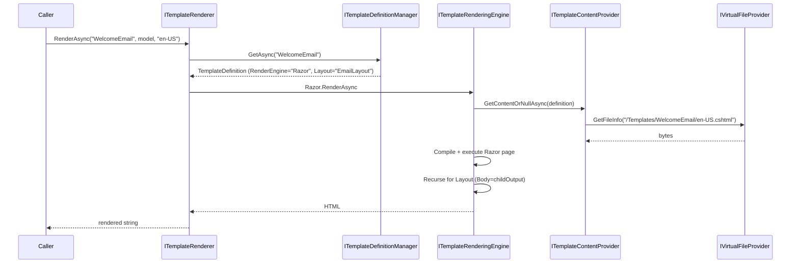

ABP Framework provides a small, engine-agnostic text-templating layer that powers email bodies, notification messages, exported reports, and anywhere else you need to render Markdown/HTML/plain text from a model. This page covers the `ITemplateRenderer` contract, `TemplateDefinition` and its providers, content loading from the [Virtual File System](/infrastructure/virtual-file-system), and how the `Razor` and `Scriban` engines are plugged in.

## Why a templating abstraction?

Each application could just pick Razor or Scriban directly, but ABP standardises four things:

- **Named templates** — code refers to `"WelcomeEmail"`, not a file path.
- **Localisation** — `cultureName`/`CultureHelper.Use` decide which content to load.
- **Layouts** — a template can declare a parent layout that wraps its rendered output.
- **Pluggable engines** — Razor and Scriban share the same renderer entry point.

## ITemplateRenderer

`framework/src/Volo.Abp.TextTemplating.Core/Volo/Abp/TextTemplating/ITemplateRenderer.cs` is the single application-facing API:

```csharp ITemplateRenderer.cs
public interface ITemplateRenderer
{
    Task<string> RenderAsync(
        [NotNull] string templateName,
        object? model = null,
        string? cultureName = null,
        Dictionary<string, object>? globalContext = null
    );
}
```

The default implementation `AbpTemplateRenderer` reads the template's metadata, picks an engine, and dispatches:

```csharp AbpTemplateRenderer.cs (excerpt)
public virtual async Task<string> RenderAsync(string templateName, object? model = null,
    string? cultureName = null, Dictionary<string, object>? globalContext = null)
{
    var templateDefinition = await TemplateDefinitionManager.GetAsync(templateName);
    var renderEngine = templateDefinition.RenderEngine;

    if (renderEngine.IsNullOrWhiteSpace())
        renderEngine = Options.DefaultRenderingEngine;

    var providerType = Options.RenderingEngines.GetOrDefault(renderEngine!);

    if (providerType != null && typeof(ITemplateRenderingEngine).IsAssignableFrom(providerType))
    {
        using (var scope = ServiceScopeFactory.CreateScope())
        {
            var engine = (ITemplateRenderingEngine)scope.ServiceProvider.GetRequiredService(providerType);
            return await engine.RenderAsync(templateName, model, cultureName, globalContext);
        }
    }

    throw new AbpException("There is no rendering engine found with template name: " + templateName);
}
```

`AbpTextTemplatingOptions.RenderingEngines` is a `Dictionary<string, Type>` filled by each engine module — `"Razor" → typeof(RazorTemplateRenderingEngine)`, `"Scriban" → typeof(ScribanTemplateRenderingEngine)`. `DefaultRenderingEngine` is the fallback when a definition has no explicit `RenderEngine`.

## TemplateDefinition

`framework/src/Volo.Abp.TextTemplating.Core/Volo/Abp/TextTemplating/TemplateDefinition.cs` is the metadata record:

```csharp TemplateDefinition.cs (excerpt)
public class TemplateDefinition : IHasNameWithLocalizableDisplayName
{
    public const int MaxNameLength = 128;
    public string Name { get; }
    public ILocalizableString DisplayName { get; set; }
    public bool IsLayout { get; }
    public string? Layout { get; set; }
    public string? LocalizationResourceName { get; set; }
    public bool IsInlineLocalized { get; set; }
    public string? DefaultCultureName { get; }
    public string? RenderEngine { get; set; }
    public Dictionary<string, object?> Properties { get; }

    public TemplateDefinition(string name, Type localizationResource,
        ILocalizableString? displayName = null, bool isLayout = false,
        string? layout = null, string? defaultCultureName = null) { ... }
}
```

Notable fields:

| Field | Purpose |
| --- | --- |
| `Name` | Unique key consumed by `RenderAsync`. |
| `IsLayout` | When `true`, the template is treated as a wrapper for other templates. |
| `Layout` | Name of a layout template whose body is set to the child's rendered output. |
| `LocalizationResourceName` | Used by the Razor engine to build a string localizer for `Localizer["Key"]` calls. |
| `IsInlineLocalized` | Switches between resource-file localization and per-culture file content. |
| `RenderEngine` | `"Razor"`, `"Scriban"`, or another registered engine name. |
| `Properties` | Free-form bag — providers commonly stash content paths or virtual-file roots here. |

Two fluent helpers chain nicely:

```csharp
new TemplateDefinition("WelcomeEmail", typeof(MyAppResource))
    .WithRenderEngine(RazorTemplateRenderingEngine.EngineName)
    .WithProperty("VirtualPath", "/Templates/WelcomeEmail");
```

## ITemplateDefinitionProvider

`ITemplateDefinitionProvider` is how the application contributes definitions:

```csharp ITemplateDefinitionProvider.cs
public interface ITemplateDefinitionProvider
{
    void PreDefine(ITemplateDefinitionContext context);
    void Define(ITemplateDefinitionContext context);
    void PostDefine(ITemplateDefinitionContext context);
}
```

Derive from `TemplateDefinitionProvider` (which implements the interface as `ITransientDependency`) and override `Define`:

```csharp
public class MyEmailTemplateDefinitionProvider : TemplateDefinitionProvider
{
    public override void Define(ITemplateDefinitionContext context)
    {
        context.Add(
            new TemplateDefinition(
                name: "WelcomeEmail",
                localizationResource: typeof(MyAppResource)
            ).WithVirtualFilePath("/Templates/WelcomeEmail", isInlineLocalized: false)
        );
    }
}
```

`AbpTextTemplatingOptions.DefinitionProviders` collects every provider type discovered by the conventional registrar so order is deterministic.

## Template content sources

Definitions only carry metadata. The body — the Razor `.cshtml` or the Scriban `.sbn` text — comes from `ITemplateContentContributor`s. The shipped contributors are:

| Contributor | Source |
| --- | --- |
| `VirtualFileTemplateContentContributor` | `IVirtualFileProvider` paths registered via `WithVirtualFilePath(...)` extension. |
| `IDynamicTemplateDefinitionStore` | Database-backed templates (extensible by modules). |

`TemplateContentProvider.GetContentOrNullAsync` chains them and returns the first non-null body. The Razor and Scriban engines call it before rendering, so dropping a `.sbn` file under `Templates/WelcomeEmail/{culture}.sbn` is enough for a multi-language template.

### Virtual-file folder layout

`VirtualFolderLocalizedTemplateContentReader` reads files named after a culture (`en.cshtml`, `en-US.cshtml`, ...) under the folder path supplied to `WithVirtualFilePath`. It walks fallbacks: `en-US` → `en` → `DefaultCultureName` of the definition. That gives you "best match" localisation for free without writing any selection code.

## Razor engine

`Volo.Abp.TextTemplating.Razor` registers `RazorTemplateRenderingEngine` under the key `"Razor"`:

```csharp RazorTemplateRenderingEngine.cs (excerpt)
public const string EngineName = "Razor";
public override string Name => EngineName;

public override async Task<string> RenderAsync(string templateName, object? model = null,
    string? cultureName = null, Dictionary<string, object>? globalContext = null)
{
    Check.NotNullOrWhiteSpace(templateName, nameof(templateName));
    globalContext ??= new Dictionary<string, object>();

    if (cultureName == null)
        return await RenderInternalAsync(templateName, null, globalContext, model);

    using (CultureHelper.Use(cultureName))
        return await RenderInternalAsync(templateName, null, globalContext, model);
}
```

The interesting work happens in `RenderTemplateContentWithRazorAsync`. `IAbpCompiledViewProvider` compiles the `.cshtml` template into an assembly (cached forever), then `Activator.CreateInstance` produces an `IRazorTemplatePage` whose `Model`, `Localizer`, `Body`, and `GlobalContext` are injected:

```csharp
var compiledViewProvider = scope.ServiceProvider.GetRequiredService<IAbpCompiledViewProvider>();
var assembly = await compiledViewProvider.GetAssemblyAsync(templateDefinition);
var templateType = assembly.GetType(AbpRazorTemplateConsts.TypeName)!;
var template = (IRazorTemplatePage)Activator.CreateInstance(templateType)!;

template.ServiceProvider = scope.ServiceProvider;
template.Localizer = GetLocalizerOrNull(templateDefinition);
template.Body = body;
template.GlobalContext = globalContext;

await template.ExecuteAsync();
return await template.GetOutputAsync();
```

Authors write the template in standard Razor:

```cshtml
@model AccountConfirmationModel
@inject IStringLocalizer<MyAppResource> L

<h1>@L["Welcome"]</h1>
<p>@L["WelcomeBody", Model.UserName]</p>
<a href="@Model.ConfirmationUrl">@L["Confirm"]</a>
```

`AbpRazorTemplateCSharpCompiler` handles compilation; `AbpCompiledViewProviderOptions` lets you point at additional assemblies whose types should be visible to the compiler (e.g. shared layout helpers).

### Razor layouts

If `TemplateDefinition.Layout` is set, the engine renders the child first, then re-enters `RenderInternalAsync` with the layout name and the child's output as `body`. The layout template accesses it through `template.Body`. Combine `IsLayout = true` on a template with `Layout = "LayoutName"` on its children to compose a master template across many emails.

## Scriban engine

`Volo.Abp.TextTemplating.Scriban` registers `ScribanTemplateRenderingEngine` under the key `"Scriban"`. Scriban is interpreted (no compilation step), so the engine simply reads the raw content, fills a `ScriptObject` with `model` and the `globalContext`, and runs `Template.Parse(...).RenderAsync(...)`:

```csharp ScribanTemplateRenderingEngine.cs (excerpt)
public const string EngineName = "Scriban";

public override async Task<string> RenderAsync(string templateName, object? model = null,
    string? cultureName = null, Dictionary<string, object>? globalContext = null)
{
    Check.NotNullOrWhiteSpace(templateName, nameof(templateName));
    globalContext ??= new Dictionary<string, object>();

    if (cultureName == null)
        return await RenderInternalAsync(templateName, globalContext, model);

    using (CultureHelper.Use(cultureName))
        return await RenderInternalAsync(templateName, globalContext, model);
}
```

When the definition declares a `Layout`, the engine renders the child first, drops the result into `globalContext["content"]`, then renders the layout (Scriban's `{{ content }}` pulls it back in).

`ScribanTemplateLocalizer` lets templates resolve a localized string with `{{ L "Key" }}` — it bridges to ABP's `IStringLocalizer` per the definition's `LocalizationResourceName`.

```sbn
<!-- /Templates/WelcomeEmail/en.sbn -->
<h1>{{ L "Welcome" }}</h1>
<p>Hi {{ model.user_name }}, please confirm: {{ model.confirmation_url }}</p>
```

Scriban is faster to start (no Roslyn compilation) and produces smaller binaries — pick it for high-throughput notification systems. Pick Razor for HTML emails that share helpers with your MVC views.

## Engine comparison

| Aspect | Razor (`Volo.Abp.TextTemplating.Razor`) | Scriban (`Volo.Abp.TextTemplating.Scriban`) |
| --- | --- | --- |
| Syntax | C# Razor | Liquid-like (`{{ }}`) |
| Compilation | Roslyn → assembly (cached) | Interpreted |
| Localization | `@L["Key"]` via `IStringLocalizer` | `{{ L "Key" }}` via `ScribanTemplateLocalizer` |
| Layout | `Layout` definition + `Body` | `Layout` + `globalContext["content"]` |
| Best for | HTML emails sharing Razor helpers | Cross-language notification text, in-place edits |

## Registration sample

```csharp
[DependsOn(
    typeof(AbpTextTemplatingScribanModule),
    typeof(AbpTextTemplatingRazorModule)
)]
public class MyAppModule : AbpModule
{
    public override void ConfigureServices(ServiceConfigurationContext context)
    {
        Configure<AbpTextTemplatingOptions>(o =>
        {
            o.DefinitionProviders.Add<MyEmailTemplateDefinitionProvider>();
            o.DefaultRenderingEngine = RazorTemplateRenderingEngine.EngineName;
        });

        Configure<AbpVirtualFileSystemOptions>(o =>
            o.FileSets.AddEmbedded<MyAppModule>());
    }
}
```

## End-to-end flow



## See also

- [/infrastructure/overview](/infrastructure/overview)
- [/infrastructure/virtual-file-system](/infrastructure/virtual-file-system) — embedded `.cshtml`/`.sbn` files.
- [/infrastructure/emailing-and-mailkit](/infrastructure/emailing-and-mailkit) — render once, pass body to `IEmailSender`.
- [/core/options-and-configuration](/core/options-and-configuration) — `AbpTextTemplatingOptions` registration.
- [/data/data-seeding](/data/data-seeding) — seed `IDynamicTemplateDefinitionStore` with tenant-editable templates.
