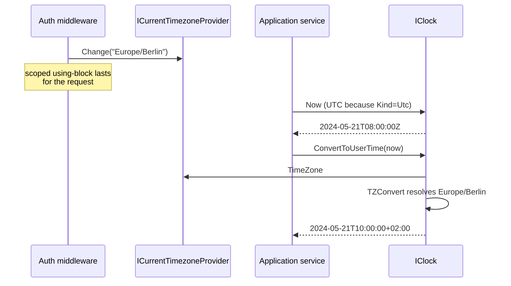

ABP Framework treats "now" as an injected service. Replacing `DateTime.Now` everywhere with `IClock.Now` gives you three benefits at once: deterministic test clocks, consistent `DateTimeKind` semantics across the codebase, and a single seam to convert between UTC and a tenant or user's time zone. This page covers `IClock`, the default `Clock`, `AbpClockOptions`, `ICurrentTimezoneProvider`, and the IANA/Windows conversion handled by `TZConvertTimezoneProvider`.

## IClock

The contract in `framework/src/Volo.Abp.Timing/Volo/Abp/Timing/IClock.cs` is short and explicit:

```csharp IClock.cs
public interface IClock
{
    DateTime Now { get; }
    DateTimeKind Kind { get; }
    bool SupportsMultipleTimezone { get; }

    DateTime Normalize(DateTime dateTime);
    DateTime ConvertToUserTime(DateTime utcDateTime);
    DateTimeOffset ConvertToUserTime(DateTimeOffset dateTimeOffset);
    DateTime ConvertToUtc(DateTime dateTime);
}
```

Three observations from the API:

1. **There is no `UtcNow`**. The framework expects you to set `Kind = Utc` once via options and treat `Now` as the canonical source.
2. `SupportsMultipleTimezone` is a derived flag (`Kind == DateTimeKind.Utc`) — only UTC-clock applications can sensibly convert to a user's time zone.
3. `Normalize` is the helper auditing and entity-tracking code uses to coerce mismatched `Kind`s.

## Clock implementation

`framework/src/Volo.Abp.Timing/Volo/Abp/Timing/Clock.cs` is the default `ITransientDependency` implementation:

```csharp Clock.cs (excerpt)
public virtual DateTime Now =>
    Options.Kind == DateTimeKind.Utc ? DateTime.UtcNow : DateTime.Now;

public virtual DateTimeKind Kind => Options.Kind;
public virtual bool SupportsMultipleTimezone => Options.Kind == DateTimeKind.Utc;

public virtual DateTime Normalize(DateTime dateTime)
{
    if (Kind == DateTimeKind.Unspecified || Kind == dateTime.Kind) return dateTime;
    if (Kind == DateTimeKind.Local && dateTime.Kind == DateTimeKind.Utc)  return dateTime.ToLocalTime();
    if (Kind == DateTimeKind.Utc && dateTime.Kind == DateTimeKind.Local) return dateTime.ToUniversalTime();
    return DateTime.SpecifyKind(dateTime, Kind);
}
```

`Normalize` is idempotent when the kinds already match; otherwise it converts or simply re-stamps the kind when the input is `Unspecified`. The framework calls it when materialising entities so audit timestamps end up consistent with the application's chosen kind.

## AbpClockOptions

`AbpClockOptions` has one field — but it is the single most important configuration line in any production ABP app:

```csharp AbpClockOptions.cs
public class AbpClockOptions
{
    /// <summary>Default: <see cref="DateTimeKind.Unspecified"/></summary>
    public DateTimeKind Kind { get; set; }

    public AbpClockOptions()
    {
        Kind = DateTimeKind.Unspecified;
    }
}
```

The framework default is `Unspecified` — which means `Normalize` is a no-op and `SupportsMultipleTimezone` is `false`. For multi-tenant SaaS and any deployment that runs in more than one time zone, set it to UTC:

```csharp
Configure<AbpClockOptions>(o => o.Kind = DateTimeKind.Utc);
```

After that:

- `IClock.Now` returns `DateTime.UtcNow`.
- `Normalize` rewrites every incoming `DateTime` to UTC (with a coercion if marked Local).
- `ConvertToUserTime` / `ConvertToUtc` start doing real work based on `ICurrentTimezoneProvider`.

| Kind | `Now` returns | `SupportsMultipleTimezone` | When to choose |
| --- | --- | --- | --- |
| `Unspecified` (default) | `DateTime.Now` | `false` | Legacy single-region apps; least-surprise default. |
| `Utc` | `DateTime.UtcNow` | `true` | Multi-region, multi-tenant, any SaaS. |
| `Local` | `DateTime.Now` | `false` | Single-server intranet apps with one timezone. |

## User time-zone resolution

`ICurrentTimezoneProvider` is an `AsyncLocal<string?>` ambient property — the currently-active IANA or Windows timezone identifier for the calling logical context:

```csharp ICurrentTimezoneProvider.cs
public interface ICurrentTimezoneProvider
{
    string? TimeZone { get; set; }
}
```

`CurrentTimezoneProvider` (in the same folder) is the singleton implementation backed by `AsyncLocal<string?>`. `CurrentTimezoneProviderExtensions.Change(timezone)` returns an `IDisposable` that restores the previous value on disposal — same pattern as `ICurrentTenant.Change`:

```csharp
using (_currentTimezoneProvider.Change("Europe/Berlin"))
{
    var localNow = _clock.ConvertToUserTime(_clock.Now); // converted to Berlin
}
```

That makes it natural to scope the timezone per HTTP request (set from `User.FindFirst("zoneinfo")` or a tenant setting) without leaking across requests.

## Conversions

```csharp Clock.cs (excerpt)
public virtual DateTime ConvertToUserTime(DateTime utcDateTime)
{
    if (!SupportsMultipleTimezone ||
        utcDateTime.Kind != DateTimeKind.Utc ||
        CurrentTimezoneProvider.TimeZone.IsNullOrWhiteSpace())
    {
        return utcDateTime;
    }

    var tz = TimezoneProvider.GetTimeZoneInfo(CurrentTimezoneProvider.TimeZone);
    return TimeZoneInfo.ConvertTime(utcDateTime, tz);
}

public DateTime ConvertToUtc(DateTime dateTime)
{
    if (!SupportsMultipleTimezone ||
        dateTime.Kind == DateTimeKind.Utc ||
        CurrentTimezoneProvider.TimeZone.IsNullOrWhiteSpace())
    {
        return dateTime;
    }

    var tz = TimezoneProvider.GetTimeZoneInfo(CurrentTimezoneProvider.TimeZone);
    dateTime = DateTime.SpecifyKind(dateTime, DateTimeKind.Unspecified);
    return TimeZoneInfo.ConvertTimeToUtc(dateTime, tz);
}
```

Both guards bail out early when the clock is not in UTC mode or the current timezone is not set — that keeps single-region apps unaffected.

## ITimezoneProvider — IANA ↔ Windows

`ITimezoneProvider` maps between Windows timezone ids (`"W. Europe Standard Time"`) and IANA ids (`"Europe/Berlin"`) so the same client can ship either format:

```csharp ITimezoneProvider.cs
public interface ITimezoneProvider
{
    List<NameValue> GetWindowsTimezones();
    List<NameValue> GetIanaTimezones();
    string WindowsToIana(string windowsTimeZoneId);
    string IanaToWindows(string ianaTimeZoneName);
    TimeZoneInfo GetTimeZoneInfo(string windowsOrIanaTimeZoneId);
}
```

The default `TZConvertTimezoneProvider` (in `Clock.cs` neighbour `TZConvertTimezoneProvider.cs`) uses the [TimeZoneConverter](https://github.com/mattjohnsonpint/TimeZoneConverter) library — so the application talks IANA on Linux and Windows ids on Windows transparently:

```csharp
public virtual string WindowsToIana(string windowsTimeZoneId)
    => TZConvert.WindowsToIana(windowsTimeZoneId);

public virtual string IanaToWindows(string ianaTimeZoneName)
    => TZConvert.IanaToWindows(ianaTimeZoneName);
```

`GetIanaTimezones` filters to "interesting" zones (`x.Contains("/") && !x.Contains("Etc")` plus `"UTC"`), which is the list you typically show in a user-profile dropdown.

## DisableDateTimeNormalizationAttribute

When a property must keep its native `DateTimeKind` — for instance a "scheduled at" timestamp recorded in local time — annotate the property:

```csharp
public class ScheduledTask
{
    [DisableDateTimeNormalization]
    public DateTime RunAtLocal { get; set; }
}
```

The auditing and entity-loading interceptors check the attribute before calling `IClock.Normalize` so the value is round-tripped untouched.

## Module wiring

`AbpTimingModule` brings in localization resources (timezone names for UIs), `AbpSettingsModule`, and registers the timezone JSON files as virtual files. Nothing else needs to be configured by you beyond `AbpClockOptions.Kind`:

```csharp AbpTimingModule.cs
[DependsOn(typeof(AbpLocalizationModule), typeof(AbpSettingsModule))]
public class AbpTimingModule : AbpModule
{
    public override void ConfigureServices(ServiceConfigurationContext context)
    {
        Configure<AbpVirtualFileSystemOptions>(o =>
            o.FileSets.AddEmbedded<AbpTimingModule>());

        Configure<AbpLocalizationOptions>(o => o.Resources
            .Add<AbpTimingResource>("en")
            .AddVirtualJson("/Volo/Abp/Timing/Localization"));
    }
}
```

## End-to-end picture



## Using the clock in tests

Because `IClock` is registered as `ITransientDependency`, swapping in a fake is trivial:

```csharp
public class FakeClock : IClock
{
    public DateTime Now { get; set; } = new(2024, 1, 1, 0, 0, 0, DateTimeKind.Utc);
    public DateTimeKind Kind => DateTimeKind.Utc;
    public bool SupportsMultipleTimezone => true;
    public DateTime Normalize(DateTime dt) => DateTime.SpecifyKind(dt, DateTimeKind.Utc);
    public DateTime ConvertToUtc(DateTime dt) => dt;
    public DateTime ConvertToUserTime(DateTime dt) => dt;
    public DateTimeOffset ConvertToUserTime(DateTimeOffset dt) => dt;
}

services.Replace(ServiceDescriptor.Transient<IClock, FakeClock>());
```

ABP's own [testing infrastructure](/testing/test-base) registers a similar deterministic clock so audited timestamps are reproducible.

## Cheat sheet

| Need | Call |
| --- | --- |
| Current time | `_clock.Now` |
| Coerce DB value to options.Kind | `_clock.Normalize(dt)` |
| Display to user | `_clock.ConvertToUserTime(utc)` |
| Persist user input | `_clock.ConvertToUtc(local)` |
| Change zone for one block | `using (_tz.Change("Europe/Berlin")) { ... }` |
| List of zones for UI | `_tzp.GetIanaTimezones()` |

## See also

- [/infrastructure/overview](/infrastructure/overview)
- [/data/auditing](/data/auditing) — `CreationTime`, `LastModificationTime` flow through `IClock`.
- [/core/options-and-configuration](/core/options-and-configuration) — where `AbpClockOptions` is registered.
- [/multi-tenancy/settings](/multi-tenancy/settings) — per-tenant timezone settings can drive `ICurrentTimezoneProvider`.
