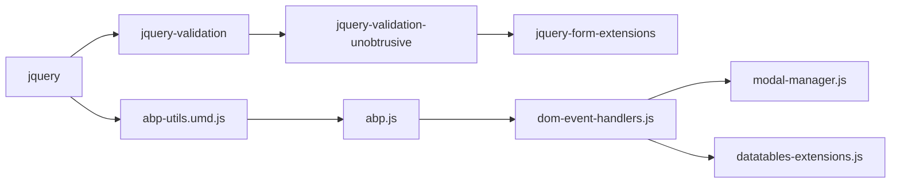

The `@abp/aspnetcore.mvc.ui` npm package looks deceptively small — its directory contains only a `package.json`, a `package-lock.json`, and a `README.md`. The real client-side surface that the pack represents lives next to its C# counterpart at `framework/src/Volo.Abp.AspNetCore.Mvc.UI/` and ships through Razor Class Library static web assets. This page covers the trio: the npm manifest, the C# `Volo.Abp.AspNetCore.Mvc.UI` project that defines the server-side primitives (`AlertManager`, `LayoutHookViewComponent`, `Theming`), and the JavaScript hooks under `abp.dom.initializers.*` and `abp.ModalManager` that Razor pages call into.

In an ABP MVC application this pack supplies the wiring between Razor tag helpers and the runtime JavaScript provided by `@abp/aspnetcore.mvc.ui.theme.shared` — autocomplete dropdowns, datepicker normalization, AJAX modals, alert messages, and the page-level `abp.dom.onNodeAdded` mutation observer. The pack itself only contains the `ansi-colors` dependency used by ABP CLI tooling; its presence in `package.json` is the marker that says "this application is an MVC ABP app".

## Package surface

```text
npm/packs/aspnetcore.mvc.ui/
├── README.md
├── package-lock.json
└── package.json
```

```json
{
  "version": "10.2.0-rc.3",
  "name": "@abp/aspnetcore.mvc.ui",
  "dependencies": {
    "ansi-colors": "^4.1.3"
  }
}
```

The lone `ansi-colors` dependency exists because `abp install-libs` and the bundling/minifier tooling shell out to a Node-side helper that needs colored console output during build. There is no `abp.resourcemapping.js` — nothing is copied into `wwwroot/libs/` for this pack. The static web assets ship through the C# Razor Class Library mechanism instead.

## Server-side companion: Volo.Abp.AspNetCore.Mvc.UI

The C# project at `framework/src/Volo.Abp.AspNetCore.Mvc.UI/` is the counterpart of this npm pack. It defines the **server-side primitives** that the JS hooks below interact with. The project tree is small:

```text
Volo.Abp.AspNetCore.Mvc.UI/
├── Volo.Abp.AspNetCore.Mvc.UI.csproj
├── Volo.Abp.AspNetCore.Mvc.UI.abppkg
└── Volo/Abp/
    ├── AspNetCore/Mvc/UI/
    │   ├── Alerts/             ← AlertManager, AlertMessage, AlertType
    │   ├── Components/
    │   │   └── LayoutHook/     ← LayoutHookViewComponent
    │   ├── Layout/
    │   ├── RazorPages/
    │   └── Theming/
    └── ObjectExtending/
```

The four pillars below are the contract that Razor pages and the JS hooks share.

### Alerts: AlertMessage + IAlertManager

`AlertType.cs` declares the bootstrap-aligned enum:

```csharp
namespace Volo.Abp.AspNetCore.Mvc.UI.Alerts;

public enum AlertType
{
    Default,
    Primary,
    Secondary,
    Success,
    Danger,
    Warning,
    Info,
    Light,
    Dark
}
```

`AlertMessage` is the immutable DTO that Razor layouts render:

```csharp
public class AlertMessage
{
    [NotNull]
    public string Text { get => _text; set => _text = Check.NotNullOrWhiteSpace(value, nameof(value)); }

    private string _text = default!;

    public AlertType Type { get; set; }
    public string? Title { get; set; }
    public bool Dismissible { get; set; }

    public AlertMessage(AlertType type, [NotNull] string text, string? title = null, bool dismissible = true)
    {
        Type = type;
        Text = Check.NotNullOrWhiteSpace(text, nameof(text));
        Title = title;
        Dismissible = dismissible;
    }
}
```

A page handler that wants to flash an alert injects `IAlertManager` and pushes onto `Alerts` (an `AlertList`). The theme's layout iterates that list and renders Bootstrap `.alert .alert-dismissible` markup. The JS side wires `data-bs-dismiss="alert"` so dismissals are handled by Bootstrap directly — no ABP-specific JS needed for the close button.

### Layout hooks

`Components/LayoutHook/LayoutHookViewComponent.cs` together with `ViewComponentHelperLayoutHookExtensions.cs` lets a module inject view components into named layout hooks (e.g. `LayoutHooks.Body.Last`). The default cshtml is `Components/LayoutHook/Default.cshtml`. Modules use this from inside the theme layout to surface their own widgets without forking the theme.

### Theming primitives

The `Theming/` folder hosts the `ITheme` / `IThemeManager` interfaces. The MVC pipeline resolves the active theme through `Volo.Abp.AspNetCore.Mvc.UI.Theme.Shared` ([deep dive](/js-packs/theme-shared-pack)) and renders that theme's layout. See [`/ui-mvc/overview`](/ui-mvc/overview) for the theme switching mechanism.

## abp.dom.initializers — the JS contract

Even though the JS source physically lives in `Volo.Abp.AspNetCore.Mvc.UI.Theme.Shared/wwwroot/libs/abp/aspnetcore-mvc-ui-theme-shared/bootstrap/dom-event-handlers.js`, every Razor page consumes the contract via the `@abp/aspnetcore.mvc.ui` pack metadata. The full initializer roster is:

```mermaid
graph TD
    Page[Razor page loads] -->|$ ready| Init[$(function)]
    Init --> T[initializeToolTips]
    Init --> P[initializePopovers]
    Init --> TA[initializeTimeAgos]
    Init --> DP[initializeDatepickers]
    Init --> F[initializeForms]
    Init --> AC[initializeAutocompleteSelects]
    Init --> CSP[initializeAbpCspStyles]
    Init --> FOC[data-auto-focus first input]
    Mut[abp.dom.onNodeAdded] -.->|re-runs| T
    Mut -.-> P
    Mut -.-> TA
    Mut -.-> F
    Mut -.-> Sc[initializeScript]
    Mut -.-> AC
    Mut -.-> CSP
```

The dispatch table at the bottom of `dom-event-handlers.js`:

```js
$(function () {
    abp.dom.initializers.initializeToolTips($('[data-bs-toggle="tooltip"]'));
    abp.dom.initializers.initializePopovers($('[data-bs-toggle="popover"]'));
    abp.dom.initializers.initializeTimeAgos($('.timeago'));
    abp.dom.initializers.initializeDatepickers($(document));
    abp.dom.initializers.initializeForms($('form'));
    abp.dom.initializers.initializeAutocompleteSelects($('.auto-complete-select'));
    $('[data-auto-focus="true"]').first().findWithSelf('input,select').focus();
    abp.dom.initializers.initializeAbpCspStyles($("link[abp-csp-style]"));
});
```

And the mutation-observer wiring so injected fragments (modal bodies, AJAX swaps) get the same treatment:

```js
abp.dom.onNodeAdded(function (args) {
    abp.dom.initializers.initializeToolTips(args.$el.findWithSelf('[data-bs-toggle="tooltip"]'));
    abp.dom.initializers.initializePopovers(args.$el.findWithSelf('[data-bs-toggle="popover"]'));
    abp.dom.initializers.initializeTimeAgos(args.$el.findWithSelf('.timeago'));
    abp.dom.initializers.initializeForms(args.$el.findWithSelf('form'), true);
    abp.dom.initializers.initializeScript(args.$el);
    abp.dom.initializers.initializeAutocompleteSelects(args.$el.findWithSelf('.auto-complete-select'));
    abp.dom.initializers.initializeAbpCspStyles(args.$el.findWithSelf("link[abp-csp-style]"));
});
```

| Initializer | DOM hook | Underlying lib |
| --- | --- | --- |
| `initializeForms($forms, validate)` | every `<form>` | jQuery validation unobtrusive + `abpAjaxForm` |
| `initializeScript($el)` | `[data-script-class]` | Resolves the class name with `eval` and calls `initDom` |
| `initializeToolTips` | `[data-bs-toggle="tooltip"]` | `new bootstrap.Tooltip` |
| `initializePopovers` | `[data-bs-toggle="popover"]` | `new bootstrap.Popover` |
| `initializeTimeAgos` | `.timeago` | `jquery.timeago` |
| `initializeAutocompleteSelects` | `.auto-complete-select` | `select2` AJAX |
| `initializeDatepickers` | `input.datepicker, input[type=date]` | `bootstrap-datepicker` with `abp.libs.bootstrapDatepicker` options |
| `initializeAbpCspStyles` | `link[abp-csp-style]` | Promotes CSP-marked styles to `rel="stylesheet"` |

### initializeForms

`initializeForms` is the entry point that connects a `<form data-ajaxForm="true">` to `abpAjaxForm`:

```js
abp.dom.initializers.initializeForms = function ($forms, validate) {
    if ($forms.length) {
        $forms.each(function () {
            var $form = $(this);

            if (validate === true) {
                $.validator.unobtrusive.parse($form);
            }

            var confirmText = $form.attr('data-confirm');
            if (confirmText) {
                $form.submit(function (e) {
                    if (!$form.data('abp-confirmed')) {
                        e.preventDefault();
                        abp.message.confirm(confirmText).done(function (accepted) {
                            if (accepted) {
                                $form.data('abp-confirmed', true);
                                $form.submit();
                                $form.data('abp-confirmed', undefined);
                            }
                        });
                    }
                });
            }

            if ($form.attr('data-ajaxForm') === 'true') {
                $form.abpAjaxForm();
            }
        });
    }
};
```

Two interesting bits:

1. **Conditional re-parse.** `validate === true` triggers a fresh `$.validator.unobtrusive.parse($form)` call. This branch only runs from `onNodeAdded` — the page-ready path passes no argument so it doesn't re-run validation on already-initialized forms.
2. **Confirm modal.** Setting `data-confirm="Are you sure?"` on the form opens an `abp.message.confirm` dialog and re-submits only if the user clicks OK, using a transient `abp-confirmed` data flag to break the recursion.

### initializeScript: per-form controller pattern

```js
abp.dom.initializers.initializeScript = function ($el) {
    $el.findWithSelf('[data-script-class]').each(function () {
        var scriptClassName = $(this).attr('data-script-class');
        if (!scriptClassName) { return; }

        var scriptClass = eval(scriptClassName);
        if (!scriptClass) { return; }

        var scriptObject = new scriptClass();
        $el.data('abp-script-object', scriptObject);

        scriptObject.initDom && scriptObject.initDom($el);
    });
}
```

A Razor page declares `<form data-script-class="MyApp.SomePage">` and ships a top-level `MyApp.SomePage = function () { … }` constructor. ABP instantiates one per form and attaches it as `abp-script-object` so other handlers can fetch it back. This is the legacy "tag helper + controller" pattern still used by many module pages.

### initializeAutocompleteSelects: server-driven `<select>`

Autocomplete dropdowns are how ABP renders server-side foreign-key pickers in Razor without needing module-specific JS. The mechanism reads `data-autocomplete*` attributes off a `<select class="auto-complete-select">`:

| Data attribute | Purpose |
| --- | --- |
| `data-autocompleteApiUrl` | GET endpoint that returns items |
| `data-autocompleteDisplayProperty` | Field on each item to show as text |
| `data-autocompleteValueProperty` | Field to use as `<option value>` |
| `data-autocompleteItemsProperty` | Path into the response that holds the array |
| `data-autocompleteFilterParamName` | Query-string param the API expects |
| `data-autocompleteSelectedItemName` | Hydrated display text for the initial value |
| `data-autocompleteParentSelector` | Where to render the dropdown (auto-detects `.modal.fade`) |
| `data-autocompleteAllowClear` | Toggles the select2 clear button |
| `data-autocompletePlaceholder` | Placeholder text |

The implementation creates a hidden `_Text` input next to the select so the displayed text is round-tripped on form submission, then invokes `select2` with an AJAX `processResults` callback that maps the configured items into `{id, text}` shape. The Razor side typically writes a `[abp-row]/[abp-column]` form group plus an `<abp-input>` tag helper that emits `class="auto-complete-select"` automatically.

### initializeDatepickers

`abp.libs.bootstrapDatepicker.getOptions($input)` computes culture-aware date format options and `getFormattedValue` normalizes a server-emitted ISO string into the locale form:

```js
abp.dom.initializers.initializeDatepickers = function ($rootElement) {
    $rootElement
        .findWithSelf('input.datepicker,input[type=date][abp-data-datepicker!=false]')
        .each(function () {
            var $input = $(this);
            $input
                .attr('type', 'text')
                .val(abp.libs.bootstrapDatepicker.getFormattedValue($input.val()))
                .datepicker(abp.libs.bootstrapDatepicker.getOptions($input))
                .on('hide', function (e) { e.stopPropagation(); });
        });
}
```

Note the `attr('type', 'text')` rewrite — it switches off the native browser picker so the Bootstrap one takes over consistently across browsers. The `[abp-data-datepicker="false"]` opt-out lets you suppress the rewrite per input.

A culture-change listener wires the `'abp.configurationInitialized'` event:

```js
abp.event.on('abp.configurationInitialized', function () {
    abp.libs.bootstrapDatepicker.normalizeLanguageConfig();
});
```

`normalizeLanguageConfig` reads `abp.localization.currentCulture` and selects the matching `bootstrap-datepicker` locale.

## abp.ModalManager — AJAX modals

`Volo.Abp.AspNetCore.Mvc.UI.Theme.Shared/wwwroot/libs/abp/aspnetcore-mvc-ui-theme-shared/bootstrap/modal-manager.js` defines `abp.ModalManager`, the helper that loads a Razor page into a Bootstrap modal:

```js
abp.ModalManager = (function () {

    var CallbackList = function () {
        var _callbacks = [];

        return {
            add: function (callback) { _callbacks.push(callback); },
            triggerAll: function (thisObj, argumentList) {
                for (var i = 0; i < _callbacks.length; i++) {
                    _callbacks[i].apply(thisObj, argumentList);
                }
            }
        };
    };

    return function (options) {

        if (typeof options === 'string') {
            options = { viewUrl: options };
        }

        var _options = options;
        var _$modalContainer = null;
        var _$modal = null;
        var _$form = null;

        var _modalId = 'Abp_Modal_' + (Math.floor((Math.random() * 1000000))) + new Date().getTime();
        // …

        var _onOpenCallbacks   = new CallbackList();
        var _onCloseCallbacks  = new CallbackList();
        var _onResultCallbacks = new CallbackList();
```

The flow is:

```mermaid
sequenceDiagram
    participant Page
    participant MM as abp.ModalManager
    participant Server as Razor page
    participant DOM
    Page->>MM: new abp.ModalManager({viewUrl: '/Foo/Edit'})
    Page->>MM: open({id: 42})
    MM->>Server: GET /Foo/Edit?id=42
    Server-->>MM: HTML fragment
    MM->>DOM: append &lt;div id="Abp_Modal_…"&gt;
    DOM->>MM: bootstrap.Modal.show()
    Note over MM: form.abpAjaxForm() + needConfirmationOnUnsavedClose
    DOM->>MM: form submit success
    MM->>Page: _onResultCallbacks.triggerAll
    MM->>DOM: hide + remove
```

Three `CallbackList`s are exposed via `onOpen`, `onClose`, and `onResult`. Inside `_initAndShowModal`:

```js
_$modal = _$modalContainer.find('.modal');
_$form  = _$modalContainer.find('form');
if (_$form.length) {
    if (_$form.attr('data-ajaxForm') !== 'false') {
        _$form.abpAjaxForm();
    }

    if (_$form.attr('data-check-form-on-close') !== 'false') {
        _$form.needConfirmationOnUnsavedClose(_$modal);
    }

    _$form.on('abp-ajax-success', …);
}
```

The unique `_modalId` (random + `Date.now()`) lets multiple modals stack — a new modal `prepend`s to `body` if there are no others, otherwise `after`s the last one. Razor pages typically call `new abp.ModalManager({viewUrl: '...', scriptUrl: '...'})` to also load a per-modal JS file; the script is then mounted by `initializeScript` via the `data-script-class` attribute on the form inside the modal.

## abp.dom.onNodeAdded / onNodeRemoved

`abp.dom` is the dispatch table for the MutationObserver-style hook system. A separate part of theme.shared exposes `abp.dom.onNodeAdded(fn)` and `abp.dom.onNodeRemoved(fn)` which are called whenever DOM nodes appear or disappear. The `dom-event-handlers.js` file shown above registers itself with these hooks so that newly-rendered modal bodies get the same `initializeForms`, `initializeAutocompleteSelects`, `initializeTooltips` treatment as the initial page.

This is what makes Razor partial views and modal-loaded forms behave consistently — there is no need to manually re-init plug-ins after a fragment update. The `removed` hook cleans up orphaned tooltip DOM left behind by Bootstrap (`#aria-describedby` rules).

## DataTables wrapper

`Volo.Abp.AspNetCore.Mvc.UI.Theme.Shared/wwwroot/libs/abp/aspnetcore-mvc-ui-theme-shared/datatables/datatables-extensions.js` extends `dataTableExt` with a `RECORD-ACTIONS` column type that renders a kebab-menu of contextual actions. The localize helper at the top reads from `AbpUi`:

```js
var localize = function (key) {
    return abp.localization.getResource('AbpUi')(key);
};
```

Each action descriptor accepts a `visibilityField` (boolean or function), a `confirmMessage` callback, a `text`/`icon`/`iconClass`, and an `action({record, table})` callback. The default click handler wraps the `action` in `abp.message.confirm` if a `confirmMessage` is supplied:

```js
if (fieldItem.confirmMessage) {
    abp.message.confirm(fieldItem.confirmMessage({ record: record, table: tableInstance }))
        .done(function (accepted) {
            if (accepted) { fieldItem.action({ record: record, table: tableInstance }); }
        });
} else {
    fieldItem.action({ record: record, table: tableInstance });
}
```

The pattern composes with `abp.ui.extensions.entityActions` (built on `LinkedList` from `@abp/utils`) so that modules can contribute extra actions into a host's grid without forking it.

## How a Razor page composes these primitives

<Steps>
  <Step title="Layout pulls scripts">
    The theme layout includes the bundles from `Volo.Abp.AspNetCore.Mvc.UI.Theme.Shared/Bundling/`, which concatenate `abp.js` + `dom-event-handlers.js` + `modal-manager.js` + `datatables-extensions.js` + `jquery-form-extensions.js`. See [`/ui-mvc/bundling`](/ui-mvc/bundling).
  </Step>
  <Step title="Page-level JS controller">
    A Razor page typically pairs `Page.cshtml` with `Page.js`. The JS file is a `$(function () { … })` block that wires page-specific behaviour (e.g. opens an `abp.ModalManager` when a button is clicked, calls `abp.notify.success`).
  </Step>
  <Step title="Server flashes alerts">
    Page handlers inject `IAlertManager` and call `Alerts.Success(…)`. The shared theme layout iterates and renders Bootstrap alerts that the user dismisses through `data-bs-dismiss`.
  </Step>
  <Step title="Initializers run on load and on injection">
    `initializeForms`, `initializeAutocompleteSelects`, `initializeDatepickers` run on `$(function …)`; they also re-run for every fragment delivered by `abp.ModalManager` or AJAX, courtesy of `abp.dom.onNodeAdded`.
  </Step>
</Steps>

## Anti-forgery integration

`jquery-form-extensions.js` reads `abp.security.antiForgery.getToken()` (from `@abp/core`) and attaches `RequestVerificationToken` to AJAX form submissions:

```js
options.error = function (jqXhr) {
    // …
    if (jqXhr.getResponseHeader('_AbpErrorFormat') === 'true') {
        abp.ajax.logError(jqXhr.responseJSON.error);
        var messagePromise = abp.ajax.showError(jqXhr.responseJSON.error);
        if (jqXhr.status === 401) {
            abp.ajax.handleUnAuthorizedRequest(messagePromise);
        }
    } else {
        abp.ajax.handleErrorStatusCode(jqXhr.status);
    }
};
```

The `_AbpErrorFormat: true` response header is set by `AbpExceptionFilter` whenever an API returns an error wrapped in the ABP `RemoteServiceErrorResponse` envelope — that lets the client surface a friendly `abp.message.error` rather than a raw stack trace.

## Bundle composition

The pack itself never adds a file to a bundle. Its bundles live in `framework/src/Volo.Abp.AspNetCore.Mvc.UI/Volo/Abp/AspNetCore/Mvc/UI/Bundling/` (and parallel directories under `theme.shared`). The bundling pipeline is described in [`/ui-mvc/bundling`](/ui-mvc/bundling); the salient ordering is:



`dom-event-handlers.js` cannot load before `abp.js` because it references `abp.dom`, `abp.message`, and `abp.libs.bootstrapDatepicker`; the bundler is configured to respect that order.

<Note>
For Blazor Server hosts, none of the `abp.dom.initializers.*` machinery applies — Blazor's circuit replaces the page's DOM imperatively. The `BlazorGlobalScriptContributor` only loads the slim `abp.js` and an `authentication-state-listener.js`. See [`/blazor/overview`](/blazor/overview).
</Note>

## Related references

- [`@abp/core`](/js-packs/core) — provides `abp.message`, `abp.security.antiForgery`, `abp.event`.
- [`@abp/aspnetcore.mvc.ui.theme.shared`](/js-packs/theme-shared-pack) — host of the actual JS files described here.
- [`/ui-mvc/bundling`](/ui-mvc/bundling) — bundle ordering for the hooks above.
- [`/ui-mvc/overview`](/ui-mvc/overview) — theme manager, alert manager, tag helpers.
- [`/blazor/overview`](/blazor/overview) — Blazor Server's simpler JS surface.
