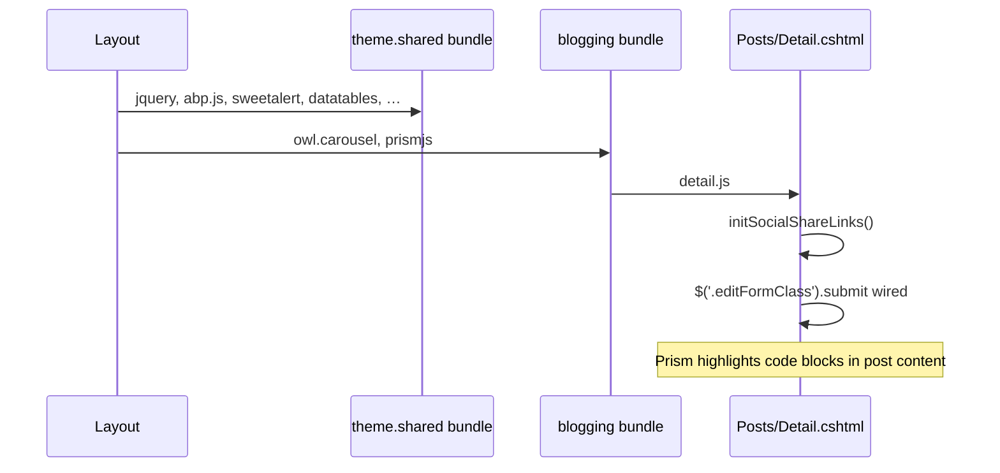
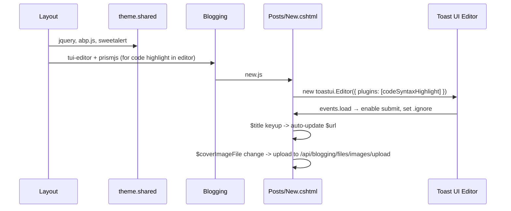
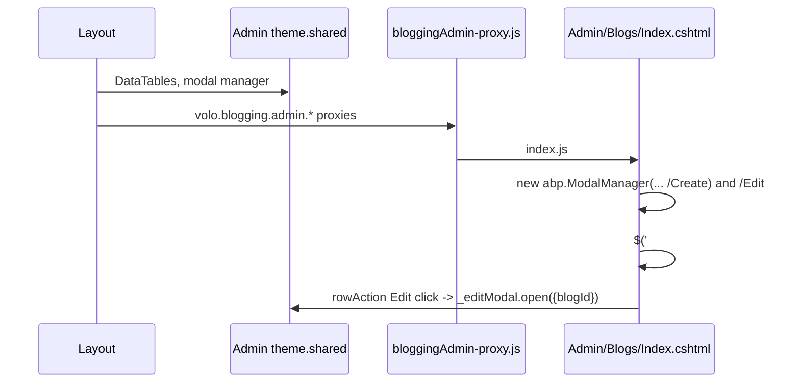

The `@abp/blogging` package is the front-end manifest for the standalone `Volo.Blogging` module — the original ABP blogging engine that pre-dates CMS Kit. While CMS Kit now provides a generalized blog feature, the standalone blogging module is still maintained, has its own admin UI, and ships as a separate set of `@abp/*` packs. This page covers the npm manifest, the public-facing Razor pages under `modules/blogging/src/Volo.Blogging.Web/Pages/Blogs/`, the Toast UI Editor integration for post authoring, the Owl Carousel hero slider on the blog index, and the DataTables + AJAX modal flow in `modules/blogging/src/Volo.Blogging.Admin.Web/Pages/Blogging/Admin/Blogs/`.

In an ABP solution that uses the standalone blogging module instead of CMS Kit's blog feature, only this single pack is needed on the web host — its transitive dependency on `@abp/aspnetcore.mvc.ui.theme.shared` brings the rest of the Razor toolbox. See [`/ui-mvc/overview`](/ui-mvc/overview) for how the Razor pipeline composes and [`/blazor/overview`](/blazor/overview) for why this pack does not target Blazor.

## Pack manifest

```json
{
  "version": "10.2.0-rc.3",
  "name": "@abp/blogging",
  "dependencies": {
    "@abp/aspnetcore.mvc.ui.theme.shared": "~10.2.0-rc.3",
    "@abp/owl.carousel": "~10.2.0-rc.3",
    "@abp/prismjs":      "~10.2.0-rc.3",
    "@abp/tui-editor":   "~10.2.0-rc.3"
  }
}
```

Four dependencies — the smallest "module" pack in `npm/packs/` after CMS Kit's public subset:

| Dependency | Used for |
| --- | --- |
| `@abp/aspnetcore.mvc.ui.theme.shared` | Foundation — `abp.message`, jQuery, datatables, modal manager |
| `@abp/owl.carousel` | Hero / featured slider on the blog index |
| `@abp/prismjs` | Syntax highlighting for code blocks inside posts |
| `@abp/tui-editor` | Toast UI Editor — Markdown WYSIWYG for post authoring |

The pack itself contains only `package.json` and `README.md`:

```text
npm/packs/blogging/
├── README.md
└── package.json
```

```mermaid
graph TD
    A[@abp/blogging] --> B[theme.shared]
    A --> C[owl.carousel]
    A --> D[prismjs]
    A --> E[tui-editor]
    E --> F[@abp/jquery]
    E --> G[@abp/prismjs]
```

`@abp/tui-editor` transitively also brings `@abp/jquery` and `@abp/prismjs`. That double-listing of `@abp/prismjs` (direct + transitive) is harmless because `~10.2.0-rc.3` resolves to the same version.

## Server-side companion: Volo.Blogging.* projects

The `modules/blogging/src/` directory hosts the C# projects whose Razor pages and `wwwroot/client-proxies/` ship the actual JavaScript:

| Project | Pages root | Auto-generated proxy |
| --- | --- | --- |
| `Volo.Blogging.Web` | `Pages/Blogs/` | `wwwroot/client-proxies/blogging-proxy.js` |
| `Volo.Blogging.Admin.Web` | `Pages/Blogging/Admin/Blogs/` | `wwwroot/client-proxies/bloggingAdmin-proxy.js` |

The auto-generated proxies expose `volo.blogging.*` and `volo.blogging.admin.*` namespaces — the page-level JS uses these to talk to the HTTP API without writing hand-rolled `$.ajax` calls.

## Public page tree

`modules/blogging/src/Volo.Blogging.Web/Pages/Blogs/` ships:

```text
Pages/Blogs/
├── Members/
│   └── Index.js
├── Posts/
│   ├── detail.js   ← single post page
│   ├── edit.js     ← edit existing post (logged-in author)
│   └── new.js      ← create new post
└── Shared/
    └── Scripts/
        └── blog.js ← blog index page (hero + listing)
```

The blog index uses `blog.js` to bootstrap the Owl Carousel hero strip; individual posts use `detail.js` for share links and inline comment editing; authoring lives in `new.js` and `edit.js`, both of which mount a Toast UI Editor for Markdown content.

### blog.js — Owl Carousel hero

`Pages/Blogs/Shared/Scripts/blog.js` configures the index-page hero carousel:

```js
function handleOwlCarousel() {
    $('.hero-section .owl-carousel').owlCarousel({
        loop: true,
        margin: 0,
        nav: false,
        dots: false,
        autoplay: true,
        autoHeight: true,
        autoplaySpeed: 1000,
        items: 1,
    });
    $('.card-article-container .owl-carousel').owlCarousel({
        loop: true,
        margin: 0,
        nav: false,
        dots: false,
        autoplay: true,
        autoplaySpeed: 1000,
        responsive: {
            0: { items: 1 },
        },
    });
}
```

Two carousels coexist on the index — a full-bleed hero (`autoHeight: true`) and an article-card strip. The script also centers the manual prev/next arrows based on viewport width:

```js
function handleArrows() {
    var herosWidth = $('.hero-articles').width();
    var arrowsPosition = herosWidth / 2 - 90;
    $('.owl-next').css('right', arrowsPosition);
    $('.owl-prev').css('left',  arrowsPosition);
}
```

Window resize re-runs the calculation with a 500 ms debounce:

```js
$(window).resize(function () {
    setTimeout(function () {
        handleArrows();
        handleImages();
    }, 500);
});
```

### new.js — Toast UI Editor + custom image upload

`Pages/Blogs/Posts/new.js` is the most feature-rich JS file in the module. It composes:

| Concern | Implementation |
| --- | --- |
| Cover image | Hidden file input + `` preview; AJAX POST to `/api/blogging/files/images/upload` |
| Title length warning | Localized warning when `Post.Title.length > maxTitleLength` |
| Title-to-URL slug | `keyup` handler on title replaces `&`, `/`, spaces with hyphens until the user manually edits the URL |
| Markdown editor | Toast UI Editor with code-syntax-highlight plugin |
| Image uploads inside editor | `addImageBlobHook` reuses the same `/api/blogging/files/images/upload` endpoint |
| Submit | Reads `editor.getMarkdown()`, validates, busies the button |

The editor mount is:

```js
var newPostEditor = new toastui.Editor({
    el: $editorContainer[0],
    usageStatistics: false,
    initialEditType: 'markdown',
    previewStyle: 'tab',
    height: 'auto',
    plugins: [toastui.Editor.plugin.codeSyntaxHighlight],
    hooks: {
        addImageBlobHook: function (blob, callback, source) {
            var imageAltText = blob.name;
            uploadImage(blob, function (webUrl) { callback(webUrl, imageAltText); });
        },
    },
    events: {
        load: function () {
            $editorContainer.find('.loading-cover').remove();
            $submitButton.prop('disabled', false);
            $form.data('validator').settings.ignore = '.ignore';
            $editorContainer.find(':input').addClass('ignore');
        },
    },
});
```

Two interesting hooks:

1. **`addImageBlobHook`** — when the editor user drags or pastes an image, the editor calls this hook with the `Blob`. The page uploads it to the blogging file API and the callback returns the public URL the editor inserts into the Markdown source.
2. **`events.load`** — after the editor finishes initializing, the page removes the loading overlay, enables the submit button, and rewrites the jQuery Validation `ignore` setting to `.ignore` so the editor's hidden inputs don't break form validation.

The submit handler reads the rendered Markdown back into a hidden input:

```js
$container.find('form#new-post-form').submit(function (e) {
    var $postTextInput = $form.find("input[name='Post.Content']");
    var postText = newPostEditor.getMarkdown();
    $postTextInput.val(postText);

    if (!$form.valid()) {
        var validationResult = $form.validate();
        abp.message.warn(validationResult.errorList[0].message);
        e.preventDefault();
        return false;
    }

    $submitButton.buttonBusy();
    $(this).off('submit').submit();
    return true;
});
```

`$.fn.buttonBusy` comes from `theme.shared`'s `jquery-extensions.js`; `abp.message.warn` comes from `@abp/sweetalert2` overrides — see [Theme Shared Pack](/js-packs/theme-shared-pack).

### Title → URL slug auto-fill

The slug auto-fill uses a one-way flag pattern:

```js
var urlEdited = false;
var reflectedChange = false;

$title.on('change paste keyup', function () {
    if (urlEdited) { return; }

    var title = $title.val();
    if (title.length > maxTitleLength) { $titleLengthWarning.show(); }
    else                               { $titleLengthWarning.hide(); }

    title = title.replace(' &', ' ');
    title = title.replace('& ', ' ');
    title = title.replace('&', '');
    title = title.replace(' ', '-');
    title = title.replace('/', '-');
    title = title.replace(new RegExp(' ', 'g'), '-');
    reflectedChange = true;
    $url.val(title);
    reflectedChange = false;
});

$url.change(function () {
    if (!reflectedChange) { urlEdited = true; }
});
```

The `reflectedChange` flag distinguishes between the auto-update writing into `$url` and the user typing into it; once the user touches the URL field, `urlEdited` flips to `true` and the title→URL sync stops.

### detail.js — social share + inline comment edit

`Pages/Blogs/Posts/detail.js` is roughly split into two halves. The first half wires up share links — Twitter, Facebook, LinkedIn, email, and a copy-to-clipboard handler:

```js
var initSocialShareLinks = function () {
    var re = new RegExp(/^.*\//);
    var rootUrl = re.exec(window.location.href);

    var pageHeader = $('#PostTitle').text().trim();
    var blogName   = $('#BlogFullName').attr('name');

    $('#TwitterShareLink').attr('href',
        'https://twitter.com/intent/tweet?text=' +
        encodeURI(pageHeader + ' | ' + blogName + ' | ' + window.location.href));

    $('#FacebookShareLink').attr('href',
        'https://www.facebook.com/sharer/sharer.php?u=' + encodeURI(window.location.href));

    $('#LinkedinShareLink').attr('href',
        'https://www.linkedin.com/shareArticle?' +
        'url=' + encodeURI(window.location.href) + '&mini=true' +
        '&summary=' + encodeURI(blogName) +
        '&title=' + encodeURI(pageHeader) +
        '&source=' + encodeURI(rootUrl));

    $('#EmailShareLink').attr('href',
        'mailto:?' +
        'body=' + encodeURI('I want you to look at ' + window.location.href) +
        '&subject=' + encodeURI(pageHeader + ' | ' + blogName) + '&');
};

$('#CopyLink').click(function (event) {
    event.preventDefault();
    var $temp = $('<input>');
    $('body').append($temp);
    $temp.val(window.location.href).select();
    document.execCommand('copy');
    $temp.remove();
});
```

The copy handler uses the legacy `execCommand('copy')` trick because the `Clipboard API` requires HTTPS plus an opt-in permission. Inside an admin host this is acceptable; for a public site the upgrade to `navigator.clipboard.writeText(...)` would be a small refactor.

The second half handles inline comment editing:

```js
$('form[class="editFormClass"]').submit(function (event) {
    event.preventDefault();
    var form = $(this).serializeFormToObject();

    $.ajax({
        type: 'POST',
        url: '/Blog/Comments/Update',
        data: {
            id: form.commentId,
            commentDto: { text: form.text }
        },
        success: function (response) {
            $('div .editForm').hide();
            $('#' + form.commentId).text(form.text);
        },
    });
});
```

`$.fn.serializeFormToObject` again comes from `theme.shared`. The handler swaps the comment text in place without reloading the page.

## Admin page tree

`modules/blogging/src/Volo.Blogging.Admin.Web/Pages/Blogging/Admin/Blogs/` is small — the standalone module only manages blogs (containers) from the admin UI; posts are written from the public side:

```text
Pages/Blogging/Admin/Blogs/
├── create.js   ← modal init for create form
├── edit.js     ← modal init for edit form
└── index.js    ← DataTables grid + create/edit modal manager
```

### index.js — DataTables + modal flow

The admin Blogs index is a canonical ABP DataTables grid. It instantiates two `abp.ModalManager`s upfront (for create and edit), then mounts a server-side DataTable:

```js
var _createModal = new abp.ModalManager(abp.appPath + 'Blogging/Admin/Blogs/Create');
var _editModal   = new abp.ModalManager(abp.appPath + 'Blogging/Admin/Blogs/Edit');

var _dataTable = $('#BlogsTable').DataTable(
    abp.libs.datatables.normalizeConfiguration({
        processing: true,
        serverSide: true,
        paging: false,
        info: false,
        scrollX: true,
        searching: false,
        autoWidth: false,
        scrollCollapse: true,
        order: [[3, 'desc']],
        ajax: abp.libs.datatables.createAjax(volo.blogging.admin.blogManagement.getList),
        columnDefs: [
            {
                rowAction: {
                    items: [
                        {
                            text: l('Edit'),
                            visible: abp.auth.isGranted('Blogging.Blog.Update'),
                            action: function (data) {
                                _editModal.open({ blogId: data.record.id });
                            },
                        },
                        { text: l('Delete'), /* … */ },
                    ],
                },
            }
        ],
    })
);
```

The `rowAction` column type is the `RECORD-ACTIONS` extension from theme.shared's `datatables-extensions.js`. The `visible: abp.auth.isGranted(...)` predicate hides the Edit action when the current user lacks the permission, with the same call pattern the CMS Kit admin uses.

### create.js / edit.js — modal initializers

Both modal files use the same pattern — define an init function on `abp.modals` keyed by the modal type:

```js
var abp = abp || {};
$(function () {
    abp.modals.blogCreate = function () {
        var initModal = function (publicApi, args) {
            var $form = publicApi.getForm();
        };

        return { initModal: initModal };
    };
});
```

`abp.ModalManager.open(args)` looks up `abp.modals.<modalType>` (read from the modal's `data-script-class` attribute), instantiates it, and calls `initModal(publicApi, args)`. The `publicApi` argument exposes `getForm()`, `getModal()`, and event-registration helpers; `args` is the object passed to `open()` from the index page (`{blogId: ...}`).

## Why no Blazor target?

The blogging pack has no companion `aspnetcore.components.server.blogging` pack — the standalone blogging module ships only Razor Pages. ABP applications that need a Blazor Server blog UI typically use CMS Kit instead, whose admin pages also target Blazor (see [CMS Kit packs](/js-packs/cms-kit-packs)). For pure Razor hosts, the blogging module remains a smaller, opinionated alternative.

## Loading order on a public post detail page



## Loading order on a public post authoring page



## Loading order in the admin grid



## File inventory

| File | Bytes (LoC) | Concern |
| --- | --- | --- |
| `Volo.Blogging.Web/Pages/Blogs/Members/Index.js` | small | Member listing on a blog landing |
| `Volo.Blogging.Web/Pages/Blogs/Posts/detail.js` | medium | Share links, inline comment edit |
| `Volo.Blogging.Web/Pages/Blogs/Posts/edit.js` | medium | Mirror of `new.js` for editing |
| `Volo.Blogging.Web/Pages/Blogs/Posts/new.js` | large | TUI Editor + cover image + slug auto-fill |
| `Volo.Blogging.Web/Pages/Blogs/Shared/Scripts/blog.js` | small | Owl Carousel + arrow positioning |
| `Volo.Blogging.Web/wwwroot/client-proxies/blogging-proxy.js` | generated | `volo.blogging.*` client proxies |
| `Volo.Blogging.Admin.Web/Pages/Blogging/Admin/Blogs/create.js` | tiny | `abp.modals.blogCreate` init |
| `Volo.Blogging.Admin.Web/Pages/Blogging/Admin/Blogs/edit.js` | tiny | `abp.modals.blogEdit` init |
| `Volo.Blogging.Admin.Web/Pages/Blogging/Admin/Blogs/index.js` | medium | DataTables grid + modal manager |
| `Volo.Blogging.Admin.Web/wwwroot/client-proxies/bloggingAdmin-proxy.js` | generated | `volo.blogging.admin.*` client proxies |

## Cross-cutting patterns

<Steps>
  <Step title="Toast UI Editor with codeSyntaxHighlight">
    Plugin loaded as `toastui.Editor.plugin.codeSyntaxHighlight` so code fences become Prism-rendered blocks both in the editor preview and in the saved Markdown.
  </Step>
  <Step title="Reuse the cover-image endpoint for inline images">
    `addImageBlobHook` POSTs to `/api/blogging/files/images/upload` so editors can drag-drop images and get the public URL inserted in-place.
  </Step>
  <Step title="abp.modals.&lt;name&gt; convention">
    Modal forms expose `initModal(publicApi, args)` on `abp.modals.<modalType>`; `abp.ModalManager` finds them via the modal's `data-script-class` attribute.
  </Step>
  <Step title="DataTables + RECORD-ACTIONS">
    Admin grids combine `abp.libs.datatables.normalizeConfiguration`, the `volo.blogging.admin.*` client proxies, and the `rowAction` column type from theme.shared.
  </Step>
  <Step title="abp.auth.isGranted for column visibility">
    `visible: abp.auth.isGranted('Blogging.Blog.Update')` hides actions per row without an extra round-trip.
  </Step>
</Steps>

## Related references

- [Theme Shared Pack](/js-packs/theme-shared-pack) — provides `abp.ModalManager`, `abp.libs.datatables`, jQuery extensions.
- [Vendor packs](/js-packs/third-party-vendor-packs) — Toast UI Editor, Prism.js, Owl Carousel upstream pins.
- [CMS Kit packs](/js-packs/cms-kit-packs) — the newer alternative to standalone blogging.
- [`/ui-mvc/bundling`](/ui-mvc/bundling) — how `@abp/blogging` files are bundled.
- [`/ui-mvc/overview`](/ui-mvc/overview) — Razor pipeline that hosts blogging pages.
- [`/blazor/overview`](/blazor/overview) — Blazor Server alternative (use CMS Kit for Blazor).
