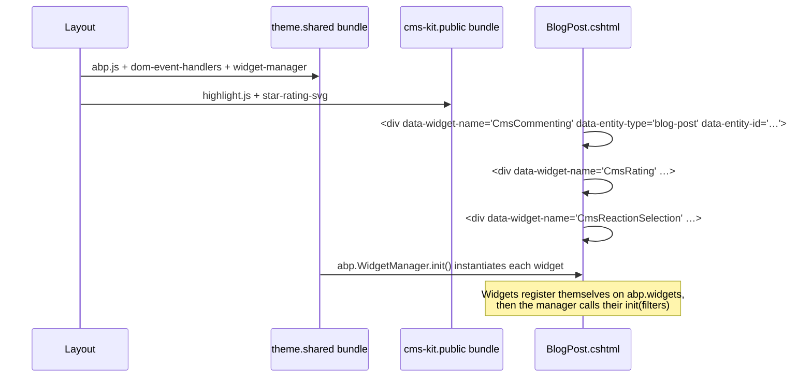
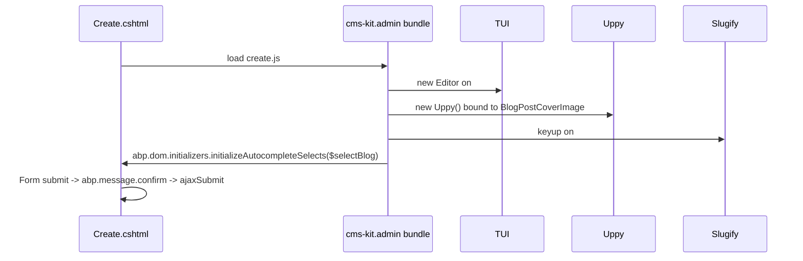

ABP Framework's CMS Kit module is the open-source content kit that drives blogs, pages, menus, tags, comments, ratings, reactions, and favourites. Its client-side surface is split across three NPM packs in `npm/packs/`: `@abp/cms-kit` is the meta-pack, `@abp/cms-kit.admin` ships the admin-side dependencies, and `@abp/cms-kit.public` ships the storefront-side dependencies. Like the theme packs, none of these directories contains JavaScript — the actual JS lives next to the consuming Razor pages under `modules/cms-kit/src/Volo.CmsKit.*.Web/Pages/`. This deep dive maps every public file in those Razor Page trees, calls out the abp.widget pattern used by the public-facing widgets, and explains how the admin pages compose `abp.ModalManager`, DataTables, jstree, TUI editor, and uppy.

In an ABP solution that enables CMS Kit, the admin host references `@abp/cms-kit.admin` and the public host references `@abp/cms-kit.public`. The meta-pack `@abp/cms-kit` is convenient when both run inside a single monolith — installing it transitively pulls both. See [`/ui-mvc/overview`](/ui-mvc/overview) for how Razor Pages compose, and [`/blazor/overview`](/blazor/overview) for how the Blazor variants differ.

## Pack manifests

`npm/packs/cms-kit/package.json` — pure meta-pack:

```json
{
  "version": "10.2.0-rc.3",
  "name": "@abp/cms-kit",
  "dependencies": {
    "@abp/cms-kit.admin":  "~10.2.0-rc.3",
    "@abp/cms-kit.public": "~10.2.0-rc.3"
  }
}
```

`npm/packs/cms-kit.admin/package.json` — admin dependencies:

```json
{
  "version": "10.2.0-rc.3",
  "name": "@abp/cms-kit.admin",
  "dependencies": {
    "@abp/codemirror":  "~10.2.0-rc.3",
    "@abp/jstree":      "~10.2.0-rc.3",
    "@abp/markdown-it": "~10.2.0-rc.3",
    "@abp/slugify":     "~10.2.0-rc.3",
    "@abp/tui-editor":  "~10.2.0-rc.3",
    "@abp/uppy":        "~10.2.0-rc.3"
  }
}
```

`npm/packs/cms-kit.public/package.json` — public dependencies:

```json
{
  "version": "10.2.0-rc.3",
  "name": "@abp/cms-kit.public",
  "dependencies": {
    "@abp/highlight.js":   "~10.2.0-rc.3",
    "@abp/star-rating-svg":"~10.2.0-rc.3"
  }
}
```

```mermaid
graph TD
    Meta[@abp/cms-kit] --> Admin[@abp/cms-kit.admin]
    Meta --> Public[@abp/cms-kit.public]
    Admin --> CM[codemirror — page Script/Style editor]
    Admin --> JS[jstree — menu tree]
    Admin --> MD[markdown-it — preview rendering]
    Admin --> SL[slugify — URL slug generator]
    Admin --> TUI[tui-editor — content editor]
    Admin --> UP[uppy — cover-image uploader]
    Public --> HJ[highlight.js — code highlighting]
    Public --> SR[star-rating-svg — rating widget]
```

## Server-side projects

The C# modules under `modules/cms-kit/src/` map onto the packs as follows:

| Web project | Pack | Role |
| --- | --- | --- |
| `Volo.CmsKit.Admin.Web` | `@abp/cms-kit.admin` | Admin dashboard pages |
| `Volo.CmsKit.Public.Web` | `@abp/cms-kit.public` | Public-facing blog / page rendering |
| `Volo.CmsKit.Common.Web` | shared | Common controllers and client proxies |
| `Volo.CmsKit.Web` | aggregator | Combines Admin + Public + Common |

`Volo.CmsKit.Admin.Web/wwwroot/client-proxies/cms-kit-admin-proxy.js`, `Volo.CmsKit.Public.Web/wwwroot/client-proxies/cms-kit-proxy.js`, and `Volo.CmsKit.Common.Web/wwwroot/client-proxies/cms-kit-common-proxy.js` are auto-generated JS client proxies for the HTTP APIs — they expose `volo.cmsKit.admin.*` and `volo.cmsKit.public.*` namespaces that the page-level JS uses.

## Public-side widgets

The public widgets all follow the `abp.WidgetManager` pattern (see [Theme Shared Pack](/js-packs/theme-shared-pack)). Each registers a constructor on `abp.widgets[name]` keyed by the `data-widget-name` attribute the server emits.

| Widget | File | Registers on |
| --- | --- | --- |
| Comments | `Pages/CmsKit/Shared/Components/Commenting/default.js` | `abp.widgets.CmsCommenting` |
| Rating | `Pages/CmsKit/Shared/Components/Rating/default.js` | `abp.widgets.CmsRating` |
| Reaction selection | `Pages/CmsKit/Shared/Components/ReactionSelection/default.js` | `abp.widgets.CmsReactionSelection` |
| Marked-item toggle (favourites) | `Pages/CmsKit/Shared/Components/MarkedItemToggle/default.js` | `abp.widgets.CmsMarkedItemToggle` |

### Commenting widget

`Volo.CmsKit.Public.Web/Pages/CmsKit/Shared/Components/Commenting/default.js` is the most elaborate of the four. It exposes `abp.widgets.CmsCommenting = function ($widget) { … }` which returns `{ init, getFilters }`. The `getFilters` reads the entity context from `data-` attributes:

```js
function getFilters() {
    return {
        entityType: $commentArea.attr('data-entity-type'),
        entityId:   $commentArea.attr('data-entity-id')
    };
}
```

Per-comment timestamps use Moment.js (loaded via the theme shared bundle's `@abp/moment` dependency):

```js
function formatTime(creationTime) {
    let now = moment();
    let duration = moment.duration(now.diff(creationTime));
    if (duration.asMinutes() < 1)        { return l('JustNow'); }
    else if (duration.asMinutes() < 60)  { return `${Math.floor(duration.asMinutes())} ${l('Minute')}`; }
    else if (duration.asHours() < 24)    { return `${Math.floor(duration.asHours())} ${l('Hour')}`; }
    else if (duration.asDays() < 7)      { return `${Math.floor(duration.asDays())} ${l('Day')}`; }
    else                                 { return `${Math.floor(duration.asWeeks())} ${l('Week')}`; }
}
```

A double-click guard (`isDoubleClicked`) toggles between the relative time ("3 Day") and an absolute timestamp ("Friday at 3:14 pm") with a 2-second auto-revert:

```js
$timeElement.on('click', function () {
    if (isDoubleClicked($timeElement)) return;

    $timeElement.text(readableTime);
    setTimeout(function () { $timeElement.trigger('focusout'); }, 2000);
});
```

The absolute form uses Moment locale-aware formatters (`'h:mm a'`, `'dddd'`, `'MMMM'`, `'YYYY'`) so comments display in the visitor's culture.

### Rating widget

`Pages/CmsKit/Shared/Components/Rating/default.js` is built on `star-rating-svg` from `@abp/star-rating-svg`:

```js
$(this).starRating({
    initialRating: currentRating,
    starSize: 16,
    emptyColor: '#eee',
    hoverColor: '#ffc107',
    activeColor: '#ffc107',
    useGradient: false,
    strokeWidth: 0,
    disableAfterRate: false,
    useFullStars: true,
    readOnly: authenticated === "True" || readonly === "True",
    callback: function (currentRating, $el) {
        volo.cmsKit.public.ratings.ratingPublic.create(
            $ratingArea.attr("data-entity-type"),
            $ratingArea.attr("data-entity-id"),
            { starCount: parseInt(currentRating) }
        ).then(function () { widgetManager.refresh($widget); })
    }
});
```

Three observations:

1. The widget reads `data-authenticated` and `data-readonly` to decide whether the stars are interactive.
2. The `callback` calls the client proxy `volo.cmsKit.public.ratings.ratingPublic.create(...)` — generated from the server's `RatingPublicAppService`.
3. After the API resolves, `widgetManager.refresh($widget)` triggers a fresh AJAX render so the new average rating appears without a page reload.

### Reaction selection widget

`Pages/CmsKit/Shared/Components/ReactionSelection/default.js` patches Bootstrap's tooltip allow-list to permit `data-reaction-name` on `<span>` elements:

```js
$(document).ready(function () {
    var myDefaultAllowList = $.fn.tooltip.Constructor.Default.allowList;

    if (myDefaultAllowList.span.indexOf('data-reaction-name') < 0) {
        myDefaultAllowList.span.push('data-reaction-name');
    }
});
```

Without this patch Bootstrap 5's XSS-defending tooltip strips custom data attributes. The widget then registers click handlers on `.cms-reaction-icon` to toggle a user's reaction (👍 ❤️ 🎉 etc.) through `volo.cmsKit.public.reactions.*`.

### Marked-item (favourite) widget

`Pages/CmsKit/Shared/Components/MarkedItemToggle/default.js` toggles a star/heart icon. The interesting trick is using the inverted text-stroke pattern to render an outlined-only icon when not marked:

```js
function setIconStyles($icon) {
    var iconColor = $icon.css('color');
    $icon.css({
        '-webkit-text-stroke-color': iconColor,
        '-webkit-text-stroke-width': '2px'
    });
    // Force transparent fill so only the stroke shows
    $icon[0].style.setProperty('color', 'transparent', 'important');
}
```

The widget also creates its own `abp.ModalManager`-backed login modal for anonymous visitors:

```js
let loginModal = new abp.ModalManager(abp.appPath + 'CmsKit/Shared/Modals/Login/LoginModal');
```

The same login modal is reused across all four public widgets — when a visitor tries to react, rate, comment, or favourite without being signed in, the widget pops the login modal with a contextual message.

## Public blog pages

The blog reader pages live at `Pages/Public/CmsKit/Blogs/` and ship four JS files:

| File | Purpose |
| --- | --- |
| `blogPost.js` | Per-post helpers (lightweight — mostly localization setup) |
| `blogpost-scroll-index.js` | Active-section indicator for the in-page table of contents |
| `bootstrap-toc.js` | Adapted Bootstrap-TOC builder that generates the right-rail TOC |
| `filter-on-favorites.js` | Toggles a `?filterOnFavorites=true` query-string from the navbar button |
| `index.js` | Listing-page filters + pagination |

### Favourites filter

`filter-on-favorites.js` is a good representative example:

```js
$('.favorite-button').on('click', function () {
    if (!abp.currentUser.isAuthenticated) {
        const currentPageRoute = window.location.pathname;
        loginModal.open({ message: l("FavoritesFilterMessage"), returnUrl: currentPageRoute });
        return;
    }

    let currentUrl = new URL(window.location.href);
    let searchParams = currentUrl.searchParams;

    if (filterOnFavorites) {
        searchParams.delete('filterOnFavorites');
    } else {
        searchParams.set('filterOnFavorites', 'true');
    }

    window.location.href = currentUrl.pathname + '?' + searchParams.toString();
});
```

`abp.currentUser` comes from `/abp/Abp/ApplicationConfigurationScript`. The button instantiates a login modal upfront and surfaces it for anonymous users, otherwise it toggles a query-string parameter and lets the server filter the list.

### highlightOnLoad — Prism-free code highlighting

`Pages/Public/CmsKit/highlightOnLoad.js` is a one-liner wrapper around `highlight.js`:

```js
$(function () {
    document.querySelectorAll('code').forEach(block => {
        $(block).addClass('hljs'); // Put in gray box even language is not supported
        hljs.highlightBlock(block);
    });
})
```

This is why `@abp/cms-kit.public` depends on `@abp/highlight.js` rather than on Prism — the public side uses highlight.js whereas the admin side uses Prism (via the TUI editor).

## Admin pages: BlogPosts, Pages, Menus, Tags, Comments

The admin side ships **richer JS** because each page is a CRUD UI that composes DataTables, modals, jstree, Tui Editor, CodeMirror, slugify, and uppy.

### Pages > Create / Update

`Volo.CmsKit.Admin.Web/Pages/CmsKit/Pages/create.js` configures two CodeMirror instances — one for inline JS and one for inline CSS:

```js
var scriptEditor = CodeMirror.fromTextArea(document.getElementById("ViewModel_Script"), {
    mode: "javascript",
    lineNumbers: true
});

var styleEditor = CodeMirror.fromTextArea(document.getElementById("ViewModel_Style"), {
    mode: "css",
    lineNumbers: true
});

$('.nav-tabs a').on('shown.bs.tab', function () {
    scriptEditor.refresh();
    styleEditor.refresh();
});
```

CodeMirror needs a `refresh()` call after its container becomes visible — the `shown.bs.tab` handler covers the Bootstrap tab switch case.

The page also wires a Widget Insert modal so editors can drop view-component widgets into the page body:

```js
var widgetModal = new abp.ModalManager({
    viewUrl:    abp.appPath + "CmsKit/Contents/AddWidgetModal",
    modalClass: "addWidgetModal"
});
```

The validator's `ignore` setting is tweaked to allow contenteditable Tui Editor content:

```js
$createForm.data('validator').settings.ignore = ":hidden, [contenteditable='true']:not([name]), .tui-popup-wrapper";
```

### BlogPosts > Create

`Pages/CmsKit/BlogPosts/create.js` is the most feature-rich admin page. It wires:

- An autocomplete select for the blog dropdown via `abp.dom.initializers.initializeAutocompleteSelects`.
- An uppy uploader bound to `BlogPostCoverImage` for the cover image.
- A widget-insert modal.
- A tags input.
- A confirm-then-submit flow with the localized `BlogPostSaveConfirmationMessage`.

```js
function initSelectBlog() {
    $selectBlog.data('autocompleteApiUrl',          '/api/cms-kit-admin/blogs');
    $selectBlog.data('autocompleteDisplayProperty', 'name');
    $selectBlog.data('autocompleteValueProperty',   'id');
    $selectBlog.data('autocompleteItemsProperty',   'items');
    $selectBlog.data('autocompleteFilterParamName', 'filter');

    abp.dom.initializers.initializeAutocompleteSelects($selectBlog);
}
```

The blog dropdown thus becomes a server-driven select2 that fetches matching blogs from `/api/cms-kit-admin/blogs?filter=...` as the editor types. The `abp.message.confirm` flow before submission ensures cover-image uploads happen first:

```js
$formCreate.on('submit', function (e) {
    e.preventDefault();
    if ($formCreate.valid()) {
        abp.message.confirm(message, async function (isConfirmed) {
            if (isConfirmed) {
                await submitCoverImage();
                $formCreate.ajaxSubmit({ success: function (result) { /* … */ } });
            }
        });
    }
});
```

### Blogs > Index, BlogPosts > Index, Pages > Index

The listing pages all instantiate DataTables through the framework's `abp.libs.datatables.normalizeConfiguration` and `abp.libs.datatables.createAjax` helpers:

```js
var _dataTable = $("#PagesTable").DataTable(abp.libs.datatables.normalizeConfiguration({
    processing: true,
    serverSide: true,
    paging: true,
    searching: false,
    scrollCollapse: true,
    scrollX: true,
    ordering: true,
    order: [[4, "desc"]],
    ajax: abp.libs.datatables.createAjax(pagesService.getList, getFilter),
    columnDefs: [
        {
            title: l("Details"),
            targets: 0,
            rowAction: {
                items: [
                    { text: l('Edit'), visible: abp.auth.isGranted('CmsKit.Pages.Update'), /* … */ }
                ]
            }
        }
    ]
}));
```

`pagesService` comes from `volo.cmsKit.admin.pages.pageAdmin` — the client proxy generated from `IPageAdminAppService`. The `rowAction` column type is provided by `datatables-extensions.js` from theme.shared (see [Theme Shared Pack](/js-packs/theme-shared-pack)).

### Menus > Items: jstree

`Pages/CmsKit/Menus/MenuItems/index.js` is built on jstree (from `@abp/jstree`). It maintains a sortable menu tree at `#MenuItemsEditTree` and pairs it with create/update modals:

```js
var createModal = new abp.ModalManager({ viewUrl: abp.appPath + 'CmsKit/Menus/MenuItems/CreateModal', modalClass: 'createMenuItem' });
var updateModal = new abp.ModalManager({ viewUrl: abp.appPath + 'CmsKit/Menus/MenuItems/UpdateModal', modalClass: 'updateMenuItem' });

var menuTree = {
    $tree: $('#MenuItemsEditTree'),
    $emptyInfo: $('#MenuItemsTreeEmptyInfo'),
    // …
    refreshItemCount: function () {
        menuTree.setItemCount(menuTree.$tree.jstree('get_json').length);
    }
};
```

Drag-drop reordering inside jstree dispatches its `move_node.jstree` event, which the page handler translates into `menuItemAdmin.moveAsync(...)` calls.

### Tags > Editor

`Pages/CmsKit/Tags/Components/TagEditor/default.js` registers a submit handler that splits the comma-separated tags input and POSTs to the admin app service:

```js
$tagEditorForms.on('submit', function (e) {
    e.preventDefault();
    var $form = $(e.currentTarget);

    if ($form.valid()) {
        abp.ui.setBusy();

        var entityId   = $form.data('entity-id');
        var entityType = $form.data('entity-type');
        var tags       = $form.find('input').val().split(",");

        volo.cmsKit.admin.tags.entityTagAdmin.setEntityTags({ entityId: entityId, entityType: entityType, tags: tags });
    }
})
```

`abp.ui.setBusy()` blocks the screen while the call is in flight; `volo.cmsKit.admin.tags.entityTagAdmin` is the auto-generated proxy.

## Slugify and live URL preview

CMS Kit admin pages use `slugify` (from `@abp/slugify`) to convert a page or blog post title into a URL slug as the editor types. The pattern in `BlogPosts/create.js` is to listen for `keyup` on the title input and update the slug input until the user manually edits the slug.

## File map summary

```mermaid
graph TB
    subgraph Public[Volo.CmsKit.Public.Web/Pages]
        P1[Shared/Components/Commenting/default.js]
        P2[Shared/Components/Rating/default.js]
        P3[Shared/Components/ReactionSelection/default.js]
        P4[Shared/Components/MarkedItemToggle/default.js]
        P5[Public/CmsKit/Blogs/blogPost.js]
        P6[Public/CmsKit/Blogs/blogpost-scroll-index.js]
        P7[Public/CmsKit/Blogs/bootstrap-toc.js]
        P8[Public/CmsKit/Blogs/filter-on-favorites.js]
        P9[Public/CmsKit/Blogs/index.js]
        P10[Public/CmsKit/highlightOnLoad.js]
    end
    subgraph Admin[Volo.CmsKit.Admin.Web/Pages]
        A1[BlogPosts/create.js + update.js + index.js]
        A2[Blogs/createModal.js + updateModal.js + index.js]
        A3[Comments/index.js + details.js + Approve/index.js]
        A4[Contents/addWidgetModal.js]
        A5[GlobalResources/index.js]
        A6[Menus/MenuItems/createModal.js + updateModal.js + index.js]
        A7[Pages/create.js + update.js + index.js]
        A8[Tags/Components/TagEditor/default.js + Tags/Index.js]
        A9[Shared/Components/Comments/default.js]
    end
    P10 -->|uses| HJ[highlight.js]
    P2 -->|uses| SR[star-rating-svg]
    A1 -->|uses| TUI[Tui Editor + uppy + slugify]
    A7 -->|uses| CM[CodeMirror]
    A6 -->|uses| JST[jstree]
```



## Loading order: a public blog post page



## Admin loading: BlogPost create page



## Cross-cutting patterns

<Steps>
  <Step title="Widgets register on abp.widgets[name]">
    Each public widget is `abp.widgets.<Name> = function ($widget) { … }`. `abp.WidgetManager` (from theme.shared) instantiates them off `data-widget-name`.
  </Step>
  <Step title="Filters from data-* attributes">
    Every widget exposes a `getFilters()` that reads `data-entity-type` and `data-entity-id` from the wrapper element so the server can scope the API call.
  </Step>
  <Step title="Anonymous-friendly via login modal">
    Public widgets that require auth instantiate `new abp.ModalManager(abp.appPath + 'CmsKit/Shared/Modals/Login/LoginModal')` and open it on click for non-authenticated users.
  </Step>
  <Step title="Admin pages use client proxies">
    All admin JS calls into `volo.cmsKit.admin.*` proxies generated from `IXyzAdminAppService` — there is no hand-written `$.ajax`.
  </Step>
  <Step title="Modals are dynamic-content via abp.ModalManager">
    `createModal`, `updateModal`, `widgetModal`, `loginModal` — every interaction that involves a form is loaded into a modal by URL rather than rendered into the page server-side.
  </Step>
</Steps>

## When to use which pack

| Scenario | Pack(s) to install |
| --- | --- |
| Public storefront only | `@abp/cms-kit.public` |
| Admin dashboard only | `@abp/cms-kit.admin` |
| Modular monolith hosting both | `@abp/cms-kit` (the meta-pack) |
| Microservice front-end consuming the public API | `@abp/cms-kit.public` |
| Editor microservice | `@abp/cms-kit.admin` |

## Related references

- [Theme Shared Pack](/js-packs/theme-shared-pack) — `abp.WidgetManager`, `abp.ModalManager`, DataTables wrappers.
- [Mvc.Ui Pack](/js-packs/aspnetcore-mvc-ui) — `abp.dom.initializers.initializeAutocompleteSelects`, `IAlertManager`.
- [Vendor packs](/js-packs/third-party-vendor-packs) — TUI Editor, CodeMirror, jstree, uppy, slugify, highlight.js, star-rating-svg.
- [Blogging pack](/js-packs/blogging-pack) — the older standalone blogging module that complements CMS Kit.
- [`/ui-mvc/bundling`](/ui-mvc/bundling), [`/ui-mvc/overview`](/ui-mvc/overview), [`/blazor/overview`](/blazor/overview).
