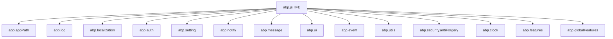

The `@abp/core` package is the foundation of ABP Framework's client-side runtime. It ships a single self-contained file — `npm/packs/core/src/abp.js` — that defines a global `abp` object whose sub-namespaces mirror the server-side ABP services: `abp.localization`, `abp.auth`, `abp.setting`, `abp.features`, `abp.globalFeatures`, `abp.notify`, `abp.message`, `abp.ui`, `abp.event`, `abp.utils`, `abp.clock` and `abp.security.antiForgery`. This page walks through every namespace defined in the 882-line source file, with literal excerpts and the call sites that connect them to higher-level packs like `@abp/aspnetcore.mvc.ui.theme.shared`.

The package depends only on `@abp/utils` (Angular-flavoured `LinkedList`) and is loaded before every other ABP script in both MVC and Blazor Server hosts. Razor Pages get it via `npm/packs/core/abp.resourcemapping.js` → `wwwroot/libs/abp/core/abp.js`; Blazor Server gets the parallel `framework/src/Volo.Abp.AspNetCore.Components.Web/wwwroot/libs/abp/js/abp.js` file referenced from `BlazorGlobalScriptContributor.cs`. See [`/blazor/overview`](/blazor/overview) for the Blazor loading order and [`/ui-mvc/overview`](/ui-mvc/overview) for the MVC pipeline.

## Package layout

The pack on disk is minimal:

```text
npm/packs/core/
├── README.md
├── abp.resourcemapping.js
├── package.json
└── src/
    ├── abp.css
    └── abp.js
```

`npm/packs/core/package.json` declares only the runtime dependency on `@abp/utils`:

```json
{
  "version": "10.2.0-rc.3",
  "name": "@abp/core",
  "dependencies": { "@abp/utils": "~10.2.0-rc.3" }
}
```

`npm/packs/core/abp.resourcemapping.js` instructs ABP CLI to copy the entire `src/` folder to `wwwroot/libs/abp/core/` rather than the default `dist/` layout:

```js
module.exports = {
    mappings: {
        "@node_modules/@abp/core/src/*": "@libs/abp/core/"
    }
}
```

## Top-level structure of abp.js

The file is wrapped in a single IIFE that lazily initializes each sub-namespace using the `abp.X = abp.X || {}` idiom — so a host page can pre-populate values (for example by emitting `abp.localization.values = {...}` from a server-rendered script tag) before `abp.js` runs.



A high-level mapping between sub-namespaces and the line ranges of `npm/packs/core/src/abp.js`:

| Namespace | Lines | Implements |
| --- | --- | --- |
| `abp.appPath`, `abp.toAbsAppPath` | 4–20 | Application root resolution from `<base href="…">` |
| `abp.log` | 21–73 | `DEBUG / INFO / WARN / ERROR / FATAL` levels |
| `abp.localization` | 75–211 | `localize(key, sourceName)`, `getResource(name)`, `isLocalized` |
| `abp.auth` | 213–262 | Granted-policy lookup + auth-token cookie |
| `abp.setting` | 265–283 | Strongly-typed access to setting values |
| `abp.notify` | 285–303 | Stubs for `success/info/warn/error` (overridden by `@abp/toastr`) |
| `abp.message` | 305–355 | Stubs for `info/success/warn/error/confirm/prompt` (overridden by `@abp/sweetalert2`) |
| `abp.ui` | 356–453 | `block / unblock / setBusy / clearBusy` using `.abp-block-area` div |
| `abp.event` | 455–510 | Simple synchronous pub/sub bus |
| `abp.utils` | 516–747 | `formatString`, `createNamespace`, `toCamelCase`, `buildQueryString`, cookies |
| `abp.security.antiForgery` | 749–758 | `XSRF-TOKEN` cookie + `RequestVerificationToken` header name |
| `abp.clock` | 760–856 | Time-zone normalization for the configured `Unspecified / Utc / Local` kind |
| `abp.features` | 858–871 | Per-tenant feature toggles |
| `abp.globalFeatures` | 873–880 | Compile-time global feature flags |

## abp.localization

Server-rendered scripts dump translation dictionaries onto `abp.localization.values` and resource metadata onto `abp.localization.resources`. The runtime entry point is `abp.localization.localize(key, sourceName, ...args)`:

```js
abp.localization.localize = function (key, sourceName) {
    if (sourceName === '_') { //A convention to suppress the localization
        return key;
    }

    if (sourceName) {
        return abp.localization.internal.localize.apply(this, arguments).value;
    }

    if (!abp.localization.defaultResourceName) {
        abp.log.warn('Localization source name is not specified and the defaultResourceName was not defined!');
        return key;
    }

    var copiedArguments = Array.prototype.slice.call(arguments, 0);
    copiedArguments.splice(1, 1, abp.localization.defaultResourceName);

    return abp.localization.internal.localize.apply(this, copiedArguments).value;
};
```

The internal helper `abp.localization.internal.localize` walks `resource.baseResources` so a module can inherit translations from its parent — exactly the pattern used by `AbpUi` falling back to other base resources.

`abp.localization.getResource(name)` returns a curried function that the rest of ABP scripts use as `var l = abp.localization.getResource('AbpUi'); l('SomeKey');` — a pattern visible in `framework/src/Volo.Abp.AspNetCore.Mvc.UI.Theme.Shared/wwwroot/libs/abp/aspnetcore-mvc-ui-theme-shared/datatables/datatables-extensions.js`:

```js
var localize = function (key) {
    return abp.localization.getResource('AbpUi')(key);
};
```

Formatting uses `abp.utils.formatString` (defined further down in the same file): `'Hello {0}'` placeholders are replaced positionally.

## abp.auth

`abp.auth.grantedPolicies` is a plain object keyed by permission name. Three predicate helpers are exposed:

```js
abp.auth.isGranted = function (policyName) {
    return abp.auth.grantedPolicies[policyName] != undefined;
};

abp.auth.isAnyGranted = function () { /* OR over arguments */ };
abp.auth.areAllGranted = function () { /* AND over arguments */ };
```

Token management uses the `Abp.AuthToken` cookie name (configurable through `abp.auth.tokenCookieName`):

```js
abp.auth.tokenCookieName = 'Abp.AuthToken';
abp.auth.setToken = function (authToken, expireDate) {
    abp.utils.setCookieValue(abp.auth.tokenCookieName, authToken, expireDate, abp.appPath, abp.domain);
};
abp.auth.getToken  = function () { return abp.utils.getCookieValue(abp.auth.tokenCookieName); };
abp.auth.clearToken = function () { abp.auth.setToken(); };
```

`abp.auth.setToken()` with no argument is the documented way to clear the cookie — note it uses `abp.appPath` so the cookie path matches the application root even when the app is hosted in a sub-directory.

## abp.setting

Settings are exposed as a flat dictionary `abp.setting.values` (populated from `/abp/Abp/ApplicationConfigurationScript`). Three accessors are defined:

```js
abp.setting.get        = function (name) { return abp.setting.values[name]; };
abp.setting.getBoolean = function (name) {
    var value = abp.setting.get(name);
    return value == 'true' || value == 'True';
};
abp.setting.getInt     = function (name) { return parseInt(abp.setting.values[name]); };
```

The double check for `'true'` and `'True'` mirrors C# `bool.Parse` permissiveness — `abp.setting.values` contains plain strings because the wire format is JSON-rendered C# `Dictionary<string, string>`.

## abp.features and abp.globalFeatures

Per-tenant feature toggles use `abp.features.values`:

```js
abp.features.isEnabled = function(name){
    var value = abp.features.get(name);
    return value == 'true' || value == 'True';
}

abp.features.get = function (name) {
    return abp.features.values[name];
};
```

Global features (compile-time toggles for entire modules) use an array-based lookup:

```js
abp.globalFeatures.enabledFeatures = abp.globalFeatures.enabledFeatures || [];
abp.globalFeatures.isEnabled = function(name){
    return abp.globalFeatures.enabledFeatures.indexOf(name) != -1;
}
```

This split mirrors the server-side `IFeatureChecker` vs `IGlobalFeatureChecker` services.

## abp.notify (stub)

The `notify` namespace is purely a contract — every method emits a warning until a vendor wrapper plugs in:

```js
abp.notify.success = function (message, title, options) {
    abp.log.warn('abp.notify.success is not implemented!');
};
abp.notify.info  = function (...) { abp.log.warn('abp.notify.info is not implemented!'); };
abp.notify.warn  = function (...) { abp.log.warn('abp.notify.warn is not implemented!'); };
abp.notify.error = function (...) { abp.log.warn('abp.notify.error is not implemented!'); };
```

The default implementation is the new `AbpToastService` shipped in `framework/src/Volo.Abp.AspNetCore.Mvc.UI.Theme.Shared/wwwroot/libs/abp/aspnetcore-mvc-ui-theme-shared/toast/abp-toast.js`, which replaces the older `@abp/toastr` integration. Either implementation overrides the same four methods.

## abp.message (stub)

`abp.message` is the dialog API: `info / success / warn / error / confirm / prompt`. Default implementations only log warnings. `@abp/sweetalert2`'s `abp-sweetalert2.js` shim in `Volo.Abp.AspNetCore.Mvc.UI.Theme.Shared/wwwroot/libs/abp/aspnetcore-mvc-ui-theme-shared/sweetalert2/` overrides them with `Swal.fire` calls. The default `_showMessage` is a deliberate `alert()` fallback so that headless scripts still surface the message:

```js
abp.message._showMessage = function (message, title) {
    alert((title || '') + ' ' + message);
};
```

`abp.message.confirm` and `abp.message.prompt` accept a positional `titleOrCallback` shape — the SweetAlert shim normalizes both to a jQuery `$.Deferred` to keep the call sites compatible with the older `bootbox` integration.

## abp.ui

UI blocking is implemented directly inside core (unlike notify/message). A single `<div class="abp-block-area">` is reused across calls:

```js
var $abpBlockArea = document.createElement('div');
$abpBlockArea.classList.add('abp-block-area');

abp.ui.block = function (opts) {
    // … normalizes opts to { elm, busy, promise }
    if (document.querySelector(opts.elm)) {
        $abpBlockArea.style.position = 'absolute';
    } else {
        $abpBlockArea.style.position = 'fixed';
    }
    $elm.appendChild($abpBlockArea);
    if (opts.promise) {
        if (opts.promise.always)        { opts.promise.always(function () { abp.ui.unblock({$elm: opts.elm}); }); }
        else if (opts.promise['finally']) { opts.promise['finally'](function () { abp.ui.unblock({$elm: opts.elm}); }); }
    }
};
```

It auto-unblocks when given either a jQuery `Deferred` (`.always`) or a Q-style promise (`.finally`). `setBusy` / `clearBusy` are convenience aliases that pre-set `busy: true`. The accompanying CSS lives in `npm/packs/core/src/abp.css`.

## abp.event

A 50-line synchronous pub/sub bus implemented as a self-contained IIFE returning `{on, off, trigger}`:

```js
abp.event = (function () {
    var _callbacks = {};

    var on = function (eventName, callback) {
        if (!_callbacks[eventName]) { _callbacks[eventName] = []; }
        _callbacks[eventName].push(callback);
    };

    var trigger = function (eventName) {
        var callbacks = _callbacks[eventName];
        if (!callbacks || !callbacks.length) return;
        var args = Array.prototype.slice.call(arguments, 1);
        for (var i = 0; i < callbacks.length; i++) {
            try { callbacks[i].apply(this, args); } catch(e) { console.error(e); }
        }
    };

    return { on: on, off: off, trigger: trigger };
})();
```

Errors thrown by listeners are caught and routed to `console.error` so a single bad subscriber cannot break the rest. The framework triggers `abp.configurationInitialized` after `/abp/Abp/ApplicationConfigurationScript` finishes loading — `abp.clock` registers a listener that copies the browser time zone into a cookie:

```js
abp.event.on('abp.configurationInitialized', function () {
    abp.clock.setBrowserTimeZoneToCookie();
});
```

## abp.utils

The utility namespace mixes string helpers, query-string building, and a cookie API. Highlights:

| Symbol | Purpose |
| --- | --- |
| `abp.utils.createNamespace(root, ns)` | Dotted-path namespace bootstrap (`abp.utils.createNamespace(abp, 'services.task')` → `abp.services.task`) |
| `abp.utils.replaceAll(str, search, replacement)` | Regex-escaped global replace |
| `abp.utils.formatString(template, ...)` | C# `string.Format` for `{0}`-style placeholders |
| `abp.utils.toPascalCase` / `toCamelCase` | Single-char case toggle on first letter |
| `abp.utils.truncateString(str, maxLength)` | Plain truncation |
| `abp.utils.truncateStringWithPostfix(str, maxLength, postfix='...')` | Truncation that fits the postfix |
| `abp.utils.isFunction(obj)` | Duck-typing check |
| `abp.utils.buildQueryString(parameterInfos, includeQuestionMark=true)` | Builds `?a=1&b[0]=x&b[1]=y`; handles `toJSON` and arrays |
| `abp.utils.setCookieValue(key, value, expireDate, path)` | Minimal cookie writer (encodes key) |
| `abp.utils.getCookieValue(key)` | Reads a single cookie value |
| `abp.utils.deleteCookie(key, path)` | Sets expiry to the epoch |
| `abp.utils.htmlEscape(html)` | Used by `abp.message.*` to defuse XSS in dialogs |

`abp.utils.formatString` is intentionally minimal:

```js
abp.utils.formatString = function () {
    if (arguments.length < 1) { return null; }
    var str = arguments[0];
    for (var i = 1; i < arguments.length; i++) {
        var placeHolder = '{' + (i - 1) + '}';
        str = abp.utils.replaceAll(str, placeHolder, arguments[i]);
    }
    return str;
};
```

`abp.utils.buildQueryString` is the canonical client-side parameter encoder used by the dynamic auto-completion select widgets defined in the theme.shared pack. It applies three rules:

1. `undefined` values are skipped entirely.
2. `null` values are coerced to `''`.
3. Arrays are flattened to indexed `name[0]=…&name[1]=…` form.

## abp.security.antiForgery

Two constants and a single getter:

```js
abp.security.antiForgery.tokenCookieName = 'XSRF-TOKEN';
abp.security.antiForgery.tokenHeaderName = 'RequestVerificationToken';

abp.security.antiForgery.getToken = function () {
    return abp.utils.getCookieValue(abp.security.antiForgery.tokenCookieName);
};
```

Theme.shared's `jquery-form-extensions.js` reads `getToken()` and attaches it as the `RequestVerificationToken` header on every AJAX form submission, matching the server's `[AutoValidateAntiforgeryToken]` filter behaviour.

## abp.clock

`abp.clock.kind` defaults to `'Unspecified'`; the server can override it to `'Utc'` or `'Local'` based on the resolved `IClock`. `normalizeToString(date)` adapts a JS `Date` into the matching server-side string format. `normalizeToLocaleString(dateString, options)` uses `Intl.DateTimeFormat` to localize, falling back to the defaults declared at the top of the namespace:

```js
abp.clock.toLocaleStringOptions = abp.clock.toLocaleStringOptions || {
    // dateStyle, timeStyle, …
};
```

When `abp.clock.supportsMultipleTimezone()` returns true (it does whenever `kind === 'Utc'`), the framework wires `setBrowserTimeZoneToCookie` to run after configuration initialization so the back-end can return UTC values that the client renders in the user's tz.

## Loading order in an MVC host

```mermaid
sequenceDiagram
    participant Browser
    participant Razor
    participant Bundles
    Razor->>Browser: Render &lt;script src="/libs/abp/core/abp.js"&gt;
    Browser->>Browser: abp namespace created
    Razor->>Browser: Render /abp/Abp/ApplicationConfigurationScript
    Browser->>Browser: abp.localization.values, abp.auth.grantedPolicies, abp.setting.values populated
    Razor->>Browser: Load theme.shared bundles (sweetalert2, toast, jquery-form)
    Browser->>Browser: abp.message, abp.notify overrides take effect
    Browser->>Browser: abp.event.trigger('abp.configurationInitialized')
```

The `application-configuration-script` endpoint returned by `framework/src/Volo.Abp.AspNetCore.Mvc.UI/` produces inline JS that assigns into the `abp.*` containers created by `abp.js` — for example writing `abp.auth.grantedPolicies = {…}` and `abp.localization.values = {…}`. The trailing `abp.event.trigger('abp.configurationInitialized')` is what wakes up `abp.clock`'s cookie writer.

## Differences in the Blazor Server build

`framework/src/Volo.Abp.AspNetCore.Components.Web/wwwroot/libs/abp/js/abp.js` is a slimmer 258-line variant of the same file. Blazor Server doesn't need the localization or feature engines on the client (those live in C#), so the file only ships:

- `abp.domReady(fn)` — a small DOM-ready helper used by Blazor circuit bootstrappers.
- `abp.utils.setCookieValue` / `getCookieValue` — identical implementations to the MVC version.

`BlazorGlobalScriptContributor` adds it to every Blazor Server bundle:

```csharp
public override void ConfigureBundle(BundleConfigurationContext context)
{
    var options = context.ServiceProvider.GetRequiredService<IOptions<AbpAspNetCoreComponentsWebOptions>>().Value;
    if (!options.IsBlazorWebApp)
    {
        context.Files.AddIfNotContains("/_framework/blazor.server.js");
    }
    context.Files.AddIfNotContains("/_content/Volo.Abp.AspNetCore.Components.Web/libs/abp/js/abp.js");
    context.Files.AddIfNotContains("/_content/Volo.Abp.AspNetCore.Components.Web/libs/abp/js/authentication-state-listener.js");
}
```

See [`/blazor/overview`](/blazor/overview) for how the Blazor circuit connects to these scripts.

## Extension hooks

Two patterns are used throughout the codebase to extend `abp.*`:

<Steps>
  <Step title="Override stub methods">
    Vendor wrappers like `abp-sweetalert2.js` simply reassign the namespace functions:
    ```js
    abp.message.info = function (message, title) { return showMessage('info', message, title); };
    ```
    Because the original definition is a no-op, this is the supported override mechanism — there is no hidden registration table.
  </Step>
  <Step title="Add new sub-namespaces">
    Higher-level packs add their own properties without touching the core file. The widget manager registers `abp.widgets` (in `Volo.Abp.AspNetCore.Mvc.UI.Theme.Shared/wwwroot/libs/abp/aspnetcore-mvc-ui-theme-shared/jquery/widget-manager.js`) and CMS Kit pages then assign `abp.widgets.CmsCommenting = function ($widget) {…}`.
  </Step>
  <Step title="Subscribe to lifecycle events">
    `abp.event.on('abp.configurationInitialized', fn)` is the post-bootstrap hook. Custom code that depends on `abp.setting.values` or `abp.localization.values` should subscribe rather than running at module top-level.
  </Step>
</Steps>

## Related references

- [`@abp/utils`](/js-packs/utils) — the `LinkedList` dependency.
- [`@abp/aspnetcore.mvc.ui.theme.shared`](/js-packs/theme-shared-pack) — provides the `abp.message` / `abp.notify` / widget-manager implementations.
- [`/ui-mvc/bundling`](/ui-mvc/bundling) — how `abp.js` ends up in the rendered HTML.
- [`/ui-mvc/overview`](/ui-mvc/overview) — the MVC module that emits `application-configuration-script`.
- [`/blazor/overview`](/blazor/overview) — how the slimmer Blazor variant is loaded.
