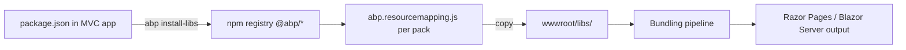
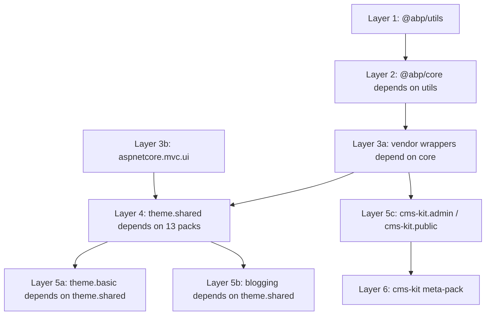
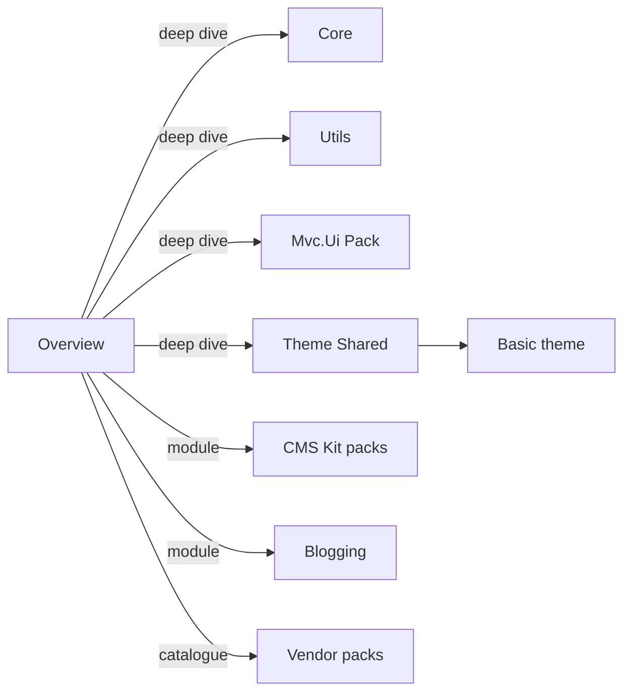

The `npm/packs/` directory in the ABP Framework repository is a mono-folder of `@abp/*` npm packages. Each subdirectory is a thin wrapper around either a first-party client-side file (such as the `abp` JavaScript namespace), an ABP-specific shim layered on top of a vendor library (such as `@abp/sweetalert2` mapping SweetAlert2 into `abp.message`), or a vendor passthrough (such as `@abp/jquery`). This page covers the catalog as a whole — versioning, how packs are consumed via bundling, the `abp.resourcemapping.js` convention that lifts files under `wwwroot/libs/`, and the dependency graph between packs.

This catalog is the upstream source for the `wwwroot/libs/` folder of every ABP MVC and Blazor Server application. ABP CLI commands like `abp install-libs` resolve a project's `package.json`, fetch matching `@abp/*` packages from npm, and copy a configurable subset of files into `wwwroot/libs/<pack-name>/`. The result is reproducible client-side dependencies that follow the rest of the ABP module versioning (currently `10.2.0-rc.3` for the source tree examined here).

## How packs reach a running application

`npm/packs/*/package.json` files declare both the upstream vendor package (e.g. `"bootstrap": "^5.3.8"`) and the `@abp/*` peers (e.g. `"@abp/core": "~10.2.0-rc.3"`). Several packs also ship an `abp.resourcemapping.js` that overrides ABP CLI's default file-copy rules. For example, `npm/packs/core/abp.resourcemapping.js` rewrites `@node_modules/@abp/core/src/*` → `@libs/abp/core/`, so that `abp.js` lands at `wwwroot/libs/abp/core/abp.js`.



See [`/ui-mvc/bundling`](/ui-mvc/bundling) for how the C# bundling pipeline consumes the files copied here, and [`/ui-mvc/overview`](/ui-mvc/overview) for the wider MVC UI architecture. Blazor Server applications follow the same pipeline through `BlazorGlobalScriptContributor` — see [`/blazor/overview`](/blazor/overview).

## Complete pack catalog

Every entry in the table below corresponds to a directory under `npm/packs/` in the source tree. The "Role" column groups packs into four classes:

- **Framework** — `@abp/core`, `@abp/utils`, `@abp/aspnetcore.mvc.ui*`, `@abp/aspnetcore.components.server.*`
- **Module** — `@abp/cms-kit*`, `@abp/blogging` (depend on framework packs)
- **Vendor wrapper** — Pins and re-exports an upstream library, often via an `abp.*` shim under `Volo.Abp.AspNetCore.Mvc.UI.Theme.Shared/wwwroot/libs/abp/aspnetcore-mvc-ui-theme-shared/`
- **Meta-pack** — Only depends on other `@abp/*` packs; has no own files (e.g. `@abp/cms-kit` is just `cms-kit.admin + cms-kit.public`)

| Directory | npm name | Role | Upstream / depends on | Deep dive |
| --- | --- | --- | --- | --- |
| `anchor-js` | `@abp/anchor-js` | Vendor wrapper | `anchor-js ^5.0.0` | [Vendor packs](/js-packs/third-party-vendor-packs) |
| `aspnetcore.components.server.basictheme` | `@abp/aspnetcore.components.server.basictheme` | Framework / theme | `@abp/aspnetcore.components.server.theming` | [Basic theme pack](/js-packs/theme-basic-pack) |
| `aspnetcore.components.server.theming` | `@abp/aspnetcore.components.server.theming` | Framework | `@abp/bootstrap`, `@abp/font-awesome` | [Theme shared pack](/js-packs/theme-shared-pack) |
| `aspnetcore.mvc.ui` | `@abp/aspnetcore.mvc.ui` | Framework | `ansi-colors ^4.1.3` | [MVC UI pack](/js-packs/aspnetcore-mvc-ui) |
| `aspnetcore.mvc.ui.theme.basic` | `@abp/aspnetcore.mvc.ui.theme.basic` | Framework / theme | `@abp/aspnetcore.mvc.ui.theme.shared` | [Basic theme pack](/js-packs/theme-basic-pack) |
| `aspnetcore.mvc.ui.theme.shared` | `@abp/aspnetcore.mvc.ui.theme.shared` | Framework | 14 vendor + framework packs | [Theme shared pack](/js-packs/theme-shared-pack) |
| `blogging` | `@abp/blogging` | Module | `theme.shared`, `owl.carousel`, `prismjs`, `tui-editor` | [Blogging pack](/js-packs/blogging-pack) |
| `bootstrap` | `@abp/bootstrap` | Vendor wrapper | `bootstrap ^5.3.8`, `@abp/popper.js` | [Vendor packs](/js-packs/third-party-vendor-packs) |
| `bootstrap-datepicker` | `@abp/bootstrap-datepicker` | Vendor wrapper | `bootstrap-datepicker ^1.10.1` | [Vendor packs](/js-packs/third-party-vendor-packs) |
| `bootstrap-daterangepicker` | `@abp/bootstrap-daterangepicker` | Vendor wrapper | `bootstrap-daterangepicker ^3.1.0`, `@abp/moment` | [Vendor packs](/js-packs/third-party-vendor-packs) |
| `chart.js` | `@abp/chart.js` | Vendor wrapper | `chart.js ^4.5.0` | [Vendor packs](/js-packs/third-party-vendor-packs) |
| `clipboard` | `@abp/clipboard` | Vendor wrapper | `clipboard ^2.0.11` | [Vendor packs](/js-packs/third-party-vendor-packs) |
| `cms-kit` | `@abp/cms-kit` | Meta-pack | `cms-kit.admin + cms-kit.public` | [CMS Kit packs](/js-packs/cms-kit-packs) |
| `cms-kit.admin` | `@abp/cms-kit.admin` | Module | `codemirror`, `jstree`, `markdown-it`, `slugify`, `tui-editor`, `uppy` | [CMS Kit packs](/js-packs/cms-kit-packs) |
| `cms-kit.public` | `@abp/cms-kit.public` | Module | `highlight.js`, `star-rating-svg` | [CMS Kit packs](/js-packs/cms-kit-packs) |
| `codemirror` | `@abp/codemirror` | Vendor wrapper | `codemirror ^5.65.1` | [Vendor packs](/js-packs/third-party-vendor-packs) |
| `core` | `@abp/core` | Framework | `@abp/utils`; ships `abp.js`, `abp.css` | [Core](/js-packs/core) |
| `cropperjs` | `@abp/cropperjs` | Vendor wrapper | `cropperjs ^1.6.2` | [Vendor packs](/js-packs/third-party-vendor-packs) |
| `datatables.net` | `@abp/datatables.net` | Vendor wrapper | `datatables.net ^2.3.4`, `@abp/jquery` | [Vendor packs](/js-packs/third-party-vendor-packs) |
| `datatables.net-bs4` | `@abp/datatables.net-bs4` | Vendor wrapper | `datatables.net-bs4 ^2.3.4` | [Vendor packs](/js-packs/third-party-vendor-packs) |
| `datatables.net-bs5` | `@abp/datatables.net-bs5` | Vendor wrapper | `datatables.net-bs5 ^2.3.4` | [Vendor packs](/js-packs/third-party-vendor-packs) |
| `docs` | `@abp/docs` | Module | (Volo.Docs module wrapper) | n/a — handled by Docs module |
| `flag-icon-css` | `@abp/flag-icon-css` | Vendor wrapper | `flag-icon-css ^4.1.7` (legacy) | [Vendor packs](/js-packs/third-party-vendor-packs) |
| `flag-icons` | `@abp/flag-icons` | Vendor wrapper | `flag-icons 7.5.0` | [Vendor packs](/js-packs/third-party-vendor-packs) |
| `font-awesome` | `@abp/font-awesome` | Vendor wrapper | `@fortawesome/fontawesome-free ^7.0.1` | [Vendor packs](/js-packs/third-party-vendor-packs) |
| `highlight.js` | `@abp/highlight.js` | Vendor wrapper | `@highlightjs/cdn-assets ~11.11.1` | [Vendor packs](/js-packs/third-party-vendor-packs) |
| `jquery` | `@abp/jquery` | Vendor wrapper | `jquery ~3.7.1` | [Vendor packs](/js-packs/third-party-vendor-packs) |
| `jquery-form` | `@abp/jquery-form` | Vendor wrapper | `jquery-form ^4.3.0` | [Vendor packs](/js-packs/third-party-vendor-packs) |
| `jquery-validation` | `@abp/jquery-validation` | Vendor wrapper | `jquery-validation ^1.21.0` | [Vendor packs](/js-packs/third-party-vendor-packs) |
| `jquery-validation-unobtrusive` | `@abp/jquery-validation-unobtrusive` | Vendor wrapper | `jquery-validation-unobtrusive ^4.0.0` | [Vendor packs](/js-packs/third-party-vendor-packs) |
| `jstree` | `@abp/jstree` | Vendor wrapper | `jstree ^3.3.17` | [Vendor packs](/js-packs/third-party-vendor-packs) |
| `lodash` | `@abp/lodash` | Vendor wrapper | `lodash ^4.17.21` | [Vendor packs](/js-packs/third-party-vendor-packs) |
| `luxon` | `@abp/luxon` | Vendor wrapper | `luxon ^3.7.2` | [Vendor packs](/js-packs/third-party-vendor-packs) |
| `malihu-custom-scrollbar-plugin` | `@abp/malihu-custom-scrollbar-plugin` | Vendor wrapper | `malihu-custom-scrollbar-plugin ^3.1.5` | [Vendor packs](/js-packs/third-party-vendor-packs) |
| `markdown-it` | `@abp/markdown-it` | Vendor wrapper | `markdown-it ^14.1.0` | [Vendor packs](/js-packs/third-party-vendor-packs) |
| `moment` | `@abp/moment` | Vendor wrapper | `moment ^2.30.1` | [Vendor packs](/js-packs/third-party-vendor-packs) |
| `owl.carousel` | `@abp/owl.carousel` | Vendor wrapper | `owl.carousel ^2.3.4` | [Vendor packs](/js-packs/third-party-vendor-packs) |
| `popper.js` | `@abp/popper.js` | Vendor wrapper | `@popperjs/core ^2.11.8` | [Vendor packs](/js-packs/third-party-vendor-packs) |
| `prismjs` | `@abp/prismjs` | Vendor wrapper | `prismjs ^1.30.0`, `@abp/clipboard` | [Vendor packs](/js-packs/third-party-vendor-packs) |
| `qrcode` | `@abp/qrcode` | Vendor wrapper | `@abp/core` (no upstream pin — uses local file) | [Vendor packs](/js-packs/third-party-vendor-packs) |
| `select2` | `@abp/select2` | Vendor wrapper | `select2 ^4.0.13` | [Vendor packs](/js-packs/third-party-vendor-packs) |
| `signalr` | `@abp/signalr` | Vendor wrapper | `@microsoft/signalr ~9.0.6` | [Vendor packs](/js-packs/third-party-vendor-packs) |
| `slugify` | `@abp/slugify` | Vendor wrapper | `slugify ^1.6.6` | [Vendor packs](/js-packs/third-party-vendor-packs) |
| `star-rating-svg` | `@abp/star-rating-svg` | Vendor wrapper | `star-rating-svg ^3.5.0` | [Vendor packs](/js-packs/third-party-vendor-packs) |
| `sweetalert2` | `@abp/sweetalert2` | Vendor wrapper | `sweetalert2 ^11.23.0` | [Vendor packs](/js-packs/third-party-vendor-packs) |
| `timeago` | `@abp/timeago` | Vendor wrapper | `timeago ^1.6.7` | [Vendor packs](/js-packs/third-party-vendor-packs) |
| `toastr` | `@abp/toastr` | Vendor wrapper | `toastr ^2.1.4` | [Vendor packs](/js-packs/third-party-vendor-packs) |
| `tui-editor` | `@abp/tui-editor` | Vendor wrapper | `@abp/jquery`, `@abp/prismjs` | [Vendor packs](/js-packs/third-party-vendor-packs) |
| `uppy` | `@abp/uppy` | Vendor wrapper | `uppy ^5.1.2` | [Vendor packs](/js-packs/third-party-vendor-packs) |
| `utils` | `@abp/utils` | Framework | `just-compare ^2.3.0`; Angular ng-packagr build | [Utils](/js-packs/utils) |
| `vee-validate` | `@abp/vee-validate` | Vendor wrapper | `vee-validate ~3.4.4`, `@abp/vue` | [Vendor packs](/js-packs/third-party-vendor-packs) |
| `virtual-file-explorer` | `@abp/virtual-file-explorer` | Module | virtual-file-explorer module wrapper | n/a — handled by VFE module |
| `vue` | `@abp/vue` | Vendor wrapper | `vue ~2.6.12` | [Vendor packs](/js-packs/third-party-vendor-packs) |
| `zxcvbn` | `@abp/zxcvbn` | Vendor wrapper | `zxcvbn ^4.4.2` | [Vendor packs](/js-packs/third-party-vendor-packs) |

The listing above is generated from a literal `ls npm/packs/` of the repository. The total currently sits at 53 directories plus the `npm-check-updates.ps1` helper script that bumps all dependency ranges in one pass.

## Version numbering

All `@abp/*` packs share the ABP Framework version (`10.2.0-rc.3` at the snapshot used here). `core/package.json` is the canonical example:

```json
{
  "version": "10.2.0-rc.3",
  "name": "@abp/core",
  "dependencies": { "@abp/utils": "~10.2.0-rc.3" }
}
```

Vendor pins are independent of the framework version. For instance `npm/packs/bootstrap/package.json` pairs framework `10.2.0-rc.3` with upstream `bootstrap ^5.3.8`. Because cross-pack `@abp/*` dependencies use the `~` (tilde) range and pin the patch level, every framework release atomically bumps all packs together — a developer cannot accidentally end up with mismatched `@abp/core@10.1.x` and `@abp/aspnetcore.mvc.ui@10.2.x`.

## Dependency layering

The four-layer model below captures every `npm/packs/*/package.json` dependency declaration in the tree.



The actual `dependencies` block of `npm/packs/aspnetcore.mvc.ui.theme.shared/package.json` lists, alphabetically: `@abp/aspnetcore.mvc.ui`, `@abp/bootstrap`, `@abp/bootstrap-datepicker`, `@abp/bootstrap-daterangepicker`, `@abp/datatables.net-bs5`, `@abp/font-awesome`, `@abp/jquery-validation-unobtrusive`, `@abp/lodash`, `@abp/luxon`, `@abp/malihu-custom-scrollbar-plugin`, `@abp/moment`, `@abp/select2`, `@abp/sweetalert2`, `@abp/timeago`. Installing `@abp/aspnetcore.mvc.ui.theme.shared` therefore transitively pulls in the full default toolbox of a Razor Pages ABP app.

## Resource mapping convention

ABP CLI's `install-libs` command copies files from `node_modules/<pkg>/` into `wwwroot/libs/<pkg>/`. Packs that need a non-default layout ship an `abp.resourcemapping.js`. The canonical example sits at `npm/packs/core/abp.resourcemapping.js`:

```js
module.exports = {
    mappings: {
        "@node_modules/@abp/core/src/*": "@libs/abp/core/"
    }
}
```

That mapping is why a Razor Pages host can write `<script src="~/libs/abp/core/abp.js"></script>` even though the file physically lives in `node_modules/@abp/core/src/abp.js` at install time. The `utils` pack uses a different approach — it is built with `ng-packagr` and publishes a UMD bundle (`dist/bundles/abp-utils.umd.js`) plus FESM2015 (`dist/fesm2015/abp-utils.js`) and typings, as declared in `npm/packs/utils/package.json` (`"main"`, `"module"`, `"typings"`).

<Note>
Vendor wrappers that ship no `abp.resourcemapping.js` rely on ABP CLI's automatic copy of all `dist/` files. `bootstrap-daterangepicker` is one example: ABP CLI copies the upstream `daterangepicker.js`, `daterangepicker.css`, and minified variants directly into `wwwroot/libs/bootstrap-daterangepicker/`.
</Note>

## Where the JavaScript actually lives

A new contributor often expects to find Razor-page JavaScript inside `npm/packs/aspnetcore.mvc.ui.theme.shared/`. In practice the **NPM pack is mostly a manifest**: the JS source code lives next to its consuming C# project under `framework/src/Volo.Abp.AspNetCore.Mvc.UI.Theme.Shared/wwwroot/libs/abp/aspnetcore-mvc-ui-theme-shared/`. Module-specific JS lives under `modules/cms-kit/src/Volo.CmsKit.*.Web/Pages/` or `modules/blogging/src/Volo.Blogging.Web/Pages/`. The npm pack exists to coordinate **versioned redistribution** to downstream consumers (modular monolith apps, microservices, tiered solutions).

| Pack | NPM pack contents | Real JS location |
| --- | --- | --- |
| `@abp/core` | `src/abp.js`, `src/abp.css`, `abp.resourcemapping.js` | Same — pack ships the source |
| `@abp/utils` | Angular ng-packagr project under `projects/utils/src/` | Same — `LinkedList` TS source |
| `@abp/aspnetcore.mvc.ui` | Empty (only `package.json`, `README.md`) | `framework/src/Volo.Abp.AspNetCore.Mvc.UI/` C# project |
| `@abp/aspnetcore.mvc.ui.theme.shared` | Empty | `framework/src/Volo.Abp.AspNetCore.Mvc.UI.Theme.Shared/wwwroot/libs/abp/aspnetcore-mvc-ui-theme-shared/` |
| `@abp/aspnetcore.mvc.ui.theme.basic` | Empty | `modules/basic-theme/src/Volo.Abp.AspNetCore.Mvc.UI.Theme.Basic/wwwroot/themes/basic/layout.js` |
| `@abp/cms-kit.admin` | Empty | `modules/cms-kit/src/Volo.CmsKit.Admin.Web/Pages/CmsKit/**` |
| `@abp/cms-kit.public` | Empty | `modules/cms-kit/src/Volo.CmsKit.Public.Web/Pages/**` |
| `@abp/blogging` | Empty | `modules/blogging/src/Volo.Blogging.Web/Pages/Blogs/**` |

## Building and publishing

The `npm/packs/utils/` directory is the only pack with a non-trivial build. It is an Angular library project — `npm/packs/utils/angular.json`, `tsconfig.base.json`, `ng-packagr` config — that compiles `projects/utils/src/lib/linked-list.ts` into the published `dist/`. All other packs publish their working tree as-is. The `prepublishOnly` script in `npm/packs/utils/package.json` runs `yarn install --ignore-scripts && node prepublish.js`.

Publishing is coordinated by the repo-level `npm-check-updates.ps1` helper which sweeps every pack's `dependencies` block to keep cross-pack `~10.2.0-rc.3` ranges in lockstep.

## Choosing a pack for a feature

<CardGroup cols={2}>
  <Card title="Core abp namespace" href="/js-packs/core" icon="cube">
    Localization, auth, settings, features, events — read the `@abp/core` deep dive.
  </Card>
  <Card title="MVC Razor Page hooks" href="/js-packs/aspnetcore-mvc-ui" icon="file-code">
    Dynamic dropdowns, datatables wrapper, page alerts — `@abp/aspnetcore.mvc.ui`.
  </Card>
  <Card title="Razor Pages toolbox" href="/js-packs/theme-shared-pack" icon="palette">
    Modal manager, jQuery validation, SweetAlert2 shim, toast — `aspnetcore.mvc.ui.theme.shared`.
  </Card>
  <Card title="Basic theme" href="/js-packs/theme-basic-pack" icon="brush">
    `aspnetcore.mvc.ui.theme.basic` plus the Blazor Server `BasicTheme` pack.
  </Card>
  <Card title="CMS Kit" href="/js-packs/cms-kit-packs" icon="newspaper">
    Page/blog/menu/comment widgets — `cms-kit`, `cms-kit.admin`, `cms-kit.public`.
  </Card>
  <Card title="Vendor wrappers" href="/js-packs/third-party-vendor-packs" icon="boxes-stacked">
    Pin versions for jQuery, Bootstrap, DataTables, Luxon, SignalR, Chart.js, …
  </Card>
</CardGroup>

## Per-pack file layout patterns

Three distinct file layouts appear across the catalogue:

| Pattern | Example packs | Files present |
| --- | --- | --- |
| Pure manifest | `aspnetcore.mvc.ui`, `aspnetcore.mvc.ui.theme.shared`, `aspnetcore.mvc.ui.theme.basic`, `cms-kit`, `cms-kit.admin`, `cms-kit.public`, `blogging`, `aspnetcore.components.server.theming`, `aspnetcore.components.server.basictheme` | `package.json`, `README.md` |
| Manifest + resource mapping | `bootstrap`, `sweetalert2`, `toastr`, `luxon`, `moment`, `chart.js`, `codemirror`, `prismjs`, `slugify`, `signalr`, and most vendor wrappers | + `abp.resourcemapping.js` |
| Manifest + resource mapping + first-party `src/` | `core`, `jquery`, `luxon`, `qrcode`, `tui-editor`, `bootstrap` | + `src/` directory holding ABP-side shims or vendored builds |
| Full Angular build project | `utils` only | `angular.json`, `tsconfig.*`, `projects/utils/`, `ng-packagr` |

`docs` and `virtual-file-explorer` are aggregator manifests for module wrappers — neither maps into `wwwroot/libs/` directly; both are pulled in only by the matching server-side modules.

## Pack version range conventions

The dependency declarations follow a consistent convention. Cross-`@abp/*` references pin the patch range with `~`:

```json
"@abp/core": "~10.2.0-rc.3"
```

Whereas upstream vendor pins use `^` (compatible-with) for the minor/patch range:

```json
"jquery":  "~3.7.1",
"bootstrap":  "^5.3.8",
"sweetalert2":  "^11.23.0"
```

A handful of vendors use the tighter `~` range when ABP relies on a specific minor branch — `jquery ~3.7.1` and `@microsoft/signalr ~9.0.6` are the most visible examples. Vue and vee-validate use `~2.6.12` and `~3.4.4` respectively because newer majors of those libraries are deliberate breaking changes ABP does not yet adopt.

## Anatomy of `npm/packs/npm-check-updates.ps1`

The PowerShell helper at the repo root of `npm/packs/` walks every pack and runs `npm-check-updates` against it. The script flags two layers separately:

1. The shared `@abp/*` ranges — these always get rewritten together so the lockstep version `10.2.0-rc.3` shifts atomically.
2. The upstream vendor ranges — these are flagged for review but are not auto-applied because vendor majors usually require corresponding source changes in `Volo.Abp.AspNetCore.Mvc.UI.Theme.Shared/wwwroot/libs/abp/aspnetcore-mvc-ui-theme-shared/*`.

Running the script is the standard pre-release ritual that produces every minor `@abp/*` bump that lands on npm.

## Default consumers

| Solution archetype | Packs typically installed |
| --- | --- |
| MVC starter (Razor Pages + Basic theme) | `@abp/aspnetcore.mvc.ui.theme.basic` (drags everything below it) |
| Blazor Server starter (Basic theme) | `@abp/aspnetcore.components.server.basictheme` (+ Bootstrap, Font Awesome) |
| MVC + CMS Kit monolith | `@abp/aspnetcore.mvc.ui.theme.basic` + `@abp/cms-kit` |
| MVC + Blogging (standalone) | `@abp/aspnetcore.mvc.ui.theme.basic` + `@abp/blogging` |
| Tiered MVC microservices | Theme pack on each web host; vendor packs picked per service |
| Angular SPA | `@abp/ng.core` family — outside the scope of `npm/packs/` |
| MAUI / Hybrid Blazor | `@abp/aspnetcore.components.server.theming` is the floor |

The Angular UI uses a separate `npm/ng-packs/` tree of `@abp/ng.*` packages — those are not catalogued on this page.

## Where to read next



Read the [Core](/js-packs/core) page first if you want to understand the `abp.*` runtime; read the [Theme Shared Pack](/js-packs/theme-shared-pack) page next to see how the SweetAlert / DataTables / Modal manager glue is wired; finish with the [Vendor packs](/js-packs/third-party-vendor-packs) reference when you need to find the right package for a feature.

## Related references

- [`/ui-mvc/bundling`](/ui-mvc/bundling) — how `wwwroot/libs/` files get bundled and minified.
- [`/ui-mvc/overview`](/ui-mvc/overview) — MVC UI module structure that consumes these packs.
- [`/blazor/overview`](/blazor/overview) — Blazor Server hosts that mount the same JS through `BlazorGlobalScriptContributor`.
