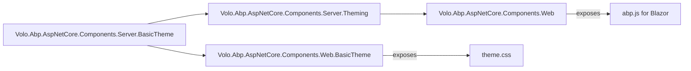
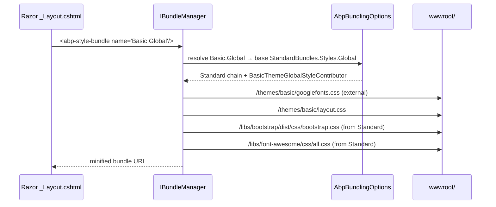
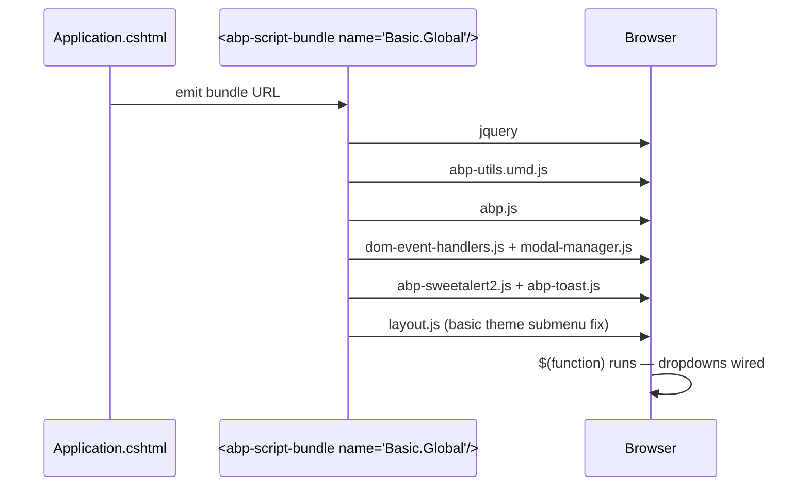

The ABP Framework's "Basic" theme is the default zero-dependency theme used by every starter template. It exists in two NPM packs that mirror the two server-rendering modes: `@abp/aspnetcore.mvc.ui.theme.basic` for Razor Pages and `@abp/aspnetcore.components.server.basictheme` for Blazor Server. Both are pure manifest packs whose `package.json` only adds dependencies — the actual JS, CSS, Razor layouts and `.razor` components live in the matching modules under `modules/basic-theme/src/`. This page walks through the manifests, the `BasicTheme : ITheme` registration, the `BasicThemeBundles` static class, the single `layout.js` shipped with the theme, and the Blazor variant's `_content/.../theme.css` style contributor.

The basic theme is intentionally minimal. It does not bring its own JavaScript framework, no SCSS preprocessing, and no extra widgets — its job is to define a Bootstrap 5 + Font Awesome shell that other modules render into through layout hooks. Anything more complex (Lepton, Lepton-X) layers on top of these two packs without replacing them.

## MVC pack manifest

```json
{
  "version": "10.2.0-rc.3",
  "name": "@abp/aspnetcore.mvc.ui.theme.basic",
  "dependencies": {
    "@abp/aspnetcore.mvc.ui.theme.shared": "~10.2.0-rc.3"
  }
}
```

The single dependency on `@abp/aspnetcore.mvc.ui.theme.shared` transitively brings in every package listed in the [Theme Shared](/js-packs/theme-shared-pack) deep dive (Bootstrap, DataTables, SweetAlert2, Toast, etc.). The basic theme adds **only** its own `layout.js` and styles on top.

## Blazor Server pack manifest

```json
{
  "version": "10.2.0-rc.3",
  "name": "@abp/aspnetcore.components.server.basictheme",
  "dependencies": {
    "@abp/aspnetcore.components.server.theming": "~10.2.0-rc.3"
  }
}
```

Same shape, different parent. The Blazor Server flavour depends on `@abp/aspnetcore.components.server.theming`, which only pulls in `@abp/bootstrap` and `@abp/font-awesome` — see [Theme Shared](/js-packs/theme-shared-pack) for the Blazor toolbox.

```mermaid
graph TD
    A[@abp/aspnetcore.mvc.ui.theme.basic] --> B[@abp/aspnetcore.mvc.ui.theme.shared]
    A2[@abp/aspnetcore.components.server.basictheme] --> B2[@abp/aspnetcore.components.server.theming]
    B --> Vendor1[14 vendor packs]
    B2 --> Vendor2[bootstrap, font-awesome]
    Vendor1 --> Core[@abp/core]
    Vendor2 --> Core
    Core --> Utils[@abp/utils]
```

## MVC server-side companion: Volo.Abp.AspNetCore.Mvc.UI.Theme.Basic

The Razor counterpart lives at `modules/basic-theme/src/Volo.Abp.AspNetCore.Mvc.UI.Theme.Basic/`:

```text
Volo.Abp.AspNetCore.Mvc.UI.Theme.Basic/
├── AbpAspNetCoreMvcUIBasicThemeModule.cs
├── BasicTheme.cs                                ← ITheme implementation
├── Bundling/
│   ├── BasicThemeBundles.cs
│   ├── BasicThemeGlobalScriptContributor.cs
│   └── BasicThemeGlobalStyleContributor.cs
├── Themes/Basic/
│   ├── Components/                              ← Brand, MainNavbar, Menu, Toolbar, PageAlerts, …
│   └── Layouts/
│       ├── Account.cshtml
│       ├── Application.cshtml
│       └── Empty.cshtml
└── wwwroot/
    └── themes/basic/layout.js                   ← The single bundled JS file
```

`BasicTheme.cs` registers itself with the `[ThemeName("Basic")]` attribute and exposes layouts through `GetLayout`:

```csharp
[ThemeName(Name)]
public class BasicTheme : ITheme, ITransientDependency
{
    public const string Name = "Basic";

    public virtual string GetLayout(string name, bool fallbackToDefault = true)
    {
        switch (name)
        {
            case StandardLayouts.Application: return "~/Themes/Basic/Layouts/Application.cshtml";
            case StandardLayouts.Account:     return "~/Themes/Basic/Layouts/Account.cshtml";
            case StandardLayouts.Empty:       return "~/Themes/Basic/Layouts/Empty.cshtml";
            default: return fallbackToDefault ? "~/Themes/Basic/Layouts/Application.cshtml" : null;
        }
    }
}
```

The theme is registered through `AbpThemingOptions` in the module file:

```csharp
Configure<AbpThemingOptions>(options =>
{
    options.Themes.Add<BasicTheme>();
    if (options.DefaultThemeName == null)
    {
        options.DefaultThemeName = BasicTheme.Name;
    }
});
```

So as long as no other module registered a `DefaultThemeName` earlier, this is the theme an ABP starter renders by default.

## Bundling: BasicThemeBundles

The bundle names are constants exposed via `BasicThemeBundles`:

```csharp
public static class BasicThemeBundles
{
    public static class Styles  { public const string Global = "Basic.Global"; }
    public static class Scripts { public const string Global = "Basic.Global"; }
}
```

The script bundle adds exactly one file — the theme's `layout.js`:

```csharp
public class BasicThemeGlobalScriptContributor : BundleContributor
{
    public override void ConfigureBundle(BundleConfigurationContext context)
    {
        context.Files.Add("/themes/basic/layout.js");
    }
}
```

The style bundle adds the Google Fonts stylesheet (marked as external so the bundler doesn't try to inline it) plus the theme's `layout.css`:

```csharp
public class BasicThemeGlobalStyleContributor : BundleContributor
{
    public override void ConfigureBundle(BundleConfigurationContext context)
    {
        context.Files.Add(new BundleFile("/themes/basic/googlefonts.css", true));
        context.Files.Add("/themes/basic/layout.css");
    }
}
```

The module composes both bundles on top of `StandardBundles` (which originate from `theme.shared`):

```csharp
Configure<AbpBundlingOptions>(options =>
{
    options
        .StyleBundles
        .Add(BasicThemeBundles.Styles.Global, bundle =>
        {
            bundle
                .AddBaseBundles(StandardBundles.Styles.Global)
                .AddContributors(typeof(BasicThemeGlobalStyleContributor));
        });
    // … parallel script bundle
});
```

`AddBaseBundles` chains so that requesting `Basic.Global` transparently materializes the entire `StandardBundles.Styles.Global` chain (Bootstrap, FA, sweetalert2, etc.) plus the basic-theme-specific styles. See [`/ui-mvc/bundling`](/ui-mvc/bundling) for the chain-resolution mechanics.

## The lone layout.js

The basic theme's entire JavaScript footprint is one file at `wwwroot/themes/basic/layout.js`:

```js
$(function () {
    $('.dropdown-menu a.dropdown-toggle').on('click', function (e) {
        $(this).next().toggleClass('show');

        if (!$(this).next().hasClass('show')) {
            $(this).parents('.dropdown-menu').first().find('.show').removeClass("show");
        }

        var $subMenu = $(this).next(".dropdown-menu");
        $subMenu.toggleClass('show');

        $(this).parents('li.nav-item.dropdown.show').on('hidden.bs.dropdown', function (e) {
            $('.dropdown-submenu .show').removeClass("show");
        });

        return false;
    });
});
```

That's it — seventeen lines that turn nested `<ul class="dropdown-menu">` markup into Bootstrap multi-level dropdowns. Bootstrap 5 doesn't ship native nested dropdowns, so this fragment bridges the gap. The logic:

1. Click on `a.dropdown-toggle` inside a `.dropdown-menu` cancels the default link behaviour (`return false`).
2. The clicked link's next sibling (`<ul class="dropdown-menu">`) gets `.show` toggled.
3. When the parent `.dropdown-menu` closes, any leftover `.show` on a sibling sub-menu is cleared so the next open starts from scratch.
4. The whole tree is closed on the parent `hidden.bs.dropdown` event.

Everything else the theme needs comes from the shared toolbox — `abp.dom.initializers.*`, `abp.message`, `abp.notify`, the modal manager — none of which need a per-theme override.

## View components shipped by the theme

The Razor `Themes/Basic/Components/` directory ships the navbar widgets the layout uses:

| Component | Default view | Role |
| --- | --- | --- |
| `Brand` | `Brand/Default.cshtml` | Logo plus app name on the navbar |
| `ContentTitle` | `ContentTitle/Default.cshtml` | Page header above the content area |
| `MainNavbar` | `MainNavbar/Default.cshtml` | Top navbar that hosts `Brand`, `Menu`, `Toolbar` |
| `Menu` | `Menu/Default.cshtml` + `_MenuItem.cshtml` | Recursive nav menu renderer |
| `PageAlerts` | `PageAlerts/Default.cshtml` | Bootstrap-styled flash messages from `IAlertManager` |
| `Toolbar` | `Toolbar/Default.cshtml` | Right-side icon strip (language, user menu) |
| `Toolbar/LanguageSwitch` | `LanguageSwitch/Default.cshtml` | Renders `AbpRequestLocalizationOptions.SupportedCultures` |
| `Toolbar/UserMenu` | `UserMenu/Default.cshtml` | Account dropdown with profile + sign-out |

These are exposed as `[ViewComponent]`s so other modules can swap their implementations through `AbpThemingOptions` — for example by replacing the brand image in a tenant-specific override.

`PageAlertsViewComponent` is where the `IAlertManager` registered in `Volo.Abp.AspNetCore.Mvc.UI` (see the [Mvc.Ui Pack](/js-packs/aspnetcore-mvc-ui) deep dive) is finally surfaced into HTML.

## Layouts: Application, Account, Empty

| Layout | Purpose |
| --- | --- |
| `Application.cshtml` | Default — sidebar + top navbar + content + footer |
| `Account.cshtml` | Centered card layout for `/Account/Login`, `/Account/Register`, etc. |
| `Empty.cshtml` | No chrome; used by error pages, embedded modals, and the modal-manager target |

`StandardLayouts.Application` is the fallback layout returned by `GetLayout` when no name matches. ABP framework code passes one of those three names whenever it needs to resolve a layout for a Razor Page — for example, the `/Account/Login` page tells the theme to render the `Account` layout.

## Blazor Server companion: Volo.Abp.AspNetCore.Components.Server.BasicTheme

The Blazor Server side lives at `modules/basic-theme/src/Volo.Abp.AspNetCore.Components.Server.BasicTheme/`:

```text
Volo.Abp.AspNetCore.Components.Server.BasicTheme/
├── AbpAspNetCoreComponentsServerBasicThemeModule.cs
├── BasicThemeToolbarContributor.cs
├── Bundling/
│   ├── BlazorBasicThemeBundles.cs
│   ├── BlazorBasicThemeScriptContributor.cs
│   └── BlazorBasicThemeStyleContributor.cs
└── Themes/Basic/
    ├── LanguageSwitch.razor
    ├── LoginDisplay.razor
    ├── LoginDisplay.razor.cs
    └── _Imports.razor
```

`BlazorBasicThemeBundles` declares the two bundle names — note these are mutable static fields, so a downstream module can rename them at startup:

```csharp
public class BlazorBasicThemeBundles
{
    public static class Styles  { public static string Global = "Blazor.BasicTheme.Global"; }
    public static class Scripts { public static string Global = "Blazor.BasicTheme.Global"; }
}
```

The Blazor script contributor is intentionally empty — Blazor Server gets everything it needs from `BlazorGlobalScriptContributor` in `Volo.Abp.AspNetCore.Components.Server.Theming`:

```csharp
public class BlazorBasicThemeScriptContributor : BundleContributor { }
```

The style contributor adds a single theme stylesheet:

```csharp
public class BlazorBasicThemeStyleContributor : BundleContributor
{
    public override void ConfigureBundle(BundleConfigurationContext context)
    {
        context.Files.AddIfNotContains("/_content/Volo.Abp.AspNetCore.Components.Web.BasicTheme/libs/abp/css/theme.css");
    }
}
```

The `/_content/Volo.Abp.AspNetCore.Components.Web.BasicTheme/` prefix is the Razor Class Library static-web-assets convention — the file physically ships in the `Volo.Abp.AspNetCore.Components.Web.BasicTheme` project that holds the Razor components themselves.



## Blazor components: LanguageSwitch, LoginDisplay

`Volo.Abp.AspNetCore.Components.Server.BasicTheme` ships two `.razor` components specific to Blazor Server:

- `LanguageSwitch.razor` — renders the language dropdown in the navbar; reads `IAbpRequestLocalizationOptionsProvider` and submits a server-side controller endpoint to switch culture (because cookies need a real HTTP roundtrip in Blazor Server).
- `LoginDisplay.razor` + `LoginDisplay.razor.cs` — wraps `<AuthorizeView>` to show either "Login" or the authenticated user's display name with a sign-out button.

The matching `Volo.Abp.AspNetCore.Components.Web.BasicTheme` project hosts the actual Blazor Web layout (`MainLayout.razor`, `NavMenu.razor`, `NavToolbar.razor`, two `NavMenuItem` levels) and supplies them to both Server and WebAssembly hosts.

## How the bundle resolves at runtime



The same pattern applies to the script bundle. Because every per-theme bundle inherits from `StandardBundles.Scripts.Global`, ordering is preserved — `abp.js` runs before `layout.js`, exactly as it must for the latter's `$(function () { … })` block to find jQuery and `abp` on the global object.

## Customising the theme

<Steps>
  <Step title="Replace view components">
    Override individual components by registering replacements with `Configure<AbpViewComponentOptions>` or by `services.Replace<...>(...)`. The Brand component is the most common override target.
  </Step>
  <Step title="Add extra scripts/styles">
    Register a custom `BundleContributor` that contributes additional files to `BasicThemeBundles.Scripts.Global` or `Styles.Global`. ABP's bundling pipeline appends them at the end.
  </Step>
  <Step title="Swap the layout">
    Implement your own `ITheme` and override `AbpThemingOptions.DefaultThemeName`. Modules unaffected by your override still work because every page resolves its layout through `IThemeManager.GetLayout(...)`.
  </Step>
  <Step title="Blazor Server: override the Razor components">
    Replace `LanguageSwitch.razor` or `LoginDisplay.razor` through the standard Blazor component-overriding mechanism — drop a same-named component into your project and adjust the `_Imports.razor`.
  </Step>
</Steps>

## Comparison: MVC vs Blazor Server basic theme

| Aspect | `@abp/aspnetcore.mvc.ui.theme.basic` | `@abp/aspnetcore.components.server.basictheme` |
| --- | --- | --- |
| Layer below | `aspnetcore.mvc.ui.theme.shared` | `aspnetcore.components.server.theming` |
| Vendor surface | Bootstrap 5 + 13 plug-ins via shared | Bootstrap 5 + Font Awesome only |
| JS files | `layout.js` (17 lines) + shared bundle | None of its own; theming pack ships `abp.js` |
| CSS files | `googlefonts.css`, `layout.css` | `theme.css` from RCL `_content/` |
| Layouts | `Application.cshtml`, `Account.cshtml`, `Empty.cshtml` | `MainLayout.razor` (from `Components.Web.BasicTheme`) |
| Bundle names | `BasicThemeBundles.Scripts.Global` / `Styles.Global` | `BlazorBasicThemeBundles.Scripts.Global` / `Styles.Global` |
| Theme registration | `BasicTheme : ITheme, ITransientDependency` | n/a (Blazor uses Razor `MainLayout`) |

The two packs deliberately don't share a Razor file — Blazor Server cannot consume `.cshtml` layouts. They share their core dependency graph (Bootstrap, Font Awesome, `abp.js`) so a hybrid host that serves both Razor and Blazor pages can include them both without conflicts.

## Loading order on a basic-themed Razor page



## Related references

- [Theme Shared Pack](/js-packs/theme-shared-pack) — the parent of both basic theme packs.
- [Mvc.Ui Pack](/js-packs/aspnetcore-mvc-ui) — `IAlertManager`, `LayoutHookViewComponent` consumed by `Application.cshtml`.
- [Vendor packs](/js-packs/third-party-vendor-packs) — Bootstrap, Font Awesome, jQuery upstream pins.
- [`/ui-mvc/bundling`](/ui-mvc/bundling) — how `Basic.Global` chains onto `StandardBundles.Global`.
- [`/ui-mvc/overview`](/ui-mvc/overview) — `ITheme` / `IThemeManager` and the layout resolution.
- [`/blazor/overview`](/blazor/overview) — Blazor Server bundle pipeline.
