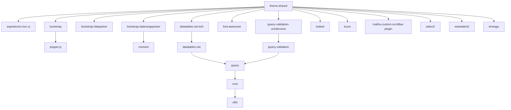
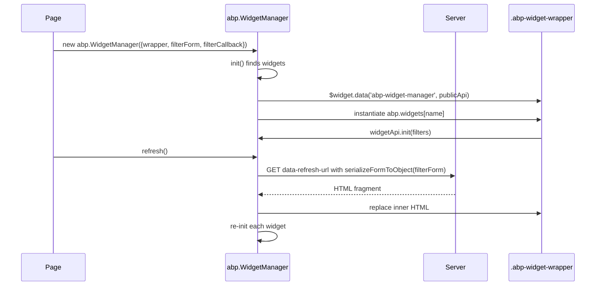
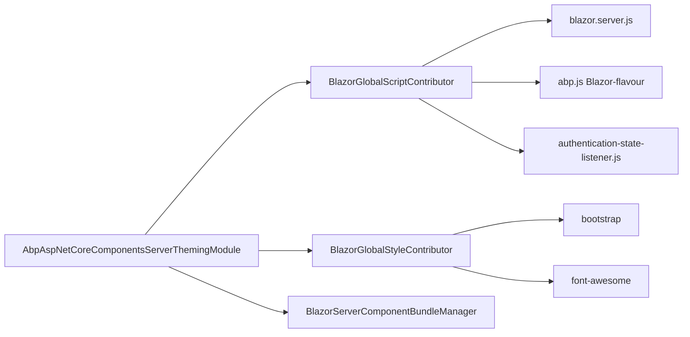
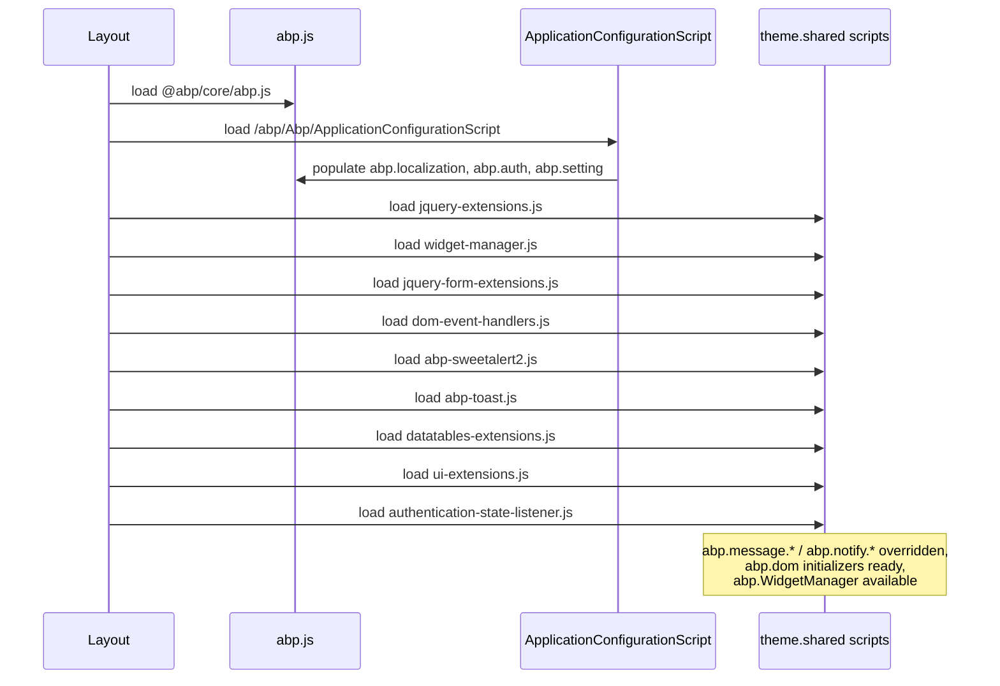

`@abp/aspnetcore.mvc.ui.theme.shared` is the largest framework pack in `npm/packs/`. Although its directory only contains `README.md`, `package.json`, and `yarn.lock`, the manifest pulls in fourteen other `@abp/*` packs and unlocks the shared client-side toolbox shipped by `framework/src/Volo.Abp.AspNetCore.Mvc.UI.Theme.Shared/`. This page covers the npm metadata, the contents of `wwwroot/libs/abp/aspnetcore-mvc-ui-theme-shared/`, the SweetAlert2 / Toast / DataTables / Widget glue, and the companion `@abp/aspnetcore.components.server.theming` pack with its `BlazorGlobalScriptContributor` for Blazor Server. Treat this as the "what's in the Razor and Blazor toolbox" reference.

The two packs sit at different layers. `aspnetcore.mvc.ui.theme.shared` is the universal Razor-Pages dependency — every theme (basic, lepton, lepton-x) layers on top of it. `aspnetcore.components.server.theming` is the analogous foundation for Blazor Server: it pulls in `@abp/bootstrap` + `@abp/font-awesome` and ships C# bundle contributors that emit the Blazor-flavoured `abp.js`. See [`/ui-mvc/overview`](/ui-mvc/overview) for the MVC theme manager and [`/blazor/overview`](/blazor/overview) for the Blazor circuit.

## Pack metadata

```json
{
  "version": "10.2.0-rc.3",
  "name": "@abp/aspnetcore.mvc.ui.theme.shared",
  "dependencies": {
    "@abp/aspnetcore.mvc.ui":             "~10.2.0-rc.3",
    "@abp/bootstrap":                     "~10.2.0-rc.3",
    "@abp/bootstrap-datepicker":          "~10.2.0-rc.3",
    "@abp/bootstrap-daterangepicker":     "~10.2.0-rc.3",
    "@abp/datatables.net-bs5":            "~10.2.0-rc.3",
    "@abp/font-awesome":                  "~10.2.0-rc.3",
    "@abp/jquery-validation-unobtrusive": "~10.2.0-rc.3",
    "@abp/lodash":                        "~10.2.0-rc.3",
    "@abp/luxon":                         "~10.2.0-rc.3",
    "@abp/malihu-custom-scrollbar-plugin":"~10.2.0-rc.3",
    "@abp/moment":                        "~10.2.0-rc.3",
    "@abp/select2":                       "~10.2.0-rc.3",
    "@abp/sweetalert2":                   "~10.2.0-rc.3",
    "@abp/timeago":                       "~10.2.0-rc.3"
  }
}
```

Installing this single pack therefore pulls in the entire default Razor toolbox: Bootstrap 5, two date pickers, DataTables (Bootstrap 5 build), Font Awesome, jQuery validation unobtrusive, Lodash, Luxon, Moment, Malihu scrollbar, Select2, SweetAlert2 and Timeago. The transitive closure also drags in `@abp/jquery`, `@abp/jquery-validation`, `@abp/popper.js`, `@abp/clipboard`, `@abp/core`, and `@abp/utils`.



## File map of wwwroot/libs/abp/aspnetcore-mvc-ui-theme-shared/

The actual JavaScript ships through the `Volo.Abp.AspNetCore.Mvc.UI.Theme.Shared` Razor Class Library:

| File | Lines | Adds |
| --- | --- | --- |
| `authentication-state/authentication-state-listener.js` | 29 | `localStorage` cross-tab sign-out detection |
| `bootstrap/dom-event-handlers.js` | 238 | `abp.dom.initializers.*` (covered in the [MVC UI pack](/js-packs/aspnetcore-mvc-ui) page) |
| `bootstrap/modal-manager.js` | 249 | `abp.ModalManager` AJAX modal helper |
| `datatables/datatables-extensions.js` | 569 | DataTables `RECORD-ACTIONS` column + AJAX adapter |
| `date-range-picker/date-range-picker-extensions.js` | 799 | Localized daterange picker presets |
| `jquery-form/jquery-form-extensions.js` | 156 | `$.fn.abpAjaxForm` |
| `jquery/jquery-extensions.js` | 195 | `$.fn.buttonBusy`, `$.fn.serializeFormToObject` |
| `jquery/widget-manager.js` | 147 | `abp.WidgetManager` |
| `sweetalert2/abp-sweetalert2.js` | 157 | Wires `abp.message.*` to `Swal.fire` |
| `toast/abp-toast.js` | 206 | `AbpToastService` for `abp.notify.*` |
| `ui-extensions.js` | 332 | `abp.ui.extensions.entityActions`, `tableColumns`, `ActionList`, `ColumnList` |

Total: ~3,077 lines. Every file is a UMD-style IIFE that mutates the `abp` namespace defined by `@abp/core/src/abp.js`. The pack therefore behaves as a giant set of side-effect imports.

## abp-sweetalert2.js: from stub to dialog

`@abp/core` ships `abp.message.info/success/warn/error/confirm/prompt` as stubs. The SweetAlert2 shim overrides them by defining `showMessage` and reusing the per-severity `abp.libs.sweetAlert.config` table:

```js
abp.libs.sweetAlert = {
    config: {
        'default': { },
        info:    { icon: 'info' },
        success: { icon: 'success' },
        warn:    { icon: 'warning' },
        error:   { icon: 'error' },
        confirm: { icon: 'warning', title: 'Are you sure?', showCancelButton: true, reverseButtons: true },
        prompt:  { icon: 'question', input: 'text',          showCancelButton: true, reverseButtons: true }
    }
};
```

`showMessage` merges those defaults with caller options, HTML-escapes the message body, replaces newlines with `<br>`, and returns a jQuery `Deferred`:

```js
var showMessage = function (type, message, title) {
    var opts = $.extend(
        {},
        abp.libs.sweetAlert.config['default'],
        abp.libs.sweetAlert.config[type],
        {
            title: title,
            html: abp.utils.htmlEscape(message).replace(/\n/g, '<br>')
        }
    );

    return $.Deferred(function ($dfd) {
        Swal.fire(opts).then(function () { $dfd.resolve(); });
    });
};
```

The `confirm` overload is signature-overloaded — the second argument is either a title string or a callback:

```js
abp.message.confirm = function (message, titleOrCallback, callback) {
    var userOpts = { text: message };

    if ($.isFunction(titleOrCallback)) {
        closeOnEsc = callback;
        callback   = titleOrCallback;
    } else if (titleOrCallback) {
        userOpts.title = titleOrCallback;
    };

    var opts = $.extend({}, abp.libs.sweetAlert.config['default'], abp.libs.sweetAlert.config.confirm, userOpts);

    return $.Deferred(function ($dfd) {
        Swal.fire(opts).then(result => {
            callback && callback(result.value);
            $dfd.resolve(result.value);
        })
    });
};
```

Both callback and `Deferred` resolution paths are supported so old code (`abp.message.confirm(msg, cb)`) and new code (`.done(value => …)`) work side by side. The `prompt` variant follows the same triple-overload pattern with an extra branch for the options-object form.

## abp-toast.js: AbpToastService

`abp.notify.*` are similarly stubbed and overridden via the new `AbpToastService`:

```js
function AbpToastService(globalOptions) {
    if (!AbpToastService.defaultOptions) {
        AbpToastService.defaultOptions = {
            closable: true,
            sticky: false,
            life: 5000,
            tapToDismiss: false,
            containerKey: undefined,
            iconClass: undefined,
            position: { top: 'auto', right: '30px', bottom: '30px', left: 'auto' }
        };
    }
    // … create container, store this.globalOptions
}
```

Each toast is a `<div class="abp-toast abp-toast-{severity}">` rendered into the container:

```js
AbpToastService.prototype.createToastElement = function(message, title, severity, options) {
    const toast = document.createElement('div');
    toast.className = `abp-toast abp-toast-${severity}`;

    const closeButton = options.closable !== false ?
        `<button class="abp-toast-close-button"><i class="fa fa-times" aria-hidden="true"></i></button>` : '';

    const titleHtml = title ? `<div class="abp-toast-title">${title}</div>` : '';

    toast.innerHTML = `
        <div class="abp-toast-icon"><i class="${this.getIconClass(severity, options)} icon"></i></div>
        <div class="abp-toast-content">${closeButton}${titleHtml}<p class="abp-toast-message">${message}</p></div>`;
    // …
    return toast;
};
```

The override block at the bottom of the file connects the service to `abp.notify`:

```js
abp.notify.info  = function (message, title, options) { new AbpToastService().info(message, title, options);  };
abp.notify.warn  = function (message, title, options) { new AbpToastService().warning(message, title, options); };
abp.notify.error = function (message, title, options) { new AbpToastService().error(message, title, options); };
```

`abp.notify.success` is wired the same way. Each call constructs a new `AbpToastService` instance but they all share the singleton `AbpToastService.defaultOptions` and the same DOM container, so callers don't accidentally create overlapping containers.

| Severity | Icon class | abp.notify entry |
| --- | --- | --- |
| `success` | `fa fa-check` | `abp.notify.success` |
| `info` | `fa fa-info-circle` | `abp.notify.info` |
| `warning` | `fa fa-exclamation-triangle` | `abp.notify.warn` |
| `error` | `fa fa-exclamation-circle` | `abp.notify.error` |

Auto-dismiss is `setTimeout(() => this.remove(toast), mergedOptions.life)` with a default `life: 5000` ms. Setting `sticky: true` opts out.

## widget-manager.js: server-rendered AJAX widgets

`abp.WidgetManager` is the runtime engine behind `<abp-widget>` tag helpers and ABP CMS Kit widgets. Each widget is a `.abp-widget-wrapper` div with `data-widget-name="MyWidget"`, `data-refresh-url="/api/…"`, and optional `data-widget-filter` pointing at a form.



The `init` loop instantiates a per-widget controller, reading `abp.widgets[name]`:

```js
$widgets.each(function () {
    var $widget = $(this);
    $widget.data('abp-widget-manager', publicApi);
    var widgetName = $widget.attr('data-widget-name');
    var widgetApiClass = abp.widgets[widgetName];
    if (widgetApiClass) {
        var widgetApi = new widgetApiClass($widget);
        $widget.data('abp-widget-api', widgetApi);
        if (widgetApi.init) {
            widgetApi.init(getFilters($widget));
        }
    }
});
```

`getFilters` merges three sources:

1. `opts.filterForm.serializeFormToObject()` (when a filter form is bound).
2. `opts.filterCallback()` if provided in the manager options.
3. `widgetApi.getFilters()` from the widget's own controller.

CMS Kit comment, rating, and reaction widgets register themselves via `abp.widgets.CmsCommenting = function ($widget) {…}` so the manager can find them.

## jquery-extensions.js: button-busy + serializeFormToObject

`$.fn.buttonBusy(isBusy)` swaps a button's icon for `fa fa-spin fa-spinner` and optionally swaps the inner span text for `data-busy-text` — both are restored on `buttonBusy(false)`. The icon and text classes are saved on the button's data so a nested call doesn't lose state.

`$.fn.serializeFormToObject(camelCase = true)` is the antidote to `serializeArray()` losing unchecked checkboxes and disabled inputs:

```js
$.fn.serializeFormToObject = function (camelCase) {
    var data = $(this).serializeArray();

    // add unchecked checkboxes (serializeArray ignores them)
    $(this).find("input[type=checkbox]").each(function () {
        if (!$(this).is(':checked')) { data.push({ name: this.name, value: this.checked }); }
    });

    //add also disabled items
    $(':disabled[name]', this).each(function () {
        var value = $(this).is(':checkbox') ? $(this).is(':checked') : $(this).val();
        data.push({ name: this.name, value: value });
    });

    // map to object with dotted-path expansion + camelCase
    // …
};
```

`toCamelCase` lowercases the first letter and the first letter after each dot. The result is that an `<input name="Sorting.Direction">` becomes `{ sorting: { direction: ... } }` — exactly the shape the ABP API contracts expect.

## datatables-extensions.js: RECORD-ACTIONS column

The DataTables shim defines a `RECORD-ACTIONS` column type that renders a Bootstrap dropdown of contextual operations per row. The action descriptor is a typed bag:

| Field | Purpose |
| --- | --- |
| `text` | Visible label (string or `(record, table) => string`) |
| `icon` | Font Awesome class (without the `fa-` prefix) |
| `iconClass` | Full class override |
| `displayNameHtml` | When true, `text` is treated as HTML |
| `visibilityField` | Boolean or `(record, table) => boolean` |
| `confirmMessage` | `({record, table}) => string`; opens an `abp.message.confirm` |
| `action` | `({record, table}) => void` invoked on click |
| `divider` | Boolean, string, or `(record, table) => HTMLString` |

The dropdown builder applies `record`-driven enabled/disabled rules through `_createDropdownItem`, which wires the click handler:

```js
if (fieldItem.action) {
    $a.click(function (e) {
        e.preventDefault();
        if (!$(this).closest('li').hasClass('disabled')) {
            if (fieldItem.confirmMessage) {
                abp.message.confirm(fieldItem.confirmMessage({ record: record, table: tableInstance }))
                    .done(function (accepted) { if (accepted) { fieldItem.action({ record: record, table: tableInstance }); } });
            } else {
                fieldItem.action({ record: record, table: tableInstance });
            }
        }
    });
}
```

`abp.localization.getResource('AbpUi')` is the source for the dropdown's default labels (e.g. the kebab menu title).

## ui-extensions.js: contributor lists on top of LinkedList

`ui-extensions.js` is the bridge between `@abp/utils`'s `LinkedList` and the ABP contributor pattern. It registers four named lists:

```js
abp.ui.extensions.ActionList = function () { return new abp.utils.common.LinkedList(); };
abp.ui.extensions.ColumnList = function () { return new abp.utils.common.LinkedList(); };
```

Plus two registries that map a list name to an array of contributor callbacks: `abp.ui.extensions.entityActions` and `abp.ui.extensions.tableColumns`. Module code calls

```js
abp.ui.extensions.entityActions.get('identityServer.users').addContributor(function (actionList) {
    actionList.add({ text: 'Impersonate', action: ({ record }) => impersonate(record.id) }).tail();
});
```

When the host invokes `entityActions.get('identityServer.users').actions`, the registry replays every contributor against a fresh `ActionList`, yielding a freshly-ordered list. This is the supported way for one module to extend another module's grid actions or column set without forking.

## authentication-state-listener.js: cross-tab sign-out

A 29-line listener that uses `localStorage` to detect when another tab has signed in or out:

```js
const stateKey = 'authentication-state-id';

window.addEventListener('load', function () {
    if (!abp || !abp.currentUser) { return; }

    if (!abp.currentUser.isAuthenticated) { localStorage.removeItem(stateKey); }
    else                                  { localStorage.setItem(stateKey, abp.currentUser.id); }

    window.addEventListener('storage', function (event) {
        if (event.key !== stateKey || event.oldValue === event.newValue) { return; }
        if (event.oldValue || !event.newValue) { window.location.reload(); }
        else                                   { location.assign('/'); }
    });
});
```

Three rules:

- Sign-in writes the user id under `authentication-state-id`; sign-out removes it.
- A `storage` event on the same key in another tab where the id changed triggers a reload.
- If the new state is "signed in" but the old state was empty, the listener redirects to `/` so a freshly authenticated tab lands on the dashboard.

## Companion: @abp/aspnetcore.components.server.theming

The Blazor Server counterpart at `npm/packs/aspnetcore.components.server.theming/`:

```json
{
  "name": "@abp/aspnetcore.components.server.theming",
  "version": "10.2.0-rc.3",
  "dependencies": {
    "@abp/bootstrap":     "~10.2.0-rc.3",
    "@abp/font-awesome":  "~10.2.0-rc.3"
  }
}
```

Notice how stripped-down this manifest is — no SweetAlert2, no DataTables, no Select2. Blazor circuits replace DOM imperatively, so most jQuery-era plug-ins are unnecessary. The matching C# project is `framework/src/Volo.Abp.AspNetCore.Components.Server.Theming/`, which provides three bundling contributors and a manager:

```text
Volo.Abp.AspNetCore.Components.Server.Theming/
├── AbpAspNetCoreComponentsServerThemingModule.cs
└── Bundling/
    ├── BlazorGlobalBundles.cs
    ├── BlazorGlobalScriptContributor.cs
    ├── BlazorGlobalStyleContributor.cs
    └── BlazorServerComponentBundleManager.cs
```

`BlazorGlobalScriptContributor.cs` shows what scripts a Blazor Server host loads:

```csharp
public class BlazorGlobalScriptContributor : BundleContributor
{
    public override void ConfigureBundle(BundleConfigurationContext context)
    {
        var options = context.ServiceProvider.GetRequiredService<IOptions<AbpAspNetCoreComponentsWebOptions>>().Value;
        if (!options.IsBlazorWebApp)
        {
            context.Files.AddIfNotContains("/_framework/blazor.server.js");
        }
        context.Files.AddIfNotContains("/_content/Volo.Abp.AspNetCore.Components.Web/libs/abp/js/abp.js");
        context.Files.AddIfNotContains("/_content/Volo.Abp.AspNetCore.Components.Web/libs/abp/js/authentication-state-listener.js");
    }
}
```

The Blazor `abp.js` file (`framework/src/Volo.Abp.AspNetCore.Components.Web/wwwroot/libs/abp/js/abp.js`) is a stripped 258-line variant that only exposes:

- `abp.domReady(fn)` — a small DOM-ready helper.
- `abp.utils.setCookieValue` / `abp.utils.getCookieValue` — cookie I/O used by the auth-state listener.



`BlazorGlobalStyleContributor` adds the Bootstrap and Font Awesome CSS shipped through `@abp/bootstrap` and `@abp/font-awesome` — which is why both vendor packs sit as direct dependencies of this otherwise tiny manifest.

`IsBlazorWebApp` toggles whether to ship `blazor.server.js`: in the new Blazor Web App hosting model the framework injects its own circuit bootstrap, so the contributor skips the explicit reference. See [`/blazor/overview`](/blazor/overview).

## Companion: @abp/aspnetcore.components.server.basictheme

The same layer-on-layer composition reappears at `npm/packs/aspnetcore.components.server.basictheme/`:

```json
{
  "name": "@abp/aspnetcore.components.server.basictheme",
  "dependencies": { "@abp/aspnetcore.components.server.theming": "~10.2.0-rc.3" }
}
```

It depends on the theming pack above and adds only basic-theme-specific overrides. See [Basic theme pack](/js-packs/theme-basic-pack) for the MVC + Blazor variants together.

## Loading order recap (Razor host)



See [`/ui-mvc/bundling`](/ui-mvc/bundling) for how this order is enforced by the bundle contributors under `Volo.Abp.AspNetCore.Mvc.UI.Theme.Shared/Bundling/`.

## Related references

- [Core](/js-packs/core) — `abp.message`, `abp.notify`, `abp.ui.extensions` skeleton.
- [Mvc.Ui Pack](/js-packs/aspnetcore-mvc-ui) — `abp.dom.initializers.*` and `abp.ModalManager`.
- [Basic theme pack](/js-packs/theme-basic-pack) — concrete MVC + Blazor Server basic theme layer.
- [Vendor packs](/js-packs/third-party-vendor-packs) — the 14 vendor wrappers this pack depends on.
- [`/ui-mvc/bundling`](/ui-mvc/bundling), [`/ui-mvc/overview`](/ui-mvc/overview), [`/blazor/overview`](/blazor/overview).
